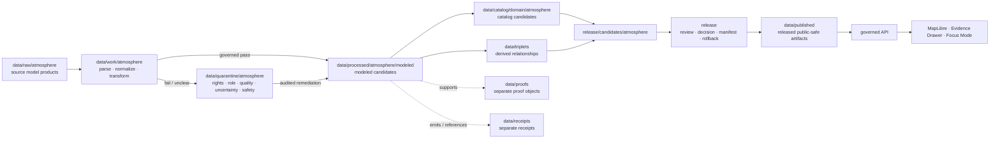

<!-- [KFM_META_BLOCK_V2]
doc_id: kfm://doc/data-processed-atmosphere-modeled-readme
title: data/processed/atmosphere/modeled/ — Atmosphere Modeled Processed Data
version: v0.2.0
type: directory-readme
subtype: processed-atmosphere-modeled-parent-lane
status: repository-grounded draft; parent/child ownership, payload inventory, accepted profiles, validators, fixtures, receipts, proof, release, and runtime behavior remain bounded
owners:
  - "NEEDS VERIFICATION — Atmosphere domain steward"
  - "NEEDS VERIFICATION — forecast, model, ensemble, and remote-sensing steward"
  - "NEEDS VERIFICATION — source-role, scientific-method, uncertainty, data-quality, and sensitivity reviewers"
  - "NEEDS VERIFICATION — data, evidence, policy, release, correction, rollback, and docs stewards"
created: NEEDS VERIFICATION — one-character placeholder existed before v0.1 expansion
updated: 2026-07-25
policy_label: public-doc; processed-stage; atmosphere; modeled-parent; atmospheric-model-field; source-role-aware; uncertainty-aware; claim-bounded; release-gated; no-direct-public-path
path: data/processed/atmosphere/modeled/README.md
truth_posture: >
  CONFIRMED exact target path, prior blob, Directory Rules placement, current Atmosphere parent lane,
  modeled/remote-sensing child README, ForecastContext semantic contract and scaffold schema posture,
  model-versus-observed test-boundary maturity, Atmosphere workflow holds, and PROCESSED lifecycle
  boundary / PROPOSED modeled admission profile, normalized model packet, placement rules, and
  downstream promotion expectations / UNKNOWN recursive payload inventory, accepted universal modeled
  contract or schema profile, production validators, substantive fixtures, receipts, proof closure,
  release instances, hosting, and public behavior / NEEDS VERIFICATION accountable owners, canonical
  ownership among modeled, forecast_context, aod, and derived lanes, model and ensemble vocabulary,
  scientific-fitness rules, correction propagation, cache invalidation, and rollback drills
evidence_snapshot:
  repository: bartytime4life/Kansas-Frontier-Matrix
  base_ref: main
  base_commit: fbea0df2280d15abdf468071c113d1f9df5f1620
  prior_blob: cb26ce47b70ebe4ea11ff7b62c107e12607e3e7c
  directory_rules_blob: 2affb080e6f0043867c64c7f06c1ca52030fbd55
  atmosphere_parent_blob: e37ce206f396f832c414fc46a70dd9cd9b3f64e4
  modeled_remote_sensing_blob: 670b1d351fb7e1684b06370a53d215e76c0afa2a
  forecast_context_contract_blob: bca521253a1bf1ed5c429766069e8b6da066eb5c
  model_vs_observed_test_readme_blob: 7475d91c5592da0b2e17cbd1ca8228c7d7cf7229
  atmosphere_workflow_blob: 3bd0183481a73c1aaad011e4ef1e361a3ee6b5f2
related:
  - ../README.md
  - ./remote-sensing/README.md
  - ../forecast_context/README.md
  - ../aod/README.md
  - ../derived/README.md
  - ../aggregate/README.md
  - ../climate_anomaly/README.md
  - ../../README.md
  - ../../../README.md
  - ../../../../docs/domains/atmosphere/README.md
  - ../../../../docs/domains/atmosphere/CANONICAL_PATHS.md
  - ../../../../docs/domains/atmosphere/OBJECT_FAMILY_MAP.md
  - ../../../../docs/domains/atmosphere/POLICY.md
  - ../../../../docs/domains/atmosphere/PUBLICATION_POSTURE.md
  - ../../../../docs/domains/atmosphere/SENSITIVITY.md
  - ../../../../docs/doctrine/directory-rules.md
  - ../../../../contracts/domains/atmosphere/ForecastContext.md
  - ../../../../contracts/domains/atmosphere/WindField.md
  - ../../../../contracts/domains/atmosphere/SmokeContext.md
  - ../../../../contracts/domains/atmosphere/AODRaster.md
  - ../../../../contracts/domains/atmosphere/AirObservation.md
  - ../../../../contracts/domains/atmosphere/WeatherObservation.md
  - ../../../../schemas/contracts/v1/domains/atmosphere/ForecastContext.schema.json
  - ../../../../schemas/contracts/v1/domains/atmosphere/AODRaster.schema.json
  - ../../../../policy/domains/atmosphere/README.md
  - ../../../../tests/domains/atmosphere/policy-deny/model-vs-observed/README.md
  - ../../../raw/atmosphere/README.md
  - ../../../work/atmosphere/README.md
  - ../../../quarantine/atmosphere/README.md
  - ../../../catalog/domain/atmosphere/README.md
  - ../../../triplets/README.md
  - ../../../proofs/README.md
  - ../../../receipts/README.md
  - ../../../registry/sources/atmosphere/README.md
  - ../../../../release/candidates/atmosphere/README.md
  - ../../../../release/README.md
notes:
  - "Same-path Markdown modernization only; no modeled bytes, source state, contract, schema, policy, validator, workflow, proof, release, route, hosting, or KFM publication state changed."
  - "Modeled artifacts remain model or forecast context; assimilation, calibration, point sampling, downscaling, interpolation, or comparison with observations does not convert them into observations."
  - "The modeled parent, forecast_context, aod, derived, and modeled/remote-sensing lanes must not become parallel truth stores; canonical ownership remains unresolved and is not decided here."
  - "The child modeled/remote-sensing README still contains a stale note that the modeled parent was unconfirmed; correcting that child is outside this one-file change."
  - "Rollback target for v0.2.0 is prior blob SHA `cb26ce47b70ebe4ea11ff7b62c107e12607e3e7c`."
[/KFM_META_BLOCK_V2] -->

<a id="top"></a>

# `data/processed/atmosphere/modeled/` — Atmosphere modeled processed data

> **One-line purpose.** Hold normalized Atmosphere model-run and modeled-field candidates while preserving model identity, source role, run and valid times, variables, grid support, uncertainty, scientific limits, correction lineage, and downstream-use boundaries.

[](#status)
[](#authority-level)
[](#what-belongs-here)
[](#outputs)
[](#model-run-time-and-uncertainty-discipline)
[](#validation)

> [!IMPORTANT]
> **A model output is not an observation, official forecast, advisory, or public truth surface.** A model field may be scientifically useful while still being stale, uncertainty-limited, non-comparable, rights-unclear, weakly validated, policy-held, unreleased, or unsuitable for a consequential claim.

**Path:** `data/processed/atmosphere/modeled/README.md`  
**Owning root:** `data/`  
**Lifecycle phase:** `processed/`  
**Domain segment:** `atmosphere/`  
**Lane role:** parent classification lane for modeled and forecast-derived context  
**Direct public access:** denied  
**Last reviewed:** 2026-07-25

**Quick navigation:** [Purpose](#purpose) · [Authority level](#authority-level) · [Status](#status) · [What belongs here](#what-belongs-here) · [What does NOT belong here](#what-does-not-belong-here) · [Inputs](#inputs) · [Outputs](#outputs) · [Validation](#validation) · [Review burden](#review-burden) · [Related folders](#related-folders) · [ADRs](#adrs) · [Last reviewed](#last-reviewed) · [Modeled-lane placement and ownership](#modeled-lane-placement-and-ownership) · [Modeled admission profile](#modeled-admission-profile) · [Model-run, time, and uncertainty discipline](#model-run-time-and-uncertainty-discipline) · [Knowledge-character and claim guardrails](#knowledge-character-and-claim-guardrails) · [Lifecycle and promotion](#lifecycle-and-promotion) · [Correction and rollback](#correction-and-rollback)

---

## Purpose

This directory is the Atmosphere domain's **PROCESSED-stage parent lane for modeled-product candidates**. It may hold normalized model-run collections, modeled atmospheric fields, ensemble or probabilistic products, forecast-derived context, model QA and uncertainty context, and modeled remote-sensing comparisons after RAW capture, WORK transformation, and QUARANTINE holds have been addressed.

The lane exists to preserve the answer to seven questions before downstream use:

1. Which model, product, configuration, cycle, run, and member produced the artifact?
2. Which initialization, run, valid, lead, retrieval, processing, correction, and supersession times apply?
3. Which parameter, units, vertical level, grid, projection, resolution, extent, and nodata semantics apply?
4. Which inputs, assimilation sources, post-processing steps, downscaling, interpolation, or derived transforms contributed?
5. Which uncertainty, ensemble, skill, QA, caveat, and scientific-fitness limits qualify the product?
6. Which knowledge character and source role survive into every downstream carrier?
7. Which uses are allowed, restricted, narrowed, delayed, abstained from, or denied?

It is not a RAW model archive, observation store, official forecast service, advisory authority, proof store, receipt authority, catalog authority, release authority, public layer root, API/UI payload store, runtime cache, AI answer store, or emergency/life-safety system.

## Authority level

**Implementation-bearing lifecycle lane.** The path is CONFIRMED in the repository and remains under `data/processed/atmosphere/`, consistent with Directory Rules' lifecycle and domain-placement rules.

Its authority is deliberately narrow:

- it may carry processed model-run and modeled-field candidates plus lane-local explanatory metadata;
- it does not define canonical object meaning—that remains in semantic contracts such as `ForecastContext`, `WindField`, `SmokeContext`, and `AODRaster`;
- it does not define machine shape—that remains in accepted schemas or profiles;
- it does not decide scientific fitness, source admission, policy, evidence closure, release, or public exposure;
- it does not replace narrower object-family, proxy, observation, advisory, climate, aggregate, or derived lanes;
- it does not convert model output into observation truth through calibration, assimilation, interpolation, point sampling, or generated language.

## Status

| Surface | Status | Evidence-bounded interpretation |
|---|---|---|
| This README and path | **CONFIRMED** | The file exists at the pinned base and is updated in place. |
| Parent Atmosphere processed lane | **CONFIRMED** | `data/processed/atmosphere/README.md` identifies `modeled/` as a modeled-products lane and denies direct public use. |
| `modeled/remote-sensing/` child | **CONFIRMED README / draft** | The child exists for products combining model-field and remote-sensing roles. Its statement that the parent was unconfirmed is now stale and remains a separate documentation repair. |
| `ForecastContext` semantic contract | **CONFIRMED repository document / draft** | Defines `ATMOSPHERIC_MODEL_FIELD`, run lineage, uncertainty, model-versus-observation separation, and non-release authority. |
| Paired `ForecastContext` schema | **CONFIRMED scaffold / not enforceable as verified** | The contract reports empty properties, `additionalProperties: true`, and unresolved title casing. |
| Model-versus-observed test boundary | **CONFIRMED README-only maturity** | The test README reports a placeholder adjacent test, default-deny Rego scaffold, permissive schemas, and no established substantive executable enforcement. |
| Atmosphere domain workflow | **CONFIRMED explicit holds** | The workflow is read-only and intentionally holds validation, proof, and release dry-run maturity; it does not publish. |
| Real modeled payload inventory | **UNKNOWN** | This documentation task did not inspect or expose modeled data payloads. |
| Universal modeled contract/schema profile | **NEEDS VERIFICATION** | No accepted parent-lane profile spanning all modeled products was verified. |
| Production validators, substantive fixtures, receipts, proof, release, hosting, public behavior | **UNKNOWN / held** | Presence in this directory creates none of these states. |

<a id="accepted-contents"></a>

## What belongs here

Good fits are processed modeled artifacts whose run identity, source role, method, support, uncertainty, and limits remain inspectable, including:

- normalized model-run or forecast-run collections that span more than one narrow object family;
- modeled atmospheric fields keyed to an explicit model, product, cycle, run, valid time, variable, units, grid, and version;
- ensemble members, ensemble summaries, probability fields, spread products, percentiles, and scenario members whose semantics remain explicit;
- analyses, reanalyses, hindcasts, nowcasts, downscaled fields, bias-corrected fields, interpolated fields, and assimilated products that remain labeled modeled or derived;
- modeled wind, smoke, air-quality, weather, or forecast context when no narrower accepted object-family lane owns the primary artifact;
- modeled remote-sensing comparison products in `modeled/remote-sensing/` when model and proxy roles remain separately recoverable;
- stale-state, supersession, correction, reprocessing, model-run, QA, skill, uncertainty, and caveat sidecars that are not receipts, proofs, policies, catalogs, or release decisions;
- public-candidate generalized or visualization-ready modeled derivatives that remain upstream of catalog and release review;
- object-ready candidates prepared for future contract/schema validation, EvidenceBundle closure, catalog review, or release review;
- lane-local README or non-release manifest notes that explain modeled identity without becoming authority records.

<a id="exclusions"></a>

## What does NOT belong here

Do not place these in `data/processed/atmosphere/modeled/`:

- RAW GRIB, NetCDF, Zarr, COG, source-native tiles, model downloads, run payloads, QA payloads, logs, or source captures;
- WORK parsing, reprojection, variable extraction, model tuning, experiment notebooks, temporary masks, scratch joins, or incomplete transformations;
- QUARANTINE material with unresolved rights, source role, model identity, time semantics, uncertainty, QA, scientific fitness, sensitivity, dispute, or staleness state;
- observed sensor readings, regulatory archive observations, station records, PM2.5 or ozone measurements, AQI reports, or weather observations;
- AOD rasters, satellite masks, or other remote-sensing proxies presented as model fields or ground observations;
- official advisories, warnings, emergency instructions, protective-action guidance, medical advice, or life-safety outputs;
- climate normals, climate anomalies, attribution claims, trend-significance claims, event truth, hazard truth, damage, exposure, health, or regulatory conclusions unsupported by separate evidence and authority;
- canonical `ForecastContext`, `AODRaster`, observation, advisory, climate, aggregate, or derived records duplicated here when a narrower accepted lane owns them;
- public maps, tiles, downloads, API payloads, UI state, Focus Mode carriers, Evidence Drawer payloads, search indexes, runtime caches, or AI answers;
- semantic contracts, JSON Schemas, policy rules, validators, tests, fixtures, executable pipelines, source descriptors, catalogs, STAC/DCAT/PROV projections, triplets, proofs, receipts, releases, correction notices, rollback cards, or published artifacts;
- transform secrets, private thresholds, restricted exact locations, credentials, internal access details, or parameters whose disclosure would weaken a sensitivity or security control.

## Inputs

Inputs may enter this lane only through governed lifecycle transitions from:

- `data/work/atmosphere/` after model identity, source role, run identity, time semantics, parameter metadata, grid support, rights, uncertainty, validation, sensitivity, and correction posture are recorded;
- `data/quarantine/atmosphere/` after the hold condition is resolved and the remediation decision is auditable;
- accepted Atmosphere pipelines or tools that preserve source bytes by reference, model/configuration version, input digests, run lineage, transform lineage, uncertainty, QA, and correction state;
- accepted processed object-family or aggregate lanes when assembling a multi-object modeled product without replacing those inputs' identities;
- approved cross-domain context where ownership remains with the source domain and the relationship is explicit, evidence-backed, policy-reviewed, and non-authoritative for the source domain.

A connector-to-PROCESSED, watcher-to-PROCESSED, public-upload-to-PROCESSED, renderer-to-PROCESSED, or AI-to-PROCESSED shortcut is not an accepted normal path. Connectors, watchers, renderers, and AI systems do not silently promote or originate canonical truth.

## Outputs

This lane may support downstream candidates for:

- `data/catalog/domain/atmosphere/` and accepted STAC/DCAT/PROV projections;
- `data/triplets/` or other relationship projections that preserve model identity, run identity, source role, time kinds, method, uncertainty, and evidence references;
- separate `data/proofs/` and `data/receipts/` objects;
- candidate LayerManifest or layer-registry inputs in their proper authority roots;
- `release/candidates/atmosphere/` after identity, rights, uncertainty, scientific fitness, validation, evidence, review, correction, and rollback obligations are met;
- `data/published/` only through a governed release transition and separate released-artifact path;
- governed API, MapLibre, Evidence Drawer, export, Focus Mode, or AI carriers only after public-safe release.

> [!CAUTION]
> Ordinary public clients must not read this directory directly. Forecast usefulness, renderability, model resolution, apparent precision, or a green held workflow does not establish observation truth, release state, or public authority.

<a id="validation-checklist"></a>

## Validation

No universal modeled-parent production validator suite was verified in this task.

Current evidence is narrower:

- the `ForecastContext` schema is a permissive scaffold rather than field-level enforcement;
- the model-versus-observed test boundary is README-only, with a placeholder adjacent test and default-deny policy scaffold;
- the Atmosphere workflow intentionally holds validation, proof, and release dry-run maturity and fails when executable maturity unexpectedly surfaces without deliberate graduation.

A credible modeled-product validation profile should check, at minimum:

1. model, provider, product, configuration, version, cycle, run, and member identity;
2. source role and knowledge character;
3. initialization, run, valid, lead, retrieval, processing, correction, supersession, and release times;
4. parameter name/code, units, vertical level or height, accumulation or averaging semantics, and conversion lineage;
5. grid, CRS, resolution, extent, cell registration, nodata, masks, and geometry lineage;
6. ensemble, probability, percentile, scenario, and spread semantics;
7. assimilation, calibration, bias correction, downscaling, interpolation, resampling, and post-processing disclosure;
8. QA, skill, validation sample, uncertainty, confidence, caveats, limitations, and applicability;
9. input identities, input roles, content digests, method/configuration digest, and deterministic identity where practical;
10. stale-state, correction, reprocessing, supersession, withdrawal, and cache-invalidation posture;
11. evidence references, rights, sensitivity, policy decision, review state, release hold, correction path, and rollback target;
12. downstream carrier preservation so model fields cannot become observations, advisories, proxies, regulatory claims, or unsupported AI language.

Fail closed, quarantine, abstain, or deny when a material identity, role, time, method, uncertainty, rights, evidence, review, or release field is missing, contradictory, unsupported, stale beyond policy, or unsafe for the requested use.

## Review burden

Review burden increases with consequence:

| Change | Minimum review burden |
|---|---|
| README wording, navigation, or link repair | Docs steward plus Atmosphere/domain reviewer. |
| New modeled child lane or placement rule | Atmosphere steward, model/forecast steward, Directory Rules reviewer, and affected object-family steward. |
| Model identity, time, ensemble, parameter, grid, or uncertainty semantics | Forecast/model subject-matter reviewer plus contract/schema and validation reviewers. |
| Model-versus-observation, model-versus-proxy, or forecast-versus-advisory rule | Source-role, policy, test/QA, API/UI/AI, and release reviewers. |
| Public-facing layer, API, Focus Mode, export, or AI linkage | Evidence, rights, policy, release, correction, rollback, and domain review; independent approval where policy requires it. |
| Emergency, health, exposure, regulatory, or protective-action implication | Deny as an ordinary documentation change; require the owning external authority and separately governed KFM decision surface. |

Accountable owners and CODEOWNERS entries remain **NEEDS VERIFICATION**.

<a id="repo-fit"></a>

## Related folders

| Responsibility | Correct home | Boundary |
|---|---|---|
| RAW model products and source payloads | [`data/raw/atmosphere/`](../../../raw/atmosphere/README.md) | Immutable intake; not this lane. |
| In-process parsing, transformation, experiments, and QA | [`data/work/atmosphere/`](../../../work/atmosphere/README.md) | Not promoted state. |
| Unresolved rights, role, quality, uncertainty, or safety state | [`data/quarantine/atmosphere/`](../../../quarantine/atmosphere/README.md) | Held until governed resolution. |
| Modeled parent candidates | `data/processed/atmosphere/modeled/` | This lane. |
| Modeled plus remote-sensing comparisons | [`modeled/remote-sensing/`](./remote-sensing/README.md) | Child role-combination lane; no proxy/model collapse. |
| `ForecastContext` object-family candidates | [`forecast_context/`](../forecast_context/README.md) | Narrower object-family lane when ForecastContext is primary. |
| AOD and remote-sensing proxy candidates | [`aod/`](../aod/README.md) | Proxy/mask context; not modeled or observed by default. |
| General cross-object derivatives | [`derived/`](../derived/README.md) | Derived candidates that do not have a narrower canonical lane. |
| Aggregate products | [`aggregate/`](../aggregate/README.md) | Aggregation family; not a modeled-parent substitute. |
| Semantic meaning | [`contracts/domains/atmosphere/`](../../../../contracts/domains/atmosphere/README.md) | Contracts, not data. |
| Machine shape | [`schemas/contracts/v1/domains/atmosphere/`](../../../../schemas/contracts/v1/domains/atmosphere/README.md) | Schemas/profiles, not data. |
| Admissibility and anti-collapse rules | [`policy/domains/atmosphere/`](../../../../policy/domains/atmosphere/README.md) | Policy authority. |
| Model-versus-observed test boundary | [`tests/.../model-vs-observed/`](../../../../tests/domains/atmosphere/policy-deny/model-vs-observed/README.md) | README-only maturity; substantive enforcement not established. |
| Source registry | [`data/registry/sources/atmosphere/`](../../../registry/sources/atmosphere/README.md) | Source identity, rights, cadence, and access posture. |
| Catalog and graph projections | [`data/catalog/domain/atmosphere/`](../../../catalog/domain/atmosphere/README.md), [`data/triplets/`](../../../triplets/README.md) | Downstream discovery and relationship surfaces. |
| Proofs and receipts | [`data/proofs/`](../../../proofs/README.md), [`data/receipts/`](../../../receipts/README.md) | Separate trust-object families. |
| Release decisions and rollback | [`release/`](../../../../release/README.md) | Promotion, correction, withdrawal, and rollback authority. |
| Released artifacts | [`data/published/`](../../../published/README.md) | Public-safe bytes only after governed release. |

## ADRs

No accepted ADR specific to the canonical relationship among `modeled/`, `forecast_context/`, `aod/`, `derived/`, and `modeled/remote-sensing/` was verified in this task.

Applicable governance includes:

- Directory Rules §12 for the `data/<phase>/<domain>/` lane pattern;
- Directory Rules §13 for preventing parallel authority and lifecycle shortcuts;
- Directory Rules §15 for this folder README contract;
- ADR-0001's schema-home rule as referenced by current Atmosphere documentation.

Changing canonical ownership, creating aliases or compatibility paths, moving data, or allowing both parent and object-family lanes to hold the same canonical artifacts requires an accepted placement decision plus a migration, validation, and rollback plan.

## Last reviewed

**2026-07-25**

Review again when:

- a modeled payload, child directory, contract, schema, validator, substantive fixture, or model-run receipt is added;
- the model-versus-observed suite graduates from placeholder/scaffold status;
- the Atmosphere workflow graduates any validation, proof, or release hold;
- canonical ownership among modeled, forecast, proxy, aggregate, and derived lanes is decided;
- a public model-field carrier, LayerManifest relationship, API route, or release instance becomes real;
- correction, supersession, cache invalidation, or rollback behavior changes.

<a id="child-lanes"></a>
<a id="directory-map"></a>

## Modeled-lane placement and ownership

The verified repository currently exposes these related paths:

| Lane | Verified relationship | Current posture |
|---|---|---|
| `modeled/` | Parent classification lane for modeled candidates | Path CONFIRMED; universal profile and canonical breadth NEEDS VERIFICATION |
| `modeled/remote-sensing/` | Combines model-field and remote-sensing roles | Child README CONFIRMED; parent-unconfirmed note is stale |
| `forecast_context/` | `ForecastContext` object-family lane | Path and draft contract CONFIRMED; schema remains scaffold |
| `aod/` | `AODRaster` proxy/mask lane | Distinct from model and observation |
| `derived/` | General cross-object derivative lane | Distinct from canonical model/object-family stores |
| `aggregate/` | Aggregate and rollup family | Distinct from modeled classification |

Use this placement rule:

1. Identify the artifact's primary semantic object and knowledge character.
2. Prefer the narrow accepted object-family lane when one owns the artifact.
3. Use `modeled/` for model-run collections, multi-object modeled products, or parent classification only when no narrower accepted lane owns the canonical artifact.
4. Use `modeled/remote-sensing/` only when model and remote-sensing roles are both intrinsic and separately recoverable.
5. Never store identical canonical bytes or independently evolving records in two lanes.
6. When two lanes must coexist, designate one canonical owner and make the other an index, reference, compatibility surface, or derived product with stable linkage.
7. Record the placement decision, migration path, validation, correction, and rollback before real data moves.

> [!WARNING]
> The existing `modeled/remote-sensing/README.md` still says the parent modeled README was not confirmed. The parent is now CONFIRMED, but this one-file task does not edit the child. Treat that sentence as stale documentation, not as current repository fact.

<a id="modeled-product-requirements"></a>

## Modeled admission profile

The following profile is **PROPOSED** until accepted contracts, schemas, fixtures, validators, and CI enforcement are verified:

| Requirement | Minimum inspectable content |
|---|---|
| Artifact identity | Stable ID, artifact family, content digest, model/configuration digest, and version. |
| Model identity | Provider, model, product, configuration, cycle, domain, run, ensemble/member, and processing edition. |
| Source role | `ATMOSPHERIC_MODEL_FIELD` or another accepted controlled role; never inferred from filename or format. |
| Time model | Initialization, run, valid, lead, retrieval, processing, correction, supersession, and release times where material. |
| Parameter semantics | Name, code, units, vertical level/height, accumulation/average window, conversion, and sign/direction conventions. |
| Spatial support | Grid, CRS, extent, resolution, cell registration, nodata, mask, clipping, resampling, and geometry lineage. |
| Input lineage | Input IDs, source roles, content digests, assimilation sources, calibration inputs, and transform order. |
| Method | Algorithm, implementation/config version, downscaling, interpolation, bias correction, calibration, and post-processing. |
| Ensemble/probability | Member semantics, probability denominator, threshold, percentile, scenario, spread, and aggregation rules. |
| Quality and uncertainty | QA flags, skill or validation context, uncertainty, confidence, limitations, caveats, missingness, and applicability. |
| Evidence and rights | EvidenceRefs, source descriptors, rights, attribution, sensitivity, review, and policy posture. |
| Lifecycle | Validation result, catalog eligibility, release hold, correction path, withdrawal path, and rollback target. |

A processed modeled artifact may be **object-ready** without being schema-enforced, scientifically fit, evidence-closed, policy-allowed, or release-ready.

## Model-run, time, and uncertainty discipline

- Initialization time, run time, valid time, lead time, retrieval time, processing time, release time, correction time, and supersession time are distinct.
- Forecast horizon should be derived from declared time fields and units, not inferred from filenames or directory order.
- Analyses and reanalyses that assimilate observations remain model or analysis products unless separate governed observations exist.
- Sampling a model grid at a station does not create a station observation.
- Downscaling, interpolation, bias correction, calibration, or fusion does not silently upgrade a model field to observed truth.
- Ensemble mean, median, percentile, probability, spread, and member values are different semantics and must not collapse.
- Deterministic and probabilistic products must preserve their own uncertainty and decision limits.
- Model skill, scientific fitness, and applicability are claim-specific; a single validation metric does not authorize every use.
- Stale, superseded, corrected, or withdrawn runs must remain discoverable through lineage without remaining active by default.
- Derived products must retain the original model role and all inherited caveats.

<a id="model-guardrails"></a>

## Knowledge-character and claim guardrails

- `ATMOSPHERIC_MODEL_FIELD` is not `OBSERVED_SENSOR`.
- `ForecastContext` is model/forecast context, not official forecast substitution or advisory authority.
- `AODRaster` and other remote-sensing masks are proxies, not model fields, PM2.5 measurements, or ground observations.
- `WindField` may be observed or modeled depending on source role; each instance must retain that role.
- `SmokeContext` may be a remote-sensing mask or model field depending on source; it must not become hazard-event or warning truth.
- Model-informed advisory context remains official-source referral context; KFM does not issue emergency instructions.
- Climate normals and anomalies are reference-period context, not forecast runs; forecasts do not establish attribution or trend significance.
- Regulatory, health, exposure, damage, and impact conclusions require separate authority, evidence, methods, and review.
- Fusion or comparison products receive separate identity and retain every input role, method, uncertainty, and limitation.
- Map styling, legend text, point extraction, natural-language summarization, or AI generation must not relabel modeled context as observed fact.

<a id="lifecycle-boundary"></a>

## Lifecycle and promotion

```text
RAW -> WORK / QUARANTINE -> PROCESSED -> CATALOG / TRIPLET -> PUBLISHED
```


```mermaid
flowchart LR
  RAW["data/raw/atmosphere<br/>source model products"] --> WORK["data/work/atmosphere<br/>parse · normalize · transform"]
  WORK -->|fail / unclear| QUAR["data/quarantine/atmosphere<br/>rights · role · quality · uncertainty · safety"]
  WORK -->|governed pass| MOD["data/processed/atmosphere/modeled<br/>modeled candidates"]
  QUAR -->|audited remediation| MOD
  MOD --> CAT["data/catalog/domain/atmosphere<br/>catalog candidates"]
  MOD --> TRIP["data/triplets<br/>derived relationships"]
  MOD -. supports .-> PROOF["data/proofs<br/>separate proof objects"]
  MOD -. emits / references .-> RECEIPT["data/receipts<br/>separate receipts"]
  CAT --> RC["release/candidates/atmosphere"]
  TRIP --> RC
  RC --> REL["release<br/>review · decision · manifest · rollback"]
  REL --> PUB["data/published<br/>released public-safe artifacts"]
  PUB --> API["governed API"]
  API --> UI["MapLibre · Evidence Drawer · Focus Mode"]
```

The diagram is a governed transition model, not proof that every edge is implemented. Promotion is a reviewed state transition, not a file copy, commit, merge, badge, workflow result, or renderer action.

<a id="rollback"></a>

## Correction and rollback

Corrections should preserve auditability rather than overwrite history:

1. identify the affected model, configuration, run, member, parameter, valid interval, spatial support, and derived dependents;
2. record whether the issue is source correction, model reissue, parsing error, unit error, time error, grid error, QA error, scientific-fitness limitation, policy change, or release error;
3. create a new corrected or superseding artifact with explicit lineage;
4. invalidate or supersede dependent catalog, triplet, proof, release, cache, and public carriers through their owning systems;
5. preserve immutable receipts and prior artifacts according to retention policy;
6. issue correction or withdrawal notices where released claims were affected;
7. verify rollback targets, public cache invalidation, and stale-run deactivation.

Rollback for this README revision:

- **Before merge:** close the draft PR and abandon the feature branch.
- **After merge:** revert the implementation commit; do not rewrite shared history.
- **Content target:** restore prior blob `cb26ce47b70ebe4ea11ff7b62c107e12607e3e7c`.

<a id="evidence-ledger"></a>

## Evidence basis

| Evidence | Status | Supports | Limits |
|---|---|---|---|
| Prior target blob | CONFIRMED | Existing path, `doc_id`, placeholder lineage, modeled-parent intent, and legacy anchors. | Did not establish payloads or enforcement. |
| Directory Rules | CONFIRMED doctrine | Lifecycle/domain placement, no parallel authority, folder README contract, and public-path discipline. | Does not prove runtime wiring. |
| Atmosphere processed README | CONFIRMED repository document / draft | Parent lane and modeled classification. | Parent implementation maturity remains bounded. |
| `modeled/remote-sensing/README.md` | CONFIRMED child README / draft | Model/proxy role-combination boundary. | Contains a stale parent-unconfirmed note and does not prove payloads. |
| `ForecastContext` contract | CONFIRMED repository document / draft | Model-field semantics, run/time/uncertainty requirements, and model-is-not-observation rule. | Contract is not schema enforcement, proof, policy approval, or release. |
| ForecastContext schema | CONFIRMED permissive scaffold | Paired schema path exists. | Empty properties and `additionalProperties: true` do not enforce semantics. |
| Model-versus-observed test README | CONFIRMED README-only boundary | Detailed intended denial matrix and maturity assessment. | Substantive executable enforcement is not established. |
| Atmosphere workflow | CONFIRMED read-only holds | No live fetch, source admission, proof construction, release, deployment, or publication. | A green held workflow is readiness evidence only. |

## Open verification register

- [ ] Confirm recursive child and payload inventory under `data/processed/atmosphere/modeled/`.
- [ ] Resolve canonical ownership among `modeled/`, `forecast_context/`, `aod/`, `derived/`, and `modeled/remote-sensing/`.
- [ ] Correct the stale parent-unconfirmed statement in `modeled/remote-sensing/README.md` through a separate scoped change.
- [ ] Confirm accepted modeled-product vocabulary, model/run identity rules, time model, ensemble semantics, and scientific-fitness policy.
- [ ] Confirm universal or object-specific contracts, schemas, schema registry entries, and compatibility rules.
- [ ] Replace placeholder/scaffold model-versus-observed enforcement with deterministic no-network fixtures, negative and positive controls, and substantive validators.
- [ ] Confirm ModelRunReceipt, TransformReceipt, ValidationReport, PolicyDecision, correction, withdrawal, release, and rollback relationships.
- [ ] Confirm source descriptors, rights, cadence, stale-state, outage, and supersession behavior for admitted model sources.
- [ ] Confirm public carriers preserve model labels, run time, valid time, uncertainty, caveats, evidence, release state, and correction state.
- [ ] Rehearse correction propagation, cache invalidation, withdrawal, and rollback without exposing restricted detail or bypassing release authority.

<p align="right"><a href="#top">Back to top</a></p>
