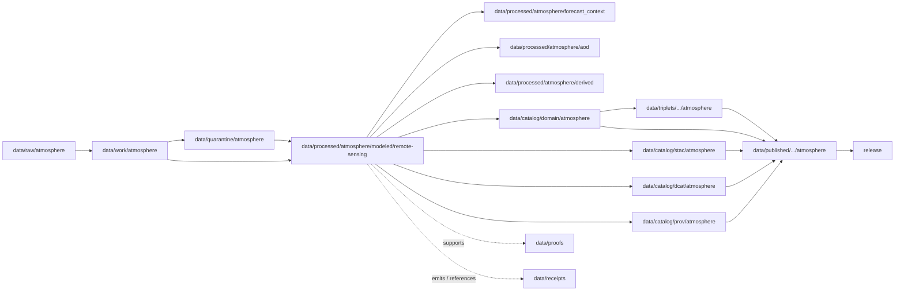

<!-- [KFM_META_BLOCK_V2]
doc_id: kfm://doc/data-processed-atmosphere-modeled-remote-sensing-readme
title: data/processed/atmosphere/modeled/remote-sensing/README.md — Atmosphere Modeled Remote-Sensing Processed Data README
version: v0.1
type: readme; data-lifecycle-sublane; processed-stage-guide; atmosphere-domain-lane; modeled-remote-sensing-lane
status: draft; PROPOSED; data-root; processed-stage; atmosphere; modeled; remote-sensing; release-gated; model-field-aware; remote-sensing-proxy-aware; source-role-aware
owners: OWNER_TBD — Atmosphere steward · Forecast/model steward · Remote-sensing steward · Data steward · Pipeline steward · Evidence steward · Policy steward · Release steward · Docs steward
created: NEEDS VERIFICATION — one-character placeholder existed before v0.1 expansion
updated: 2026-06-25
policy_label: public-doc; data; processed; atmosphere; modeled; remote-sensing; lifecycle; governed; release-gated
tags: [kfm, data, processed, atmosphere, modeled, remote-sensing, ForecastContext, AODRaster, SmokeContext, atmospheric-model-field, remote-sensing-mask, lifecycle, RAW, WORK, QUARANTINE, CATALOG, TRIPLET, PUBLISHED, EvidenceBundle, SourceDescriptor, ModelRunReceipt, ValidationReport, PolicyDecision, ReleaseManifest]
related:
  - ../../README.md
  - ../../forecast_context/README.md
  - ../../aod/README.md
  - ../../derived/README.md
  - ../../aggregate/README.md
  - ../../../README.md
  - ../../../../README.md
  - ../../../../../docs/domains/atmosphere/README.md
  - ../../../../../contracts/domains/atmosphere/ForecastContext.md
  - ../../../../../contracts/domains/atmosphere/AODRaster.md
  - ../../../../../contracts/domains/atmosphere/SmokeContext.md
  - ../../../../../contracts/domains/atmosphere/WindField.md
  - ../../../../../contracts/domains/atmosphere/AirObservation.md
  - ../../../../../contracts/domains/atmosphere/PM25Observation.md
  - ../../../../../schemas/contracts/v1/domains/atmosphere/ForecastContext.schema.json
  - ../../../../../schemas/contracts/v1/domains/atmosphere/AODRaster.schema.json
  - ../../../../../policy/domains/atmosphere/
  - ../../../../../docs/doctrine/directory-rules.md
  - ../../../../../docs/doctrine/lifecycle-law.md
  - ../../../../../docs/doctrine/trust-membrane.md
  - ../../../../raw/atmosphere/
  - ../../../../work/atmosphere/
  - ../../../../quarantine/atmosphere/
  - ../../../../catalog/domain/atmosphere/README.md
  - ../../../../catalog/stac/atmosphere/
  - ../../../../catalog/dcat/atmosphere/
  - ../../../../catalog/prov/atmosphere/
  - ../../../../triplets/
  - ../../../../published/
  - ../../../../proofs/
  - ../../../../receipts/
  - ../../../../registry/
  - ../../../../../release/
  - ../../../../../pipelines/
  - ../../../../../tools/validators/
notes:
  - "This file replaces a one-character placeholder at `data/processed/atmosphere/modeled/remote-sensing/README.md`."
  - "The parent `data/processed/atmosphere/modeled/README.md` was not confirmed in this task. Treat this nested lane as PROPOSED until the modeled parent lane is created or the path convention is reviewed."
  - "This lane is for processed Atmosphere artifacts that combine modeled context and remote-sensing context while preserving the difference between `ATMOSPHERIC_MODEL_FIELD` and `REMOTE_SENSING_MASK`."
  - "This lane is not RAW model/satellite storage, observation storage, AOD-as-PM2.5 conversion, public tile output, proof storage, release authority, public API/UI output, or life-safety guidance."
  - "The ForecastContext and AODRaster contracts define object meaning; this README does not create a second contract or schema authority."
  - "Rollback target for this expansion is previous placeholder blob SHA `e25f1814e51579d5f55c0f1fe0135ddb28a47f4a`."
[/KFM_META_BLOCK_V2] -->

<a id="top"></a>

# data/processed/atmosphere/modeled/remote-sensing

> Atmosphere PROCESSED-stage sublane for modeled remote-sensing artifacts: governed products that combine forecast/model context and satellite/proxy context while keeping model fields, remote-sensing masks, observations, concentration claims, public tiles, proof, release, and life-safety guidance separate.

<p>
  
  
  
  
  
  
</p>

**Status:** draft / PROPOSED  
**Owners:** OWNER_TBD — Atmosphere steward · Forecast/model steward · Remote-sensing steward · Data steward · Pipeline steward · Evidence steward · Policy steward · Release steward · Docs steward  
**Path:** `data/processed/atmosphere/modeled/remote-sensing/README.md`  
**Owning root:** `data/processed/`  
**Domain segment:** `atmosphere`  
**Sublane:** `modeled/remote-sensing`  
**Lifecycle stage:** `PROCESSED`  
**Exposure posture:** not public by default; public use requires governed catalog, evidence, model-run/source-product disclosure, uncertainty/QA disclosure, policy, release, correction, and rollback linkage  
**Truth posture:** CONFIRMED target was a one-character placeholder · CONFIRMED `ForecastContext` and `AODRaster` contracts exist · CONFIRMED `ForecastContext` is model/forecast context and `AODRaster` is remote-sensing proxy context · PROPOSED nested modeled/remote-sensing processed-lane details · NEEDS VERIFICATION for parent `modeled/` README, actual child inventory, validators, receipts, CI enforcement, release linkage, and governed route behavior.

**Quick jumps:** [Purpose](#purpose) · [Path convention warning](#path-convention-warning) · [Lifecycle boundary](#lifecycle-boundary) · [Repo fit](#repo-fit) · [Accepted contents](#accepted-contents) · [Exclusions](#exclusions) · [Modeled remote-sensing requirements](#modeled-remote-sensing-requirements) · [Model/proxy guardrails](#modelproxy-guardrails) · [Directory map](#directory-map) · [Evidence ledger](#evidence-ledger) · [Validation checklist](#validation-checklist) · [Rollback](#rollback)

---

## Purpose

`data/processed/atmosphere/modeled/remote-sensing/` holds normalized processed artifacts where modeled Atmosphere context and remote-sensing Atmosphere context are intentionally combined or compared after RAW capture, WORK transforms, and QUARANTINE holds.

This lane may support products such as model-informed remote-sensing summaries, remote-sensing-informed model context, forecast/AOD cross-context joins, smoke/proxy/model comparison products, uncertainty-aware raster candidates, and public-safe visualization candidates. It must preserve whether each component is `ATMOSPHERIC_MODEL_FIELD`, `REMOTE_SENSING_MASK`, observed sensor data, advisory context, or another governed role.

It is not a raw model-product lane. It is not a raw satellite-product lane. It is not a ground-observation lane. It is not a PM2.5 conversion lane. It is not a public tile or public layer lane. It is not a proof store, receipt store, source registry, catalog, release, semantic contract, schema, policy, public API/UI surface, or life-safety guidance source. It may support downstream catalog records, EvidenceBundle-backed UI payloads, public-safe visualizations, Focus Mode summaries, or release packages only after gates pass.

## Path convention warning

The parent file below was not confirmed in this task:

```text
data/processed/atmosphere/modeled/README.md
```

This means `modeled/remote-sensing/` should be treated as a **PROPOSED nested sublane** until maintainers verify the parent modeled lane, create the parent README, or decide that modeled remote-sensing products belong under an existing lane such as:

| Candidate home | Use when | Caution |
|---|---|---|
| `data/processed/atmosphere/forecast_context/` | The primary artifact is `ForecastContext` or model-run context. | Do not hide remote-sensing source role. |
| `data/processed/atmosphere/aod/` | The primary artifact is `AODRaster` or aerosol optical depth proxy context. | Do not imply AOD is PM2.5 or a model forecast. |
| `data/processed/atmosphere/derived/` | The primary artifact is a derived public-safe candidate crossing several object families. | Do not make `derived/` a public output root. |
| `data/processed/atmosphere/modeled/remote-sensing/` | The artifact intentionally combines model-field and remote-sensing-mask roles. | Requires explicit role separation and parent-lane verification. |

> [!CAUTION]
> Do not let this path become a parallel truth store beside `forecast_context/`, `aod/`, or `derived/`. If real artifacts are stored here, record the convention and make the parent `modeled/README.md` explicit.

## Lifecycle boundary

```text
RAW -> WORK / QUARANTINE -> PROCESSED -> CATALOG / TRIPLET -> PUBLISHED
```



`data/processed/atmosphere/modeled/remote-sensing/` is upstream of catalog, triplet, publication, and release. It must not be used as a normal public map/API/UI/AI source.

## Repo fit

| Responsibility | Correct home | Rule |
|---|---|---|
| Raw model products, raw satellite products, GRIB/NetCDF/Zarr/COG exports, source downloads, QA bands, source-native tiles, or logs | `data/raw/atmosphere/` | Not this lane. |
| In-process model/satellite joins, raster transforms, reprojection, masking, variable extraction, scratch outputs, notebooks, or method experiments | `data/work/atmosphere/` | Not this lane. |
| Rights-unclear, source-role-unclear, stale, malformed, unsupported, disputed, uncertainty-missing, QA-missing, or unsafe modeled remote-sensing material | `data/quarantine/atmosphere/` | Not this lane until resolved. |
| Processed modeled remote-sensing artifacts | `data/processed/atmosphere/modeled/remote-sensing/` | This PROPOSED nested lane. |
| Forecast/model context artifacts | `data/processed/atmosphere/forecast_context/` | Use when the primary artifact is ForecastContext. |
| AOD/remote-sensing proxy artifacts | `data/processed/atmosphere/aod/` | Use when the primary artifact is AODRaster. |
| Derived cross-context products | `data/processed/atmosphere/derived/` | Use when the product is a general derived candidate. |
| Atmosphere domain catalog records | `data/catalog/domain/atmosphere/` | Downstream catalog stage. |
| Atmosphere STAC/DCAT/PROV records | `data/catalog/{stac,dcat,prov}/atmosphere/` | Downstream catalog projections, if accepted. |
| Atmosphere triplet/graph projections | `data/triplets/.../atmosphere/` | Downstream graph stage. |
| Atmosphere public-safe products | `data/published/.../atmosphere/` | Downstream after release. |
| EvidenceBundle/proof records | `data/proofs/` | Separate proof family. |
| Source, run, model-run, transform, validation, QA, policy, correction, and release receipts | `data/receipts/` | Separate receipt family. |
| SourceDescriptor/source registry records | `data/registry/` | Separate registry family. |
| Release decisions, manifests, rollback cards, corrections, withdrawals | `release/` | Separate publication authority. |
| ForecastContext and AODRaster semantic contracts | `contracts/domains/atmosphere/` | Object meaning; not data. |
| ForecastContext and AODRaster schemas | `schemas/contracts/v1/domains/atmosphere/` | Machine shape; not data. |
| Policy, validators, tests, pipelines, apps, packages | `policy/`, `tools/validators/`, `tests/`, `pipelines/`, `apps/`, `packages/` | Separate roots. |

## Accepted contents

Processed modeled remote-sensing data may include:

- normalized products that intentionally combine model-field context and remote-sensing-mask/proxy context;
- source-role-preserving metadata for model source, satellite/source product, platform/sensor where allowed, product version, run time, initialization time, valid time, retrieval time, processing time, footprint, grid/projection, resolution, variable, units, uncertainty, QA/cloud/mask bands, and caveats;
- model-informed AOD or smoke-context candidates when AOD remains proxy context and model fields remain model context;
- remote-sensing-informed forecast/model comparison products where observations, model fields, and proxy masks remain distinguishable;
- stale-state, supersession, correction, reprocessing, model-run lineage, source-product lineage, uncertainty, quality, and caveat sidecars when those sidecars are not proofs, receipts, source registry records, catalog records, schemas, or policy rules;
- processed artifacts prepared for downstream domain catalog, STAC/DCAT/PROV packaging, EvidenceBundle support, triplet generation, LayerManifest creation, or release review.

## Exclusions

Do not store these under `data/processed/atmosphere/modeled/remote-sensing/`:

- RAW model products, raw satellite products, GRIB/NetCDF/Zarr/COG exports, source rasters, source-native tiles, QA bands, downloads, logs, screenshots, or source-native records.
- WORK/scratch outputs that have not passed processing gates.
- Quarantined, malformed, stale, source-role-unclear, rights-unclear, uncertainty-missing, QA-missing, unsupported, disputed, or unsafe material.
- Observed sensor readings, regulatory archive observations, station records, AQI reports, PM2.5 or ozone measurements, public AOD-to-PM2.5 conversions, advisory/referral records, or climate-normal/anomaly records unless only referenced as context and stored in their correct lanes.
- Official advisory issuance, official forecast substitution, emergency instructions, life-safety guidance, exposure claims, hazard-impact claims, damages, health/safety claims, or policy conclusions.
- Public layers, public tiles, app/UI/API payloads, public downloads, public Focus Mode payloads, or model-answer/runtime outputs.
- Domain catalog records, STAC records, DCAT records, PROV records, triplet/graph records, published outputs, proofs, receipts, source registry records, release records, schemas, policy rules, validators, tests, pipelines, app/UI/API code.

## Modeled remote-sensing requirements

PROPOSED until concrete validators and CI enforcement are verified:

| Requirement | Meaning |
|---|---|
| Source trace | Every processed artifact should trace to SourceDescriptor or source registry context when source authority matters. |
| Dual lineage | Model-run lineage and remote-sensing product lineage should both remain visible when both inform the artifact. |
| Source-role preservation | `ATMOSPHERIC_MODEL_FIELD`, `REMOTE_SENSING_MASK`, `OBSERVED_SENSOR`, `ADVISORY_CONTEXT`, and other roles must not collapse into one another. |
| Time semantics | Initialization time, run time, valid time, retrieval time, processing time, observation time where referenced, stale-state, correction time, and supersession time should remain distinguishable. |
| Raster/model metadata | Footprint, grid/projection, resolution, variable, units, pixel semantics, nodata handling, QA/cloud/mask bands, model horizon, and uncertainty should be explicit enough for downstream validation. |
| Proxy boundary | AOD/remote-sensing masks must not be presented as PM2.5, AQI, ground observation, exposure, smoke impact, or health/safety guidance by themselves. |
| Evidence linkage | Claims about source, model run, retrieval, valid time, extent, value, uncertainty, QA, transform, correction, or release should resolve downstream to EvidenceBundle/proof context. |
| Policy posture | Public display requires rights, source-role, freshness, uncertainty, QA/caveat, sensitivity, and policy/admissibility posture. |
| Catalog readiness | Processed modeled remote-sensing artifacts intended for discovery should promote through Atmosphere catalog lanes, not directly to public use. |
| Release readiness | Public use requires release state, published output path, correction path, and rollback target. |

## Model/proxy guardrails

- Modeled context is not an observed sensor reading.
- Remote-sensing masks/proxies are not ground observations.
- AOD is not PM2.5.
- AOD is not AQI.
- Forecast/model fields must not be presented as observations, regulatory archive measurements, or station records.
- Forecast context may inform advisory context, but it does not create official advisory issuance or life-safety instructions.
- Remote-sensing context may inform smoke context, but it does not prove smoke exposure, health effect, visibility impact, ground-level concentration, or hazard impact by itself.
- Public visualization requires source rights, model-run/source-product disclosure, uncertainty/QA disclosure, validation, policy, release record, correction path, and rollback target.
- Unreleased processed modeled remote-sensing artifacts are not public merely because they exist under this directory.

> [!CAUTION]
> Do not use this lane as a shortcut from processed model/proxy products to observations, PM2.5, AQI, official advisories, public warnings, exposure claims, health/safety guidance, public layers, public tiles, or public API/UI payloads. Modeled remote-sensing products must pass catalog, evidence, policy, validation, release, correction, and rollback gates before public use.

## Directory map

Actual child inventory remains **NEEDS VERIFICATION**. Use this as a proposed local organization pattern only after confirming current repo convention and validators.

```text
data/processed/atmosphere/modeled/remote-sensing/
├── README.md
├── normalized/              # PROPOSED — processed modeled remote-sensing records/products
├── model_runs/              # PROPOSED — model-run lineage sidecars, not receipts
├── source_products/         # PROPOSED — satellite/source-product lineage sidecars, not registry records
├── rasters/                 # PROPOSED — normalized raster derivatives, not published tiles
├── uncertainty/             # PROPOSED — uncertainty/caveat sidecars
├── qa/                      # PROPOSED — QA/cloud/mask/proxy-quality sidecars
├── joins/                   # PROPOSED — links to ForecastContext, AODRaster, SmokeContext, observations, advisories
├── _manifests/              # PROPOSED — lane-local non-release manifests only
└── _README_TODO.md          # PROPOSED — remove after actual child inventory is documented
```

## Evidence ledger

| Source | Status | Supports | Limits |
|---|---|---|---|
| Previous file | CONFIRMED | Target existed as a one-character placeholder. | Did not define modeled remote-sensing PROCESSED-stage boundaries. |
| `data/processed/atmosphere/modeled/README.md` lookup | NEEDS VERIFICATION | Parent modeled lane was not confirmed in this task. | Parent lane may need its own README before real data is stored here. |
| `data/processed/atmosphere/forecast_context/README.md` | CONFIRMED sibling README | Forecast/model context processed boundaries and model-is-not-observation posture. | Does not authorize this nested lane as canonical. |
| `data/processed/atmosphere/aod/README.md` | CONFIRMED sibling README | AOD/remote-sensing proxy processed boundaries and AOD-is-not-PM2.5 posture. | Does not authorize this nested lane as canonical. |
| `data/processed/atmosphere/derived/README.md` | CONFIRMED sibling README | Derived product boundary for public-safe candidates upstream of release. | Does not decide where modeled remote-sensing belongs. |
| `data/processed/README.md` | CONFIRMED | Parent processed lane is upstream of catalog, triplets, and publication and is not public by default. | Does not prove child inventory under this lane. |
| `data/catalog/domain/atmosphere/README.md` | CONFIRMED | Atmosphere catalog lane includes model/advisory context and AOD rasters downstream and preserves source-role guardrails. | Does not prove modeled remote-sensing processed inventory or release behavior. |
| `docs/domains/atmosphere/README.md` | CONFIRMED doctrine / PROPOSED implementation | Atmosphere owns model/advisory context, smoke/AOD context, derived products, and source-role denials. | Implementation maturity and runtime behavior remain NEEDS VERIFICATION. |
| `contracts/domains/atmosphere/ForecastContext.md` | CONFIRMED contract file | Defines ForecastContext as governed model/forecast context, not observation, advisory, life-safety instruction, proof, public layer, or release approval. | Contract does not prove schema enforcement, validator behavior, or release approval. |
| `contracts/domains/atmosphere/AODRaster.md` | CONFIRMED contract file | Defines AODRaster as aerosol optical depth remote-sensing proxy, not PM2.5, AQI, ground observation, proof, release approval, or health/safety guidance. | Contract does not prove schema enforcement, validator behavior, or release approval. |
| `docs/doctrine/directory-rules.md` | CONFIRMED doctrine / PROPOSED path specifics | Data paths encode lifecycle phase and domain segment; promotion is governed. | Does not prove runtime enforcement. |

## Validation checklist

- [ ] Confirm whether `data/processed/atmosphere/modeled/README.md` exists or should be created as the parent lane.
- [ ] Confirm actual child directories under `data/processed/atmosphere/modeled/remote-sensing/`.
- [ ] Confirm whether this nested lane is canonical or whether artifacts belong under `forecast_context/`, `aod/`, or `derived/`.
- [ ] Confirm accepted modeled remote-sensing source/domain path convention.
- [ ] Confirm schemas/profiles for modeled remote-sensing derivatives and their relation to `ForecastContext`, `AODRaster`, and `SmokeContext`.
- [ ] Confirm processed validators and CI checks.
- [ ] Confirm SourceDescriptor/source registry linkage for every source-derived model or remote-sensing artifact.
- [ ] Confirm model-run lineage, source-product lineage, valid/retrieval/processing time, product version, uncertainty, QA/cloud/mask bands, stale-state, correction, and supersession handling.
- [ ] Confirm model-field-vs-observation, remote-sensing-vs-ground-observation, AOD-vs-PM2.5, AOD-vs-AQI, and forecast-vs-advisory boundaries.
- [ ] Confirm RunReceipt, ModelRunReceipt, TransformReceipt, ValidationReport, PolicyDecision, correction path, and rollback target where applicable.
- [ ] Confirm no RAW, WORK, QUARANTINE, CATALOG, TRIPLET, PUBLISHED, proof, receipt, release, schema, policy, validator, package, pipeline, app, API, public layer, public tile, observation, PM2.5, AQI, advisory, official warning, exposure, health/safety, or regulatory-claim artifacts are misplaced here.
- [ ] Confirm promotion flow from processed modeled remote-sensing data to catalog/triplet/published outputs is governed, source-role-safe, uncertainty/QA-aware, proxy-aware, evidence-backed, and reversible.
- [ ] Confirm public clients and Focus Mode cannot use this lane as a direct observation, PM2.5, AQI, official advisory, public warning, exposure, emergency, regulatory, or life-safety source.

## Rollback

Rollback is required if this lane becomes an Atmosphere source-data root, modeled parent authority without parent README, ForecastContext replacement, AODRaster replacement, PM2.5 substitute, AQI substitute, ground-observation substitute, advisory authority root, official warning/public-alerting root, quarantine bypass, proof store, receipt store, catalog root, triplet root, source-registry root, release-decision root, published-output root, public layer root, public tile root, schema root, policy root, validator root, implementation root, public API shortcut, public exposure shortcut, public health/exposure source, regulatory-claim source, emergency instruction source, or life-safety guidance source.

Rollback target for this expansion: previous placeholder blob SHA `e25f1814e51579d5f55c0f1fe0135ddb28a47f4a`.

<p align="right"><a href="#top">Back to top</a></p>
