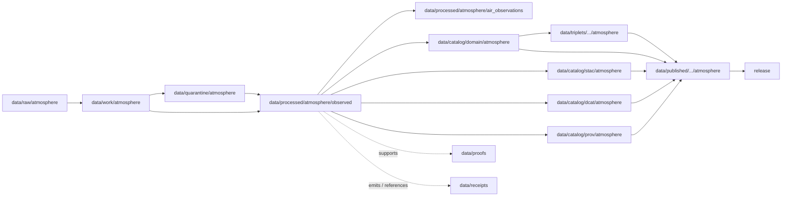

<!-- [KFM_META_BLOCK_V2]
doc_id: kfm://doc/data-processed-atmosphere-observed-readme
title: data/processed/atmosphere/observed/README.md — Atmosphere Observed Processed Data README
version: v0.1
type: readme; data-lifecycle-sublane; processed-stage-guide; atmosphere-domain-lane; observed-parent-lane
status: draft; PROPOSED; data-root; processed-stage; atmosphere; observed; observed-sensor; meteorological-context; release-gated; source-role-aware
owners: OWNER_TBD — Atmosphere steward · Observation steward · Air-quality steward · Weather steward · Data steward · Pipeline steward · Evidence steward · Policy steward · Release steward · Docs steward
created: NEEDS VERIFICATION — one-character placeholder existed before v0.1 expansion
updated: 2026-06-25
policy_label: public-doc; data; processed; atmosphere; observed; lifecycle; governed; release-gated
tags: [kfm, data, processed, atmosphere, observed, observed-sensor, AirObservation, WeatherObservation, TemperatureObservation, PrecipitationObservation, WindField, lifecycle, RAW, WORK, QUARANTINE, CATALOG, TRIPLET, PUBLISHED, EvidenceBundle, SourceDescriptor, RunReceipt, ValidationReport, PolicyDecision, ReleaseManifest]
related:
  - ../README.md
  - ../air_observations/README.md
  - ../air_stations/README.md
  - ../forecast_context/README.md
  - ../modeled/README.md
  - ../aod/README.md
  - ../advisory_context/README.md
  - ../derived/README.md
  - ../aggregate/README.md
  - ../../README.md
  - ../../../README.md
  - ../../../../docs/domains/atmosphere/README.md
  - ../../../../contracts/domains/atmosphere/AirObservation.md
  - ../../../../contracts/domains/atmosphere/WeatherObservation.md
  - ../../../../contracts/domains/atmosphere/TemperatureObservation.md
  - ../../../../contracts/domains/atmosphere/PrecipitationObservation.md
  - ../../../../contracts/domains/atmosphere/WindField.md
  - ../../../../contracts/domains/atmosphere/AirStation.md
  - ../../../../contracts/domains/atmosphere/WeatherStation.md
  - ../../../../contracts/domains/atmosphere/ForecastContext.md
  - ../../../../contracts/domains/atmosphere/AODRaster.md
  - ../../../../contracts/domains/atmosphere/AdvisoryContext.md
  - ../../../../schemas/contracts/v1/domains/atmosphere/
  - ../../../../policy/domains/atmosphere/
  - ../../../../docs/doctrine/directory-rules.md
  - ../../../../docs/doctrine/lifecycle-law.md
  - ../../../../docs/doctrine/trust-membrane.md
  - ../../../raw/atmosphere/
  - ../../../work/atmosphere/
  - ../../../quarantine/atmosphere/
  - ../../../catalog/domain/atmosphere/README.md
  - ../../../catalog/stac/atmosphere/
  - ../../../catalog/dcat/atmosphere/
  - ../../../catalog/prov/atmosphere/
  - ../../../triplets/
  - ../../../published/
  - ../../../proofs/
  - ../../../receipts/
  - ../../../registry/
  - ../../../../release/
  - ../../../../pipelines/
  - ../../../../tools/validators/
notes:
  - "This file replaces a one-character placeholder at `data/processed/atmosphere/observed/README.md`."
  - "This is the parent PROCESSED-stage sublane for observed Atmosphere artifacts. It organizes observed-sensor and observed-weather products without becoming RAW feed storage, station metadata authority, model/forecast authority, remote-sensing proxy authority, advisory authority, proof storage, release authority, public API/UI output, or life-safety guidance."
  - "Observed Atmosphere artifacts must preserve source role, observation time, retrieval time, variable/parameter identity, units, station/network context, QA/correction posture, caveats, evidence linkage, policy posture, and release state before public use."
  - "Observed lanes must not collapse AQI into concentration, AOD into PM2.5, model fields into observations, or observations into health/safety guidance."
  - "AirObservation, WeatherObservation, and related contracts define object meaning; this README does not create a second contract or schema authority."
  - "Rollback target for this expansion is previous placeholder blob SHA `e25f1814e51579d5f55c0f1fe0135ddb28a47f4a`."
[/KFM_META_BLOCK_V2] -->

<a id="top"></a>

# data/processed/atmosphere/observed

> Parent Atmosphere PROCESSED-stage lane for observed artifacts: governed observed-sensor, air-quality observation, weather observation, temperature, precipitation, and source-role-tagged measured/context records that remain distinct from station metadata, forecast/model fields, AOD/smoke proxies, advisory guidance, proof, release, and public map/API/UI surfaces.

<p>
  
  
  
  
  
  
</p>

**Status:** draft / PROPOSED  
**Owners:** OWNER_TBD — Atmosphere steward · Observation steward · Air-quality steward · Weather steward · Data steward · Pipeline steward · Evidence steward · Policy steward · Release steward · Docs steward  
**Path:** `data/processed/atmosphere/observed/README.md`  
**Owning root:** `data/processed/`  
**Domain segment:** `atmosphere`  
**Sublane:** `observed`  
**Lifecycle stage:** `PROCESSED`  
**Exposure posture:** not public by default; public use requires governed catalog, evidence, source-role/caveat posture, policy, release, correction, and rollback linkage  
**Truth posture:** CONFIRMED target was a one-character placeholder · CONFIRMED Atmosphere owns observed air-quality and weather families · CONFIRMED `AirObservation` and `WeatherObservation` contracts exist · PROPOSED observed parent processed-lane details · NEEDS VERIFICATION for actual child inventory, validators, receipts, CI enforcement, release linkage, and governed route behavior.

**Quick jumps:** [Purpose](#purpose) · [Lifecycle boundary](#lifecycle-boundary) · [Repo fit](#repo-fit) · [Accepted contents](#accepted-contents) · [Exclusions](#exclusions) · [Observed-product requirements](#observed-product-requirements) · [Observation guardrails](#observation-guardrails) · [Child lanes](#child-lanes) · [Directory map](#directory-map) · [Evidence ledger](#evidence-ledger) · [Validation checklist](#validation-checklist) · [Rollback](#rollback)

---

## Purpose

`data/processed/atmosphere/observed/` holds normalized observed Atmosphere/Air artifacts that have moved beyond RAW capture, WORK transforms, and QUARANTINE holds.

This parent lane groups processed observation products across Atmosphere object families: general `AirObservation`, `WeatherObservation`, temperature observations, precipitation observations, observed wind values where source role allows, air-quality measured values, source-role-tagged regulatory/archive observations, low-cost sensor observations with caveats, and observation-context derivatives that remain value-bearing or observation-linked.

It is not a raw sensor-feed lane. It is not station metadata authority. It is not a forecast/model lane. It is not AOD/smoke proxy authority. It is not advisory authority. It is not a proof store, receipt store, source registry, catalog, release, semantic contract, schema, policy, public layer, public API/UI surface, or life-safety guidance source. It may support downstream catalog records, EvidenceBundle-backed UI payloads, public-safe observed-value layers, Focus Mode summaries, or release packages only after gates pass.

## Lifecycle boundary

```text
RAW -> WORK / QUARANTINE -> PROCESSED -> CATALOG / TRIPLET -> PUBLISHED
```



`data/processed/atmosphere/observed/` is upstream of catalog, triplet, publication, and release. It must not be used as a normal public map/API/UI/AI source.

## Repo fit

| Responsibility | Correct home | Rule |
|---|---|---|
| Raw sensor feeds, station payloads, source downloads, QA payloads, source-native observation archives, or logs | `data/raw/atmosphere/` | Not this lane. |
| In-process parsing, correction, QA, joins, scratch outputs, or method experiments | `data/work/atmosphere/` | Not this lane. |
| Rights-unclear, source-role-unclear, stale, malformed, unsupported, disputed, sensitive, or unsafe observation material | `data/quarantine/atmosphere/` | Not this lane until resolved. |
| Processed observed Atmosphere artifacts | `data/processed/atmosphere/observed/` | This parent lane. |
| General air-quality observations | `data/processed/atmosphere/air_observations/` | Existing object-family lane. |
| Station/network context | `data/processed/atmosphere/air_stations/` or weather-station lane if accepted | Station metadata is context, not observation value. |
| Forecast/model context | `data/processed/atmosphere/forecast_context/` or `data/processed/atmosphere/modeled/` | Model fields must not impersonate observations. |
| AOD/remote-sensing proxy context | `data/processed/atmosphere/aod/` | AOD is not PM2.5 and not a ground observation. |
| Advisory/referral context | `data/processed/atmosphere/advisory_context/` | Advisory context remains official-source referral, not observed value. |
| Aggregate observation summaries | `data/processed/atmosphere/aggregate/` | Use aggregate lane when the artifact is primarily a rollup/summary. |
| Derived observed-value products | `data/processed/atmosphere/derived/` | Use derived lane when the product is a public-safe candidate or cross-object derivative. |
| Atmosphere domain catalog records | `data/catalog/domain/atmosphere/` | Downstream catalog stage. |
| Atmosphere STAC/DCAT/PROV records | `data/catalog/{stac,dcat,prov}/atmosphere/` | Downstream catalog projections, if accepted. |
| Atmosphere triplet/graph projections | `data/triplets/.../atmosphere/` | Downstream graph stage. |
| Atmosphere public-safe products | `data/published/.../atmosphere/` | Downstream after release. |
| EvidenceBundle/proof records | `data/proofs/` | Separate proof family. |
| Source, run, transform, validation, policy, correction, and release receipts | `data/receipts/` | Separate receipt family. |
| SourceDescriptor/source registry records | `data/registry/` | Separate registry family. |
| Release decisions, manifests, rollback cards, corrections, withdrawals | `release/` | Separate publication authority. |
| Atmosphere semantic contracts | `contracts/domains/atmosphere/` | Object meaning; not data. |
| Atmosphere schemas | `schemas/contracts/v1/domains/atmosphere/` | Machine shape; not data. |
| Policy, validators, tests, pipelines, apps, packages | `policy/`, `tools/validators/`, `tests/`, `pipelines/`, `apps/`, `packages/` | Separate roots. |

## Accepted contents

Processed observed Atmosphere data may include:

- normalized observed-sensor or observed-weather records tied to a station, grid, source product, or comparable source/network context;
- source-role-preserving records for observed values, parameter/variable identity, units, observed time, retrieval time, QA state, correction lineage, freshness, and caveats;
- general air observations, weather observations, temperature observations, precipitation observations, observed wind values, or other observed Atmosphere values when the object-family boundary remains visible;
- low-cost sensor observations only when caveats, correction/confidence/limitation posture, source role, and review requirements are preserved;
- regulatory/archive observation context only when rights, role, unit, freshness, and release posture are explicit;
- processed joins to station context, PM2.5, ozone, smoke, AOD, weather, forecast, climate, or advisory context when the knowledge-character boundary remains visible;
- quality, caveat, missingness, correction, uncertainty, freshness, validation, and unit-normalization sidecars when those sidecars are not proofs, receipts, source registry records, catalog records, schemas, or policy rules;
- processed artifacts prepared for downstream domain catalog, STAC/DCAT/PROV packaging, EvidenceBundle support, triplet generation, or release review.

## Exclusions

Do not store these under `data/processed/atmosphere/observed/`:

- RAW sensor feeds, station payloads, source downloads, QA payloads, logs, screenshots, source-native observation archives, or raw station metadata.
- WORK/scratch outputs that have not passed processing gates.
- Quarantined, malformed, source-role-unclear, rights-unclear, stale, unsupported, disputed, sensitive, or unsafe observation material.
- Canonical station metadata, station/network authority, station ownership/access details, or exact station-siting authority.
- Forecast/model fields, modeled products, remote-sensing masks, AOD rasters, smoke masks, advisory/referral records, climate normals, climate anomalies, or derived products unless only referenced as context and stored in their correct lanes.
- AQI/report semantics unless represented by an accepted report/index role with no concentration collapse.
- PM2.5-specific or ozone-specific records when dedicated object-family lanes/contracts apply.
- Health/safety guidance, exposure claims, regulatory exceedance claims, hazard/event truth, damages, emergency instructions, public alerting behavior, or policy conclusions.
- Domain catalog records, STAC records, DCAT records, PROV records, triplet/graph records, published outputs, proofs, receipts, source registry records, release records, schemas, policy rules, validators, tests, pipelines, app/UI/API code.

## Observed-product requirements

PROPOSED until concrete validators and CI enforcement are verified:

| Requirement | Meaning |
|---|---|
| Source trace | Every processed observed artifact should trace to SourceDescriptor or source registry context when source authority matters. |
| Observed role | The record must preserve `OBSERVED_SENSOR`, `METEOROLOGICAL_CONTEXT`, report/index role, archive role, low-cost sensor role, or other admitted role. |
| Station/network context | Observations should identify or reference station/network/source context without turning station metadata into processed observation data. |
| Parameter and units | Parameter/variable identity and units must be explicit enough to prevent AQI, PM2.5, ozone, weather, and generic observation collapse. |
| Time semantics | Observed time, retrieval time, valid time where relevant, correction time, freshness, and release time should remain distinguishable where material. |
| QA/correction posture | Quality flags, correction state, calibration/correction lineage, caveats, limitations, missingness, confidence, and uncertainty should remain visible. |
| Low-cost sensor caveats | Low-cost sensor observations require caveat, correction, confidence, limitation, policy posture, and source rights before public use. |
| Evidence linkage | Claims about observation value, source, time, station, QA, correction, or release should resolve downstream to EvidenceBundle/proof context. |
| Policy posture | Public display requires rights, source-role, freshness, caveat, sensitivity, and policy/admissibility posture. |
| Catalog readiness | Processed observed artifacts intended for discovery should promote through Atmosphere catalog lanes, not directly to public use. |
| Release readiness | Public use requires release state, published output path, correction path, and rollback target. |
| No action guidance by default | Observed values do not create medical, emergency, life-safety, exposure, regulatory, hazard-impact, crop, hydrology, biodiversity, or infrastructure claims without separate authority and review. |

## Observation guardrails

- Observed data is not proof or publication authority by itself.
- `AirObservation` is a general observed-sensor object, not a generic bucket for every air-related value.
- `WeatherObservation` may be observed-sensor or meteorological context depending on source role; role tagging is mandatory.
- AQI is not raw concentration.
- AOD is not PM2.5 and smoke/AOD proxies are not ground sensor observations.
- Model fields and forecasts must remain labeled as model or forecast context.
- Advisory context and observations do not create emergency, medical, exposure, regulatory, or life-safety instructions.
- Public display requires source rights, freshness, validation, policy, release record, correction path, and rollback target.
- Unreleased processed observed artifacts are not public merely because they exist under this directory.

> [!CAUTION]
> Do not use this lane as a shortcut from processed observations to public health, exposure, regulatory, hazard-impact, crop, hydrology, biodiversity, infrastructure, emergency, or life-safety claims. Observed products must pass catalog, evidence, policy, validation, release, correction, and rollback gates before public use.

## Child lanes

| Child lane | Status | Purpose |
|---|---|---|
| `../air_observations/` | draft / PROPOSED | Existing object-family lane for general `AirObservation` records. |

Additional child or sibling lanes are **PROPOSED** until verified. Candidate future lanes may include:

| Candidate lane | Proposed purpose | Caution |
|---|---|---|
| `weather_observations/` | General `WeatherObservation` records. | Must preserve observed-vs-context role tagging. |
| `temperature_observations/` | Temperature-specific observation records. | Temperature-specific units, height/exposure context, and climate aggregation rules may apply. |
| `precipitation_observations/` | Precipitation-specific observation records. | Amount, accumulation, type, gauge/radar method, and canonical-unit rules may apply. |
| `wind_observations/` | Observed wind products. | Wind can be observed or modeled; role must remain explicit. |
| `quality/` | Observation QA/correction/caveat sidecars. | Must not become proof, policy, or receipt authority. |

Do not create child lanes as parallel truth stores. Each child must explain what it owns, what it excludes, which object families it touches, and how it promotes downstream.

## Directory map

Actual child inventory remains **NEEDS VERIFICATION**. Use this as a proposed local organization pattern only after confirming current repo convention and validators.

```text
data/processed/atmosphere/observed/
├── README.md
├── air_observations/        # PROPOSED if moved under observed; currently sibling lane exists at ../air_observations/
├── weather_observations/    # PROPOSED — general WeatherObservation records
├── temperature/             # PROPOSED — temperature-specific observed products
├── precipitation/           # PROPOSED — precipitation-specific observed products
├── wind/                    # PROPOSED — observed wind products; keep model role separate
├── quality/                 # PROPOSED — QA, caveats, missingness, confidence, limitations
├── corrections/             # PROPOSED — correction/calibration lineage sidecars, not receipts
├── joins/                   # PROPOSED — links to stations, forecast, AOD, advisory, climate context
├── _manifests/              # PROPOSED — lane-local non-release manifests only
└── _README_TODO.md          # PROPOSED — remove after actual child inventory is documented
```

## Evidence ledger

| Source | Status | Supports | Limits |
|---|---|---|---|
| Previous file | CONFIRMED | Target existed as a one-character placeholder. | Did not define observed PROCESSED-stage boundaries. |
| `data/processed/atmosphere/air_observations/README.md` | CONFIRMED sibling README | Existing AirObservation processed lane and observed-sensor guardrails. | Does not define all observed Atmosphere object families. |
| `data/processed/atmosphere/air_stations/README.md` | CONFIRMED sibling README | Station/network context remains separate from observation values. | Does not define observed-value inventory. |
| `data/processed/atmosphere/forecast_context/README.md` | CONFIRMED sibling README | Forecast/model context remains separate from observations. | Does not define observed-value inventory. |
| `data/processed/atmosphere/modeled/README.md` | CONFIRMED sibling README | Modeled products are not observations. | Does not define observed-value inventory. |
| `data/processed/atmosphere/aod/README.md` | CONFIRMED sibling README | AOD/remote-sensing proxy is not ground observation or PM2.5. | Does not define observed-value inventory. |
| `data/processed/README.md` | CONFIRMED | Parent processed lane is upstream of catalog, triplets, and publication and is not public by default. | Does not prove child inventory under this lane. |
| `data/catalog/domain/atmosphere/README.md` | CONFIRMED | Atmosphere catalog lane includes observed families downstream and preserves source-role guardrails. | Does not prove observed processed inventory or release behavior. |
| `docs/domains/atmosphere/README.md` | CONFIRMED doctrine / PROPOSED implementation | Atmosphere owns air-quality observations, weather/mesonet observations, and source-role denials. | Implementation maturity and runtime behavior remain NEEDS VERIFICATION. |
| `contracts/domains/atmosphere/AirObservation.md` | CONFIRMED contract file | Defines AirObservation as governed general observed-sensor air-quality observation with anti-collapse boundaries. | Contract does not prove schema enforcement, validator behavior, or release approval. |
| `contracts/domains/atmosphere/WeatherObservation.md` | CONFIRMED contract file | Defines WeatherObservation as governed meteorological observation/context with observed-vs-model/hazard/advisory boundaries. | Contract does not prove schema enforcement, validator behavior, or release approval. |
| `docs/doctrine/directory-rules.md` | CONFIRMED doctrine / PROPOSED path specifics | Data paths encode lifecycle phase and domain segment; promotion is governed. | Does not prove runtime enforcement. |

## Validation checklist

- [ ] Confirm actual child directories under `data/processed/atmosphere/observed/`.
- [ ] Confirm whether `observed/`, `air_observations/`, weather-object lanes, and pollutant-specific lanes are canonical, aliases, compatibility lanes, or transitional lanes.
- [ ] Confirm accepted observed source/domain path convention.
- [ ] Confirm schemas/profiles for observed derivatives and their relation to `AirObservation`, `WeatherObservation`, `TemperatureObservation`, `PrecipitationObservation`, and `WindField`.
- [ ] Confirm processed validators and CI checks.
- [ ] Confirm SourceDescriptor/source registry linkage for every source-derived observed artifact.
- [ ] Confirm observation time, retrieval time, correction time, freshness, source role, units, QA/correction posture, caveats, limitations, missingness, confidence, and station-location sensitivity handling.
- [ ] Confirm low-cost sensor public-release controls: correction, caveats, confidence, limitations, policy posture, and source rights.
- [ ] Confirm observed-vs-station, observed-vs-model, observed-vs-remote-sensing, AQI-vs-concentration, AOD-vs-PM2.5, observation-vs-advisory, and observation-vs-hazard-impact boundaries.
- [ ] Confirm RunReceipt, TransformReceipt, ValidationReport, PolicyDecision, correction path, and rollback target where applicable.
- [ ] Confirm no RAW, WORK, QUARANTINE, CATALOG, TRIPLET, PUBLISHED, proof, receipt, release, schema, policy, validator, package, pipeline, app, API, station-authority, model, remote-sensing proxy, advisory, official warning, exposure, health/safety, or regulatory-claim artifacts are misplaced here.
- [ ] Confirm promotion flow from processed observed data to catalog/triplet/published outputs is governed, source-role-safe, caveat-aware, evidence-backed, and reversible.
- [ ] Confirm public clients and Focus Mode cannot use this lane as a direct public health, exposure, regulatory, emergency, hazard-impact, crop, hydrology, biodiversity, infrastructure, or life-safety source.

## Rollback

Rollback is required if this lane becomes an Atmosphere source-data root, station authority root, ForecastContext replacement, AODRaster replacement, advisory authority root, official warning/public-alerting root, quarantine bypass, proof store, receipt store, catalog root, triplet root, source-registry root, release-decision root, published-output root, public layer root, public tile root, schema root, policy root, validator root, implementation root, public API shortcut, public exposure shortcut, public health/exposure source, regulatory-claim source, emergency instruction source, or life-safety guidance source.

Rollback target for this expansion: previous placeholder blob SHA `e25f1814e51579d5f55c0f1fe0135ddb28a47f4a`.

<p align="right"><a href="#top">Back to top</a></p>
