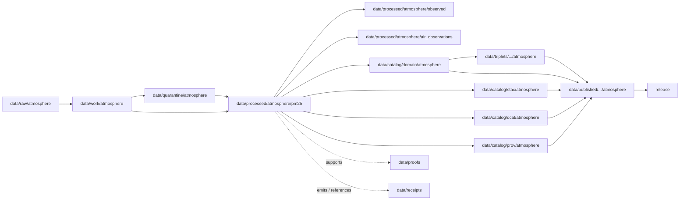

<!-- [KFM_META_BLOCK_V2]
doc_id: kfm://doc/data-processed-atmosphere-pm25-readme
title: data/processed/atmosphere/pm25/README.md — Atmosphere PM25Observation Processed Data README
version: v0.1
type: readme; data-lifecycle-sublane; processed-stage-guide; atmosphere-domain-lane; pm25-observation-lane
status: draft; PROPOSED; data-root; processed-stage; atmosphere; pm25; PM25Observation; release-gated; source-role-aware; AQI-boundary-aware; low-cost-caveat-aware
owners: OWNER_TBD — Atmosphere steward · Air-quality steward · PM2.5 steward · Data steward · Pipeline steward · Evidence steward · Policy steward · Release steward · Docs steward
created: NEEDS VERIFICATION — one-character placeholder existed before v0.1 expansion
updated: 2026-06-25
policy_label: public-doc; data; processed; atmosphere; pm25; PM2.5; lifecycle; governed; release-gated
tags: [kfm, data, processed, atmosphere, pm25, PM25Observation, AirObservation, AirStation, OzoneObservation, AQI, concentration, observed-sensor, public-aqi-report, low-cost-sensor, AODRaster, lifecycle, RAW, WORK, QUARANTINE, CATALOG, TRIPLET, PUBLISHED, EvidenceBundle, SourceDescriptor, RunReceipt, ValidationReport, PolicyDecision, ReleaseManifest]
related:
  - ../README.md
  - ../observed/README.md
  - ../air_observations/README.md
  - ../air_stations/README.md
  - ../ozone/README.md
  - ../forecast_context/README.md
  - ../modeled/README.md
  - ../aod/README.md
  - ../advisory_context/README.md
  - ../../README.md
  - ../../../README.md
  - ../../../../docs/domains/atmosphere/README.md
  - ../../../../contracts/domains/atmosphere/PM25Observation.md
  - ../../../../contracts/domains/atmosphere/AirObservation.md
  - ../../../../contracts/domains/atmosphere/AirStation.md
  - ../../../../contracts/domains/atmosphere/OzoneObservation.md
  - ../../../../contracts/domains/atmosphere/AODRaster.md
  - ../../../../contracts/domains/atmosphere/SmokeContext.md
  - ../../../../contracts/domains/atmosphere/ForecastContext.md
  - ../../../../contracts/domains/atmosphere/AdvisoryContext.md
  - ../../../../schemas/contracts/v1/domains/atmosphere/PM25Observation.schema.json
  - ../../../../policy/domains/atmosphere/
  - ../../../../docs/doctrine/directory-rules.md
  - ../../../../docs/doctrine/lifecycle-law.md
  - ../../../../docs/doctrine/trust-membrane.md
  - ../../../raw/atmosphere/
  - ../../../work/atmosphere/
  - ../../../quarantine/atmosphere/
  - ../../../catalog/domain/atmosphere/README.md
  - ../../../catalog/stac/atmosphere/
  - ../../../catalog/dcat/atmosphere/
  - ../../../catalog/prov/atmosphere/
  - ../../../triplets/
  - ../../../published/
  - ../../../proofs/
  - ../../../receipts/
  - ../../../registry/
  - ../../../../release/
  - ../../../../pipelines/
  - ../../../../tools/validators/
notes:
  - "This file replaces a one-character placeholder at `data/processed/atmosphere/pm25/README.md`."
  - "This is the PROCESSED-stage sublane for normalized PM25Observation artifacts under Atmosphere. It is not RAW sensor-feed storage, generic AirObservation authority, ozone authority, AQI/concentration substitution, AOD-as-PM2.5 conversion, model-field authority, advisory authority, proof storage, release authority, public API/UI output, or life-safety guidance."
  - "PM2.5 artifacts must preserve pollutant identity, source role, station/network context, units, observed time, retrieval time, QA/correction posture, low-cost sensor caveats where applicable, AQI/report posture where applicable, evidence linkage, policy posture, and release state before public use."
  - "The PM25Observation contract defines object meaning; this README does not create a second contract or schema authority."
  - "PM2.5 AQI/report values and PM2.5 concentrations must remain role-separated. AOD must not be presented as PM2.5. Low-cost PM2.5 values require caveat/correction/confidence/limitation controls before public use."
  - "Rollback target for this expansion is previous placeholder blob SHA `e25f1814e51579d5f55c0f1fe0135ddb28a47f4a`."
[/KFM_META_BLOCK_V2] -->

<a id="top"></a>

# data/processed/atmosphere/pm25

> Atmosphere PROCESSED-stage sublane for normalized `PM25Observation` artifacts: governed PM2.5 particulate concentration, PM2.5 AQI/report, low-cost sensor, and regulatory/archive records that remain distinct from generic air observations, ozone, AOD/smoke proxies, model fields, advisory guidance, proof, release, and public map/API/UI surfaces.

<p>
  
  
  
  
  
  
</p>

**Status:** draft / PROPOSED  
**Owners:** OWNER_TBD — Atmosphere steward · Air-quality steward · PM2.5 steward · Data steward · Pipeline steward · Evidence steward · Policy steward · Release steward · Docs steward  
**Path:** `data/processed/atmosphere/pm25/README.md`  
**Owning root:** `data/processed/`  
**Domain segment:** `atmosphere`  
**Object-family segment:** `pm25` / `PM25Observation`  
**Lifecycle stage:** `PROCESSED`  
**Exposure posture:** not public by default; public use requires governed catalog, evidence, source-role/unit/caveat posture, policy, release, correction, and rollback linkage  
**Truth posture:** CONFIRMED target was a one-character placeholder · CONFIRMED `PM25Observation` contract and schema paths exist · CONFIRMED PM2.5 has role-dependent `OBSERVED_SENSOR` / `PUBLIC_AQI_REPORT` character with low-cost caveat requirements · PROPOSED PM2.5 processed-sublane details · NEEDS VERIFICATION for actual child inventory, validators, receipts, CI enforcement, release linkage, and governed route behavior.

**Quick jumps:** [Purpose](#purpose) · [Lifecycle boundary](#lifecycle-boundary) · [Repo fit](#repo-fit) · [Accepted contents](#accepted-contents) · [Exclusions](#exclusions) · [PM25Observation requirements](#pm25observation-requirements) · [PM2.5 guardrails](#pm25-guardrails) · [Directory map](#directory-map) · [Evidence ledger](#evidence-ledger) · [Validation checklist](#validation-checklist) · [Rollback](#rollback)

---

## Purpose

`data/processed/atmosphere/pm25/` holds normalized PM2.5 observation artifacts that have moved beyond RAW capture, WORK transforms, and QUARANTINE holds.

This lane is for processed `PM25Observation` records or derivatives that preserve pollutant identity, source role, station/network context, source identity, observed time, retrieval time, units, averaging period, QA/correction posture, freshness, low-cost sensor caveats where applicable, AQI/report posture where applicable, regulatory/archive posture where separately supported, evidence references, and downstream catalog readiness.

It is not a generic air-observation lane. It is not an ozone lane. It is not an AQI-to-concentration conversion lane. It is not an AOD-to-PM2.5 conversion lane. It is not a model-field lane. It is not an advisory authority. It is not a proof store, receipt store, source registry, catalog, release, semantic contract, schema, policy, public layer, public API/UI surface, or life-safety guidance source. It may support downstream catalog records, EvidenceBundle-backed UI payloads, public-safe PM2.5 layers, Focus Mode summaries, or release packages only after gates pass.

## Lifecycle boundary

```text
RAW -> WORK / QUARANTINE -> PROCESSED -> CATALOG / TRIPLET -> PUBLISHED
```



`data/processed/atmosphere/pm25/` is upstream of catalog, triplet, publication, and release. It must not be used as a normal public map/API/UI/AI source.

## Repo fit

| Responsibility | Correct home | Rule |
|---|---|---|
| Raw PM2.5 sensor feeds, agency AQI feeds, station payloads, source downloads, QA payloads, or logs | `data/raw/atmosphere/` | Not this lane. |
| In-process PM2.5 parsing, unit conversion, AQI/report role review, correction, QA, joins, scratch outputs, or method experiments | `data/work/atmosphere/` | Not this lane. |
| Rights-unclear, source-role-unclear, stale, malformed, unit-unclear, low-cost-caveat-missing, unsupported, disputed, sensitive, or unsafe PM2.5 material | `data/quarantine/atmosphere/` | Not this lane until resolved. |
| Normalized PM25Observation processed artifacts | `data/processed/atmosphere/pm25/` | This lane. |
| General air-quality observations | `data/processed/atmosphere/air_observations/` | PM2.5 specialization remains separate when pollutant-specific semantics apply. |
| Observed parent lane | `data/processed/atmosphere/observed/` | Parent/sibling role lane for observed products. |
| Station/network context | `data/processed/atmosphere/air_stations/` | Station metadata is context, not PM2.5 value. |
| Ozone-specific processed artifacts | `data/processed/atmosphere/ozone/` | PM2.5 and ozone are separate pollutant families. |
| Forecast/model context | `data/processed/atmosphere/forecast_context/` or `data/processed/atmosphere/modeled/` | Modeled PM2.5 must not impersonate observed PM2.5. |
| AOD/remote-sensing proxy context | `data/processed/atmosphere/aod/` | AOD is not PM2.5, AQI, or a ground observation. |
| Advisory/referral context | `data/processed/atmosphere/advisory_context/` | Advisory context remains official-source referral, not PM2.5 value. |
| Atmosphere domain catalog records | `data/catalog/domain/atmosphere/` | Downstream catalog stage. |
| Atmosphere STAC/DCAT/PROV records | `data/catalog/{stac,dcat,prov}/atmosphere/` | Downstream catalog projections, if accepted. |
| Atmosphere triplet/graph projections | `data/triplets/.../atmosphere/` | Downstream graph stage. |
| Atmosphere public-safe products | `data/published/.../atmosphere/` | Downstream after release. |
| EvidenceBundle/proof records | `data/proofs/` | Separate proof family. |
| Source, run, transform, validation, policy, correction, and release receipts | `data/receipts/` | Separate receipt family. |
| SourceDescriptor/source registry records | `data/registry/` | Separate registry family. |
| Release decisions, manifests, rollback cards, corrections, withdrawals | `release/` | Separate publication authority. |
| PM25Observation semantic contract | `contracts/domains/atmosphere/PM25Observation.md` | Object meaning; not data. |
| PM25Observation schema | `schemas/contracts/v1/domains/atmosphere/PM25Observation.schema.json` | Machine shape; not data. |
| Policy, validators, tests, pipelines, apps, packages | `policy/`, `tools/validators/`, `tests/`, `pipelines/`, `apps/`, `packages/` | Separate roots. |

## Accepted contents

Processed `PM25Observation` data may include:

- normalized PM2.5 concentration records tied to an `AirStation` or comparable station/network context;
- source-role-preserving PM2.5 records where `OBSERVED_SENSOR`, `PUBLIC_AQI_REPORT`, `LOW_COST_SENSOR`, regulatory/archive, or other admitted role remains explicit;
- PM2.5 value, units, averaging period, observed time, retrieval time, source time, QA state, correction lineage, freshness, caveats, confidence, and limitation metadata;
- agency AQI/report PM2.5 values only when labeled as report/index posture and not raw concentration;
- low-cost PM2.5 sensor values only when correction, caveat, confidence, limitation, policy state, and review/release controls travel with the value;
- regulatory/archive PM2.5 values only when source role, vintage, issuing authority, evidence support, and release posture are documented;
- processed joins to `AirObservation`, ozone, station context, weather, smoke, AOD, forecast, or advisory context when the knowledge-character boundary remains visible;
- quality, caveat, missingness, correction, uncertainty, freshness, validation, unit-normalization, and AQI/report-posture sidecars when those sidecars are not proofs, receipts, source registry records, catalog records, schemas, or policy rules;
- processed artifacts prepared for downstream domain catalog, STAC/DCAT/PROV packaging, EvidenceBundle support, triplet generation, or release review.

## Exclusions

Do not store these under `data/processed/atmosphere/pm25/`:

- RAW PM2.5 sensor feeds, raw agency AQI feeds, station payloads, source downloads, QA payloads, logs, screenshots, or source-native records.
- WORK/scratch outputs that have not passed processing gates.
- Quarantined, malformed, source-role-unclear, rights-unclear, stale, unit-unclear, low-cost-caveat-missing, unsupported, disputed, sensitive, or unsafe PM2.5 material.
- Generic `AirObservation` records unless PM2.5-specific semantics are preserved here by accepted convention.
- Ozone observations or ozone report/index records.
- AQI/report semantics when source role does not explicitly admit `PUBLIC_AQI_REPORT`.
- AQI-to-concentration substitution or concentration-to-AQI substitution without a separately governed method, evidence, policy, and review.
- AOD-to-PM2.5 substitution or smoke-proxy-to-ground-concentration substitution.
- Model fields, AOD rasters, smoke masks, advisory/referral records, health/safety guidance, exposure claims, regulatory exceedance proof, damages, public alerting behavior, or policy conclusions.
- Domain catalog records, STAC records, DCAT records, PROV records, triplet/graph records, published outputs, proofs, receipts, source registry records, release records, schemas, policy rules, validators, tests, pipelines, app/UI/API code.

## PM25Observation requirements

PROPOSED until concrete validators and CI enforcement are verified:

| Requirement | Meaning |
|---|---|
| Source trace | Every processed PM25Observation artifact should trace to SourceDescriptor or source registry context when source authority matters. |
| Pollutant identity | PM2.5 identity must remain explicit and must not collapse into generic AirObservation, ozone, AQI, smoke, or AOD semantics. |
| Source role | `OBSERVED_SENSOR`, `PUBLIC_AQI_REPORT`, `LOW_COST_SENSOR`, regulatory/archive, model context, or other role must be explicit and non-collapsing. |
| Station/network context | PM2.5 observations should identify or reference station/network context without turning station metadata into processed observation data. |
| Units and averaging | Units, averaging period, conversion method where applicable, and report/index posture should be explicit enough to avoid AQI/concentration substitution. |
| Low-cost controls | Low-cost PM2.5 requires caveat, correction, confidence, limitation, policy posture, and source rights before public use. |
| Time semantics | Observed time, retrieval time, valid/report time where relevant, correction time, freshness, and release time should remain distinguishable where material. |
| QA/correction posture | Quality flags, correction state, calibration/correction lineage, caveats, limitations, missingness, confidence, and uncertainty should remain visible. |
| Evidence linkage | Claims about PM2.5 value, source, role, units, time, station, QA, correction, caveat, or release should resolve downstream to EvidenceBundle/proof context. |
| Policy posture | Public display requires rights, source-role, freshness, caveat, sensitivity, and policy/admissibility posture. |
| Catalog readiness | Processed PM25Observation artifacts intended for discovery should promote through Atmosphere catalog lanes, not directly to public use. |
| Release readiness | Public use requires release state, published output path, correction path, and rollback target. |
| No action guidance by default | PM2.5 values do not create medical, emergency, life-safety, exposure, regulatory, or hazard-impact claims without separate authority and review. |

## PM2.5 guardrails

- `PM25Observation` is PM2.5-specific and must not be flattened into generic `AirObservation` when PM2.5-specific semantics matter.
- PM2.5 and ozone are separate pollutant-specific object families with separate units, methods, QA, report semantics, and caveats.
- AQI is a report/index posture, not raw PM2.5 concentration.
- Low-cost PM2.5 records require correction, caveat, confidence, limitation, and policy controls before public release.
- Regulatory/archive posture requires source-role, vintage, issuing-authority, and evidence support.
- AOD is a remote-sensing mask/proxy and must not be presented as PM2.5.
- Modeled PM2.5 or forecast context must remain labeled as model context, not observed sensor data.
- PM2.5 values may support context, but they do not create emergency, medical, exposure, regulatory-exceedance, or life-safety instructions by themselves.
- Public display requires source rights, units, freshness, validation, policy, release record, correction path, and rollback target.
- Unreleased processed PM2.5 artifacts are not public merely because they exist under this directory.

> [!CAUTION]
> Do not use this lane as a shortcut from processed PM2.5 values to public health, exposure, regulatory, emergency, or life-safety claims. PM25Observation products must pass catalog, evidence, policy, validation, release, correction, and rollback gates before public use.

## Directory map

Actual child inventory remains **NEEDS VERIFICATION**. Use this as a proposed local organization pattern only after confirming current repo convention and validators.

```text
data/processed/atmosphere/pm25/
├── README.md
├── normalized/              # PROPOSED — processed PM25Observation records
├── concentration/           # PROPOSED — PM2.5 concentration values, source-role and units required
├── aqi_report/              # PROPOSED — PM2.5 AQI/report values, not raw concentration
├── low_cost_sensor/         # PROPOSED — caveated low-cost PM2.5 values
├── regulatory_archive/      # PROPOSED — regulatory/archive posture with evidence and vintage controls
├── quality/                 # PROPOSED — QA, caveats, missingness, confidence, limitations
├── corrections/             # PROPOSED — correction/calibration lineage sidecars, not receipts
├── joins/                   # PROPOSED — links to AirStation, AirObservation, ozone, forecast, AOD, advisory context
├── _manifests/              # PROPOSED — lane-local non-release manifests only
└── _README_TODO.md          # PROPOSED — remove after actual child inventory is documented
```

## Evidence ledger

| Source | Status | Supports | Limits |
|---|---|---|
| Previous file | CONFIRMED | Target existed as a one-character placeholder. | Did not define PM25Observation PROCESSED-stage boundaries. |
| `data/processed/atmosphere/observed/README.md` | CONFIRMED sibling README | Observed parent lane and observed-vs-model/proxy/advisory guardrails. | Does not define PM2.5-specific inventory or release behavior. |
| `data/processed/atmosphere/air_observations/README.md` | CONFIRMED sibling README | AirObservation processed lane and generic observed-sensor guardrails. | PM2.5 specialization remains separate when pollutant-specific semantics apply. |
| `data/processed/atmosphere/air_stations/README.md` | CONFIRMED sibling README | Station/network context remains separate from observation values. | Does not define PM2.5-value inventory. |
| `data/processed/atmosphere/ozone/README.md` | CONFIRMED sibling README | Parallel ozone pollutant lane and AQI/concentration source-role discipline. | Does not define PM2.5 inventory or release behavior. |
| `data/processed/atmosphere/forecast_context/README.md` | CONFIRMED sibling README | Forecast/model context remains separate from observations. | Does not define PM2.5-value inventory. |
| `data/processed/atmosphere/aod/README.md` | CONFIRMED sibling README | AOD/remote-sensing proxy is not ground observation or PM2.5. | Does not define PM2.5-value inventory. |
| `data/processed/README.md` | CONFIRMED | Parent processed lane is upstream of catalog, triplets, and publication and is not public by default. | Does not prove child inventory under this lane. |
| `data/catalog/domain/atmosphere/README.md` | CONFIRMED | Atmosphere catalog lane includes PM2.5 observations downstream and preserves source-role guardrails. | Does not prove PM2.5 processed inventory or release behavior. |
| `docs/domains/atmosphere/README.md` | CONFIRMED doctrine / PROPOSED implementation | Atmosphere owns air-quality observations and source-role denials. | Implementation maturity and runtime behavior remain NEEDS VERIFICATION. |
| `contracts/domains/atmosphere/PM25Observation.md` | CONFIRMED contract file | Defines PM25Observation as governed PM2.5 concentration/report/archive/low-cost-sensor object with AQI/concentration, low-cost, AOD, and source-role boundaries. | Contract does not prove schema enforcement, validator behavior, or release approval. |
| `schemas/contracts/v1/domains/atmosphere/PM25Observation.schema.json` | CONFIRMED scaffold schema | Paired PM25Observation schema exists with PROPOSED status. | Properties are currently empty; validator enforcement remains NEEDS VERIFICATION. |
| `docs/doctrine/directory-rules.md` | CONFIRMED doctrine / PROPOSED path specifics | Data paths encode lifecycle phase and domain segment; promotion is governed. | Does not prove runtime enforcement. |

## Validation checklist

- [ ] Confirm actual child directories under `data/processed/atmosphere/pm25/`.
- [ ] Confirm accepted PM25Observation source/domain path convention.
- [ ] Confirm `PM25Observation` schema fields and title casing are updated beyond scaffold if needed.
- [ ] Confirm PM25Observation processed validators and CI checks.
- [ ] Confirm SourceDescriptor/source registry linkage for each source-derived PM2.5 artifact.
- [ ] Confirm PM2.5-vs-AirObservation, PM2.5-vs-ozone, AQI-vs-concentration, low-cost-vs-reference-grade, AOD-vs-PM2.5, observed-vs-model, and observation-vs-advisory boundaries.
- [ ] Confirm station context handling without duplicating station authority.
- [ ] Confirm RunReceipt, TransformReceipt, ValidationReport, PolicyDecision, correction path, and rollback target where applicable.
- [ ] Confirm observed time, retrieval time, report/valid time, source role, units, averaging period, QA/correction posture, caveats, limitations, missingness, confidence, station-location sensitivity, freshness, low-cost-sensor posture, regulatory/archive posture, and public AQI/report labeling.
- [ ] Confirm no RAW, WORK, QUARANTINE, CATALOG, TRIPLET, PUBLISHED, proof, receipt, release, schema, policy, validator, package, pipeline, app, API, station-authority, ozone, AOD-as-PM2.5, model, remote-sensing proxy, advisory, official warning, exposure, health/safety, or regulatory-claim artifacts are misplaced here.
- [ ] Confirm promotion flow from processed PM25Observation data to catalog/triplet/published outputs is governed, source-role-safe, unit-aware, AQI-boundary-aware, low-cost-caveat-aware, evidence-backed, and reversible.
- [ ] Confirm public clients and Focus Mode cannot use this lane as a direct public health, exposure, regulatory, emergency, hazard-impact, or life-safety source.

## Rollback

Rollback is required if this lane becomes an Atmosphere source-data root, AirObservation replacement, ozone replacement, station authority root, AQI/concentration substitution root, AOD-as-PM2.5 root, low-cost overclaim root, ForecastContext replacement, AODRaster replacement, advisory authority root, official warning/public-alerting root, quarantine bypass, proof store, receipt store, catalog root, triplet root, source-registry root, release-decision root, published-output root, public layer root, public tile root, schema root, policy root, validator root, implementation root, public API shortcut, public exposure shortcut, public health/exposure source, regulatory-claim source, emergency instruction source, or life-safety guidance source.

Rollback target for this expansion: previous placeholder blob SHA `e25f1814e51579d5f55c0f1fe0135ddb28a47f4a`.

<p align="right"><a href="#top">Back to top</a></p>
