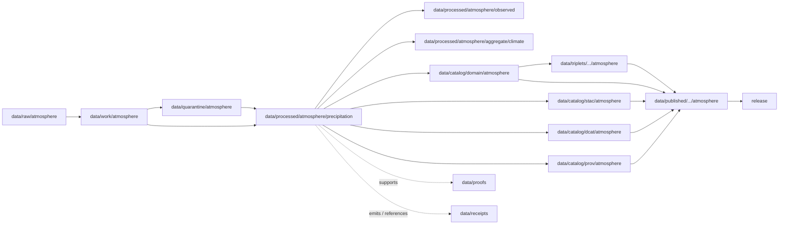

<!-- [KFM_META_BLOCK_V2]
doc_id: kfm://doc/data-processed-atmosphere-precipitation-readme
title: data/processed/atmosphere/precipitation/README.md — Atmosphere PrecipitationObservation Processed Data README
version: v0.1
type: readme; data-lifecycle-sublane; processed-stage-guide; atmosphere-domain-lane; precipitation-observation-lane
status: draft; PROPOSED; data-root; processed-stage; atmosphere; precipitation; PrecipitationObservation; release-gated; canonical-units-aware; source-role-aware
owners: OWNER_TBD — Atmosphere steward · Weather steward · Precipitation steward · Data steward · Pipeline steward · Evidence steward · Policy steward · Release steward · Docs steward
created: NEEDS VERIFICATION — one-character placeholder existed before v0.1 expansion
updated: 2026-06-25
policy_label: public-doc; data; processed; atmosphere; precipitation; lifecycle; governed; release-gated
tags: [kfm, data, processed, atmosphere, precipitation, PrecipitationObservation, WeatherObservation, WeatherStation, TemperatureObservation, WindField, ForecastContext, ClimateNormal, ClimateAnomaly, observed-sensor, meteorological-context, canonical-units, lifecycle, RAW, WORK, QUARANTINE, CATALOG, TRIPLET, PUBLISHED, EvidenceBundle, SourceDescriptor, RunReceipt, ValidationReport, PolicyDecision, ReleaseManifest]
related:
  - ../README.md
  - ../observed/README.md
  - ../modeled/README.md
  - ../forecast_context/README.md
  - ../climate_normals/README.md
  - ../climate_anomaly/README.md
  - ../aggregate/climate/README.md
  - ../derived/README.md
  - ../../README.md
  - ../../../README.md
  - ../../../../docs/domains/atmosphere/README.md
  - ../../../../contracts/domains/atmosphere/PrecipitationObservation.md
  - ../../../../contracts/domains/atmosphere/WeatherObservation.md
  - ../../../../contracts/domains/atmosphere/WeatherStation.md
  - ../../../../contracts/domains/atmosphere/TemperatureObservation.md
  - ../../../../contracts/domains/atmosphere/WindField.md
  - ../../../../contracts/domains/atmosphere/ForecastContext.md
  - ../../../../contracts/domains/atmosphere/ClimateNormal.md
  - ../../../../contracts/domains/atmosphere/ClimateAnomaly.md
  - ../../../../schemas/contracts/v1/domains/atmosphere/PrecipitationObservation.schema.json
  - ../../../../policy/domains/atmosphere/
  - ../../../../docs/doctrine/directory-rules.md
  - ../../../../docs/doctrine/lifecycle-law.md
  - ../../../../docs/doctrine/trust-membrane.md
  - ../../../raw/atmosphere/
  - ../../../work/atmosphere/
  - ../../../quarantine/atmosphere/
  - ../../../catalog/domain/atmosphere/README.md
  - ../../../catalog/stac/atmosphere/
  - ../../../catalog/dcat/atmosphere/
  - ../../../catalog/prov/atmosphere/
  - ../../../triplets/
  - ../../../published/
  - ../../../proofs/
  - ../../../receipts/
  - ../../../registry/
  - ../../../../release/
  - ../../../../pipelines/
  - ../../../../tools/validators/
notes:
  - "This file replaces a one-character placeholder at `data/processed/atmosphere/precipitation/README.md`."
  - "This is the PROCESSED-stage sublane for normalized PrecipitationObservation artifacts under Atmosphere. It is not RAW station/gauge/radar storage, generic WeatherObservation authority, forecast/model authority, climate baseline/anomaly authority, hydrology or hazards truth, proof storage, release authority, public API/UI output, or life-safety guidance."
  - "Precipitation artifacts must preserve variable identity, source role, station/grid/source-product context, canonical units, accumulation/amount/rate/intensity/type/trace semantics, observed time, retrieval time, QA/correction posture, evidence linkage, policy posture, and release state before public use."
  - "The PrecipitationObservation contract defines object meaning; this README does not create a second contract or schema authority."
  - "Precipitation observations may support climate, hydrology, agriculture, or hazards context only through downstream governed lanes; they do not prove flood, drought, crop loss, damage, or infrastructure impacts by themselves."
  - "Rollback target for this expansion is previous placeholder blob SHA `e25f1814e51579d5f55c0f1fe0135ddb28a47f4a`."
[/KFM_META_BLOCK_V2] -->

<a id="top"></a>

# data/processed/atmosphere/precipitation

> Atmosphere PROCESSED-stage sublane for normalized `PrecipitationObservation` artifacts: governed precipitation amount, rate, accumulation, intensity, type, trace-state, and precipitation-related meteorological context records that remain distinct from generic weather observations, forecast/model fields, climate baselines/anomalies, hydrology truth, hazard impacts, proof, release, and public map/API/UI surfaces.

<p>
  
  
  
  
  
  
</p>

**Status:** draft / PROPOSED  
**Owners:** OWNER_TBD — Atmosphere steward · Weather steward · Precipitation steward · Data steward · Pipeline steward · Evidence steward · Policy steward · Release steward · Docs steward  
**Path:** `data/processed/atmosphere/precipitation/README.md`  
**Owning root:** `data/processed/`  
**Domain segment:** `atmosphere`  
**Object-family segment:** `precipitation` / `PrecipitationObservation`  
**Lifecycle stage:** `PROCESSED`  
**Exposure posture:** not public by default; public use requires governed catalog, evidence, canonical units, source-role/freshness/caveat posture, policy, release, correction, and rollback linkage  
**Truth posture:** CONFIRMED target was a one-character placeholder · CONFIRMED `PrecipitationObservation` contract and schema paths exist · CONFIRMED precipitation has role-dependent `OBSERVED_SENSOR` / `METEOROLOGICAL_CONTEXT` character with canonical-unit requirements · PROPOSED precipitation processed-sublane details · NEEDS VERIFICATION for actual child inventory, validators, receipts, CI enforcement, release linkage, and governed route behavior.

**Quick jumps:** [Purpose](#purpose) · [Lifecycle boundary](#lifecycle-boundary) · [Repo fit](#repo-fit) · [Accepted contents](#accepted-contents) · [Exclusions](#exclusions) · [PrecipitationObservation requirements](#precipitationobservation-requirements) · [Precipitation guardrails](#precipitation-guardrails) · [Directory map](#directory-map) · [Evidence ledger](#evidence-ledger) · [Validation checklist](#validation-checklist) · [Rollback](#rollback)

---

## Purpose

`data/processed/atmosphere/precipitation/` holds normalized precipitation observation artifacts that have moved beyond RAW capture, WORK transforms, and QUARANTINE holds.

This lane is for processed `PrecipitationObservation` records or derivatives that preserve variable identity, source role, station/network/grid/source-product context, source identity, observed time, retrieval time, valid time where applicable, canonical units, accumulation/amount/rate/intensity/type/trace-state semantics, QA/correction posture, freshness, evidence references, and downstream catalog readiness.

It is not a generic weather-observation lane. It is not a forecast/model lane. It is not climate baseline/anomaly authority. It is not hydrology canonical truth. It is not hazards event/impact truth. It is not a proof store, receipt store, source registry, catalog, release, semantic contract, schema, policy, public layer, public API/UI surface, or life-safety guidance source. It may support downstream catalog records, EvidenceBundle-backed UI payloads, public-safe precipitation layers, climate aggregation, hydrology context, Focus Mode summaries, or release packages only after gates pass.

## Lifecycle boundary

```text
RAW -> WORK / QUARANTINE -> PROCESSED -> CATALOG / TRIPLET -> PUBLISHED
```



`data/processed/atmosphere/precipitation/` is upstream of catalog, triplet, publication, and release. It must not be used as a normal public map/API/UI/AI source.

## Repo fit

| Responsibility | Correct home | Rule |
|---|---|---|
| Raw station feeds, gauge products, radar/gridded products, source downloads, QA payloads, or logs | `data/raw/atmosphere/` | Not this lane. |
| In-process precipitation parsing, unit conversion, gauge/radar reconciliation, accumulation transforms, QA, joins, scratch outputs, or method experiments | `data/work/atmosphere/` | Not this lane. |
| Rights-unclear, source-role-unclear, stale, malformed, unit-unclear, unsupported, disputed, sensitive, or unsafe precipitation material | `data/quarantine/atmosphere/` | Not this lane until resolved. |
| Normalized PrecipitationObservation processed artifacts | `data/processed/atmosphere/precipitation/` | This lane. |
| General weather observations | WeatherObservation processed lane if accepted, or `data/processed/atmosphere/observed/` as parent | Precipitation specialization remains separate when variable-specific semantics apply. |
| Weather station/network context | WeatherStation processed lane if accepted | Station metadata is context, not precipitation value. |
| Forecast/model context | `data/processed/atmosphere/forecast_context/` or `data/processed/atmosphere/modeled/` | Forecast precipitation must not impersonate observed precipitation. |
| Climate normals/anomalies | `data/processed/atmosphere/climate_normals/`, `climate_anomaly/`, or `aggregate/climate/` | Climate products may aggregate precipitation but remain separate objects. |
| Hydrology canonical claims | Hydrology responsibility roots | Precipitation can be forcing/context, not streamflow/flood truth. |
| Hazards/event/impact claims | Hazards responsibility roots | Precipitation can contextualize a hazard; it does not prove impact. |
| Atmosphere domain catalog records | `data/catalog/domain/atmosphere/` | Downstream catalog stage. |
| Atmosphere STAC/DCAT/PROV records | `data/catalog/{stac,dcat,prov}/atmosphere/` | Downstream catalog projections, if accepted. |
| Atmosphere triplet/graph projections | `data/triplets/.../atmosphere/` | Downstream graph stage. |
| Atmosphere public-safe products | `data/published/.../atmosphere/` | Downstream after release. |
| EvidenceBundle/proof records | `data/proofs/` | Separate proof family. |
| Source, run, transform, validation, policy, correction, and release receipts | `data/receipts/` | Separate receipt family. |
| SourceDescriptor/source registry records | `data/registry/` | Separate registry family. |
| Release decisions, manifests, rollback cards, corrections, withdrawals | `release/` | Separate publication authority. |
| PrecipitationObservation semantic contract | `contracts/domains/atmosphere/PrecipitationObservation.md` | Object meaning; not data. |
| PrecipitationObservation schema | `schemas/contracts/v1/domains/atmosphere/PrecipitationObservation.schema.json` | Machine shape; not data. |
| Policy, validators, tests, pipelines, apps, packages | `policy/`, `tools/validators/`, `tests/`, `pipelines/`, `apps/`, `packages/` | Separate roots. |

## Accepted contents

Processed `PrecipitationObservation` data may include:

- normalized precipitation amount, accumulation, rate, intensity, type, phase, or trace-state records tied to a weather station, grid cell, radar/gauge/source product, or station/network context;
- source-role-preserving precipitation records where `OBSERVED_SENSOR`, `METEOROLOGICAL_CONTEXT`, gauge, radar/grid, station, archive, or other admitted role remains explicit;
- precipitation value, canonical units, accumulation window, observed time, retrieval time, valid time where relevant, source time, QA state, correction lineage, freshness, caveats, confidence, and limitation metadata;
- gauge/radar/grid comparisons only when source role, method, units, spatial/temporal support, QA, and uncertainty remain explicit;
- climate-aggregation inputs only when baseline/anomaly products remain separate and aggregation method is documented downstream;
- processed joins to weather observations, stations, temperature, wind, forecast, climate, hydrology context, or hazards context when the knowledge-character boundary remains visible;
- quality, caveat, missingness, correction, uncertainty, freshness, validation, unit-normalization, and accumulation-window sidecars when those sidecars are not proofs, receipts, source registry records, catalog records, schemas, or policy rules;
- processed artifacts prepared for downstream domain catalog, STAC/DCAT/PROV packaging, EvidenceBundle support, triplet generation, or release review.

## Exclusions

Do not store these under `data/processed/atmosphere/precipitation/`:

- RAW station feeds, gauge products, radar/gridded products, source downloads, QA payloads, logs, screenshots, or source-native records.
- WORK/scratch outputs that have not passed processing gates.
- Quarantined, malformed, source-role-unclear, rights-unclear, stale, unit-unclear, unsupported, disputed, sensitive, or unsafe precipitation material.
- Generic `WeatherObservation` records unless precipitation-specific semantics are preserved here by accepted convention.
- Temperature observations, wind fields, model/forecast fields, climate normal records, climate anomaly records, advisory/referral records, hydrology records, or hazards records unless only referenced as context and stored in their correct lanes.
- Flood, drought, storm, hazard, damage, infrastructure, crop-loss, health/safety, exposure, emergency, regulatory, or impact claims.
- Forecast/model-as-observation substitution or climate baseline/anomaly substitution.
- Domain catalog records, STAC records, DCAT records, PROV records, triplet/graph records, published outputs, proofs, receipts, source registry records, release records, schemas, policy rules, validators, tests, pipelines, app/UI/API code.

## PrecipitationObservation requirements

PROPOSED until concrete validators and CI enforcement are verified:

| Requirement | Meaning |
|---|---|
| Source trace | Every processed PrecipitationObservation artifact should trace to SourceDescriptor or source registry context when source authority matters. |
| Variable identity | Precipitation identity must remain explicit and must not collapse into generic WeatherObservation, forecast, climate, hydrology, or hazards semantics. |
| Source role | `OBSERVED_SENSOR`, `METEOROLOGICAL_CONTEXT`, gauge, radar/grid, model context, archive, or other admitted role must be explicit and non-collapsing. |
| Station/grid/source context | Precipitation observations should identify or reference weather station, grid cell, source product, or network context without turning station metadata into processed observation data. |
| Canonical units | Units, accumulation window, amount/rate/intensity/type/trace-state semantics, conversion method where applicable, and canonical-unit posture must be explicit. |
| Time semantics | Observed time, retrieval time, valid time where relevant, accumulation window, correction time, freshness, and release time should remain distinguishable where material. |
| QA/correction posture | Quality flags, correction state, gauge/radar method, calibration/correction lineage, caveats, limitations, missingness, confidence, and uncertainty should remain visible. |
| Evidence linkage | Claims about precipitation value, source, role, units, time, station/grid, QA, correction, or release should resolve downstream to EvidenceBundle/proof context. |
| Policy posture | Public display requires rights, source-role, freshness, caveat, sensitivity, and policy/admissibility posture. |
| Catalog readiness | Processed PrecipitationObservation artifacts intended for discovery should promote through Atmosphere catalog lanes, not directly to public use. |
| Release readiness | Public use requires release state, published output path, correction path, and rollback target. |
| No impact guidance by default | Precipitation values do not create flood, drought, storm, crop-loss, infrastructure, emergency, exposure, regulatory, or life-safety claims without separate authority and review. |

## Precipitation guardrails

- `PrecipitationObservation` is precipitation-specific and must not be flattened into generic `WeatherObservation` when precipitation-specific semantics matter.
- Precipitation and temperature are separate weather variables with separate units, methods, QA, and aggregation rules.
- Forecast/model precipitation must remain labeled as model context, not observed precipitation.
- Climate baselines/anomalies may use precipitation aggregates, but a precipitation observation is not a normal or anomaly by itself.
- A precipitation reading does not prove flood, drought, damage, crop loss, infrastructure impact, or other hydrology/hazards-lane truth by itself.
- Precipitation values may support context, but they do not create emergency, medical, exposure, regulatory-exceedance, or life-safety instructions by themselves.
- Public display requires source rights, canonical units, freshness, validation, policy, release record, correction path, and rollback target.
- Unreleased processed precipitation artifacts are not public merely because they exist under this directory.

> [!CAUTION]
> Do not use this lane as a shortcut from processed precipitation values to flood, drought, crop-loss, infrastructure, hazard-impact, regulatory, emergency, or life-safety claims. PrecipitationObservation products must pass catalog, evidence, policy, validation, release, correction, and rollback gates before public use.

## Directory map

Actual child inventory remains **NEEDS VERIFICATION**. Use this as a proposed local organization pattern only after confirming current repo convention and validators.

```text
data/processed/atmosphere/precipitation/
├── README.md
├── normalized/              # PROPOSED — processed PrecipitationObservation records
├── amounts/                 # PROPOSED — amount/accumulation records with canonical units
├── rates/                   # PROPOSED — rate/intensity records
├── types/                   # PROPOSED — precipitation type/phase/trace-state records
├── gauge/                   # PROPOSED — gauge/station-derived precipitation values
├── radar_grid/              # PROPOSED — radar/grid-derived precipitation context with role/method tags
├── quality/                 # PROPOSED — QA, caveats, missingness, confidence, limitations
├── corrections/             # PROPOSED — correction/calibration lineage sidecars, not receipts
├── joins/                   # PROPOSED — links to WeatherStation, WeatherObservation, forecast, climate, hydrology/hazards context
├── _manifests/              # PROPOSED — lane-local non-release manifests only
└── _README_TODO.md          # PROPOSED — remove after actual child inventory is documented
```

## Evidence ledger

| Source | Status | Supports | Limits |
|---|---|---|
| Previous file | CONFIRMED | Target existed as a one-character placeholder. | Did not define PrecipitationObservation PROCESSED-stage boundaries. |
| `data/processed/atmosphere/observed/README.md` | CONFIRMED sibling README | Observed parent lane and observed-vs-model/proxy/advisory guardrails. | Does not define precipitation-specific inventory or release behavior. |
| `data/processed/atmosphere/forecast_context/README.md` | CONFIRMED sibling README | Forecast/model context remains separate from observations. | Does not define precipitation-value inventory. |
| `data/processed/atmosphere/modeled/README.md` | CONFIRMED sibling README | Modeled products are not observations. | Does not define precipitation-value inventory. |
| `data/processed/atmosphere/climate_normals/README.md` | CONFIRMED sibling README | ClimateNormal baseline context remains separate from observations. | Does not define precipitation-value inventory. |
| `data/processed/atmosphere/climate_anomaly/README.md` | CONFIRMED sibling README | ClimateAnomaly anomaly context remains separate from observations. | Does not define precipitation-value inventory. |
| `data/processed/README.md` | CONFIRMED | Parent processed lane is upstream of catalog, triplets, and publication and is not public by default. | Does not prove child inventory under this lane. |
| `data/catalog/domain/atmosphere/README.md` | CONFIRMED | Atmosphere catalog lane includes precipitation observations downstream and preserves source-role guardrails. | Does not prove precipitation processed inventory or release behavior. |
| `docs/domains/atmosphere/README.md` | CONFIRMED doctrine / PROPOSED implementation | Atmosphere owns weather/mesonet observations, precipitation, climate context, and source-role denials. | Implementation maturity and runtime behavior remain NEEDS VERIFICATION. |
| `contracts/domains/atmosphere/PrecipitationObservation.md` | CONFIRMED contract file | Defines PrecipitationObservation as governed precipitation reading/context with canonical-unit, source-role, model/climate/hazard boundary controls. | Contract does not prove schema enforcement, validator behavior, or release approval. |
| `schemas/contracts/v1/domains/atmosphere/PrecipitationObservation.schema.json` | CONFIRMED scaffold schema | Paired PrecipitationObservation schema exists with PROPOSED status. | Properties are currently empty; validator enforcement remains NEEDS VERIFICATION. |
| `docs/doctrine/directory-rules.md` | CONFIRMED doctrine / PROPOSED path specifics | Data paths encode lifecycle phase and domain segment; promotion is governed. | Does not prove runtime enforcement. |

## Validation checklist

- [ ] Confirm actual child directories under `data/processed/atmosphere/precipitation/`.
- [ ] Confirm accepted PrecipitationObservation source/domain path convention.
- [ ] Confirm `PrecipitationObservation` schema fields and title casing are updated beyond scaffold if needed.
- [ ] Confirm PrecipitationObservation processed validators and CI checks.
- [ ] Confirm SourceDescriptor/source registry linkage for each source-derived precipitation artifact.
- [ ] Confirm precipitation-vs-WeatherObservation, precipitation-vs-temperature, precipitation-vs-forecast/model, precipitation-vs-climate normal/anomaly, and precipitation-vs-hydrology/hazards boundaries.
- [ ] Confirm station/grid/source context handling without duplicating station authority.
- [ ] Confirm RunReceipt, TransformReceipt, ValidationReport, PolicyDecision, correction path, and rollback target where applicable.
- [ ] Confirm observed time, retrieval time, valid time, accumulation window, source role, canonical units, amount/rate/intensity/type/trace semantics, QA/correction posture, caveats, limitations, missingness, confidence, station-location sensitivity, freshness, radar/gauge method, and public display posture.
- [ ] Confirm no RAW, WORK, QUARANTINE, CATALOG, TRIPLET, PUBLISHED, proof, receipt, release, schema, policy, validator, package, pipeline, app, API, station-authority, forecast/model, climate normal/anomaly, hydrology claim, hazard-impact claim, advisory, official warning, exposure, health/safety, or regulatory-claim artifacts are misplaced here.
- [ ] Confirm promotion flow from processed PrecipitationObservation data to catalog/triplet/published outputs is governed, source-role-safe, unit-aware, evidence-backed, and reversible.
- [ ] Confirm public clients and Focus Mode cannot use this lane as a direct flood, drought, crop-loss, infrastructure, regulatory, emergency, hazard-impact, or life-safety source.

## Rollback

Rollback is required if this lane becomes an Atmosphere source-data root, WeatherObservation replacement, WeatherStation authority root, ForecastContext replacement, climate-normal/anomaly source, hydrology claim root, hazards/event/impact root, advisory authority root, official warning/public-alerting root, quarantine bypass, proof store, receipt store, catalog root, triplet root, source-registry root, release-decision root, published-output root, public layer root, public tile root, schema root, policy root, validator root, implementation root, public API shortcut, public exposure shortcut, regulatory-claim source, emergency instruction source, or life-safety guidance source.

Rollback target for this expansion: previous placeholder blob SHA `e25f1814e51579d5f55c0f1fe0135ddb28a47f4a`.

<p align="right"><a href="#top">Back to top</a></p>
