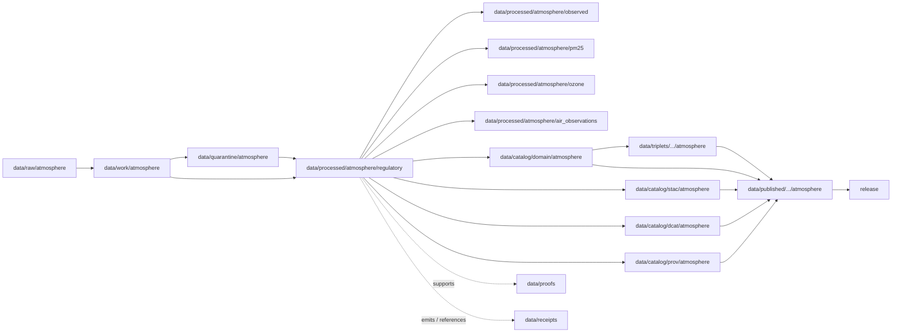

<!-- [KFM_META_BLOCK_V2]
doc_id: kfm://doc/data-processed-atmosphere-regulatory-readme
title: data/processed/atmosphere/regulatory/README.md — Atmosphere Regulatory Processed Data README
version: v0.1
type: readme; data-lifecycle-sublane; processed-stage-guide; atmosphere-domain-lane; regulatory-archive-lane
status: draft; PROPOSED; data-root; processed-stage; atmosphere; regulatory; archive; agency-reporting; release-gated; source-role-aware; evidence-aware
owners: OWNER_TBD — Atmosphere steward · Regulatory/archive steward · Air-quality steward · Data steward · Pipeline steward · Evidence steward · Policy steward · Release steward · Docs steward
created: NEEDS VERIFICATION — one-character placeholder existed before v0.1 expansion
updated: 2026-06-25
policy_label: public-doc; data; processed; atmosphere; regulatory; archive; agency-reporting; lifecycle; governed; release-gated
tags: [kfm, data, processed, atmosphere, regulatory, archive, agency-reporting, AirObservation, PM25Observation, OzoneObservation, AQI, regulatory-archive, public-aqi-report, source-role, evidence, lifecycle, RAW, WORK, QUARANTINE, CATALOG, TRIPLET, PUBLISHED, EvidenceBundle, SourceDescriptor, ValidationReport, PolicyDecision, ReleaseManifest]
related:
  - ../README.md
  - ../observed/README.md
  - ../air_observations/README.md
  - ../air_stations/README.md
  - ../pm25/README.md
  - ../ozone/README.md
  - ../forecast_context/README.md
  - ../modeled/README.md
  - ../aod/README.md
  - ../advisory_context/README.md
  - ../derived/README.md
  - ../../README.md
  - ../../../README.md
  - ../../../../docs/domains/atmosphere/README.md
  - ../../../../docs/domains/atmosphere/SOURCES.md
  - ../../../../contracts/domains/atmosphere/AirObservation.md
  - ../../../../contracts/domains/atmosphere/PM25Observation.md
  - ../../../../contracts/domains/atmosphere/OzoneObservation.md
  - ../../../../contracts/domains/atmosphere/AirStation.md
  - ../../../../contracts/domains/atmosphere/ForecastContext.md
  - ../../../../contracts/domains/atmosphere/AdvisoryContext.md
  - ../../../../schemas/contracts/v1/domains/atmosphere/
  - ../../../../policy/domains/atmosphere/
  - ../../../../policy/sensitivity/
  - ../../../../docs/doctrine/directory-rules.md
  - ../../../../docs/doctrine/lifecycle-law.md
  - ../../../../docs/doctrine/trust-membrane.md
  - ../../../raw/atmosphere/
  - ../../../work/atmosphere/
  - ../../../quarantine/atmosphere/
  - ../../../catalog/domain/atmosphere/README.md
  - ../../../catalog/stac/atmosphere/
  - ../../../catalog/dcat/atmosphere/
  - ../../../catalog/prov/atmosphere/
  - ../../../triplets/
  - ../../../published/
  - ../../../proofs/
  - ../../../receipts/
  - ../../../registry/
  - ../../../../release/
  - ../../../../pipelines/
  - ../../../../tools/validators/
notes:
  - "This file replaces a one-character placeholder at `data/processed/atmosphere/regulatory/README.md`."
  - "This is the PROCESSED-stage sublane for normalized Atmosphere regulatory/archive and agency-reporting posture artifacts. It is not RAW agency feed storage, legal authority, compliance determination authority, regulatory-exceedance proof, source registry, proof storage, release authority, public API/UI output, or health/life-safety guidance."
  - "Regulatory/archive artifacts must preserve source role, issuing/maintaining authority, jurisdiction/scope, source vintage, observed/report time, retrieval time, units, station/network context, QA/correction posture, evidence linkage, policy posture, and release state before public use."
  - "Regulatory/archive posture does not upgrade values into observed event truth, legal compliance findings, exposure proof, or public health/safety guidance."
  - "PM25Observation, OzoneObservation, AirObservation, and source-register documents define object/source meaning; this README does not create a second contract, source registry, policy, or schema authority."
  - "Rollback target for this expansion is previous placeholder blob SHA `e25f1814e51579d5f55c0f1fe0135ddb28a47f4a`."
[/KFM_META_BLOCK_V2] -->

<a id="top"></a>

# data/processed/atmosphere/regulatory

> Atmosphere PROCESSED-stage sublane for normalized regulatory/archive and agency-reporting posture artifacts: governed records from regulatory archives, agency reports, public AQI/report sources, and compliance-adjacent source families that remain distinct from observed-sensor truth, legal determinations, regulatory-exceedance proof, exposure claims, public health guidance, proof, release, and public map/API/UI surfaces.

<p>
  
  
  
  
  
  
</p>

**Status:** draft / PROPOSED  
**Owners:** OWNER_TBD — Atmosphere steward · Regulatory/archive steward · Air-quality steward · Data steward · Pipeline steward · Evidence steward · Policy steward · Release steward · Docs steward  
**Path:** `data/processed/atmosphere/regulatory/README.md`  
**Owning root:** `data/processed/`  
**Domain segment:** `atmosphere`  
**Sublane:** `regulatory`  
**Lifecycle stage:** `PROCESSED`  
**Exposure posture:** not public by default; public use requires governed catalog, evidence, source-role/vintage/scope disclosure, policy, release, correction, and rollback linkage  
**Truth posture:** CONFIRMED target was a one-character placeholder · CONFIRMED Atmosphere source register admits regulatory archives and agency reporting · CONFIRMED source role is fixed at admission · PROPOSED regulatory processed-sublane details · NEEDS VERIFICATION for actual child inventory, source descriptors, validators, receipts, CI enforcement, release linkage, and governed route behavior.

**Quick jumps:** [Purpose](#purpose) · [Lifecycle boundary](#lifecycle-boundary) · [Repo fit](#repo-fit) · [Accepted contents](#accepted-contents) · [Exclusions](#exclusions) · [Regulatory/archive requirements](#regulatoryarchive-requirements) · [Regulatory guardrails](#regulatory-guardrails) · [Directory map](#directory-map) · [Evidence ledger](#evidence-ledger) · [Validation checklist](#validation-checklist) · [Rollback](#rollback)

---

## Purpose

`data/processed/atmosphere/regulatory/` holds normalized regulatory/archive and agency-reporting posture artifacts that have moved beyond RAW capture, WORK transforms, and QUARANTINE holds.

This lane is for processed Atmosphere records whose source role, source family, or evidence posture is regulatory/archive, public-agency reporting, AQI/report, or compliance-adjacent context. Examples include normalized references to EPA AQS-like archives, AirNow/agency reporting postures, public AQI/report records, regulatory/archive posture sidecars for PM2.5 or ozone records, and processed source-vintage records that require regulatory/archive caveats before downstream use.

It is not legal authority. It is not a compliance-decision lane. It is not a regulatory-exceedance proof lane. It is not a raw agency feed lane. It is not a source registry, proof store, receipt store, catalog, release, semantic contract, schema, policy, public layer, public API/UI surface, or health/life-safety guidance source. It may support downstream catalog records, EvidenceBundle-backed UI payloads, public-safe regulatory/archive context layers, Focus Mode summaries, or release packages only after gates pass.

## Lifecycle boundary

```text
RAW -> WORK / QUARANTINE -> PROCESSED -> CATALOG / TRIPLET -> PUBLISHED
```



`data/processed/atmosphere/regulatory/` is upstream of catalog, triplet, publication, and release. It must not be used as a normal public map/API/UI/AI source.

## Repo fit

| Responsibility | Correct home | Rule |
|---|---|---|
| Raw agency feeds, regulatory archive payloads, source downloads, source snapshots, QA payloads, or logs | `data/raw/atmosphere/` | Not this lane. |
| In-process parsing, role review, archive normalization, AQI/report conversion review, QA, joins, scratch outputs, or method experiments | `data/work/atmosphere/` | Not this lane. |
| Rights-unclear, source-role-unclear, stale, malformed, unit-unclear, unsupported, disputed, sensitive, legally ambiguous, or unsafe regulatory/archive material | `data/quarantine/atmosphere/` | Not this lane until resolved. |
| Normalized regulatory/archive or agency-reporting posture artifacts | `data/processed/atmosphere/regulatory/` | This lane. |
| Source family and role documentation | `docs/domains/atmosphere/SOURCES.md` or global source docs after ADR | Documentation, not processed data. |
| SourceDescriptor/source registry records | `data/registry/` | Separate registry authority. |
| General observed products | `data/processed/atmosphere/observed/` | Observed values remain separate unless this lane is carrying regulatory/archive posture. |
| PM2.5 processed artifacts | `data/processed/atmosphere/pm25/` | PM2.5 values remain object-family data; regulatory posture may be linked or sidecarred. |
| Ozone processed artifacts | `data/processed/atmosphere/ozone/` | Ozone values remain object-family data; regulatory posture may be linked or sidecarred. |
| General air observations | `data/processed/atmosphere/air_observations/` | General observation lane; regulatory/archive role must not be flattened. |
| Station/network context | `data/processed/atmosphere/air_stations/` | Station metadata is context, not regulatory decision. |
| Advisory/referral context | `data/processed/atmosphere/advisory_context/` | Advisories remain official-source referral, not regulatory archive posture. |
| Forecast/model context | `data/processed/atmosphere/forecast_context/` or `modeled/` | Modeled fields must not impersonate regulatory observed/archive records. |
| Atmosphere domain catalog records | `data/catalog/domain/atmosphere/` | Downstream catalog stage. |
| Atmosphere STAC/DCAT/PROV records | `data/catalog/{stac,dcat,prov}/atmosphere/` | Downstream catalog projections, if accepted. |
| Atmosphere triplet/graph projections | `data/triplets/.../atmosphere/` | Downstream graph stage. |
| Atmosphere public-safe products | `data/published/.../atmosphere/` | Downstream after release. |
| EvidenceBundle/proof records | `data/proofs/` | Separate proof family. |
| Source, run, transform, validation, policy, correction, and release receipts | `data/receipts/` | Separate receipt family. |
| Release decisions, manifests, rollback cards, corrections, withdrawals | `release/` | Separate publication authority. |
| Atmosphere semantic contracts | `contracts/domains/atmosphere/` | Object meaning; not data. |
| Atmosphere schemas | `schemas/contracts/v1/domains/atmosphere/` | Machine shape; not data. |
| Legal, policy, validators, tests, pipelines, apps, packages | `policy/`, legal/governance docs if accepted, `tools/validators/`, `tests/`, `pipelines/`, `apps/`, `packages/` | Separate roots. |

## Accepted contents

Processed regulatory/archive Atmosphere data may include:

- normalized regulatory/archive posture records associated with PM2.5, ozone, AirObservation, AirStation, or agency-report source products;
- source-role-preserving artifacts from EPA AQS-like archive, AirNow/agency reporting, or other approved agency/archive source families after source descriptor, rights, and validation gates;
- public AQI/report records only when labeled as report/index posture and not raw concentration;
- regulatory/archive posture records only when source role, vintage, issuing/maintaining authority, scope, units, station/network context, evidence support, and release posture are documented;
- sidecars for regulatory/archive source vintage, issuing authority, method, data status, review status, correction/supersession state, and report/observed time distinctions when those sidecars are not proofs, receipts, source registry records, catalog records, schemas, or policy rules;
- processed joins to PM2.5, ozone, AirObservation, station context, advisory context, or published products when the knowledge-character boundary remains visible;
- processed artifacts prepared for downstream domain catalog, STAC/DCAT/PROV packaging, EvidenceBundle support, triplet generation, or release review.

## Exclusions

Do not store these under `data/processed/atmosphere/regulatory/`:

- RAW agency feeds, regulatory archive payloads, source downloads, QA payloads, logs, screenshots, source-native records, legal documents, or unnormalized source snapshots.
- WORK/scratch outputs that have not passed processing gates.
- Quarantined, malformed, source-role-unclear, rights-unclear, legally ambiguous, stale, unit-unclear, unsupported, disputed, sensitive, or unsafe regulatory/archive material.
- SourceDescriptor authority, source registry records, source-family documentation, or source admission decisions.
- Legal compliance determinations, enforcement conclusions, regulatory-exceedance proof, damages, exposure proof, health-effect proof, emergency instructions, public alerting behavior, or life-safety guidance.
- AQI/report semantics when source role does not explicitly admit report/index posture.
- AQI-to-concentration substitution, concentration-to-AQI substitution, modeled-to-observed substitution, or regulatory-to-observed event evidence substitution without separately governed method, evidence, policy, and review.
- Domain catalog records, STAC records, DCAT records, PROV records, triplet/graph records, published outputs, proofs, receipts, release records, schemas, policy rules, validators, tests, pipelines, app/UI/API code.

## Regulatory/archive requirements

PROPOSED until concrete validators and CI enforcement are verified:

| Requirement | Meaning |
|---|---|
| Source trace | Every processed regulatory/archive artifact should trace to SourceDescriptor or source registry context when source authority matters. |
| Fixed source role | Regulatory/archive role must be fixed at admission and must not be upgraded to observed event truth by promotion. |
| Authority scope | Issuing or maintaining authority, jurisdiction/scope, dataset/product name, version/vintage, and archive/report status should remain visible. |
| Object linkage | PM2.5, ozone, AirObservation, AirStation, or other object-family linkage should preserve the object-family boundary and source role. |
| Time semantics | Observed time, report time, retrieval time, source vintage, correction time, release time, and effective/superseded status should remain distinguishable where material. |
| Units and role posture | Units, AQI/report posture, concentration posture, archive posture, regulatory posture, and method posture should be explicit enough to avoid role collapse. |
| Evidence linkage | Claims about archive source, value, role, units, time, station, QA, correction, or release should resolve downstream to EvidenceBundle/proof context. |
| Policy posture | Public display requires rights, source-role, freshness/vintage, caveat, sensitivity, policy/admissibility posture, and release state. |
| Catalog readiness | Processed regulatory/archive artifacts intended for discovery should promote through Atmosphere catalog lanes, not directly to public use. |
| Release readiness | Public use requires release state, published output path, correction path, and rollback target. |
| No legal conclusion by default | Regulatory/archive data does not create legal compliance, enforcement, exposure, health, damages, emergency, or life-safety conclusions without separate authority and review. |

## Regulatory guardrails

- Regulatory/archive source role is not the same as observed event truth.
- Agency report/AQI posture is not raw concentration unless source role, method, units, and evidence support that posture.
- Regulatory/archive posture requires source role, vintage, issuing/maintaining authority, scope, and evidence support.
- Regulatory/archive data does not prove exceedance, exposure, health effect, damages, enforcement status, or legal compliance by itself.
- Modeled fields must not be presented as regulatory observed/archive records.
- Low-cost sensor readings must not become regulatory-grade without correction, caveats, confidence, limitations, policy, and review.
- Public display requires source rights, units, freshness or vintage disclosure, validation, policy, release record, correction path, and rollback target.
- Unreleased processed regulatory/archive artifacts are not public merely because they exist under this directory.

> [!CAUTION]
> Do not use this lane as a shortcut from processed agency/archive data to legal compliance findings, regulatory-exceedance proof, exposure claims, public health guidance, public alerts, or life-safety instructions. Regulatory/archive products must pass catalog, evidence, policy, validation, release, correction, and rollback gates before public use.

## Directory map

Actual child inventory remains **NEEDS VERIFICATION**. Use this as a proposed local organization pattern only after confirming current repo convention and validators.

```text
data/processed/atmosphere/regulatory/
├── README.md
├── normalized/              # PROPOSED — processed regulatory/archive posture records
├── aqs_like_archive/        # PROPOSED — EPA AQS-like archive derivatives, not raw feeds
├── agency_reporting/        # PROPOSED — AirNow/agency report posture records
├── aqi_report/              # PROPOSED — AQI/report values, not raw concentration
├── source_vintage/          # PROPOSED — vintage/scope/status sidecars, not registry records
├── quality/                 # PROPOSED — QA, caveats, missingness, confidence, limitations
├── corrections/             # PROPOSED — correction/supersession lineage sidecars, not receipts
├── joins/                   # PROPOSED — links to PM2.5, ozone, AirObservation, AirStation, AdvisoryContext
├── _manifests/              # PROPOSED — lane-local non-release manifests only
└── _README_TODO.md          # PROPOSED — remove after actual child inventory is documented
```

## Evidence ledger

| Source | Status | Supports | Limits |
|---|---|---|
| Previous file | CONFIRMED | Target existed as a one-character placeholder. | Did not define regulatory/archive PROCESSED-stage boundaries. |
| `docs/domains/atmosphere/SOURCES.md` | CONFIRMED source-register doc | Atmosphere admits regulatory archives and agency reporting; source role, rights, sensitivity, and freshness must be documented. | Path itself is PROPOSED and source rights/current terms remain NEEDS VERIFICATION. |
| `data/processed/atmosphere/pm25/README.md` | CONFIRMED sibling README | PM2.5 lane includes regulatory/archive and AQI/report posture with anti-collapse rules. | Does not define all regulatory/archive inventory. |
| `data/processed/atmosphere/ozone/README.md` | CONFIRMED sibling README | Ozone lane includes regulatory/archive and AQI/report posture with anti-collapse rules. | Does not define all regulatory/archive inventory. |
| `data/processed/atmosphere/observed/README.md` | CONFIRMED sibling README | Observed lane keeps observed values separate from regulatory/report/legal conclusions. | Does not define regulatory/archive inventory. |
| `data/processed/README.md` | CONFIRMED | Parent processed lane is upstream of catalog, triplets, and publication and is not public by default. | Does not prove child inventory under this lane. |
| `data/catalog/domain/atmosphere/README.md` | CONFIRMED | Atmosphere catalog is downstream and does not make claims true, public, policy-admitted, evidence-supported, or released by itself. | Does not prove regulatory processed inventory or release behavior. |
| `docs/domains/atmosphere/README.md` | CONFIRMED doctrine / PROPOSED implementation | Atmosphere owns air observations, AQI reports, regulatory archives, low-cost sensors, model fields, remote-sensing masks, and advisory context. | Implementation maturity and runtime behavior remain NEEDS VERIFICATION. |
| `contracts/domains/atmosphere/PM25Observation.md` | CONFIRMED contract file | Defines PM2.5 regulatory/archive and AQI/report posture boundaries. | Contract does not prove schema enforcement, validator behavior, or release approval. |
| `contracts/domains/atmosphere/OzoneObservation.md` | CONFIRMED contract file | Defines ozone regulatory/archive and AQI/report posture boundaries. | Contract does not prove schema enforcement, validator behavior, or release approval. |
| `docs/doctrine/directory-rules.md` | CONFIRMED doctrine / PROPOSED path specifics | Data paths encode lifecycle phase and domain segment; promotion is governed. | Does not prove runtime enforcement. |

## Validation checklist

- [ ] Confirm actual child directories under `data/processed/atmosphere/regulatory/`.
- [ ] Confirm accepted regulatory/archive source/domain path convention.
- [ ] Confirm whether this lane is canonical for regulatory/archive posture or only sidecars linked from PM2.5, ozone, AirObservation, and catalog records.
- [ ] Confirm SourceDescriptor/source registry linkage for every source-derived regulatory/archive artifact.
- [ ] Confirm rights, current terms, source vintage, issuing/maintaining authority, source role, jurisdiction/scope, and freshness/cadence posture for every source family.
- [ ] Confirm regulatory/archive-vs-observed, agency-report-vs-concentration, AQI-vs-concentration, modeled-vs-observed, low-cost-vs-reference-grade, and archive-vs-legal-compliance boundaries.
- [ ] Confirm RunReceipt, TransformReceipt, ValidationReport, PolicyDecision, correction path, and rollback target where applicable.
- [ ] Confirm no RAW, WORK, QUARANTINE, CATALOG, TRIPLET, PUBLISHED, proof, receipt, release, schema, policy, validator, package, pipeline, app, API, source-registry, source-descriptor, legal conclusion, exceedance proof, exposure, health/safety, or regulatory-claim artifacts are misplaced here.
- [ ] Confirm promotion flow from processed regulatory/archive data to catalog/triplet/published outputs is governed, source-role-safe, vintage-aware, evidence-backed, and reversible.
- [ ] Confirm public clients and Focus Mode cannot use this lane as a direct legal compliance, regulatory-exceedance, public health, exposure, emergency, hazard-impact, or life-safety source.

## Rollback

Rollback is required if this lane becomes an Atmosphere source-data root, source registry, source descriptor authority, legal compliance authority, regulatory-exceedance proof, observed-event replacement, PM2.5 replacement, ozone replacement, advisory authority root, official warning/public-alerting root, quarantine bypass, proof store, receipt store, catalog root, triplet root, release-decision root, published-output root, public layer root, public tile root, schema root, policy root, validator root, implementation root, public API shortcut, public exposure shortcut, public health/exposure source, regulatory-claim source, emergency instruction source, or life-safety guidance source.

Rollback target for this expansion: previous placeholder blob SHA `e25f1814e51579d5f55c0f1fe0135ddb28a47f4a`.

<p align="right"><a href="#top">Back to top</a></p>
