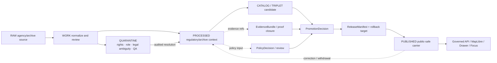

<!-- [KFM_META_BLOCK_V2]
doc_id: kfm://doc/data-processed-atmosphere-regulatory-readme
title: data/processed/atmosphere/regulatory/ — Atmosphere Regulatory and Archive Processed Data
version: v0.2.0
type: directory-readme
subtype: processed-atmosphere-regulatory-archive-lane
status: repository-grounded draft; canonical ownership, payload inventory, dedicated contract/schema, validators, fixtures, receipts, proof, release, and runtime behavior remain bounded
owners:
  - "NEEDS VERIFICATION — Atmosphere domain steward"
  - "NEEDS VERIFICATION — regulatory/archive and agency-reporting steward"
  - "NEEDS VERIFICATION — PM2.5, ozone, air-observation, station, source-role, rights, QA, and policy reviewers"
  - "NEEDS VERIFICATION — evidence, release, correction, rollback, legal-language, and docs reviewers"
created: NEEDS VERIFICATION — one-character placeholder existed before v0.1 expansion
updated: 2026-07-25
policy_label: public-doc; processed-stage; atmosphere; regulatory-archive; agency-reporting; source-role-aware; legal-nonadjudicative; release-gated; no-direct-public-path
path: data/processed/atmosphere/regulatory/README.md
truth_posture: >
  CONFIRMED exact target path, prior blob, Directory Rules placement, Atmosphere parent lane,
  Atmosphere source-register and policy documents, current contract/schema lane rosters, fixed
  source-role doctrine, AQI/concentration separation, model/observation separation, and PROCESSED
  lifecycle boundary / PROPOSED lane-local admission profile, cross-object routing, authority-scope
  fields, legal-language guardrails, and downstream promotion expectations / UNKNOWN recursive
  payload inventory, live source activation, dedicated regulatory contract/schema, production
  validators, fixtures, receipts, proof closure, release instances, hosting, and public behavior /
  NEEDS VERIFICATION accountable owners, canonical ownership between this lane and pollutant/object
  lanes, accepted regulatory vocabulary, jurisdiction/effective-period semantics, legal-review
  triggers, correction propagation, cache invalidation, withdrawal behavior, and rollback drills
evidence_snapshot:
  repository: bartytime4life/Kansas-Frontier-Matrix
  base_ref: main
  base_commit: 799064659b66e7537b41a8bc83b745831e7799b4
  prior_blob: abd78071f4f8bbaadddc779289d2cb39d6f8c4ac
  directory_rules_blob: 2affb080e6f0043867c64c7f06c1ca52030fbd55
  atmosphere_parent_blob: e37ce206f396f832c414fc46a70dd9cd9b3f64e4
  atmosphere_sources_blob: 6c4202ad677aad7041160907fa08d043189353a8
  atmosphere_policy_blob: 53480f8a9e7db4d863ed15cc96c708f0e8d40ef4
  atmosphere_contract_index_blob: 2626d011b5d80e6d58870be3eff817d95116ffc7
  atmosphere_schema_index_blob: 1165bd4719fff2c17ce4e7f5253fa8af8315f333
related:
  - ../README.md
  - ../observed/README.md
  - ../air_observations/README.md
  - ../air_stations/README.md
  - ../pm25/README.md
  - ../ozone/README.md
  - ../forecast_context/README.md
  - ../modeled/README.md
  - ../aod/README.md
  - ../advisory_context/README.md
  - ../derived/README.md
  - ../../README.md
  - ../../../README.md
  - ../../../../docs/domains/atmosphere/README.md
  - ../../../../docs/domains/atmosphere/SOURCES.md
  - ../../../../docs/domains/atmosphere/POLICY.md
  - ../../../../docs/doctrine/directory-rules.md
  - ../../../../contracts/domains/atmosphere/README.md
  - ../../../../contracts/domains/atmosphere/AirObservation.md
  - ../../../../contracts/domains/atmosphere/AirStation.md
  - ../../../../contracts/domains/atmosphere/PM25Observation.md
  - ../../../../contracts/domains/atmosphere/OzoneObservation.md
  - ../../../../contracts/domains/atmosphere/ForecastContext.md
  - ../../../../contracts/domains/atmosphere/AdvisoryContext.md
  - ../../../../schemas/contracts/v1/domains/atmosphere/README.md
  - ../../../../policy/domains/atmosphere/README.md
  - ../../../raw/atmosphere/README.md
  - ../../../work/atmosphere/README.md
  - ../../../quarantine/atmosphere/README.md
  - ../../../catalog/domain/atmosphere/README.md
  - ../../../triplets/README.md
  - ../../../proofs/README.md
  - ../../../receipts/README.md
  - ../../../registry/sources/atmosphere/README.md
  - ../../../../release/candidates/atmosphere/README.md
  - ../../../../release/README.md
notes:
  - "Same-path Markdown modernization only; no agency/archive bytes, source activation, contract, schema, policy, validator, workflow, proof, release, route, hosting, legal determination, or KFM publication state changed."
  - "Regulatory/archive is a source role and evidence posture across Atmosphere object families; directory placement does not create legal compliance, enforcement, exceedance, exposure, health, or life-safety authority."
  - "The current Atmosphere contract and schema indexes do not verify a dedicated RegulatoryArchive object family. This README must not invent one or duplicate pollutant/object-family truth."
  - "Source role is fixed at admission and must not be upgraded by promotion; EPA AQS-like material may be regulatory or observed according to its admitted role, and agency reporting/AQI remains distinct from raw concentration."
  - "Rollback target for v0.2.0 is prior blob SHA `abd78071f4f8bbaadddc779289d2cb39d6f8c4ac`."
[/KFM_META_BLOCK_V2] -->

<a id="top"></a>

# `data/processed/atmosphere/regulatory/` — Atmosphere regulatory and archive processed data

> **One-line purpose.** Hold normalized regulatory-archive, public-agency-reporting, and compliance-adjacent context while preserving source role, issuing authority, jurisdiction and scope, object ownership, method, units, time, QA, evidence, correction, and legal-use limits.

[](#status)
[](#authority-level)
[](#what-belongs-here)
[](#outputs)
[](#source-role-authority-and-legal-boundaries)
[](#validation)

> [!IMPORTANT]
> **A regulatory or agency source can be authoritative within its declared role without making this directory a legal authority.** A stored archive record, AQI report, source-reported status, or compliance-adjacent value does not by directory placement establish legal compliance, regulatory exceedance, enforcement status, exposure, health effect, emergency action, or life-safety guidance.

**Path:** `data/processed/atmosphere/regulatory/README.md`  
**Owning root:** `data/`  
**Lifecycle phase:** `processed/`  
**Domain segment:** `atmosphere/`  
**Parent lane:** `data/processed/atmosphere/`  
**Lane role:** cross-object regulatory/archive and agency-reporting posture  
**Direct public access:** denied  
**Last reviewed:** 2026-07-25

**Quick navigation:** [Purpose](#purpose) · [Authority level](#authority-level) · [Status](#status) · [What belongs here](#what-belongs-here) · [What does NOT belong here](#what-does-not-belong-here) · [Inputs](#inputs) · [Outputs](#outputs) · [Validation](#validation) · [Review burden](#review-burden) · [Related folders](#related-folders) · [ADRs](#adrs) · [Last reviewed](#last-reviewed) · [Admission profile](#regulatoryarchive-admission-profile) · [Source role and legal boundaries](#source-role-authority-and-legal-boundaries) · [Object-family routing](#object-family-routing) · [Time, units, method, and QA](#time-units-method-and-qa) · [Lifecycle and promotion](#lifecycle-and-promotion) · [Correction and rollback](#correction-withdrawal-and-rollback) · [Verification register](#open-verification-register) · [No-loss ledger](#no-loss-ledger)

---

## Purpose

This directory is the Atmosphere domain's **PROCESSED-stage lane for regulatory/archive and agency-reporting posture**. It may hold normalized archive records, public-agency report records, source-vintage and authority-scope sidecars, and cross-object regulatory context that have moved beyond RAW capture, WORK transformation, and QUARANTINE holds.

The lane exists to preserve the answer to eight questions before downstream use:

1. Which source family, admitted source role, issuing or maintaining authority, and dataset or product identity apply?
2. Which jurisdiction, spatial scope, regulated subject, reporting scope, and effective or archive period apply?
3. Which Atmosphere object family owns the underlying value or station context?
4. Is the record an observed measurement, a public report or index, a regulatory archive record, a modeled field, a low-cost record, or another reviewed role?
5. Which units, averaging or reporting period, method, QA, provisional/final state, and correction status apply?
6. Which source, observed, report, effective, retrieval, correction, supersession, and release times apply?
7. Which evidence, rights, sensitivity, policy, review, and release states qualify the record?
8. Which claims and downstream uses are allowed, restricted, narrowed, delayed, denied, or required to abstain?

It is not a source registry, legal-opinion service, compliance-decision engine, enforcement system, exceedance-proof store, observation replacement, proof store, receipt authority, catalog authority, release authority, public-health service, emergency-alert system, or public map/API/UI source.

<a id="repo-fit"></a>

## Authority level

**Implementation-bearing lifecycle lane with narrow cross-object authority.** The target path is CONFIRMED in the repository and remains under `data/processed/atmosphere/`, consistent with Directory Rules' lifecycle and domain-placement rules.

Its authority is deliberately limited:

- it may carry processed regulatory/archive records and lane-local explanatory metadata;
- it does not define source identity or admission—that remains in the source registry and `SourceDescriptor`;
- it does not define PM2.5, ozone, general air-observation, station, forecast, or advisory meaning—that remains in their semantic contracts;
- it does not define machine shape—that remains in accepted schemas or profiles under `schemas/`;
- it does not decide rights, sensitivity, legal effect, compliance, enforcement, admissibility, release, or public exposure;
- it does not upgrade a source role from observed, report, archive, low-cost, modeled, aggregate, or candidate merely because a record is promoted;
- it does not create a dedicated `RegulatoryArchive` object family unless an accepted contract, schema, ADR, fixtures, validators, and migration plan establish one.

The current Atmosphere contract roster lists pollutant, station, weather, climate, forecast, advisory, and resolver-envelope objects, but no dedicated regulatory/archive contract. The current Atmosphere schema index likewise does not verify a dedicated regulatory/archive schema. This README therefore treats regulatory/archive as a **source-role and cross-object posture**, not a new sovereign object family.

<a id="evidence-ledger"></a>

## Status

| Surface | Status | Evidence-bounded interpretation |
|---|---|---|
| This README and path | **CONFIRMED** | The file exists at the pinned base and is updated in place. |
| Parent Atmosphere processed lane | **CONFIRMED** | `data/processed/atmosphere/README.md` identifies `regulatory/` as agency archive, public report, AQI/report, and compliance-adjacent context with no legal-compliance authority. |
| Atmosphere source register | **CONFIRMED repository document / draft** | Names EPA AQS-like archive and AirNow/agency-reporting families, requires fixed source role, and keeps rights/current terms under review. |
| Atmosphere policy doctrine | **CONFIRMED repository document / draft** | Requires source role, AQI/concentration separation, model/observation separation, freshness, rights review, and fail-closed outcomes. |
| Regulatory/archive data lane | **CONFIRMED path / PROPOSED operational boundary** | The path exists; canonical ownership between this cross-object lane and pollutant/object-family sidecars remains unresolved. |
| Dedicated regulatory semantic contract | **NOT VERIFIED** | The current contract index does not list a dedicated regulatory/archive object contract. |
| Dedicated regulatory machine schema | **NOT VERIFIED** | The current schema index does not list a dedicated regulatory/archive schema. |
| Real processed regulatory payload inventory | **UNKNOWN** | This documentation task did not inspect or expose agency/archive payloads. |
| Validators, fixtures, policy enforcement, and CI | **NEEDS VERIFICATION** | No accepted production regulatory/archive enforcement suite was verified. |
| Receipts, proof, release instances, hosting, legal effect, and public behavior | **UNKNOWN / held** | Presence in this directory creates none of these states. |

<a id="accepted-contents"></a>

## What belongs here

Good fits are processed records or sidecars whose source role, authority scope, object ownership, and legal-use limits remain inspectable, including:

- normalized regulatory/archive source records with fixed source role, source identity, issuing or maintaining authority, dataset/product identity, jurisdiction, scope, vintage, and archive/report status;
- public-agency report or AQI/index records explicitly labeled as report/index posture rather than raw concentration;
- regulatory/archive sidecars linked to `PM25Observation`, `OzoneObservation`, `AirObservation`, or `AirStation` without duplicating or replacing the canonical object record;
- source-reported status, certification, validation, provisional/final, correction, invalidation, supersession, or withdrawal metadata whose exact source vocabulary is preserved;
- method, units, averaging/reporting period, detection/reporting convention, QA, completeness, missingness, caveat, uncertainty, and comparability metadata;
- observed, report, effective, source-publication, retrieval, processing, correction, supersession, and release-time metadata;
- source-reported compliance-adjacent or exceedance-adjacent assertions represented as attributed source claims, never as independent KFM legal conclusions;
- public-candidate regulatory/archive derivatives that remain upstream of catalog, evidence closure, policy review, release, and public serving;
- object-ready or profile-ready candidates prepared for future contract/schema validation, EvidenceBundle closure, catalog review, or release review;
- lane-local README, inventory, reconciliation, migration, or non-release manifest notes that do not become source, proof, policy, legal, catalog, or release authority.

<a id="exclusions"></a>

## What does NOT belong here

Do not place these in `data/processed/atmosphere/regulatory/`:

- RAW agency feeds, source-native archive exports, downloads, logs, screenshots, original reports, source terms, legal documents, or unprocessed snapshots;
- WORK parsing, AQI calculations, unit-conversion experiments, role assignment trials, QA experiments, temporary joins, notebooks, or scratch products;
- QUARANTINE material with unresolved rights, source role, authority identity, jurisdiction, scope, legal ambiguity, units, method, freshness, dispute, sensitivity, or safety state;
- `SourceDescriptor`, source activation, source-registry, rights-review, or source-family authority records;
- PM2.5, ozone, general air-observation, or station records duplicated here when their accepted object-family lane owns the canonical record;
- AQI/report values silently relabeled as raw concentration;
- modeled or forecast fields silently relabeled as observed or regulatory measurements;
- low-cost sensor records silently upgraded to reference-grade, regulatory-grade, or compliance-grade evidence;
- legal compliance findings, enforcement conclusions, legal opinions, penalties, obligations, permit decisions, regulatory determinations, or KFM-authored exceedance judgments;
- exposure estimates, health conclusions, damages, impact claims, public warnings, emergency instructions, medical guidance, occupational guidance, or life-safety advice;
- semantic contracts, JSON Schemas, policy rules, validators, tests, fixtures, executable pipelines, source descriptors, catalogs, STAC/DCAT/PROV projections, triplets, proofs, receipts, releases, correction notices, rollback cards, or published artifacts;
- public map, tile, API, download, export, Focus Mode, Evidence Drawer, graph, search, notification, dashboard, or AI-answer payloads;
- transform secrets, private thresholds, credentials, internal access details, or unpublished criteria whose disclosure would weaken a policy or review control.

## Inputs

Inputs may enter this lane only through governed lifecycle transitions from:

- `data/work/atmosphere/` after source identity, fixed source role, authority, jurisdiction/scope, object owner, units, method, time, QA, rights, sensitivity, evidence, and correction posture are recorded;
- `data/quarantine/atmosphere/` after the hold condition is resolved and the remediation decision is auditable;
- accepted pipelines or tools that preserve source bytes by reference, original source terminology, normalized values, method and configuration version, input digests, uncertainty, correction state, and source-reported status;
- accepted pollutant or object-family processed lanes through explicit references when regulatory/archive posture is supplementary to the canonical object;
- approved cross-domain context where ownership remains with the source domain and the relation is explicit, evidence-backed, policy-reviewed, and non-authoritative for the source domain.

A connector-to-PROCESSED, watcher-to-PROCESSED, public-upload-to-PROCESSED, or renderer-to-PROCESSED shortcut is not an accepted normal path. Connectors and watchers produce source or candidate state; they do not silently promote, determine legal effect, or publish.

## Outputs

This lane may support downstream candidates for:

- `data/catalog/domain/atmosphere/` and accepted STAC/DCAT/PROV projections that preserve source role, authority scope, object owner, legal-use limits, and evidence references;
- `data/triplets/` or other relationship projections that represent source-attributed regulatory/archive relations without converting them into legal truth;
- separate `data/proofs/` and `data/receipts/` objects;
- release-candidate review under `release/candidates/atmosphere/` after identity, rights, scope, method, QA, evidence, policy, correction, review, and rollback obligations close;
- `data/published/` only through a governed release transition and a separate released artifact path;
- governed API, MapLibre, Evidence Drawer, export, Focus Mode, dashboard, or AI carriers only after public-safe release and finite-outcome controls.

> [!CAUTION]
> Ordinary public clients must not read this directory directly. A source's official or regulatory character does not bypass KFM evidence, policy, review, release, correction, and rollback gates.

<a id="validation-checklist"></a>

## Validation

No production regulatory/archive validator suite was verified in this task. Until one exists, the following are **PROPOSED acceptance checks**, not claims of enforcement:

| Validation layer | Minimum check | Failure posture |
|---|---|---|
| Identity | Source ID, dataset/product ID, issuing or maintaining authority, jurisdiction/scope, version/vintage, and object owner are explicit. | `DENY` / `HOLD` |
| Source role | The admitted source role is present, fixed, and compatible with the claimed use. | `DENY` |
| Object routing | PM2.5, ozone, air-observation, station, model, proxy, and advisory ownership remains in the correct lane. | `DENY` or quarantine |
| Value semantics | Concentration, AQI/report, archive, observed, modeled, low-cost, aggregate, and candidate semantics remain distinguishable. | `DENY` |
| Units and method | Original and normalized units, averaging/reporting period, method, conversion, detection/reporting convention, and precision are recorded where material. | `ABSTAIN` or `HOLD` |
| Time | Observed, report, effective, source-publication, retrieval, processing, correction, supersession, and release times remain distinguishable. | `ABSTAIN` / stale hold |
| QA and status | Source flags, provisional/final status, validation/certification wording, invalidation, completeness, missingness, caveats, and uncertainty are preserved without upgrading source claims. | `RESTRICT` / `HOLD` |
| Rights and sensitivity | Rights, terms, attribution, station-siting sensitivity, private/infrastructure context, and disclosure obligations are resolved. | `DENY` / `RESTRICT` |
| Evidence | Consequential claims resolve through EvidenceRef to admissible EvidenceBundle support. | `ABSTAIN` |
| Legal-language boundary | KFM prose does not convert a source record into an independent legal, compliance, enforcement, exceedance, exposure, health, emergency, or life-safety conclusion. | `DENY` |
| Correction | Predecessor/successor, correction, invalidation, supersession, withdrawal, and affected downstream artifacts are traceable. | `HOLD` |
| Release | Policy decision, review state, proof, release manifest, correction path, rollback target, and public-safe carrier are present. | `DENY` |

Policy decisions may use `ALLOW/PASS`, `RESTRICT`, `ABSTAIN`, `DENY/HOLD`, and `ERROR` where the applicable Atmosphere policy contract defines them. Public runtime responses remain separate and should use the governed `ANSWER/ABSTAIN/DENY/ERROR` envelope where its contract applies.

Passing structural checks does **not** prove legal compliance, regulatory exceedance, source correctness, scientific fitness, evidence closure, public safety, release approval, or current legal effect.

## Review burden

Changes require review proportional to their meaning and exposure:

- Atmosphere domain and regulatory/archive source stewardship for lane scope and source-role use;
- the owning object-family steward for PM2.5, ozone, general air observations, stations, forecasts/models, proxies, or advisories;
- source, rights, and sensitivity review for source activation, attribution, disclosure, station siting, private/infrastructure context, or restricted joins;
- data-quality and scientific-method review for units, methods, QA, averaging, conversion, comparability, and uncertainty;
- policy review for role changes, restrictions, public transformations, or finite-outcome behavior;
- legal-language or subject-matter review before KFM describes compliance, exceedance, enforcement, obligation, or current legal effect;
- evidence, release, correction, rollback, and docs review before public use or authority-changing documentation.

**CODEOWNERS and accountable individuals are NEEDS VERIFICATION.** This README does not assign them.

<a id="directory-map"></a>

## Related folders

| Responsibility | Verified or bounded home | Relationship |
|---|---|---|
| Parent processed lane | [`../README.md`](../README.md) | Atmosphere lifecycle parent and lane index. |
| Observed parent | [`../observed/README.md`](../observed/README.md) | Observed values; regulatory posture must not replace observation semantics. |
| PM2.5 | [`../pm25/README.md`](../pm25/README.md) | Pollutant-specific PM2.5 values and AQI/report roles. |
| Ozone | [`../ozone/README.md`](../ozone/README.md) | Pollutant-specific ozone values and AQI/report roles. |
| General air observations | [`../air_observations/README.md`](../air_observations/README.md) | General value-bearing air observations. |
| Station context | [`../air_stations/README.md`](../air_stations/README.md) | Station/network context and siting sensitivity. |
| Modeled and forecast context | [`../modeled/README.md`](../modeled/README.md), [`../forecast_context/README.md`](../forecast_context/README.md) | Modeled fields remain distinct from observed or regulatory archive records. |
| Proxy and advisory context | [`../aod/README.md`](../aod/README.md), [`../advisory_context/README.md`](../advisory_context/README.md) | Proxy/referral context; neither becomes compliance or observation truth. |
| Source register | [`../../../../docs/domains/atmosphere/SOURCES.md`](../../../../docs/domains/atmosphere/SOURCES.md), [`../../../registry/sources/atmosphere/README.md`](../../../registry/sources/atmosphere/README.md) | Source-family doctrine and source-admission records. |
| Policy doctrine and bundle root | [`../../../../docs/domains/atmosphere/POLICY.md`](../../../../docs/domains/atmosphere/POLICY.md), [`../../../../policy/domains/atmosphere/README.md`](../../../../policy/domains/atmosphere/README.md) | Human-readable rules and bounded enforceable-policy home. |
| Semantic contracts | [`../../../../contracts/domains/atmosphere/README.md`](../../../../contracts/domains/atmosphere/README.md) | Object meaning; current roster has no dedicated regulatory/archive contract. |
| Machine schemas | [`../../../../schemas/contracts/v1/domains/atmosphere/README.md`](../../../../schemas/contracts/v1/domains/atmosphere/README.md) | Machine shape; current index has no dedicated regulatory/archive schema. |
| Catalog, proof, receipts, release | [`../../../catalog/domain/atmosphere/README.md`](../../../catalog/domain/atmosphere/README.md), [`../../../proofs/README.md`](../../../proofs/README.md), [`../../../receipts/README.md`](../../../receipts/README.md), [`../../../../release/candidates/atmosphere/README.md`](../../../../release/candidates/atmosphere/README.md) | Downstream authority families; none are replaced by this lane. |

## ADRs

- **ADR-0001 schema-home rule:** machine schemas belong under `schemas/contracts/v1/...`; semantic meaning belongs under `contracts/`.
- **Directory Rules §15:** folder READMEs expose purpose, authority, status, contents, inputs, outputs, validation, review burden, related folders, ADRs, and review date.
- **No regulatory/archive-lane-specific accepted ADR was verified.**
- **NEEDS VERIFICATION:** whether `regulatory/` is a canonical cross-object processed lane, a compatibility/index lane, or a sidecar pattern owned by PM2.5, ozone, air-observation, and catalog records.
- **NEEDS VERIFICATION:** whether a dedicated regulatory/archive contract or schema should ever exist. Creating one requires object-family review and must not duplicate source-registry, policy, pollutant, or legal authority.

## Last reviewed

**2026-07-25** — documentation modernization review against the pinned repository evidence recorded in the meta block.

This date records review of this README, not validation of source rights, payloads, legal status, policy enforcement, release state, public behavior, or operational correctness.

---

<a id="regulatoryarchive-requirements"></a>

## Regulatory/archive admission profile

The following profile is **PROPOSED** until accepted contracts, schemas, validators, fixtures, and CI prove it:

| Dimension | Required posture |
|---|---|
| Record identity | Deterministic or steward-assigned identity plus source/dataset/product and content or method digest where practical. |
| Source role | Fixed admitted role such as regulatory, observed, report/index, modeled, aggregate, administrative, candidate, or another accepted vocabulary value. |
| Authority | Issuing or maintaining authority, source family, product owner, and attribution requirements. |
| Jurisdiction and scope | Geographic jurisdiction, regulated subject, measurement/reporting scope, and any source-declared applicability limits. |
| Object owner | Explicit link to PM2.5, ozone, AirObservation, AirStation, forecast/model, proxy, or another accepted object family. |
| Value semantics | Concentration, AQI/report, archive value, source-reported status, modeled value, low-cost value, or other role is explicit. |
| Method and units | Original/normalized units, averaging/reporting period, method/version, conversion, detection/reporting convention, precision, and caveats. |
| Time | Observed, report, effective, source-publication, retrieval, processing, correction, supersession, and release times remain distinct where material. |
| QA and status | Source flags and exact source vocabulary for provisional/final, validated/certified, corrected, invalidated, superseded, or withdrawn state. |
| Rights and sensitivity | Rights, terms, attribution, access class, station-siting exposure, private/infrastructure context, and public transform obligations. |
| Evidence and review | EvidenceRefs, supporting EvidenceBundle, policy decision, review state, disagreements, limitations, and withheld details. |
| Correction and release | Predecessor/successor, correction/withdrawal lineage, affected carriers, release state, correction path, and rollback target. |

<a id="regulatory-guardrails"></a>

## Source role, authority, and legal boundaries

- **Source role is fixed at admission.** Promotion, cataloging, publication, or repeated use cannot upgrade `observed`, `regulatory`, `PUBLIC_AQI_REPORT`, `LOW_COST_SENSOR`, `modeled`, `aggregate`, `candidate`, or other role.
- **Agency ownership does not erase knowledge character.** AirNow-like public reporting may be report/observed context; EPA AQS-like material may be regulatory or observed according to the admitted instance and claim. Do not classify every agency record as the same role.
- **Regulatory/archive does not mean current.** Vintage, effective period, source-publication time, correction state, supersession, and freshness must remain visible.
- **Regulatory/archive does not mean legally dispositive.** KFM may preserve and cite source-reported records; it must not independently decide compliance, exceedance, enforcement, liability, obligation, or legal effect.
- **A source-reported finding remains attributed.** When the source explicitly reports an exceedance, compliance status, certification, enforcement action, or other legal/administrative state, represent it as a scoped, time-bounded, source-attributed assertion with the issuing authority and evidence—not as an unlabeled KFM conclusion.
- **AQI/report is not concentration.** A public index or category must not silently become an observed concentration or vice versa.
- **Model is not observation or regulatory archive.** Forecast/model fields cannot be promoted into observed or regulatory records without a separately governed method and accepted object.
- **Low-cost is not regulatory-grade.** Correction, caveat, confidence, limitation, comparison/collocation context where available, policy, and review are required before any stronger use.
- **Directory placement is not proof.** A file under `regulatory/` does not by itself establish authority, correctness, evidence closure, public safety, release, or current legal effect.

## Object-family routing

| Record or context | Primary owning lane | Regulatory-lane relationship |
|---|---|---|
| PM2.5 concentration, AQI/report, low-cost, or archive record | `../pm25/` | Link regulatory/archive posture; do not duplicate canonical PM2.5 truth. |
| Ozone concentration, AQI/report, or archive record | `../ozone/` | Link regulatory/archive posture; do not duplicate canonical ozone truth. |
| General air-quality observation | `../air_observations/` | Preserve regulatory/report role as metadata or relation. |
| Station/network identity and siting | `../air_stations/` | Reference station context; do not re-own site identity or exact-siting policy. |
| Forecast/model field | `../forecast_context/` or `../modeled/` | Keep model role explicit; regulatory comparison does not convert it to observation. |
| AOD/smoke proxy | `../aod/` or accepted smoke lane | Preserve proxy identity; never treat as measured concentration or legal finding. |
| Advisory/referral context | `../advisory_context/` | Preserve official-source referral; do not turn regulatory data into KFM-issued instruction. |
| Source identity, rights, cadence, and activation | `data/registry/sources/atmosphere/` | Regulatory lane references the descriptor; it does not own source admission. |
| Legal/compliance determination | Official issuing authority and separately governed legal/policy surface | This lane may cite a source-reported state but does not create the determination. |

Canonical value ownership between this lane and object-specific lanes remains NEEDS VERIFICATION. Until resolved, prefer references and sidecars over duplicate payloads, and deny parallel truth stores.

## Time, units, method, and QA

Regulatory/archive candidates should preserve enough detail to prevent false comparability and false legal inference:

| Dimension | Required posture |
|---|---|
| Authority and scope | Issuing/maintaining authority, jurisdiction, product, program, archive/report class, and source-declared scope. |
| Units | Original and normalized units, conversion method, scale, precision, and detection/reporting limits where material. |
| Reporting or averaging period | Instantaneous, hourly, daily, 8-hour, annual, design-value, or other source-defined window remains explicit; unsupported categories are not inferred. |
| Time | Observation, report, effective, source-publication, retrieval, processing, correction, supersession, and release times remain distinct. |
| Method | Instrument or archive method, method/version, processing level, breakpoint/index method where applicable, and source-provided caveats. |
| QA and status | Provisional/final, validated/certified, corrected, invalidated, incomplete, missing, and source-specific quality flags are preserved exactly enough to avoid status inflation. |
| Comparability | Comparisons require compatible pollutant/object, source role, units, averaging/reporting period, method, jurisdiction/scope, QA state, and temporal support. |
| Legal use | Any compliance/exceedance/enforcement interpretation requires explicit source authority, rule or standard identity where applicable, effective period, evidence, and appropriate subject-matter review. |

Normalization must retain the original source value and terminology by reference. Conversion or harmonization can improve interoperability; it cannot upgrade source role, legal status, or scientific fitness.

<a id="lifecycle-boundary"></a>

## Lifecycle and promotion

```text
RAW -> WORK / QUARANTINE -> PROCESSED -> CATALOG / TRIPLET -> PUBLISHED
```


```mermaid
flowchart LR
  RAW["RAW agency/archive source"] --> WORK["WORK normalize and review"]
  WORK --> QUAR["QUARANTINE<br/>rights · role · legal ambiguity · QA"]
  WORK --> REG["PROCESSED regulatory/archive context"]
  QUAR -->|audited resolution| REG
  REG --> CAT["CATALOG / TRIPLET candidate"]
  REG -. evidence refs .-> EVID["EvidenceBundle / proof closure"]
  REG -. policy input .-> POL["PolicyDecision / review"]
  CAT --> PROMO["PromotionDecision"]
  EVID --> PROMO
  POL --> PROMO
  PROMO --> RELEASE["ReleaseManifest + rollback target"]
  RELEASE --> PUB["PUBLISHED public-safe carrier"]
  PUB --> API["Governed API / MapLibre / Drawer / Focus"]
  PUB -. correction / withdrawal .-> REG
```

The arrows express governed dependencies, not automatic file copies. Promotion requires source identity, rights, source role, scope, object ownership, semantic validity, QA, evidence closure, policy, review, release metadata, correction path, and rollback support appropriate to the claim.

A commit, pull request, merge, catalog record, badge, source-authority label, official-looking report, or rendered layer does not create KFM publication or legal effect.

<a id="rollback"></a>

## Correction, withdrawal, and rollback

A regulatory/archive correction may arise from source revision, revised QA, method correction, role misclassification, unit or averaging error, jurisdiction/scope error, legal-language overclaim, rights change, invalidated record, superseding archive release, or downstream publication defect.

Correction handling should:

1. preserve the original source and prior normalized record by immutable reference;
2. create a new version or correction record rather than silently overwrite history;
3. record the source reason, corrected fields, effective time, correction time, reviewer, and evidence;
4. identify affected PM2.5, ozone, air-observation, station, catalog, triplet, proof, release, API, map, export, dashboard, Focus Mode, and AI carriers;
5. invalidate, withdraw, or supersede affected public artifacts when required;
6. purge or re-key caches and search indexes where stale claims could persist;
7. retain a correction notice, withdrawal state, and rollback target appropriate to the released artifact.

**Documentation rollback:** before merge, close the draft PR and abandon the branch. After merge, revert the implementation commit. The prior README blob is `abd78071f4f8bbaadddc779289d2cb39d6f8c4ac`.

**Operational rollback:** restoring prior released data requires the actual prior release ID, manifest, proof, policy state, correction lineage, and cache-invalidation plan. Reverting this README is not an operational data rollback.

## Open verification register

| Item | Status | Required evidence |
|---|---|---|
| Canonical purpose of `regulatory/` | **NEEDS VERIFICATION** | ADR, parent-lane decision, payload inventory, and consumer/writer analysis. |
| Cross-object lane versus sidecars | **NEEDS VERIFICATION** | Decision on whether values live only in object lanes while regulatory posture lives as relations/sidecars. |
| Dedicated regulatory contract/schema | **NOT VERIFIED** | Object-family decision, contract, schema, fixtures, validators, migration, and anti-duplication review. |
| Source-role vocabulary | **NEEDS VERIFICATION** | Actual `SourceDescriptor` schema and policy enum, including regulatory/report/observed distinctions. |
| Source activation and rights | **UNKNOWN / held** | Concrete source descriptors, terms review, attribution, cadence, rights, sensitivity, and activation decisions. |
| Jurisdiction and legal semantics | **NEEDS VERIFICATION** | Accepted fields for authority, jurisdiction, standard/rule identity, effective period, and legal-review triggers. |
| Payload inventory and writers | **UNKNOWN** | Recursive tree, hashes, producers, consumers, and lifecycle state. |
| Validators, fixtures, and CI | **NEEDS VERIFICATION** | Deterministic no-network positive/negative fixtures and observed trusted check results. |
| Evidence, receipts, proof, and release | **UNKNOWN** | EvidenceBundles, receipts, policy decisions, review records, release manifests, and rollback cards. |
| Correction propagation | **NEEDS VERIFICATION** | Tested correction, withdrawal, cache invalidation, reindexing, and rollback drill. |
| Public routes and clients | **UNKNOWN** | Governed API implementation, public-safe released carrier, runtime tests, and access-control evidence. |

## No-loss ledger

| Baseline element | Disposition | Result |
|---|---|---|
| Stable `doc_id`, path, and one-character-placeholder lineage | **KEEP** | Preserved in the meta block and same-path update. |
| PROCESSED lifecycle and no-direct-public-path posture | **CLARIFY** | Preserved and aligned to the governed promotion flow. |
| Regulatory/archive, agency-reporting, and AQI/report scope | **CLARIFY** | Kept, with fixed source role and object-family routing made explicit. |
| No legal compliance, exceedance, exposure, health, or life-safety authority | **ENRICH** | Preserved and expanded into attributed-source and legal-language guardrails. |
| PM2.5, ozone, observation, station, model, proxy, and advisory boundaries | **ENRICH** | Preserved through a routing table and anti-collapse checks. |
| Source register, rights, vintage, authority, scope, QA, evidence, correction, and release requirements | **ENRICH** | Converted into an admission profile and validation matrix. |
| Speculative child-directory tree | **REMOVE WITH EVIDENCE** | Removed because recursive inventory and canonical sublane ownership are unverified. |
| Assumption of dedicated regulatory object/schema | **SURFACE CONFLICT** | Explicitly bounded: current contract and schema indexes do not verify one. |
| Legacy headings and links | **REPAIR** | Prior anchors are retained with explicit HTML anchors where headings changed. |
| Rollback posture | **CLARIFY** | README rollback is separated from operational data/release rollback. |

<p align="right"><a href="#top">Back to top</a></p>
