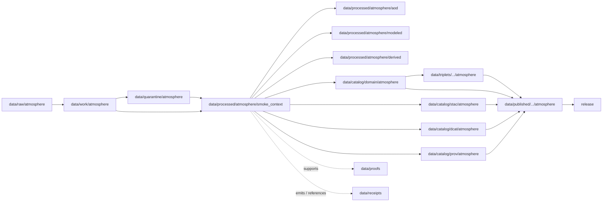

<!-- [KFM_META_BLOCK_V2]
doc_id: kfm://doc/data-processed-atmosphere-smoke-context-readme
title: data/processed/atmosphere/smoke_context/README.md — Atmosphere SmokeContext Processed Data README
version: v0.1
type: readme; data-lifecycle-sublane; processed-stage-guide; atmosphere-domain-lane; smoke-context-lane
status: draft; PROPOSED; data-root; processed-stage; atmosphere; smoke-context; SmokeContext; release-gated; remote-sensing-mask-aware; model-field-aware; sensitive-join-aware; source-role-aware
owners: OWNER_TBD — Atmosphere steward · Smoke/remote-sensing steward · Forecast/model steward · Hazards liaison · Data steward · Pipeline steward · Evidence steward · Policy steward · Release steward · Docs steward
created: NEEDS VERIFICATION — one-character placeholder existed before v0.1 expansion
updated: 2026-06-25
policy_label: public-doc; data; processed; atmosphere; smoke-context; lifecycle; governed; release-gated
tags: [kfm, data, processed, atmosphere, smoke-context, SmokeContext, smoke, HMS, HRRR-Smoke, AODRaster, PM25Observation, AirObservation, WindField, ForecastContext, AdvisoryContext, remote-sensing-mask, atmospheric-model-field, sensitive-joins, lifecycle, RAW, WORK, QUARANTINE, CATALOG, TRIPLET, PUBLISHED, EvidenceBundle, SourceDescriptor, ModelRunReceipt, ValidationReport, PolicyDecision, ReleaseManifest]
related:
  - ../README.md
  - ../aod/README.md
  - ../modeled/README.md
  - ../modeled/remote-sensing/README.md
  - ../forecast_context/README.md
  - ../pm25/README.md
  - ../air_observations/README.md
  - ../observed/README.md
  - ../advisory_context/README.md
  - ../derived/README.md
  - ../../README.md
  - ../../../README.md
  - ../../../../docs/domains/atmosphere/README.md
  - ../../../../docs/domains/atmosphere/SOURCES.md
  - ../../../../docs/architecture/smoke-atmosphere-hazards.md
  - ../../../../contracts/domains/atmosphere/SmokeContext.md
  - ../../../../contracts/domains/atmosphere/AODRaster.md
  - ../../../../contracts/domains/atmosphere/ForecastContext.md
  - ../../../../contracts/domains/atmosphere/PM25Observation.md
  - ../../../../contracts/domains/atmosphere/AirObservation.md
  - ../../../../contracts/domains/atmosphere/WindField.md
  - ../../../../contracts/domains/atmosphere/AdvisoryContext.md
  - ../../../../schemas/contracts/v1/domains/atmosphere/SmokeContext.schema.json
  - ../../../../policy/domains/atmosphere/
  - ../../../../policy/sensitivity/
  - ../../../../docs/doctrine/directory-rules.md
  - ../../../../docs/doctrine/lifecycle-law.md
  - ../../../../docs/doctrine/trust-membrane.md
  - ../../../raw/atmosphere/
  - ../../../work/atmosphere/
  - ../../../quarantine/atmosphere/
  - ../../../catalog/domain/atmosphere/README.md
  - ../../../catalog/stac/atmosphere/
  - ../../../catalog/dcat/atmosphere/
  - ../../../catalog/prov/atmosphere/
  - ../../../triplets/
  - ../../../published/
  - ../../../proofs/
  - ../../../receipts/
  - ../../../registry/
  - ../../../../release/
  - ../../../../pipelines/
  - ../../../../tools/validators/
notes:
  - "This file replaces a one-character placeholder at `data/processed/atmosphere/smoke_context/README.md`."
  - "This is the PROCESSED-stage sublane for normalized SmokeContext artifacts under Atmosphere. It is not RAW smoke/satellite/model storage, PM2.5 measurement storage, AODRaster authority, forecast/model authority, advisory authority, hazards/fire event truth, proof storage, release authority, public API/UI output, or life-safety guidance."
  - "SmokeContext artifacts must preserve source role, source family, geometry/raster/model-field scope, analysis/forecast time, retrieval time, uncertainty, sensitivity, correction posture, evidence linkage, policy posture, and release state before public use."
  - "SmokeContext may be `REMOTE_SENSING_MASK` or `ATMOSPHERIC_MODEL_FIELD`; it must not collapse into PM2.5 observation, AODRaster, observed sensor, hazards event truth, advisory instruction, proof, or release approval."
  - "The SmokeContext contract defines object meaning; this README does not create a second contract or schema authority."
  - "Rollback target for this expansion is previous placeholder blob SHA `e25f1814e51579d5f55c0f1fe0135ddb28a47f4a`."
[/KFM_META_BLOCK_V2] -->

<a id="top"></a>

# data/processed/atmosphere/smoke_context

> Atmosphere PROCESSED-stage sublane for normalized `SmokeContext` artifacts: governed smoke mask, plume, analysis, model-field, forecast, and smoke-related atmospheric context records that remain distinct from PM2.5 observations, AOD rasters, generic air observations, model forecasts, advisory guidance, hazards/fire event truth, proof, release, and public map/API/UI surfaces.

<p>
  
  
  
  
  
  
</p>

**Status:** draft / PROPOSED  
**Owners:** OWNER_TBD — Atmosphere steward · Smoke/remote-sensing steward · Forecast/model steward · Hazards liaison · Data steward · Pipeline steward · Evidence steward · Policy steward · Release steward · Docs steward  
**Path:** `data/processed/atmosphere/smoke_context/README.md`  
**Owning root:** `data/processed/`  
**Domain segment:** `atmosphere`  
**Object-family segment:** `smoke_context` / `SmokeContext`  
**Lifecycle stage:** `PROCESSED`  
**Exposure posture:** not public by default; public use requires governed catalog, evidence, source-role/proxy/model/sensitivity disclosure, policy, release, correction, and rollback linkage  
**Truth posture:** CONFIRMED target was a one-character placeholder · CONFIRMED `SmokeContext` contract and schema paths exist · CONFIRMED `SmokeContext` is source-dependent `REMOTE_SENSING_MASK` / `ATMOSPHERIC_MODEL_FIELD` context · PROPOSED smoke-context processed-sublane details · NEEDS VERIFICATION for actual child inventory, validators, receipts, CI enforcement, sensitivity policy, release linkage, and governed route behavior.

**Quick jumps:** [Purpose](#purpose) · [Lifecycle boundary](#lifecycle-boundary) · [Repo fit](#repo-fit) · [Accepted contents](#accepted-contents) · [Exclusions](#exclusions) · [SmokeContext requirements](#smokecontext-requirements) · [Smoke guardrails](#smoke-guardrails) · [Directory map](#directory-map) · [Evidence ledger](#evidence-ledger) · [Validation checklist](#validation-checklist) · [Rollback](#rollback)

---

## Purpose

`data/processed/atmosphere/smoke_context/` holds normalized smoke-context artifacts that have moved beyond RAW capture, WORK transforms, and QUARANTINE holds.

This lane is for processed `SmokeContext` records or derivatives that preserve source identity, source role, source family, source time, analysis time, forecast/model time where applicable, retrieval time, geometry/raster/model-field scope, uncertainty, sensitivity, QA/correction posture, evidence references, and downstream catalog readiness.

It is not a raw smoke/satellite/model lane. It is not a PM2.5 observation lane. It is not an AODRaster authority lane. It is not a forecast/model authority lane. It is not hazards/fire event truth. It is not advisory issuance, proof store, receipt store, source registry, catalog, release, semantic contract, schema, policy, public layer, public API/UI surface, or life-safety guidance source. It may support downstream catalog records, EvidenceBundle-backed UI payloads, public-safe smoke-context layers, Focus Mode summaries, advisory referrals, Hazards context, or release packages only after gates pass.

## Lifecycle boundary

```text
RAW -> WORK / QUARANTINE -> PROCESSED -> CATALOG / TRIPLET -> PUBLISHED
```



`data/processed/atmosphere/smoke_context/` is upstream of catalog, triplet, publication, and release. It must not be used as a normal public map/API/UI/AI source.

## Repo fit

| Responsibility | Correct home | Rule |
|---|---|---|
| Raw HMS/HRRR-Smoke/satellite/model products, source downloads, source rasters, source polygons, source-native tiles, QA payloads, or logs | `data/raw/atmosphere/` | Not this lane. |
| In-process smoke parsing, masking, polygon/raster transforms, model joins, reprojection, QA, scratch outputs, notebooks, or method experiments | `data/work/atmosphere/` | Not this lane. |
| Rights-unclear, source-role-unclear, stale, malformed, unsupported, disputed, uncertainty-missing, sensitivity-unclear, habitat/infrastructure-proximate, or unsafe smoke material | `data/quarantine/atmosphere/` | Not this lane until resolved. |
| Normalized SmokeContext processed artifacts | `data/processed/atmosphere/smoke_context/` | This lane. |
| AOD/remote-sensing proxy artifacts | `data/processed/atmosphere/aod/` | AOD remains its own proxy object and is not PM2.5. |
| Modeled smoke or model-field products | `data/processed/atmosphere/modeled/` or `forecast_context/` by accepted convention | Model role must remain explicit. |
| Modeled remote-sensing comparisons | `data/processed/atmosphere/modeled/remote-sensing/` | Use when the product intentionally combines model-field and remote-sensing-mask roles. |
| PM2.5 measurements | `data/processed/atmosphere/pm25/` | PM2.5 observations require PM25Observation semantics. |
| General air observations | `data/processed/atmosphere/air_observations/` | Smoke context may compare to observations but must not replace them. |
| Advisory/referral context | `data/processed/atmosphere/advisory_context/` | Advisory context remains official-source referral, not smoke truth or instruction. |
| Hazards/fire event truth and impacts | Hazards responsibility roots | Atmosphere owns smoke context only. |
| Atmosphere domain catalog records | `data/catalog/domain/atmosphere/` | Downstream catalog stage. |
| Atmosphere STAC/DCAT/PROV records | `data/catalog/{stac,dcat,prov}/atmosphere/` | Downstream catalog projections, if accepted. |
| Atmosphere triplet/graph projections | `data/triplets/.../atmosphere/` | Downstream graph stage. |
| Atmosphere public-safe products | `data/published/.../atmosphere/` | Downstream after release. |
| EvidenceBundle/proof records | `data/proofs/` | Separate proof family. |
| Source, run, model-run, transform, validation, policy, correction, and release receipts | `data/receipts/` | Separate receipt family. |
| SourceDescriptor/source registry records | `data/registry/` | Separate registry family. |
| Release decisions, manifests, rollback cards, corrections, withdrawals | `release/` | Separate publication authority. |
| SmokeContext semantic contract | `contracts/domains/atmosphere/SmokeContext.md` | Object meaning; not data. |
| SmokeContext schema | `schemas/contracts/v1/domains/atmosphere/SmokeContext.schema.json` | Machine shape; not data. |
| Policy, validators, tests, pipelines, apps, packages | `policy/`, `tools/validators/`, `tests/`, `pipelines/`, `apps/`, `packages/` | Separate roots. |

## Accepted contents

Processed `SmokeContext` data may include:

- normalized smoke mask, plume, analysis, forecast/model, or smoke-related atmospheric-context records;
- HMS-style smoke analysis or satellite-derived smoke/plume context when labeled as `REMOTE_SENSING_MASK` or the accepted proxy role;
- HRRR-Smoke-style or other modeled smoke products when labeled as `ATMOSPHERIC_MODEL_FIELD` with model-run lineage and uncertainty posture;
- geometry/raster/model-field scope, source time, analysis/forecast time, retrieval time, valid time, processing time, uncertainty, QA, caveats, freshness, and sensitivity metadata;
- processed joins to `AODRaster`, `PM25Observation`, `AirObservation`, `WindField`, `ForecastContext`, or `AdvisoryContext` when object meanings and source roles remain visible;
- sensitive-join review sidecars for habitat, biodiversity, archaeology, infrastructure, or other policy-significant joins when those sidecars are not proofs, receipts, source registry records, catalog records, schemas, or policy rules;
- processed artifacts prepared for downstream domain catalog, STAC/DCAT/PROV packaging, EvidenceBundle support, triplet generation, LayerManifest creation, or release review.

## Exclusions

Do not store these under `data/processed/atmosphere/smoke_context/`:

- RAW smoke products, HMS/HRRR-Smoke/satellite/model downloads, source rasters, source polygons, source-native tiles, QA payloads, logs, screenshots, or source-native records.
- WORK/scratch outputs that have not passed processing gates.
- Quarantined, malformed, stale, source-role-unclear, rights-unclear, uncertainty-missing, sensitivity-unclear, habitat/infrastructure-proximate, unsupported, disputed, or unsafe smoke material.
- PM2.5 observations, AQI/report records, air observations, AODRaster canonical records, forecast/model canonical records, advisory/referral records, hazards/fire event records, or hazard-impact records unless only referenced as context and stored in their correct lanes.
- AOD-as-PM2.5, smoke-as-PM2.5, smoke forecast-as-observation, or smoke context-as-hazard-event substitution.
- Exposure claims, health-effect claims, damage claims, evacuation claims, infrastructure impacts, crop-loss claims, fire event truth, public alerting behavior, emergency instructions, or life-safety guidance.
- Domain catalog records, STAC records, DCAT records, PROV records, triplet/graph records, published outputs, proofs, receipts, source registry records, release records, schemas, policy rules, validators, tests, pipelines, app/UI/API code.

## SmokeContext requirements

PROPOSED until concrete validators and CI enforcement are verified:

| Requirement | Meaning |
|---|---|
| Source trace | Every processed SmokeContext artifact should trace to SourceDescriptor or source registry context when source authority matters. |
| Source role | `REMOTE_SENSING_MASK`, `ATMOSPHERIC_MODEL_FIELD`, advisory context, observed support, or other admitted role must be explicit and non-collapsing. |
| Product lineage | Source family, product name, source vintage, source time, analysis/forecast time, retrieval time, processing time, correction/supersession state, and method should remain visible. |
| Geometry/raster/field scope | Geometry, raster footprint, pixel semantics, plume/mask semantics, model grid, valid time, horizon, resolution, nodata, QA, and uncertainty should be explicit enough for downstream validation. |
| Model-run trace | Modeled smoke products should link to model-run receipt or equivalent lineage and preserve forecast uncertainty. |
| Proxy boundary | Smoke masks/proxies must not be presented as PM2.5, AQI, ground observation, exposure, health effect, hazard impact, or life-safety guidance by themselves. |
| Sensitive joins | Smoke/fire/AOD joins near sensitive habitat, infrastructure, people, or other policy-significant targets should fail closed unless policy/review/release supports public exposure. |
| Evidence linkage | Claims about source, role, time, geometry/raster/field, uncertainty, sensitivity, correction, or release should resolve downstream to EvidenceBundle/proof context. |
| Policy posture | Public display requires rights, source-role, freshness, uncertainty, sensitivity, caveat, policy/admissibility posture, and release state. |
| Catalog readiness | Processed SmokeContext artifacts intended for discovery should promote through Atmosphere catalog lanes, not directly to public use. |
| Release readiness | Public use requires release state, published output path, correction path, and rollback target. |
| No life-safety by default | SmokeContext does not create public alerts, emergency instructions, exposure claims, health/safety guidance, or hazards event truth without separate authority and review. |

## Smoke guardrails

- `SmokeContext` is context, not PM2.5 measurement.
- `SmokeContext` is not AQI.
- Smoke context may be a remote-sensing mask/proxy or an atmospheric model field depending on source role; role tagging is mandatory.
- AOD and smoke masks are proxies and must not be presented as PM2.5 or ground observations.
- HRRR-Smoke-style products are model fields and must carry model-run receipt and uncertainty; they are not observations.
- Smoke context may support advisory referral, but it does not issue life-safety instructions.
- Atmosphere owns smoke atmospheric context; Hazards owns event/impact truth, emergency posture, and hazards-specific claims.
- Smoke/fire/AOD joins near sensitive habitat, infrastructure, people, or other policy-significant targets fail closed unless policy/review/release support public exposure.
- Public display requires source rights, source role, freshness, uncertainty, sensitivity, validation, policy, release record, correction path, and rollback target.
- Unreleased processed smoke-context artifacts are not public merely because they exist under this directory.

> [!CAUTION]
> Do not use this lane as a shortcut from processed smoke context to PM2.5 measurement claims, hazard/fire event truth, exposure claims, public health guidance, public alerts, evacuation guidance, infrastructure impacts, crop-loss claims, public layers, or public API/UI payloads. SmokeContext products must pass catalog, evidence, policy, validation, release, correction, and rollback gates before public use.

## Directory map

Actual child inventory remains **NEEDS VERIFICATION**. Use this as a proposed local organization pattern only after confirming current repo convention and validators.

```text
data/processed/atmosphere/smoke_context/
├── README.md
├── normalized/              # PROPOSED — processed SmokeContext records
├── masks/                   # PROPOSED — smoke masks/plumes, not PM2.5 observations
├── model_fields/            # PROPOSED — modeled smoke context with model-run lineage
├── plume_context/           # PROPOSED — plume/analysis context with proxy labels
├── uncertainty/             # PROPOSED — uncertainty/caveat sidecars
├── sensitivity/             # PROPOSED — sensitive-join review sidecars, not policy authority
├── quality/                 # PROPOSED — QA, missingness, confidence, limitations
├── joins/                   # PROPOSED — links to AOD, PM2.5, AirObservation, WindField, ForecastContext, AdvisoryContext
├── _manifests/              # PROPOSED — lane-local non-release manifests only
└── _README_TODO.md          # PROPOSED — remove after actual child inventory is documented
```

## Evidence ledger

| Source | Status | Supports | Limits |
|---|---|---|
| Previous file | CONFIRMED | Target existed as a one-character placeholder. | Did not define SmokeContext PROCESSED-stage boundaries. |
| `data/processed/atmosphere/aod/README.md` | CONFIRMED sibling README | AOD/remote-sensing proxy is not PM2.5, AQI, or ground observation. | Does not define smoke-context inventory or release behavior. |
| `data/processed/atmosphere/modeled/README.md` | CONFIRMED sibling README | Modeled products are not observations and require model-run/uncertainty posture. | Does not define smoke-context inventory. |
| `data/processed/atmosphere/modeled/remote-sensing/README.md` | CONFIRMED sibling README | Model-field and remote-sensing proxy roles must remain separated. | Does not make this lane a public release authority. |
| `data/processed/atmosphere/pm25/README.md` | CONFIRMED sibling README | PM25Observation is the PM2.5 object; AOD/smoke proxies must not become PM2.5. | Does not define smoke-context inventory. |
| `data/processed/atmosphere/advisory_context/README.md` | CONFIRMED sibling README | Advisory context remains official-source referral and not life-safety instruction from KFM. | Does not define smoke-context inventory. |
| `data/processed/README.md` | CONFIRMED | Parent processed lane is upstream of catalog, triplets, and publication and is not public by default. | Does not prove child inventory under this lane. |
| `data/catalog/domain/atmosphere/README.md` | CONFIRMED | Atmosphere catalog lane includes smoke/AOD/model/advisory context downstream and preserves source-role guardrails. | Does not prove smoke-context processed inventory or release behavior. |
| `docs/domains/atmosphere/README.md` | CONFIRMED doctrine / PROPOSED implementation | Atmosphere owns smoke/aerosol context, model/advisory context, and public-safe derived products. | Implementation maturity and runtime behavior remain NEEDS VERIFICATION. |
| `contracts/domains/atmosphere/SmokeContext.md` | CONFIRMED contract file | Defines SmokeContext as governed smoke context with remote-sensing/model role discipline and Hazards boundary. | Contract does not prove schema enforcement, validator behavior, or release approval. |
| `schemas/contracts/v1/domains/atmosphere/SmokeContext.schema.json` | CONFIRMED scaffold schema | Paired SmokeContext schema exists with PROPOSED status. | Properties are currently empty; validator enforcement remains NEEDS VERIFICATION. |
| `docs/doctrine/directory-rules.md` | CONFIRMED doctrine / PROPOSED path specifics | Data paths encode lifecycle phase and domain segment; promotion is governed. | Does not prove runtime enforcement. |

## Validation checklist

- [ ] Confirm actual child directories under `data/processed/atmosphere/smoke_context/`.
- [ ] Confirm accepted SmokeContext source/domain path convention.
- [ ] Confirm `SmokeContext` schema fields and title casing are updated beyond scaffold if needed.
- [ ] Confirm SmokeContext processed validators and CI checks.
- [ ] Confirm SourceDescriptor/source registry linkage for every source-derived smoke artifact.
- [ ] Confirm source family, source role, product name, geometry/raster/model-field scope, source time, analysis/forecast time, retrieval time, processing time, valid time, model run, uncertainty, QA, sensitivity, correction, stale-state, and supersession handling.
- [ ] Confirm smoke-vs-PM2.5, smoke-vs-AOD, smoke-vs-observation, smoke-vs-model, smoke-vs-advisory, smoke-vs-hazards/event truth, and smoke-vs-sensitive-join boundaries.
- [ ] Confirm RunReceipt, ModelRunReceipt, TransformReceipt, ValidationReport, PolicyDecision, correction path, and rollback target where applicable.
- [ ] Confirm no RAW, WORK, QUARANTINE, CATALOG, TRIPLET, PUBLISHED, proof, receipt, release, schema, policy, validator, package, pipeline, app, API, public layer, PM2.5 measurement, AOD authority, observation, advisory, hazard/fire event truth, exposure, health/safety, emergency, infrastructure impact, crop-loss, or public-alerting artifacts are misplaced here.
- [ ] Confirm promotion flow from processed SmokeContext data to catalog/triplet/published outputs is governed, source-role-safe, proxy/model-aware, sensitivity-aware, evidence-backed, and reversible.
- [ ] Confirm public clients and Focus Mode cannot use this lane as a direct PM2.5, AQI, observation, official advisory, hazard event, exposure, emergency, infrastructure-impact, crop-loss, public health, or life-safety source.

## Rollback

Rollback is required if this lane becomes an Atmosphere source-data root, PM25Observation replacement, AODRaster replacement, ForecastContext replacement, advisory authority root, hazards/fire event truth root, official warning/public-alerting root, quarantine bypass, proof store, receipt store, catalog root, triplet root, source-registry root, release-decision root, published-output root, public layer root, public tile root, schema root, policy root, validator root, implementation root, public API shortcut, public exposure shortcut, public health/exposure source, infrastructure-impact source, crop-loss source, regulatory-claim source, emergency instruction source, or life-safety guidance source.

Rollback target for this expansion: previous placeholder blob SHA `e25f1814e51579d5f55c0f1fe0135ddb28a47f4a`.

<p align="right"><a href="#top">Back to top</a></p>
