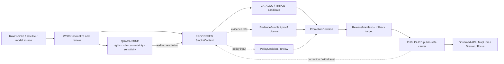

<!-- [KFM_META_BLOCK_V2]
doc_id: kfm://doc/data-processed-atmosphere-smoke-context-readme
title: data/processed/atmosphere/smoke_context/ — Atmosphere Smoke Context Processed Data
version: v0.2.0
type: directory-readme
subtype: processed-atmosphere-smoke-context-lane
status: repository-grounded draft; payload inventory, enforceable schema, validators, fixtures, receipts, proof, release, cross-lane implementation, and runtime behavior remain bounded
owners:
  - "NEEDS VERIFICATION — Atmosphere domain steward"
  - "NEEDS VERIFICATION — smoke, aerosol, remote-sensing, and modeled-atmosphere steward"
  - "NEEDS VERIFICATION — PM2.5, AOD, forecast/model, advisory, Hazards, sensitivity, and source-role reviewers"
  - "NEEDS VERIFICATION — data, evidence, policy, release, correction, rollback, and docs stewards"
created: NEEDS VERIFICATION — one-character placeholder existed before v0.1 expansion
updated: 2026-07-25
policy_label: public-doc; processed-stage; atmosphere; smoke-context; source-role-aware; proxy-model-separated; sensitive-join-aware; release-gated; no-direct-public-path
path: data/processed/atmosphere/smoke_context/README.md
truth_posture: >
  CONFIRMED exact target path, prior blob, Directory Rules placement, Atmosphere parent lane,
  SmokeContext semantic contract, paired scaffold schema posture, source-dependent REMOTE_SENSING_MASK
  and ATMOSPHERIC_MODEL_FIELD roles, PM2.5/AOD/model/advisory/Hazards boundaries, and PROCESSED
  lifecycle boundary / PROPOSED lane-local admission profile, geometry-raster-field packet, source-role
  routing, sensitive-join controls, and downstream promotion expectations / UNKNOWN recursive payload
  inventory, live source activation, production validators, fixtures, receipts, proof closure, release
  instances, hosting, public routes, and cross-lane runtime behavior / NEEDS VERIFICATION accountable
  owners, accepted source-role vocabulary, plume/mask semantics, uncertainty and confidence conventions,
  sensitive-join policy, correction propagation, cache invalidation, withdrawal behavior, and rollback drills
evidence_snapshot:
  repository: bartytime4life/Kansas-Frontier-Matrix
  base_ref: main
  base_commit: 1ebf46b01508345280819b944d41eb3ebc39b295
  prior_blob: 438882bc885cfa3175e5608b923c9f42393c1d31
  directory_rules_blob: 2affb080e6f0043867c64c7f06c1ca52030fbd55
  smoke_context_contract_blob: 3ce536cd9440df2d0c07da4170baf9d32a4cbb1a
related:
  - ../README.md
  - ../aod/README.md
  - ../modeled/README.md
  - ../modeled/remote-sensing/README.md
  - ../forecast_context/README.md
  - ../pm25/README.md
  - ../air_observations/README.md
  - ../observed/README.md
  - ../advisory_context/README.md
  - ../derived/README.md
  - ../../README.md
  - ../../../README.md
  - ../../../../docs/domains/atmosphere/README.md
  - ../../../../docs/domains/atmosphere/SOURCES.md
  - ../../../../docs/domains/atmosphere/POLICY.md
  - ../../../../docs/domains/atmosphere/PUBLICATION_POSTURE.md
  - ../../../../docs/domains/atmosphere/SENSITIVITY.md
  - ../../../../docs/doctrine/directory-rules.md
  - ../../../../contracts/domains/atmosphere/SmokeContext.md
  - ../../../../contracts/domains/atmosphere/AODRaster.md
  - ../../../../contracts/domains/atmosphere/ForecastContext.md
  - ../../../../contracts/domains/atmosphere/PM25Observation.md
  - ../../../../contracts/domains/atmosphere/AirObservation.md
  - ../../../../contracts/domains/atmosphere/WindField.md
  - ../../../../contracts/domains/atmosphere/AdvisoryContext.md
  - ../../../../schemas/contracts/v1/domains/atmosphere/SmokeContext.schema.json
  - ../../../../policy/domains/atmosphere/README.md
  - ../../../raw/atmosphere/README.md
  - ../../../work/atmosphere/README.md
  - ../../../quarantine/atmosphere/README.md
  - ../../../catalog/domain/atmosphere/README.md
  - ../../../triplets/README.md
  - ../../../proofs/README.md
  - ../../../receipts/README.md
  - ../../../registry/sources/atmosphere/README.md
  - ../../../../release/candidates/atmosphere/README.md
  - ../../../../release/README.md
notes:
  - "Same-path Markdown modernization only; no smoke bytes, source activation, contract, schema, policy, validator, workflow, proof, release, route, hosting, Hazards event, or KFM publication state changed."
  - "SmokeContext is source-dependent context: REMOTE_SENSING_MASK for analysis/mask/proxy products and ATMOSPHERIC_MODEL_FIELD for forecast/model products."
  - "Smoke context is not PM2.5, AQI, AOD authority, observed sensor truth, advisory instruction, Hazards event/impact truth, exposure proof, or release approval."
  - "Sensitive smoke/fire/AOD joins fail closed until rights, source role, sensitivity, evidence, policy, review, release, correction, and rollback obligations close."
  - "Rollback target for v0.2.0 is prior blob SHA `438882bc885cfa3175e5608b923c9f42393c1d31`."
[/KFM_META_BLOCK_V2] -->

<a id="top"></a>

# `data/processed/atmosphere/smoke_context/` — Atmosphere smoke-context processed data

> **One-line purpose.** Hold normalized smoke mask, plume, analysis, modeled, forecast, and atmospheric-context candidates while preserving source role, product lineage, geometry/raster/field semantics, time, uncertainty, sensitivity, evidence, correction, and downstream-use limits.

[](#status)
[](#authority-level)
[](#what-belongs-here)
[](#outputs)
[](#source-role-and-smoke-boundaries)
[](#validation)

> [!IMPORTANT]
> **Smoke context is not a measurement, event, impact, or instruction by itself.** A plume polygon, satellite analysis, modeled field, forecast, or mask can be useful context while remaining uncertain, source-dependent, stale, rights-limited, sensitivity-held, scientifically unfit for a requested claim, or unreleased.

**Path:** `data/processed/atmosphere/smoke_context/README.md`  
**Owning root:** `data/`  
**Lifecycle phase:** `processed/`  
**Domain segment:** `atmosphere/`  
**Parent lane:** `data/processed/atmosphere/`  
**Lane role:** source-dependent `SmokeContext`  
**Direct public access:** denied  
**Last reviewed:** 2026-07-25

**Quick navigation:** [Purpose](#purpose) · [Authority level](#authority-level) · [Status](#status) · [What belongs here](#what-belongs-here) · [What does NOT belong here](#what-does-not-belong-here) · [Inputs](#inputs) · [Outputs](#outputs) · [Validation](#validation) · [Review burden](#review-burden) · [Related folders](#related-folders) · [ADRs](#adrs) · [Last reviewed](#last-reviewed) · [Admission profile](#smokecontext-admission-profile) · [Source-role boundaries](#source-role-and-smoke-boundaries) · [Geometry and field semantics](#geometry-raster-field-and-time-semantics) · [Cross-lane routing](#cross-lane-routing) · [Lifecycle and promotion](#lifecycle-and-promotion) · [Correction and rollback](#correction-withdrawal-and-rollback) · [Verification register](#open-verification-register) · [No-loss ledger](#no-loss-ledger)

---

## Purpose

This directory is the Atmosphere domain's **PROCESSED-stage lane for `SmokeContext` candidates**. It may hold normalized smoke masks, plume or analysis context, satellite-derived smoke support, modeled smoke fields, smoke forecasts, and object-ready derivatives that have moved beyond RAW capture, WORK transformation, and QUARANTINE holds.

The lane exists to preserve the answer to eight questions before downstream use:

1. Which source family, product, source role, and knowledge character apply?
2. Is the artifact a remote-sensing analysis/mask/proxy, atmospheric model field, forecast, or another reviewed context role?
3. Which geometry, raster footprint, pixel or cell semantics, model grid, plume/mask meaning, and spatial support apply?
4. Which source, analysis, initialization, valid, forecast-horizon, retrieval, processing, correction, supersession, and release times apply?
5. Which method, model run, resolution, nodata, QA, uncertainty, confidence, caveat, and stale-state apply?
6. Which PM2.5, AOD, wind, air-observation, forecast, advisory, or Hazards relation is being asserted—and which object retains ownership?
7. Which rights, sensitivity, evidence, policy, review, release, correction, and rollback states qualify the artifact?
8. Which claims and downstream uses are allowed, restricted, narrowed, delayed, denied, or required to abstain?

It is not a RAW source lane, PM2.5 or AQI observation store, AOD authority, model or forecast authority, advisory issuer, Hazards fire-event or impact store, exposure or health service, proof store, receipt authority, catalog authority, release authority, or public map/API/UI source.

## Authority level

**Implementation-bearing lifecycle lane with narrow contextual authority.** The target path is CONFIRMED in the repository and remains under `data/processed/atmosphere/`, consistent with Directory Rules' lifecycle and domain-placement rules.

Its authority is deliberately limited:

- it may carry processed `SmokeContext` candidates and lane-local explanatory metadata;
- it does not define `SmokeContext` meaning—that remains in the semantic contract;
- it does not define machine shape—the paired schema remains under `schemas/contracts/v1/domains/atmosphere/`;
- it does not define source identity, rights, role, or activation—that remains in the source registry and `SourceDescriptor`;
- it does not decide whether an artifact is a mask, proxy, model field, observation, advisory, event, impact, exposure, or publishable claim;
- it does not replace PM2.5, AOD, forecast/model, advisory, or Hazards object families;
- it does not create emergency, medical, evacuation, occupational, infrastructure-impact, crop-loss, or life-safety authority.

## Status

| Surface | Status | Evidence-bounded interpretation |
|---|---|---|
| This README and path | **CONFIRMED** | The file exists at the pinned base and is updated in place. |
| Parent Atmosphere processed lane | **CONFIRMED** | `data/processed/atmosphere/README.md` identifies `smoke_context/` as smoke mask, plume, model/proxy, and atmospheric context with no event or public-alert authority. |
| `SmokeContext` semantic contract | **CONFIRMED repository document / draft** | Defines source-dependent `REMOTE_SENSING_MASK` and `ATMOSPHERIC_MODEL_FIELD` roles, PM2.5/AOD/model/advisory/Hazards boundaries, and non-release authority. |
| Paired `SmokeContext` schema | **CONFIRMED scaffold / not enforceable as verified** | The contract reports empty properties, `additionalProperties: true`, and unresolved title casing. |
| Adjacent processed lanes | **CONFIRMED paths** | AOD, PM2.5, observed, modeled, forecast, advisory, derived, and modeled-remote-sensing lanes remain separate responsibilities. |
| Real processed smoke payload inventory | **UNKNOWN** | This documentation task did not inspect or expose smoke, model, satellite, or plume payloads. |
| Validators, fixtures, policy enforcement, and CI | **NEEDS VERIFICATION** | No accepted production SmokeContext enforcement suite was verified. |
| Receipts, proof, release instances, hosting, public routes, and cross-lane runtime behavior | **UNKNOWN / held** | Presence in this directory creates none of these states. |

<a id="accepted-contents"></a>

## What belongs here

Good fits are processed smoke-context artifacts whose source role, geometry or field semantics, uncertainty, sensitivity, and correction lineage remain inspectable, including:

- normalized HMS-style smoke analysis, plume, mask, or satellite-derived context labeled `REMOTE_SENSING_MASK` or another accepted proxy role;
- normalized HRRR-Smoke-style or other forecast/model products labeled `ATMOSPHERIC_MODEL_FIELD` with model-run identity, initialization, valid time, horizon, and uncertainty;
- smoke polygons, rasters, grids, masks, plume envelopes, probabilities, categories, or context fields with explicit geometry/raster/cell semantics;
- source family, product name, source vintage, method/version, source time, analysis time, retrieval time, processing time, correction, stale state, supersession, and withdrawal metadata;
- QA, cloud or retrieval limitations, nodata, missingness, confidence, uncertainty, coverage, sensitivity, caveat, and comparability sidecars that are not proofs, receipts, policy decisions, or releases;
- controlled references to `AODRaster`, `PM25Observation`, `AirObservation`, `WindField`, `ForecastContext`, `AdvisoryContext`, or Hazards records without duplicating or replacing their canonical truth;
- sensitive-join review sidecars for habitat, biodiversity, archaeology, infrastructure, people, or other policy-significant contexts when those sidecars do not become policy authority;
- public-candidate smoke-context derivatives that remain upstream of catalog, evidence closure, policy review, release, and public serving;
- object-ready candidates prepared for future contract/schema validation, EvidenceBundle closure, catalog review, LayerManifest generation, or release review;
- lane-local README, inventory, migration, or non-release manifest notes that explain artifact identity without becoming authority records.

<a id="exclusions"></a>

## What does NOT belong here

Do not place these in `data/processed/atmosphere/smoke_context/`:

- RAW HMS, HRRR-Smoke, satellite, model, raster, polygon, tile, feed, download, log, screenshot, or source-native records;
- WORK parsing, reprojection, polygonization, raster/vector conversion, model tuning, interpolation, masking, temporary joins, notebooks, or QA experiments;
- QUARANTINE material with unresolved rights, source role, freshness, method, uncertainty, sensitivity, dispute, geometry semantics, QA, or safety state;
- PM2.5 concentration, AQI/report records, general air observations, AOD canonical records, forecast/model canonical records, advisory records, Hazards event/impact records, or released products except as controlled references;
- smoke, AOD, visibility, hotspot, model, or plume context silently relabeled as PM2.5, AQI, observed sensor data, fire-event truth, exposure, or impact;
- modeled smoke silently relabeled as observation;
- proxy or mask presence silently interpreted as smoke concentration, ground-level exposure, health effect, asset impact, crop loss, visibility impairment, or evacuation need;
- public alerts, official warnings, evacuation instructions, medical advice, occupational guidance, emergency instructions, or life-safety guidance;
- semantic contracts, JSON Schemas, policy rules, validators, tests, fixtures, executable pipelines, source descriptors, catalogs, STAC/DCAT/PROV projections, triplets, proofs, receipts, releases, correction notices, rollback cards, or published artifacts;
- public map, tile, API, download, export, Focus Mode, Evidence Drawer, graph, search, notification, or AI-answer payloads;
- transform secrets, credentials, restricted source details, exact sensitive locations, or parameters whose disclosure would weaken a safety or sensitivity control.

## Inputs

Inputs may enter this lane only through governed lifecycle transitions from:

- `data/work/atmosphere/` after source identity, role, rights, method, geometry/raster/field semantics, time, QA, uncertainty, sensitivity, evidence, and correction posture are recorded;
- `data/quarantine/atmosphere/` after the hold condition is resolved and the remediation decision is auditable;
- accepted Atmosphere pipelines or tools that preserve source bytes by reference, input identities, source roles, model-run identity where applicable, method version, transforms, uncertainty, and correction state;
- accepted cross-domain context where the source domain retains ownership and the relation is explicit, evidence-backed, policy-reviewed, and non-authoritative for that source domain.

A connector-to-PROCESSED, watcher-to-PROCESSED, public-upload-to-PROCESSED, renderer-to-PROCESSED, or AI-to-PROCESSED shortcut is not an accepted normal path. Connectors, watchers, renderers, and AI systems do not silently promote or originate canonical truth.

## Outputs

This lane may support downstream candidates for:

- `data/catalog/domain/atmosphere/` and accepted STAC/DCAT/PROV projections;
- `data/triplets/` or other relationship projections that preserve source role, object ownership, time, uncertainty, and evidence references;
- separate `data/proofs/` and `data/receipts/` objects;
- candidate LayerManifest or public-safe layer inputs in their proper authority roots;
- `release/candidates/atmosphere/` after identity, rights, role, freshness, uncertainty, sensitivity, validation, evidence, review, correction, and rollback obligations are met;
- `data/published/` only through a governed release transition and separate released artifact path;
- governed API, MapLibre, Evidence Drawer, export, Focus Mode, or AI carriers only after public-safe release.

> [!CAUTION]
> Ordinary public clients must not read this directory directly. A visually convincing plume, mask, modeled field, hotspot relation, or forecast does not establish observation, exposure, impact, event truth, release state, or public safety.

## Validation

Validation is fail-closed and proportional to claim significance. At minimum, a candidate should demonstrate:

| Check | Required posture | Failure outcome |
|---|---|---|
| Identity | Stable record/artifact identity, source identity, product identity, and content or method digest where practical. | `ERROR` / `HOLD` |
| Source role | `REMOTE_SENSING_MASK`, `ATMOSPHERIC_MODEL_FIELD`, or another accepted role is explicit and fixed. | `DENY` |
| Product lineage | Source family, product, version/vintage, method, transforms, and correction/supersession lineage remain recoverable. | `HOLD` |
| Geometry/raster/field semantics | Geometry type, footprint, pixel/cell meaning, model grid, resolution, nodata, coverage, plume/mask/category semantics, CRS, and transforms are explicit. | `ABSTAIN` / `HOLD` |
| Time | Source, analysis, initialization, valid, horizon, retrieval, processing, correction, supersession, and release times remain distinguishable. | `ABSTAIN` / stale hold |
| Model-run trace | Modeled products resolve to model/run identity, inputs or receipt reference, initialization, valid time, horizon, and uncertainty. | `DENY` / `HOLD` |
| Proxy boundary | Smoke masks, AOD, hotspots, visibility, or model outputs are not presented as PM2.5, AQI, ground observation, exposure, health, event, or impact truth. | `DENY` |
| Sensitive joins | Habitat, biodiversity, archaeology, infrastructure, people, and other policy-significant joins are reviewed and transformed before exposure. | `DENY` / `RESTRICT` |
| Rights and freshness | Rights, terms, attribution, access class, cadence, source freshness, and stale policy are resolved. | `DENY` / `HOLD` |
| Evidence | Consequential claims resolve through EvidenceRef to admissible EvidenceBundle support. | `ABSTAIN` |
| Correction | Predecessor/successor, correction, invalidation, supersession, withdrawal, and affected downstream artifacts are traceable. | `HOLD` |
| Release | Policy decision, review state, proof, release manifest, correction path, rollback target, and public-safe carrier are present. | `DENY` |

Passing structural checks does **not** prove smoke occurrence at ground level, PM2.5 concentration, exposure, health effect, event impact, fire origin, asset impact, crop loss, emergency need, release approval, or public safety.

## Review burden

Changes require review proportional to their meaning and exposure:

- Atmosphere smoke, aerosol, remote-sensing, and model stewardship for source-role and object semantics;
- the owning PM2.5, AOD, air-observation, wind, forecast, advisory, or Hazards steward for cross-object relations;
- source, rights, and sensitivity review for source activation, attribution, restricted details, habitat/infrastructure proximity, people or private-property joins, and public transforms;
- scientific-method and data-quality review for mask/plume meaning, model runs, raster/grid semantics, interpolation, uncertainty, QA, freshness, and comparability;
- policy review for role changes, sensitive joins, public restrictions, finite-outcome behavior, or transformed geometry;
- evidence, release, correction, rollback, and docs review before public use or authority-changing documentation.

**CODEOWNERS and accountable individuals are NEEDS VERIFICATION.** This README does not assign them.

<a id="directory-map"></a>

## Related folders

| Responsibility | Verified or bounded home | Relationship |
|---|---|---|
| Parent processed lane | [`../README.md`](../README.md) | Atmosphere lifecycle parent and lane index. |
| AOD proxy context | [`../aod/README.md`](../aod/README.md) | AOD remains a separate remote-sensing proxy object. |
| PM2.5 observations | [`../pm25/README.md`](../pm25/README.md) | Smoke context does not become PM2.5 concentration or AQI. |
| Modeled and forecast context | [`../modeled/README.md`](../modeled/README.md), [`../forecast_context/README.md`](../forecast_context/README.md) | Model role and model-run lineage remain explicit. |
| Modeled remote-sensing comparisons | [`../modeled/remote-sensing/README.md`](../modeled/remote-sensing/README.md) | Combined comparison lane; must preserve model/proxy distinctions. |
| Observed and air-observation context | [`../observed/README.md`](../observed/README.md), [`../air_observations/README.md`](../air_observations/README.md) | Smoke context may compare with but not replace observed values. |
| Advisory context | [`../advisory_context/README.md`](../advisory_context/README.md) | Official-source referral; not KFM-issued instruction. |
| Derived products | [`../derived/README.md`](../derived/README.md) | Derived cross-object candidates remain downstream and non-authoritative. |
| Semantic contract | [`../../../../contracts/domains/atmosphere/SmokeContext.md`](../../../../contracts/domains/atmosphere/SmokeContext.md) | Defines object meaning and source-dependent knowledge character. |
| Machine schema | [`../../../../schemas/contracts/v1/domains/atmosphere/SmokeContext.schema.json`](../../../../schemas/contracts/v1/domains/atmosphere/SmokeContext.schema.json) | Current scaffold shape; enforcement remains unverified. |
| Source register | [`../../../../docs/domains/atmosphere/SOURCES.md`](../../../../docs/domains/atmosphere/SOURCES.md), [`../../../registry/sources/atmosphere/README.md`](../../../registry/sources/atmosphere/README.md) | Source-family doctrine and source-admission records. |
| Policy doctrine and bundle root | [`../../../../docs/domains/atmosphere/POLICY.md`](../../../../docs/domains/atmosphere/POLICY.md), [`../../../../policy/domains/atmosphere/README.md`](../../../../policy/domains/atmosphere/README.md) | Human-readable rules and bounded enforceable-policy home. |
| Catalog, proof, receipts, release | [`../../../catalog/domain/atmosphere/README.md`](../../../catalog/domain/atmosphere/README.md), [`../../../proofs/README.md`](../../../proofs/README.md), [`../../../receipts/README.md`](../../../receipts/README.md), [`../../../../release/candidates/atmosphere/README.md`](../../../../release/candidates/atmosphere/README.md) | Downstream authority families; none are replaced by this lane. |

## ADRs

- **ADR-0001 schema-home rule:** machine schemas belong under `schemas/contracts/v1/...`; semantic meaning belongs under `contracts/`.
- **Directory Rules §15:** folder READMEs expose purpose, authority, status, contents, inputs, outputs, validation, review burden, related folders, ADRs, and review date.
- **No SmokeContext-lane-specific accepted ADR was verified.**
- **NEEDS VERIFICATION:** accepted source-role vocabulary, smoke-context child inventory, model-run receipt contract, sensitive-join policy, and cross-domain Hazards relationship.

## Last reviewed

**2026-07-25** — documentation modernization review against the pinned repository evidence recorded in the meta block.

This date records review of this README, not validation of source rights, payloads, model runs, hazard events, exposure, policy enforcement, release state, public behavior, or operational correctness.

---

<a id="smokecontext-requirements"></a>

## SmokeContext admission profile

The following profile is **PROPOSED** until accepted contracts, schemas, validators, fixtures, and CI prove it:

| Dimension | Required posture |
|---|---|
| Record identity | Deterministic or steward-assigned identity plus source/product and content or method digest where practical. |
| Source role | `REMOTE_SENSING_MASK`, `ATMOSPHERIC_MODEL_FIELD`, or another accepted role fixed at admission. |
| Source and product | Source family, product name, maintainer/issuer, version/vintage, rights, cadence, and attribution. |
| Geometry/raster/field | Geometry type, footprint, pixel/cell meaning, model grid, CRS, resolution, nodata, coverage, plume/mask/category semantics, and transforms. |
| Time | Source, analysis, initialization, valid, horizon, retrieval, processing, correction, supersession, and release times. |
| Method and model | Analysis method, retrieval or classification method, model/run identity, parameters or configuration reference, and uncertainty. |
| QA and uncertainty | Source flags, confidence, probability/category meaning, missingness, cloud/retrieval limits, model uncertainty, caveats, and stale state. |
| Object relations | Explicit links to PM2.5, AOD, wind, air observation, forecast, advisory, or Hazards records without ownership collapse. |
| Sensitivity | Sensitive habitat, biodiversity, archaeology, infrastructure, people, private-property, and other policy-significant joins reviewed and transformed before release. |
| Evidence and review | EvidenceRefs, supporting EvidenceBundle, policy decision, review state, disagreements, limitations, and withheld details. |
| Correction and release | Predecessor/successor, correction/withdrawal lineage, affected carriers, release state, correction path, and rollback target. |

<a id="smoke-guardrails"></a>

## Source role and smoke boundaries

- **Source role is mandatory and fixed.** Promotion, cataloging, publication, or repeated use cannot turn a mask/proxy into an observation or a modeled field into measured truth.
- **Smoke context is not PM2.5 or AQI.** PM2.5 and AQI require their own objects, units, methods, averaging periods, QA, and evidence.
- **Smoke context is not AOD authority.** AOD may support smoke interpretation, but AOD and smoke masks remain separate proxy/context objects.
- **Modeled smoke is not observation.** Forecast/model products require model-run identity, initialization, valid time, horizon, uncertainty, and model-role disclosure.
- **Smoke context is not event or impact truth.** Atmosphere owns atmospheric smoke context; Hazards owns fire-event, impact, emergency, and hazards-specific claims.
- **A hotspot or plume does not prove local exposure.** Ground-level exposure, health, damage, infrastructure impact, crop loss, and evacuation needs require separate evidence, domain ownership, and review.
- **Advisory linkage remains referral-only.** Smoke context may support an official-source referral but does not create KFM-issued health, emergency, or life-safety instructions.
- **Sensitive joins fail closed.** Habitat, rare species, archaeology, infrastructure, people, and private-property joins require policy review and public-safe transforms before exposure.
- **Directory placement is not proof.** A file under `smoke_context/` does not establish correctness, observation, exposure, event truth, release, or public safety.

## Geometry, raster, field, and time semantics

Smoke-context candidates should preserve enough detail to prevent false spatial, temporal, and scientific inference:

| Dimension | Required posture |
|---|---|
| Geometry | Polygon, multipolygon, raster footprint, grid/cell, plume envelope, centroid, or other representation is explicit; geometry repair and simplification lineage remain visible. |
| Raster/cell semantics | Pixel/cell value meaning, category/probability scale, nodata, masks, coverage, cloud/retrieval limits, and classification method are explicit. |
| Model field | Model/grid identity, run, initialization, valid time, horizon, level/vertical support where material, resolution, and uncertainty are explicit. |
| CRS and transforms | Source CRS, normalized CRS, reprojection, resampling, clipping, generalization, redaction, and simplification remain auditable. |
| Time | Source, analysis, initialization, valid, horizon, retrieval, processing, correction, supersession, and release times remain distinct. |
| QA | Source flags, provisional/final state, confidence, missingness, stale state, invalidation, correction, and comparability limits remain visible. |
| Comparability | Comparisons require compatible roles, methods, support, times, units/categories, resolution, geometry semantics, and uncertainty. |

Normalization can improve interoperability; it cannot upgrade a mask, proxy, model, or forecast into observation, exposure, impact, or event truth.

## Cross-lane routing

| Record or context | Primary owning lane | Smoke-context relationship |
|---|---|---|
| PM2.5 concentration or AQI/report | `../pm25/` | Link or compare; never derive concentration from smoke context without separately governed method and evidence. |
| AOD proxy | `../aod/` | Preserve AOD identity and uncertainty; do not merge object authority. |
| General air observation | `../air_observations/` or `../observed/` | Compare or contextualize without relabeling smoke as observation. |
| Modeled/forecast smoke | `../modeled/`, `../forecast_context/`, or accepted model child lane | Keep model/run identity and uncertainty explicit. |
| Modeled remote-sensing comparison | `../modeled/remote-sensing/` | Preserve both model and proxy roles. |
| Wind context | accepted WindField lane or object reference | Use for transport context; wind does not prove smoke concentration or impact. |
| Advisory/referral | `../advisory_context/` | Preserve official-source referral and non-instruction posture. |
| Fire event, impact, emergency, evacuation, damage | Hazards responsibility roots | SmokeContext may relate as context; Hazards retains event/impact authority. |
| Source identity, rights, cadence, activation | `data/registry/sources/atmosphere/` | Reference the descriptor; do not re-own source admission. |

Prefer references and evidence-bound relations over duplicated payloads. Deny parallel truth stores.

<a id="lifecycle-boundary"></a>

## Lifecycle and promotion

```text
RAW -> WORK / QUARANTINE -> PROCESSED -> CATALOG / TRIPLET -> PUBLISHED
```


```mermaid
flowchart LR
  RAW["RAW smoke / satellite / model source"] --> WORK["WORK normalize and review"]
  WORK --> QUAR["QUARANTINE<br/>rights · role · uncertainty · sensitivity"]
  WORK --> SMOKE["PROCESSED SmokeContext"]
  QUAR -->|audited resolution| SMOKE
  SMOKE --> CAT["CATALOG / TRIPLET candidate"]
  SMOKE -. evidence refs .-> EVID["EvidenceBundle / proof closure"]
  SMOKE -. policy input .-> POL["PolicyDecision / review"]
  CAT --> PROMO["PromotionDecision"]
  EVID --> PROMO
  POL --> PROMO
  PROMO --> RELEASE["ReleaseManifest + rollback target"]
  RELEASE --> PUB["PUBLISHED public-safe carrier"]
  PUB --> API["Governed API / MapLibre / Drawer / Focus"]
  PUB -. correction / withdrawal .-> SMOKE
```

The arrows express governed dependencies, not automatic file copies. Promotion requires source identity, rights, source role, product/method lineage, geometry/raster/field semantics, time, uncertainty, sensitivity, validation, evidence closure, policy, review, release metadata, correction path, and rollback support appropriate to the claim.

A commit, pull request, merge, catalog record, rendered plume, map layer, model run, source-authority label, or badge does not create KFM publication, observation, exposure, event truth, or public safety.

<a id="rollback"></a>

## Correction, withdrawal, and rollback

A SmokeContext correction may arise from source revision, retrieval reprocessing, model rerun, classification correction, geometry repair, source-role misclassification, time or horizon error, uncertainty correction, rights change, sensitivity discovery, stale product, invalidated artifact, superseding source release, or downstream publication defect.

Correction handling should:

1. preserve the original source and prior normalized record by immutable reference;
2. create a new version or correction record rather than silently overwrite history;
3. record the source reason, corrected fields, effective time, correction time, reviewer, and evidence;
4. identify affected PM2.5, AOD, observation, wind, model, forecast, advisory, Hazards, catalog, triplet, proof, release, API, map, export, dashboard, Focus Mode, and AI carriers;
5. invalidate, withdraw, or supersede affected public artifacts when required;
6. purge or re-key caches, tiles, search indexes, and graph projections where stale claims could persist;
7. retain a correction notice, withdrawal state, and rollback target appropriate to the released artifact.

**Documentation rollback:** before merge, close the draft PR and abandon the branch. After merge, revert the implementation commit. The prior README blob is `438882bc885cfa3175e5608b923c9f42393c1d31`.

**Operational rollback:** restoring prior released smoke-context data requires the actual prior release ID, manifest, proof, policy state, correction lineage, sensitivity transforms, and cache-invalidation plan. Reverting this README is not an operational data rollback.

## Open verification register

| Item | Status | Required evidence |
|---|---|---|
| Recursive payload inventory | **UNKNOWN** | Tree, hashes, producers, consumers, lifecycle state, and source descriptors. |
| Source-role vocabulary | **NEEDS VERIFICATION** | Actual `SourceDescriptor` schema, policy enum, and object-family map alignment. |
| Smoke mask/plume semantics | **NEEDS VERIFICATION** | Accepted fields for categories, confidence/probability, geometry/raster/cell meaning, nodata, and uncertainty. |
| Model-run lineage | **NEEDS VERIFICATION** | ModelRunReceipt or equivalent contract, schema, fixtures, validator, and accepted field set. |
| Sensitive-join policy | **NEEDS VERIFICATION** | Policy bundles, negative fixtures, reviewer triggers, public transforms, and Hazards/habitat/infrastructure coordination. |
| Validators, fixtures, and CI | **NEEDS VERIFICATION** | Deterministic no-network positive/negative fixtures and observed trusted check results. |
| Evidence, receipts, proof, and release | **UNKNOWN** | EvidenceBundles, receipts, policy decisions, review records, release manifests, and rollback cards. |
| Correction propagation | **NEEDS VERIFICATION** | Tested correction, withdrawal, tile/cache invalidation, reindexing, and rollback drill. |
| Public routes and clients | **UNKNOWN** | Governed API implementation, public-safe released carrier, runtime tests, and access-control evidence. |
| Hazards cross-lane behavior | **NEEDS VERIFICATION** | Accepted relation contract, event/impact ownership rules, review workflow, and runtime behavior. |

## No-loss ledger

| Baseline element | Disposition | Result |
|---|---|---|
| Stable `doc_id`, path, and one-character-placeholder lineage | **KEEP** | Preserved in the meta block and same-path update. |
| PROCESSED lifecycle and no-direct-public-path posture | **CLARIFY** | Preserved and aligned to governed promotion. |
| Smoke mask, plume, analysis, model, forecast, and context scope | **CLARIFY** | Kept with source-dependent roles and geometry/raster/field semantics. |
| Smoke versus PM2.5, AOD, observation, model, advisory, and Hazards boundaries | **ENRICH** | Preserved through explicit routing and anti-collapse rules. |
| Sensitive-join and fail-closed posture | **ENRICH** | Expanded into validation, review, and release obligations. |
| Source trace, model-run, uncertainty, evidence, correction, and release requirements | **ENRICH** | Converted into admission and validation profiles. |
| Speculative child-directory tree | **REMOVE WITH EVIDENCE** | Removed because recursive inventory and canonical child ownership are unverified. |
| Legacy headings and links | **REPAIR** | Prior anchors are retained with explicit HTML anchors where headings changed. |
| Rollback posture | **CLARIFY** | README rollback is separated from operational data/release rollback. |

<p align="right"><a href="#top">Back to top</a></p>
