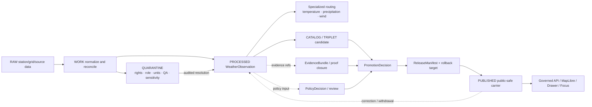

<!-- [KFM_META_BLOCK_V2]
doc_id: kfm://doc/data-processed-atmosphere-weather-observations-readme
title: data/processed/atmosphere/weather_observations/ — Atmosphere Weather Observations Processed Data
version: v0.2.0
type: directory-readme
subtype: processed-atmosphere-weather-observation-lane
status: repository-grounded draft; payload inventory, enforceable schema, validators, fixtures, receipts, proof, release, station/grid integration, and runtime behavior remain bounded
owners:
  - "NEEDS VERIFICATION — Atmosphere domain steward"
  - "NEEDS VERIFICATION — weather, mesonet, and general observation steward"
  - "NEEDS VERIFICATION — station, temperature, precipitation, wind, model, climate, advisory, and Hazards reviewers"
  - "NEEDS VERIFICATION — data, evidence, policy, release, correction, rollback, and docs stewards"
created: NEEDS VERIFICATION — one-character placeholder existed before v0.1 expansion
updated: 2026-07-25
policy_label: public-doc; processed-stage; atmosphere; weather-observations; source-role-aware; context-role-aware; variable-routing-aware; release-gated; no-direct-public-path
path: data/processed/atmosphere/weather_observations/README.md
truth_posture: >
  CONFIRMED exact target path, prior blob, Directory Rules placement, Atmosphere parent lane,
  WeatherObservation semantic contract, paired scaffold schema posture, role-dependent OBSERVED_SENSOR
  and METEOROLOGICAL_CONTEXT semantics, variable-specific routing, model/climate/advisory/Hazards
  boundaries, and PROCESSED lifecycle boundary / PROPOSED lane-local admission profile, normalized
  weather packet, station-grid linkage, context-versus-primary-claim rules, and downstream promotion
  expectations / UNKNOWN recursive payload inventory, live source activation, production validators,
  fixtures, receipts, proof closure, release instances, hosting, public routes, and runtime behavior /
  NEEDS VERIFICATION accountable owners, accepted source-role vocabulary, variable vocabulary,
  measurement-height/exposure rules, station-grid identity, QA conventions, correction propagation,
  cache invalidation, withdrawal behavior, and rollback drills
evidence_snapshot:
  repository: bartytime4life/Kansas-Frontier-Matrix
  base_ref: main
  base_commit: 1ebf46b01508345280819b944d41eb3ebc39b295
  prior_blob: 89a5f69348ae2a013ba8573b15139fc7690f9dc4
  directory_rules_blob: 2affb080e6f0043867c64c7f06c1ca52030fbd55
  weather_observation_contract_blob: d916d2527a8951bf3bebf21e8d245f0339639c71
related:
  - ../README.md
  - ../observed/README.md
  - ../temperature/README.md
  - ../precipitation/README.md
  - ../modeled/README.md
  - ../forecast_context/README.md
  - ../climate_normals/README.md
  - ../climate_anomaly/README.md
  - ../aggregate/climate/README.md
  - ../advisory_context/README.md
  - ../derived/README.md
  - ../../README.md
  - ../../../README.md
  - ../../../../docs/domains/atmosphere/README.md
  - ../../../../docs/domains/atmosphere/SOURCES.md
  - ../../../../docs/domains/atmosphere/POLICY.md
  - ../../../../docs/domains/atmosphere/PUBLICATION_POSTURE.md
  - ../../../../docs/domains/atmosphere/SENSITIVITY.md
  - ../../../../docs/doctrine/directory-rules.md
  - ../../../../contracts/domains/atmosphere/WeatherObservation.md
  - ../../../../contracts/domains/atmosphere/WeatherStation.md
  - ../../../../contracts/domains/atmosphere/TemperatureObservation.md
  - ../../../../contracts/domains/atmosphere/PrecipitationObservation.md
  - ../../../../contracts/domains/atmosphere/WindField.md
  - ../../../../contracts/domains/atmosphere/ForecastContext.md
  - ../../../../contracts/domains/atmosphere/ClimateNormal.md
  - ../../../../contracts/domains/atmosphere/ClimateAnomaly.md
  - ../../../../contracts/domains/atmosphere/AdvisoryContext.md
  - ../../../../schemas/contracts/v1/domains/atmosphere/WeatherObservation.schema.json
  - ../../../../policy/domains/atmosphere/README.md
  - ../../../raw/atmosphere/README.md
  - ../../../work/atmosphere/README.md
  - ../../../quarantine/atmosphere/README.md
  - ../../../catalog/domain/atmosphere/README.md
  - ../../../triplets/README.md
  - ../../../proofs/README.md
  - ../../../receipts/README.md
  - ../../../registry/sources/atmosphere/README.md
  - ../../../../release/candidates/atmosphere/README.md
  - ../../../../release/README.md
notes:
  - "Same-path Markdown modernization only; no weather bytes, source activation, contract, schema, policy, validator, workflow, proof, release, route, hosting, hazard event, or KFM publication state changed."
  - "WeatherObservation is a general meteorological observation/context family whose role must distinguish OBSERVED_SENSOR from METEOROLOGICAL_CONTEXT."
  - "Use TemperatureObservation, PrecipitationObservation, or WindField when variable-specific semantics, units, method, height/exposure, accumulation, trace state, vector, gust, or model role matter."
  - "Supporting weather context must not become primary proof of hazard, impact, exposure, crop loss, infrastructure effect, regulatory conclusion, or life-safety guidance."
  - "Rollback target for v0.2.0 is prior blob SHA `89a5f69348ae2a013ba8573b15139fc7690f9dc4`."
[/KFM_META_BLOCK_V2] -->

<a id="top"></a>

# `data/processed/atmosphere/weather_observations/` — Atmosphere weather-observation processed data

> **One-line purpose.** Hold normalized general meteorological observation and weather-context candidates while preserving source role, primary-versus-context role, variable, station or grid support, units, time, QA, evidence, correction, and downstream-use limits.

[](#status)
[](#authority-level)
[](#what-belongs-here)
[](#outputs)
[](#source-role-and-weather-boundaries)
[](#validation)

> [!IMPORTANT]
> **A weather value is not self-explanatory.** Variable, source role, station or grid support, measurement method, units, height or exposure where material, observed time, QA, freshness, and context-versus-primary-claim role determine what the value can support.

**Path:** `data/processed/atmosphere/weather_observations/README.md`  
**Owning root:** `data/`  
**Lifecycle phase:** `processed/`  
**Domain segment:** `atmosphere/`  
**Parent lane:** `data/processed/atmosphere/`  
**Lane role:** general `WeatherObservation` values and context  
**Direct public access:** denied  
**Last reviewed:** 2026-07-25

**Quick navigation:** [Purpose](#purpose) · [Authority level](#authority-level) · [Status](#status) · [What belongs here](#what-belongs-here) · [What does NOT belong here](#what-does-not-belong-here) · [Inputs](#inputs) · [Outputs](#outputs) · [Validation](#validation) · [Review burden](#review-burden) · [Related folders](#related-folders) · [ADRs](#adrs) · [Last reviewed](#last-reviewed) · [Admission profile](#weatherobservation-admission-profile) · [Role boundaries](#source-role-and-weather-boundaries) · [Variable and support semantics](#variable-station-grid-units-and-time) · [Cross-lane routing](#cross-lane-routing) · [Lifecycle and promotion](#lifecycle-and-promotion) · [Correction and rollback](#correction-withdrawal-and-rollback) · [Verification register](#open-verification-register) · [No-loss ledger](#no-loss-ledger)

---

## Purpose

This directory is the Atmosphere domain's **PROCESSED-stage lane for general `WeatherObservation` candidates**. It may hold normalized meteorological observations, mesonet or station-linked values, grid-linked weather context, archive-derived observations, and object-ready derivatives that have moved beyond RAW capture, WORK transformation, and QUARANTINE holds.

The lane exists to preserve the answer to eight questions before downstream use:

1. Which variable, source family, source role, and knowledge character apply?
2. Is the record an `OBSERVED_SENSOR` claim, `METEOROLOGICAL_CONTEXT`, archive/context record, or another reviewed role?
3. Is the weather value the primary claim being inspected or only supporting context for another claim?
4. Which station, network, grid cell, product, method, height, exposure, or spatial support applies?
5. Which units, scale, precision, reporting or averaging window, observed time, source time, retrieval time, and freshness state apply?
6. Which QA flags, calibration or correction state, missingness, uncertainty, confidence, caveats, and limitations qualify the value?
7. Which specialized object owns the value when temperature, precipitation, or wind semantics are material?
8. Which evidence, rights, sensitivity, policy, review, release, correction, and rollback states govern downstream use?

It is not a WeatherStation authority, variable-specific substitute, forecast/model lane, climate normal or anomaly authority, advisory issuer, Hazards event or impact store, proof store, receipt authority, catalog authority, release authority, health service, emergency-alert system, or public map/API/UI source.

## Authority level

**Implementation-bearing lifecycle lane with narrow general-observation authority.** The target path is CONFIRMED in the repository and remains under `data/processed/atmosphere/`, consistent with Directory Rules' lifecycle and domain-placement rules.

Its authority is deliberately limited:

- it may carry processed general weather observations and lane-local explanatory metadata;
- it does not define `WeatherObservation` meaning—that remains in the semantic contract;
- it does not define machine shape—the paired schema remains under `schemas/contracts/v1/domains/atmosphere/`;
- it does not define source identity, rights, source role, or activation—that remains in the source registry and `SourceDescriptor`;
- it does not replace WeatherStation, TemperatureObservation, PrecipitationObservation, WindField, ForecastContext, ClimateNormal, ClimateAnomaly, AdvisoryContext, or Hazards objects;
- it does not decide whether context is sufficient proof of an event, impact, exposure, loss, threshold, or health claim;
- it does not create emergency, medical, regulatory, occupational, infrastructure-impact, crop-loss, or life-safety authority.

## Status

| Surface | Status | Evidence-bounded interpretation |
|---|---|---|
| This README and path | **CONFIRMED** | The file exists at the pinned base and is updated in place. |
| Parent Atmosphere processed lane | **CONFIRMED** | `data/processed/atmosphere/README.md` identifies `weather_observations/` as the general meteorological observation/context lane and denies direct public use. |
| `WeatherObservation` semantic contract | **CONFIRMED repository document / draft** | Defines role-dependent `OBSERVED_SENSOR` and `METEOROLOGICAL_CONTEXT` meaning, context-role tagging, variable routing, model/climate/advisory/Hazards boundaries, and non-release authority. |
| Paired `WeatherObservation` schema | **CONFIRMED scaffold / not enforceable as verified** | The contract reports empty properties, `additionalProperties: true`, and unresolved title casing. |
| Adjacent processed lanes | **CONFIRMED paths** | Observed, temperature, precipitation, modeled, forecast, climate, advisory, and aggregate-climate lanes remain separate responsibilities. |
| Real processed weather payload inventory | **UNKNOWN** | This documentation task did not inspect or expose station, mesonet, grid, archive, or weather payloads. |
| Validators, fixtures, policy enforcement, and CI | **NEEDS VERIFICATION** | No accepted production WeatherObservation enforcement suite was verified. |
| Receipts, proof, release instances, hosting, public routes, and runtime behavior | **UNKNOWN / held** | Presence in this directory creates none of these states. |

<a id="accepted-contents"></a>

## What belongs here

Good fits are processed weather-observation artifacts whose variable, role, spatial support, method, units, time, QA, and correction lineage remain inspectable, including:

- normalized general meteorological observation candidates tied to a WeatherStation, mesonet site, station/network reference, grid cell, source product, archive, or other reviewed support;
- `OBSERVED_SENSOR` weather records with explicit source, variable, units, method, observed time, QA, and evidence posture;
- `METEOROLOGICAL_CONTEXT` records explicitly labeled as supporting context rather than primary proof;
- station- or grid-linked weather values that reference site/grid identity without duplicating WeatherStation authority;
- variable, original and normalized units, conversion method, height or exposure where material, averaging/reporting window, scale, precision, and detection or reporting convention metadata;
- observed, source, retrieval, processing, valid, correction, stale, supersession, and release-time metadata;
- source QA, calibration, correction, invalidation, provisional/final status, missingness, confidence, uncertainty, caveat, and limitation sidecars that are not proofs, receipts, policy decisions, or releases;
- controlled references to TemperatureObservation, PrecipitationObservation, WindField, ForecastContext, ClimateNormal, ClimateAnomaly, AdvisoryContext, hydrology, agriculture, or Hazards records without duplicating their canonical truth;
- public-candidate weather derivatives that remain upstream of catalog, evidence closure, policy review, release, and public serving;
- object-ready candidates prepared for future contract/schema validation, EvidenceBundle closure, catalog review, or release review;
- lane-local README, inventory, migration, or non-release manifest notes that explain artifact identity without becoming authority records.

<a id="exclusions"></a>

## What does NOT belong here

Do not place these in `data/processed/atmosphere/weather_observations/`:

- RAW station feeds, mesonet feeds, gridded products, source downloads, QA payloads, logs, screenshots, or source-native records;
- WORK parsing, station/grid reconciliation, unit conversion, interpolation, notebooks, temporary joins, experiments, or scratch outputs;
- QUARANTINE material with unresolved rights, source role, variable, units, method, height/exposure, time, QA, freshness, sensitivity, dispute, or safety state;
- WeatherStation identity, station ownership, access details, exact siting, network authority, or station-policy records;
- temperature, precipitation, or wind records when specialized semantics, units, accumulation, trace state, precipitation type, measurement height/exposure, vector direction, gust, or model role matter;
- forecast/model fields, climate normals, climate anomalies, advisory/referral records, hydrology records, Hazards records, agriculture records, infrastructure records, or health/exposure records except as controlled references;
- model output silently relabeled as observed weather;
- supporting meteorological context silently relabeled as primary proof of a hazard, impact, health effect, crop loss, infrastructure effect, hydrologic condition, or regulatory conclusion;
- hazard/event/impact claims, damages, infrastructure impacts, crop-loss conclusions, exposure claims, health guidance, public alerts, regulatory determinations, emergency instructions, or life-safety guidance;
- contracts, schemas, source descriptors, policy rules, validators, fixtures, tests, executable pipelines, catalogs, STAC/DCAT/PROV records, triplets, proofs, receipts, releases, rollback cards, published artifacts, public tiles, API/UI payloads, or AI-answer stores.

## Inputs

Inputs are governed WORK products or resolved QUARANTINE exits with, as applicable:

- SourceDescriptor or equivalent source identity and admitted role;
- explicit variable identity and general-versus-specialized routing decision;
- station, network, grid, archive, or product support reference;
- original value, normalized value where used, units, conversion method, precision, and relevant measurement support;
- observed, source, retrieval, processing, valid, correction, and stale-state times kept distinct;
- source QA flags, method, calibration or correction context, missingness, uncertainty, caveats, and limitations;
- primary-claim versus supporting-context role;
- rights, sensitivity, evidence, policy, review, and lifecycle support.

Unresolved inputs remain in WORK or QUARANTINE. A parser result, normalized value, or successful structural check is not by itself a valid PROCESSED admission decision.

## Outputs

Outputs are non-public processed candidates for:

- general weather-observation catalog records;
- EvidenceRef and EvidenceBundle assembly;
- routing into TemperatureObservation, PrecipitationObservation, or WindField where specialized semantics matter;
- source-role-preserving comparison with models, forecasts, climate context, advisories, hydrology, agriculture, or Hazards;
- triplet projection that preserves role, variable, spatial support, and time;
- public-safe derived layers or summaries only after separate evidence, policy, release, correction, and rollback gates;
- release-candidate review.

PROCESSED placement proves only lifecycle disposition. It does not prove that a weather value is correct, comparable, current, representative, hazardous, impactful, regulatory, released, or publicly safe.

## Validation

Validation must be deterministic, role-aware, variable-aware, and fail closed. The following is **PROPOSED** until accepted schemas, validators, fixtures, tests, and CI prove it:

| Check | Required posture | Failure posture |
|---|---|---|
| Identity | Stable record identity plus source/product and content or method digest where practical. | `HOLD` / `ERROR` |
| Variable | Variable identity is explicit; general versus specialized object routing is justified. | `HOLD` |
| Source role | `OBSERVED_SENSOR`, `METEOROLOGICAL_CONTEXT`, archive/context, or other accepted role is explicit. | `DENY` / `HOLD` |
| Context role | Primary-claim versus supporting-context role is explicit. | `ABSTAIN` / `HOLD` |
| Station/grid support | Station, network, grid cell, source product, or archive support resolves without duplicating station authority. | `HOLD` |
| Units and method | Units, conversion, precision, measurement height/exposure, averaging/reporting window, and method are explicit where material. | `HOLD` |
| Time | Observed, source, valid, retrieval, processing, correction, stale, supersession, and release times remain distinguishable. | `ABSTAIN` / stale hold |
| QA and uncertainty | Source flags, calibration/correction, missingness, provisional/final state, confidence, caveats, and limitations remain visible. | `RESTRICT` / `HOLD` |
| Rights and sensitivity | Rights, terms, attribution, exact station/grid sensitivity, private/infrastructure context, and public transforms are resolved. | `DENY` / `RESTRICT` |
| Evidence | Consequential claims resolve through EvidenceRef to admissible EvidenceBundle support. | `ABSTAIN` |
| Cross-lane boundary | Model, climate, advisory, Hazards, hydrology, agriculture, impact, and regulatory roles are not collapsed. | `DENY` |
| Correction | Predecessor/successor, correction, invalidation, supersession, withdrawal, and affected downstream artifacts are traceable. | `HOLD` |
| Release | Policy decision, review state, proof, release manifest, correction path, rollback target, and public-safe carrier are present. | `DENY` |

Passing structural checks does **not** prove measurement accuracy, representativeness, scientific fitness, hazard status, impact, exposure, evidence closure, public safety, release approval, or operational correctness.

## Review burden

Changes require review proportional to their meaning and exposure:

- Atmosphere and weather-observation stewardship for lane scope and role semantics;
- WeatherStation/network review for station, network, siting, height, exposure, or exact-location context;
- temperature, precipitation, and wind stewards where specialized routing is material;
- source, rights, and sensitivity review for source activation, attribution, exact siting, private/infrastructure context, or public transforms;
- data-quality and scientific-method review for units, methods, QA, calibration/correction, averaging, comparability, and uncertainty;
- policy review for role changes, restrictions, public transformations, or finite-outcome behavior;
- hydrology, agriculture, Hazards, infrastructure, health, or advisory liaison review before cross-domain claims;
- evidence, release, correction, rollback, and docs review before public use or authority-changing documentation.

**CODEOWNERS and accountable individuals are NEEDS VERIFICATION.** This README does not assign them.

<a id="directory-map"></a>

## Related folders

| Responsibility | Verified or bounded home | Relationship |
|---|---|---|
| Parent processed lane | [`../README.md`](../README.md) | Atmosphere lifecycle parent and lane index. |
| Observed parent | [`../observed/README.md`](../observed/README.md) | Observed-value parent; general weather records must retain variable and role semantics. |
| Temperature | [`../temperature/README.md`](../temperature/README.md) | Specialized temperature values and heat/cold context. |
| Precipitation | [`../precipitation/README.md`](../precipitation/README.md) | Specialized amount, accumulation, trace, type, gauge/radar, and unit semantics. |
| Wind | `../wind_field/README.md` **NEEDS VERIFICATION** | Specialized wind speed, direction, vector, gust, and observed/model roles. |
| Station context | `../weather_stations/README.md` **NEEDS VERIFICATION** | WeatherStation identity, network, siting, and sensitivity. |
| Modeled and forecast context | [`../modeled/README.md`](../modeled/README.md), [`../forecast_context/README.md`](../forecast_context/README.md) | Model fields remain distinct from observations. |
| Climate context | [`../climate_normals/README.md`](../climate_normals/README.md), [`../climate_anomaly/README.md`](../climate_anomaly/README.md), [`../aggregate/climate/README.md`](../aggregate/climate/README.md) | Baselines, anomalies, and aggregates remain separate from individual observations. |
| Advisory context | [`../advisory_context/README.md`](../advisory_context/README.md) | Official-source referral only; not KFM life-safety instruction. |
| Semantic contract | [`../../../../contracts/domains/atmosphere/WeatherObservation.md`](../../../../contracts/domains/atmosphere/WeatherObservation.md) | Object meaning and boundaries. |
| Machine schema | [`../../../../schemas/contracts/v1/domains/atmosphere/WeatherObservation.schema.json`](../../../../schemas/contracts/v1/domains/atmosphere/WeatherObservation.schema.json) | Current permissive scaffold; enforcement remains unverified. |
| Source registry | [`../../../registry/sources/atmosphere/README.md`](../../../registry/sources/atmosphere/README.md) | Source identity, role, rights, cadence, and activation. |
| Policy | [`../../../../policy/domains/atmosphere/README.md`](../../../../policy/domains/atmosphere/README.md) | Admissibility and release policy; enforcement remains bounded. |
| Catalog, proof, receipts, release | [`../../../catalog/domain/atmosphere/README.md`](../../../catalog/domain/atmosphere/README.md), [`../../../proofs/README.md`](../../../proofs/README.md), [`../../../receipts/README.md`](../../../receipts/README.md), [`../../../../release/candidates/atmosphere/README.md`](../../../../release/candidates/atmosphere/README.md) | Downstream authority families; none are replaced by this lane. |

## ADRs

- **ADR-0001 schema-home rule:** machine schemas belong under `schemas/contracts/v1/...`; semantic meaning belongs under `contracts/`.
- **Directory Rules §15:** folder READMEs expose purpose, authority, status, contents, inputs, outputs, validation, review burden, related folders, ADRs, and review date.
- **No WeatherObservation-lane-specific accepted ADR was verified.**
- **NEEDS VERIFICATION:** canonical homes for WeatherStation and WindField processed lanes, accepted variable-routing rules, and station/grid identity conventions.

## Last reviewed

**2026-07-25** — documentation modernization review against the pinned repository evidence recorded in the meta block.

This date records review of this README, not validation of source rights, payloads, schema enforcement, policy enforcement, release state, public behavior, or operational correctness.

---

<a id="weatherobservation-requirements"></a>

## WeatherObservation admission profile

The following profile is **PROPOSED** until accepted contracts, schemas, validators, fixtures, and CI prove it:

| Dimension | Required posture |
|---|---|
| Record identity | Deterministic or steward-assigned identity plus source/product and content or method digest where practical. |
| Variable | Explicit meteorological variable and general-versus-specialized object routing decision. |
| Source role | `OBSERVED_SENSOR`, `METEOROLOGICAL_CONTEXT`, archive/context, candidate, or another accepted vocabulary value. |
| Claim role | Primary claim or supporting context is explicit. |
| Station/grid support | Stable WeatherStation/network/grid/product/archive reference without duplicating site authority. |
| Value semantics | Original and normalized values, units, scale, precision, conversion method, and reporting/averaging window. |
| Measurement support | Method, instrument/product, height or exposure where material, processing level, and source caveats. |
| Time | Observed, source, valid, retrieval, processing, correction, stale, supersession, and release times remain distinct where material. |
| QA and uncertainty | Source flags, calibration/correction, missingness, provisional/final state, uncertainty, confidence, caveats, and limitations. |
| Rights and sensitivity | Rights, terms, attribution, station/grid siting exposure, private/infrastructure context, and public-transform obligations. |
| Evidence and review | EvidenceRefs, supporting EvidenceBundle, policy decision, review state, disagreements, limitations, and withheld details. |
| Correction and release | Predecessor/successor, correction/withdrawal lineage, affected carriers, release state, correction path, and rollback target. |

<a id="weather-guardrails"></a>

## Source role and weather boundaries

- **Role tagging is mandatory.** An observation and supporting meteorological context are not interchangeable.
- **Context is not primary proof.** Supporting weather context cannot independently prove hazard occurrence, damage, exposure, health effect, crop loss, infrastructure impact, hydrologic state, or regulatory status.
- **Model is not observation.** Forecasts and modeled fields remain model context even when compared with observations.
- **Station context is not the value.** WeatherStation owns site/network identity and siting sensitivity; WeatherObservation owns the value/context record.
- **General does not replace specialized.** Use TemperatureObservation, PrecipitationObservation, or WindField when variable-specific semantics materially affect interpretation.
- **A weather observation is not climate context.** ClimateNormal and ClimateAnomaly require explicit baselines, periods, aggregation, and separate object semantics.
- **Advisory context is referral-only.** Weather values do not create KFM-issued emergency, medical, or life-safety instructions.
- **Directory placement is not proof.** A file under this lane does not by itself establish correctness, freshness, evidence closure, hazard status, impact, release, or public safety.

## Variable, station/grid, units, and time

Weather candidates should preserve enough detail to prevent false comparability and false inference:

| Dimension | Required posture |
|---|---|
| Variable | Explicit variable name and controlled vocabulary where accepted. |
| Units | Original and normalized units, conversion method, scale, precision, and detection/reporting limits where material. |
| Measurement support | Station/network/grid/product reference, method, instrument/product, height or exposure, and processing level where material. |
| Averaging/reporting window | Instantaneous, minute, hourly, daily, accumulation, or other source-defined support remains explicit. |
| Time | Observation, source publication, valid, retrieval, processing, correction, supersession, and release times remain distinct. |
| QA | Source flags, invalidation, calibration/correction, provisional/final state, missingness, uncertainty, and caveats. |
| Comparability | Comparisons require compatible variables, units, methods, support, roles, spatial context, and temporal windows. |
| Context role | Primary claim versus supporting context remains explicit through downstream use. |

Unit normalization can improve interoperability; it cannot change source role, measurement support, or claim authority.

## Cross-lane routing

| Record or context | Primary owning lane | Weather-observation relationship |
|---|---|---|
| General meteorological observation/context | This lane | Own the general role-bearing value/context record. |
| Temperature, apparent temperature, dew point, wet bulb, heat index, wind chill | `../temperature/` | Route when specialized temperature semantics matter. |
| Precipitation amount, rate, accumulation, trace, type, gauge/radar method | `../precipitation/` | Route when specialized precipitation semantics matter. |
| Wind speed, direction, vector, gust, observed/model role | WindField lane **NEEDS VERIFICATION** | Route when wind-specific semantics matter. |
| Station/network identity, siting, ownership, access | WeatherStation lane **NEEDS VERIFICATION** | Reference only; do not re-own station authority. |
| Forecast/model field | `../forecast_context/` or `../modeled/` | Preserve model role; comparison does not convert it to observation. |
| Climate baseline/anomaly/aggregate | Climate lanes | Aggregate or compare without replacing climate-object semantics. |
| Advisory/referral context | `../advisory_context/` | Preserve official-source referral; do not create KFM instruction. |
| Hazard, impact, crop-loss, infrastructure, hydrology, health, or regulatory claim | Owning domain and governed evidence/release surface | Weather may contextualize; it does not become the claim authority. |

## Lifecycle and promotion

```text
RAW -> WORK / QUARANTINE -> PROCESSED -> CATALOG / TRIPLET -> PUBLISHED
```


```mermaid
flowchart LR
  RAW["RAW station/grid/source data"] --> WORK["WORK normalize and reconcile"]
  WORK --> QUAR["QUARANTINE<br/>rights · role · units · QA · sensitivity"]
  WORK --> WOBS["PROCESSED WeatherObservation"]
  QUAR -->|audited resolution| WOBS
  WOBS --> SPECIAL["Specialized routing<br/>temperature · precipitation · wind"]
  WOBS --> CAT["CATALOG / TRIPLET candidate"]
  WOBS -. evidence refs .-> EVID["EvidenceBundle / proof closure"]
  WOBS -. policy input .-> POL["PolicyDecision / review"]
  CAT --> PROMO["PromotionDecision"]
  EVID --> PROMO
  POL --> PROMO
  PROMO --> RELEASE["ReleaseManifest + rollback target"]
  RELEASE --> PUB["PUBLISHED public-safe carrier"]
  PUB --> API["Governed API / MapLibre / Drawer / Focus"]
  PUB -. correction / withdrawal .-> WOBS
```

The arrows express governed dependencies, not automatic file copies. Promotion requires source identity, rights, role, variable, station/grid support, units, method, QA, evidence closure, policy, review, release metadata, correction path, and rollback support appropriate to the claim.

A commit, pull request, merge, catalog record, badge, normalized value, rendered chart, or map layer does not create KFM publication or hazard/impact authority.

<a id="rollback"></a>

## Correction, withdrawal, and rollback

A weather-observation correction may arise from source revision, station or grid remapping, role misclassification, variable misrouting, unit conversion error, method or height/exposure error, QA invalidation, timing error, stale-state error, rights change, or downstream publication defect.

Correction handling should:

1. preserve the original source and prior normalized record by immutable reference;
2. create a new version or correction record rather than silently overwrite history;
3. record the source reason, corrected fields, effective time, correction time, reviewer, and evidence;
4. identify affected specialized observations, climate aggregates, catalogs, triplets, proofs, releases, API responses, maps, exports, dashboards, Focus Mode answers, and AI carriers;
5. invalidate, withdraw, or supersede affected public artifacts when required;
6. purge or re-key caches and search indexes where stale claims could persist;
7. retain a correction notice, withdrawal state, and rollback target appropriate to the released artifact.

**Documentation rollback:** before merge, close the draft PR and abandon the branch. After merge, revert the implementation commit. The prior README blob is `89a5f69348ae2a013ba8573b15139fc7690f9dc4`.

**Operational rollback:** restoring prior released data requires the actual prior release ID, manifest, proof, policy state, correction lineage, and cache-invalidation plan. Reverting this README is not an operational data rollback.

## Open verification register

| Item | Status | Required evidence |
|---|---|---|
| Payload inventory and writers | **UNKNOWN** | Recursive tree, hashes, producers, consumers, and lifecycle state. |
| Source-role vocabulary | **NEEDS VERIFICATION** | Actual SourceDescriptor schema and policy enum. |
| Variable vocabulary and routing | **NEEDS VERIFICATION** | Accepted variable registry and routing tests for general versus specialized objects. |
| WeatherStation and WindField processed homes | **NEEDS VERIFICATION** | Current paths, READMEs, contracts, payloads, writers, and ADRs. |
| Station/grid identity | **NEEDS VERIFICATION** | Stable station/network/grid/product identifiers and crosswalk rules. |
| Measurement support | **NEEDS VERIFICATION** | Accepted method, height/exposure, averaging, support, and precision fields. |
| Source activation and rights | **UNKNOWN / held** | Concrete descriptors, terms review, attribution, cadence, sensitivity, and activation decisions. |
| Validators, fixtures, and CI | **NEEDS VERIFICATION** | Deterministic no-network positive/negative fixtures and observed trusted check results. |
| Evidence, receipts, proof, and release | **UNKNOWN** | EvidenceBundles, receipts, policy decisions, review records, release manifests, and rollback cards. |
| Correction propagation | **NEEDS VERIFICATION** | Tested correction, withdrawal, cache invalidation, reindexing, and rollback drill. |
| Public routes and clients | **UNKNOWN** | Governed API implementation, public-safe carrier, runtime tests, and access-control evidence. |

## No-loss ledger

| Baseline element | Disposition | Result |
|---|---|---|
| Stable `doc_id`, path, and one-character-placeholder lineage | **KEEP** | Preserved in the meta block and same-path update. |
| PROCESSED lifecycle and no-direct-public-path posture | **CLARIFY** | Preserved and aligned to the governed promotion flow. |
| `OBSERVED_SENSOR` / `METEOROLOGICAL_CONTEXT` role tagging | **ENRICH** | Preserved and expanded into claim-role and validation rules. |
| WeatherStation, temperature, precipitation, wind, model, climate, advisory, and Hazards boundaries | **ENRICH** | Preserved through routing tables and anti-collapse checks. |
| Source, units, time, QA, freshness, evidence, correction, and release requirements | **ENRICH** | Converted into an admission profile and validation matrix. |
| No hazard, impact, health, crop-loss, infrastructure, regulatory, emergency, or life-safety authority | **ENRICH** | Preserved and made explicit in validation and routing. |
| Speculative child-directory tree | **REMOVE WITH EVIDENCE** | Removed because recursive inventory and canonical child ownership are unverified. |
| Legacy headings and links | **REPAIR** | Prior anchors are retained with explicit HTML anchors where headings changed. |
| Rollback posture | **CLARIFY** | README rollback is separated from operational data/release rollback. |

<p align="right"><a href="#top">Back to top</a></p>
