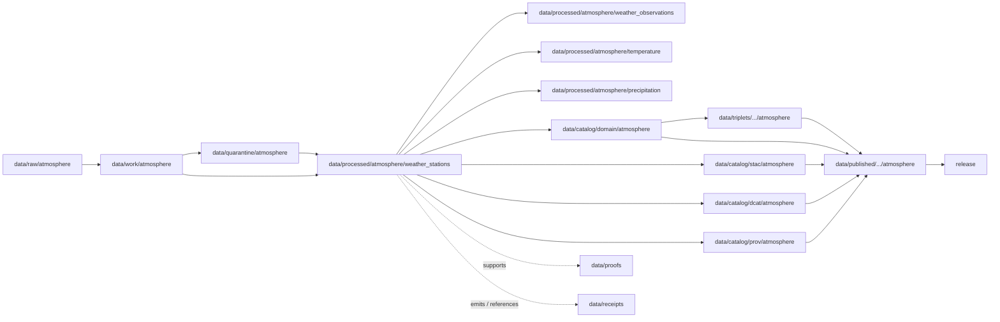

<!-- [KFM_META_BLOCK_V2]
doc_id: kfm://doc/data-processed-atmosphere-weather-stations-readme
title: data/processed/atmosphere/weather_stations/README.md — Atmosphere WeatherStation Processed Data README
version: v0.1
type: readme; data-lifecycle-sublane; processed-stage-guide; atmosphere-domain-lane; weather-station-lane
status: draft; PROPOSED; data-root; processed-stage; atmosphere; weather-stations; WeatherStation; network-and-site-context; release-gated; siting-generalization-aware
owners: OWNER_TBD — Atmosphere steward · Weather steward · Station/network steward · Data steward · Pipeline steward · Evidence steward · Policy steward · Release steward · Docs steward
created: NEEDS VERIFICATION — one-character placeholder existed before v0.1 expansion
updated: 2026-06-25
policy_label: public-doc; data; processed; atmosphere; weather-stations; lifecycle; governed; release-gated
tags: [kfm, data, processed, atmosphere, weather-stations, WeatherStation, WeatherObservation, TemperatureObservation, PrecipitationObservation, WindField, ForecastContext, ClimateNormal, ClimateAnomaly, AdvisoryContext, network-and-site-context, station-siting, generalization, lifecycle, RAW, WORK, QUARANTINE, CATALOG, TRIPLET, PUBLISHED, EvidenceBundle, SourceDescriptor, RunReceipt, ValidationReport, PolicyDecision, ReleaseManifest]
related:
  - ../README.md
  - ../observed/README.md
  - ../weather_observations/README.md
  - ../temperature/README.md
  - ../precipitation/README.md
  - ../modeled/README.md
  - ../forecast_context/README.md
  - ../climate_normals/README.md
  - ../climate_anomaly/README.md
  - ../aggregate/climate/README.md
  - ../advisory_context/README.md
  - ../derived/README.md
  - ../../README.md
  - ../../../README.md
  - ../../../../docs/domains/atmosphere/README.md
  - ../../../../contracts/domains/atmosphere/WeatherStation.md
  - ../../../../contracts/domains/atmosphere/WeatherObservation.md
  - ../../../../contracts/domains/atmosphere/TemperatureObservation.md
  - ../../../../contracts/domains/atmosphere/PrecipitationObservation.md
  - ../../../../contracts/domains/atmosphere/WindField.md
  - ../../../../contracts/domains/atmosphere/ForecastContext.md
  - ../../../../contracts/domains/atmosphere/ClimateNormal.md
  - ../../../../contracts/domains/atmosphere/ClimateAnomaly.md
  - ../../../../contracts/domains/atmosphere/AdvisoryContext.md
  - ../../../../schemas/contracts/v1/domains/atmosphere/WeatherStation.schema.json
  - ../../../../policy/domains/atmosphere/
  - ../../../../policy/sensitivity/
  - ../../../../docs/doctrine/directory-rules.md
  - ../../../../docs/doctrine/lifecycle-law.md
  - ../../../../docs/doctrine/trust-membrane.md
  - ../../../raw/atmosphere/
  - ../../../work/atmosphere/
  - ../../../quarantine/atmosphere/
  - ../../../catalog/domain/atmosphere/README.md
  - ../../../catalog/stac/atmosphere/
  - ../../../catalog/dcat/atmosphere/
  - ../../../catalog/prov/atmosphere/
  - ../../../triplets/
  - ../../../published/
  - ../../../proofs/
  - ../../../receipts/
  - ../../../registry/
  - ../../../../release/
  - ../../../../pipelines/
  - ../../../../tools/validators/
notes:
  - "This file replaces a one-character placeholder at `data/processed/atmosphere/weather_stations/README.md`."
  - "This is the PROCESSED-stage sublane for normalized WeatherStation artifacts under Atmosphere. It is not RAW station-feed storage, WeatherObservation value storage, temperature/precipitation/wind value storage, forecast/model authority, climate baseline/anomaly authority, proof storage, release authority, public API/UI output, or life-safety guidance."
  - "WeatherStation artifacts must preserve station/network/site identity, source role, siting class, station status, source vintage, relocation/decommissioning/correction lineage, exact-siting sensitivity, evidence linkage, policy posture, and release state before public use."
  - "Exact station coordinates, private-land context, infrastructure-sensitive context, station ownership, and access details require generalization/restriction before public release."
  - "The WeatherStation contract defines object meaning; this README does not create a second contract or schema authority."
  - "Rollback target for this expansion is previous placeholder blob SHA `e25f1814e51579d5f55c0f1fe0135ddb28a47f4a`."
[/KFM_META_BLOCK_V2] -->

<a id="top"></a>

# data/processed/atmosphere/weather_stations

> Atmosphere PROCESSED-stage sublane for normalized `WeatherStation` artifacts: governed meteorological station, weather network site, station-location context, and comparable weather-observation site records that remain distinct from observations, exact public coordinates, source registry records, proof, release, and public map/API/UI surfaces.

<p>
  
  
  
  
  
  
</p>

**Status:** draft / PROPOSED  
**Owners:** OWNER_TBD — Atmosphere steward · Weather steward · Station/network steward · Data steward · Pipeline steward · Evidence steward · Policy steward · Release steward · Docs steward  
**Path:** `data/processed/atmosphere/weather_stations/README.md`  
**Owning root:** `data/processed/`  
**Domain segment:** `atmosphere`  
**Object-family segment:** `weather_stations` / `WeatherStation`  
**Lifecycle stage:** `PROCESSED`  
**Exposure posture:** not public by default; public use requires governed catalog, evidence, siting sensitivity review, source-role/freshness/caveat posture, policy, release, correction, and rollback linkage  
**Truth posture:** CONFIRMED target was a one-character placeholder · CONFIRMED `WeatherStation` contract and schema paths exist · CONFIRMED weather stations have `NETWORK_AND_SITE_CONTEXT` character with siting generalization requirements · PROPOSED weather-station processed-sublane details · NEEDS VERIFICATION for actual child inventory, validators, receipts, sensitivity policy, CI enforcement, release linkage, and governed route behavior.

**Quick jumps:** [Purpose](#purpose) · [Lifecycle boundary](#lifecycle-boundary) · [Repo fit](#repo-fit) · [Accepted contents](#accepted-contents) · [Exclusions](#exclusions) · [WeatherStation requirements](#weatherstation-requirements) · [Station guardrails](#station-guardrails) · [Directory map](#directory-map) · [Evidence ledger](#evidence-ledger) · [Validation checklist](#validation-checklist) · [Rollback](#rollback)

---

## Purpose

`data/processed/atmosphere/weather_stations/` holds normalized weather station and weather network site artifacts that have moved beyond RAW capture, WORK transforms, and QUARANTINE holds.

This lane is for processed `WeatherStation` records or derivatives that preserve station/network identity, station-location context, source identity, source role, network membership, site status, station class, siting class, coordinate precision, exact-siting sensitivity, relocation/decommissioning/correction lineage, source vintage, evidence references, and downstream catalog readiness.

It is not a weather-observation value lane. It is not a temperature, precipitation, or wind value lane. It is not a forecast/model lane. It is not climate baseline/anomaly authority. It is not a proof store, receipt store, source registry, catalog, release, semantic contract, schema, policy, public layer, public API/UI surface, or life-safety guidance source. It may support downstream catalog records, EvidenceBundle-backed UI payloads, public-safe generalized station summaries, Focus Mode summaries, observation joins, or release packages only after gates pass.

## Lifecycle boundary

```text
RAW -> WORK / QUARANTINE -> PROCESSED -> CATALOG / TRIPLET -> PUBLISHED
```



`data/processed/atmosphere/weather_stations/` is upstream of catalog, triplet, publication, and release. It must not be used as a normal public map/API/UI/AI source.

## Repo fit

| Responsibility | Correct home | Rule |
|---|---|---|
| Raw station metadata exports, mesonet feeds, network payloads, source downloads, QA payloads, or logs | `data/raw/atmosphere/` | Not this lane. |
| In-process station parsing, geocoding, location reconciliation, deduplication, relocation matching, sensitivity review, joins, scratch outputs, or method experiments | `data/work/atmosphere/` | Not this lane. |
| Rights-unclear, source-role-unclear, stale, malformed, exact-siting-sensitive, ownership/access-sensitive, disputed, unsupported, or unsafe station material | `data/quarantine/atmosphere/` | Not this lane until resolved. |
| Normalized WeatherStation processed artifacts | `data/processed/atmosphere/weather_stations/` | This lane. |
| Weather observation values | `data/processed/atmosphere/weather_observations/` | Station metadata is context, not a weather value. |
| Temperature-specific values | `data/processed/atmosphere/temperature/` | Temperature values remain separate. |
| Precipitation-specific values | `data/processed/atmosphere/precipitation/` | Precipitation values remain separate. |
| Wind-specific values | WindField processed lane if accepted | Station wind observations may attach to WeatherStation; modeled wind remains model context. |
| Forecast/model context | `data/processed/atmosphere/forecast_context/` or `data/processed/atmosphere/modeled/` | Model grid/run context is not station metadata. |
| Climate normals/anomalies | `data/processed/atmosphere/climate_normals/`, `climate_anomaly/`, or `aggregate/climate/` | Climate products may reference station-derived values but remain separate objects. |
| Advisory/referral context | `data/processed/atmosphere/advisory_context/` | Station metadata does not create advisory/life-safety instructions. |
| Atmosphere domain catalog records | `data/catalog/domain/atmosphere/` | Downstream catalog stage. |
| Atmosphere STAC/DCAT/PROV records | `data/catalog/{stac,dcat,prov}/atmosphere/` | Downstream catalog projections, if accepted. |
| Atmosphere triplet/graph projections | `data/triplets/.../atmosphere/` | Downstream graph stage. |
| Atmosphere public-safe products | `data/published/.../atmosphere/` | Downstream after release. |
| EvidenceBundle/proof records | `data/proofs/` | Separate proof family. |
| Source, run, transform, validation, policy, correction, and release receipts | `data/receipts/` | Separate receipt family. |
| SourceDescriptor/source registry records | `data/registry/` | Separate registry family. |
| Release decisions, manifests, rollback cards, corrections, withdrawals | `release/` | Separate publication authority. |
| WeatherStation semantic contract | `contracts/domains/atmosphere/WeatherStation.md` | Object meaning; not data. |
| WeatherStation schema | `schemas/contracts/v1/domains/atmosphere/WeatherStation.schema.json` | Machine shape; not data. |
| Policy, validators, tests, pipelines, apps, packages | `policy/`, `tools/validators/`, `tests/`, `pipelines/`, `apps/`, `packages/` | Separate roots. |

## Accepted contents

Processed `WeatherStation` data may include:

- normalized meteorological station, weather network site, station-location context, or comparable weather-observation site records;
- station/network identity, source identifier, network membership, source role, station class, site status, siting class, coordinate precision, generalized public geometry, source vintage, and evidence references;
- relocation, decommissioning, merge/split, correction, supersession, station-name changes, network changes, and time-span lineage records;
- public-safe generalized station summaries when exact siting, ownership, private-land context, access details, infrastructure-sensitive context, rights, sensitivity, validation, policy, review, and release gates allow;
- processed joins to `WeatherObservation`, `TemperatureObservation`, `PrecipitationObservation`, `WindField`, `ClimateNormal`, or `ClimateAnomaly` when station metadata remains context and does not become observation truth;
- quality, caveat, missingness, correction, sensitivity, siting, lineage, and generalization sidecars when those sidecars are not proofs, receipts, source registry records, catalog records, schemas, or policy rules;
- processed artifacts prepared for downstream domain catalog, STAC/DCAT/PROV packaging, EvidenceBundle support, triplet generation, or release review.

## Exclusions

Do not store these under `data/processed/atmosphere/weather_stations/`:

- RAW station feeds, station metadata exports, network payloads, source downloads, QA payloads, logs, screenshots, or source-native records.
- WORK/scratch outputs that have not passed processing gates.
- Quarantined, malformed, source-role-unclear, rights-unclear, stale, exact-siting-sensitive, ownership/access-sensitive, unsupported, disputed, or unsafe station material.
- Weather observation values, temperature readings, precipitation readings, wind observations/model fields, forecast/model fields, climate normal records, climate anomaly records, advisory/referral records, hazards records, agriculture records, infrastructure records, or health/exposure records unless only referenced as context and stored in their correct lanes.
- Exact public coordinates, private-land context, infrastructure-sensitive context, station ownership, station access details, or site-security context unless policy/review/release supports exposure.
- Observation truth claims, sensor quality proof, hazard/event/impact claims, damages, infrastructure impacts, crop-loss claims, health/safety guidance, exposure claims, emergency instructions, regulatory conclusions, or life-safety instructions.
- Domain catalog records, STAC records, DCAT records, PROV records, triplet/graph records, published outputs, proofs, receipts, source registry records, release records, schemas, policy rules, validators, tests, pipelines, app/UI/API code.

## WeatherStation requirements

PROPOSED until concrete validators and CI enforcement are verified:

| Requirement | Meaning |
|---|---|
| Source trace | Every processed WeatherStation artifact should trace to SourceDescriptor or source registry context when source authority matters. |
| Site identity | Station/network/site identity must remain explicit and must not collapse into observation value, forecast/model, climate, hazard, advisory, or public safety semantics. |
| Network and site role | `NETWORK_AND_SITE_CONTEXT`, network membership, station class, site status, and source role should remain explicit and non-collapsing. |
| Siting sensitivity | Exact station coordinates, private-land context, infrastructure-sensitive context, ownership, and access details require generalization/restriction before public use. |
| Time semantics | Install date, active time span, observed-data time spans where referenced, relocation time, decommissioning time, correction time, source vintage, and release time should remain distinguishable where material. |
| Lineage and corrections | Relocation, decommissioning, merge/split, supersession, station-name change, network change, and correction lineage should remain traceable. |
| Evidence linkage | Claims about station identity, network membership, siting class, status, time span, relocation, correction, or release should resolve downstream to EvidenceBundle/proof context. |
| Policy posture | Public display requires rights, source-role, siting sensitivity, generalization, caveat, policy/admissibility posture, and release state. |
| Catalog readiness | Processed WeatherStation artifacts intended for discovery should promote through Atmosphere catalog lanes, not directly to public use. |
| Release readiness | Public use requires release state, published output path, correction path, and rollback target. |
| No observation truth by default | WeatherStation records do not prove any attached observation, hazard, impact, crop, infrastructure, exposure, regulatory, or life-safety claim by themselves. |

## Station guardrails

- `WeatherStation` carries station/network/site context, not weather observation values.
- Weather observations, temperature values, precipitation values, and wind values belong to their object-family lanes.
- Exact station siting, private-land context, infrastructure-sensitive context, ownership, and access details require generalization/restriction before public release.
- Station metadata does not prove attached observation values are true.
- Station metadata does not prove climate normals/anomalies, hazards, impacts, damages, crop losses, infrastructure effects, health effects, exposure, or regulatory claims.
- Forecast/model grid or run context is not station metadata unless explicitly represented as source context and not as observed station data.
- Public display requires source rights, station-siting review, generalization, validation, policy, release record, correction path, and rollback target.
- Unreleased processed weather-station artifacts are not public merely because they exist under this directory.

> [!CAUTION]
> Do not use this lane as a shortcut from processed station metadata to exact public station coordinates, observation truth, station ownership/access exposure, hazard/impact claims, public alerts, regulatory conclusions, or life-safety instructions. WeatherStation products must pass catalog, evidence, policy, validation, release, correction, and rollback gates before public use.

## Directory map

Actual child inventory remains **NEEDS VERIFICATION**. Use this as a proposed local organization pattern only after confirming current repo convention and validators.

```text
data/processed/atmosphere/weather_stations/
├── README.md
├── normalized/              # PROPOSED — processed WeatherStation records
├── network_sites/           # PROPOSED — network/site identity records
├── generalized_locations/   # PROPOSED — public-safe generalized geometries, not exact siting authority
├── lineage/                 # PROPOSED — relocation, decommissioning, merge/split, supersession
├── sensitivity/             # PROPOSED — siting/access/ownership review sidecars, not policy authority
├── quality/                 # PROPOSED — QA, caveats, missingness, confidence, limitations
├── corrections/             # PROPOSED — correction lineage sidecars, not receipts
├── joins/                   # PROPOSED — links to WeatherObservation, temperature, precipitation, wind, climate context
├── _manifests/              # PROPOSED — lane-local non-release manifests only
└── _README_TODO.md          # PROPOSED — remove after actual child inventory is documented
```

## Evidence ledger

| Source | Status | Supports | Limits |
|---|---|---|
| Previous file | CONFIRMED | Target existed as a one-character placeholder. | Did not define WeatherStation PROCESSED-stage boundaries. |
| `data/processed/atmosphere/weather_observations/README.md` | CONFIRMED sibling README | Weather observations remain values/context, not station metadata. | Does not define station inventory or release behavior. |
| `data/processed/atmosphere/temperature/README.md` | CONFIRMED sibling README | Temperature values remain separate from station context. | Does not define station inventory. |
| `data/processed/atmosphere/precipitation/README.md` | CONFIRMED sibling README | Precipitation values remain separate from station context. | Does not define station inventory. |
| `data/processed/atmosphere/forecast_context/README.md` | CONFIRMED sibling README | Forecast/model context remains separate from station metadata. | Does not define station inventory. |
| `data/processed/atmosphere/climate_normals/README.md` | CONFIRMED sibling README | ClimateNormal baseline context remains separate from station metadata. | Does not define station inventory. |
| `data/processed/README.md` | CONFIRMED | Parent processed lane is upstream of catalog, triplets, and publication and is not public by default. | Does not prove child inventory under this lane. |
| `data/catalog/domain/atmosphere/README.md` | CONFIRMED | Atmosphere catalog lane includes weather station context downstream and preserves source-role/release guardrails. | Does not prove weather-station processed inventory or release behavior. |
| `docs/domains/atmosphere/README.md` | CONFIRMED doctrine / PROPOSED implementation | Atmosphere owns weather/mesonet observations, station/network context, model/advisory context, climate context, and source-role denials. | Implementation maturity and runtime behavior remain NEEDS VERIFICATION. |
| `contracts/domains/atmosphere/WeatherStation.md` | CONFIRMED contract file | Defines WeatherStation as governed network/site context with station-siting generalization and observation-truth boundaries. | Contract does not prove schema enforcement, validator behavior, or release approval. |
| `schemas/contracts/v1/domains/atmosphere/WeatherStation.schema.json` | CONFIRMED scaffold schema | Paired WeatherStation schema exists with PROPOSED status. | Properties are currently empty; validator enforcement remains NEEDS VERIFICATION. |
| `docs/doctrine/directory-rules.md` | CONFIRMED doctrine / PROPOSED path specifics | Data paths encode lifecycle phase and domain segment; promotion is governed. | Does not prove runtime enforcement. |

## Validation checklist

- [ ] Confirm actual child directories under `data/processed/atmosphere/weather_stations/`.
- [ ] Confirm accepted WeatherStation source/domain path convention.
- [ ] Confirm `WeatherStation` schema fields and title casing are updated beyond scaffold if needed.
- [ ] Confirm WeatherStation processed validators and CI checks.
- [ ] Confirm SourceDescriptor/source registry linkage for each source-derived station artifact.
- [ ] Confirm weather-station-vs-weather-observation, station-vs-temperature, station-vs-precipitation, station-vs-wind, station-vs-forecast/model, station-vs-climate, station-vs-hazards/impact, and station-vs-public-siting boundaries.
- [ ] Confirm station identity, network membership, source role, site status, siting class, coordinate precision, exact-siting sensitivity, ownership/access exposure, source vintage, relocation, decommissioning, merge/split, supersession, and correction lineage handling.
- [ ] Confirm RunReceipt, TransformReceipt, ValidationReport, PolicyDecision, correction path, and rollback target where applicable.
- [ ] Confirm no RAW, WORK, QUARANTINE, CATALOG, TRIPLET, PUBLISHED, proof, receipt, release, schema, policy, validator, package, pipeline, app, API, observation value, exact public coordinates, ownership/access details, station-security context, forecast/model, climate normal/anomaly, health claim, crop-loss claim, infrastructure claim, hazard-impact claim, advisory, official warning, exposure, or life-safety artifacts are misplaced here.
- [ ] Confirm promotion flow from processed WeatherStation data to catalog/triplet/published outputs is governed, source-role-safe, siting-aware, generalized where needed, evidence-backed, and reversible.
- [ ] Confirm public clients and Focus Mode cannot use this lane as a direct exact-location, station-access, observation-truth, hazard-impact, infrastructure, health, regulatory, emergency, or life-safety source.

## Rollback

Rollback is required if this lane becomes an Atmosphere source-data root, WeatherObservation replacement, TemperatureObservation replacement, PrecipitationObservation replacement, WindField replacement, exact public coordinate root, station ownership/access disclosure root, ForecastContext replacement, climate-normal/anomaly source, health/exposure claim root, agriculture/crop-loss claim root, infrastructure-impact root, hydrology/hazards/event/impact root, advisory authority root, official warning/public-alerting root, quarantine bypass, proof store, receipt store, catalog root, triplet root, source-registry root, release-decision root, published-output root, public layer root, public tile root, schema root, policy root, validator root, implementation root, public API shortcut, public exposure shortcut, regulatory-claim source, emergency instruction source, or life-safety guidance source.

Rollback target for this expansion: previous placeholder blob SHA `e25f1814e51579d5f55c0f1fe0135ddb28a47f4a`.

<p align="right"><a href="#top">Back to top</a></p>
