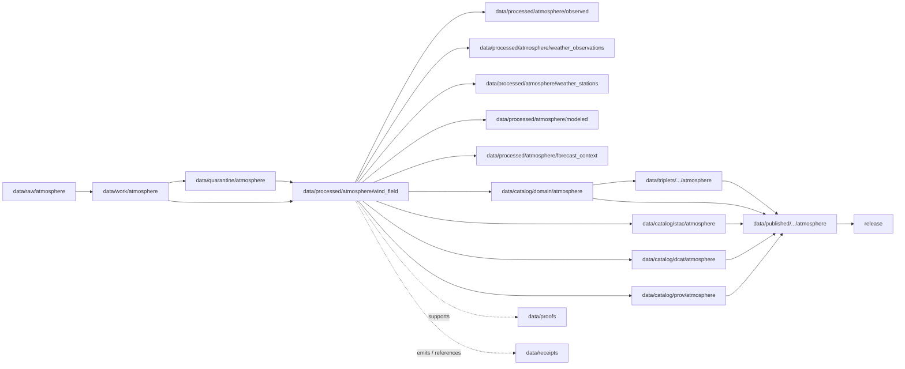

<!-- [KFM_META_BLOCK_V2]
doc_id: kfm://doc/data-processed-atmosphere-wind-field-readme
title: data/processed/atmosphere/wind_field/README.md — Atmosphere WindField Processed Data README
version: v0.1
type: readme; data-lifecycle-sublane; processed-stage-guide; atmosphere-domain-lane; wind-field-lane
status: draft; PROPOSED; data-root; processed-stage; atmosphere; wind-field; WindField; observed-sensor-aware; atmospheric-model-field-aware; release-gated; source-role-aware
owners: OWNER_TBD — Atmosphere steward · Weather steward · Wind steward · Forecast/model steward · Data steward · Pipeline steward · Evidence steward · Policy steward · Release steward · Docs steward
created: NEEDS VERIFICATION — one-character placeholder existed before v0.1 expansion
updated: 2026-06-25
policy_label: public-doc; data; processed; atmosphere; wind-field; lifecycle; governed; release-gated
tags: [kfm, data, processed, atmosphere, wind-field, WindField, WeatherStation, WeatherObservation, TemperatureObservation, PrecipitationObservation, ForecastContext, SmokeContext, ClimateNormal, ClimateAnomaly, AdvisoryContext, observed-sensor, atmospheric-model-field, model-is-not-observation, model-run, uncertainty, wind-speed, wind-direction, gust, vector, lifecycle, RAW, WORK, QUARANTINE, CATALOG, TRIPLET, PUBLISHED, EvidenceBundle, SourceDescriptor, ModelRunReceipt, RunReceipt, ValidationReport, PolicyDecision, ReleaseManifest]
related:
  - ../README.md
  - ../observed/README.md
  - ../weather_observations/README.md
  - ../weather_stations/README.md
  - ../temperature/README.md
  - ../precipitation/README.md
  - ../modeled/README.md
  - ../forecast_context/README.md
  - ../smoke_context/README.md
  - ../climate_normals/README.md
  - ../climate_anomaly/README.md
  - ../aggregate/climate/README.md
  - ../advisory_context/README.md
  - ../derived/README.md
  - ../../README.md
  - ../../../README.md
  - ../../../../docs/domains/atmosphere/README.md
  - ../../../../contracts/domains/atmosphere/WindField.md
  - ../../../../contracts/domains/atmosphere/WeatherStation.md
  - ../../../../contracts/domains/atmosphere/WeatherObservation.md
  - ../../../../contracts/domains/atmosphere/TemperatureObservation.md
  - ../../../../contracts/domains/atmosphere/PrecipitationObservation.md
  - ../../../../contracts/domains/atmosphere/ForecastContext.md
  - ../../../../contracts/domains/atmosphere/SmokeContext.md
  - ../../../../contracts/domains/atmosphere/ClimateNormal.md
  - ../../../../contracts/domains/atmosphere/ClimateAnomaly.md
  - ../../../../contracts/domains/atmosphere/AdvisoryContext.md
  - ../../../../schemas/contracts/v1/domains/atmosphere/WindField.schema.json
  - ../../../../policy/domains/atmosphere/
  - ../../../../policy/sensitivity/
  - ../../../../docs/doctrine/directory-rules.md
  - ../../../../docs/doctrine/lifecycle-law.md
  - ../../../../docs/doctrine/trust-membrane.md
  - ../../../raw/atmosphere/
  - ../../../work/atmosphere/
  - ../../../quarantine/atmosphere/
  - ../../../catalog/domain/atmosphere/README.md
  - ../../../catalog/stac/atmosphere/
  - ../../../catalog/dcat/atmosphere/
  - ../../../catalog/prov/atmosphere/
  - ../../../triplets/
  - ../../../published/
  - ../../../proofs/
  - ../../../receipts/
  - ../../../registry/
  - ../../../../release/
  - ../../../../pipelines/
  - ../../../../tools/validators/
notes:
  - "This file replaces a one-character placeholder at `data/processed/atmosphere/wind_field/README.md`."
  - "This is the PROCESSED-stage sublane for normalized WindField artifacts under Atmosphere. It is not RAW station/model storage, WeatherStation metadata authority, generic WeatherObservation authority, ForecastContext replacement, SmokeContext proof, hazards/impact truth, proof storage, release authority, public API/UI output, or life-safety guidance."
  - "WindField artifacts must preserve wind variable identity, source role, observed/model boundary, station/grid/source-product context, units, vector/gust semantics, observed/run/valid time, model-run lineage when modeled, uncertainty, QA/correction posture, evidence linkage, policy posture, and release state before public use."
  - "Modeled wind is an `ATMOSPHERIC_MODEL_FIELD`; it must not be presented as `OBSERVED_SENSOR` wind by promotion or display."
  - "The WindField contract defines object meaning; this README does not create a second contract or schema authority."
  - "Rollback target for this expansion is previous placeholder blob SHA `e25f1814e51579d5f55c0f1fe0135ddb28a47f4a`."
[/KFM_META_BLOCK_V2] -->

<a id="top"></a>

# data/processed/atmosphere/wind_field

> Atmosphere PROCESSED-stage sublane for normalized `WindField` artifacts: governed observed wind speed/direction records, gridded wind analyses, modeled wind fields, gust/vector components, and wind-related weather context that remain distinct from weather-station metadata, generic weather observations, forecast/model authority, smoke/hazard proof, release, and public map/API/UI surfaces.

<p>
  
  
  
  
  
  
</p>

**Status:** draft / PROPOSED  
**Owners:** OWNER_TBD — Atmosphere steward · Weather steward · Wind steward · Forecast/model steward · Data steward · Pipeline steward · Evidence steward · Policy steward · Release steward · Docs steward  
**Path:** `data/processed/atmosphere/wind_field/README.md`  
**Owning root:** `data/processed/`  
**Domain segment:** `atmosphere`  
**Object-family segment:** `wind_field` / `WindField`  
**Lifecycle stage:** `PROCESSED`  
**Exposure posture:** not public by default; public use requires governed catalog, evidence, source-role/unit/model-run/uncertainty/freshness/caveat posture, policy, release, correction, and rollback linkage  
**Truth posture:** CONFIRMED target was a one-character placeholder · CONFIRMED `WindField` contract and schema paths exist · CONFIRMED WindField has role-dependent `OBSERVED_SENSOR` / `ATMOSPHERIC_MODEL_FIELD` character · PROPOSED wind-field processed-sublane details · NEEDS VERIFICATION for actual child inventory, validators, receipts, model-run receipts, CI enforcement, release linkage, and governed route behavior.

**Quick jumps:** [Purpose](#purpose) · [Lifecycle boundary](#lifecycle-boundary) · [Repo fit](#repo-fit) · [Accepted contents](#accepted-contents) · [Exclusions](#exclusions) · [WindField requirements](#windfield-requirements) · [Wind guardrails](#wind-guardrails) · [Directory map](#directory-map) · [Evidence ledger](#evidence-ledger) · [Validation checklist](#validation-checklist) · [Rollback](#rollback)

---

## Purpose

`data/processed/atmosphere/wind_field/` holds normalized wind-field artifacts that have moved beyond RAW capture, WORK transforms, and QUARANTINE holds.

This lane is for processed `WindField` records or derivatives that preserve wind speed/direction identity, vector and gust semantics, source role, observed/model boundary, station/network/grid/source-product context, source identity, observed time, retrieval time, run time, valid time, units, model-run lineage where applicable, uncertainty, QA/correction posture, freshness, evidence references, and downstream catalog readiness.

It is not a raw station-feed lane. It is not weather-station metadata authority. It is not a generic weather-observation lane when wind-specific vector/model semantics matter. It is not a forecast/model authority lane. It is not a SmokeContext proof lane. It is not hazards event/impact truth. It is not advisory issuance, proof store, receipt store, source registry, catalog, release, semantic contract, schema, policy, public layer, public API/UI surface, or life-safety guidance source. It may support downstream catalog records, EvidenceBundle-backed UI payloads, public-safe wind layers, smoke-transport context, Focus Mode summaries, advisory referrals, or release packages only after gates pass.

## Lifecycle boundary

```text
RAW -> WORK / QUARANTINE -> PROCESSED -> CATALOG / TRIPLET -> PUBLISHED
```



`data/processed/atmosphere/wind_field/` is upstream of catalog, triplet, publication, and release. It must not be used as a normal public map/API/UI/AI source.

## Repo fit

| Responsibility | Correct home | Rule |
|---|---|---|
| Raw wind station feeds, model products, gridded products, source downloads, QA payloads, or logs | `data/raw/atmosphere/` | Not this lane. |
| In-process wind parsing, vector transforms, unit conversion, model/station comparison, QA, joins, scratch outputs, or method experiments | `data/work/atmosphere/` | Not this lane. |
| Rights-unclear, source-role-unclear, stale, malformed, unit-unclear, model-run-missing, uncertainty-missing, unsupported, disputed, sensitive, or unsafe wind material | `data/quarantine/atmosphere/` | Not this lane until resolved. |
| Normalized WindField processed artifacts | `data/processed/atmosphere/wind_field/` | This lane. |
| General weather observations | `data/processed/atmosphere/weather_observations/` | Use only when wind-specific vector/model semantics are not material. |
| Weather station/network context | `data/processed/atmosphere/weather_stations/` | Station metadata is context, not wind value. |
| Forecast/model context | `data/processed/atmosphere/forecast_context/` or `data/processed/atmosphere/modeled/` | Model role must remain explicit and must not impersonate observed wind. |
| Smoke context | `data/processed/atmosphere/smoke_context/` | Wind can contextualize smoke transport; it does not prove smoke exposure or PM2.5. |
| Temperature-specific values | `data/processed/atmosphere/temperature/` | Temperature values remain separate. |
| Precipitation-specific values | `data/processed/atmosphere/precipitation/` | Precipitation values remain separate. |
| Climate normals/anomalies | `data/processed/atmosphere/climate_normals/`, `climate_anomaly/`, or `aggregate/climate/` | Climate products may aggregate wind context but remain separate objects. |
| Advisory/referral context | `data/processed/atmosphere/advisory_context/` | Advisory context remains official-source referral, not wind-derived instruction. |
| Hazards/event/impact claims | Hazards responsibility roots | Wind can contextualize hazards; it does not prove impact. |
| Atmosphere domain catalog records | `data/catalog/domain/atmosphere/` | Downstream catalog stage. |
| Atmosphere STAC/DCAT/PROV records | `data/catalog/{stac,dcat,prov}/atmosphere/` | Downstream catalog projections, if accepted. |
| Atmosphere triplet/graph projections | `data/triplets/.../atmosphere/` | Downstream graph stage. |
| Atmosphere public-safe products | `data/published/.../atmosphere/` | Downstream after release. |
| EvidenceBundle/proof records | `data/proofs/` | Separate proof family. |
| Source, run, model-run, transform, validation, policy, correction, and release receipts | `data/receipts/` | Separate receipt family. |
| SourceDescriptor/source registry records | `data/registry/` | Separate registry family. |
| Release decisions, manifests, rollback cards, corrections, withdrawals | `release/` | Separate publication authority. |
| WindField semantic contract | `contracts/domains/atmosphere/WindField.md` | Object meaning; not data. |
| WindField schema | `schemas/contracts/v1/domains/atmosphere/WindField.schema.json` | Machine shape; not data. |
| Policy, validators, tests, pipelines, apps, packages | `policy/`, `tools/validators/`, `tests/`, `pipelines/`, `apps/`, `packages/` | Separate roots. |

## Accepted contents

Processed `WindField` data may include:

- normalized observed wind speed, wind direction, gust, vector component, or station wind records tied to a `WeatherStation` or comparable station/network context;
- normalized gridded/model wind fields when source role is explicitly `ATMOSPHERIC_MODEL_FIELD` and model-run lineage, valid time, uncertainty, and caveats travel with the record;
- source-role-preserving wind records where `OBSERVED_SENSOR`, `ATMOSPHERIC_MODEL_FIELD`, station, grid, forecast, reanalysis, archive, or other admitted role remains explicit;
- wind value, vector/gust semantics, canonical units, observed time, retrieval time, run time, valid time, source time, QA state, correction lineage, freshness, uncertainty, confidence, and limitation metadata;
- processed joins to `WeatherStation`, `WeatherObservation`, `TemperatureObservation`, `PrecipitationObservation`, `ForecastContext`, `SmokeContext`, `ClimateNormal`, `ClimateAnomaly`, or `AdvisoryContext` when object meanings remain visible;
- quality, caveat, missingness, correction, uncertainty, model-run, freshness, validation, unit-normalization, and vector-method sidecars when those sidecars are not proofs, receipts, source registry records, catalog records, schemas, or policy rules;
- processed artifacts prepared for downstream domain catalog, STAC/DCAT/PROV packaging, EvidenceBundle support, triplet generation, LayerManifest creation, or release review.

## Exclusions

Do not store these under `data/processed/atmosphere/wind_field/`:

- RAW station feeds, raw gridded/model wind products, source downloads, QA payloads, logs, screenshots, or source-native records.
- WORK/scratch outputs that have not passed processing gates.
- Quarantined, malformed, source-role-unclear, rights-unclear, stale, unit-unclear, model-run-missing, uncertainty-missing, unsupported, disputed, sensitive, or unsafe wind material.
- WeatherStation metadata, station ownership/access details, exact station-siting authority, generic WeatherObservation records, temperature records, precipitation records, smoke-context records, forecast-context records, climate records, advisory records, hydrology records, hazards records, agriculture records, infrastructure records, or health/exposure records unless only referenced as context and stored in their correct lanes.
- Model-as-observation substitution, wind-as-smoke-proof substitution, wind-as-hazard-impact-proof substitution, or context-as-primary-proof substitution.
- Smoke transport proof, PM2.5 proof, exposure claims, health-effect claims, damage claims, crop-loss claims, infrastructure impact claims, storm/flood/fire hazard truth, emergency instructions, public alerts, regulatory conclusions, or life-safety guidance.
- Domain catalog records, STAC records, DCAT records, PROV records, triplet/graph records, published outputs, proofs, receipts, source registry records, release records, schemas, policy rules, validators, tests, pipelines, app/UI/API code.

## WindField requirements

PROPOSED until concrete validators and CI enforcement are verified:

| Requirement | Meaning |
|---|---|
| Source trace | Every processed WindField artifact should trace to SourceDescriptor or source registry context when source authority matters. |
| Wind identity | Wind speed, direction, gust, vector component, grid/field, and variable semantics must remain explicit and must not collapse into generic WeatherObservation, station metadata, forecast, smoke, climate, hazard, or health/safety semantics. |
| Source role | `OBSERVED_SENSOR`, `ATMOSPHERIC_MODEL_FIELD`, station, grid, model/reanalysis, archive, or other admitted role must be explicit and non-collapsing. |
| Observed/model boundary | Modeled wind must remain model context and must not be promoted or displayed as observed wind. |
| Station/grid/source context | Wind fields should identify or reference weather station, grid cell, source product, or network context without turning station metadata into processed wind data. |
| Units and vector semantics | Units, direction convention, gust/window semantics, vector components, conversion method, and method posture should be explicit enough to avoid flattening. |
| Model-run lineage | Modeled wind requires model/product name, run time, initialization time, valid time, horizon, product version, uncertainty, and correction/supersession posture. |
| Time semantics | Observed time, retrieval time, run time, valid time, correction time, freshness, aggregation/window semantics, and release time should remain distinguishable where material. |
| QA/correction posture | Quality flags, correction state, calibration/correction lineage, caveats, limitations, missingness, confidence, and uncertainty should remain visible. |
| Evidence linkage | Claims about wind value, source, role, units, time, station/grid, QA, model lineage, correction, or release should resolve downstream to EvidenceBundle/proof context. |
| Policy posture | Public display requires rights, source-role, model-run/uncertainty where modeled, freshness, caveat, sensitivity, and policy/admissibility posture. |
| Catalog readiness | Processed WindField artifacts intended for discovery should promote through Atmosphere catalog lanes, not directly to public use. |
| Release readiness | Public use requires release state, published output path, correction path, and rollback target. |
| No impact guidance by default | Wind values do not create smoke exposure, hazard, crop-loss, infrastructure, health, emergency, exposure, regulatory, or life-safety claims without separate authority and review. |

## Wind guardrails

- `WindField` carries wind-specific speed/direction/gust/vector or model-field semantics, not generic weather context when those semantics matter.
- `WindField` may be `OBSERVED_SENSOR` or `ATMOSPHERIC_MODEL_FIELD`; role tagging is mandatory.
- Modeled wind is not observed wind and must carry model-run lineage and uncertainty before public display.
- WeatherStation carries station/network context; WindField carries wind value/vector context.
- Wind and temperature are separate weather variables with separate units, methods, QA, and derived-context rules.
- Wind and precipitation are separate weather variables with separate units, methods, QA, and aggregation rules.
- Wind may contextualize smoke transport, but it does not prove smoke, PM2.5, exposure, hazard, damage, crop loss, infrastructure impact, or health effect.
- Weather values may support advisory referral, but they do not create emergency, medical, or life-safety instructions by themselves.
- Public display requires source rights, source role, units, freshness, model-run receipt/uncertainty when modeled, validation, policy, release record, correction path, and rollback target.
- Unreleased processed wind-field artifacts are not public merely because they exist under this directory.

> [!CAUTION]
> Do not use this lane as a shortcut from processed wind fields to model-as-observation claims, smoke-transport proof, hazard/event truth, exposure claims, crop-loss claims, infrastructure impacts, public health guidance, public alerts, regulatory conclusions, or life-safety instructions. WindField products must pass catalog, evidence, policy, validation, release, correction, and rollback gates before public use.

## Directory map

Actual child inventory remains **NEEDS VERIFICATION**. Use this as a proposed local organization pattern only after confirming current repo convention and validators.

```text
data/processed/atmosphere/wind_field/
├── README.md
├── normalized/              # PROPOSED — processed WindField records
├── observed_sensor/         # PROPOSED — observed station/sensor wind with source role and units
├── model_fields/            # PROPOSED — modeled/reanalysis wind with model-run lineage and uncertainty
├── vector_components/       # PROPOSED — u/v/vector component products
├── gusts/                   # PROPOSED — gust and windowed maxima products
├── transport_context/       # PROPOSED — smoke/weather transport context, not hazard or exposure proof
├── uncertainty/             # PROPOSED — model uncertainty/caveat sidecars
├── quality/                 # PROPOSED — QA, caveats, missingness, confidence, limitations
├── corrections/             # PROPOSED — correction/calibration lineage sidecars, not receipts
├── joins/                   # PROPOSED — links to WeatherStation, WeatherObservation, ForecastContext, SmokeContext, climate/advisory context
├── _manifests/              # PROPOSED — lane-local non-release manifests only
└── _README_TODO.md          # PROPOSED — remove after actual child inventory is documented
```

## Evidence ledger

| Source | Status | Supports | Limits |
|---|---|---|
| Previous file | CONFIRMED | Target existed as a one-character placeholder. | Did not define WindField PROCESSED-stage boundaries. |
| `data/processed/atmosphere/weather_observations/README.md` | CONFIRMED sibling README | General weather observations remain separate from wind-specific vector/model semantics. | Does not define wind-field inventory or release behavior. |
| `data/processed/atmosphere/weather_stations/README.md` | CONFIRMED sibling README | WeatherStation is station/network context, not wind value. | Does not define wind-field inventory. |
| `data/processed/atmosphere/temperature/README.md` | CONFIRMED sibling README | Temperature values remain separate from wind. | Does not define wind-field inventory. |
| `data/processed/atmosphere/precipitation/README.md` | CONFIRMED sibling README | Precipitation values remain separate from wind. | Does not define wind-field inventory. |
| `data/processed/atmosphere/forecast_context/README.md` | CONFIRMED sibling README | Forecast/model context remains separate from observations. | Does not define wind-field inventory. |
| `data/processed/atmosphere/modeled/README.md` | CONFIRMED sibling README | Modeled products are not observations and require model-run/uncertainty posture. | Does not define wind-field inventory. |
| `data/processed/atmosphere/smoke_context/README.md` | CONFIRMED sibling README | SmokeContext may use wind as transport context but remains separate from wind data and hazards truth. | Does not define wind-field inventory. |
| `data/processed/README.md` | CONFIRMED | Parent processed lane is upstream of catalog, triplets, and publication and is not public by default. | Does not prove child inventory under this lane. |
| `data/catalog/domain/atmosphere/README.md` | CONFIRMED | Atmosphere catalog lane includes weather/wind/model context downstream and preserves source-role guardrails. | Does not prove wind-field processed inventory or release behavior. |
| `docs/domains/atmosphere/README.md` | CONFIRMED doctrine / PROPOSED implementation | Atmosphere owns weather/mesonet observations, model context, smoke/aerosol context, climate context, and source-role denials. | Implementation maturity and runtime behavior remain NEEDS VERIFICATION. |
| `contracts/domains/atmosphere/WindField.md` | CONFIRMED contract file | Defines WindField as governed observed-sensor or atmospheric-model-field wind context with model-is-not-observation controls. | Contract does not prove schema enforcement, validator behavior, or release approval. |
| `schemas/contracts/v1/domains/atmosphere/WindField.schema.json` | CONFIRMED scaffold schema | Paired WindField schema exists with PROPOSED status. | Properties are currently empty; validator enforcement remains NEEDS VERIFICATION. |
| `docs/doctrine/directory-rules.md` | CONFIRMED doctrine / PROPOSED path specifics | Data paths encode lifecycle phase and domain segment; promotion is governed. | Does not prove runtime enforcement. |

## Validation checklist

- [ ] Confirm actual child directories under `data/processed/atmosphere/wind_field/`.
- [ ] Confirm accepted WindField source/domain path convention.
- [ ] Confirm `WindField` schema fields and title casing are updated beyond scaffold if needed.
- [ ] Confirm WindField processed validators and CI checks.
- [ ] Confirm SourceDescriptor/source registry linkage for each source-derived wind artifact.
- [ ] Confirm wind-vs-weather-observation, wind-vs-weather-station, observed-vs-modeled wind, wind-vs-ForecastContext, wind-vs-SmokeContext, wind-vs-temperature, wind-vs-precipitation, wind-vs-climate normal/anomaly, and wind-vs-hazards/impact boundaries.
- [ ] Confirm station/grid/source context handling without duplicating station authority.
- [ ] Confirm RunReceipt, ModelRunReceipt, TransformReceipt, ValidationReport, PolicyDecision, correction path, and rollback target where applicable.
- [ ] Confirm observed time, retrieval time, run time, valid time, source role, units, direction convention, vector components, gust/window semantics, model/product name, model-run lineage, uncertainty, QA/correction posture, caveats, limitations, missingness, confidence, station-location sensitivity, freshness, and public display posture.
- [ ] Confirm no RAW, WORK, QUARANTINE, CATALOG, TRIPLET, PUBLISHED, proof, receipt, release, schema, policy, validator, package, pipeline, app, API, station-authority, generic-weather flattening, forecast/model-as-observation, climate normal/anomaly, smoke proof, exposure, health claim, crop-loss claim, infrastructure claim, hazard-impact claim, advisory, official warning, or life-safety artifacts are misplaced here.
- [ ] Confirm promotion flow from processed WindField data to catalog/triplet/published outputs is governed, source-role-safe, observed/model-aware, unit-aware, model-run-aware, evidence-backed, and reversible.
- [ ] Confirm public clients and Focus Mode cannot use this lane as a direct model-as-observation, smoke-transport proof, heat/storm/fire/flood hazard, crop-loss, infrastructure, health, regulatory, emergency, hazard-impact, or life-safety source.

## Rollback

Rollback is required if this lane becomes an Atmosphere source-data root, WeatherObservation replacement, WeatherStation authority root, ForecastContext replacement, modeled-as-observed wind root, smoke-transport proof root, climate-normal/anomaly source, health/exposure claim root, agriculture/crop-loss claim root, infrastructure-impact root, hydrology/hazards/event/impact root, advisory authority root, official warning/public-alerting root, quarantine bypass, proof store, receipt store, catalog root, triplet root, source-registry root, release-decision root, published-output root, public layer root, public tile root, schema root, policy root, validator root, implementation root, public API shortcut, public exposure shortcut, regulatory-claim source, emergency instruction source, or life-safety guidance source.

Rollback target for this expansion: previous placeholder blob SHA `e25f1814e51579d5f55c0f1fe0135ddb28a47f4a`.

<p align="right"><a href="#top">Back to top</a></p>
