<div align="center">

# 🌦️ Kansas Frontier Matrix — Climate Checksums

`data/processed/checksums/climate/`

**Mission:** Guarantee the **integrity, reproducibility, and provenance** of all processed **climate datasets** —
ensuring temperature, precipitation, and drought products remain verifiable across KFM’s full temporal and spatial range.

[](../../../../.github/workflows/site.yml)
[](../../../../.github/workflows/stac-validate.yml)
[](../../../../.github/workflows/trivy.yml)
[](../../../../docs/)
[](../../../../LICENSE)
[](../../../../LICENSE)

</div>

---

## 🧩 Versioning

| Field            | Value                                                   |
| :--------------- | :------------------------------------------------------ |
| **Version**      | `v1.0.2`                                                |
| **Status**       | Stable                                                  |
| **Maintainer**   | KFM Climate & Atmospheric Data Team                     |
| **Last Updated** | 2025-10-12                                              |
| **Scope**        | Processed climate datasets (`.tif`, `.geojson`, `.csv`) |
| **Compliance**   | MCP v1.0 · STAC 1.0.0 · SHA-256 Validated               |

---

## 📚 Overview

This directory stores **SHA-256 checksum manifests (`.sha256`)** for all processed climate datasets in the Kansas Frontier Matrix (KFM).
Each digest provides a **cryptographic fingerprint** that anchors **raw inputs → processed outputs → published STAC metadata**,
ensuring **reproducibility**, **data integrity**, and **transparent provenance**.

All checksums are automatically generated during the **climate ETL** (`make climate`) and continuously verified in CI/CD workflows.

---

## 🗂️ Directory Layout

```bash
data/processed/checksums/climate/
├── README.md
├── daymet_1980_2024.tif.sha256
├── noaa_normals_1991_2020.geojson.sha256
└── drought_monitor_2000_2025.tif.sha256
```

Each `.sha256` file corresponds **1:1** to a dataset in `data/processed/climate/`.
GitHub Actions (`stac-validate.yml`) re-compute and validate all digests during each build and deployment.

---

## 🎯 Purpose

| Objective                  | Description                                                      |
| :------------------------- | :--------------------------------------------------------------- |
| 🧩 **Integrity Assurance** | Detects accidental corruption or tampering.                      |
| 🔁 **Reproducibility**     | Confirms deterministic ETL outputs across reruns.                |
| 🔗 **Provenance Chain**    | Links datasets → metadata → STAC Items by shared SHA-256 hash.   |
| ⚙️ **CI Enforcement**      | Automated validation in GitHub Actions; halts build on mismatch. |

---

## 🧮 Example `.sha256` File

```bash
# File: daymet_1980_2024.tif.sha256
a7f9132dfe5b16c9783f3f0ec4a2f4da8a9bb5e7b739c3477325dcb0df836f41  daymet_1980_2024.tif
```

This fingerprint validates
`data/processed/climate/daymet_1980_2024.tif`
as **bit-for-bit identical** to its last verified release artifact.

---

## ⚙️ Checksum Generation

Checksums are generated during or immediately after the climate ETL.

### Makefile Target

```bash
make climate-checksums
```

### Python Utility

```bash
python src/utils/generate_checksums.py data/processed/climate/ --algo sha256
```

**Steps Performed**

1. Locate processed outputs (`.tif`, `.geojson`, `.csv`, `.jsonl`).
2. Compute SHA-256 in binary mode (`sha256sum --binary`).
3. Save each digest as `<filename>.sha256`.
4. Validate automatically via CI/CD workflows.

💡 Always use **binary mode** to maintain cross-platform reproducibility.

---

## 🔎 Verification Workflow

**Manual Validation**

```bash
# Verify all checksums
sha256sum -c data/processed/checksums/climate/*.sha256

# Verify a single dataset
sha256sum -c data/processed/checksums/climate/daymet_1980_2024.tif.sha256
```

**CI/CD Validation**
`.github/workflows/stac-validate.yml` rehashes each dataset automatically and fails on mismatch, blocking deployment until corrected.

---

## 🧩 Integration with Metadata & STAC

| Linked Component                            | Purpose                                                     |
| :------------------------------------------ | :---------------------------------------------------------- |
| `data/processed/metadata/climate/`          | Metadata JSON includes `mcp_provenance: "sha256:<digest>"`. |
| `src/pipelines/climate/climate_pipeline.py` | Handles hash creation + verification during ETL.            |
| `.github/workflows/stac-validate.yml`       | Validates checksums and STAC schema compliance.             |
| `data/stac/climate/`                        | STAC Items embed the same digest for cross-verification.    |

Together, these provide **dual registration** in both the scientific and catalog layers — ensuring data authenticity.

---

## 🧭 Mermaid Data Flow

```mermaid
flowchart TD
  A["Climate Sources<br/>NOAA · Daymet · US Drought Monitor"] --> B["ETL Process<br/>aggregate · normalize · export"]
  B --> C["Processed Climate Data<br/>COG · GeoJSON · CSV"]
  C --> D["Checksum Generation<br/>sha256sum per file"]
  D --> E["Verification<br/>CI/CD · manual validation"]
  E --> F["Catalog & Provenance<br/>STAC · MCP metadata"]
  F --> G["Publication<br/>Data Hub · GitHub Pages · Visualization Apps"]
%% END OF MERMAID %%
```



---

## 🧠 MCP Compliance Summary

| MCP Principle       | Implementation                                                   |
| :------------------ | :--------------------------------------------------------------- |
| Documentation-first | Each dataset includes `.sha256` + metadata.                      |
| Reproducibility     | Deterministic pipeline outputs validated by SHA-256.             |
| Open Standards      | SHA-256 (FIPS 180-4), STAC 1.0, JSON Schema alignment.           |
| Provenance          | Checksum values unify ETL, STAC, and metadata lineage.           |
| Auditability        | CI/CD pipelines enforce continuous reproducibility verification. |

---

## 🧮 Tips & Best Practices

* 🔄 **Regenerate** checksums after any intentional dataset updates.
* 🧾 **Format:** Store only `<digest>  <filename>` — no trailing spaces.
* 🧩 **Pairing:** Ensure each dataset has an identically named `.sha256`.
* 🧪 **Bulk verification:** Use `_manifest_all.sha256` for release audits.
* ⚙️ **Metadata Sync:** Update version + `mcp_provenance` fields when hashes change.

---

## 📅 Version History

| Version   | Date       | Summary                                                     |
| :-------- | :--------- | :---------------------------------------------------------- |
| **1.0.2** | 2025-10-12 | Added Mermaid flow diagram + MCP alignment metadata.        |
| **1.0.1** | 2025-10-10 | Enhanced STAC integration + CI/CD validation documentation. |
| **1.0.0** | 2025-10-04 | Initial checksum documentation + validation manifests.      |

---

## 📖 References

* 🔗 [GNU Coreutils — SHA Utilities](https://www.gnu.org/software/coreutils/manual/html_node/sha2-utilities.html)
* 🌐 [STAC 1.0 Specification](https://stacspec.org)
* 🧩 [JSON Schema](https://json-schema.org)
* 📘 [MCP Standards (KFM)](../../../../docs/standards/)
* 🧭 [Data Provenance in Open Science](https://www.nature.com/articles/s41597-019-0193-2)

---

<div align="center">

> **Kansas Frontier Matrix — “Climate Integrity: Verifying Every Degree and Drop.”**
> 📍 `data/processed/checksums/climate/` · Linked to the Climate STAC Collection

</div>
