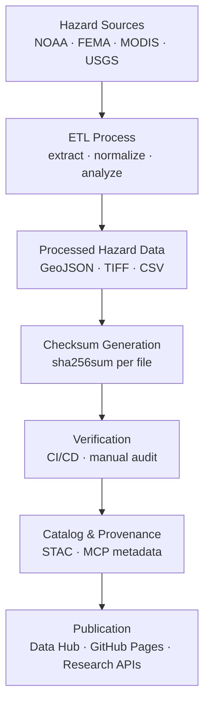

<div align="center">

# ⚠️ Kansas Frontier Matrix — Hazards Checksums

`data/processed/checksums/hazards/`

**Mission:** Maintain and verify the **integrity, provenance, and reproducibility** of all processed **natural hazard datasets** —
including tornadoes, floods, wildfires, and drought layers — ensuring confidence in the Kansas Frontier Matrix (KFM)
geospatial and temporal record of extreme events.

[](../../../../.github/workflows/site.yml)
[](../../../../.github/workflows/stac-validate.yml)
[](../../../../.github/workflows/trivy.yml)
[](../../../../docs/)
[](../../../../LICENSE)
[](../../../../LICENSE)

</div>

---

## 🧩 Versioning

| Field            | Value                                                  |
| :--------------- | :----------------------------------------------------- |
| **Version**      | `v1.0.2`                                               |
| **Status**       | Stable                                                 |
| **Maintainer**   | KFM Hazards & Environmental Data Team                  |
| **Last Updated** | 2025-10-12                                             |
| **Scope**        | Processed hazard datasets (`.geojson`, `.tif`, `.csv`) |
| **Compliance**   | MCP v1.0 · STAC 1.0.0 · SHA-256 Validated              |

---

## 📚 Overview

This directory stores **SHA-256 checksum manifests (`.sha256`)** that function as **cryptographic fingerprints**
for every processed hazard dataset in KFM.
These ensure end-to-end verification of **data integrity**, **reproducibility**, and **scientific transparency**.

---

## 🗂️ Directory Layout

```bash
data/processed/checksums/hazards/
├── README.md
├── tornado_tracks_1950_2024.geojson.sha256
├── flood_events_1900_2025.geojson.sha256
├── wildfire_perimeters_2000_2024.geojson.sha256
└── drought_index_2000_2025.tif.sha256
```

Each `.sha256` file maps 1 : 1 to its dataset in `data/processed/hazards/`.
CI workflows (`stac-validate.yml`) recompute and verify these at every build and deployment.

---

## 🎯 Purpose

| Objective                     | Description                                                  |
| :---------------------------- | :----------------------------------------------------------- |
| 🧩 **Integrity Verification** | Detects file corruption or unauthorized edits.               |
| 🔁 **Reproducibility**        | Confirms deterministic ETL outputs.                          |
| 🔗 **Provenance**             | Links digests across metadata, STAC, and source descriptors. |
| ⚙️ **CI Enforcement**         | CI pipelines block merges when mismatches occur.             |

---

## 🧮 Example `.sha256` Manifest

```bash
# File: tornado_tracks_1950_2024.geojson.sha256
8fb29cda3d0e44182f26c7bceff74b2c81b83e742d47d836b33151f871bb69d1  tornado_tracks_1950_2024.geojson
```

This digest certifies
`data/processed/hazards/tornado_tracks_1950_2024.geojson`
as **byte-for-byte identical** to its validated release artifact.

---

## ⚙️ Checksum Generation Workflow

Checksums are generated automatically during hazard ETL post-processing.

### Makefile Target

```bash
make hazards-checksums
```

### Python Utility

```bash
python src/utils/generate_checksums.py data/processed/hazards/ --algo sha256
```

**Workflow Steps**

1. Scan all processed hazard files (`.geojson`, `.tif`, `.csv`, …).
2. Compute SHA-256 using `hashlib` or `sha256sum --binary`.
3. Write `<filename>.sha256` into this directory.
4. Validate automatically in CI/CD pipelines.

💡 Use `--binary` mode for cross-platform consistency and line-ending independence.

---

## 🔎 CI/CD Validation

During builds, GitHub Actions re-verify all hazard checksums:

```bash
sha256sum -c data/processed/checksums/hazards/*.sha256
```

Any mismatch **fails the workflow**, blocking deployment until data are re-hashed.
Logs are archived to maintain an **MCP-compliant audit trail**.

---

## 🧩 Integration with Metadata & STAC

| Linked Component                            | Purpose                                                  |
| :------------------------------------------ | :------------------------------------------------------- |
| `data/processed/metadata/hazards/`          | Metadata + STAC Items reference SHA-256 for validation.  |
| `src/pipelines/hazards/hazards_pipeline.py` | Handles hash generation / verification in ETL.           |
| `.github/workflows/stac-validate.yml`       | CI workflow re-hashes and validates datasets.            |
| `data/stac/hazards/`                        | STAC catalog embeds digests in `assets.checksum:sha256`. |

---

## 🧭 Mermaid Data Flow



---

## 🧠 MCP Compliance Summary

| MCP Principle       | Implementation                                            |
| :------------------ | :-------------------------------------------------------- |
| Documentation-first | Each dataset includes `.sha256` + metadata.               |
| Reproducibility     | Deterministic ETL validated through hashes.               |
| Open Standards      | SHA-256 (FIPS 180-4) + STAC 1.0 + JSON Schema compliance. |
| Provenance          | Hashes trace lineage (source → ETL → STAC).               |
| Auditability        | CI/CD pipelines maintain transparent logs.                |

---

## 🧮 Maintenance & Best Practices

* 🔄 **After updates:** Regenerate checksums after any reprocessing.
* 🧩 **Manifest control:** Maintain `_manifest_all.sha256` for batch verification.
* ⚙️ **Consistency:** Dataset + checksum filenames must match exactly.
* 📜 **Transparency:** Document checksum changes in PRs + STAC changelogs.
* 🧰 **Pre-commit hooks:** Prevent commits with missing or outdated `.sha256` files.

---

## 📅 Version History

| Version   | Date       | Summary                                            |
| :-------- | :--------- | :------------------------------------------------- |
| **1.0.2** | 2025-10-12 | Added Mermaid visualization + versioning metadata. |
| **1.0.1** | 2025-10-10 | Expanded CI workflow + MCP compliance sections.    |
| **1.0.0** | 2025-10-04 | Initial hazards checksum documentation.            |

---

## 📖 References

* 🔗 [GNU Coreutils — SHA Utilities](https://www.gnu.org/software/coreutils/manual/html_node/sha2-utilities.html)
* 🌐 [STAC 1.0 Specification](https://stacspec.org)
* 🧩 [JSON Schema](https://json-schema.org)
* 📘 [MCP Standards (KFM)](../../../../docs/standards/)
* 🧭 [Provenance in Open Science](https://www.nature.com/articles/s41597-019-0193-2)

---

<div align="center">

> **Kansas Frontier Matrix — “Every Storm Verified: Data Integrity for a Changing Kansas.”**
> 📍 `data/processed/checksums/hazards/` · Linked to the Hazards STAC Collection

</div>
