<div align="center">

# 💧 Kansas Frontier Matrix — Hydrology Checksums

`data/processed/checksums/hydrology/`

**Mission:** Verify and preserve the **integrity and reproducibility** of all processed **hydrology datasets**
through **SHA-256 checksums**, maintaining consistent lineage, provenance, and scientific fidelity
across the Kansas Frontier Matrix (KFM) ecosystem.

[](../../../../.github/workflows/site.yml)
[](../../../../.github/workflows/stac-validate.yml)
[](../../../../.github/workflows/trivy.yml)
[](../../../../docs/)
[](../../../../LICENSE)
[](../../../../LICENSE)

</div>

---

## 🧩 Versioning

| Field            | Value                                                     |
| :--------------- | :-------------------------------------------------------- |
| **Version**      | `v1.0.2`                                                  |
| **Status**       | Stable                                                    |
| **Maintainer**   | KFM Hydrology & Geoscience Data Team                      |
| **Last Updated** | 2025-10-12                                                |
| **Scope**        | Processed hydrology datasets (`.geojson`, `.tif`, `.csv`) |
| **Compliance**   | MCP v1.0 · STAC 1.0.0 · SHA-256 Validated                 |

---

## 📚 Overview

This directory houses **SHA-256 checksum manifests (`.sha256`)** validating every processed hydrology dataset in KFM.
These digests form a **verifiable audit chain** from **raw input → ETL process → catalog publication**, ensuring
**data integrity**, **reproducibility**, and **traceable provenance** under the Master Coder Protocol (MCP).

All checksums are auto-generated by the hydrology ETL pipeline (`make hydrology`) and continuously validated in CI/CD workflows.

---

## 🗂️ Directory Layout

```bash
data/processed/checksums/hydrology/
├── README.md
├── nhd_flowlines_ks.geojson.sha256
├── watersheds_huc12_ks.geojson.sha256
├── fema_nfhl_ks.geojson.sha256
├── groundwater_levels_ks.geojson.sha256
└── flood_events_ks.geojson.sha256
```

Each `.sha256` maps **1:1** to its dataset in `data/processed/hydrology/`.
CI pipelines re-run `sha256sum -c` to guarantee byte-level consistency and reproducibility.

---

## 🎯 Purpose

| Objective                  | Description                                                |
| :------------------------- | :--------------------------------------------------------- |
| 🧩 **Data Integrity**      | Detects file corruption or tampering across environments.  |
| 🔁 **Reproducibility**     | Confirms deterministic ETL outputs.                        |
| 🔗 **Provenance Tracking** | Links digests to STAC Items and metadata for full lineage. |
| ⚙️ **CI Enforcement**      | GitHub Actions halt merges when mismatches occur.          |

---

## 🧮 Example `.sha256` File

```bash
# File: watersheds_huc12_ks.geojson.sha256
d2a9e4b1f97c3aa923f9025b2cf2058c477f01e8c024a07f68b992b04d789e5f  watersheds_huc12_ks.geojson
```

This digest certifies
`data/processed/hydrology/watersheds_huc12_ks.geojson`
matches its previously validated state exactly.

---

## ⚙️ Checksum Generation

Checksums are generated automatically at the completion of the **hydrology ETL pipeline**.

### Makefile Target

```bash
make hydrology-checksums
```

### Python Utility

```bash
python src/utils/generate_checksums.py data/processed/hydrology/ --algo sha256
```

**Steps**

1. Locate processed hydrology outputs (`.geojson`, `.tif`, `.csv`).
2. Compute SHA-256 in binary mode for consistency.
3. Save as `<filename>.sha256`.
4. Validate automatically in CI/CD workflows.

💡 Use `sha256sum --binary` or the Python utility to ensure cross-platform reproducibility.

---

## 🔎 Validation in CI/CD

GitHub Actions re-verify checksums on every PR, push, and release:

```bash
sha256sum -c data/processed/checksums/hydrology/*.sha256
```

If any mismatch is found, the pipeline **fails immediately**, blocking merges or releases until the dataset is reprocessed and rehashed.
Logs are archived to ensure a **permanent MCP audit trail**.

---

## 🧩 Integration with Metadata & STAC

| Linked Component                                | Purpose                                                     |
| :---------------------------------------------- | :---------------------------------------------------------- |
| `data/processed/metadata/hydrology/`            | STAC + metadata JSONs embed SHA-256 digests for validation. |
| `src/pipelines/hydrology/hydrology_pipeline.py` | Orchestrates checksum generation + verification.            |
| `.github/workflows/stac-validate.yml`           | CI job verifying hashes and schema compliance.              |
| `data/stac/hydrology/`                          | Publishes checksums in `assets.checksum:sha256`.            |

---

## 🧭 Mermaid Data Flow

```mermaid
flowchart TD
  A["Hydrology Sources<br/>NHD · FEMA · Groundwater surveys"] --> B["ETL Process<br/>clean · merge · normalize"]
  B --> C["Processed Hydrology Data<br/>GeoJSON · COG · CSV"]
  C --> D["Checksum Generation<br/>sha256sum per file"]
  D --> E["Verification<br/>CI/CD · manual audit"]
  E --> F["Catalog & Provenance<br/>STAC · MCP metadata"]
  F --> G["Publication<br/>Data Hub · GitHub Pages · Google Earth"]
%% END OF MERMAID %%
```



---

## 🧠 MCP Compliance Summary

| MCP Principle       | Implementation                                                |
| :------------------ | :------------------------------------------------------------ |
| Documentation-first | Each dataset includes `.sha256` + metadata.                   |
| Reproducibility     | Deterministic ETL verified through SHA-256 validation.        |
| Open Standards      | SHA-256 (FIPS 180-4), STAC 1.0, JSON Schema compliant.        |
| Provenance          | Hashes link data lineage from source → ETL → STAC.            |
| Auditability        | CI/CD logs maintain public, reproducible verification trails. |

---

## 🧮 Maintenance & Best Practices

* 🔄 **After updates:** Regenerate hashes after reprocessing or ETL changes.
* 🧩 **File pairing:** Checksum filenames must match their dataset names exactly.
* 🧾 **Batch audits:** Use `_manifest_all.sha256` for large-scale validations.
* 🧪 **Pre-commit hook:** Optionally block commits with outdated or missing checksums.
* 🧰 **Version bump:** Update STAC + metadata version fields when new hashes are generated.

---

## 📅 Version History

| Version   | Date       | Summary                                                         |
| :-------- | :--------- | :-------------------------------------------------------------- |
| **1.0.2** | 2025-10-12 | Added Mermaid visualization + full MCP/STAC linkage metadata.   |
| **1.0.1** | 2025-10-10 | Improved CI/CD integration + documentation for reproducibility. |
| **1.0.0** | 2025-10-04 | Initial hydrology checksum documentation + manifests.           |

---

## 📖 References

* 🔗 [GNU Coreutils — SHA Utilities](https://www.gnu.org/software/coreutils/manual/html_node/sha2-utilities.html)
* 🌐 [STAC 1.0 Specification](https://stacspec.org)
* 🧩 [JSON Schema](https://json-schema.org)
* 📘 [MCP Standards](../../../../docs/standards/)
* 🧭 [Data Provenance in Open Science](https://www.nature.com/articles/s41597-019-0193-2)

---

<div align="center">

> **Kansas Frontier Matrix — “Flowing Data, Verified Integrity.”**
> 📍 `data/processed/checksums/hydrology/` · Linked to the Hydrology STAC Collection

</div>
