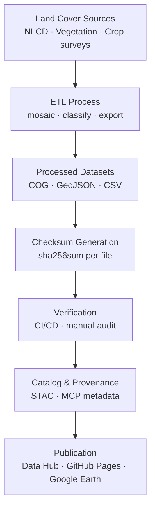

<div align="center">

# 🌾 Kansas Frontier Matrix — Land Cover Checksums

`data/processed/checksums/landcover/`

**Mission:** Verify, preserve, and document the **integrity and reproducibility** of all processed **land cover datasets**
using **SHA-256 checksums**, ensuring **consistency, transparency, and auditability** across the KFM spatiotemporal system.

[](../../../../.github/workflows/site.yml)
[](../../../../.github/workflows/stac-validate.yml)
[](../../../../.github/workflows/trivy.yml)
[](../../../../docs/)
[](../../../../LICENSE)
[](../../../../LICENSE)

</div>

---

## 🧩 Versioning

| Field            | Value                                                      |
| :--------------- | :--------------------------------------------------------- |
| **Version**      | `v1.0.2`                                                   |
| **Status**       | Stable                                                     |
| **Maintainer**   | KFM Spatial Data & Ecology Team                            |
| **Last Updated** | 2025-10-12                                                 |
| **Applies To**   | Processed land cover datasets (`.tif`, `.geojson`, `.csv`) |
| **Compliance**   | MCP v1.0 · STAC 1.0.0 · SHA-256 Validated                  |

---

## 📚 Overview

This directory holds **SHA-256 checksum manifests (`.sha256`)** validating all processed land cover datasets in KFM.
Each checksum provides a **cryptographic fingerprint** linking outputs to their metadata and STAC catalog entries, enabling:

* ✅ **Integrity Verification** — detect corruption or tampering
* 🔁 **Reproducibility** — confirm deterministic ETL output equivalence
* 🧭 **Provenance** — connect outputs to source data + metadata lineage
* 🔒 **Auditability** — ensure continuous validation via CI/CD pipelines

All hashes are generated automatically during `make landcover` and verified on every commit or release.

---

## 🗂️ Directory Layout

```bash
data/processed/checksums/landcover/
├── README.md
├── nlcd_1992_2021.tif.sha256
├── kansas_vegetation_1850s.tif.sha256
├── landcover_change_1992_2021.geojson.sha256
└── crop_distribution_2020.geojson.sha256
```

Each `.sha256` file corresponds **1:1** with its dataset in `data/processed/landcover/`.
During builds, `sha256sum -c` re-validates each checksum to ensure byte-level consistency.

---

## 🎯 Purpose

| Objective              | Description                                                                    |
| :--------------------- | :----------------------------------------------------------------------------- |
| 🧩 **Integrity**       | Detects corruption or unauthorized modification between versions or transfers. |
| 🔁 **Reproducibility** | Ensures deterministic ETL results from identical inputs.                       |
| 🔗 **Provenance**      | Links checksum digests across metadata and STAC Items.                         |
| ⚙️ **CI Enforcement**  | Automated GitHub workflows fail on mismatched hashes.                          |

---

## 🧮 Example `.sha256` File

```bash
# File: nlcd_1992_2021.tif.sha256
1e8a2a99ef45f582f821a4b8ac3adcc48f0c52b7c1d7ce1f92f4cb045c54cc54  nlcd_1992_2021.tif
```

This digest validates
`data/processed/landcover/nlcd_1992_2021.tif`
as **bit-for-bit identical** to its previously verified version.

---

## ⚙️ Checksum Generation

Checksums are generated at the end of the **land cover ETL pipeline**.

### Makefile Target

```bash
make landcover-checksums
```

### Python Utility

```bash
python src/utils/generate_checksums.py data/processed/landcover/ --algo sha256
```

**Workflow Steps**

1. Scan for land cover outputs (`.tif`, `.geojson`, `.csv`).
2. Compute SHA-256 hashes in binary mode.
3. Write `<filename>.sha256` into this directory.
4. Validate in CI/CD using automated checks.

💡 Use `sha256sum --binary` for cross-platform consistency.

---

## 🔎 CI/CD Validation

Validation is performed during **STAC validation** and **deployment workflows**:

```bash
sha256sum -c data/processed/checksums/landcover/*.sha256
```

A mismatch halts the CI pipeline, preventing merges or releases until reprocessing occurs.
Logs are archived to maintain **MCP-compliant audit trails**.

---

## 🧩 Integration with Metadata & STAC

| Linked Component                                | Purpose                                               |
| :---------------------------------------------- | :---------------------------------------------------- |
| `data/processed/metadata/landcover/`            | Metadata and STAC Items embed SHA-256 for validation. |
| `src/pipelines/landcover/landcover_pipeline.py` | Generates + verifies hashes post-processing.          |
| `.github/workflows/stac-validate.yml`           | Revalidates checksums during CI/CD.                   |
| `data/stac/landcover/`                          | Publishes SHA-256 in `assets.checksum:sha256`.        |

---

## 🧭 Mermaid Data Flow



---

## 🧠 MCP Compliance Summary

| MCP Principle       | Implementation                                         |
| :------------------ | :----------------------------------------------------- |
| Documentation-first | Each dataset includes `.sha256` + metadata.            |
| Reproducibility     | Deterministic ETL validated via SHA-256 hashes.        |
| Open Standards      | SHA-256 (FIPS 180-4), STAC 1.0, JSON Schema compliant. |
| Provenance          | Hashes connect full lineage (source → ETL → STAC).     |
| Auditability        | CI/CD logs provide continuous verifiable records.      |

---

## 🧮 Maintenance & Best Practices

* 🔄 **After updates:** Regenerate checksums after any dataset modification.
* 🧩 **Naming consistency:** Filenames must match dataset names exactly.
* 🧾 **Manifest tracking:** Maintain `_manifest_all.sha256` for batch releases.
* 🧪 **Pre-commit enforcement:** Prevent commits when checksums are stale/missing.
* 🧰 **Version bump:** Update metadata + STAC version fields when hashes change.

---

## 📅 Version History

| Version   | Date       | Summary                                                      |
| :-------- | :--------- | :----------------------------------------------------------- |
| **1.0.2** | 2025-10-12 | Added Mermaid flow + full MCP/STAC compliance metadata.      |
| **1.0.1** | 2025-10-10 | Enhanced CI/CD + MCP documentation and workflow integration. |
| **1.0.0** | 2025-10-04 | Initial land cover checksum documentation and manifests.     |

---

## 📖 References

* 🔗 [GNU Coreutils — SHA Utilities](https://www.gnu.org/software/coreutils/manual/html_node/sha2-utilities.html)
* 🌐 [STAC 1.0 Specification](https://stacspec.org)
* 🧩 [JSON Schema](https://json-schema.org)
* 📘 [MCP Standards (KFM)](../../../../docs/standards/)
* 🧭 [Data Provenance in Open Science](https://www.nature.com/articles/s41597-019-0193-2)

---

<div align="center">

> **Kansas Frontier Matrix — “Every Pixel Proven: Verifying the Surface of Change.”**
> 📍 `data/processed/checksums/landcover/` · Linked to the Land Cover STAC Collection

</div>
