<div align="center">

# 📊 Kansas Frontier Matrix — Tabular Checksums

`data/processed/checksums/tabular/`

**Mission:** Safeguard the **integrity, provenance, and reproducibility** of all processed **tabular datasets** —
including census, agricultural, demographic, and economic data — within the **Kansas Frontier Matrix (KFM)** system.
By maintaining **SHA-256 checksums**, this directory ensures analytical trust and verifiable scientific reproducibility.

[](../../../../.github/workflows/site.yml)
[](../../../../.github/workflows/stac-validate.yml)
[](../../../../.github/workflows/trivy.yml)
[](../../../../docs/)
[](../../../../LICENSE)
[](../../../../LICENSE)

</div>

---

## 🧩 Versioning

| Field            | Value                                                     |
| :--------------- | :-------------------------------------------------------- |
| **Version**      | `v1.0.2`                                                  |
| **Status**       | Stable                                                    |
| **Maintainer**   | KFM Data Engineering Team                                 |
| **Last Updated** | 2025-10-12                                                |
| **Scope**        | Processed tabular datasets (`.csv`, `.parquet`, `.jsonl`) |
| **Compliance**   | MCP v1.0 · STAC 1.0.0 · SHA-256 Validated                 |

---

## 📚 Overview

This directory stores **SHA-256 checksum manifests (`.sha256`)** validating all processed tabular datasets in the Kansas Frontier Matrix.
Each checksum acts as a **cryptographic verifier** confirming that no analytical file has been altered since validation,
ensuring **data lineage, ETL reproducibility,** and **open scientific transparency**.

All hashes are auto-generated by the **Tabular ETL pipeline** (`make tabular`) and re-verified in CI/CD at each build and release.

---

## 🗂️ Directory Layout

```bash
data/processed/checksums/tabular/
├── README.md
├── census_population_1860_2020.parquet.sha256
├── agricultural_production_1870_2020.parquet.sha256
└── economic_indicators_1900_2025.parquet.sha256
```

Each `.sha256` corresponds exactly to its dataset in `data/processed/tabular/`.
CI workflows (e.g., `stac-validate.yml`) recompute these to confirm integrity.

---

## 🎯 Purpose

| Objective                     | Description                                                       |
| :---------------------------- | :---------------------------------------------------------------- |
| 🧩 **Integrity Verification** | Detects corruption or unauthorized data edits.                    |
| 🔁 **Reproducibility**        | Guarantees deterministic ETL outputs.                             |
| 🔗 **Provenance Tracking**    | Binds dataset lineage across STAC, metadata, and checksum layers. |
| ⚙️ **Automation in CI**       | Continuous validation prevents version drift.                     |

---

## 🧮 Example `.sha256` File

```bash
# File: census_population_1860_2020.parquet.sha256
0d1e13dbde8fca82e7bc2184c23a7e231eb5b74b6e38e72df47f60bde8e54ccf  census_population_1860_2020.parquet
```

This verifies that
`data/processed/tabular/census_population_1860_2020.parquet`
matches the officially validated release artifact, ensuring byte-level fidelity.

---

## ⚙️ Checksum Generation

Checksums are produced as a **post-processing** ETL step.

### Makefile Target

```bash
make tabular-checksums
```

### Python Utility

```bash
python src/utils/generate_checksums.py data/processed/tabular/ --algo sha256
```

**Workflow Steps**

1. Identify all tabular outputs (`.csv`, `.parquet`, `.jsonl`).
2. Compute SHA-256 digests (binary mode).
3. Write `<filename>.sha256` into this directory.
4. Validate automatically in CI/CD.

💡 Always use `sha256sum --binary` or the provided Python tool for cross-platform consistency.

---

## 🔎 CI/CD Validation

GitHub Actions automatically verifies checksums during every commit and release.

```bash
sha256sum -c data/processed/checksums/tabular/*.sha256
```

A single mismatch halts the workflow, ensuring no corrupted or altered data propagates.
Validation logs are archived for **permanent MCP audit trails**.

---

## 🧩 Integration with Metadata & STAC

| Linked Component                            | Purpose                                              |
| :------------------------------------------ | :--------------------------------------------------- |
| `data/processed/metadata/tabular/`          | STAC Items embed checksum references for validation. |
| `src/pipelines/tabular/tabular_pipeline.py` | Generates and verifies hashes within ETL.            |
| `.github/workflows/stac-validate.yml`       | Confirms checksum + STAC integrity automatically.    |
| `data/stac/tabular/`                        | Publishes digests in `assets.checksum:sha256`.       |

---

## 🧭 Mermaid Data Flow

```mermaid
flowchart TD
  A["Tabular Sources<br/>census · agriculture · economics"] --> B["ETL Process<br/>extract · clean · normalize"]
  B --> C["Processed Data<br/>CSV · Parquet · JSONL"]
  C --> D["Checksum Generation<br/>sha256sum per file"]
  D --> E["Verification<br/>CI/CD · manual audit"]
  E --> F["Catalog & Provenance<br/>STAC · MCP metadata"]
  F --> G["Publication<br/>Data Hub · GitHub Pages · Analytics API"]
%% END OF MERMAID %%
```



---

## 🧠 MCP Compliance Summary

| MCP Principle       | Implementation                                       |
| :------------------ | :--------------------------------------------------- |
| Documentation-first | Every dataset includes `.sha256` + metadata.         |
| Reproducibility     | Deterministic ETL verified through hash equivalence. |
| Open Standards      | SHA-256 (FIPS 180-4) ensures interoperability.       |
| Provenance          | Hashes connect full lineage (source → ETL → STAC).   |
| Auditability        | CI/CD maintains continuous public validation logs.   |

---

## 🧮 Maintenance & Best Practices

* 🔄 **After data updates:** Regenerate checksums + increment metadata versions.
* 🧾 **File pairing:** Ensure identical filenames between data + checksum.
* 📜 **Bulk audits:** Maintain `_manifest_all.sha256` for large releases.
* 🧪 **Pre-commit hook:** Block commits with missing or stale hashes.
* 🧰 **Metadata sync:** Update STAC/metadata with latest SHA values.

---

## 📅 Version History

| Version   | Date       | Summary                                             |
| :-------- | :--------- | :-------------------------------------------------- |
| **1.0.2** | 2025-10-12 | Added Mermaid data-flow + full versioning metadata. |
| **1.0.1** | 2025-10-10 | Enhanced CI integration + MCP documentation.        |
| **1.0.0** | 2025-10-04 | Initial tabular checksum release.                   |

---

## 📖 References

* 🔗 [GNU Coreutils — SHA Utilities](https://www.gnu.org/software/coreutils/manual/html_node/sha2-utilities.html)
* 🌐 [STAC 1.0 Specification](https://stacspec.org)
* 🧩 [JSON Schema](https://json-schema.org)
* 📘 [MCP Standards (KFM)](../../../../docs/standards/)
* 🧭 [Data Provenance in Open Science](https://www.nature.com/articles/s41597-019-0193-2)

---

<div align="center">

> **Kansas Frontier Matrix — “Verifying Every Figure: Integrity in the Numbers.”**
> 📍 `data/processed/checksums/tabular/` · Linked to the Tabular STAC Collection

</div>
