<div align="center">

# 🧾 Kansas Frontier Matrix — Terrain Checksums

`data/processed/checksums/terrain/`

**Mission:** Guarantee the **integrity, provenance, and reproducibility** of all processed **terrain datasets**
by implementing SHA-256 checksum validation, ensuring trustworthy geospatial data lineage and reproducible ETL results
across the Kansas Frontier Matrix (KFM) scientific ecosystem.

[](../../../../.github/workflows/site.yml)
[](../../../../.github/workflows/stac-validate.yml)
[](../../../../.github/workflows/trivy.yml)
[](../../../../docs/)
[](../../../../LICENSE)
[](../../../../LICENSE)

</div>

---

## 🧩 Versioning

| Field            | Value                                                      |
| :--------------- | :--------------------------------------------------------- |
| **Version**      | `v1.0.2`                                                   |
| **Status**       | Stable                                                     |
| **Maintainer**   | KFM Geospatial Data Engineering Team                       |
| **Last Updated** | 2025-10-12                                                 |
| **Applies To**   | Processed terrain datasets (DEM, slope, aspect, hillshade) |
| **Provenance**   | MCP v1.0 · STAC 1.0.0 · SHA-256 Validated                  |

---

## 📚 Overview

This directory stores **SHA-256 checksum manifests (`.sha256`)** verifying every processed terrain dataset.
Checksums serve as **cryptographic fingerprints** for files like **DEMs**, **hillshades**, and **slope/aspect rasters**,
ensuring that each artifact can be traced and reproduced exactly.

---

## 🗂️ Directory Layout

```bash
data/processed/checksums/terrain/
├── README.md
├── ks_1m_dem_2018_2020.tif.sha256
├── ks_hillshade_2018_2020.tif.sha256
├── slope_aspect_2018_2020.tif.sha256
└── usgs_topo_larned_1894.tif.sha256
```

Each `.sha256` corresponds 1 : 1 to its dataset in `data/processed/terrain/`.
All files are regenerated and verified through automated CI/CD jobs.

---

## 🎯 Purpose

| Objective                     | Description                                                                                 |
| :---------------------------- | :------------------------------------------------------------------------------------------ |
| 🧩 **Integrity Verification** | Detects corruption or tampering in raster outputs (COG · GeoTIFF).                          |
| 🔁 **Reproducibility**        | Confirms identical ETL outputs given identical inputs.                                      |
| 🔗 **Traceability**           | Links datasets to STAC and metadata records.                                                |
| ⚙️ **CI Enforcement**         | Automated validation through GitHub workflows (`stac-validate.yml`, `integrity-check.yml`). |

---

## 🧮 Example `.sha256` File

```bash
# File: ks_1m_dem_2018_2020.tif.sha256
b8494ab6a3219c6a51e3de22804b329872c10f39ff8a4cf18ad4b3b61cb6ac8d  ks_1m_dem_2018_2020.tif
```

This checksum certifies that
`data/processed/terrain/ks_1m_dem_2018_2020.tif`
is **bit-for-bit identical** to its validated release artifact.

---

## ⚙️ Checksum Generation

Checksums are automatically generated at the end of each terrain ETL run.

### Makefile Target

```bash
make terrain-checksums
```

### Python Utility

```bash
python src/utils/generate_checksums.py data/processed/terrain/ --algo sha256
```

**Workflow Steps**

1. Locate processed outputs (`.tif`, `.geojson`, `.json`).
2. Compute SHA-256 in binary mode.
3. Save as `<filename>.sha256`.
4. Validate during CI runs.

💡 Use `sha256sum --binary` (GNU Coreutils) for platform-independent consistency.

---

## 🔎 CI/CD Validation

Checksum verification runs automatically in **STAC Validation** and **Build & Deploy** pipelines:

```bash
sha256sum -c data/processed/checksums/terrain/*.sha256
```

Any mismatch blocks merges or releases until re-hashed, guaranteeing immutability and pipeline trust.

---

## 🧩 Integration with Metadata & STAC

| Linked Component                            | Purpose                                                          |
| :------------------------------------------ | :--------------------------------------------------------------- |
| `data/processed/metadata/terrain/`          | STAC Items embed checksum digests for validation.                |
| `src/pipelines/terrain/terrain_pipeline.py` | Handles checksum generation + verification.                      |
| `.github/workflows/stac-validate.yml`       | Re-hashes and validates integrity in CI.                         |
| `data/stac/terrain/`                        | Publishes `assets.checksum:sha256` for external reproducibility. |

---

## 🧭 Mermaid Data Flow

```mermaid
flowchart TD
  A["Terrain Sources<br/>LiDAR · DEM · Topographic scans"] --> B["ETL Process<br/>mosaic · reproject · resample"]
  B --> C["Processed Terrain Data<br/>COG · GeoTIFF · slope/aspect"]
  C --> D["Checksum Generation<br/>sha256sum per file"]
  D --> E["Verification<br/>CI/CD · manual audit"]
  E --> F["Catalog & Provenance<br/>STAC · MCP metadata"]
  F --> G["Publication<br/>Data Hub · GitHub Pages · Google Earth"]
%% END OF MERMAID %%
```



---

## 🧠 MCP Compliance Summary

| MCP Principle       | Implementation                                       |
| :------------------ | :--------------------------------------------------- |
| Documentation-first | Each dataset includes `.sha256` + metadata.          |
| Reproducibility     | Deterministic pipeline outputs validated via hashes. |
| Open Standards      | SHA-256 (FIPS 180-4) + JSON Schema validation.       |
| Provenance          | Hashes link ETL → STAC → metadata.                   |
| Auditability        | CI logs checksum validation for traceability.        |

---

## 🧮 Maintenance & Best Practices

* 🔄 **Update After Changes:** Regenerate hashes after modifying terrain data.
* 🧩 **Naming:** Checksum filenames must mirror dataset names.
* 🧪 **Bulk Validation:** Use `_manifest_all.sha256` for batch audits.
* 🧰 **Version Control:** Document checksum updates in PR notes and STAC changelogs.
* ⚙️ **Automation:** Pre-commit hooks prevent missing/stale checksums.

---

## 📅 Version History

| Version   | Date       | Summary                                           |
| :-------- | :--------- | :------------------------------------------------ |
| **1.0.2** | 2025-10-12 | Added Mermaid flow diagram + versioning metadata. |
| **1.0.1** | 2025-10-10 | Enhanced CI/CD and MCP documentation.             |
| **1.0.0** | 2025-10-04 | Initial terrain checksum release.                 |

---

## 📖 References

* 🔗 [GNU Coreutils — SHA Utilities](https://www.gnu.org/software/coreutils/manual/html_node/sha2-utilities.html)
* 🌐 [STAC 1.0 Specification](https://stacspec.org)
* 🧩 [JSON Schema](https://json-schema.org)
* 📘 [MCP Standards](../../../../docs/standards/)
* 🧭 [Data Provenance in Open Science](https://www.nature.com/articles/s41597-019-0193-2)

---

<div align="center">

> **Kansas Frontier Matrix — “Integrity in Every Pixel: Verifying the Ground Truth.”**
> 📍 `data/processed/checksums/terrain/` · Linked to the Terrain STAC Collection

</div>
