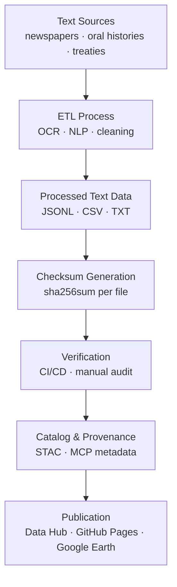

<div align="center">

# 📜 Kansas Frontier Matrix — Text Checksums

`data/processed/checksums/text/`

**Mission:** Safeguard the **integrity, provenance, and reproducibility** of all processed **textual datasets** —
historical newspapers, oral histories, treaties, and transcripts — via verified **SHA-256 checksums**.
These hashes anchor **transparent, auditable scholarship** under the **Master Coder Protocol (MCP)**.

[](../../../../.github/workflows/site.yml)
[](../../../../.github/workflows/stac-validate.yml)
[](../../../../.github/workflows/trivy.yml)
[](../../../../docs/)
[](../../../../LICENSE)
[](../../../../LICENSE)

</div>

---

## 🧩 Versioning

| Field            | Value                                        |
| :--------------- | :------------------------------------------- |
| **Version**      | `v1.0.2`                                     |
| **Status**       | Stable                                       |
| **Maintainer**   | Kansas Frontier Matrix Data Engineering Team |
| **Last Updated** | 2025-10-12                                   |
| **Applies To**   | All datasets under `data/processed/text/`    |
| **Provenance**   | MCP v1.0 · STAC 1.0.0 · SHA-256 Verified     |

---

## 📚 Overview

This directory stores **`.sha256` manifests** for every processed text dataset.
Each hash acts as a **cryptographic fingerprint**, proving that a file remains unchanged since verification.

**Guarantees**

| Symbol | Property        | Description                                      |
| :----- | :-------------- | :----------------------------------------------- |
| 📜     | Integrity       | Detects unauthorized modification or corruption. |
| 🔁     | Reproducibility | Ensures deterministic NLP / OCR outputs.         |
| 🔗     | Provenance      | Links datasets → metadata → STAC → publication.  |
| ⚙️     | Auditability    | CI/CD workflows continuously validate hashes.    |

Checksums are generated automatically in the **text ETL pipeline** (`make text`) and re-verified in GitHub Actions.

---

## 🗂️ Directory Layout

```bash
data/processed/checksums/text/
├── README.md
├── newspaper_articles_1850_1920.jsonl.sha256
├── oral_histories_transcripts.json.sha256
└── treaties_legislation_1820_1900.json.sha256
```

Each `.sha256` file corresponds 1 : 1 with its dataset in `data/processed/text/`.
`stac-validate.yml` rehashes these during every build to confirm immutability.

---

## ⚙️ Checksum Generation Workflow

Checksums are created automatically after ETL completion or manually when validating updates.

### Makefile target

```bash
make text-checksums
```

### Python utility

```bash
python src/utils/generate_checksums.py data/processed/text/ --algo sha256
```

**Steps**

1. Locate processed text datasets (`.txt`, `.json`, `.jsonl`, `.csv`).
2. Compute SHA-256 hash using Python `hashlib` or `sha256sum --binary`.
3. Write `<filename>.sha256` files into this directory.
4. CI/CD validates them automatically.

💡 Use `--binary` for platform-independent consistency.

---

## 🔎 CI/CD Validation

Validation runs automatically for every build or PR:

```bash
sha256sum -c data/processed/checksums/text/*.sha256
```

If any mismatch occurs, the pipeline fails, blocking merge or deploy until fixed.
Validation logs are archived to preserve a full MCP audit trail.

---

## 🧩 Integration with Metadata & STAC

| Linked Component                      | Purpose                                               |
| :------------------------------------ | :---------------------------------------------------- |
| `data/processed/metadata/text/`       | STAC Items reference `.sha256` digests for integrity. |
| `src/pipelines/text/text_pipeline.py` | Automates hash generation + verification.             |
| `.github/workflows/stac-validate.yml` | Runs checksum + STAC schema validation.               |
| `data/stac/text/`                     | Embeds digests in `assets.checksum:sha256`.           |

---

## 🧠 MCP Compliance Summary

| MCP Principle       | Implementation                                            |
| :------------------ | :-------------------------------------------------------- |
| Documentation-first | Every dataset has a paired `.sha256` and metadata record. |
| Reproducibility     | Hashes prove deterministic NLP/OCR outputs.               |
| Open Standards      | SHA-256 (FIPS 180-4) ensures cross-platform consistency.  |
| Provenance          | Hashes link datasets across metadata → STAC → source.     |
| Auditability        | CI/CD enforces continuous verification + changelogs.      |

---

## 🧮 Maintenance & Best Practices

* 🔄 **Refresh** checksums after any reprocessing or pipeline change.
* 🧾 **Filename match** checksums exactly to datasets.
* 📜 **Update mcp_provenance** fields when regenerating hashes.
* 🧪 **Batch audits** via `_manifest_all.sha256`.
* ⚙️ **Automation** with pre-commit hooks to prevent stale hashes.

---

## 🧭 Mermaid Data Flow



---

## 📅 Version History

| Version   | Date       | Summary                                                  |
| :-------- | :--------- | :------------------------------------------------------- |
| **1.0.2** | 2025-10-12 | Added Mermaid visualization and versioning metadata.     |
| **1.0.1** | 2025-10-10 | Enhanced CI/CD integration and MCP best practices.       |
| **1.0.0** | 2025-10-04 | Initial checksum documentation and validation manifests. |

---

## 📖 References

* 🔗 [GNU Coreutils SHA Utilities](https://www.gnu.org/software/coreutils/manual/html_node/sha2-utilities.html)
* 🌐 [STAC 1.0 Specification](https://stacspec.org)
* 🧩 [JSON Schema](https://json-schema.org)
* 📘 [MCP Standards (KFM)](../../../../docs/standards/)
* 🧭 [Data Provenance in Open Science](https://www.nature.com/articles/s41597-019-0193-2)

---

<div align="center">

> **Kansas Frontier Matrix — “Every Word Verified: Integrity in the Historical Record.”**
> 📍 `data/processed/checksums/text/` · Linked to the Text STAC Collection

</div>
