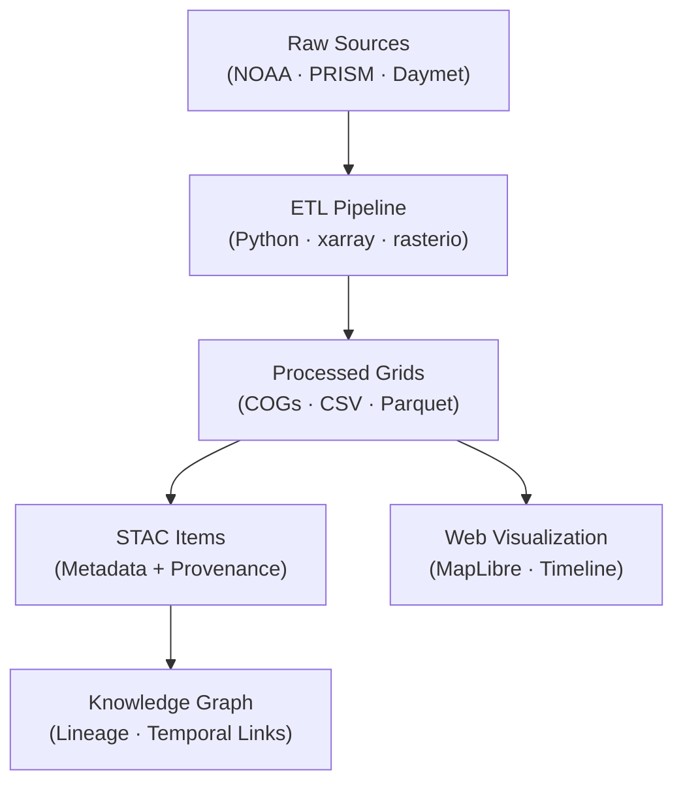

<div align="center">

# 🌦️ Kansas Frontier Matrix — Processed Climate Data  
`data/processed/climate/`

**Mission:** Host **cleaned and standardized climate datasets** — temperature, precipitation, drought indices,  
and atmospheric summaries — ready for **analysis, visualization, and derivative generation** across Kansas’s history.

[](../../../.github/workflows/site.yml)
[](../../../.github/workflows/stac-validate.yml)
[](../../../.github/workflows/codeql.yml)
[](../../../.github/workflows/trivy.yml)
[](../../../.github/workflows/pre-commit.yml)
[](../../../docs/)
[](../../../LICENSE)
[](../../../LICENSE)

</div>

---

## 📚 Table of Contents
- [Overview](#overview)
- [Directory Layout](#directory-layout)
- [Core Climate Datasets](#core-climate-datasets)
- [STAC Metadata](#stac-metadata)
- [Processing Workflow](#processing-workflow)
- [Mermaid Diagram — Workflow Overview](#mermaid-diagram--workflow-overview)
- [Reproducibility & Validation](#reproducibility--validation)
- [Contributing New Climate Data](#contributing-new-climate-data)
- [Version History](#version-history)
- [References](#references)

---

## 🌤️ Overview

This directory contains **processed, analysis-ready climate datasets** produced from raw historical  
and contemporary observations. It includes daily, monthly, and annual grids and tables for **temperature**,  
**precipitation**, and **drought indicators**, which are used directly or to generate derivatives in  
`data/derivatives/climate/`.

Primary sources: **NOAA NCEI**, **NASA Daymet**, **PRISM**, and **U.S. Drought Monitor** — spanning the **late 1800s to present**.

All gridded outputs are standardized to **EPSG:4326 (WGS84)** and delivered as **Cloud-Optimized GeoTIFFs (COG)**;  
tabular summaries are provided as **CSV** or **Parquet** for performant analytics.

---

## 🧱 Directory Layout

```bash
data/
└── processed/
    └── climate/
        ├── temp_mean_annual_1895_2024.tif
        ├── precip_total_annual_1895_2024.tif
        ├── drought_spi12_1895_2024.tif
        ├── climate_normals_1991_2020.parquet
        ├── station_climate_summary.csv
        ├── metadata/
        ├── checksums/
        └── README.md
````

Each dataset is paired with a **STAC Item** under `metadata/`
and a corresponding `.sha256` checksum under `checksums/`.

---

## 🌡️ Core Climate Datasets

| Product                         | File                                | Description                                              | Source             | Units  | Format        |
| :------------------------------ | :---------------------------------- | :------------------------------------------------------- | :----------------- | :----- | :------------ |
| Mean Temperature (1895–2024)    | `temp_mean_annual_1895_2024.tif`    | Gridded mean annual temperature across Kansas            | NOAA NCEI · PRISM  | °C     | GeoTIFF (COG) |
| Total Precipitation (1895–2024) | `precip_total_annual_1895_2024.tif` | Annual precipitation sums interpolated from stations     | NOAA NCEI · Daymet | mm     | GeoTIFF (COG) |
| Drought SPI (12-Month)          | `drought_spi12_1895_2024.tif`       | Standardized Precipitation Index (12-month accumulation) | NOAA CPC           | index  | GeoTIFF (COG) |
| Climate Normals (1991–2020)     | `climate_normals_1991_2020.parquet` | 30-year temperature & precipitation normals per station  | NOAA NCEI          | °C, mm | Parquet       |
| Station Climate Summary         | `station_climate_summary.csv`       | Aggregated means & extremes by county/station            | Derived            | °C, mm | CSV           |

---

## 🧩 STAC Metadata

Each processed file is registered as a **STAC Item** under `data/stac/items/climate_*` with full lineage and provenance.

Example:

```json
{
  "type": "Feature",
  "stac_version": "1.0.0",
  "id": "temp_mean_annual_1895_2024",
  "properties": {
    "title": "Mean Annual Temperature (1895–2024) – Kansas",
    "datetime": "2024-01-01T00:00:00Z",
    "description": "Gridded average annual temperature aggregated from NOAA NCEI and PRISM datasets; baseline 1991–2020.",
    "processing:software": "Python + xarray + rasterio",
    "mcp_provenance": "sha256:a83c1b…",
    "license": "CC-BY 4.0",
    "derived_from": [
      "data/raw/noaa_temp_station.csv",
      "data/raw/prism_temp_monthly.nc"
    ]
  },
  "assets": {
    "data": {
      "href": "./temp_mean_annual_1895_2024.tif",
      "type": "image/tiff; application=geotiff; profile=cloud-optimized",
      "roles": ["data"]
    }
  }
}
```

🔗 Related STAC collection: `../../stac/collections/climate.json`

---

## ⚙️ Processing Workflow

Workflows are automated using **Makefile targets** and **Python tooling** under `tools/climate/`, leveraging `xarray`, `rasterio`, and `NumPy`.

```bash
# 1️⃣ Aggregate station temperature to annual mean grid
python tools/climate/temp_aggregate.py \
  --input data/raw/noaa_temp_station.csv \
  --output data/processed/climate/temp_mean_annual_1895_2024.tif

# 2️⃣ Annual precipitation totals (gridded)
python tools/climate/precip_total.py \
  --input data/raw/prism_precip_monthly.nc \
  --output data/processed/climate/precip_total_annual_1895_2024.tif

# 3️⃣ Drought SPI (12-month)
python tools/climate/spi_index.py \
  --input data/raw/noaa_precip.csv \
  --output data/processed/climate/drought_spi12_1895_2024.tif
```

Standardization steps:

* Reproject to EPSG:4326
* Convert to Cloud-Optimized GeoTIFF
* Apply LZW or ZSTD compression

---

## 🗺️ Mermaid Diagram — Workflow Overview



---

## 🔁 Reproducibility & Validation

* **Checksums:** `.sha256` manifests verify file integrity.
* **STAC Validation:** All JSON Items validated against STAC 1.0 schema in CI.
* **Makefile Targets:**

  * `make climate` → build all processed layers
  * `make validate-climate` → validate STAC + checksums
* **Containerization:** Docker image (Python + GDAL + xarray).
* **Cross-validation:** Outputs checked against NCEI & Daymet.

---

## 🧠 Contributing New Climate Data

1. Add new processed dataset(s) to this folder (`.tif`, `.csv`, `.parquet`).
2. Create corresponding STAC Item in `metadata/` and `.sha256` in `checksums/`.
3. Include `DERIVATION.md` describing inputs, software, and methods.
4. Validate using:

```bash
make validate-climate
```

5. Open a Pull Request with:

   * Data license & sources
   * Processing script references
   * Visualization guidance

---

## 📅 Version History

| Version   | Date       | Summary                                                              |
| :-------- | :--------- | :------------------------------------------------------------------- |
| **1.1.0** | 2025-10-11 | Added Mermaid workflow, versioning metadata, and STAC schema example |
| **1.0.1** | 2025-10-10 | MCP-aligned front matter, validation targets, containerization notes |
| **1.0.0** | 2025-10-04 | Initial processed climate datasets and documentation                 |

---

## 🧠 AI Metadata (JSON-LD)

```json
{
  "@context": "https://schema.org/",
  "@type": "Dataset",
  "name": "Kansas Processed Climate Data",
  "version": "1.1.0",
  "spatialCoverage": "Kansas, USA",
  "temporalCoverage": "1895-01-01/2024-12-31",
  "creator": "Kansas Frontier Matrix Project",
  "license": "https://creativecommons.org/licenses/by/4.0/",
  "keywords": ["climate","temperature","precipitation","drought","Kansas"],
  "distribution": [
    {
      "@type": "DataDownload",
      "contentUrl": "./temp_mean_annual_1895_2024.tif",
      "encodingFormat": "image/tiff; application=geotiff; profile=cloud-optimized"
    }
  ]
}
```

---

## 📖 References

* 🌡️ [NOAA NCEI](https://www.ncei.noaa.gov/)
* 🌧️ [PRISM Climate Group](https://prism.oregonstate.edu/)
* ☀️ [NASA Daymet](https://daac.ornl.gov/DAYMET/)
* 🌵 [CPC Drought Indices](https://www.cpc.ncep.noaa.gov/)
* 🧮 [xarray](https://docs.xarray.dev/)
* 🧩 [STAC 1.0](https://stacspec.org)
* 📘 [MCP Standards](../../../docs/standards/)

---

<div align="center">

> “From Dust Bowl heat to modern extremes — these grids trace the climate pulse of the Kansas plains.”

**Version:** v1.1.0 · **Status:** Stable · **MCP Compliant**

</div>
```
