<div align="center">

# 🌦️ Kansas Frontier Matrix — Processed Climate Checksums  
`data/processed/climate/checksums/`

**Mission:** Maintain **checksum files (`.sha256`)** verifying the integrity of all processed climate datasets —  
gridded temperature, precipitation, and drought indices — ensuring **long-term reproducibility, authenticity,**  
and **provenance** for Kansas Frontier Matrix climate archives.

[](../../../../.github/workflows/site.yml)
[](../../../../.github/workflows/stac-validate.yml)
[](../../../../.github/workflows/codeql.yml)
[](../../../../.github/workflows/trivy.yml)
[](../../../../docs/)
[](../../../../LICENSE)
[](../../../../LICENSE)

</div>

---

## 📚 Table of Contents
- [Overview](#-overview)
- [Purpose](#-purpose)
- [Directory Layout](#-directory-layout)
- [Checksum Standards](#-checksum-standards)
- [Verification Workflow](#-verification-workflow)
- [Mermaid — Validation Flow](#-mermaid--validation-flow)
- [Integration with MCP & STAC](#-integration-with-mcp--stac)
- [Adding or Updating Checksums](#-adding-or-updating-checksums)
- [Maintenance & Best Practices](#-maintenance--best-practices)
- [AI Metadata (JSON-LD)](#-ai-metadata-json-ld)
- [Version History](#-version-history)
- [References](#-references)

---

## 🧠 Overview

This directory contains **SHA-256 checksum files** verifying the **integrity and authenticity**  
of all processed climate datasets in `data/processed/climate/`.

Each `.sha256` record certifies that temperature, precipitation, and drought datasets remain  
**unchanged since creation**, supporting MCP’s **scientific reproducibility** and transparent provenance chain.

All checksums correspond to a dataset in `data/processed/climate/` and link directly to metadata in  
`data/processed/climate/metadata/` through the `mcp_provenance` field.

---

## 🎯 Purpose

- **Integrity Verification:** Detect accidental or unauthorized modifications.  
- **Reproducibility Assurance:** Reconfirm that analyses match original data versions.  
- **Provenance Linking:** Sync hashes with metadata (`mcp_provenance`) and STAC assets.  
- **Automation:** Enable CI/CD workflows to validate file authenticity during deployment.  

---

## 🧱 Directory Layout

```bash
data/
└── processed/
    └── climate/
        └── checksums/
            ├── temp_mean_annual_1895_2024.tif.sha256
            ├── precip_total_annual_1895_2024.tif.sha256
            ├── drought_spi12_1895_2024.tif.sha256
            ├── climate_normals_1991_2020.parquet.sha256
            └── README.md
````

> Each `.sha256` contains one 64-character SHA-256 hash followed by two spaces and the file name
> *(GNU `sha256sum` format)*.

```bash
9c1a24e3374e6dbfcd3ef11a8a9a5568c4f5f7f2b6c77714569e34138ab7f91b  temp_mean_annual_1895_2024.tif
```

---

## 🔒 Checksum Standards

| Standard | Algorithm       | Output               | Description                                          |
| :------- | :-------------- | :------------------- | :--------------------------------------------------- |
| SHA-256  | 256-bit hash    | 64-char hexadecimal  | Cryptographic fingerprint ensuring data immutability |
| Format   | GNU `sha256sum` | `<hash>␠␠<filename>` | Portable, human/machine readable                     |
| Mode     | `--binary`      | N/A                  | Normalizes cross-platform line endings               |

> Supported across Linux, macOS, and Windows (WSL or PowerShell equivalents).

---

## 🔍 Verification Workflow

**Validate locally or in CI:**

```bash
# Verify one dataset
sha256sum -c data/processed/climate/checksums/temp_mean_annual_1895_2024.tif.sha256

# Verify all
find data/processed/climate/checksums -name "*.sha256" -exec sha256sum -c {} \;
```

**Expected output:**

```
temp_mean_annual_1895_2024.tif: OK
precip_total_annual_1895_2024.tif: OK
```

**If mismatch:**

```
drought_spi12_1895_2024.tif: FAILED
sha256sum: WARNING: 1 computed checksum did NOT match
```

---

## 🗺️ Mermaid — Validation Flow

```mermaid
flowchart TD
  A["📂 Processed Dataset\n(GeoTIFF · CSV · Parquet)"] --> B["🔢 Generate Checksum\n(sha256sum --binary)"]
  B --> C["🧾 Store Digest\n(checksums/*.sha256)"]
  C --> D["🧠 Link Provenance\n(metadata.mcp_provenance)"]
  D --> E["🧪 Validate in CI\n(stac-validate.yml · integrity-check.yml)"]
  E --> F["✅ Verified Dataset\n(ready for publication)"]
%% END OF MERMAID
```



---

## 🌐 Integration with MCP & STAC

**1️⃣ MCP Provenance**

Each metadata JSON includes a hash reference:

```json
"mcp_provenance": "sha256:9c1a24e3374e6dbfcd3ef11a8a9a5568c4f5f7f2b6c77714569e34138ab7f91b"
```

**2️⃣ STAC Catalog**

The same hash appears within the corresponding STAC Item:

```json
"checksum:sha256": "9c1a24e3374e6dbfcd3ef11a8a9a5568c4f5f7f2b6c77714569e34138ab7f91b"
```

This enables **end-to-end traceability** — raw source → processed asset → checksum → metadata → STAC catalog.

---

## ⚙️ Adding or Updating Checksums

1. Generate a checksum for a new/updated dataset:

   ```bash
   sha256sum <dataset> > data/processed/climate/checksums/<dataset>.sha256
   ```
2. Validate it:

   ```bash
   sha256sum -c data/processed/climate/checksums/<dataset>.sha256
   ```
3. Update metadata (`mcp_provenance`) and STAC Item with the new digest.
4. Commit **dataset + checksum + metadata** together.
5. Open a Pull Request — CI automatically re-validates hashes.

---

## 🧰 Maintenance & Best Practices

* 🔄 **After edits:** Recompute hashes whenever a dataset changes.
* 🧾 **Filename parity:** Checksum filenames must match dataset names exactly.
* 📦 **Manifest:** Keep `_manifest_all.sha256` for batch verification.
* 🧪 **Pre-commit:** Optionally enforce checksum validation on commits.
* 🧠 **Metadata sync:** Ensure `mcp_provenance` equals the latest digest.

---

## 🤖 Verification in CI/CD

Checksums are automatically validated during builds:

* `.github/workflows/stac-validate.yml`
* `.github/workflows/integrity-check.yml` *(optional)*

**Example CI step:**

```bash
sha256sum -c data/processed/climate/checksums/*.sha256
```

Any failure **blocks deploys** until corrected.

---

## 🧠 AI Metadata (JSON-LD)

```json
{
  "@context": "https://schema.org/",
  "@type": "Dataset",
  "name": "Kansas Frontier Matrix — Processed Climate Checksums",
  "version": "1.1.0",
  "description": "SHA-256 integrity manifests ensuring authenticity and reproducibility of processed climate datasets in Kansas Frontier Matrix.",
  "license": "https://creativecommons.org/licenses/by/4.0/",
  "keywords": ["climate","checksum","provenance","MCP","STAC"],
  "creator": "Kansas Frontier Matrix Project",
  "isPartOf": "KFM Climate Collection"
}
```

---

## 📅 Version History

|  Version  | Date       | Summary                                                                                     |
| :-------: | :--------- | :------------------------------------------------------------------------------------------ |
| **1.1.0** | 2025-10-11 | Added Mermaid validation flow, JSON-LD AI metadata, CI details, and best-practice expansion |
| **1.0.1** | 2025-10-10 | Upgraded README with MCP front matter, CI integration, and consistency checks               |
| **1.0.0** | 2025-10-04 | Initial processed climate checksum documentation and files                                  |

---

## 📖 References

* GNU Coreutils — [SHA utilities](https://www.gnu.org/software/coreutils/manual/html_node/sha2-utilities.html)
* STAC Specification — [stacspec.org](https://stacspec.org)
* JSON Schema — [json-schema.org](https://json-schema.org)
* MCP Standards — `../../../../docs/standards/`
* NOAA NCEI — [ncei.noaa.gov](https://www.ncei.noaa.gov/)
* PRISM Climate Group — [prism.oregonstate.edu](https://prism.oregonstate.edu/)

---

<div align="center">

> “Every climate grid, every anomaly — these checksums preserve the integrity of Kansas’s atmospheric memory.”
> **Version:** v1.1.0 · **Status:** Stable · **MCP-Compliant**

</div>
