<div align="center">

# 🌦️ Kansas Frontier Matrix — Processed Climate Metadata  
`data/processed/climate/metadata/`

**Mission:** Maintain authoritative **metadata records** for all processed climate datasets — documenting  
provenance, spatial/temporal coverage, and processing lineage — to ensure every dataset in Kansas Frontier Matrix  
is **auditable, interoperable, and reproducible** in accordance with MCP and STAC standards.

[](../../../../.github/workflows/site.yml)
[](../../../../.github/workflows/stac-validate.yml)
[](../../../../.github/workflows/codeql.yml)
[](../../../../.github/workflows/trivy.yml)
[](../../../../docs/)
[](../../../../LICENSE)
[](../../../../LICENSE)

</div>

---

## 📚 Table of Contents
- [Overview](#-overview)
- [Directory Layout](#-directory-layout)
- [Metadata Schema](#-metadata-schema)
- [STAC Integration](#-stac-integration)
- [Validation & Provenance](#-validation--provenance)
- [Adding or Updating Metadata](#-adding-or-updating-metadata)
- [Mermaid — Lineage & Validation](#-mermaid--lineage--validation)
- [AI Metadata (JSON-LD)](#-ai-metadata-json-ld)
- [Version History](#-version-history)
- [References](#-references)

---

## 🧠 Overview

This folder stores **JSON metadata records** describing each processed climate dataset in  
`data/processed/climate/`. Each file captures **lineage**, **source inputs**, **processing tools**,  
and **checksum provenance** — forming a transparent, machine-readable log of the ETL workflow.

These metadata files act as the canonical registry for the **Climate Collection**, are synchronized into the **STAC catalog**,  
and are linked to both checksums and sources via **MCP provenance**.

---

## 🧱 Directory Layout

```bash
data/
└── processed/
    └── climate/
        └── metadata/
            ├── temp_mean_annual_1895_2024.json
            ├── precip_total_annual_1895_2024.json
            ├── drought_spi12_1895_2024.json
            ├── climate_normals_1991_2020.json
            ├── template.json
            └── README.md
````

> Each file represents one dataset in `data/processed/climate/`, documenting provenance, lineage, and configuration.
> Use `template.json` as a scaffold for new metadata.

---

## 🧩 Metadata Schema

**Schema style:** MCP–STAC hybrid (MCP for reproducibility + STAC for spatial/temporal discovery).

### Example JSON

```json
{
  "type": "Feature",
  "stac_version": "1.0.0",
  "id": "precip_total_annual_1895_2024",
  "properties": {
    "title": "Total Annual Precipitation (1895–2024) – Kansas",
    "datetime": "2024-01-01T00:00:00Z",
    "description": "Gridded total annual precipitation for Kansas aggregated from NOAA and PRISM datasets.",
    "processing:software": "Python + xarray + rasterio + GDAL 3.8.0",
    "mcp_provenance": "sha256:4bd72e4e...",
    "license": "CC-BY 4.0",
    "derived_from": [
      "data/raw/noaa_precip_1895_2024.csv",
      "data/raw/prism_precip_monthly.nc"
    ],
    "temporal_extent": { "start": "1895-01-01", "end": "2024-12-31" },
    "spatial_extent": [-102.05, 36.99, -94.59, 40.01],
    "keywords": ["precipitation", "climate", "Kansas", "PRISM", "NOAA"]
  },
  "assets": {
    "data": {
      "href": "../precip_total_annual_1895_2024.tif",
      "type": "image/tiff; application=geotiff; profile=cloud-optimized",
      "roles": ["data"]
    }
  }
}
```

### Required Fields

| Field                 | Description               | Example                                          |
| --------------------- | ------------------------- | ------------------------------------------------ |
| `id`                  | Unique dataset identifier | `"temp_mean_annual_1895_2024"`                   |
| `title`               | Descriptive dataset title | `"Mean Annual Temperature (1895–2024) – Kansas"` |
| `description`         | Dataset summary           | `"Derived from NOAA NCEI and PRISM data"`        |
| `datetime`            | Reference/processing date | `"2024-01-01T00:00:00Z"`                         |
| `derived_from`        | Source datasets           | `["data/raw/prism_temp_monthly.nc"]`             |
| `processing:software` | Tools used                | `"Python + xarray + rasterio"`                   |
| `mcp_provenance`      | Checksum reference        | `"sha256:de23a9..."`                             |
| `license`             | Dataset license           | `"CC-BY 4.0"`                                    |
| `spatial_extent`      | BBOX `[W,S,E,N]`          | `[-102.05, 36.99, -94.59, 40.01]`                |
| `temporal_extent`     | Coverage range            | `{"start":"1895-01-01","end":"2024-12-31"}`      |

---

## 🌐 STAC Integration

Each metadata record is mirrored as a **STAC Item** under `data/stac/items/climate_*`, enabling:

* Spatial & temporal filtering
* Keyword discovery (e.g., `"precipitation"`, `"drought"`)
* Automated ingestion into visualization & API layers
* Direct provenance links to raw and derivative datasets

> The **STAC index** rebuilds automatically via GitHub Actions when metadata changes are pushed.

---

## 🔍 Validation & Provenance

**What we validate:**

1. **Schema** — JSON structure & types match MCP/STAC requirements.
2. **Checksums** — `mcp_provenance` hash equals file `.sha256`.
3. **Temporal** — `temporal_extent` aligns with actual dataset coverage.
4. **License** — Valid and consistent with sources.

**Run locally:**

```bash
make validate-climate
```

Outputs a `validation_report.json` with results and any remediation hints.

---

## 🧠 Adding or Updating Metadata

1. Copy `template.json` and rename to the dataset **ID**.
2. Fill all **required fields** (see table above).
3. Compute and add dataset checksum to `mcp_provenance`.
4. Validate:

   ```bash
   make validate-climate
   ```
5. Commit the metadata, dataset, and checksum(s); open a PR.
6. **On reprocessing**, update `.sha256`, `mcp_provenance`, and `datetime`.

---

## 🗺️ Mermaid — Lineage & Validation

### Data Lineage (raw → processed → catalog → apps)

```mermaid
flowchart TD
  A["Raw Sources\n(NOAA · PRISM · Daymet)"] --> B["Processing\n(Python · xarray · rasterio)"]
  B --> C["Processed Datasets\n(COGs · CSV · Parquet)"]
  C --> D["Metadata JSON\n(MCP–STAC Hybrid)"]
  D --> E["STAC Catalog\n(Items · Collections)"]
  E --> F["Apps & APIs\n(MapLibre · GraphQL)"]
%% END OF MERMAID
```



### Validation Pipeline (commit → CI)


---

## 🧠 AI Metadata (JSON-LD)

```json
{
  "@context": "https://schema.org/",
  "@type": "Dataset",
  "name": "Kansas Frontier Matrix — Processed Climate Metadata",
  "version": "1.1.0",
  "description": "MCP–STAC hybrid metadata describing processed climate datasets for Kansas.",
  "license": "https://creativecommons.org/licenses/by/4.0/",
  "creator": "Kansas Frontier Matrix",
  "keywords": ["climate","metadata","STAC","provenance","Kansas"],
  "isPartOf": "KFM Climate Collection"
}
```

---

## 📅 Version History

|   Version | Date       | Summary                                                                                        |
| --------: | ---------- | ---------------------------------------------------------------------------------------------- |
| **1.1.0** | 2025-10-11 | Add Mermaid lineage & CI sequence; JSON-LD; required-field table; clarified validation outputs |
| **1.0.1** | 2025-10-10 | Enhanced schema documentation and CI validation integration                                    |
| **1.0.0** | 2025-10-04 | Initial processed climate metadata documentation and files                                     |

---

## 📖 References

* STAC Specification 1.0 — [https://stacspec.org](https://stacspec.org)
* NOAA NCEI — [https://www.ncei.noaa.gov/](https://www.ncei.noaa.gov/)
* PRISM Climate Group — [https://prism.oregonstate.edu/](https://prism.oregonstate.edu/)
* NASA Daymet — [https://daac.ornl.gov/DAYMET/](https://daac.ornl.gov/DAYMET/)
* xarray — [https://docs.xarray.dev/](https://docs.xarray.dev/)
* JSON Schema — [https://json-schema.org](https://json-schema.org)
* MCP Standards — ../../../../docs/standards/

---

<div align="center">

“Every temperature, every raindrop — these metadata records preserve the provenance of Kansas’s climate story.”
📍 `data/processed/climate/metadata/` · **Version:** v1.1.0 · **Status:** Stable

</div>
```
