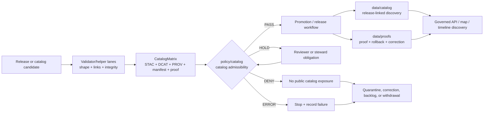

<!-- [KFM_META_BLOCK_V2]
doc_id: kfm://doc/NEEDS_VERIFICATION__policy_catalog_readme
title: policy/catalog
type: standard
version: v1
status: draft
owners: NEEDS_VERIFICATION
created: NEEDS_VERIFICATION__YYYY-MM-DD
updated: 2026-04-29
policy_label: NEEDS_VERIFICATION__public_or_internal
related: [../README.md, ../../README.md, ../../data/catalog/README.md, ../../data/catalog/dcat/README.md, ../../data/catalog/stac/README.md, ../../data/catalog/prov/README.md, ../../tools/catalog/README.md, ../../tests/catalog/README.md, ../../tests/policy/README.md, ../../contracts/README.md, ../../schemas/README.md, ../../data/proofs/README.md, ../../data/receipts/README.md, ../../data/published/README.md, ../../.github/workflows/README.md]
tags: [kfm, policy, catalog, catalog-closure, promotion, fail-closed]
notes: [Target leaf path and owner require live-repo verification. This README is a draft for the requested policy/catalog/README.md surface. It is grounded in KFM policy, catalog, proof, release, and README doctrine; validator entrypoints and merge-blocking enforcement remain NEEDS VERIFICATION.]
[/KFM_META_BLOCK_V2] -->

<a id="top"></a>

# policy/catalog

Catalog-specific policy lane for deciding whether KFM catalog candidates are complete, policy-safe, release-linked, and eligible to move toward governed publication.

> [!IMPORTANT]
> **Status:** `experimental / draft`  
> **Owners:** `NEEDS VERIFICATION`  
> **Path:** `policy/catalog/README.md`  
> **Repo fit:** child policy lane under [`../README.md`](../README.md); governs catalog-closure decisions that touch [`../../data/catalog/README.md`](../../data/catalog/README.md), [`../../tools/catalog/README.md`](../../tools/catalog/README.md), [`../../tests/catalog/README.md`](../../tests/catalog/README.md), [`../../contracts/README.md`](../../contracts/README.md), [`../../schemas/README.md`](../../schemas/README.md), and release/proof surfaces under [`../../data/proofs/README.md`](../../data/proofs/README.md) and [`../../data/published/README.md`](../../data/published/README.md).  
> **Quick jumps:** [Scope](#scope) · [Repo fit](#repo-fit) · [Accepted inputs](#accepted-inputs) · [Exclusions](#exclusions) · [Directory tree](#directory-tree) · [Quickstart](#quickstart) · [Usage](#usage) · [Decision grammar](#decision-grammar) · [Diagram](#diagram) · [Gate matrix](#gate-matrix) · [Task list](#task-list--definition-of-done) · [FAQ](#faq) · [Appendix](#appendix)


> [!CAUTION]
> This lane is **policy law for catalog admissibility**. It is not the home for catalog records, validators, schemas, proofs, releases, runtime routes, or UI behavior.

---

## Scope

`policy/catalog/` is where KFM should keep catalog-specific decision rules for **catalog closure**, **release linkage**, **rights visibility**, **lineage completeness**, and **public discovery admissibility**.

A catalog candidate is not safe just because it renders as STAC, DCAT, PROV, JSON-LD, YAML, or Markdown. KFM catalog policy should ask whether the outward metadata remains downstream of evidence, validation, review, release, proof, rollback, and correction state.

In practical terms, this lane decides questions like:

| Question | Policy burden |
|---|---|
| Can this STAC/DCAT/PROV candidate be treated as release-linked catalog metadata? | Require a release or release-candidate reference, source-role context, rights posture, and lineage linkage. |
| Can a catalog record become discoverable to public or semi-public clients? | Require policy-safe access class, sensitivity posture, review state, and no unresolved source-rights block. |
| Does a `CatalogMatrix` close across STAC, DCAT, PROV, manifest, proof, and published references? | Require all required cross-links or return a finite negative outcome. |
| Can catalog metadata point to a public asset, tile, layer, export, or story node? | Require public-safe geometry, release state, and correction/rollback target where the artifact is consequential. |
| Can a missing catalog field be tolerated? | Only when the policy bundle defines an obligation, review hold, or non-public classification. |

[Back to top](#top)

---

## Repo fit

This lane belongs under the parent KFM policy surface. It should consume validated inputs and return typed catalog policy decisions. It should not define the object model, run validators, store emitted catalog records, or publish artifacts.

| Direction | Surface | Relationship |
|---|---|---|
| Parent | [`../README.md`](../README.md) | Defines repo-wide policy posture: deny by default, finite outcomes, rights/sensitivity/review/release seams. |
| Root | [`../../README.md`](../../README.md) | Project orientation and trust-path navigation. |
| Catalog records | [`../../data/catalog/README.md`](../../data/catalog/README.md) | Stores outward DCAT/STAC/PROV catalog records; policy/catalog only decides admissibility. |
| Catalog helpers | [`../../tools/catalog/README.md`](../../tools/catalog/README.md) | Runs QA/cross-link/helper checks; policy/catalog consumes check results when policy-ready. |
| Catalog tests | [`../../tests/catalog/README.md`](../../tests/catalog/README.md) | Proves catalog-closure behavior and mismatch cases. |
| Policy tests | [`../../tests/policy/README.md`](../../tests/policy/README.md) | Proves deny-by-default and finite policy behavior. |
| Meaning | [`../../contracts/README.md`](../../contracts/README.md) | Defines semantics for `CatalogMatrix`, `ReleaseManifest`, `ProofPack`, `EvidenceBundle`, and related objects. |
| Shape | [`../../schemas/README.md`](../../schemas/README.md) | Defines machine-checkable structures consumed by validators and policy. |
| Release evidence | [`../../data/proofs/README.md`](../../data/proofs/README.md) | Carries proof packs, rollback cards, correction traces, and release-significant evidence. |
| Process memory | [`../../data/receipts/README.md`](../../data/receipts/README.md) | Carries receipts and validation reports that may support policy decisions but do not replace them. |
| Publication | [`../../data/published/README.md`](../../data/published/README.md) | Holds published/release-state artifacts after governed promotion. |
| Orchestration | [`../../.github/workflows/README.md`](../../.github/workflows/README.md) | May call policy bundles; workflow presence is not policy law. |

> [!WARNING]
> Do not use `policy/catalog/` to resolve `contracts/` versus `schemas/` ambiguity by duplication. Contracts define meaning. Schemas define shape. Validators verify. Policy decides.

[Back to top](#top)

---

## Accepted inputs

`policy/catalog/` should stay compact, typed, and decision-oriented.

| Accepted input | Belongs here when… | Example shape |
|---|---|---|
| Catalog policy modules | They decide catalog admissibility, closure, visibility, or obligations. | `catalog_closure.rego`, `catalog_visibility.rego` |
| Policy bundle metadata | It describes policy package identity, imports, version, and review expectations. | `bundle.yaml` |
| Reason-code maps | Codes are stable enough for tests, UI explanation, receipts, and review. | `reason_codes.yaml` |
| Obligation-code maps | Catalog policy can require review, redaction, cross-link repair, or release linkage. | `obligations.yaml` |
| Tiny illustrative examples | They clarify a rule without becoming executable fixture authority. | inline snippets in README |
| Review notes | They explain catalog-specific steward expectations and burden. | `REVIEW_NOTES.md` if later verified |

### Accepted catalog decision inputs

Catalog policy should normally consume already validated objects such as:

- `CatalogMatrix` or equivalent catalog-closure summary
- STAC/DCAT/PROV validation result objects
- release-manifest reference and digest summary
- proof-pack reference and proof status
- source-rights and source-role summary
- sensitivity/redaction/public-geometry summary
- correction or rollback reference
- reviewer/steward status
- validation reports from `tools/catalog/` or `tools/validators/`

[Back to top](#top)

---

## Exclusions

| Does **not** belong here | Goes instead | Why |
|---|---|---|
| STAC, DCAT, or PROV records | [`../../data/catalog/`](../../data/catalog/) | Catalog metadata is emitted data, not policy law. |
| Catalog cross-link scripts | [`../../tools/catalog/`](../../tools/catalog/) | Tools inspect and summarize; policy decides. |
| Executable catalog fixtures | [`../../tests/catalog/`](../../tests/catalog/) or [`../../tests/policy/`](../../tests/policy/) | Fixtures prove behavior and should stay in test lanes. |
| JSON Schemas or OpenAPI contracts | [`../../schemas/`](../../schemas/) and [`../../contracts/`](../../contracts/) | Shape and meaning should not drift into policy bundles. |
| Release manifests and proof packs as primary artifacts | [`../../data/proofs/`](../../data/proofs/), [`../../data/published/`](../../data/published/), or `release/` after repo verification | Proof and publication objects remain distinct from policy. |
| Receipts and run logs | [`../../data/receipts/`](../../data/receipts/) | Receipts preserve process memory; they do not decide admissibility. |
| RAW, WORK, QUARANTINE, or PROCESSED payloads | [`../../data/`](../../data/) lifecycle lanes | Policy governs movement and exposure; it is not canonical storage. |
| API handlers or UI conditionals | `../../apps/` and `../../packages/` after repo verification | Runtime enforcement consumes policy; it should not hide policy law. |
| Secrets, keys, tokens, credentials, `.env` files | host secret manager or deployment configuration | Policy lanes must remain safe for public or semi-public review. |
| Direct model output or generated narrative | governed runtime envelopes and evidence bundles | AI is interpretive only; catalog policy does not publish model language. |

[Back to top](#top)

---

## Directory tree

### Current target state

NEEDS VERIFICATION: this target leaf was requested for creation or revision, but the current mounted workspace did not expose a KFM checkout. Re-run the repo inventory commands before treating this tree as existing branch reality.

### Proposed starter shape

```text
policy/catalog/
├── README.md
├── bundle.yaml                  # PROPOSED: catalog policy bundle metadata
├── catalog_closure.rego          # PROPOSED: STAC/DCAT/PROV closure and required-link rules
├── catalog_matrix.rego           # PROPOSED: CatalogMatrix completeness and cross-reference rules
├── catalog_visibility.rego       # PROPOSED: public/semi-public discovery rules
├── catalog_rights.rego           # PROPOSED: source-rights and publication-intent gates
├── catalog_correction.rego       # PROPOSED: supersession, withdrawal, rollback visibility
├── obligations.yaml              # PROPOSED: stable obligation code registry
└── reason_codes.yaml             # PROPOSED: stable reason code registry
```

> [!NOTE]
> This proposed tree is seam-led, not tool-led. Keep the catalog decision seam stable even if the repo later standardizes on a different policy runner or package layout.

[Back to top](#top)

---

## Quickstart

Run these from the repository root before editing or reviewing this lane.

### 1. Confirm the target path and parent policy lane

```bash
git status --short
git branch --show-current
git rev-parse --show-toplevel

find policy -maxdepth 4 \( -type f -o -type d \) 2>/dev/null | sort
sed -n '1,240p' policy/README.md 2>/dev/null || true
sed -n '1,220p' .github/CODEOWNERS 2>/dev/null || true
```

### 2. Inspect catalog-adjacent authority surfaces

```bash
find data/catalog tools/catalog tests/catalog tests/policy contracts schemas data/proofs data/receipts data/published \
  -maxdepth 3 \( -type f -o -type d \) 2>/dev/null \
  | sort \
  | sed -n '1,320p'
```

### 3. Check whether policy tooling exists before claiming enforcement

```bash
command -v opa >/dev/null && opa version || echo "OPA not installed or not on PATH"
command -v conftest >/dev/null && conftest --version || echo "Conftest not installed or not on PATH"

find policy/catalog -type f \
  \( -name '*.rego' -o -name 'bundle.yaml' -o -name 'bundle.yml' -o -name '*policy*.json' \) \
  2>/dev/null | sort
```

### 4. Proposed catalog policy check

NEEDS VERIFICATION: use only after the repo confirms policy tooling, input paths, and expected bundle shape.

```bash
# Proposed only: adapt paths and runner to the verified repo conventions.
conftest test data/catalog --policy policy/catalog
```

### 5. README sanity check

```bash
python - <<'PY'
from pathlib import Path

p = Path("policy/catalog/README.md")
text = p.read_text(encoding="utf-8")

checks = {
    "has_meta_block": "[KFM_META_BLOCK_V2]" in text and "[/KFM_META_BLOCK_V2]" in text,
    "has_scope": "## Scope" in text,
    "has_repo_fit": "## Repo fit" in text,
    "has_accepted_inputs": "## Accepted inputs" in text,
    "has_exclusions": "## Exclusions" in text,
    "has_directory_tree": "## Directory tree" in text,
    "has_diagram": "```mermaid" in text,
    "has_definition_of_done": "## Task list / definition of done" in text,
    "has_needs_verification": "NEEDS VERIFICATION" in text,
}

for name, ok in checks.items():
    print(f"{name}: {'PASS' if ok else 'FAIL'}")

raise SystemExit(0 if all(checks.values()) else 1)
PY
```

[Back to top](#top)

---

## Usage

Use `policy/catalog/` when a change needs to answer catalog-admissibility questions in a repeatable, testable way.

### Typical review sequence

1. Validate candidate catalog records and cross-links in the validator/helper lanes.
2. Assemble or reference the `CatalogMatrix`.
3. Confirm release-manifest, proof-pack, evidence, and rollback references.
4. Run catalog policy rules against structured inputs.
5. Emit a finite decision with reason codes and obligations.
6. Keep positive and negative behavior covered in `tests/catalog/` or `tests/policy/`.
7. Do not promote public discovery until catalog policy and the broader promotion gate agree.

### Minimal policy input sketch

Illustrative only. Keep executable schemas and fixtures in the verified schema/test lanes.

```json
{
  "candidate_id": "catalog-candidate-NEEDS-VERIFICATION",
  "surface": "catalog",
  "catalog_matrix_ref": "data/catalog/example/catalog_matrix.json",
  "release_manifest_ref": "data/published/example/manifests/release.json",
  "proof_pack_ref": "data/proofs/example/proof_pack.json",
  "evidence_bundle_refs": ["evidence:example-001"],
  "catalog_records": {
    "stac": "present",
    "dcat": "present",
    "prov": "present"
  },
  "rights": {
    "status": "public_allowed",
    "source_terms_verified": true
  },
  "sensitivity": {
    "public_geometry_class": "generalized",
    "redaction_receipt_ref": "data/proofs/example/redaction_receipt.json"
  },
  "review": {
    "state": "approved",
    "review_record_ref": "data/proofs/example/review_record.json"
  },
  "correction": {
    "rollback_ref": "data/proofs/example/rollback_card.json"
  }
}
```

[Back to top](#top)

---

## Decision grammar

Catalog policy uses **gate/review outcomes**, not runtime answer outcomes.

| Outcome | Meaning | Typical downstream action |
|---|---|---|
| `PASS` | Catalog candidate satisfies policy for the stated audience and release class. | Continue to promotion/release workflow. |
| `HOLD` | Candidate may be valid but needs review, missing non-fatal obligation resolution, or steward decision. | Block promotion until obligations are satisfied. |
| `DENY` | Candidate violates rights, sensitivity, evidence, release, rollback, or catalog-closure requirements. | Do not publish; route to correction, quarantine, or backlog. |
| `ERROR` | Policy bundle, input structure, or required dependency failed unexpectedly. | Stop and record failure; do not infer a permissive result. |

> [!IMPORTANT]
> `ANSWER`, `ABSTAIN`, `DENY`, and `ERROR` belong to runtime/public response envelopes. `PASS`, `HOLD`, `DENY`, and `ERROR` belong to policy gate evaluation. Do not flatten these surfaces.

### Starter reason-code families

| Family | Example codes |
|---|---|
| Catalog closure | `catalog_matrix_missing`, `stac_record_missing`, `dcat_record_missing`, `prov_record_missing`, `catalog_crosslink_open` |
| Release | `release_manifest_missing`, `release_digest_missing`, `rollback_target_missing`, `published_ref_unresolved` |
| Proof | `proof_pack_missing`, `signature_bundle_missing`, `review_record_missing`, `evidence_bundle_unresolved` |
| Rights | `source_terms_unverified`, `rights_not_public`, `license_missing`, `access_class_mismatch` |
| Sensitivity | `sensitivity_unknown`, `redaction_receipt_missing`, `exact_sensitive_geometry`, `steward_review_required` |
| Correction | `supersession_target_missing`, `withdrawal_not_propagated`, `correction_notice_missing` |
| Policy runtime | `policy_input_invalid`, `policy_bundle_unavailable`, `non_finite_policy_outcome` |

### Starter obligation families

| Obligation | Use when… |
|---|---|
| `complete_catalog_triplet` | STAC, DCAT, or PROV branch is missing or not cross-linked. |
| `attach_release_manifest` | Catalog record points outward without release-manifest context. |
| `attach_proof_pack` | Release-significant discovery lacks proof-pack reference. |
| `verify_source_rights` | Source terms or publication intent is unresolved. |
| `generalize_or_redact_geometry` | Public catalog metadata could expose sensitive exact locations. |
| `obtain_steward_review` | The candidate requires domain, cultural, infrastructure, privacy, or sensitive-species review. |
| `add_rollback_target` | Public discovery could change without a visible rollback path. |

[Back to top](#top)

---

## Diagram



> [!CAUTION]
> A complete-looking catalog record is not proof of publication safety. KFM safety comes from closed evidence, release, rights, sensitivity, review, rollback, and correction links.

[Back to top](#top)

---

## Gate matrix

| Gate | Required catalog-policy question | Expected negative outcome |
|---|---|---|
| Schema/link validation | Did the candidate pass schema and cross-link checks before policy evaluated it? | `ERROR` for malformed input; `HOLD` for missing validator report if reviewable. |
| Catalog triplet | Are STAC, DCAT, and PROV present where required and cross-linked to the same release scope? | `HOLD` or `DENY` with `catalog_crosslink_open`. |
| Release linkage | Does the catalog candidate point to a release manifest or release-candidate manifest? | `DENY` for public discovery without release linkage. |
| Proof linkage | Does release-significant catalog metadata point to proof-pack, evidence, review, and digest references? | `HOLD` if incomplete; `DENY` if public exposure would be unsupported. |
| Rights | Are source terms, access class, license, and publication intent explicit? | `DENY` when rights are missing or not public-safe. |
| Sensitivity | Is exact-location, cultural, infrastructure, living-person, DNA, rare-species, or steward-controlled exposure handled? | `DENY` or `HOLD`; public output requires redaction/generalization where needed. |
| Correction/rollback | Does the candidate preserve rollback target and correction/supersession route? | `HOLD` or `DENY` if public alias could change silently. |
| Audience fit | Is the intended audience public, restricted, steward-only, or internal? | `DENY` when access class and audience conflict. |

[Back to top](#top)

---

## Task list / definition of done

A `policy/catalog/` change is ready for review when it strengthens catalog decision clarity without weakening KFM’s trust membrane.

- [ ] Target path and owner are verified in the live repository.
- [ ] The changed rule names the seam it protects: catalog closure, rights, sensitivity, release, proof, correction, or audience fit.
- [ ] Rule inputs are schema-valid or the test intentionally exercises invalid input.
- [ ] New policy emits finite outcomes only: `PASS`, `HOLD`, `DENY`, or `ERROR`.
- [ ] Reason codes are stable enough to test.
- [ ] Obligations are explicit when a candidate can be held rather than denied.
- [ ] Unknown rights and unknown sensitivity fail closed.
- [ ] Public catalog exposure requires release linkage, proof linkage, and rollback/correction support.
- [ ] Executable fixtures live in `tests/catalog/` or `tests/policy/`, not hidden inside the policy directory.
- [ ] Catalog records stay in `data/catalog/`; helper scripts stay in `tools/catalog/`.
- [ ] No policy file contains secrets, tokens, source-native dumps, raw payloads, or unpublished candidate data.
- [ ] Documentation uses truth labels where implementation maturity could be overstated.
- [ ] Any claim of merge-blocking or runtime enforcement is backed by workflow/test evidence.
- [ ] Rollback is simple: revert policy bundle changes and keep candidate artifacts unpublished.

[Back to top](#top)

---

## FAQ

### Is `policy/catalog/` the same thing as `data/catalog/`?

No. `data/catalog/` stores outward catalog metadata such as DCAT, STAC, and PROV records. `policy/catalog/` decides whether catalog candidates are admissible for a stated release/audience posture.

### Can catalog policy repair missing STAC/DCAT/PROV links?

No. Policy can return `HOLD`, `DENY`, or obligations. Repair belongs to catalog helper tools, emitters, or the candidate-producing lane.

### Can a catalog record be public if the proof pack is missing?

Not for release-significant public discovery. KFM treats proof, catalog, release, evidence, and correction state as separate but linked trust surfaces.

### Should `policy/catalog/` contain test fixtures?

Keep executable fixtures in `tests/catalog/` or `tests/policy/`. Tiny examples may appear in this README only as documentation.

### What happens when catalog input is incomplete?

Fail closed. Use `HOLD` for reviewable missing obligations, `DENY` for unsafe or rights-blocked exposure, and `ERROR` for malformed or unavailable policy inputs.

[Back to top](#top)

---

## Appendix

<details>
<summary>Glossary</summary>

| Term | Meaning in this lane |
|---|---|
| `CatalogMatrix` | Machine-checkable closure summary across catalog records, release/proof references, evidence, and published artifacts. |
| `STAC` | Spatial/temporal asset catalog shape for geospatial assets where appropriate. |
| `DCAT` | Dataset/distribution catalog vocabulary for outward dataset discovery. |
| `PROV` | Provenance model for entities, activities, agents, derivations, and lineage. |
| `ReleaseManifest` | Release object describing published artifact inventory, digests, review/policy state, and rollback target. |
| `ProofPack` | Release-significant proof bundle with validation, evidence, review, signatures/attestations where supported, and closure references. |
| `EvidenceBundle` | Runtime-resolvable evidence support for claims and Evidence Drawer payloads. |
| `CorrectionNotice` | Visible supersession, withdrawal, or correction record for published claims or artifacts. |
| `RollbackReference` | Versioned target or card describing how a published alias or release state can be reversed without silent replacement. |
| `HOLD` | Gate outcome meaning the candidate is blocked pending obligations or review, not yet denied permanently. |

</details>

<details>
<summary>Reviewer checklist for first implementation PR</summary>

- Confirm whether `policy/catalog/` already exists on the target branch.
- Confirm owner or CODEOWNERS coverage for `policy/catalog/`.
- Confirm whether repo policy tooling uses OPA/Rego, Conftest, another runner, or a wrapper.
- Confirm whether `CatalogMatrix`, `ReleaseManifest`, `ProofPack`, and `EvidenceBundle` have settled contracts/schemas.
- Confirm where policy fixtures should live.
- Add one positive and one negative catalog policy example.
- Run link checks from this README after the target branch is mounted.
- Avoid adding live publication behavior in the same PR as the README/policy skeleton.

</details>

[Back to top](#top)
