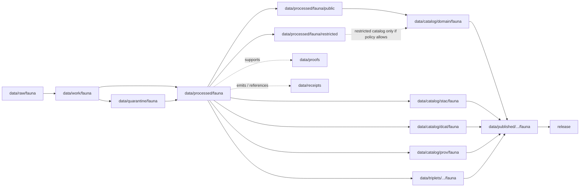

<!-- [KFM_META_BLOCK_V2]
doc_id: kfm://doc/data-processed-fauna-readme
title: data/processed/fauna/README.md — Fauna Processed Data README
version: v0.1
type: readme; data-lifecycle-domain-lane; processed-stage-guide; fauna-domain-root; deny-by-default-lane-index
status: draft; PROPOSED; data-root; processed-stage; fauna; sensitivity-aware; geoprivacy-gated; deny-by-default; release-gated; evidence-first
authors: ChatGPT-5.5 Thinking; reviewed_by: OWNER_TBD
owners: OWNER_TBD — Fauna steward · Sensitivity reviewer · Rights-holder representative · Data steward · Pipeline steward · Evidence steward · Policy steward · Release steward · Docs steward
created: NEEDS VERIFICATION — greenfield stub existed before v0.1 expansion
updated: 2026-06-25
policy_label: public-doc; data; processed; fauna; lifecycle; governed; geoprivacy; deny-by-default; release-gated
tags: [kfm, data, processed, fauna, taxonomy, occurrence, range, monitoring, sensitive-sites, invasive-species, geoprivacy, public-candidate, restricted, RedactionReceipt, AggregationReceipt, ReviewRecord, PolicyDecision, ReleaseManifest, EvidenceBundle, SourceDescriptor, RAW, WORK, QUARANTINE, PROCESSED, CATALOG, TRIPLET, PUBLISHED]
related:
  - ../README.md
  - ../../README.md
  - ../../../docs/domains/fauna/README.md
  - ../../../docs/domains/fauna/SENSITIVITY.md
  - ../../../docs/adr/ADR-0010-deny-by-default-for-dna-rare-species-archaeology-infrastructure.md
  - ../../../policy/domains/fauna/
  - ../../../policy/sensitivity/fauna/
  - ../../../contracts/domains/fauna/
  - ../../../schemas/contracts/v1/domains/fauna/
  - ../../raw/fauna/
  - ../../work/fauna/
  - ../../quarantine/fauna/
  - ../../catalog/domain/fauna/
  - ../../catalog/stac/fauna/
  - ../../catalog/dcat/fauna/
  - ../../catalog/prov/fauna/
  - ../../triplets/
  - ../../published/
  - ../../proofs/
  - ../../receipts/
  - ../../registry/sources/fauna/
  - ../../../release/candidates/fauna/
  - ../../../release/
  - ../../../pipelines/domains/fauna/
  - ../../../tools/validators/
  - public/README.md
  - public/occurrences_generalized/README.md
  - restricted/README.md
  - restricted/occurrences/README.md
  - restricted/range_exact/README.md
  - restricted/sensitive_sites/README.md
notes:
  - "This file replaces a greenfield stub at `data/processed/fauna/README.md`."
  - "This is the parent PROCESSED-stage domain lane for Fauna artifacts. It is not RAW source storage, WORK scratch, QUARANTINE holding, CATALOG, TRIPLET, PUBLISHED, proof storage, source registry, policy authority, release authority, public API/UI output, public map/tile output, or operational wildlife guidance."
  - "Fauna processed artifacts must preserve source role, rights, sensitivity tier/rank, geoprivacy posture, evidence linkage, transform/review/policy receipt linkage, catalog readiness, release state, correction path, and rollback target before any public use."
  - "Sensitivity is the Fauna lane anchor invariant: unresolved sensitivity, rights, review state, or access basis fails closed."
  - "Public-candidate and restricted child lanes are not publication paths. Public clients must use governed APIs, released artifacts, catalog/triplet records, and EvidenceBundle-backed policy-safe payloads, not this directory directly."
  - "This README is a parent lane guide and index. Child lane READMEs define local sublane boundaries; contracts define semantic object meaning; schemas define machine shape; policy decides admissibility; release records decide publication."
  - "Rollback target for this expansion is previous greenfield stub blob SHA `9273e91030ba07cbb3b3ce1a6786d7f909f2c11b`."
[/KFM_META_BLOCK_V2] -->

<a id="top"></a>

# data/processed/fauna

> Parent Fauna PROCESSED-stage lane for normalized, source-traced, sensitivity-aware animal taxonomy, occurrence, range, monitoring, sensitive-site, invasive-species, geoprivacy, public-candidate, and restricted artifacts that have passed beyond RAW/WORK/QUARANTINE but are not yet cataloged, triplet-projected, published, or released.

<p>
  
  
  
  
  
  
</p>

**Status:** draft / PROPOSED  
**Owners:** OWNER_TBD — Fauna steward · Sensitivity reviewer · Rights-holder representative · Data steward · Pipeline steward · Evidence steward · Policy steward · Release steward · Docs steward  
**Path:** `data/processed/fauna/README.md`  
**Owning root:** `data/processed/`  
**Domain segment:** `fauna`  
**Lifecycle stage:** `PROCESSED`  
**Exposure posture:** not public by default; any public use requires governed catalog, evidence, sensitivity policy, rights posture, review state, redaction/aggregation receipt where applicable, PolicyDecision, ReleaseManifest, correction path, and rollback target.  
**Truth posture:** CONFIRMED target was a greenfield stub · CONFIRMED parent `data/processed/` is upstream of catalog/triplet/publication and is not a normal public surface · CONFIRMED Fauna domain governs taxonomy, occurrences, ranges, monitoring, sensitive sites, invasive species, geoprivacy, public-safe derivatives, and governed API surfaces · CONFIRMED Fauna sensitivity doctrine is deny-by-default/fail-closed for sensitive locations and unresolved rights/review state · PROPOSED parent-lane details and child-lane index · NEEDS VERIFICATION for actual child inventory, validators, fixtures, access-control enforcement, receipt families, policy enforcement, release linkage, and governed route behavior.

**Quick jumps:** [Purpose](#purpose) · [Lifecycle boundary](#lifecycle-boundary) · [Repo fit](#repo-fit) · [Lane index](#lane-index) · [Accepted contents](#accepted-contents) · [Exclusions](#exclusions) · [Fauna processed requirements](#fauna-processed-requirements) · [Sensitivity guardrails](#sensitivity-guardrails) · [Evidence ledger](#evidence-ledger) · [Validation checklist](#validation-checklist) · [Rollback](#rollback)

---

## Purpose

`data/processed/fauna/` is the parent PROCESSED-stage lane for normalized Fauna artifacts. It organizes processed outputs after source capture, extraction, transformation, identity reconciliation, geoprivacy handling, QA, redaction, aggregation, or review-oriented normalization, while keeping those artifacts upstream of catalog, triplet, publication, release, proof closure, and public access.

This lane may contain or point to processed artifacts for:

- animal taxonomic identity and status context;
- occurrence and monitoring evidence;
- exact, restricted, generalized, or public-candidate occurrence derivatives;
- range polygons, seasonal ranges, migration corridors, and range summaries;
- sensitive sites such as nests, dens, roosts, hibernacula, spawning sites, breeding sites, and aggregation sites;
- invasive species public-reporting candidates with landowner/private-parcel safeguards;
- redaction, aggregation, withholding, embargo, and geoprivacy-derived processed outputs;
- restricted reviewer-only, named-agreement, rights-holder-controlled, steward-controlled, or denied/internal-review artifacts.

This parent README does not create a semantic contract, schema, validator, source registry, proof, receipt, policy decision, release decision, public map layer, public tile, public API route, public UI payload, enforcement aid, operational wildlife guidance, or life-safety product.

## Lifecycle boundary

```text
RAW -> WORK / QUARANTINE -> PROCESSED -> CATALOG / TRIPLET -> PUBLISHED
```



`data/processed/fauna/` is upstream of catalog, triplet, publication, and release. It must not be used as a normal public map/API/UI/AI source.

## Repo fit

| Responsibility | Correct home | Rule |
|---|---|---|
| Raw observations, source-native files, source exports, steward originals, source media, source logs, original exact geometry, or source identifiers | `data/raw/fauna/` | Not this lane. |
| In-process transforms, joins, geoprivacy work, QA, reconciliation, redaction trials, notebooks, scratch outputs, or method experiments | `data/work/fauna/` | Not this lane. |
| Unresolved sensitive, rights-unclear, source-role-unclear, malformed, disputed, unsafe, or not-yet-reviewed fauna material | `data/quarantine/fauna/` | Not this lane until review/admission allows. |
| Normalized Fauna processed artifacts | `data/processed/fauna/` | This parent lane and child lanes. |
| Public-candidate processed fauna artifacts | `data/processed/fauna/public/` | Still not published; release-gated. |
| Restricted processed fauna artifacts | `data/processed/fauna/restricted/` | Non-public, access-controlled, fail-closed. |
| Fauna catalog records | `data/catalog/domain/fauna/` | Downstream catalog stage. |
| Fauna STAC/DCAT/PROV records | `data/catalog/{stac,dcat,prov}/fauna/` | Downstream catalog projections if accepted. |
| Fauna triplet/graph records | `data/triplets/.../fauna/` | Downstream graph stage; must not expose restricted geometry or unsafe joins. |
| Published public-safe fauna products | `data/published/.../fauna/` | Downstream only after release. |
| EvidenceBundle/proof records | `data/proofs/` | Separate proof family. |
| Source, run, transform, redaction, aggregation, validation, policy, correction, access, and release receipts | `data/receipts/` | Separate receipt family. |
| Fauna source registry records | `data/registry/sources/fauna/` | Separate source authority. |
| Release candidates and release manifests | `release/candidates/fauna/`, `release/` | Separate publication authority. |
| Fauna contracts | `contracts/domains/fauna/` | Object meaning; not data. |
| Fauna schemas | `schemas/contracts/v1/domains/fauna/` | Machine shape; not data. |
| Fauna policy and sensitivity rules | `policy/domains/fauna/`, `policy/sensitivity/fauna/` | Admissibility authority; not data. |
| Validators, tests, fixtures, pipelines, apps, packages | `tools/validators/`, `tests/`, `fixtures/`, `pipelines/`, `apps/`, `packages/` | Separate roots. |

## Lane index

Known or intended child lanes under `data/processed/fauna/` are listed below. Treat entries as **PROPOSED** unless current child READMEs, validators, fixtures, policies, receipts, access controls, and CI enforcement have been verified in the same implementation pass.

| Lane | Family | Purpose | Hard boundary |
|---|---|---|---|
| `public/` | Public-candidate processed fauna | Candidate public-safe, generalized, aggregated, non-sensitive, or release-review-ready artifacts. | `public/` means public-candidate, not published or released. |
| `public/occurrences_generalized/` | Generalized occurrence candidates | Geoprivacy-transformed occurrence derivatives. | Generalized does not mean public-approved; exact sensitive data stays out. |
| `restricted/` | Restricted processed fauna | Reviewer-only, named-agreement, rights-holder controlled, steward-controlled, or denied/internal-review processed artifacts. | Non-public, access-controlled, fail-closed. |
| `restricted/occurrences/` | Restricted occurrence records | Exact/sensitive/steward-controlled occurrence artifacts for review/correction/transform planning. | Not public-candidate; no direct public map/API/UI use. |
| `restricted/range_exact/` | Restricted exact range artifacts | Raw/exact range polygons, seasonal ranges, corridors, high-resolution range geometry. | Raw exact range geometry is denied for public exposure; public-safe derivatives need aggregation/generalization and receipts. |
| `restricted/sensitive_sites/` | Restricted sensitive-site records | Nests, dens, roosts, hibernacula, spawning sites, breeding/aggregation sites, and comparable records. | Exact site geometry is T4 by default; T2/T3 access requires review/policy/agreement. |

## Accepted contents

Processed Fauna data may include:

- normalized tabular, spatial, temporal, textual, raster, vector, graph-ready, or review-ready fauna artifacts;
- source-role-tagged occurrence, range, monitoring, sensitive-site, invasive-species, or public-safe derivative candidates;
- redacted, generalized, aggregated, withheld, delayed-publication, or suppressed derivatives that still require catalog/release review before public use;
- restricted reviewer-only, named-agreement, rights-holder controlled, steward-controlled, or denied/internal-review processed artifacts admitted by policy;
- sidecar metadata needed to interpret processed artifacts when it is not a receipt, proof, policy decision, release manifest, source registry record, schema, validator, or catalog record;
- lane-local README or manifest notes that explain processed-data boundaries without becoming public outputs or authority records.

## Exclusions

Do not store these under `data/processed/fauna/`:

- RAW source files, source-native downloads, steward originals, source media, logs, original exact geometries, source identifiers, or unprocessed agency/partner exports.
- WORK/scratch files, notebooks, transform experiments, unresolved QA joins, geoprivacy trials, or redaction-debug outputs.
- Quarantined or unresolved sensitive/rights/source-role material.
- Catalog records, STAC/DCAT/PROV records, triplet/graph records, published products, proof records, receipt records, source registry records, release decisions, schemas, policy rules, validators, tests, fixtures, pipelines, app/UI/API code, or packages.
- Public API/UI/tile payloads, direct downloads, Focus Mode answers, public map layers, enforcement aids, landowner/parcel targeting aids, hunting/fishing/legal advice, operational wildlife guidance, emergency alerts, or life-safety guidance.
- Redaction parameters, aggregation thresholds, small-cell thresholds, fuzzing radii, seeds, exact transform offsets, access credentials, secrets, private agreement terms, field access routes, or implementation details that could aid exposure or unauthorized access.
- AI-generated species narratives presented as authoritative without EvidenceBundle support and validated citations.

## Fauna processed requirements

PROPOSED until concrete validators, policies, fixtures, receipts, and access-control enforcement are verified:

| Requirement | Meaning |
|---|---|
| Source trace | Each source-derived artifact should trace to SourceDescriptor or fauna source registry context. |
| Evidence linkage | Claims about taxon, occurrence, range, site, monitoring, source, transform, review, or release readiness should resolve downstream to EvidenceBundle/proof context where appropriate. |
| Sensitivity posture | Each artifact should carry sensitivity tier/rank, denied/reviewer/restricted/generalized/open posture, and unresolved-sensitivity behavior. |
| Rights posture | Steward, agency, license, landowner, sovereignty, research, consent, observer, media, and reuse rights should be resolved or held closed. |
| Transform linkage | Redaction, aggregation, suppression, withholding, embargo, delayed publication, or public-safe generalization should link to the appropriate receipt family. |
| Review state | Sensitivity reviewer, fauna steward, rights-holder representative, access-control reviewer, and release authority review should be recorded where required. |
| Policy decision | Restricted, public-candidate, and public transitions require PolicyDecision/admissibility posture where policy requires it. |
| Re-identification check | Joins with habitat, hydrology, infrastructure, parcel, people, source, media, method, time, rare taxa, small ranges, or small cells must be checked before any transition. |
| Catalog readiness | Processed fauna artifacts intended for discovery should promote through catalog/triplet lanes, not directly to public use. |
| Release readiness | Public use requires ReleaseManifest or release-linked state, published output path, correction path, and rollback target. |
| No public surface by default | Processed fauna artifacts must not be exposed directly as public maps, tiles, APIs, downloads, Focus Mode answers, or AI-answer sources. |

## Sensitivity guardrails

- Sensitivity is the Fauna lane anchor invariant.
- Sensitive taxa, sensitive occurrence geometry, nests, dens, roosts, hibernacula, spawning sites, steward-controlled records, exact range geometry, and re-identifying joins fail closed by default.
- Source quality never overrides sensitivity, rights, access, or review state.
- Existence may be releasable without exact geometry only when steward review permits.
- T2 reviewer-only data must stay authenticated, role-gated, policy-bounded, and correction-path active.
- T3 named-agreement data must stay limited to named authorized parties under recorded agreement.
- T4 denied data must not be released to any audience unless a governed transition permits a safer representation.
- T1 generalized data is public-safe only after transform review and recorded receipts; it is not automatically T0/open.
- T0 open data still requires standard release path, ReleaseManifest, ReviewRecord, correction path, and rollback target before public exposure.
- Do not silently merge sensitivity tier T0–T4 with `sensitivity_rank` 0–5; both may exist but canonical persistence remains a verification item.
- Do not publish transform parameters, thresholds, radii, seeds, offsets, secrets, credentials, private agreement terms, site identifiers, or access routes.
- Habitat, hydrology, infrastructure, parcel, people, source, media, method, occurrence, range, season, and time joins can make otherwise safer fauna data sensitive.
- Public clients and Focus Mode must use governed APIs, released artifacts, catalog/triplet records, EvidenceBundle-backed payloads, and policy-safe envelopes, not this directory directly.

> [!CAUTION]
> Do not expose `data/processed/fauna/` directly as a public map, tile service, API, UI, download, Focus Mode answer, AI answer source, species-location service, landowner/parcel targeting aid, enforcement surface, or operational wildlife guidance. Processed fauna data remains inside the trust membrane until governed promotion and release.

## Evidence ledger

| Source | Status | Supports | Limits |
|---|---|---|---|
| Previous file | CONFIRMED | Target existed as a greenfield stub. | Did not define Fauna processed boundaries or child lanes. |
| `data/processed/README.md` | CONFIRMED | PROCESSED data is upstream of catalog, triplets, publication, and release and is not the normal public surface. | Does not prove Fauna child inventory or enforcement. |
| `docs/domains/fauna/README.md` | CONFIRMED doctrine / PROPOSED implementation | Fauna governs taxonomy, occurrence, monitoring evidence, ranges, migration, sensitive sites, mortality, disease, invasive species, geoprivacy, public-safe derivatives, and governed API surfaces. | Implementation maturity remains NEEDS VERIFICATION. |
| `docs/domains/fauna/SENSITIVITY.md` | CONFIRMED doctrine / PROPOSED implementation | Fauna is deny-by-default/fail-closed; sensitive locations create real-world harm; tiers T0–T4 and geoprivacy transforms are defined at doctrine level. | Binding decisions live in `policy/sensitivity/fauna/`; concrete parameters are deliberately not in docs. |
| `data/processed/fauna/public/README.md` | CONFIRMED child README | Public lane is public-candidate only and not published release. | Does not authorize public release. |
| `data/processed/fauna/restricted/README.md` | CONFIRMED child README | Restricted lane is non-public, access-controlled, and requires governed transition for public-safe derivatives. | Does not prove access-control enforcement. |
| `data/processed/fauna/restricted/occurrences/README.md` | CONFIRMED child README | Restricted occurrence lane separates exact/sensitive occurrence records from public-candidate derivatives. | Does not prove occurrence validators. |
| `data/processed/fauna/restricted/range_exact/README.md` | CONFIRMED child README | Restricted exact range lane separates raw/exact range geometry from public-safe generalized products. | Does not prove range validators. |
| `data/processed/fauna/restricted/sensitive_sites/README.md` | CONFIRMED child README | Restricted sensitive-site lane separates exact site records from public-safe generalized/suppressed products. | Does not prove sensitive-site validators. |
| `policy/sensitivity/fauna/` | NEEDS VERIFICATION | Binding admissibility home named by Fauna docs. | Current policy files and enforcement were not verified in this task. |
| `contracts/domains/fauna/` and `schemas/contracts/v1/domains/fauna/` | NEEDS VERIFICATION | Expected object contract/schema homes. | Specific object files and validators were not verified in this task. |

## Validation checklist

- [ ] Confirm actual child directories under `data/processed/fauna/` and reconcile missing, duplicate, alias, legacy, or compatibility lanes.
- [ ] Confirm accepted processed Fauna path convention for parent, public-candidate, restricted, occurrence, range, and sensitive-site lanes.
- [ ] Confirm each child lane has README, owner, purpose, accepted contents, exclusions, guardrails, validation checklist, and rollback target.
- [ ] Confirm Fauna object contracts and schema paths for occurrence, range, sensitive-site, invasive-species, monitoring, public-candidate, and restricted artifacts.
- [ ] Confirm sensitivity tier/rank representation and canonical vocabulary.
- [ ] Confirm validators, fixtures, CI checks, policy checks, and access-control enforcement for processed fauna artifacts.
- [ ] Confirm SourceDescriptor/source registry linkage for source-derived artifacts.
- [ ] Confirm RedactionReceipt, AggregationReceipt, ReviewRecord, PolicyDecision, ValidationReport, CorrectionNotice, ReleaseManifest, correction path, and rollback target where applicable.
- [ ] Confirm exact sensitive occurrence geometry, nests, dens, roosts, hibernacula, spawning sites, exact range geometry, steward-controlled records, re-identifying joins, private agreement terms, credentials, secrets, thresholds, redaction parameters, transform secrets, and rights-unclear material cannot enter public routes.
- [ ] Confirm public-candidate transitions from restricted material are governed, evidence-backed, sensitivity-safe, rights-safe, review-backed, release-linked, and reversible.
- [ ] Confirm no RAW, WORK, QUARANTINE, CATALOG, TRIPLET, PUBLISHED, proof, receipt, registry, release, schema, policy, validator, package, pipeline, app, API, public map, public tile, direct download, Focus Mode answer, enforcement aid, landowner/parcel targeting aid, operational wildlife guidance, or life-safety artifact is misplaced here.
- [ ] Confirm public clients and Focus Mode cannot read this lane directly as public truth, public location service, public map, public tile, public API, public UI, or AI-answer source.

## Rollback

Rollback is required if this parent lane becomes a RAW source-data root, WORK scratch root, QUARANTINE bypass, public output root, `data/published/` substitute, public-candidate shortcut, exact sensitive-location exposure path, transform-secret exposure path, agreement/credential exposure path, proof store, receipt store, catalog root, triplet root, source-registry root, release-decision root, schema root, policy root, validator root, implementation root, public API shortcut, public UI shortcut, public tile shortcut, public exposure shortcut, enforcement aid, landowner/parcel targeting aid, operational wildlife guidance source, or life-safety guidance source.

Rollback target for this expansion: previous greenfield stub blob SHA `9273e91030ba07cbb3b3ce1a6786d7f909f2c11b`.

<p align="right"><a href="#top">Back to top</a></p>
