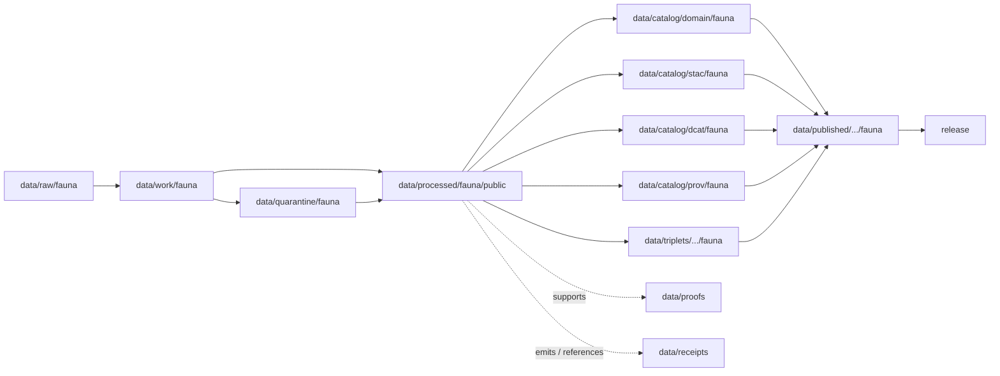

<!-- [KFM_META_BLOCK_V2]
doc_id: kfm://doc/data-processed-fauna-public-readme
title: data/processed/fauna/public/README.md — Fauna Public-Candidate Processed Data README
version: v0.1
type: readme; data-lifecycle-sublane; processed-stage-guide; fauna-domain-lane; public-candidate-lane; geoprivacy-gated
status: draft; PROPOSED; data-root; processed-stage; fauna; public-candidate; sensitivity-aware; deny-by-default; release-gated; redaction-required
owners: OWNER_TBD — Fauna steward · Sensitivity reviewer · Rights-holder representative · Data steward · Pipeline steward · Evidence steward · Policy steward · Release steward · Docs steward
created: NEEDS VERIFICATION — one-character placeholder existed before v0.1 expansion
updated: 2026-06-25
policy_label: public-doc; data; processed; fauna; public-candidate; geoprivacy; release-gated; deny-by-default
tags: [kfm, data, processed, fauna, public-candidate, geoprivacy, sensitivity, rare-species, occurrence, range, invasive-species, redaction, aggregation, RedactionReceipt, ReviewRecord, PolicyDecision, ReleaseManifest, RAW, WORK, QUARANTINE, PROCESSED, CATALOG, TRIPLET, PUBLISHED, EvidenceBundle, SourceDescriptor]
related:
  - ../README.md
  - ../../README.md
  - ../../../README.md
  - ../../../../docs/domains/fauna/README.md
  - ../../../../docs/domains/fauna/SENSITIVITY.md
  - ../../../../docs/adr/ADR-0010-deny-by-default-for-dna-rare-species-archaeology-infrastructure.md
  - ../../../../policy/domains/fauna/
  - ../../../../policy/sensitivity/fauna/
  - ../../../../contracts/domains/fauna/
  - ../../../../schemas/contracts/v1/domains/fauna/
  - ../../../raw/fauna/
  - ../../../work/fauna/
  - ../../../quarantine/fauna/
  - ../../../catalog/domain/fauna/
  - ../../../catalog/stac/fauna/
  - ../../../catalog/dcat/fauna/
  - ../../../catalog/prov/fauna/
  - ../../../triplets/
  - ../../../published/
  - ../../../proofs/
  - ../../../receipts/
  - ../../../registry/sources/fauna/
  - ../../../../release/candidates/fauna/
  - ../../../../release/
  - ../../../../pipelines/domains/fauna/
  - ../../../../tools/validators/
notes:
  - "This file replaces a one-character placeholder at `data/processed/fauna/public/README.md`."
  - "Despite the folder name `public`, this is a PROCESSED-stage public-candidate lane, not a PUBLISHED lane, release authority, public API/UI output, direct download surface, or permission to expose fauna data."
  - "Fauna sensitivity is deny-by-default. Sensitive taxa, nests, dens, roosts, hibernacula, spawning sites, steward-controlled records, exact occurrence geometry, and re-identifying joins must fail closed unless policy, review, redaction/aggregation, receipts, release, correction, and rollback support public use."
  - "Public-candidate artifacts must preserve source role, rights, sensitivity tier/rank, geoprivacy transform, redaction/aggregation receipt linkage, evidence linkage, policy posture, release state, correction path, and rollback target."
  - "This README is a lane guide only. Policy decides admissibility; contracts define object meaning; schemas define machine shape; release records decide publication."
  - "Rollback target for this expansion is previous placeholder blob SHA `e25f1814e51579d5f55c0f1fe0135ddb28a47f4a`."
[/KFM_META_BLOCK_V2] -->

<a id="top"></a>

# data/processed/fauna/public

> Fauna PROCESSED-stage lane for public-candidate fauna artifacts: generalized, redacted, aggregated, non-sensitive, or release-review-ready fauna records that may later support public catalog, maps, APIs, Focus Mode, or published products only after evidence, sensitivity, rights, policy, release, correction, and rollback gates pass.

<p>
  
  
  
  
  
  
</p>

**Status:** draft / PROPOSED  
**Owners:** OWNER_TBD — Fauna steward · Sensitivity reviewer · Rights-holder representative · Data steward · Pipeline steward · Evidence steward · Policy steward · Release steward · Docs steward  
**Path:** `data/processed/fauna/public/README.md`  
**Owning root:** `data/processed/`  
**Domain segment:** `fauna`  
**Sublane:** `public` / public-candidate processed fauna  
**Lifecycle stage:** `PROCESSED`  
**Exposure posture:** not public by default despite the folder name; public use requires governed catalog, EvidenceBundle, sensitivity policy, ReviewRecord, RedactionReceipt or AggregationReceipt where applicable, PolicyDecision, ReleaseManifest, correction path, and rollback target.  
**Truth posture:** CONFIRMED target was a one-character placeholder · CONFIRMED parent `data/processed/` is not public by default · CONFIRMED Fauna doctrine is sensitivity-aware and deny-by-default for sensitive occurrences/sites · PROPOSED public-candidate lane details · NEEDS VERIFICATION for actual child inventory, validators, fixtures, receipts, sensitivity policy enforcement, release linkage, and governed route behavior.

**Quick jumps:** [Purpose](#purpose) · [Lifecycle boundary](#lifecycle-boundary) · [Repo fit](#repo-fit) · [Accepted contents](#accepted-contents) · [Exclusions](#exclusions) · [Public-candidate requirements](#public-candidate-requirements) · [Sensitivity guardrails](#sensitivity-guardrails) · [Directory map](#directory-map) · [Evidence ledger](#evidence-ledger) · [Validation checklist](#validation-checklist) · [Rollback](#rollback)

---

## Purpose

`data/processed/fauna/public/` holds processed fauna artifacts that are candidates for public-safe use after governance review. It is a staging lane for fauna records that have moved beyond RAW capture, WORK transforms, and QUARANTINE holds, but have not yet become catalog records, public tiles, public APIs, published outputs, or release-approved artifacts.

This lane may include generalized occurrence summaries, public-safe range derivatives, non-sensitive occurrence candidates, invasive-species reporting candidates, redacted or aggregated density products, public-facing index candidates, and release-review-ready sidecars. Every artifact must remain traceable to source, evidence, sensitivity posture, transform receipts, policy decisions, review state, release state, correction path, and rollback target.

The word `public` means **public-candidate**, not public-approved. Public exact sensitive occurrence release is denied by default.

## Lifecycle boundary

```text
RAW -> WORK / QUARANTINE -> PROCESSED -> CATALOG / TRIPLET -> PUBLISHED
```



`data/processed/fauna/public/` is upstream of catalog, triplet, publication, and release. It must not be used as a normal public map/API/UI/AI source.

## Repo fit

| Responsibility | Correct home | Rule |
|---|---|---|
| Raw observations, source-native downloads, occurrence exports, steward files, camera/acoustic payloads, source logs, or original geometry | `data/raw/fauna/` | Not this lane. |
| In-process joins, transforms, geoprivacy work, QA, reconciliation, redaction trials, scratch products, or notebooks | `data/work/fauna/` | Not this lane. |
| Sensitive, unresolved, rights-unclear, steward-controlled, exact-location, re-identifying, disputed, malformed, or unsafe fauna material | `data/quarantine/fauna/` | Not this lane until policy/review allows. |
| Public-candidate processed fauna artifacts | `data/processed/fauna/public/` | This lane. |
| Other processed fauna lanes | `data/processed/fauna/<object-or-family>/` | Use object/family lanes when public-candidate posture is not the primary organizing concern. |
| Fauna catalog records | `data/catalog/domain/fauna/` | Downstream catalog stage. |
| Fauna STAC/DCAT/PROV records | `data/catalog/{stac,dcat,prov}/fauna/` | Downstream catalog projections if accepted. |
| Fauna triplet/graph records | `data/triplets/.../fauna/` | Downstream graph stage. |
| Published public-safe fauna products | `data/published/.../fauna/` | Downstream only after release. |
| EvidenceBundle/proof records | `data/proofs/` | Separate proof family. |
| Source, run, transform, redaction, validation, policy, correction, and release receipts | `data/receipts/` | Separate receipt family. |
| Fauna source registry records | `data/registry/sources/fauna/` | Separate source authority. |
| Release candidates and release manifests | `release/candidates/fauna/`, `release/` | Separate publication authority. |
| Fauna contracts | `contracts/domains/fauna/` | Object meaning; not data. |
| Fauna schemas | `schemas/contracts/v1/domains/fauna/` | Machine shape; not data. |
| Fauna policy and sensitivity rules | `policy/domains/fauna/`, `policy/sensitivity/fauna/` | Admissibility authority; not data. |
| Validators, tests, fixtures, pipelines, apps, packages | `tools/validators/`, `tests/`, `fixtures/`, `pipelines/`, `apps/`, `packages/` | Separate roots. |

## Accepted contents

Processed public-candidate fauna artifacts may include:

- non-sensitive occurrence candidates that have source, evidence, rights, sensitivity, and review posture attached;
- generalized or aggregated sensitive occurrence derivatives that carry RedactionReceipt or AggregationReceipt linkage;
- public-safe range polygon candidates, density grids, summary counts, seasonal summaries, monitoring summaries, or survey-status summaries when small-cell and re-identification risks are reviewed;
- invasive-species public reporting candidates where private-parcel detail and landowner-sensitive joins are generalized or suppressed;
- release-review-ready sidecars for sensitivity tier/rank, source role, rights, transform method, review state, policy decision, evidence references, validation status, correction path, and rollback target;
- public UI/API/tile candidate payloads only as processed artifacts, not as released outputs;
- README and manifest notes that explain local boundaries without becoming release manifests, proof bundles, source registry records, schemas, policy rules, validators, or public routes.

## Exclusions

Do not store these under `data/processed/fauna/public/`:

- RAW observations, source downloads, exact sensitive coordinates, steward-controlled originals, source-native geometry, logs, screenshots, media payloads, or source exports.
- WORK/scratch redaction trials or unresolved geoprivacy experiments.
- Quarantined, rights-unclear, sensitivity-unclear, steward-controlled, exact sensitive-taxon, nest, den, roost, hibernacula, spawning-site, re-identifying join, disputed, malformed, stale, unsupported, or unsafe records.
- Exact public coordinates for sensitive taxa or sensitive sites.
- Redaction parameters, fuzzing radii, seeds, or implementation details that could aid re-identification.
- Catalog records, STAC/DCAT/PROV records, triplets/graph records, published products, proof records, receipt records, source registry records, release records, schemas, policy rules, validators, tests, fixtures, pipelines, app/UI/API code, or packages.
- Enforcement conclusions, emergency alerts, operational wildlife guidance, hunting/fishing/legal advice, landowner disclosure, private-parcel targeting, habitat-sensitive joins, or any public output that has not passed release gates.
- AI-generated species narratives presented as authoritative without EvidenceBundle support and validated citations.

## Public-candidate requirements

PROPOSED until concrete validators and CI enforcement are verified:

| Requirement | Meaning |
|---|---|
| Source trace | Each artifact should trace to SourceDescriptor or fauna source registry context. |
| Evidence linkage | Claims about species, occurrence, range, status, monitoring, transform, or release readiness should resolve downstream to EvidenceBundle/proof context. |
| Sensitivity posture | Every artifact should carry sensitivity tier/rank, denied/generalized/public posture, and unresolved-sensitivity behavior. |
| Rights posture | Steward, agency, license, landowner, sovereignty, and reuse rights should be resolved before public promotion. |
| Transform receipt | Generalization, aggregation, suppression, redaction, embargo, or delayed publication should link to RedactionReceipt, AggregationReceipt, or equivalent receipt. |
| Review state | Sensitivity reviewer, fauna steward, and rights-holder representative review should be recorded where required. |
| Policy decision | Public-candidate status requires PolicyDecision/admissibility posture before promotion. |
| Re-identification check | Joins with habitat, land parcel, infrastructure, people, time, rare taxa, or small cells must be checked for re-identification risk. |
| Catalog readiness | Public-candidate artifacts intended for discovery should promote through fauna catalog/triplet lanes, not directly to public use. |
| Release readiness | Public use requires ReleaseManifest or release-linked state, published output path, correction path, and rollback target. |

## Sensitivity guardrails

- Sensitive taxa, nests, dens, roosts, hibernacula, spawning sites, and exact sensitive occurrence geometry fail closed by default.
- Public exact sensitive occurrence tiles are denied.
- Existence may be releasable without exact geometry only when steward review permits.
- Source quality never overrides sensitivity, rights, or review state.
- Missing rights, unresolved sensitivity, absent review, missing redaction receipt, or missing policy decision blocks public promotion.
- Re-identifying joins are denied by default unless reviewed and transformed.
- Habitat, hydrology, infrastructure, parcel, people, and time joins can make otherwise public data sensitive.
- Public-candidate processed artifacts are not public just because they live in a folder named `public`.
- Public clients and Focus Mode must use governed APIs, catalog/triplet records, released artifacts, EvidenceBundle-backed payloads, and policy-safe envelopes, not this directory directly.

> [!CAUTION]
> Do not expose `data/processed/fauna/public/` directly as a public map, tile service, API, UI, download, Focus Mode answer, AI answer source, species-location service, landowner/parcel targeting aid, enforcement surface, or operational wildlife guidance. Public use requires governed promotion, release, correction, and rollback.

## Directory map

Actual child inventory remains **NEEDS VERIFICATION**. Use this as a proposed local organization pattern only after confirming current repo convention and validators.

```text
data/processed/fauna/public/
├── README.md
├── occurrence_public/        # PROPOSED — non-sensitive or transformed occurrence candidates
├── generalized_ranges/       # PROPOSED — public-safe generalized range candidates
├── density_grids/            # PROPOSED — aggregate density/count products with suppression checks
├── invasive_public/          # PROPOSED — public invasive-species reporting candidates
├── summaries/                # PROPOSED — public-safe summaries and indexes
├── redactions/               # PROPOSED — redaction linkage sidecars, not receipt authority
├── reviews/                  # PROPOSED — review-link sidecars, not review authority
├── joins/                    # PROPOSED — public-safe join candidates after re-identification review
├── _manifests/               # PROPOSED — lane-local non-release manifests only
└── _README_TODO.md           # PROPOSED — remove after actual child inventory is documented
```

## Evidence ledger

| Source | Status | Supports | Limits |
|---|---|---|---|
| Previous file | CONFIRMED | Target existed as a one-character placeholder. | Did not define fauna public-candidate PROCESSED-stage boundaries. |
| `data/processed/README.md` | CONFIRMED | PROCESSED data is upstream of catalog, triplets, publication, and release and is not public by default. | Does not prove fauna child inventory or enforcement. |
| `data/processed/fauna/README.md` | CONFIRMED | Parent fauna processed lane currently exists only as a greenfield stub. | Does not define fauna processed boundaries yet. |
| `docs/domains/fauna/README.md` | CONFIRMED doctrine / PROPOSED implementation | Fauna owns taxonomy, occurrences, ranges, monitoring, sensitive sites, invasive species, geoprivacy, public-safe derivatives, and governed API surfaces. | Implementation maturity remains NEEDS VERIFICATION. |
| `docs/domains/fauna/SENSITIVITY.md` | CONFIRMED doctrine / PROPOSED implementation | Fauna sensitivity is deny-by-default, fail-closed, generalize-before-release, reversible, and receipt-bearing. | Binding decisions live in `policy/sensitivity/fauna/`; concrete parameters are deliberately not in docs. |
| Deny-by-default ADR/search result | NEEDS VERIFICATION | Indicates cross-domain deny-by-default doctrine for DNA, rare species, archaeology, and infrastructure. | Full ADR content was not opened in this task. |
| `policy/sensitivity/fauna/` | NEEDS VERIFICATION | Binding admissibility home named by Fauna docs. | Current policy files and enforcement were not verified in this task. |
| `contracts/domains/fauna/` and `schemas/contracts/v1/domains/fauna/` | NEEDS VERIFICATION | Expected object contract/schema homes. | Specific object files and validators were not verified in this task. |

## Validation checklist

- [ ] Confirm actual child directories under `data/processed/fauna/public/`.
- [ ] Confirm whether `public/` is the accepted public-candidate lane name or should be renamed to avoid confusion with `data/published/`.
- [ ] Confirm parent `data/processed/fauna/README.md` is expanded beyond stub.
- [ ] Confirm object-family contracts and schemas for fauna public-candidate artifacts.
- [ ] Confirm sensitivity tier/rank representation and canonical vocabulary.
- [ ] Confirm validators, fixtures, and CI checks for fauna public-candidate processed artifacts.
- [ ] Confirm SourceDescriptor/source registry linkage for every source-derived artifact.
- [ ] Confirm RedactionReceipt, AggregationReceipt, ReviewRecord, PolicyDecision, ValidationReport, ReleaseManifest, correction path, and rollback target where applicable.
- [ ] Confirm exact sensitive occurrence coordinates, nests, dens, roosts, hibernacula, spawning sites, steward-controlled records, re-identifying joins, redaction parameters, and rights-unclear material cannot enter this lane or public routes.
- [ ] Confirm promotion flow from public-candidate processed fauna artifacts to catalog/triplet/published outputs is governed, evidence-backed, sensitivity-safe, rights-safe, release-linked, and reversible.
- [ ] Confirm public clients and Focus Mode cannot read this lane directly as public truth, public location service, public map, public tile, public API, public UI, or AI-answer source.

## Rollback

Rollback is required if this lane becomes a public output root, `data/published/` substitute, exact sensitive-location exposure path, quarantine bypass, source-data root, proof store, receipt store, catalog root, triplet root, source-registry root, release-decision root, schema root, policy root, validator root, implementation root, public API shortcut, public UI shortcut, public tile shortcut, public exposure shortcut, enforcement aid, landowner/parcel targeting aid, operational wildlife guidance source, or life-safety guidance source.

Rollback target for this expansion: previous placeholder blob SHA `e25f1814e51579d5f55c0f1fe0135ddb28a47f4a`.

<p align="right"><a href="#top">Back to top</a></p>
