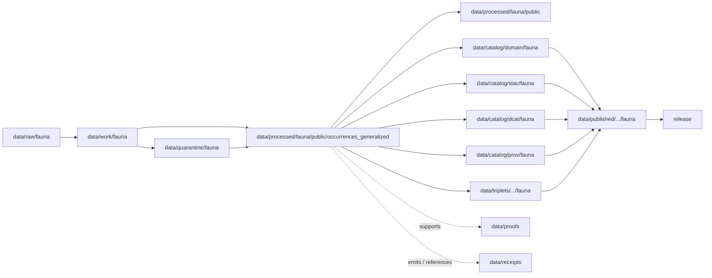

<!-- [KFM_META_BLOCK_V2]
doc_id: kfm://doc/data-processed-fauna-public-occurrences-generalized-readme
title: data/processed/fauna/public/occurrences_generalized/README.md — Fauna Generalized Occurrences Public-Candidate Processed Data README
version: v0.1
type: readme; data-lifecycle-sublane; processed-stage-guide; fauna-domain-lane; public-candidate-lane; generalized-occurrence-lane; geoprivacy-gated
status: draft; PROPOSED; data-root; processed-stage; fauna; public-candidate; occurrences-generalized; sensitivity-aware; deny-by-default; release-gated; redaction-required; aggregation-aware
owners: OWNER_TBD — Fauna steward · Occurrence steward · Sensitivity reviewer · Rights-holder representative · Data steward · Pipeline steward · Evidence steward · Policy steward · Release steward · Docs steward
created: NEEDS VERIFICATION — one-character placeholder existed before v0.1 expansion
updated: 2026-06-25
policy_label: public-doc; data; processed; fauna; public-candidate; generalized-occurrences; geoprivacy; release-gated; deny-by-default
tags: [kfm, data, processed, fauna, public-candidate, occurrences-generalized, occurrence, occurrence-public, generalized-occurrence, geoprivacy, sensitivity, rare-species, redaction, aggregation, RedactionReceipt, AggregationReceipt, ReviewRecord, PolicyDecision, ReleaseManifest, RAW, WORK, QUARANTINE, PROCESSED, CATALOG, TRIPLET, PUBLISHED, EvidenceBundle, SourceDescriptor]
related:
  - ../README.md
  - ../../README.md
  - ../../../README.md
  - ../../../../README.md
  - ../../../../../docs/domains/fauna/README.md
  - ../../../../../docs/domains/fauna/SENSITIVITY.md
  - ../../../../../docs/adr/ADR-0010-deny-by-default-for-dna-rare-species-archaeology-infrastructure.md
  - ../../../../../policy/domains/fauna/
  - ../../../../../policy/sensitivity/fauna/
  - ../../../../../contracts/domains/fauna/
  - ../../../../../schemas/contracts/v1/domains/fauna/
  - ../../../../raw/fauna/
  - ../../../../work/fauna/
  - ../../../../quarantine/fauna/
  - ../../../../catalog/domain/fauna/
  - ../../../../catalog/stac/fauna/
  - ../../../../catalog/dcat/fauna/
  - ../../../../catalog/prov/fauna/
  - ../../../../triplets/
  - ../../../../published/
  - ../../../../proofs/
  - ../../../../receipts/
  - ../../../../registry/sources/fauna/
  - ../../../../../release/candidates/fauna/
  - ../../../../../release/
  - ../../../../../pipelines/domains/fauna/
  - ../../../../../tools/validators/
notes:
  - "This file replaces a one-character placeholder at `data/processed/fauna/public/occurrences_generalized/README.md`."
  - "This is a child PROCESSED-stage lane under `data/processed/fauna/public/` for generalized occurrence public-candidates. It is not a PUBLISHED lane, direct public API/UI output, source registry, proof store, receipt store, policy authority, release authority, or permission to expose occurrence data."
  - "Generalized occurrence artifacts must preserve original sensitivity posture, transform family, redaction/aggregation receipt linkage, review state, rights posture, evidence linkage, policy decision, release state, correction path, and rollback target."
  - "Generalized geometry is not automatically public-safe. It remains public-candidate until catalog, policy, release, correction, and rollback gates pass."
  - "Exact coordinates, exact sensitive occurrence geometry, nests, dens, roosts, hibernacula, spawning sites, steward-controlled data, and re-identifying joins must not be stored or exposed here."
  - "This README is a lane guide only. Policy decides admissibility; contracts define object meaning; schemas define machine shape; release records decide publication."
  - "Rollback target for this expansion is previous placeholder blob SHA `e25f1814e51579d5f55c0f1fe0135ddb28a47f4a`."
[/KFM_META_BLOCK_V2] -->

<a id="top"></a>

# data/processed/fauna/public/occurrences_generalized

> Fauna PROCESSED-stage child lane for generalized occurrence public-candidates: redacted, aggregated, generalized, or otherwise geoprivacy-transformed occurrence artifacts that may support public catalog, maps, APIs, Focus Mode, or published products only after evidence, sensitivity, rights, review, policy, release, correction, and rollback gates pass.

<p>
  
  
  
  
  
  
  
</p>

**Status:** draft / PROPOSED  
**Owners:** OWNER_TBD — Fauna steward · Occurrence steward · Sensitivity reviewer · Rights-holder representative · Data steward · Pipeline steward · Evidence steward · Policy steward · Release steward · Docs steward  
**Path:** `data/processed/fauna/public/occurrences_generalized/README.md`  
**Owning root:** `data/processed/`  
**Domain segment:** `fauna`  
**Parent lane:** `data/processed/fauna/public/`  
**Sublane:** `occurrences_generalized` / generalized occurrence public-candidates  
**Lifecycle stage:** `PROCESSED`  
**Exposure posture:** not public by default; generalized occurrence artifacts require governed catalog, EvidenceBundle, sensitivity policy, ReviewRecord, RedactionReceipt or AggregationReceipt, PolicyDecision, ReleaseManifest, correction path, and rollback target before public use.  
**Truth posture:** CONFIRMED target was a one-character placeholder · CONFIRMED parent `public/` lane is public-candidate and not published release · CONFIRMED Fauna doctrine is sensitivity-aware and deny-by-default for sensitive occurrences/sites · PROPOSED generalized-occurrence child-lane details · NEEDS VERIFICATION for actual child inventory, validators, fixtures, receipt records, sensitivity policy enforcement, release linkage, and governed route behavior.

**Quick jumps:** [Purpose](#purpose) · [Lifecycle boundary](#lifecycle-boundary) · [Repo fit](#repo-fit) · [Accepted contents](#accepted-contents) · [Exclusions](#exclusions) · [Generalized-occurrence requirements](#generalized-occurrence-requirements) · [Geoprivacy guardrails](#geoprivacy-guardrails) · [Directory map](#directory-map) · [Evidence ledger](#evidence-ledger) · [Validation checklist](#validation-checklist) · [Rollback](#rollback)

---

## Purpose

`data/processed/fauna/public/occurrences_generalized/` holds processed generalized occurrence artifacts that are candidates for public-safe use after governance review. It is a child lane under `data/processed/fauna/public/`, not a publication lane.

This lane is for occurrence records or occurrence-derived products where exact geometry has been suppressed, generalized, aggregated, redacted, delayed, or otherwise transformed according to a documented geoprivacy policy. These artifacts remain public-candidate until their evidence, sensitivity, rights, transform, review, policy, catalog, release, correction, and rollback states are all resolved.

The lane must preserve enough lineage to audit what changed without exposing sensitive details. It must not store exact sensitive coordinates, transform secrets, or re-identifying details that defeat the geoprivacy transform.

## Lifecycle boundary

```text
RAW -> WORK / QUARANTINE -> PROCESSED -> CATALOG / TRIPLET -> PUBLISHED
```



`data/processed/fauna/public/occurrences_generalized/` is upstream of catalog, triplet, publication, and release. It must not be used as a normal public map/API/UI/AI source.

## Repo fit

| Responsibility | Correct home | Rule |
|---|---|---|
| Raw occurrence records, source-native downloads, exact source geometry, steward files, camera/acoustic source payloads, source logs, or original identifiers | `data/raw/fauna/` | Not this lane. |
| In-process geoprivacy work, transform trials, reconciliation, QA, joins, redaction experiments, scratch products, or notebooks | `data/work/fauna/` | Not this lane. |
| Sensitive, unresolved, rights-unclear, steward-controlled, exact-location, re-identifying, disputed, malformed, or unsafe fauna material | `data/quarantine/fauna/` | Not this lane until policy/review allows. |
| Generalized occurrence public-candidate processed artifacts | `data/processed/fauna/public/occurrences_generalized/` | This lane. |
| Parent public-candidate fauna lane | `data/processed/fauna/public/` | Parent lane; still not published by default. |
| Other processed fauna object/family lanes | `data/processed/fauna/<object-or-family>/` | Use when generalized public-candidate posture is not the primary organizing concern. |
| Fauna catalog records | `data/catalog/domain/fauna/` | Downstream catalog stage. |
| Fauna STAC/DCAT/PROV records | `data/catalog/{stac,dcat,prov}/fauna/` | Downstream catalog projections if accepted. |
| Fauna triplet/graph records | `data/triplets/.../fauna/` | Downstream graph stage. |
| Published public-safe fauna products | `data/published/.../fauna/` | Downstream only after release. |
| EvidenceBundle/proof records | `data/proofs/` | Separate proof family. |
| Redaction, aggregation, review, policy, validation, correction, and release receipts | `data/receipts/` | Separate receipt family. |
| Fauna source registry records | `data/registry/sources/fauna/` | Separate source authority. |
| Release candidates and release manifests | `release/candidates/fauna/`, `release/` | Separate publication authority. |
| Fauna contracts | `contracts/domains/fauna/` | Object meaning; not data. |
| Fauna schemas | `schemas/contracts/v1/domains/fauna/` | Machine shape; not data. |
| Fauna policy and sensitivity rules | `policy/domains/fauna/`, `policy/sensitivity/fauna/` | Admissibility authority; not data. |
| Validators, tests, fixtures, pipelines, apps, packages | `tools/validators/`, `tests/`, `fixtures/`, `pipelines/`, `apps/`, `packages/` | Separate roots. |

## Accepted contents

Processed generalized occurrence public-candidates may include:

- generalized occurrence records whose exact source geometry has been removed, replaced, redacted, aggregated, or withheld by an approved transform family;
- occurrence summaries generalized to policy-approved public-safe spatial or administrative units;
- public-candidate generalized range or occurrence-density products when small-cell and re-identification risks are reviewed;
- transformed derivatives that carry source references, evidence references, sensitivity tier/rank, rights posture, transform family, review state, policy decision, validation status, release-readiness posture, correction path, and rollback target;
- release-review sidecars that reference RedactionReceipt, AggregationReceipt, ReviewRecord, PolicyDecision, ValidationReport, and ReleaseManifest without storing those receipt/release records here;
- public UI/API/tile candidate payloads only as processed artifacts, not as public outputs;
- README and manifest notes explaining local boundaries without becoming release manifests, proof bundles, source registry records, schemas, policy rules, validators, or public routes.

## Exclusions

Do not store these under `data/processed/fauna/public/occurrences_generalized/`:

- RAW occurrences, source downloads, exact sensitive coordinates, source-native geometries, steward-controlled originals, source identifiers, camera/acoustic source payloads, logs, screenshots, media payloads, or source exports.
- WORK/scratch redaction trials, unresolved geoprivacy experiments, intermediate joins, or transform-debug outputs.
- Quarantined, rights-unclear, sensitivity-unclear, steward-controlled, exact sensitive-taxon, nest, den, roost, hibernacula, spawning-site, re-identifying join, disputed, malformed, stale, unsupported, or unsafe records.
- Exact public coordinates for sensitive taxa or sensitive sites.
- Redaction parameters, fuzzing radii, seeds, exact transform offsets, implementation secrets, or any details that could aid reverse engineering or re-identification.
- RedactionReceipt, AggregationReceipt, ReviewRecord, PolicyDecision, ValidationReport, ReleaseManifest, EvidenceBundle, proof records, catalog records, STAC/DCAT/PROV records, triplets/graph records, published products, source registry records, schemas, policy rules, validators, tests, fixtures, pipelines, app/UI/API code, or packages.
- Enforcement conclusions, operational wildlife guidance, hunting/fishing/legal advice, landowner disclosure, private-parcel targeting, habitat-sensitive joins, or any public output that has not passed release gates.
- AI-generated species narratives presented as authoritative without EvidenceBundle support and validated citations.

## Generalized-occurrence requirements

PROPOSED until concrete validators and CI enforcement are verified:

| Requirement | Meaning |
|---|---|
| Source trace | Each generalized artifact should trace to SourceDescriptor or fauna source registry context. |
| Evidence linkage | Claims about species, occurrence, range, transform, review, or release readiness should resolve downstream to EvidenceBundle/proof context. |
| Original sensitivity posture | Original sensitivity tier/rank and denied/generalized/public posture should remain auditable without exposing sensitive details. |
| Transform receipt | Generalization, aggregation, suppression, redaction, embargo, or delayed publication should link to RedactionReceipt, AggregationReceipt, or equivalent receipt. |
| Review state | Sensitivity reviewer, fauna steward, and rights-holder representative review should be recorded where required. |
| Rights posture | Steward, agency, license, landowner, sovereignty, and reuse rights should be resolved before public promotion. |
| Policy decision | Generalized public-candidate status requires PolicyDecision/admissibility posture before promotion. |
| Re-identification check | Spatial, temporal, taxonomic, habitat, parcel, infrastructure, people, source, and small-cell joins must be checked for re-identification risk. |
| Transform minimality | Release the safest representation that answers the public need, not the most detailed geometry. |
| Catalog readiness | Generalized occurrence artifacts intended for discovery should promote through fauna catalog/triplet lanes, not directly to public use. |
| Release readiness | Public use requires ReleaseManifest or release-linked state, published output path, correction path, and rollback target. |

## Geoprivacy guardrails

- Generalized does not mean public-approved.
- Exact sensitive occurrence geometry must not be stored or exposed here.
- Public exact sensitive occurrence tiles are denied.
- Sensitive taxa, nests, dens, roosts, hibernacula, spawning sites, and re-identifying joins fail closed by default.
- Existence may be releasable without exact geometry only when steward review permits.
- Missing rights, unresolved sensitivity, absent review, missing redaction receipt, missing aggregation receipt where required, or missing policy decision blocks public promotion.
- Source quality never overrides sensitivity, rights, or review state.
- Do not publish transform parameters, radii, seeds, offsets, or implementation details that could aid reverse engineering.
- Habitat, hydrology, infrastructure, parcel, people, source, and time joins can make otherwise public generalized occurrence data sensitive.
- Public clients and Focus Mode must use governed APIs, catalog/triplet records, released artifacts, EvidenceBundle-backed payloads, and policy-safe envelopes, not this directory directly.

> [!CAUTION]
> Do not expose `data/processed/fauna/public/occurrences_generalized/` directly as a public map, tile service, API, UI, download, Focus Mode answer, AI answer source, species-location service, landowner/parcel targeting aid, enforcement surface, or operational wildlife guidance. Generalization is one gate; it is not publication.

## Directory map

Actual child inventory remains **NEEDS VERIFICATION**. Use this as a proposed local organization pattern only after confirming current repo convention and validators.

```text
data/processed/fauna/public/occurrences_generalized/
├── README.md
├── records/                  # PROPOSED — generalized occurrence candidate records
├── summaries/                # PROPOSED — generalized occurrence summaries
├── grids/                    # PROPOSED — aggregate grid/density candidates with suppression checks
├── ranges/                   # PROPOSED — generalized range/extent candidates
├── redaction_links/          # PROPOSED — links to RedactionReceipt, not receipt authority
├── aggregation_links/        # PROPOSED — links to AggregationReceipt, not receipt authority
├── reviews/                  # PROPOSED — review-link sidecars, not review authority
├── joins/                    # PROPOSED — public-safe join candidates after re-identification review
├── _manifests/               # PROPOSED — lane-local non-release manifests only
└── _README_TODO.md           # PROPOSED — remove after actual child inventory is documented
```

## Evidence ledger

| Source | Status | Supports | Limits |
|---|---|---|---|
| Previous file | CONFIRMED | Target existed as a one-character placeholder. | Did not define generalized occurrence boundaries. |
| `data/processed/fauna/public/README.md` | CONFIRMED parent README | Parent lane is public-candidate only, not published release; requires evidence, sensitivity, rights, review, policy, release, correction, and rollback gates. | Does not prove child inventory or enforcement. |
| `data/processed/README.md` | CONFIRMED | PROCESSED data is upstream of catalog, triplets, publication, and release and is not public by default. | Does not prove fauna child inventory or enforcement. |
| `docs/domains/fauna/README.md` | CONFIRMED doctrine / PROPOSED implementation | Fauna owns taxonomy, occurrences, ranges, monitoring, sensitive sites, invasive species, geoprivacy, public-safe derivatives, and governed API surfaces. | Implementation maturity remains NEEDS VERIFICATION. |
| `docs/domains/fauna/SENSITIVITY.md` | CONFIRMED doctrine / PROPOSED implementation | Fauna sensitivity is deny-by-default, fail-closed, generalize-before-release, reversible, and receipt-bearing; geoprivacy transforms are documented and deterministic. | Binding decisions live in `policy/sensitivity/fauna/`; concrete parameters are deliberately not in docs. |
| `policy/sensitivity/fauna/` | NEEDS VERIFICATION | Binding admissibility home named by Fauna docs. | Current policy files and enforcement were not verified in this task. |
| `contracts/domains/fauna/` and `schemas/contracts/v1/domains/fauna/` | NEEDS VERIFICATION | Expected object contract/schema homes. | Specific occurrence object files and validators were not verified in this task. |

## Validation checklist

- [ ] Confirm actual child directories under `data/processed/fauna/public/occurrences_generalized/`.
- [ ] Confirm whether `occurrences_generalized/` is the accepted lane name or should be reconciled with `occurrence_public/`, `generalized_ranges/`, or other fauna conventions.
- [ ] Confirm parent `data/processed/fauna/README.md` is expanded beyond stub.
- [ ] Confirm occurrence object contracts and schemas for generalized/public occurrence artifacts.
- [ ] Confirm sensitivity tier/rank representation and canonical vocabulary.
- [ ] Confirm validators, fixtures, and CI checks for generalized occurrence public-candidate artifacts.
- [ ] Confirm SourceDescriptor/source registry linkage for every source-derived artifact.
- [ ] Confirm RedactionReceipt, AggregationReceipt, ReviewRecord, PolicyDecision, ValidationReport, ReleaseManifest, correction path, and rollback target where applicable.
- [ ] Confirm exact sensitive occurrence coordinates, nests, dens, roosts, hibernacula, spawning sites, steward-controlled records, re-identifying joins, redaction parameters, transform secrets, and rights-unclear material cannot enter this lane or public routes.
- [ ] Confirm small-cell, habitat, hydrology, infrastructure, parcel, people, source, and time joins are checked for re-identification risk.
- [ ] Confirm promotion flow from generalized occurrence public-candidates to catalog/triplet/published outputs is governed, evidence-backed, sensitivity-safe, rights-safe, review-backed, release-linked, and reversible.
- [ ] Confirm public clients and Focus Mode cannot read this lane directly as public truth, public location service, public map, public tile, public API, public UI, or AI-answer source.

## Rollback

Rollback is required if this lane becomes a public output root, `data/published/` substitute, exact sensitive-location exposure path, transform-secret exposure path, quarantine bypass, source-data root, proof store, receipt store, catalog root, triplet root, source-registry root, release-decision root, schema root, policy root, validator root, implementation root, public API shortcut, public UI shortcut, public tile shortcut, public exposure shortcut, enforcement aid, landowner/parcel targeting aid, operational wildlife guidance source, or life-safety guidance source.

Rollback target for this expansion: previous placeholder blob SHA `e25f1814e51579d5f55c0f1fe0135ddb28a47f4a`.

<p align="right"><a href="#top">Back to top</a></p>
