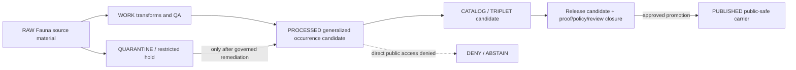

<!-- [KFM_META_BLOCK_V2]
doc_id: kfm://doc/data-processed-fauna-public-occurrences-generalized-readme
title: data/processed/fauna/public/occurrences_generalized/ — Generalized Fauna Occurrence Candidates
type: directory-readme
subtype: nested-processed-fauna-public-candidate-lane
version: v0.2.0
status: repository-grounded draft; real occurrence payload, transform, policy, proof, release, and runtime enforcement unverified
owners:
  - "NEEDS VERIFICATION — Fauna domain steward"
  - "NEEDS VERIFICATION — occurrence and geoprivacy steward"
  - "NEEDS VERIFICATION — sensitivity and rights reviewer"
  - "NEEDS VERIFICATION — data, evidence, policy, release, correction, and rollback stewards"
created: NEEDS VERIFICATION — one-character placeholder existed before v0.1 expansion
updated: 2026-07-25
policy_label: restricted-review; processed-stage; public-candidate-only; geoprivacy-gated; deny-by-default; no-direct-public-path
path: data/processed/fauna/public/occurrences_generalized/README.md
truth_posture: >
  CONFIRMED exact target path, prior blob, Directory Rules placement, processed Fauna
  parent/public-candidate contracts, current Fauna sensitivity doctrine, and the bounded
  synthetic fixture validator slice / PROPOSED lane-local admission profile and downstream
  release packet / UNKNOWN recursive payload inventory, real transforms, source activation,
  EvidenceBundle closure, policy runtime, release instances, hosting, and public behavior /
  NEEDS VERIFICATION accountable owners, accepted real-occurrence contracts and schemas,
  geoprivacy parameters, review separation, correction propagation, and rollback drills
evidence_snapshot:
  repository: bartytime4life/Kansas-Frontier-Matrix
  base_ref: main
  base_commit: 34bbfe50a114c29c8bbf4cdc13feb721ba11eaf5
  prior_blob: 8bc7e0288c555e82b9cae0bbfe4a14a9c4fe531f
  directory_rules_blob: 2affb080e6f0043867c64c7f06c1ca52030fbd55
  processed_fauna_parent_blob: 29d2e39f04a1bb34bcd1e7bdec93c37656ad7904
  public_candidate_parent_blob: 7577f22227fc835457c94de6c615b6d4025151fe
  fauna_sensitivity_blob: 58c557cda55362345ac3869502910bc301ef5b8c
  bounded_validator_readme_blob: e80813e27a63109d2142481e3e0c5eef25eb6607
  bounded_test_blob: 50401cd17c02fd4e9a722bfeb2a25107ae5277f0
  synthetic_fixture_blob: 670ba614971b63d72ce081635f2370c641b01d71
  fauna_workflow_blob: 85b0a8b42f9af40366de2b0c7d733892d4220ee0
related:
  - ../README.md
  - ../../README.md
  - ../../../README.md
  - ../../../../README.md
  - ../../../../../docs/domains/fauna/README.md
  - ../../../../../docs/domains/fauna/SENSITIVITY.md
  - ../../../../../docs/domains/fauna/FILE_SYSTEM_PLAN.md
  - ../../../../../docs/adr/ADR-0010-deny-by-default-for-dna-rare-species-archaeology-infrastructure.md
  - ../../../../../policy/domains/fauna/README.md
  - ../../../../../policy/sensitivity/fauna/README.md
  - ../../../../../contracts/domains/fauna/README.md
  - ../../../../../schemas/contracts/v1/domains/fauna/README.md
  - ../../../../raw/fauna/README.md
  - ../../../../work/fauna/README.md
  - ../../../../quarantine/fauna/README.md
  - ../../../../catalog/domain/fauna/README.md
  - ../../../../triplets/README.md
  - ../../../../proofs/fauna/README.md
  - ../../../../receipts/README.md
  - ../../../../registry/sources/fauna/README.md
  - ../../../../../release/candidates/fauna/README.md
  - ../../../../../release/README.md
  - ../../../../../tools/validators/domains/fauna/README.md
  - ../../../../../tests/domains/fauna/test_fauna_smoke.py
  - ../../../../../fixtures/domains/fauna/README.md
  - ../../../../../.github/workflows/domain-fauna.yml
notes:
  - "Same-path Markdown modernization only; no occurrence bytes, geoprivacy transform, source state, policy, proof, workflow, release, route, hosting, or KFM publication state changed."
  - "The accepted executable validates only a closed synthetic fixture profile and must not be described as production OccurrencePublic or generalized-occurrence validation."
  - "Generalized geometry remains a PROCESSED public-candidate; exact or reverse-engineerable sensitive location material is prohibited from this lane."
  - "Specific geoprivacy parameters, offsets, seeds, radii, and transform secrets remain outside this public README."
[/KFM_META_BLOCK_V2] -->

<a id="top"></a>

# `data/processed/fauna/public/occurrences_generalized/` — Generalized Fauna occurrence candidates

> **One-line purpose.** Hold processed, geoprivacy-transformed Fauna occurrence candidates that remain upstream of catalog, release, and publication and are denied direct public use.

[](#status)
[](#authority-level)
[](#outputs)
[](#fauna-geoprivacy-guardrails)
[](#verified-bounded-validator-slice)
[](#validation)

> [!IMPORTANT]
> The word **generalized** describes a transform state, not a release decision. Directory placement, reduced precision, a validator pass, a commit, a pull request, or a merge does not make an occurrence safe, released, public, or KFM-published.

> [!CAUTION]
> Do not place exact or reverse-engineerable sensitive location material here. Exact occurrences, nests, dens, roosts, hibernacula, spawning or breeding sites, steward-controlled records, transform secrets, and unsafe joins remain restricted or quarantined and fail closed.

**Quick navigation:** [Purpose](#purpose) · [Authority](#authority-level) · [Status](#status) · [Belongs](#what-belongs-here) · [Exclusions](#what-does-not-belong-here) · [Inputs](#inputs) · [Outputs](#outputs) · [Validation](#validation) · [Review](#review-burden) · [Related](#related-folders) · [ADRs](#adrs) · [Last reviewed](#last-reviewed) · [Admission profile](#candidate-admission-profile) · [Guardrails](#fauna-geoprivacy-guardrails) · [Validator slice](#verified-bounded-validator-slice) · [Lifecycle](#lifecycle-relationship) · [Done](#definition-of-done) · [Verification](#open-verification-register) · [No-loss](#no-loss-ledger)

---

<a id="1-scope"></a>

## Purpose

`data/processed/fauna/public/occurrences_generalized/` is a nested Fauna lane under [`data/processed/fauna/public/`](../README.md). It holds processed occurrence candidates whose public representation has been generalized, aggregated, suppressed, delayed, or otherwise transformed under a reviewed geoprivacy method.

The lane remains inside the `PROCESSED` lifecycle phase:

```text
RAW -> WORK / QUARANTINE -> PROCESSED -> CATALOG / TRIPLET
    -> RELEASE DECISION -> PUBLISHED PUBLIC-SAFE CARRIER
```

Artifacts here are not live API payloads, public map sources, tiles, downloads, Focus Mode evidence, or release objects. They are candidate data awaiting downstream evidence, policy, review, catalog, release, correction, and rollback closure.

[Back to top](#top)

---

<a id="2-repo-fit"></a>

## Authority level

**Implementation-bearing data lane; public-candidate carrier only.**

| Question | Bounded answer |
|---|---|
| Owning responsibility | `data/`, lifecycle phase `processed/`, domain `fauna`, public-candidate sublane `occurrences_generalized/`. |
| What this README may define | The directory boundary, admission expectations, prohibited material, validation limits, and downstream handoff expectations. |
| What it must not define | Fauna meaning, machine schemas, geoprivacy parameters, policy decisions, EvidenceBundle truth, release approval, public routes, or rollback execution. |
| Public client access | **DENIED.** Public clients must use governed APIs and released public-safe artifacts. |
| Exact sensitive geometry | **DENIED.** Exact or reconstructable location support belongs in restricted or quarantine lanes. |
| Failure posture | Quarantine, restrict, deny, hold, or abstain according to the applicable contract and policy surface. |

Directory Rules place lifecycle data under `data/<phase>/<domain>/`; this same-path revision preserves that responsibility, phase, domain segment, and public-candidate sublane. Directory Rules also keep contracts, schemas, policy, tests, fixtures, proofs, receipts, and release decisions in their own authority roots. fileciteturn80file9

[Back to top](#top)

---

## Status

| Item | Current bounded result |
|---|---|
| Target | `data/processed/fauna/public/occurrences_generalized/README.md` |
| Document version | `v0.2.0` |
| Base evidence | `main@34bbfe50a114c29c8bbf4cdc13feb721ba11eaf5` |
| Prior blob | `8bc7e0288c555e82b9cae0bbfe4a14a9c4fe531f` |
| Processed Fauna parent | **CONFIRMED** at [`../../README.md`](../../README.md) |
| Public-candidate parent | **CONFIRMED** at [`../README.md`](../README.md) |
| Fauna sensitivity doctrine | **CONFIRMED document; policy remains the decision authority** at [`SENSITIVITY.md`](../../../../../docs/domains/fauna/SENSITIVITY.md) |
| Exact child-lane identity | **CONFIRMED current path; broader topology remains draft** |
| Recursive occurrence inventory | **UNKNOWN** |
| Real occurrence contracts and field-complete schemas | **NEEDS VERIFICATION** |
| Real geoprivacy transforms and receipt instances | **UNKNOWN** |
| Source activation, evidence closure, policy runtime, review, release, hosting, and public effects | **UNKNOWN** |
| Verified executable scope | One deterministic no-network **synthetic fixture-safety** validator slice only |
| Public readiness | **DENY BY DEFAULT** until release-specific closure exists |
| Effect of this revision | Markdown only; no data, transform, policy, workflow, proof, release, route, or publication state changed |

[Back to top](#top)

---

<a id="3-accepted-contents"></a>

## What belongs here

Only processed generalized-occurrence candidates that satisfy the lane boundary belong here.

| Candidate family | Admissible role | Required boundary |
|---|---|---|
| Generalized occurrence records | Candidate records with exact source geometry removed from the public-candidate representation | Preserve source/evidence references and restricted lineage without embedding sensitive details. |
| Aggregate occurrence summaries | Counts, density classes, or scoped summaries | Small-cell, temporal, habitat, parcel, infrastructure, and source-combination risks must be reviewed. |
| Generalized range or extent candidates | Public-candidate spatial extents derived from occurrence evidence | Must remain labeled as derived/generalized and must not claim occurrence precision. |
| Release-review sidecars | Non-authoritative indexes, inventories, caveat summaries, or links | May reference receipts, reviews, policy, validation, correction, and rollback records; must not replace them. |
| Integrity metadata | Candidate digests or immutable identifiers | Bind candidate bytes to the downstream review packet without becoming proof or release authority. |
| Lane documentation | README and bounded manifest notes | Explain local constraints without exposing transform secrets or creating parallel authority. |

A candidate that belongs to another lifecycle or authority family must not be duplicated here for convenience.

[Back to top](#top)

---

<a id="4-exclusions"></a>

## What does NOT belong here

| Do not place here | Correct home or action |
|---|---|
| RAW source payloads, source exports, media, logs, original identifiers, or source-native geometry | [`data/raw/fauna/`](../../../../raw/fauna/README.md) |
| Transform experiments, joins, scratch products, notebooks, debugging output, or unreviewed redaction trials | [`data/work/fauna/`](../../../../work/fauna/README.md) |
| Rights-unclear, sensitivity-unclear, malformed, disputed, stale-without-policy, or otherwise held material | [`data/quarantine/fauna/`](../../../../quarantine/fauna/README.md) |
| Exact or reconstructable sensitive occurrences and sensitive sites | Restricted Fauna lanes under [`data/processed/fauna/restricted/`](../../restricted/README.md), or quarantine when admission is unresolved |
| Exact coordinates, coordinate aliases, bounding boxes, centroids, or numeric values under location-bearing keys | Restricted/quarantine handling; never this public-candidate lane |
| Transform parameters, radii, seeds, offsets, masking rules, or implementation secrets | Protected policy/implementation surfaces; do not expose in public documentation or candidate records |
| `EvidenceBundle`, proof packs, or validation proof | [`data/proofs/fauna/`](../../../../proofs/fauna/README.md) or the applicable proof family |
| Run, transform, redaction, aggregation, validation, review, policy, correction, or release receipts | [`data/receipts/`](../../../../receipts/README.md) or the owning governance family |
| Catalog, STAC, DCAT, PROV, or triplet records | [`data/catalog/domain/fauna/`](../../../../catalog/domain/fauna/README.md) and [`data/triplets/`](../../../../triplets/README.md) |
| Source descriptors and source activation records | [`data/registry/sources/fauna/`](../../../../registry/sources/fauna/README.md) |
| Semantic contracts, machine schemas, policy rules, validators, tests, fixtures, applications, or packages | Their owning responsibility roots |
| Release candidates, manifests, corrections, withdrawals, signatures, or rollback cards | [`release/`](../../../../../release/README.md) |
| Published public-safe Fauna layers, API payloads, tiles, reports, or downloads | Accepted [`data/published/`](../../../../published/README.md) lanes after governed release |
| AI-generated species narratives, operational wildlife guidance, enforcement conclusions, landowner targeting, or legal advice | Governed evidence/policy surfaces or deny/abstain |

[Back to top](#top)

---

<a id="5-publication-gates"></a>

## Inputs

Every admitted candidate requires support appropriate to its sensitivity and intended downstream use.

| Support dimension | Minimum expectation |
|---|---|
| Candidate identity | Deterministic or stable candidate identifier and content digest. |
| Source role | Resolved source descriptor and authority limitations. |
| Taxonomic scope | Resolved or explicitly bounded taxon reference; no invented identity. |
| Spatial support | Public-candidate geometry only; exact or reconstructable support excluded. |
| Temporal support | Observation/source/transform validity and stale posture where material. |
| Rights and sensitivity | Resolved reuse, steward, sovereignty, access, and sensitivity posture. |
| Transform lineage | Reference to an approved redaction, aggregation, suppression, embargo, or generalization receipt where applicable. |
| Evidence and review | Evidence references plus required sensitivity, Fauna, rights-holder, and independent review state. |
| Policy and validation | Applicable policy decision and validation result; unrun gates do not count as passes. |
| Downstream reversibility | Correction, withdrawal, supersession, invalidation, and rollback targets before public release. |

Missing or conflicted support routes the candidate to quarantine/restriction or blocks promotion. It must not be filled with plausible defaults.

[Back to top](#top)

---

<a id="6-public-surface-rules"></a>

## Outputs

The lane may emit or support only **processed public-candidate artifacts** and non-authoritative handoff metadata.

Downstream use follows this governed path:

```text
generalized occurrence candidate
  -> domain/catalog validation
  -> EvidenceBundle and proof closure
  -> rights, sensitivity, policy, and review decision
  -> release candidate and promotion decision
  -> published public-safe artifact
  -> governed API / map / export / bounded AI surface
```

The following are not outputs of this directory:

- public truth;
- release approval;
- source admission;
- a geoprivacy decision;
- a production `OccurrencePublic` validation result;
- a public route, layer, tile, download, or AI answer;
- an enforcement or operational wildlife decision.

[Back to top](#top)

---

<a id="7-suggested-layout"></a>

## Validation

Validation is layered. A pass proves only the declared check and declared object scope.

| Validation layer | Current posture |
|---|---|
| Markdown source, headings, anchors, tables, links, alerts, and final newline | Required for this README. |
| Candidate structural/schema validation | **NEEDS VERIFICATION** for real generalized-occurrence objects. |
| Taxonomy and source-role validation | **NEEDS VERIFICATION** for real candidates. |
| Rights, sensitivity, geoprivacy, and re-identification policy | **NEEDS VERIFICATION** for real candidates; policy remains authoritative. |
| Redaction/aggregation receipt linkage | **NEEDS VERIFICATION** for real candidate instances. |
| Evidence, catalog, proof, review, release, correction, and rollback closure | **UNKNOWN / held** for this lane. |
| Synthetic fixture safety validation | **CONFIRMED bounded slice**, described below. |

Required negative checks for a future real-candidate validator include:

- exact or aliased location-bearing fields;
- coordinate-pair-shaped free text;
- live or normalized URL-like content where fixtures prohibit it;
- control characters and unbounded caveat containers;
- unresolved taxonomy, source role, rights, evidence, sensitivity, policy, geoprivacy, review, correction, or rollback state;
- small-cell and re-identification leakage across spatial, temporal, taxonomic, habitat, parcel, infrastructure, people, and source joins;
- direct reads from this lane by public map, API, UI, export, Focus Mode, search, graph, or AI surfaces.

[Back to top](#top)

---

<a id="8-lifecycle-relationship"></a>

## Review burden

Accountable owners remain **NEEDS VERIFICATION**. Material changes should involve the Fauna domain, occurrence/geoprivacy, sensitivity, rights-holder or sovereignty, data, evidence, policy, validation, release, correction, rollback, and documentation roles appropriate to the change.

A candidate moving toward public release requires separation between transform production and accountable approval when the sensitivity burden warrants it. A validator author, document author, transform producer, or pull-request author must not treat their own output as independent approval.

Review must cover:

1. source role and rights;
2. taxonomic identity and claim scope;
3. spatial and temporal support;
4. sensitivity and re-identification risk;
5. transform minimality and receipt linkage;
6. evidence and citation support;
7. policy and validation outcomes;
8. release, correction, withdrawal, invalidation, and rollback readiness.

[Back to top](#top)

---

<a id="9-maintenance-checklist"></a>

## Related folders

| Path | Relationship |
|---|---|
| [`../`](../README.md) | Parent Fauna public-candidate processed lane. |
| [`../../`](../../README.md) | Parent Fauna processed-domain lane. |
| [`../../restricted/`](../../restricted/README.md) | Restricted processed Fauna material, including exact or steward-controlled occurrences. |
| [`data/raw/fauna/`](../../../../raw/fauna/README.md) | Immutable source-edge captures and source-native material. |
| [`data/work/fauna/`](../../../../work/fauna/README.md) | Transform, reconciliation, QA, and candidate work. |
| [`data/quarantine/fauna/`](../../../../quarantine/fauna/README.md) | Held, unsafe, unresolved, or rights/sensitivity-conflicted material. |
| [`data/catalog/domain/fauna/`](../../../../catalog/domain/fauna/README.md) | Downstream Fauna catalog records; not release authority. |
| [`data/triplets/`](../../../../triplets/README.md) | Downstream graph projection; must not expose restricted geometry. |
| [`data/proofs/fauna/`](../../../../proofs/fauna/README.md) | Fauna proof support; current concrete proof production remains held. |
| [`data/receipts/`](../../../../receipts/README.md) | Process memory and transform/validation receipt families. |
| [`data/registry/sources/fauna/`](../../../../registry/sources/fauna/README.md) | Fauna source identity and activation context. |
| [`release/candidates/fauna/`](../../../../../release/candidates/fauna/README.md) | Release-candidate governance; a candidate is not a release. |
| [`tools/validators/domains/fauna/`](../../../../../tools/validators/domains/fauna/README.md) | Bounded synthetic fixture-safety validator and future validator index. |
| [`tests/domains/fauna/`](../../../../../tests/domains/fauna/README.md) | Deterministic Fauna tests. |
| [`fixtures/domains/fauna/`](../../../../../fixtures/domains/fauna/README.md) | Synthetic Fauna fixtures only. |

[Back to top](#top)

---

<a id="10-definition-of-done"></a>

## ADRs

- [`ADR-0010`](../../../../../docs/adr/ADR-0010-deny-by-default-for-dna-rare-species-archaeology-infrastructure.md) records the deny-by-default posture for sensitive classes. Its current acceptance/enforcement state must be interpreted from the ADR itself and current policy evidence.
- Directory Rules and ADR-0001 govern responsibility-root placement and machine-schema home.
- No new ADR is created by this README. Any change that introduces a parallel lifecycle, schema, policy, source, proof, receipt, release, or public-delivery authority requires the governing ADR or migration path.

[Back to top](#top)

---

## Last reviewed

- **Date:** 2026-07-25
- **Evidence boundary:** `main@34bbfe50a114c29c8bbf4cdc13feb721ba11eaf5`
- **Review type:** complete target, current parents, Directory Rules, Fauna sensitivity doctrine, bounded validator/test/fixture, and Fauna workflow inspection
- **Recursive real occurrence payload inspection:** not performed
- **Real geoprivacy transform, policy runtime, proof production, release instances, hosting, and rollback drill:** not verified

Re-review on candidate-shape, geoprivacy, source, rights, sensitivity, validator, policy, proof, release, public-consumer, correction, or rollback changes—or within six months.

[Back to top](#top)

---

## Candidate admission profile

This profile is a **documentation contract**, not a production schema. A real candidate should not be admitted unless the applicable accepted contracts, schemas, policies, and validators establish equivalent or stronger controls.

| Dimension | Required posture |
|---|---|
| Identity | Stable candidate ID and digest; no raw source identity leakage. |
| Reality boundary | Generalized or aggregate derivative, clearly distinguished from exact occurrence truth. |
| Spatial support | Approved public-candidate representation only; exact and reverse-engineerable support absent. |
| Source/evidence | Resolvable references without embedding restricted source payloads. |
| Taxonomy | Resolved or explicitly held; uncertainty remains visible. |
| Rights/sensitivity | Resolved for the candidate audience or denied/held. |
| Transform | Reviewable transform family and receipt reference; parameters protected. |
| Caveats | Bounded, plain-text, non-sensitive, non-operational, and free of location clues. |
| Governance | Review, policy, validation, correction, withdrawal, and rollback state explicit. |
| Release | `not-released` until an accountable release transition closes. |

A public-candidate representation should disclose that it is generalized and caveated without disclosing how to reverse the transform.

[Back to top](#top)

---

## Fauna geoprivacy guardrails

The lane inherits the Fauna anchor invariant: source quality does not override sensitivity, and unresolved state fails closed.

- Generalized does not mean public-approved.
- Exact or aliased sensitive location fields are prohibited.
- Coordinate pairs and reconstructive clues in free text are prohibited.
- Exact sensitive occurrence tiles, feature properties, search results, exports, and AI responses are denied.
- Existence may be separable from location only when accountable review permits it.
- Missing rights, sensitivity, evidence, transform receipt, review, policy, correction, or rollback support blocks higher-risk use.
- Public-safe transforms must be minimal, reviewable, reproducible, and reversible through correction/rollback lineage.
- Habitat, hydrology, infrastructure, parcel, people, time, taxonomic, and source joins can re-identify otherwise generalized material.
- Public clients and normal UI surfaces must not read this lane directly.

Specific geoprivacy parameters are deliberately omitted. Public documentation should explain the control without becoming an exposure aid.

[Back to top](#top)

---

## Verified bounded validator slice

Current repository evidence confirms one executable Fauna validation slice:

```bash
PYTHONDONTWRITEBYTECODE=1 KFM_NO_NETWORK=1 \
  python -m unittest discover \
  --start-directory tests/domains/fauna \
  --pattern 'test_fauna_smoke.py' \
  --verbose
```

Its scope is deliberately narrow:

- one synthetic positive fixture and five synthetic negative fixtures;
- deterministic Python standard-library execution;
- explicit no-network test boundaries;
- fixture-only identifiers, source role, rights, evidence, review, correction, and rollback states;
- location withheld and promotion explicitly ineligible;
- fail-closed rejection of undeclared fields, location aliases, numeric location values, malformed caveats, normalized URL-like content, control characters, coordinate-pair-shaped text, unsafe structure depth/node/cycle cases, oversized or invalid JSON, and unsupported fixture identifiers.

The workflow graduates only `validate-fauna` to this accepted suite. Fauna proof production and release dry-run remain explicit holds.

> [!WARNING]
> A green fixture-suite result does **not** establish real taxonomic identity, source admission, rights clearance, geoprivacy safety, EvidenceBundle closure, policy approval, steward approval, release readiness, public safety, or production generalized-occurrence validation.

The valid fixture is explicitly synthetic, location-withheld, no-network, not released, and not eligible for promotion. It must not be copied into production as an occurrence contract.

[Back to top](#top)

---

## Lifecycle relationship


```mermaid
flowchart LR
  RAW["RAW Fauna source material"] --> WORK["WORK transforms and QA"]
  RAW --> QUAR["QUARANTINE / restricted hold"]
  WORK --> GEN["PROCESSED generalized occurrence candidate"]
  QUAR -->|"only after governed remediation"| GEN
  GEN --> CAT["CATALOG / TRIPLET candidate"]
  CAT --> REL["Release candidate + proof/policy/review closure"]
  REL -->|"approved promotion"| PUB["PUBLISHED public-safe carrier"]
  GEN -. "direct public access denied" .-> DENY["DENY / ABSTAIN"]
```

A rollback or correction may demote, withdraw, supersede, or reprocess a public representation. It must not restore exact sensitive geometry into a public-candidate or published path.

[Back to top](#top)

---

## Definition of done

This README is mature only when all applicable items below are evidenced:

- accountable owners and review routing are established;
- recursive lane inventory and artifact families are documented without exposing protected data;
- real generalized-occurrence semantic contracts and field-complete schemas are accepted;
- deterministic validators and public-safe synthetic fixtures prove positive and negative cases;
- source-role, taxonomy, rights, sensitivity, geoprivacy, re-identification, evidence, policy, and review checks are enforced;
- transform, validation, correction, withdrawal, and rollback receipts/records are linked by stable identity;
- proof and release-dry-run paths graduate from explicit holds through independent review;
- governed public consumers resolve only released artifacts and EvidenceBundle-backed envelopes;
- correction, cache invalidation, withdrawal, supersession, and rollback are tested;
- no exact or reverse-engineerable sensitive location material is present in this lane, fixtures, logs, docs, maps, APIs, exports, graphs, or AI outputs.

Until then, the lane remains a repository-grounded draft and public readiness remains denied by default.

[Back to top](#top)

---

## Open verification register

| Item | Status | Required evidence |
|---|---:|---|
| Recursive lane inventory and real candidate instances | `UNKNOWN` | Pinned tree plus protected review that does not disclose sensitive data |
| Accepted real occurrence contracts and schemas | `NEEDS VERIFICATION` | Paired semantic contract, field-complete schema, fixtures, compatibility/migration posture |
| Source activation and authority role | `UNKNOWN` | Accepted SourceDescriptor and activation decision per source |
| Geoprivacy transform implementation | `UNKNOWN` | Protected implementation, deterministic tests, receipt shape, review and policy evidence |
| Re-identification controls | `NEEDS VERIFICATION` | Negative fixtures across spatial/temporal/taxonomic/habitat/parcel/infrastructure/source joins |
| Evidence and proof closure | `UNKNOWN / held` | EvidenceRef-to-EvidenceBundle resolution, proof producer, validation reports, identity agreement |
| Policy runtime and steward review | `UNKNOWN` | Policy decisions, review records, reason codes, separation-of-duties evidence |
| Release, correction, invalidation, and rollback | `UNKNOWN / held` | Candidate manifest, promotion decision, correction/withdrawal records, rollback drill |
| Public consumers and hosting | `UNKNOWN` | Governed API/map/export/AI routes, access control, cache/stale behavior, no-direct-store tests |

Unknowns narrow claims and block higher-risk transitions. They do not invite plausible defaults.

[Back to top](#top)

---

## No-loss ledger

| Prior element | Disposition |
|---|---|
| Stable path and `doc_id` | Preserved |
| One-character-placeholder lineage and prior rollback reference | Preserved in metadata history and prior blob evidence |
| PROCESSED public-candidate identity | Preserved and clarified |
| Lifecycle boundary and no-direct-public-path rule | Preserved and strengthened |
| Accepted/excluded material | Preserved, reorganized, and made responsibility-root specific |
| Generalized-occurrence and re-identification requirements | Preserved and grounded against current validator evidence |
| Geoprivacy guardrails and transform-secret prohibition | Preserved and strengthened |
| Proposed directory tree | Replaced with a safer admission profile because recursive child inventory remains unverified |
| Evidence ledger and validation checklist | Consolidated into Status, Validation, Last reviewed, Definition of done, and Open verification register |
| Rollback/correction boundary | Preserved and expanded |
| Data, source, policy, proof, release, workflow, or publication mutation | None |

### Change history

#### v0.2.0 — 2026-07-25

- aligned the first twelve H2 sections with the current README contract;
- replaced scaffold-era implementation language with pinned repository evidence and explicit unknowns;
- documented the accepted synthetic fixture-safety validator without promoting it into production occurrence authority;
- strengthened exact-location, alias, caveat, URL-like content, control-character, coordinate-pattern, re-identification, and no-direct-public-path boundaries;
- preserved same-path identity, sensitivity posture, lifecycle placement, correction, and rollback controls;
- changed Markdown only.

[Back to top](#top)
