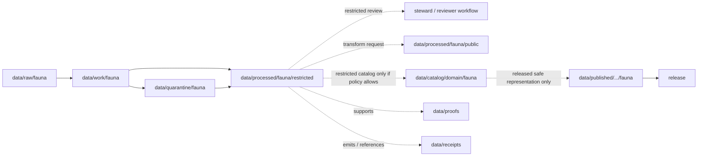

<!-- [KFM_META_BLOCK_V2]
doc_id: kfm://doc/data-processed-fauna-restricted-readme
title: data/processed/fauna/restricted/README.md — Fauna Restricted Processed Data README
version: v0.1
type: readme; data-lifecycle-sublane; processed-stage-guide; fauna-domain-lane; restricted-access-lane; geoprivacy-gated
status: draft; PROPOSED; data-root; processed-stage; fauna; restricted; reviewer-only; named-agreement; sensitivity-aware; deny-by-default; release-gated; access-controlled
owners: OWNER_TBD — Fauna steward · Sensitivity reviewer · Rights-holder representative · Access-control steward · Data steward · Pipeline steward · Evidence steward · Policy steward · Release steward · Docs steward
created: NEEDS VERIFICATION — one-character placeholder existed before v0.1 expansion
updated: 2026-06-25
policy_label: public-doc; data; processed; fauna; restricted; geoprivacy; access-controlled; deny-by-default
tags: [kfm, data, processed, fauna, restricted, reviewer-only, named-agreement, T2, T3, T4, sensitive-occurrence, sensitive-site, steward-controlled, geoprivacy, sensitivity, rare-species, RedactionReceipt, ReviewRecord, PolicyDecision, CorrectionNotice, RAW, WORK, QUARANTINE, PROCESSED, CATALOG, TRIPLET, PUBLISHED, EvidenceBundle, SourceDescriptor]
related:
  - ../README.md
  - ../public/README.md
  - ../../README.md
  - ../../../README.md
  - ../../../../docs/domains/fauna/README.md
  - ../../../../docs/domains/fauna/SENSITIVITY.md
  - ../../../../docs/adr/ADR-0010-deny-by-default-for-dna-rare-species-archaeology-infrastructure.md
  - ../../../../policy/domains/fauna/
  - ../../../../policy/sensitivity/fauna/
  - ../../../../contracts/domains/fauna/
  - ../../../../schemas/contracts/v1/domains/fauna/
  - ../../../raw/fauna/
  - ../../../work/fauna/
  - ../../../quarantine/fauna/
  - ../../../catalog/domain/fauna/
  - ../../../catalog/stac/fauna/
  - ../../../catalog/dcat/fauna/
  - ../../../catalog/prov/fauna/
  - ../../../triplets/
  - ../../../published/
  - ../../../proofs/
  - ../../../receipts/
  - ../../../registry/sources/fauna/
  - ../../../../release/candidates/fauna/
  - ../../../../release/
  - ../../../../pipelines/domains/fauna/
  - ../../../../tools/validators/
notes:
  - "This file replaces a one-character placeholder at `data/processed/fauna/restricted/README.md`."
  - "This is a PROCESSED-stage restricted-access lane for fauna artifacts that may be reviewer-only, named-agreement, rights-holder controlled, or otherwise not public-safe. It is not a PUBLISHED lane, public API/UI output, public candidate shortcut, proof store, receipt store, policy authority, release authority, or permission to expose fauna data."
  - "Restricted artifacts must preserve source role, rights, sensitivity tier/rank, access basis, reviewer/rights-holder agreement linkage, evidence linkage, policy decision, correction path, and rollback target."
  - "T2 reviewer-only, T3 named-agreement, and T4 denied material must not be copied into public-candidate or published lanes without governed transition artifacts."
  - "Exact sensitive coordinates, nests, dens, roosts, hibernacula, spawning sites, steward-controlled records, and re-identifying joins remain fail-closed unless policy/review/agreement explicitly permits restricted handling."
  - "This README is a lane guide only. Policy decides admissibility; contracts define object meaning; schemas define machine shape; release/access records decide disclosure."
  - "Rollback target for this expansion is previous placeholder blob SHA `e25f1814e51579d5f55c0f1fe0135ddb28a47f4a`."
[/KFM_META_BLOCK_V2] -->

<a id="top"></a>

# data/processed/fauna/restricted

> Fauna PROCESSED-stage restricted-access lane for reviewer-only, named-agreement, steward-controlled, rights-restricted, or otherwise non-public fauna artifacts that have moved beyond RAW/WORK/QUARANTINE but remain closed to public clients unless a governed transition later authorizes a safer representation.

<p>
  
  
  
  
  
  
</p>

**Status:** draft / PROPOSED  
**Owners:** OWNER_TBD — Fauna steward · Sensitivity reviewer · Rights-holder representative · Access-control steward · Data steward · Pipeline steward · Evidence steward · Policy steward · Release steward · Docs steward  
**Path:** `data/processed/fauna/restricted/README.md`  
**Owning root:** `data/processed/`  
**Domain segment:** `fauna`  
**Sublane:** `restricted` / restricted-access processed fauna  
**Lifecycle stage:** `PROCESSED`  
**Exposure posture:** not public; access requires governed policy, role, reviewer, rights-holder, named-agreement, or steward authorization; any public representation requires a separate governed transition, redaction/generalization, catalog, release, correction, and rollback path.  
**Truth posture:** CONFIRMED target was a one-character placeholder · CONFIRMED Fauna doctrine has T2 reviewer-only, T3 named-agreement, and T4 denied tiers · CONFIRMED missing rights, unresolved sensitivity, or absent review state blocks public promotion · PROPOSED restricted processed-lane details · NEEDS VERIFICATION for actual child inventory, access-control enforcement, validators, fixtures, receipts, policy enforcement, release linkage, and governed route behavior.

**Quick jumps:** [Purpose](#purpose) · [Lifecycle boundary](#lifecycle-boundary) · [Repo fit](#repo-fit) · [Accepted contents](#accepted-contents) · [Exclusions](#exclusions) · [Restricted-lane requirements](#restricted-lane-requirements) · [Access and sensitivity guardrails](#access-and-sensitivity-guardrails) · [Directory map](#directory-map) · [Evidence ledger](#evidence-ledger) · [Validation checklist](#validation-checklist) · [Rollback](#rollback)

---

## Purpose

`data/processed/fauna/restricted/` holds processed fauna artifacts that have passed beyond RAW capture, WORK transforms, and QUARANTINE holds but remain non-public because of sensitivity, rights, steward control, named agreements, reviewer-only access, exact-location exposure, re-identification risk, or other policy constraints.

This lane is for restricted processed material that may support authenticated reviewer workflows, steward review, rights-holder review, correction work, policy evaluation, redaction/generalization planning, or restricted collaboration. It is not a public-candidate lane, not a release lane, and not a public access surface.

A restricted artifact may eventually support a public-safe derivative only by a governed transition that creates the required RedactionReceipt, AggregationReceipt where applicable, ReviewRecord, PolicyDecision, ReleaseManifest, correction path, and rollback target. The restricted source artifact remains restricted unless explicitly demoted, superseded, withdrawn, or transformed by policy.

## Lifecycle boundary

```text
RAW -> WORK / QUARANTINE -> PROCESSED -> CATALOG / TRIPLET -> PUBLISHED
```



`data/processed/fauna/restricted/` is upstream of any catalog, public-candidate, published, or release surface. It must not be used as a normal public map/API/UI/AI source.

## Repo fit

| Responsibility | Correct home | Rule |
|---|---|---|
| Raw observations, source-native downloads, occurrence exports, steward files, camera/acoustic payloads, source logs, or original geometry | `data/raw/fauna/` | Not this lane. |
| In-process joins, transforms, geoprivacy work, QA, reconciliation, redaction trials, scratch products, or notebooks | `data/work/fauna/` | Not this lane. |
| Unresolved sensitive, rights-unclear, source-role-unclear, malformed, disputed, unsafe, or not-yet-reviewed fauna material | `data/quarantine/fauna/` | Not this lane until minimally reviewed and admitted as restricted processed material. |
| Restricted processed fauna artifacts | `data/processed/fauna/restricted/` | This lane. |
| Public-candidate processed fauna artifacts | `data/processed/fauna/public/` | Only transformed, reviewed, policy-approved candidates move there. |
| Other processed fauna object/family lanes | `data/processed/fauna/<object-or-family>/` | Use object/family lanes when restricted posture is not the primary organizing concern. |
| Fauna catalog records | `data/catalog/domain/fauna/` | Downstream; restricted catalog exposure only if policy allows and route is role-gated. |
| Fauna STAC/DCAT/PROV records | `data/catalog/{stac,dcat,prov}/fauna/` | Downstream catalog projections if accepted and policy-admitted. |
| Fauna triplet/graph records | `data/triplets/.../fauna/` | Downstream graph stage; must not expose restricted geometry or joins. |
| Published public-safe fauna products | `data/published/.../fauna/` | Only release-approved safe derivatives, not restricted originals. |
| EvidenceBundle/proof records | `data/proofs/` | Separate proof family. |
| Source, run, transform, redaction, validation, policy, correction, access, and release receipts | `data/receipts/` | Separate receipt family. |
| Fauna source registry records | `data/registry/sources/fauna/` | Separate source authority. |
| Release candidates and release manifests | `release/candidates/fauna/`, `release/` | Separate publication authority. |
| Fauna contracts | `contracts/domains/fauna/` | Object meaning; not data. |
| Fauna schemas | `schemas/contracts/v1/domains/fauna/` | Machine shape; not data. |
| Fauna policy and sensitivity rules | `policy/domains/fauna/`, `policy/sensitivity/fauna/` | Admissibility authority; not data. |
| Validators, tests, fixtures, pipelines, apps, packages | `tools/validators/`, `tests/`, `fixtures/`, `pipelines/`, `apps/`, `packages/` | Separate roots. |

## Accepted contents

Restricted processed fauna artifacts may include:

- reviewer-only processed records requiring T2 role-gated access;
- named-agreement or rights-holder-controlled processed records requiring T3 access;
- T4 denied records admitted only for internal steward review, correction, or redaction planning when policy allows their processed handling;
- sensitive occurrence or sensitive-site derivatives whose exact geometry remains restricted and cannot enter public lanes;
- steward-controlled agency, tribal, landowner, research, or partner records where republication or broader disclosure is blocked by rights or agreement;
- re-identifying joins that are preserved for review or correction but must not become public-candidate data without transformation;
- restricted sidecars for sensitivity tier/rank, source role, rights, agreement reference, review state, access basis, policy decision, evidence references, validation status, correction path, and rollback target;
- README and manifest notes that explain local boundaries without becoming release manifests, proof bundles, source registry records, schemas, policy rules, validators, or public routes.

## Exclusions

Do not store these under `data/processed/fauna/restricted/`:

- RAW observations, source downloads, source-native geometry, steward originals, logs, screenshots, media payloads, or source exports.
- WORK/scratch redaction trials, unresolved geoprivacy experiments, intermediate joins, or transform-debug outputs.
- Quarantined material whose rights, sensitivity, source role, safety, or review state is too unresolved to admit even as restricted processed data.
- Public-candidate generalized or aggregated products after release-oriented transform review; those belong under `data/processed/fauna/public/` until published.
- Published public-safe products; those belong under `data/published/.../fauna/` after release.
- RedactionReceipt, AggregationReceipt, ReviewRecord, PolicyDecision, ValidationReport, ReleaseManifest, EvidenceBundle, proof records, catalog records, STAC/DCAT/PROV records, triplets/graph records, source registry records, schemas, policy rules, validators, tests, fixtures, pipelines, app/UI/API code, or packages.
- Public API/UI/tile payloads, direct downloads, Focus Mode answers, public map layers, enforcement aids, landowner/parcel targeting aids, hunting/fishing/legal advice, operational wildlife guidance, emergency alerts, or life-safety guidance.
- Redaction parameters, fuzzing radii, seeds, exact transform offsets, access credentials, secrets, private agreement terms, or implementation details that could aid exposure or unauthorized access.

## Restricted-lane requirements

PROPOSED until concrete validators and access-control enforcement are verified:

| Requirement | Meaning |
|---|---|
| Source trace | Each artifact should trace to SourceDescriptor or fauna source registry context. |
| Evidence linkage | Claims about species, occurrence, range, site, record status, access basis, transform, or review should resolve downstream to EvidenceBundle/proof context where appropriate. |
| Sensitivity posture | Every artifact should carry sensitivity tier/rank, denied/reviewer/restricted posture, and unresolved-sensitivity behavior. |
| Access basis | T2 reviewer, T3 named-agreement, T4 denied/internal-review, or equivalent access posture should be explicit. |
| Rights posture | Steward, agency, license, landowner, sovereignty, research, consent, and reuse rights should be resolved or held closed. |
| Review state | Sensitivity reviewer, fauna steward, rights-holder representative, and access-control review should be recorded where required. |
| Policy decision | Restricted processed status requires PolicyDecision/admissibility posture before non-quarantine handling where policy requires it. |
| Re-identification check | Joins with habitat, land parcel, infrastructure, people, time, rare taxa, or small cells must be checked for re-identification risk before any transition. |
| Audit trail | Access, correction, review, transform, demotion, withdrawal, and release-transition actions should be receipt-linked. |
| Public transition | Any public representation requires separate redaction/generalization/aggregation, ReviewRecord, PolicyDecision, ReleaseManifest, correction path, and rollback target. |

## Access and sensitivity guardrails

- Restricted does not mean public-candidate.
- T2 reviewer-only material must stay role-gated and correction-path active.
- T3 named-agreement material must stay limited to named authorized parties under recorded agreement.
- T4 denied material must not be released to any audience unless a governed transition permits a safer representation.
- Sensitive taxa, nests, dens, roosts, hibernacula, spawning sites, steward-controlled records, exact sensitive occurrence geometry, and re-identifying joins fail closed by default.
- Existence may be releasable without exact geometry only when steward review permits.
- Missing rights, unresolved sensitivity, absent review, missing agreement, or missing policy decision blocks public promotion.
- Source quality never overrides sensitivity, rights, or review state.
- Do not publish transform parameters, radii, seeds, offsets, secrets, credentials, or private agreement terms.
- Habitat, hydrology, infrastructure, parcel, people, source, and time joins can make otherwise restricted material more sensitive.
- Public clients and Focus Mode must not read this lane directly.

> [!CAUTION]
> Do not expose `data/processed/fauna/restricted/` directly as a public map, tile service, API, UI, download, Focus Mode answer, AI answer source, species-location service, landowner/parcel targeting aid, enforcement surface, or operational wildlife guidance. Restricted processed data is still inside the trust membrane.

## Directory map

Actual child inventory remains **NEEDS VERIFICATION**. Use this as a proposed local organization pattern only after confirming current repo convention and validators.

```text
data/processed/fauna/restricted/
├── README.md
├── reviewer_only/            # PROPOSED — T2 reviewer/steward-limited artifacts
├── named_agreement/          # PROPOSED — T3 named-party/rights-agreement artifacts
├── denied_internal_review/   # PROPOSED — T4 material allowed only for internal review/correction where policy allows
├── sensitive_sites/          # PROPOSED — nests/dens/roosts/hibernacula/spawning-site derivatives
├── steward_controlled/       # PROPOSED — agency/tribal/landowner/research restricted derivatives
├── reidentifying_joins/      # PROPOSED — restricted joins pending sensitivity review
├── access_links/             # PROPOSED — links to access decisions/agreements, not credential storage
├── reviews/                  # PROPOSED — review-link sidecars, not review authority
├── corrections/              # PROPOSED — correction-link sidecars, not receipt authority
├── _manifests/               # PROPOSED — lane-local non-release manifests only
└── _README_TODO.md           # PROPOSED — remove after actual child inventory is documented
```

## Evidence ledger

| Source | Status | Supports | Limits |
|---|---|---|---|
| Previous file | CONFIRMED | Target existed as a one-character placeholder. | Did not define restricted fauna processed boundaries. |
| `data/processed/README.md` | CONFIRMED | PROCESSED data is upstream of catalog, triplets, publication, and release and is not public by default. | Does not prove fauna child inventory or enforcement. |
| `docs/domains/fauna/SENSITIVITY.md` | CONFIRMED doctrine / PROPOSED implementation | Sensitive species default to DENY/ABSTAIN; T2 is reviewer-only, T3 named-agreement, T4 denied; transitions require ReviewRecord, PolicyDecision, agreements, and reversibility. | Binding decisions live in `policy/sensitivity/fauna/`; concrete parameters are deliberately not in docs. |
| `docs/domains/fauna/README.md` | CONFIRMED doctrine / PROPOSED implementation | Fauna owns taxonomy, occurrences, ranges, monitoring, sensitive sites, invasive species, geoprivacy, public-safe derivatives, and governed API surfaces. | Implementation maturity remains NEEDS VERIFICATION. |
| `data/processed/fauna/README.md` | CONFIRMED | Parent fauna processed lane currently exists only as a greenfield stub. | Does not define fauna processed boundaries yet. |
| `data/processed/fauna/public/README.md` | CONFIRMED sibling README | Public lane is public-candidate only and not published release. | Does not define restricted-lane inventory or access enforcement. |
| `policy/sensitivity/fauna/` | NEEDS VERIFICATION | Binding admissibility home named by Fauna docs. | Current policy files and enforcement were not verified in this task. |
| `contracts/domains/fauna/` and `schemas/contracts/v1/domains/fauna/` | NEEDS VERIFICATION | Expected object contract/schema homes. | Specific restricted-object files and validators were not verified in this task. |

## Validation checklist

- [ ] Confirm actual child directories under `data/processed/fauna/restricted/`.
- [ ] Confirm whether `restricted/` is the accepted restricted processed lane name or needs reconciliation with reviewer/named-agreement lanes.
- [ ] Confirm parent `data/processed/fauna/README.md` is expanded beyond stub.
- [ ] Confirm fauna object contracts and schemas for restricted artifacts.
- [ ] Confirm sensitivity tier/rank representation and canonical vocabulary.
- [ ] Confirm validators, fixtures, CI checks, and access-control enforcement for restricted fauna processed artifacts.
- [ ] Confirm SourceDescriptor/source registry linkage for every source-derived artifact.
- [ ] Confirm ReviewRecord, PolicyDecision, agreement reference, RedactionReceipt/AggregationReceipt where applicable, ValidationReport, CorrectionNotice, ReleaseManifest where transitioning, correction path, and rollback target.
- [ ] Confirm exact sensitive occurrence coordinates, nests, dens, roosts, hibernacula, spawning sites, steward-controlled records, re-identifying joins, private agreement terms, credentials, secrets, redaction parameters, transform secrets, and rights-unclear material cannot enter public routes.
- [ ] Confirm public-candidate transition from restricted material is governed, evidence-backed, sensitivity-safe, rights-safe, review-backed, release-linked, and reversible.
- [ ] Confirm public clients and Focus Mode cannot read this lane directly as public truth, public location service, public map, public tile, public API, public UI, or AI-answer source.

## Rollback

Rollback is required if this lane becomes a public output root, `data/published/` substitute, public-candidate shortcut, exact sensitive-location exposure path, transform-secret exposure path, agreement/credential exposure path, quarantine bypass, source-data root, proof store, receipt store, catalog root, triplet root, source-registry root, release-decision root, schema root, policy root, validator root, implementation root, public API shortcut, public UI shortcut, public tile shortcut, public exposure shortcut, enforcement aid, landowner/parcel targeting aid, operational wildlife guidance source, or life-safety guidance source.

Rollback target for this expansion: previous placeholder blob SHA `e25f1814e51579d5f55c0f1fe0135ddb28a47f4a`.

<p align="right"><a href="#top">Back to top</a></p>
