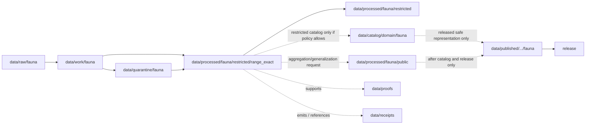

<!-- [KFM_META_BLOCK_V2]
doc_id: kfm://doc/data-processed-fauna-restricted-range-exact-readme
title: data/processed/fauna/restricted/range_exact/README.md — Fauna Restricted Exact Range Processed Data README
version: v0.1
type: readme; data-lifecycle-sublane; processed-stage-guide; fauna-domain-lane; restricted-access-lane; exact-range-lane; geoprivacy-gated
status: draft; PROPOSED; data-root; processed-stage; fauna; restricted; range-exact; exact-geometry; deny-by-default; access-controlled; release-gated
owners: OWNER_TBD — Fauna steward · Range steward · Sensitivity reviewer · Rights-holder representative · Access-control steward · Data steward · Pipeline steward · Evidence steward · Policy steward · Release steward · Docs steward
created: NEEDS VERIFICATION — one-character placeholder existed before v0.1 expansion
updated: 2026-06-25
policy_label: public-doc; data; processed; fauna; restricted; range-exact; geoprivacy; access-controlled; deny-by-default
tags: [kfm, data, processed, fauna, restricted, range-exact, range-polygon, exact-geometry, T1, T2, T3, T4, reviewer-only, named-agreement, geoprivacy, rare-species, AggregationReceipt, RedactionReceipt, ReviewRecord, PolicyDecision, CorrectionNotice, RAW, WORK, QUARANTINE, PROCESSED, CATALOG, TRIPLET, PUBLISHED, EvidenceBundle, SourceDescriptor]
related:
  - ../README.md
  - ../occurrences/README.md
  - ../../public/README.md
  - ../../public/occurrences_generalized/README.md
  - ../../README.md
  - ../../../README.md
  - ../../../../README.md
  - ../../../../../docs/domains/fauna/README.md
  - ../../../../../docs/domains/fauna/SENSITIVITY.md
  - ../../../../../docs/adr/ADR-0010-deny-by-default-for-dna-rare-species-archaeology-infrastructure.md
  - ../../../../../policy/domains/fauna/
  - ../../../../../policy/sensitivity/fauna/
  - ../../../../../contracts/domains/fauna/
  - ../../../../../schemas/contracts/v1/domains/fauna/
  - ../../../../raw/fauna/
  - ../../../../work/fauna/
  - ../../../../quarantine/fauna/
  - ../../../../catalog/domain/fauna/
  - ../../../../catalog/stac/fauna/
  - ../../../../catalog/dcat/fauna/
  - ../../../../catalog/prov/fauna/
  - ../../../../triplets/
  - ../../../../published/
  - ../../../../proofs/
  - ../../../../receipts/
  - ../../../../registry/sources/fauna/
  - ../../../../../release/candidates/fauna/
  - ../../../../../release/
  - ../../../../../pipelines/domains/fauna/
  - ../../../../../tools/validators/
notes:
  - "This file replaces a one-character placeholder at `data/processed/fauna/restricted/range_exact/README.md`."
  - "This is a child PROCESSED-stage lane under `data/processed/fauna/restricted/` for exact or raw-geometry range artifacts. It is not a public-candidate lane, generalized range lane, PUBLISHED lane, direct public API/UI output, source registry, proof store, receipt store, policy authority, release authority, or permission to expose range data."
  - "Fauna sensitivity doctrine treats RangePolygon as public-safe only after aggregation/generalization with AggregationReceipt or RedactionReceipt; raw exact geometry is denied by default."
  - "Exact range artifacts must preserve source role, rights, sensitivity tier/rank, exact-geometry posture, access basis, reviewer/rights-holder agreement linkage, evidence linkage, policy decision, correction path, and rollback target."
  - "Any public representation requires a separate governed transition to generalized, aggregated, redacted, withheld, or suppressed public-candidate artifacts with receipts and release controls."
  - "This README is a lane guide only. Policy decides admissibility; contracts define object meaning; schemas define machine shape; release/access records decide disclosure."
  - "Rollback target for this expansion is previous placeholder blob SHA `e25f1814e51579d5f55c0f1fe0135ddb28a47f4a`."
[/KFM_META_BLOCK_V2] -->

<a id="top"></a>

# data/processed/fauna/restricted/range_exact

> Fauna PROCESSED-stage child lane for restricted exact range artifacts: raw or exact-geometry range polygons, range envelopes, seasonal range boundaries, movement/range derivatives, or source-derived range geometries that have moved beyond RAW/WORK/QUARANTINE but remain non-public and access-controlled.

<p>
  
  
  
  
  
  
  
</p>

**Status:** draft / PROPOSED  
**Owners:** OWNER_TBD — Fauna steward · Range steward · Sensitivity reviewer · Rights-holder representative · Access-control steward · Data steward · Pipeline steward · Evidence steward · Policy steward · Release steward · Docs steward  
**Path:** `data/processed/fauna/restricted/range_exact/README.md`  
**Owning root:** `data/processed/`  
**Domain segment:** `fauna`  
**Parent lane:** `data/processed/fauna/restricted/`  
**Sublane:** `range_exact` / restricted exact range processed fauna  
**Lifecycle stage:** `PROCESSED`  
**Exposure posture:** not public; access requires governed policy, role, reviewer, rights-holder, named-agreement, or steward authorization. Any public representation requires aggregation/generalization/redaction/suppression plus catalog, release, correction, and rollback controls.  
**Truth posture:** CONFIRMED target was a one-character placeholder · CONFIRMED restricted parent lane is non-public and access-controlled · CONFIRMED Fauna sensitivity doctrine denies raw exact RangePolygon geometry by default and requires aggregated/generalized public-safe layers with AggregationReceipt or RedactionReceipt · PROPOSED exact-range child-lane details · NEEDS VERIFICATION for actual child inventory, object contracts, schemas, access-control enforcement, validators, fixtures, receipts, policy enforcement, release linkage, and governed route behavior.

**Quick jumps:** [Purpose](#purpose) · [Lifecycle boundary](#lifecycle-boundary) · [Repo fit](#repo-fit) · [Accepted contents](#accepted-contents) · [Exclusions](#exclusions) · [Exact-range requirements](#exact-range-requirements) · [Range guardrails](#range-guardrails) · [Directory map](#directory-map) · [Evidence ledger](#evidence-ledger) · [Validation checklist](#validation-checklist) · [Rollback](#rollback)

---

## Purpose

`data/processed/fauna/restricted/range_exact/` holds processed fauna range artifacts whose geometry, source, scale, taxon, time window, or steward terms make them unsuitable for public release in exact form.

This lane is for restricted processed range records that may support authenticated review, stewardship, rights-holder review, correction, audit, aggregation/generalization planning, conservation analysis, or restricted collaboration. It is not a public-candidate lane, not a publication lane, not a map-serving lane, and not a public access surface.

A restricted exact range artifact may later support a public-safe derivative only by a governed transition that creates the required AggregationReceipt or RedactionReceipt, ReviewRecord, PolicyDecision, ReleaseManifest, correction path, and rollback target. The exact range artifact remains restricted unless policy explicitly changes its status.

## Lifecycle boundary

```text
RAW -> WORK / QUARANTINE -> PROCESSED -> CATALOG / TRIPLET -> PUBLISHED
```



`data/processed/fauna/restricted/range_exact/` is upstream of any catalog, public-candidate, published, or release surface. It must not be used as a normal public map/API/UI/AI source.

## Repo fit

| Responsibility | Correct home | Rule |
|---|---|---|
| Raw range polygons, source-native range files, agency/steward source exports, original exact geometry, source logs, or source identifiers | `data/raw/fauna/` | Not this lane. |
| In-process range joins, dissolves, clipping, validation, geometry repair, aggregation, redaction trials, transform experiments, or scratch products | `data/work/fauna/` | Not this lane. |
| Unresolved sensitive, rights-unclear, source-role-unclear, malformed, disputed, unsafe, or not-yet-reviewed exact range material | `data/quarantine/fauna/` | Not this lane until minimally reviewed and admitted as restricted processed material. |
| Restricted exact range processed artifacts | `data/processed/fauna/restricted/range_exact/` | This lane. |
| Parent restricted fauna lane | `data/processed/fauna/restricted/` | Parent lane; still not public. |
| Public-candidate generalized/aggregated range products | `data/processed/fauna/public/` or an accepted child lane | Only transformed, reviewed, policy-approved candidates move there. |
| Restricted occurrence processed artifacts | `data/processed/fauna/restricted/occurrences/` | Occurrence records remain separate from range polygons. |
| Fauna catalog records | `data/catalog/domain/fauna/` | Downstream; restricted catalog exposure only if policy allows and route is role-gated. |
| Fauna STAC/DCAT/PROV records | `data/catalog/{stac,dcat,prov}/fauna/` | Downstream catalog projections if accepted and policy-admitted. |
| Fauna triplet/graph records | `data/triplets/.../fauna/` | Downstream graph stage; must not expose restricted geometry or joins. |
| Published public-safe fauna products | `data/published/.../fauna/` | Only release-approved safe derivatives, not restricted originals. |
| EvidenceBundle/proof records | `data/proofs/` | Separate proof family. |
| Source, run, transform, redaction, validation, policy, correction, access, and release receipts | `data/receipts/` | Separate receipt family. |
| Fauna source registry records | `data/registry/sources/fauna/` | Separate source authority. |
| Release candidates and release manifests | `release/candidates/fauna/`, `release/` | Separate publication authority. |
| Fauna contracts | `contracts/domains/fauna/` | Object meaning; not data. |
| Fauna schemas | `schemas/contracts/v1/domains/fauna/` | Machine shape; not data. |
| Fauna policy and sensitivity rules | `policy/domains/fauna/`, `policy/sensitivity/fauna/` | Admissibility authority; not data. |
| Validators, tests, fixtures, pipelines, apps, packages | `tools/validators/`, `tests/`, `fixtures/`, `pipelines/`, `apps/`, `packages/` | Separate roots. |

## Accepted contents

Restricted exact range artifacts may include:

- processed raw/exact range polygons that require T2 reviewer-only, T3 named-agreement, or T4 denied/internal-review handling;
- exact or high-resolution range boundaries where public exposure could reveal sensitive taxa, sites, movement corridors, seasonal habitat, breeding areas, or steward-controlled knowledge;
- source-derived seasonal range, migration corridor, denning/nesting/roosting area, spawning-area, concentration-area, or habitat-linked range geometries when exact geometry remains restricted;
- exact range geometries preserved for audit, correction, steward review, aggregation/generalization planning, or restricted collaboration;
- restricted sidecars for sensitivity tier/rank, source role, rights, agreement reference, review state, access basis, policy decision, evidence references, validation status, correction path, and rollback target;
- README and manifest notes that explain local boundaries without becoming release manifests, proof bundles, source registry records, schemas, policy rules, validators, or public routes.

## Exclusions

Do not store these under `data/processed/fauna/restricted/range_exact/`:

- RAW range source files, source-native geometry, steward originals, logs, screenshots, source exports, or original unprocessed downloads.
- WORK/scratch range generalization, geometry repair, dissolves, joins, clipping, redaction trials, or transform-debug outputs.
- Quarantined material whose rights, sensitivity, source role, safety, or review state is too unresolved to admit even as restricted processed data.
- Public-candidate generalized, aggregated, suppressed, or redacted range products after release-oriented transform review; those belong under `data/processed/fauna/public/` until published.
- Published public-safe range products; those belong under `data/published/.../fauna/` after release.
- Occurrence records that belong in `data/processed/fauna/restricted/occurrences/` or public generalized occurrence lanes.
- AggregationReceipt, RedactionReceipt, ReviewRecord, PolicyDecision, ValidationReport, ReleaseManifest, EvidenceBundle, proof records, catalog records, STAC/DCAT/PROV records, triplets/graph records, source registry records, schemas, policy rules, validators, tests, fixtures, pipelines, app/UI/API code, or packages.
- Public API/UI/tile payloads, direct downloads, Focus Mode answers, public map layers, enforcement aids, landowner/parcel targeting aids, hunting/fishing/legal advice, operational wildlife guidance, emergency alerts, or life-safety guidance.
- Redaction parameters, aggregation thresholds, small-cell thresholds, fuzzing radii, seeds, exact transform offsets, access credentials, secrets, private agreement terms, or implementation details that could aid exposure or unauthorized access.

## Exact-range requirements

PROPOSED until concrete validators and access-control enforcement are verified:

| Requirement | Meaning |
|---|---|
| Source trace | Each exact range artifact should trace to SourceDescriptor or fauna source registry context. |
| Evidence linkage | Claims about taxon, range, season, movement, geometry, source, access basis, transform, review, or correction should resolve downstream to EvidenceBundle/proof context where appropriate. |
| Range identity | Taxon, range type, time/season, geometry version, method/source basis, scale/resolution, and status should remain auditable without increasing exposure. |
| Sensitivity posture | Each artifact should carry sensitivity tier/rank, denied/reviewer/restricted posture, exact-geometry posture, and unresolved-sensitivity behavior. |
| Access basis | T2 reviewer, T3 named-agreement, T4 denied/internal-review, or equivalent access posture should be explicit. |
| Rights posture | Steward, agency, license, landowner, sovereignty, research, consent, and reuse rights should be resolved or held closed. |
| Review state | Sensitivity reviewer, fauna steward, rights-holder representative, range steward, and access-control review should be recorded where required. |
| Policy decision | Restricted processed status requires PolicyDecision/admissibility posture before non-quarantine handling where policy requires it. |
| Re-identification check | Joins with occurrences, habitat, parcel, infrastructure, people, time, rare taxa, small ranges, or small cells must be checked before any transition. |
| Audit trail | Access, correction, review, transform, demotion, withdrawal, and release-transition actions should be receipt-linked. |
| Public transition | Any public representation requires separate aggregation/generalization/redaction/suppression, ReviewRecord, PolicyDecision, ReleaseManifest, correction path, and rollback target. |

## Range guardrails

- Exact range does not mean public range.
- Raw exact RangePolygon geometry is denied by default for public exposure.
- Aggregated or generalized public-safe layers require AggregationReceipt or RedactionReceipt and review.
- T2 reviewer-only exact range material must stay role-gated and correction-path active.
- T3 named-agreement exact range material must stay limited to named authorized parties under recorded agreement.
- T4 denied exact range material must not be released to any audience unless a governed transition permits a safer representation.
- Sensitive taxa, seasonal ranges, breeding/denning/nesting/roosting/spawning contexts, small ranges, steward-controlled range records, exact range geometry, and re-identifying joins fail closed by default.
- Missing rights, unresolved sensitivity, absent review, missing agreement, missing aggregation/redaction receipt, or missing policy decision blocks public promotion.
- Source quality never overrides sensitivity, rights, or review state.
- Do not publish transform parameters, thresholds, radii, seeds, offsets, secrets, credentials, private agreement terms, or source details that could assist re-identification.
- Habitat, hydrology, infrastructure, parcel, people, source, occurrence, method, season, and time joins can make range records more sensitive.
- Public clients and Focus Mode must not read this lane directly.

> [!CAUTION]
> Do not expose `data/processed/fauna/restricted/range_exact/` directly as a public map, tile service, API, UI, download, Focus Mode answer, AI answer source, species-range service, landowner/parcel targeting aid, enforcement surface, or operational wildlife guidance. Exact range data remains inside the trust membrane.

## Directory map

Actual child inventory remains **NEEDS VERIFICATION**. Use this as a proposed local organization pattern only after confirming current repo convention and validators.

```text
data/processed/fauna/restricted/range_exact/
├── README.md
├── polygons/                 # PROPOSED — restricted exact range polygons
├── seasonal_ranges/          # PROPOSED — exact seasonal ranges where policy allows restricted handling
├── movement_corridors/       # PROPOSED — exact movement/corridor ranges if admitted as restricted
├── sensitive_contexts/       # PROPOSED — breeding/denning/nesting/roosting/spawning context ranges
├── steward_controlled/       # PROPOSED — agency/tribal/landowner/research restricted ranges
├── reidentifying_joins/      # PROPOSED — restricted range joins pending sensitivity review
├── access_links/             # PROPOSED — links to access decisions/agreements, not credential storage
├── reviews/                  # PROPOSED — review-link sidecars, not review authority
├── corrections/              # PROPOSED — correction-link sidecars, not receipt authority
├── _manifests/               # PROPOSED — lane-local non-release manifests only
└── _README_TODO.md           # PROPOSED — remove after actual child inventory is documented
```

## Evidence ledger

| Source | Status | Supports | Limits |
|---|---|---|---|
| Previous file | CONFIRMED | Target existed as a one-character placeholder. | Did not define restricted exact range boundaries. |
| `docs/domains/fauna/SENSITIVITY.md` | CONFIRMED doctrine / PROPOSED implementation | RangePolygon defaults to T1 only after public-safe aggregation/generalization; raw exact geometry is denied by default; geoprivacy transforms require receipts. | Binding decisions live in `policy/sensitivity/fauna/`; concrete parameters are deliberately not in docs. |
| `data/processed/fauna/restricted/README.md` | CONFIRMED parent README | Restricted parent lane is non-public, access-controlled, and requires governed transition for any public-safe derivative. | Does not prove child inventory or access-control enforcement. |
| `data/processed/fauna/restricted/occurrences/README.md` | CONFIRMED sibling README | Restricted occurrence records are separate from restricted range geometries. | Does not define exact range inventory. |
| `data/processed/fauna/public/occurrences_generalized/README.md` | CONFIRMED sibling/related README | Public-candidate generalized occurrence artifacts remain separate and not published by default. | Does not authorize public range release. |
| `policy/sensitivity/fauna/` | NEEDS VERIFICATION | Binding admissibility home named by Fauna docs. | Current policy files and enforcement were not verified in this task. |
| `contracts/domains/fauna/` and `schemas/contracts/v1/domains/fauna/` | NEEDS VERIFICATION | Expected range contract/schema homes. | Specific range object files and validators were not verified in this task. |

## Validation checklist

- [ ] Confirm actual child directories under `data/processed/fauna/restricted/range_exact/`.
- [ ] Confirm whether `range_exact/` is the accepted restricted exact range lane name or should be reconciled with object-family naming such as `range_polygons/`.
- [ ] Confirm parent `data/processed/fauna/README.md` is expanded beyond stub.
- [ ] Confirm range object contracts and schemas for exact range artifacts.
- [ ] Confirm sensitivity tier/rank representation and canonical vocabulary.
- [ ] Confirm validators, fixtures, CI checks, and access-control enforcement for restricted exact range artifacts.
- [ ] Confirm SourceDescriptor/source registry linkage for every source-derived range artifact.
- [ ] Confirm ReviewRecord, PolicyDecision, agreement reference, AggregationReceipt/RedactionReceipt where applicable, ValidationReport, CorrectionNotice, ReleaseManifest where transitioning, correction path, and rollback target.
- [ ] Confirm raw exact RangePolygon geometry, source-native geometry, seasonal sensitive range boundaries, small ranges, steward-controlled range records, re-identifying joins, private agreement terms, credentials, secrets, thresholds, redaction parameters, transform secrets, and rights-unclear material cannot enter public routes.
- [ ] Confirm public-candidate transition from restricted exact range material is governed, evidence-backed, sensitivity-safe, rights-safe, review-backed, release-linked, and reversible.
- [ ] Confirm public clients and Focus Mode cannot read this lane directly as public truth, public range service, public map, public tile, public API, public UI, or AI-answer source.

## Rollback

Rollback is required if this lane becomes a public output root, `data/published/` substitute, public-candidate shortcut, exact range exposure path, transform-secret exposure path, agreement/credential exposure path, quarantine bypass, source-data root, proof store, receipt store, catalog root, triplet root, source-registry root, release-decision root, schema root, policy root, validator root, implementation root, public API shortcut, public UI shortcut, public tile shortcut, public exposure shortcut, enforcement aid, landowner/parcel targeting aid, operational wildlife guidance source, or life-safety guidance source.

Rollback target for this expansion: previous placeholder blob SHA `e25f1814e51579d5f55c0f1fe0135ddb28a47f4a`.

<p align="right"><a href="#top">Back to top</a></p>
