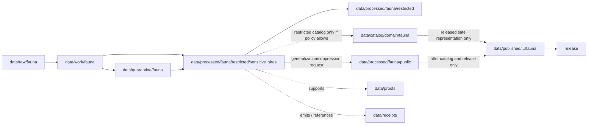

<!-- [KFM_META_BLOCK_V2]
doc_id: kfm://doc/data-processed-fauna-restricted-sensitive-sites-readme
title: data/processed/fauna/restricted/sensitive_sites/README.md — Fauna Restricted Sensitive Sites Processed Data README
version: v0.1
type: readme; data-lifecycle-sublane; processed-stage-guide; fauna-domain-lane; restricted-access-lane; sensitive-site-lane; geoprivacy-gated
status: draft; PROPOSED; data-root; processed-stage; fauna; restricted; sensitive-sites; exact-site-geometry; deny-by-default; access-controlled; review-gated; release-gated
owners: OWNER_TBD — Fauna steward · Sensitive-site steward · Sensitivity reviewer · Rights-holder representative · Access-control steward · Data steward · Pipeline steward · Evidence steward · Policy steward · Release steward · Docs steward
created: NEEDS VERIFICATION — blank placeholder existed before v0.1 expansion
updated: 2026-06-25
policy_label: public-doc; data; processed; fauna; restricted; sensitive-sites; geoprivacy; access-controlled; deny-by-default
tags: [kfm, data, processed, fauna, restricted, sensitive-sites, nest, den, roost, hibernacula, spawning-site, exact-geometry, T2, T3, T4, reviewer-only, named-agreement, geoprivacy, rare-species, RedactionReceipt, ReviewRecord, PolicyDecision, CorrectionNotice, RAW, WORK, QUARANTINE, PROCESSED, CATALOG, TRIPLET, PUBLISHED, EvidenceBundle, SourceDescriptor]
related:
  - ../README.md
  - ../occurrences/README.md
  - ../range_exact/README.md
  - ../../public/README.md
  - ../../public/occurrences_generalized/README.md
  - ../../README.md
  - ../../../README.md
  - ../../../../README.md
  - ../../../../../docs/domains/fauna/README.md
  - ../../../../../docs/domains/fauna/SENSITIVITY.md
  - ../../../../../docs/adr/ADR-0010-deny-by-default-for-dna-rare-species-archaeology-infrastructure.md
  - ../../../../../policy/domains/fauna/
  - ../../../../../policy/sensitivity/fauna/
  - ../../../../../contracts/domains/fauna/
  - ../../../../../schemas/contracts/v1/domains/fauna/
  - ../../../../raw/fauna/
  - ../../../../work/fauna/
  - ../../../../quarantine/fauna/
  - ../../../../catalog/domain/fauna/
  - ../../../../catalog/stac/fauna/
  - ../../../../catalog/dcat/fauna/
  - ../../../../catalog/prov/fauna/
  - ../../../../triplets/
  - ../../../../published/
  - ../../../../proofs/
  - ../../../../receipts/
  - ../../../../registry/sources/fauna/
  - ../../../../../release/candidates/fauna/
  - ../../../../../release/
  - ../../../../../pipelines/domains/fauna/
  - ../../../../../tools/validators/
notes:
  - "This file replaces a blank placeholder at `data/processed/fauna/restricted/sensitive_sites/README.md`."
  - "This is a child PROCESSED-stage lane under `data/processed/fauna/restricted/` for sensitive-site artifacts such as nests, dens, roosts, hibernacula, spawning sites, and comparable site records. It is not a public-candidate lane, PUBLISHED lane, direct public API/UI output, source registry, proof store, receipt store, policy authority, release authority, or permission to expose site data."
  - "Fauna sensitivity doctrine treats SensitiveSite exact geometry as T4 by default. Reviewer-only T2 access requires PolicyDecision + ReviewRecord; public-safe T1 representation requires generalization or suppression plus RedactionReceipt and review."
  - "Sensitive-site artifacts must preserve source role, rights, sensitivity tier/rank, exact-geometry posture, access basis, reviewer/rights-holder agreement linkage, evidence linkage, policy decision, correction path, and rollback target."
  - "Exact site geometry, site identifiers, field-access details, steward-controlled records, re-identifying joins, and transform parameters must remain fail-closed unless policy/review/agreement explicitly permits restricted handling."
  - "This README is a lane guide only. Policy decides admissibility; contracts define object meaning; schemas define machine shape; release/access records decide disclosure."
  - "Rollback target for this expansion is previous blank placeholder blob SHA `8b137891791fe96927ad78e64b0aad7bded08bdc`."
[/KFM_META_BLOCK_V2] -->

<a id="top"></a>

# data/processed/fauna/restricted/sensitive_sites

> Fauna PROCESSED-stage child lane for restricted sensitive-site artifacts: nests, dens, roosts, hibernacula, spawning sites, breeding/aggregation sites, and comparable site records that have moved beyond RAW/WORK/QUARANTINE but remain non-public and access-controlled.

<p>
  
  
  
  
  
  
  
</p>

**Status:** draft / PROPOSED  
**Owners:** OWNER_TBD — Fauna steward · Sensitive-site steward · Sensitivity reviewer · Rights-holder representative · Access-control steward · Data steward · Pipeline steward · Evidence steward · Policy steward · Release steward · Docs steward  
**Path:** `data/processed/fauna/restricted/sensitive_sites/README.md`  
**Owning root:** `data/processed/`  
**Domain segment:** `fauna`  
**Parent lane:** `data/processed/fauna/restricted/`  
**Sublane:** `sensitive_sites` / restricted sensitive-site processed fauna  
**Lifecycle stage:** `PROCESSED`  
**Exposure posture:** not public; access requires governed policy, reviewer/steward role, rights-holder authorization, named agreement where applicable, or other documented access basis. Any public representation requires generalization, suppression, redaction, catalog, release, correction, and rollback controls.  
**Truth posture:** CONFIRMED target was a blank placeholder · CONFIRMED Fauna doctrine treats sensitive-site exact geometry as T4 by default · CONFIRMED unresolved sensitivity, rights, or review state blocks public promotion · PROPOSED sensitive-site child-lane details · NEEDS VERIFICATION for actual child inventory, object contracts, schemas, access-control enforcement, validators, fixtures, receipts, policy enforcement, release linkage, and governed route behavior.

**Quick jumps:** [Purpose](#purpose) · [Lifecycle boundary](#lifecycle-boundary) · [Repo fit](#repo-fit) · [Accepted contents](#accepted-contents) · [Exclusions](#exclusions) · [Sensitive-site requirements](#sensitive-site-requirements) · [Site guardrails](#site-guardrails) · [Directory map](#directory-map) · [Evidence ledger](#evidence-ledger) · [Validation checklist](#validation-checklist) · [Rollback](#rollback)

---

## Purpose

`data/processed/fauna/restricted/sensitive_sites/` holds processed fauna sensitive-site artifacts that are not public-safe because of exact site geometry, species sensitivity, site function, rights, steward control, named agreement, reviewer-only access, re-identification risk, or other policy constraints.

This lane is for restricted processed site records that may support authenticated review, stewardship, rights-holder review, correction, audit, redaction/generalization planning, conservation analysis, or restricted collaboration. It is not a public-candidate lane, not a publication lane, not a map-serving lane, and not a public access surface.

A restricted sensitive-site artifact may later support a public-safe derivative only by a governed transition that creates the required RedactionReceipt, ReviewRecord, PolicyDecision, ReleaseManifest where applicable, correction path, and rollback target. The exact site artifact remains restricted unless policy explicitly changes its status.

## Lifecycle boundary

```text
RAW -> WORK / QUARANTINE -> PROCESSED -> CATALOG / TRIPLET -> PUBLISHED
```



`data/processed/fauna/restricted/sensitive_sites/` is upstream of any catalog, public-candidate, published, or release surface. It must not be used as a normal public map/API/UI/AI source.

## Repo fit

| Responsibility | Correct home | Rule |
|---|---|---|
| Raw sensitive-site records, source-native site files, steward originals, agency/partner exports, field notes, source logs, source identifiers, original exact geometry, or media | `data/raw/fauna/` | Not this lane. |
| In-process sensitive-site joins, matching, QA, reconciliation, redaction trials, generalization experiments, field-review scratch products, or notebooks | `data/work/fauna/` | Not this lane. |
| Unresolved sensitive, rights-unclear, source-role-unclear, malformed, disputed, unsafe, or not-yet-reviewed site material | `data/quarantine/fauna/` | Not this lane until minimally reviewed and admitted as restricted processed material. |
| Restricted sensitive-site processed artifacts | `data/processed/fauna/restricted/sensitive_sites/` | This lane. |
| Parent restricted fauna lane | `data/processed/fauna/restricted/` | Parent lane; still not public. |
| Restricted occurrence processed artifacts | `data/processed/fauna/restricted/occurrences/` | Occurrence records remain separate from sensitive-site records. |
| Restricted exact range processed artifacts | `data/processed/fauna/restricted/range_exact/` | Range polygons remain separate from site records. |
| Public-candidate generalized/suppressed site products | `data/processed/fauna/public/` or accepted child lane | Only transformed, reviewed, policy-approved candidates move there. |
| Fauna catalog records | `data/catalog/domain/fauna/` | Downstream; restricted catalog exposure only if policy allows and route is role-gated. |
| Fauna STAC/DCAT/PROV records | `data/catalog/{stac,dcat,prov}/fauna/` | Downstream catalog projections if accepted and policy-admitted. |
| Fauna triplet/graph records | `data/triplets/.../fauna/` | Downstream graph stage; must not expose restricted geometry or joins. |
| Published public-safe fauna products | `data/published/.../fauna/` | Only release-approved safe derivatives, not restricted originals. |
| EvidenceBundle/proof records | `data/proofs/` | Separate proof family. |
| Source, run, transform, redaction, validation, policy, correction, access, and release receipts | `data/receipts/` | Separate receipt family. |
| Fauna source registry records | `data/registry/sources/fauna/` | Separate source authority. |
| Release candidates and release manifests | `release/candidates/fauna/`, `release/` | Separate publication authority. |
| Fauna contracts | `contracts/domains/fauna/` | Object meaning; not data. |
| Fauna schemas | `schemas/contracts/v1/domains/fauna/` | Machine shape; not data. |
| Fauna policy and sensitivity rules | `policy/domains/fauna/`, `policy/sensitivity/fauna/` | Admissibility authority; not data. |
| Validators, tests, fixtures, pipelines, apps, packages | `tools/validators/`, `tests/`, `fixtures/`, `pipelines/`, `apps/`, `packages/` | Separate roots. |

## Accepted contents

Restricted sensitive-site artifacts may include:

- processed nest, den, roost, hibernacula, spawning-site, breeding-site, aggregation-site, or comparable sensitive-site records requiring T2 reviewer-only, T3 named-agreement, or T4 denied/internal-review handling;
- exact or high-resolution site geometries where public exposure could reveal sensitive taxa, site function, steward-controlled knowledge, access routes, private-land context, or vulnerable habitat;
- site records preserved for audit, correction, stewardship, rights-holder review, redaction/suppression planning, or restricted collaboration;
- re-identifying site joins preserved for review or correction but not for public use;
- restricted sidecars for sensitivity tier/rank, site type, source role, rights, agreement reference, review state, access basis, policy decision, evidence references, validation status, correction path, and rollback target;
- README and manifest notes that explain local boundaries without becoming release manifests, proof bundles, source registry records, schemas, policy rules, validators, or public routes.

## Exclusions

Do not store these under `data/processed/fauna/restricted/sensitive_sites/`:

- RAW sensitive-site records, source-native geometry, field notes, steward originals, logs, screenshots, media payloads, source exports, or original unprocessed downloads.
- WORK/scratch site matching, QA, geometry repair, joins, redaction trials, generalization experiments, or transform-debug outputs.
- Quarantined material whose rights, sensitivity, source role, safety, or review state is too unresolved to admit even as restricted processed data.
- Public-candidate generalized, suppressed, or redacted site products after release-oriented transform review; those belong under `data/processed/fauna/public/` until published.
- Published public-safe site products; those belong under `data/published/.../fauna/` after release.
- Occurrence records that belong in `data/processed/fauna/restricted/occurrences/` or public generalized occurrence lanes.
- Exact range polygons that belong in `data/processed/fauna/restricted/range_exact/`.
- RedactionReceipt, AggregationReceipt, ReviewRecord, PolicyDecision, ValidationReport, ReleaseManifest, EvidenceBundle, proof records, catalog records, STAC/DCAT/PROV records, triplets/graph records, source registry records, schemas, policy rules, validators, tests, fixtures, pipelines, app/UI/API code, or packages.
- Public API/UI/tile payloads, direct downloads, Focus Mode answers, public map layers, enforcement aids, landowner/parcel targeting aids, hunting/fishing/legal advice, operational wildlife guidance, emergency alerts, or life-safety guidance.
- Exact access routes, site identifiers, redaction parameters, aggregation thresholds, small-cell thresholds, fuzzing radii, seeds, exact transform offsets, access credentials, secrets, private agreement terms, or implementation details that could aid exposure or unauthorized access.

## Sensitive-site requirements

PROPOSED until concrete validators and access-control enforcement are verified:

| Requirement | Meaning |
|---|---|
| Source trace | Each sensitive-site artifact should trace to SourceDescriptor or fauna source registry context. |
| Evidence linkage | Claims about taxon, site type, site function, location posture, source, access basis, transform, review, or correction should resolve downstream to EvidenceBundle/proof context where appropriate. |
| Site identity | Taxon, site type, function, time/season, geometry version, method/source basis, scale/resolution, and status should remain auditable without increasing exposure. |
| Sensitivity posture | Each artifact should carry sensitivity tier/rank, denied/reviewer/restricted posture, exact-geometry posture, and unresolved-sensitivity behavior. |
| Access basis | T2 reviewer, T3 named-agreement, T4 denied/internal-review, or equivalent access posture should be explicit. |
| Rights posture | Steward, agency, license, landowner, sovereignty, research, consent, and reuse rights should be resolved or held closed. |
| Review state | Sensitivity reviewer, fauna steward, rights-holder representative, sensitive-site steward, and access-control review should be recorded where required. |
| Policy decision | Restricted processed status requires PolicyDecision/admissibility posture before non-quarantine handling where policy requires it. |
| Re-identification check | Joins with occurrences, range, habitat, parcel, infrastructure, people, time, rare taxa, site function, or small cells must be checked before any transition. |
| Audit trail | Access, correction, review, transform, demotion, withdrawal, and release-transition actions should be receipt-linked. |
| Public transition | Any public representation requires separate generalization/redaction/suppression, ReviewRecord, PolicyDecision, ReleaseManifest where applicable, correction path, and rollback target. |

## Site guardrails

- Sensitive-site does not mean public site.
- Exact sensitive-site geometry is T4 denied by default.
- T2 reviewer-only sensitive-site access requires PolicyDecision and ReviewRecord.
- T3 named-agreement sensitive-site access requires PolicyDecision, ReviewRecord, and agreement.
- Public-safe T1 representation requires generalization or suppression, RedactionReceipt, ReviewRecord, PolicyDecision where applicable, release record, correction path, and rollback target.
- Nests, dens, roosts, hibernacula, spawning sites, breeding/aggregation sites, site function, steward-controlled site records, exact site geometry, access routes, and re-identifying joins fail closed by default.
- Existence may be releasable without exact geometry only when steward review permits.
- Missing rights, unresolved sensitivity, absent review, missing agreement, missing redaction receipt, or missing policy decision blocks public promotion.
- Source quality never overrides sensitivity, rights, or review state.
- Do not publish transform parameters, thresholds, radii, seeds, offsets, secrets, credentials, private agreement terms, access routes, or source details that could assist re-identification.
- Habitat, hydrology, infrastructure, parcel, people, source, occurrence, range, method, season, and time joins can make site records more sensitive.
- Public clients and Focus Mode must not read this lane directly.

> [!CAUTION]
> Do not expose `data/processed/fauna/restricted/sensitive_sites/` directly as a public map, tile service, API, UI, download, Focus Mode answer, AI answer source, species-site service, landowner/parcel targeting aid, enforcement surface, or operational wildlife guidance. Sensitive-site data remains inside the trust membrane.

## Directory map

Actual child inventory remains **NEEDS VERIFICATION**. Use this as a proposed local organization pattern only after confirming current repo convention and validators.

```text
data/processed/fauna/restricted/sensitive_sites/
├── README.md
├── site_records/             # PROPOSED — restricted processed sensitive-site records
├── nests/                    # PROPOSED — nest records if policy allows restricted handling
├── dens/                     # PROPOSED — den records if policy allows restricted handling
├── roosts/                   # PROPOSED — roost records if policy allows restricted handling
├── hibernacula/              # PROPOSED — hibernacula records if policy allows restricted handling
├── spawning_sites/           # PROPOSED — spawning-site records if policy allows restricted handling
├── steward_controlled/       # PROPOSED — agency/tribal/landowner/research restricted site records
├── reidentifying_joins/      # PROPOSED — restricted site joins pending sensitivity review
├── access_links/             # PROPOSED — links to access decisions/agreements, not credential storage
├── reviews/                  # PROPOSED — review-link sidecars, not review authority
├── corrections/              # PROPOSED — correction-link sidecars, not receipt authority
├── _manifests/               # PROPOSED — lane-local non-release manifests only
└── _README_TODO.md           # PROPOSED — remove after actual child inventory is documented
```

## Evidence ledger

| Source | Status | Supports | Limits |
|---|---|---|---|
| Previous file | CONFIRMED | Target existed as a blank placeholder. | Did not define restricted sensitive-site boundaries. |
| `docs/domains/fauna/SENSITIVITY.md` | CONFIRMED doctrine / PROPOSED implementation | Exact sensitive-site geometry is T4 denied by default; T2 reviewer-only access requires PolicyDecision + ReviewRecord; public-safe representation requires generalization or suppression plus RedactionReceipt and review. | Binding decisions live in `policy/sensitivity/fauna/`; concrete parameters are deliberately not in docs. |
| `data/processed/fauna/restricted/README.md` | CONFIRMED parent README | Restricted parent lane is non-public, access-controlled, and requires governed transition for any public-safe derivative. | Does not prove child inventory or access-control enforcement. |
| `data/processed/fauna/restricted/occurrences/README.md` | CONFIRMED sibling README | Restricted occurrence records are separate from sensitive-site records. | Does not define sensitive-site inventory. |
| `data/processed/fauna/restricted/range_exact/README.md` | CONFIRMED sibling README | Restricted exact range geometry is separate from sensitive-site records. | Does not define sensitive-site inventory. |
| `policy/sensitivity/fauna/` | NEEDS VERIFICATION | Binding admissibility home named by Fauna docs. | Current policy files and enforcement were not verified in this task. |
| `contracts/domains/fauna/` and `schemas/contracts/v1/domains/fauna/` | NEEDS VERIFICATION | Expected sensitive-site contract/schema homes. | Specific sensitive-site object files and validators were not verified in this task. |

## Validation checklist

- [ ] Confirm actual child directories under `data/processed/fauna/restricted/sensitive_sites/`.
- [ ] Confirm whether `sensitive_sites/` is the accepted restricted sensitive-site lane name or should be reconciled with object-family naming.
- [ ] Confirm parent `data/processed/fauna/README.md` is expanded beyond stub.
- [ ] Confirm sensitive-site object contracts and schemas.
- [ ] Confirm sensitivity tier/rank representation and canonical vocabulary.
- [ ] Confirm validators, fixtures, CI checks, and access-control enforcement for restricted sensitive-site artifacts.
- [ ] Confirm SourceDescriptor/source registry linkage for every source-derived site artifact.
- [ ] Confirm ReviewRecord, PolicyDecision, agreement reference, RedactionReceipt where applicable, ValidationReport, CorrectionNotice, ReleaseManifest where transitioning, correction path, and rollback target.
- [ ] Confirm exact sensitive-site geometry, site identifiers, access routes, nests, dens, roosts, hibernacula, spawning sites, steward-controlled site records, re-identifying joins, private agreement terms, credentials, secrets, thresholds, redaction parameters, transform secrets, and rights-unclear material cannot enter public routes.
- [ ] Confirm public-candidate transition from restricted sensitive-site material is governed, evidence-backed, sensitivity-safe, rights-safe, review-backed, release-linked, and reversible.
- [ ] Confirm public clients and Focus Mode cannot read this lane directly as public truth, public site service, public map, public tile, public API, public UI, or AI-answer source.

## Rollback

Rollback is required if this lane becomes a public output root, `data/published/` substitute, public-candidate shortcut, exact sensitive-site exposure path, access-route exposure path, transform-secret exposure path, agreement/credential exposure path, quarantine bypass, source-data root, proof store, receipt store, catalog root, triplet root, source-registry root, release-decision root, schema root, policy root, validator root, implementation root, public API shortcut, public UI shortcut, public tile shortcut, public exposure shortcut, enforcement aid, landowner/parcel targeting aid, operational wildlife guidance source, or life-safety guidance source.

Rollback target for this expansion: previous blank placeholder blob SHA `8b137891791fe96927ad78e64b0aad7bded08bdc`.

<p align="right"><a href="#top">Back to top</a></p>
