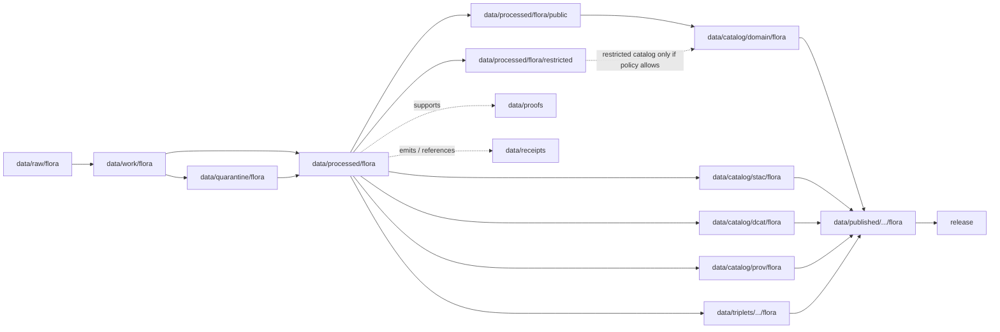

<!-- [KFM_META_BLOCK_V2]
doc_id: kfm://doc/data-processed-flora-readme
title: data/processed/flora/README.md — Flora Processed Data README
version: v0.1
type: readme; data-lifecycle-domain-lane; processed-stage-guide; flora-domain-root; geoprivacy-aware-lane-index
status: draft; PROPOSED; data-root; processed-stage; flora; plant-taxonomy; occurrence; specimen; rare-plant; vegetation-community; invasive-plant; phenology; range-distribution; habitat-association; sensitivity-aware; release-gated; evidence-first
authors: ChatGPT-5.5 Thinking; reviewed_by: OWNER_TBD
owners: OWNER_TBD — Flora steward · Botanical data steward · Sensitivity reviewer · Rights-holder representative · Data steward · Pipeline steward · Evidence steward · Policy steward · Release steward · Docs steward
created: NEEDS VERIFICATION — greenfield stub existed before v0.1 expansion
updated: 2026-06-25
policy_label: public-doc; data; processed; flora; lifecycle; governed; geoprivacy; sensitivity-aware; release-gated
tags: [kfm, data, processed, flora, plant-taxon, flora-occurrence, specimen-record, rare-plant-record, vegetation-community, invasive-plant-record, phenology-observation, range-polygon, distribution-surface, habitat-association, botanical-survey, restoration-planting, geoprivacy, RedactionReceipt, AggregationReceipt, ReviewRecord, PolicyDecision, ReleaseManifest, EvidenceBundle, SourceDescriptor, RAW, WORK, QUARANTINE, PROCESSED, CATALOG, TRIPLET, PUBLISHED]
related:
  - ../README.md
  - ../../README.md
  - ../../../docs/domains/flora/README.md
  - ../../../docs/domains/flora/PUBLICATION_AND_ROLLBACK.md
  - ../../../docs/domains/habitat/README.md
  - ../../../docs/domains/fauna/README.md
  - ../../../policy/domains/flora/
  - ../../../policy/sensitivity/flora/
  - ../../../contracts/domains/flora/
  - ../../../schemas/contracts/v1/domains/flora/
  - ../../raw/flora/
  - ../../work/flora/
  - ../../quarantine/flora/
  - ../../catalog/domain/flora/
  - ../../catalog/stac/flora/
  - ../../catalog/dcat/flora/
  - ../../catalog/prov/flora/
  - ../../triplets/
  - ../../published/
  - ../../proofs/
  - ../../receipts/
  - ../../registry/sources/flora/
  - ../../../release/candidates/flora/
  - ../../../release/
  - ../../../pipelines/domains/flora/
  - ../../../pipeline_specs/flora/
  - ../../../tools/validators/
notes:
  - "This file replaces a greenfield stub at `data/processed/flora/README.md`."
  - "This is the parent PROCESSED-stage domain lane for Flora artifacts. It is not RAW source storage, WORK scratch, QUARANTINE holding, CATALOG, TRIPLET, PUBLISHED, proof storage, source registry, policy authority, release authority, public API/UI output, public map/tile output, botanical advice, land-management instruction, or life-safety guidance."
  - "Flora processed artifacts must preserve source role, rights, taxonomic identity, occurrence/specimen basis, sensitivity posture, habitat/cross-domain ownership, evidence linkage, validation state, transform/review/policy receipt linkage, catalog readiness, release state, correction path, and rollback target before any public use."
  - "Rare, protected, culturally sensitive, and steward-reviewed flora default to generalized, withheld, staged, or denied public geometry until policy, review, receipts, and release support a safer representation."
  - "Flora may reference habitat, fauna, soil, hydrology, agriculture, and hazards through governed joins, but it does not own those object families or collapse their truth into Flora."
  - "This README is a parent lane guide and index. Child lane READMEs define local sublane boundaries; contracts define semantic object meaning; schemas define machine shape; policy decides admissibility; release records decide publication."
  - "Rollback target for this expansion is previous greenfield stub blob SHA `d1d6393f6de87b06a649b2303e0ccbe84faa93a7`."
[/KFM_META_BLOCK_V2] -->

<a id="top"></a>

# data/processed/flora

> Parent Flora PROCESSED-stage lane for normalized, source-traced, sensitivity-aware plant taxonomy, occurrence, specimen, rare/protected plant, vegetation-community, invasive-plant, phenology, range/distribution, habitat-association, botanical-survey, restoration-planting, public-candidate, and restricted artifacts that have passed beyond RAW/WORK/QUARANTINE but are not yet cataloged, triplet-projected, published, or released.

<p>
  
  
  
  
  
  
</p>

**Status:** draft / PROPOSED  
**Owners:** OWNER_TBD — Flora steward · Botanical data steward · Sensitivity reviewer · Rights-holder representative · Data steward · Pipeline steward · Evidence steward · Policy steward · Release steward · Docs steward  
**Path:** `data/processed/flora/README.md`  
**Owning root:** `data/processed/`  
**Domain segment:** `flora`  
**Lifecycle stage:** `PROCESSED`  
**Exposure posture:** not public by default; any public use requires governed catalog, evidence, sensitivity policy, rights posture, review state, redaction/aggregation/generalization receipt where applicable, PolicyDecision, ReleaseManifest, correction path, and rollback target.  
**Truth posture:** CONFIRMED target was a greenfield stub · CONFIRMED parent `data/processed/` is upstream of catalog/triplet/publication and is not a normal public surface · CONFIRMED Flora domain governs plant taxonomic identity, occurrences, specimens, rare/protected controls, invasive plants, phenology, vegetation surfaces, range/distribution products, habitat associations, and public-safe botanical outputs · PROPOSED parent-lane details and child-lane index · NEEDS VERIFICATION for actual child inventory, validators, fixtures, access-control enforcement, receipt families, policy enforcement, release linkage, and governed route behavior.

**Quick jumps:** [Purpose](#purpose) · [Lifecycle boundary](#lifecycle-boundary) · [Repo fit](#repo-fit) · [Lane index](#lane-index) · [Accepted contents](#accepted-contents) · [Exclusions](#exclusions) · [Flora processed requirements](#flora-processed-requirements) · [Sensitivity and cross-domain guardrails](#sensitivity-and-cross-domain-guardrails) · [Evidence ledger](#evidence-ledger) · [Validation checklist](#validation-checklist) · [Rollback](#rollback)

---

## Purpose

`data/processed/flora/` is the parent PROCESSED-stage lane for normalized Flora artifacts. It organizes processed outputs after source capture, extraction, taxonomic reconciliation, specimen/occurrence normalization, geoprivacy handling, vegetation classification, QA, redaction, aggregation, or review-oriented processing, while keeping those artifacts upstream of catalog, triplet, publication, release, proof closure, and public access.

This lane may contain or point to processed artifacts for:

- plant taxonomic identity and synonym/crosswalk products;
- flora occurrence and specimen evidence;
- rare, protected, culturally sensitive, and steward-reviewed plant records;
- vegetation-community records and botanical survey outputs;
- invasive plant records and public-reporting candidates;
- phenology observations and seasonal botanical context;
- range polygons, distribution surfaces, and public-safe range summaries;
- habitat associations that preserve Habitat-lane ownership;
- restoration plantings and management-context records where Flora owns the botanical record, not the management decision;
- public-candidate and restricted botanical derivatives that remain release-gated.

This parent README does not create a semantic contract, schema, validator, source registry, proof, receipt, policy decision, release decision, public map layer, public tile, public API route, public UI payload, botanical advice, restoration prescription, land-management instruction, or life-safety product.

## Lifecycle boundary

```text
RAW -> WORK / QUARANTINE -> PROCESSED -> CATALOG / TRIPLET -> PUBLISHED
```



`data/processed/flora/` is upstream of catalog, triplet, publication, and release. It must not be used as a normal public map/API/UI/AI source.

## Repo fit

| Responsibility | Correct home | Rule |
|---|---|---|
| Raw observations, source-native files, specimen exports, herbarium exports, steward originals, source media, source logs, original exact geometry, or source identifiers | `data/raw/flora/` | Not this lane. |
| In-process transforms, taxonomic reconciliation, joins, geoprivacy work, QA, redaction trials, notebooks, scratch outputs, or method experiments | `data/work/flora/` | Not this lane. |
| Unresolved sensitive, rights-unclear, source-role-unclear, malformed, disputed, culturally sensitive, steward-controlled, unsafe, or not-yet-reviewed flora material | `data/quarantine/flora/` | Not this lane until review/admission allows. |
| Normalized Flora processed artifacts | `data/processed/flora/` | This parent lane and child lanes. |
| Public-candidate processed Flora artifacts | `data/processed/flora/public/` if accepted | Still not published; release-gated. |
| Restricted processed Flora artifacts | `data/processed/flora/restricted/` if accepted | Non-public, access-controlled, fail-closed. |
| Flora catalog records | `data/catalog/domain/flora/` | Downstream catalog stage. |
| Flora STAC/DCAT/PROV records | `data/catalog/{stac,dcat,prov}/flora/` | Downstream catalog projections if accepted. |
| Flora triplet/graph records | `data/triplets/.../flora/` | Downstream graph stage; must not expose restricted geometry or unsafe joins. |
| Published public-safe Flora products | `data/published/.../flora/` | Downstream only after release. |
| EvidenceBundle/proof records | `data/proofs/` | Separate proof family. |
| Source, run, transform, redaction, aggregation, validation, policy, correction, access, and release receipts | `data/receipts/` | Separate receipt family. |
| Flora source registry records | `data/registry/sources/flora/` | Separate source authority. |
| Release candidates and release manifests | `release/candidates/flora/`, `release/` | Separate publication authority. |
| Flora contracts | `contracts/domains/flora/` | Object meaning; not data. |
| Flora schemas | `schemas/contracts/v1/domains/flora/` | Machine shape; not data. |
| Flora policy and sensitivity rules | `policy/domains/flora/`, `policy/sensitivity/flora/` | Admissibility authority; not data. |
| Validators, tests, fixtures, pipelines, pipeline specs, apps, packages | `tools/validators/`, `tests/`, `fixtures/`, `pipelines/`, `pipeline_specs/`, `apps/`, `packages/` | Separate roots. |

## Lane index

Known or intended child lanes under `data/processed/flora/` are listed below. Treat entries as **PROPOSED** unless current child READMEs, validators, fixtures, policies, receipts, access controls, and CI enforcement have been verified in the same implementation pass.

| Lane | Family | Purpose | Hard boundary |
|---|---|---|---|
| `taxonomy/` | Plant taxon identity | Accepted names, synonyms, taxonomic crosswalks, authority/source-linked identity products. | Taxonomy records do not prove occurrence, range, habitat, or release. |
| `occurrences/` | Flora occurrence evidence | Normalized plant observation/occurrence records. | Exact rare/protected plant locations require sensitivity controls. |
| `specimens/` | Specimen records | Herbarium/specimen-derived processed artifacts. | Specimen metadata may still expose sensitive location or collector/source restrictions. |
| `rare_plants/` | Rare/protected/sensitive flora | Rare-plant records and review-ready sensitive derivatives. | Public geometry defaults to generalized, withheld, staged, or denied until review/release. |
| `vegetation_communities/` | Vegetation-community records | Community classifications, vegetation polygons, plant-community evidence. | Habitat suitability and habitat patches remain Habitat-owned. |
| `invasive_plants/` | Invasive plant records | Public-reporting candidates and invasive-plant observations. | Private parcel/landowner joins require aggregation or restriction. |
| `phenology/` | Phenology observations | Flowering, fruiting, leaf-out, senescence, and seasonal botanical observations. | Phenology is not climate proof by itself. |
| `range_distribution/` | Range/distribution products | Range polygons, distribution surfaces, atlas products, and public-safe derivatives. | Exact sensitive ranges require geoprivacy and release gates. |
| `habitat_associations/` | Flora × habitat links | Links between plant taxa/occurrences and habitat/community context. | Habitat truth stays in Habitat lane; Flora only stores botanical association context. |
| `restoration_plantings/` | Restoration botanical records | Planting lists, seed mixes, restoration observations, and botanical evidence. | Restoration prescription/management decision is not created by this lane. |
| `public/` | Public-candidate Flora artifacts | Candidate public-safe botanical products. | `public/` means public-candidate, not published or released. |
| `restricted/` | Restricted Flora artifacts | Reviewer-only, rights-holder controlled, culturally sensitive, rare-plant, or steward-controlled artifacts. | Non-public, access-controlled, fail-closed. |

## Accepted contents

Processed Flora data may include:

- normalized tabular, spatial, temporal, textual, raster, vector, graph-ready, or review-ready botanical artifacts;
- source-role-tagged plant taxonomy, occurrence, specimen, rare-plant, vegetation-community, invasive-plant, phenology, range/distribution, habitat-association, botanical-survey, or restoration-planting products;
- redacted, generalized, aggregated, withheld, delayed-publication, or public-safe derivatives that still require catalog/release review before public use;
- restricted reviewer-only, named-agreement, rights-holder controlled, culturally sensitive, steward-controlled, or denied/internal-review processed artifacts admitted by policy;
- sidecar metadata needed to interpret processed artifacts when it is not a receipt, proof, policy decision, release manifest, source registry record, schema, validator, or catalog record;
- lane-local README or manifest notes that explain processed-data boundaries without becoming public outputs or authority records.

## Exclusions

Do not store these under `data/processed/flora/`:

- RAW source files, source-native downloads, steward originals, herbarium exports, source media, logs, original exact geometries, source identifiers, or unprocessed agency/partner exports.
- WORK/scratch files, notebooks, transform experiments, unresolved QA joins, geoprivacy trials, redaction-debug outputs, or taxonomic reconciliation scratch products.
- Quarantined or unresolved sensitive/rights/source-role material.
- Catalog records, STAC/DCAT/PROV records, triplet/graph records, published products, proof records, receipt records, source registry records, release decisions, schemas, policy rules, validators, tests, fixtures, pipelines, pipeline specs, app/UI/API code, or packages.
- Public API/UI/tile payloads, direct downloads, Focus Mode answers, public map layers, enforcement aids, landowner/parcel targeting aids, botanical/legal advice, restoration prescriptions, operational land-management guidance, emergency alerts, or life-safety guidance.
- Exact locations for rare, protected, culturally sensitive, or steward-controlled flora where policy/review/release does not allow disclosure.
- Redaction parameters, aggregation thresholds, small-cell thresholds, fuzzing radii, seeds, exact transform offsets, access credentials, secrets, private agreement terms, field access routes, or implementation details that could aid exposure or unauthorized access.
- AI-generated botanical narratives presented as authoritative without EvidenceBundle support and validated citations.

## Flora processed requirements

PROPOSED until concrete validators, policies, fixtures, receipts, and access-control enforcement are verified:

| Requirement | Meaning |
|---|---|
| Source trace | Each source-derived artifact should trace to SourceDescriptor or flora source registry context. |
| Evidence linkage | Claims about taxon, occurrence, specimen, range, vegetation community, source, transform, review, or release readiness should resolve downstream to EvidenceBundle/proof context where appropriate. |
| Taxonomic identity | Accepted name, synonym/crosswalk, authority, rank, taxon concept, and source-vintage posture should remain explicit where material. |
| Sensitivity posture | Each artifact should carry sensitivity tier/rank or equivalent posture, denied/reviewer/restricted/generalized/open posture, and unresolved-sensitivity behavior. |
| Rights posture | Steward, agency, herbarium, collector, landowner, sovereignty, research, consent, media, and reuse rights should be resolved or held closed. |
| Transform linkage | Redaction, aggregation, suppression, withholding, embargo, delayed publication, or public-safe generalization should link to the appropriate receipt family. |
| Review state | Sensitivity reviewer, flora steward, rights-holder representative, access-control reviewer, and release authority review should be recorded where required. |
| Policy decision | Restricted, public-candidate, and public transitions require PolicyDecision/admissibility posture where policy requires it. |
| Re-identification check | Joins with habitat, hydrology, soil, parcel, people, source, media, method, time, rare taxa, small populations, or small cells must be checked before any transition. |
| Catalog readiness | Processed Flora artifacts intended for discovery should promote through catalog/triplet lanes, not directly to public use. |
| Release readiness | Public use requires ReleaseManifest or release-linked state, published output path, correction path, and rollback target. |
| No public surface by default | Processed Flora artifacts must not be exposed directly as public maps, tiles, APIs, downloads, Focus Mode answers, or AI-answer sources. |

## Sensitivity and cross-domain guardrails

- Rare, protected, culturally sensitive, and steward-reviewed flora default to generalized, withheld, staged, or denied public geometry.
- Sensitive plant locations, small populations, private-land joins, culturally sensitive plant records, steward-controlled records, exact range geometry, and re-identifying joins fail closed until policy and review allow a safer representation.
- Source quality never overrides sensitivity, rights, access, or review state.
- Habitat patches, suitability surfaces, and habitat assignment remain Habitat-owned even when Flora references them.
- Fauna taxa, fauna occurrences, and faunal sensitive sites remain Fauna-owned.
- Soil, hydrology, agriculture, hazards, roads, settlements, archaeology, and people/DNA/land records keep their own truth and must not be collapsed into Flora products.
- Flora joins may reference other domains only when ownership, source role, sensitivity, EvidenceBundle support, and policy posture remain visible.
- T0/open or public-safe botanical data still requires standard release path, ReleaseManifest, review state, correction path, and rollback target before exposure.
- Do not publish transform parameters, thresholds, radii, seeds, offsets, secrets, credentials, private agreement terms, site identifiers, or access routes.
- Public clients and Focus Mode must use governed APIs, released artifacts, catalog/triplet records, EvidenceBundle-backed payloads, and policy-safe envelopes, not this directory directly.

> [!CAUTION]
> Do not expose `data/processed/flora/` directly as a public map, tile service, API, UI, download, Focus Mode answer, AI answer source, species-location service, landowner/parcel targeting aid, botanical/legal advice, restoration prescription, or operational land-management guidance. Processed flora data remains inside the trust membrane until governed promotion and release.

## Evidence ledger

| Source | Status | Supports | Limits |
|---|---|---|---|
| Previous file | CONFIRMED | Target existed as a greenfield stub. | Did not define Flora processed boundaries or child lanes. |
| `data/processed/README.md` | CONFIRMED | PROCESSED data is upstream of catalog, triplets, publication, and release and is not the normal public surface. | Does not prove Flora child inventory or enforcement. |
| `docs/domains/flora/README.md` | CONFIRMED doctrine / PROPOSED implementation | Flora governs plant taxonomic identity, occurrence/specimen evidence, rare/protected controls, invasive plants, phenology, vegetation surfaces, range/distribution products, habitat associations, public-safe outputs, and cross-domain ownership boundaries. | Implementation maturity remains NEEDS VERIFICATION. |
| `docs/domains/flora/PUBLICATION_AND_ROLLBACK.md` | NEEDS VERIFICATION | Named companion doc for publication and rollback. | This task did not inspect its contents. |
| `policy/sensitivity/flora/` and `policy/domains/flora/` | NEEDS VERIFICATION | Expected admissibility homes named by Flora docs. | Current policy files and enforcement were not verified in this task. |
| `contracts/domains/flora/` and `schemas/contracts/v1/domains/flora/` | NEEDS VERIFICATION | Expected object contract/schema homes for Flora families. | Specific object files and validators were not verified in this task. |

## Validation checklist

- [ ] Confirm actual child directories under `data/processed/flora/` and reconcile missing, duplicate, alias, legacy, or compatibility lanes.
- [ ] Confirm accepted processed Flora path convention for parent, taxonomy, occurrence, specimen, rare-plant, vegetation-community, invasive-plant, phenology, range/distribution, habitat-association, public-candidate, and restricted lanes.
- [ ] Confirm each child lane has README, owner, purpose, accepted contents, exclusions, guardrails, validation checklist, and rollback target.
- [ ] Confirm Flora object contracts and schema paths for plant taxon, flora occurrence, specimen record, rare plant record, vegetation community, invasive plant record, phenology observation, range polygon, distribution surface, habitat association, botanical survey, and restoration planting.
- [ ] Confirm sensitivity tier/rank representation and canonical vocabulary for Flora.
- [ ] Confirm validators, fixtures, CI checks, policy checks, and access-control enforcement for processed Flora artifacts.
- [ ] Confirm SourceDescriptor/source registry linkage for source-derived artifacts.
- [ ] Confirm RedactionReceipt, AggregationReceipt, ReviewRecord, PolicyDecision, ValidationReport, CorrectionNotice, ReleaseManifest, correction path, and rollback target where applicable.
- [ ] Confirm rare/protected/culturally sensitive exact locations, small populations, exact range geometry, steward-controlled records, re-identifying joins, private agreement terms, credentials, secrets, thresholds, redaction parameters, transform secrets, and rights-unclear material cannot enter public routes.
- [ ] Confirm public-candidate transitions from restricted material are governed, evidence-backed, sensitivity-safe, rights-safe, review-backed, release-linked, and reversible.
- [ ] Confirm no RAW, WORK, QUARANTINE, CATALOG, TRIPLET, PUBLISHED, proof, receipt, registry, release, schema, policy, validator, package, pipeline, app, API, public map, public tile, direct download, Focus Mode answer, landowner/parcel targeting aid, botanical advice, restoration prescription, operational land-management guidance, or life-safety artifact is misplaced here.
- [ ] Confirm public clients and Focus Mode cannot read this lane directly as public truth, public location service, public map, public tile, public API, public UI, or AI-answer source.

## Rollback

Rollback is required if this parent lane becomes a RAW source-data root, WORK scratch root, QUARANTINE bypass, public output root, `data/published/` substitute, public-candidate shortcut, exact sensitive-location exposure path, transform-secret exposure path, agreement/credential exposure path, proof store, receipt store, catalog root, triplet root, source-registry root, release-decision root, schema root, policy root, validator root, implementation root, public API shortcut, public UI shortcut, public tile shortcut, public exposure shortcut, landowner/parcel targeting aid, botanical advice source, restoration prescription source, operational land-management guidance source, or life-safety guidance source.

Rollback target for this expansion: previous greenfield stub blob SHA `d1d6393f6de87b06a649b2303e0ccbe84faa93a7`.

<p align="right"><a href="#top">Back to top</a></p>
