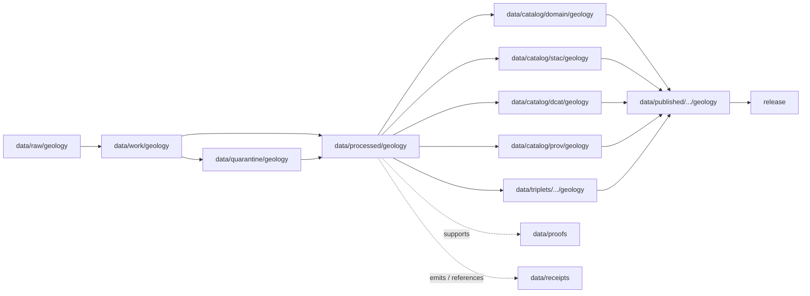

<!-- [KFM_META_BLOCK_V2]
doc_id: kfm://doc/data-processed-geology-readme
title: data/processed/geology/README.md — Geology Processed Data README
version: v0.1
type: readme; data-lifecycle-domain-lane; processed-stage-guide; geology-domain-root; natural-resources-lane-index
status: draft; PROPOSED; data-root; processed-stage; geology; natural-resources; stratigraphy; lithology; structures; subsurface; boreholes; well-logs; resource-context; anti-collapse; sensitivity-aware; release-gated; evidence-first
authors: ChatGPT-5.5 Thinking; reviewed_by: OWNER_TBD
owners: OWNER_TBD — Geology steward · Natural-resources steward · Subsurface data steward · Sensitivity reviewer · Rights steward · Data steward · Pipeline steward · Evidence steward · Policy steward · Release steward · Docs steward
created: NEEDS VERIFICATION — greenfield stub existed before v0.1 expansion
updated: 2026-06-25
policy_label: public-doc; data; processed; geology; lifecycle; governed; subsurface; natural-resources; anti-collapse; release-gated
tags: [kfm, data, processed, geology, natural-resources, geologic-unit, surficial-unit, lithology, stratigraphic-interval, geologic-age, structure-feature, borehole-reference, well-log-reference, core-sample-reference, geophysical-observation, geochemistry-sample-reference, mineral-occurrence, resource-deposit, resource-estimate, extraction-site, reclamation-record, cross-section, hydrostratigraphic-unit, anti-collapse, SourceDescriptor, EvidenceBundle, ValidationReport, PolicyDecision, ReleaseManifest, RAW, WORK, QUARANTINE, PROCESSED, CATALOG, TRIPLET, PUBLISHED]
related:
  - ../README.md
  - ../../README.md
  - ../../../docs/domains/geology/README.md
  - ../../../docs/domains/geology/POLICY.md
  - ../../../docs/domains/geology/PRESERVATION_MATRIX.md
  - ../../../docs/domains/geology/OPEN_QUESTIONS.md
  - ../../../docs/domains/soil/README.md
  - ../../../docs/domains/hydrology/README.md
  - ../../../docs/domains/hazards/README.md
  - ../../../docs/domains/archaeology/README.md
  - ../../../policy/domains/geology/
  - ../../../policy/sensitivity/geology/
  - ../../../contracts/domains/geology/
  - ../../../schemas/contracts/v1/domains/geology/
  - ../../raw/geology/
  - ../../work/geology/
  - ../../quarantine/geology/
  - ../../catalog/domain/geology/
  - ../../catalog/stac/geology/
  - ../../catalog/dcat/geology/
  - ../../catalog/prov/geology/
  - ../../triplets/
  - ../../published/
  - ../../proofs/
  - ../../receipts/
  - ../../registry/sources/geology/
  - ../../../release/candidates/geology/
  - ../../../release/
  - ../../../pipelines/domains/geology/
  - ../../../pipeline_specs/geology/
  - ../../../tools/validators/
notes:
  - "This file replaces a greenfield stub at `data/processed/geology/README.md`."
  - "This is the parent PROCESSED-stage domain lane for Geology and Natural Resources artifacts. It is not RAW source storage, WORK scratch, QUARANTINE holding, CATALOG, TRIPLET, PUBLISHED, proof storage, source registry, policy authority, release authority, public API/UI output, public map/tile output, extraction/legal advice, property-rights evidence, hazard warning, or life-safety guidance."
  - "Geology processed artifacts must preserve source role, rights, sensitivity posture, object-family distinction, time semantics, interpretation version, uncertainty, evidence linkage, validation state, catalog readiness, release state, correction path, and rollback target before public use."
  - "Anti-collapse is mandatory: Occurrence, Deposit, Estimate, Permit, Production, Reserve, and Reclamation claims must remain distinct in storage, evidence, graph projection, and public summaries."
  - "Exact borehole, sample, sensitive resource, well-log, private-well, operator/parcel, and subsurface-sensitive locations require restriction, generalization, or denial before public exposure."
  - "Geology may reference Soil, Hydrology, Hazards, People/Land, 3D/Planetary, and Archaeology through governed joins, but it does not own those object families or collapse their truth into Geology."
  - "This README is a parent lane guide and index. Child lane READMEs define local sublane boundaries; contracts define semantic object meaning; schemas define machine shape; policy decides admissibility; release records decide publication."
  - "Rollback target for this expansion is previous greenfield stub blob SHA `1e78fc7843dabdf5390ae6fcdd1cd3f3fa7f8172`."
[/KFM_META_BLOCK_V2] -->

<a id="top"></a>

# data/processed/geology

> Parent Geology and Natural Resources PROCESSED-stage lane for normalized, source-traced, role-typed, sensitivity-aware geologic map, stratigraphy, lithology, structure, subsurface, borehole, well-log, core/sample, geophysics, geochemistry, mineral/resource, extraction, reclamation, cross-section, and hydrostratigraphic artifacts that have passed beyond RAW/WORK/QUARANTINE but are not yet cataloged, triplet-projected, published, or released.

<p>
  
  
  
  
  
  
</p>

**Status:** draft / PROPOSED  
**Owners:** OWNER_TBD — Geology steward · Natural-resources steward · Subsurface data steward · Sensitivity reviewer · Rights steward · Data steward · Pipeline steward · Evidence steward · Policy steward · Release steward · Docs steward  
**Path:** `data/processed/geology/README.md`  
**Owning root:** `data/processed/`  
**Domain segment:** `geology`  
**Lifecycle stage:** `PROCESSED`  
**Exposure posture:** not public by default; any public use requires governed catalog, EvidenceBundle, source-role and rights posture, sensitivity/policy review, public-safe geometry where needed, ValidationReport, PolicyDecision, ReleaseManifest, correction path, and rollback target.  
**Truth posture:** CONFIRMED target was a greenfield stub · CONFIRMED parent `data/processed/` is upstream of catalog/triplet/publication and is not a normal public surface · CONFIRMED Geology domain governs geologic maps, stratigraphy, lithology, structures, subsurface observations, and resource context while preserving anti-collapse distinctions · PROPOSED parent-lane details and child-lane index · NEEDS VERIFICATION for actual child inventory, schemas, validators, fixtures, source descriptors, access-control enforcement, receipt families, policy enforcement, release linkage, and governed route behavior.

**Quick jumps:** [Purpose](#purpose) · [Lifecycle boundary](#lifecycle-boundary) · [Repo fit](#repo-fit) · [Lane index](#lane-index) · [Accepted contents](#accepted-contents) · [Exclusions](#exclusions) · [Geology processed requirements](#geology-processed-requirements) · [Anti-collapse and sensitivity guardrails](#anti-collapse-and-sensitivity-guardrails) · [Evidence ledger](#evidence-ledger) · [Validation checklist](#validation-checklist) · [Rollback](#rollback)

---

## Purpose

`data/processed/geology/` is the parent PROCESSED-stage lane for normalized Geology and Natural Resources artifacts. It organizes processed outputs after source capture, extraction, schema normalization, geometry normalization, geologic identity reconciliation, stratigraphic alignment, uncertainty annotation, rights review, public-safe geometry transform, or validation-oriented processing, while keeping those artifacts upstream of catalog, triplet, publication, release, proof closure, and public access.

This lane may contain or point to processed artifacts for:

- bedrock and surficial geologic units;
- lithology, stratigraphic intervals, geologic age, contacts, and boundary versions;
- faults, structures, geomorphology, and structural context;
- boreholes, well logs, cores, sample references, and subsurface observations;
- geophysical and geochemical observations;
- mineral occurrences, resource deposits, resource estimates, extraction sites, production context, permits, and reclamation records when their claim types remain distinct;
- cross-sections, subsurface interpretations, uncertainty surfaces, and 3D-ready context when interpretation version and EvidenceBundle linkage remain visible;
- hydrostratigraphic units that bridge to Hydrology without replacing hydrology measurements;
- public-candidate or restricted geology derivatives that remain release-gated.

This parent README does not create a semantic contract, schema, validator, source registry, proof, receipt, policy decision, release decision, public map layer, public tile, public API route, public UI payload, mineral-rights claim, property-rights claim, extraction advice, hazard warning, engineering certification, or life-safety product.

## Lifecycle boundary

```text
RAW -> WORK / QUARANTINE -> PROCESSED -> CATALOG / TRIPLET -> PUBLISHED
```



`data/processed/geology/` is upstream of catalog, triplet, publication, and release. It must not be used as a normal public map/API/UI/AI source.

## Repo fit

| Responsibility | Correct home | Rule |
|---|---|---|
| Raw geologic maps, source-native geodatabases, agency/steward exports, well-log files, source rasters, source tables, source media, source logs, original exact geometry, or source identifiers | `data/raw/geology/` | Not this lane. |
| In-process transforms, geometry repair, joins, stratigraphic matching, model experiments, redaction/generalization trials, QA, notebooks, or scratch products | `data/work/geology/` | Not this lane. |
| Unresolved rights, unresolved source role, sensitive exact locations, private-well data, operator/parcel joins, malformed files, disputed interpretations, or unsafe geology material | `data/quarantine/geology/` | Not this lane until review/admission allows. |
| Normalized Geology processed artifacts | `data/processed/geology/` | This parent lane and child lanes. |
| Geology catalog records | `data/catalog/domain/geology/` | Downstream catalog stage. |
| Geology STAC/DCAT/PROV records | `data/catalog/{stac,dcat,prov}/geology/` | Downstream catalog projections if accepted. |
| Geology triplet/graph records | `data/triplets/.../geology/` | Downstream graph stage; must not expose restricted geometry or collapsed claims. |
| Published public-safe Geology products | `data/published/.../geology/` | Downstream only after release. |
| EvidenceBundle/proof records | `data/proofs/` | Separate proof family. |
| Source, run, transform, redaction, validation, policy, correction, representation, access, and release receipts | `data/receipts/` | Separate receipt family. |
| Geology source registry records | `data/registry/sources/geology/` | Separate source authority. |
| Release candidates and release manifests | `release/candidates/geology/`, `release/` | Separate publication authority. |
| Geology contracts | `contracts/domains/geology/` | Object meaning; not data. |
| Geology schemas | `schemas/contracts/v1/domains/geology/` | Machine shape; not data. |
| Geology policy and sensitivity rules | `policy/domains/geology/`, `policy/sensitivity/geology/` if accepted | Admissibility authority; not data. |
| Validators, tests, fixtures, pipelines, pipeline specs, apps, packages | `tools/validators/`, `tests/`, `fixtures/`, `pipelines/`, `pipeline_specs/`, `apps/`, `packages/` | Separate roots. |

## Lane index

Known or intended child lanes under `data/processed/geology/` are listed below. Treat entries as **PROPOSED** unless current child READMEs, validators, fixtures, policies, receipts, access controls, and CI enforcement have been verified in the same implementation pass.

| Lane | Family | Purpose | Hard boundary |
|---|---|---|---|
| `geologic_units/` | GeologicUnit / SurficialUnit | Bedrock and surficial unit polygons, attribution, contacts, and unit versions. | Unit polygons are not source proof or release by themselves. |
| `lithology/` | Lithology | Material descriptors for units, intervals, samples, and logs. | Lithology does not prove deposit, reserve, or extraction status. |
| `stratigraphy/` | StratigraphicInterval / GeologicAge | Named intervals, age models, bounded contacts, and correlation context. | Interpretations require source/date/version/uncertainty. |
| `structures/` | StructureFeature / FaultStructure | Faults, folds, contacts, structural features, and confidence. | Geology provides context; Hazards owns risk. |
| `boreholes/` | BoreholeReference | Borehole references and processed subsurface observation anchors. | Exact borehole/private-well locations are restricted/generalized by default. |
| `well_logs/` | WellLogReference | Well-log references, tops, LAS-derived summaries, and rights-controlled log context. | Rights-controlled logs fail closed without confirmed terms. |
| `cores_samples/` | CoreSampleReference / GeochemistrySampleReference | Core, sample, and geochemical sample references. | Exact sample locations may require restriction/generalization. |
| `geophysics/` | GeophysicalObservation | Field, raster, volume, or remote-sensed geophysical observations. | Sensitive geophysics may be restricted; model/observation roles stay distinct. |
| `geochemistry/` | GeochemistrySampleReference | Geochemical observations and analyte summaries. | Sample data is not deposit, estimate, reserve, or claim proof by itself. |
| `minerals/` | MineralOccurrence | Documented mineral occurrence records. | Occurrence is not deposit, estimate, reserve, permit, production, or extraction. |
| `resources/` | ResourceDeposit / ResourceEstimate | Deposit characterization and resource-estimate candidates. | Deposit, estimate, reserve, and production claims must remain separate. |
| `extraction/` | ExtractionSite / permit / production context | Extraction-site and regulatory/extraction context. | Permit is not production; production is not reserve; land/title truth is not Geology-owned. |
| `reclamation/` | ReclamationRecord | Reclamation status, plan, observations, and correction context. | Reclamation record is not closure attestation unless evidence and authority support it. |
| `cross_sections/` | CrossSection | Interpretive cross-section products with uncertainty and versioning. | Cross-sections are interpretations, not attestations. |
| `hydrostratigraphy/` | HydrostratigraphicUnit | Geology ↔ Hydrology bridge objects. | Does not replace hydrology measurements or Hydrology authority. |
| `public/` | Public-candidate geology products | Public-safe generalized maps and released-candidate derivatives. | `public/` means public-candidate if present, not published or released. |
| `restricted/` | Restricted geology products | Exact subsurface, private-well, rights-controlled, sensitive resource, or role-gated artifacts. | Non-public, access-controlled, fail-closed. |

## Accepted contents

Processed Geology data may include:

- normalized tabular, spatial, temporal, raster, vector, volume, cross-section, graph-ready, or review-ready geology artifacts;
- source-role-tagged geologic unit, stratigraphic, lithologic, structural, borehole, well-log, sample, geophysical, geochemical, mineral, resource, extraction, reclamation, cross-section, or hydrostratigraphic products;
- public-safe generalized derivatives that still require catalog/release review before public use;
- restricted reviewer-only, rights-controlled, sensitive-location, private-well, operator/parcel-sensitive, or steward-controlled processed artifacts admitted by policy;
- sidecar metadata needed to interpret processed artifacts when it is not a receipt, proof, policy decision, release manifest, source registry record, schema, validator, or catalog record;
- lane-local README or manifest notes that explain processed-data boundaries without becoming public outputs or authority records.

## Exclusions

Do not store these under `data/processed/geology/`:

- RAW source files, source-native downloads, steward originals, source media, logs, original exact geometries, source identifiers, unprocessed agency/partner exports, or raw well-log files.
- WORK/scratch files, notebooks, transform experiments, unresolved QA joins, geometry repairs, geoprivacy trials, redaction-debug outputs, or interpretation scratch products.
- Quarantined or unresolved sensitive/rights/source-role material.
- Catalog records, STAC/DCAT/PROV records, triplet/graph records, published products, proof records, receipt records, source registry records, release decisions, schemas, policy rules, validators, tests, fixtures, pipelines, pipeline specs, app/UI/API code, or packages.
- Public API/UI/tile payloads, direct downloads, Focus Mode answers, public map layers, hazard warnings, engineering certifications, mineral-rights/title claims, property-rights claims, extraction/legal advice, operational drilling/mining guidance, emergency alerts, or life-safety guidance.
- Exact private-well, borehole, core, sample, sensitive resource, operator/parcel, rights-controlled log, or sensitive subsurface locations where policy/review/release does not allow disclosure.
- Redaction parameters, aggregation thresholds, small-cell thresholds, fuzzing radii, seeds, exact transform offsets, access credentials, secrets, private agreement terms, field access routes, or implementation details that could aid exposure or unauthorized access.
- AI-generated geology/resource narratives presented as authoritative without EvidenceBundle support, source-role preservation, anti-collapse checks, and validated citations.

## Geology processed requirements

PROPOSED until concrete validators, policies, fixtures, receipts, and access-control enforcement are verified:

| Requirement | Meaning |
|---|---|
| Source trace | Each source-derived artifact should trace to SourceDescriptor or geology source registry context. |
| Evidence linkage | Claims about unit, structure, sample, log, occurrence, deposit, estimate, permit, production, reserve, cross-section, or release readiness should resolve downstream to EvidenceBundle/proof context where appropriate. |
| Source role | Authority, observation, context, model, and interpretation roles must remain explicit and fixed by source admission, not chosen per query. |
| Object distinction | Occurrence, Deposit, Estimate, Permit, Production, Reserve, ExtractionSite, and ReclamationRecord must remain distinct. |
| Time semantics | Source time, observed time, valid time, retrieval time, interpretation version time, correction time, and release time should remain distinguishable where material. |
| Rights posture | KGS, USGS, KCC, KDHE/WWC5, operator, academic, partner, landowner, and redistributor rights should be resolved or held closed. |
| Sensitivity posture | Private-well, borehole, core, sample, sensitive resource, geophysics/geochemistry, parcel/operator, and exact subsurface locations should carry restriction/generalization/denial posture. |
| Transform linkage | Redaction, aggregation, generalization, suppression, withholding, embargo, delayed publication, or public-safe geometry transform should link to appropriate receipt family. |
| Review state | Geology steward, rights steward, sensitivity reviewer, access-control reviewer, domain reviewer, and release authority review should be recorded where required. |
| Policy decision | Restricted, public-candidate, and public transitions require PolicyDecision/admissibility posture where policy requires it. |
| Re-identification check | Joins with parcels, operators, wells, samples, infrastructure, archaeology, people/land, sensitive resources, or small cells must be checked before any transition. |
| Catalog readiness | Processed Geology artifacts intended for discovery should promote through catalog/triplet lanes, not directly to public use. |
| Release readiness | Public use requires ReleaseManifest or release-linked state, published output path, correction path, and rollback target. |
| No public surface by default | Processed Geology artifacts must not be exposed directly as public maps, tiles, APIs, downloads, Focus Mode answers, or AI-answer sources. |

## Anti-collapse and sensitivity guardrails

- Occurrence is not Deposit.
- Deposit is not Estimate.
- Estimate is not Reserve.
- Permit is not Production.
- Production is not Reserve.
- ExtractionSite is not ownership/title proof.
- ReclamationRecord is not closure attestation unless supported by authority, evidence, and release state.
- CrossSection is an interpretation with version and uncertainty, not an attestation.
- Model/context products are not observations unless source role and evidence say so.
- Exact borehole, private-well, core, sample, sensitive resource, well-log, operator/parcel, and subsurface-sensitive geometries default to restricted, generalized, or denied public handling.
- Rights-unclear or source-role-unclear geology material must not move past WORK/QUARANTINE.
- Geology may provide Soil parent-material context, Hydrology hydrostratigraphy/aquifer context, Hazards structural context, People/Land relation context, 3D renderer context, and Archaeology lithic-source context, but it does not own those lanes' truth.
- Public clients and Focus Mode must use governed APIs, released artifacts, catalog/triplet records, EvidenceBundle-backed payloads, and policy-safe envelopes, not this directory directly.

> [!CAUTION]
> Do not expose `data/processed/geology/` directly as a public map, tile service, API, UI, download, Focus Mode answer, AI answer source, resource-location service, drilling/mining aid, mineral-rights/title aid, property-targeting aid, hazard warning, engineering certification, or life-safety guidance. Processed geology data remains inside the trust membrane until governed promotion and release.

## Evidence ledger

| Source | Status | Supports | Limits |
|---|---|---|---|
| Previous file | CONFIRMED | Target existed as a greenfield stub. | Did not define Geology processed boundaries or child lanes. |
| `data/processed/README.md` | CONFIRMED | PROCESSED data is upstream of catalog, triplets, publication, and release and is not the normal public surface. | Does not prove Geology child inventory or enforcement. |
| `docs/domains/geology/README.md` | CONFIRMED doctrine / PROPOSED implementation | Geology governs geologic maps, stratigraphy, lithology, structures, subsurface observations, and resource context; it preserves anti-collapse distinctions and exact-location restrictions. | Implementation maturity remains NEEDS VERIFICATION. |
| `docs/domains/geology/POLICY.md` | NEEDS VERIFICATION | Named companion doc for policy and sensitivity posture. | This task did not inspect its contents. |
| `docs/domains/geology/PRESERVATION_MATRIX.md` | NEEDS VERIFICATION | Named companion doc for preservation/tier/transform/release rules. | This task did not inspect its contents. |
| `policy/domains/geology/` and `policy/sensitivity/geology/` | NEEDS VERIFICATION | Expected admissibility homes. | Current policy files and enforcement were not verified in this task. |
| `contracts/domains/geology/` and `schemas/contracts/v1/domains/geology/` | NEEDS VERIFICATION | Expected object contract/schema homes for Geology families. | Specific object files and validators were not verified in this task. |

## Validation checklist

- [ ] Confirm actual child directories under `data/processed/geology/` and reconcile missing, duplicate, alias, legacy, or compatibility lanes.
- [ ] Confirm accepted processed Geology path convention for geologic units, lithology, stratigraphy, structures, boreholes, well logs, cores/samples, geophysics, geochemistry, minerals, resources, extraction, reclamation, cross sections, hydrostratigraphy, public-candidate, and restricted lanes.
- [ ] Confirm each child lane has README, owner, purpose, accepted contents, exclusions, guardrails, validation checklist, and rollback target.
- [ ] Confirm Geology object contracts and schema paths for every object family named here.
- [ ] Confirm source-role vocabulary and anti-collapse validators for Occurrence / Deposit / Estimate / Permit / Production / Reserve / ExtractionSite / ReclamationRecord.
- [ ] Confirm validators, fixtures, CI checks, policy checks, and access-control enforcement for processed Geology artifacts.
- [ ] Confirm SourceDescriptor/source registry linkage for source-derived artifacts.
- [ ] Confirm RedactionReceipt, AggregationReceipt, RepresentationReceipt, ReviewRecord, PolicyDecision, ValidationReport, CorrectionNotice, ReleaseManifest, correction path, and rollback target where applicable.
- [ ] Confirm exact private-well, borehole, core, sample, sensitive resource, operator/parcel, well-log, geochemistry/geophysics, subsurface-sensitive, private agreement, credential, secret, threshold, redaction parameter, transform secret, and rights-unclear material cannot enter public routes.
- [ ] Confirm public-candidate transitions from restricted material are governed, evidence-backed, source-role-safe, rights-safe, sensitivity-safe, review-backed, release-linked, and reversible.
- [ ] Confirm no RAW, WORK, QUARANTINE, CATALOG, TRIPLET, PUBLISHED, proof, receipt, registry, release, schema, policy, validator, package, pipeline, app, API, public map, public tile, direct download, Focus Mode answer, property-rights claim, hazard warning, engineering certification, drilling/mining guidance, or life-safety artifact is misplaced here.
- [ ] Confirm public clients and Focus Mode cannot read this lane directly as public truth, public location service, public map, public tile, public API, public UI, or AI-answer source.

## Rollback

Rollback is required if this parent lane becomes a RAW source-data root, WORK scratch root, QUARANTINE bypass, public output root, `data/published/` substitute, public-candidate shortcut, exact subsurface/resource-location exposure path, transform-secret exposure path, agreement/credential exposure path, proof store, receipt store, catalog root, triplet root, source-registry root, release-decision root, schema root, policy root, validator root, implementation root, public API shortcut, public UI shortcut, public tile shortcut, public exposure shortcut, mineral-rights/title source, property-targeting aid, drilling/mining guidance source, hazard warning source, engineering certification source, or life-safety guidance source.

Rollback target for this expansion: previous greenfield stub blob SHA `1e78fc7843dabdf5390ae6fcdd1cd3f3fa7f8172`.

<p align="right"><a href="#top">Back to top</a></p>
