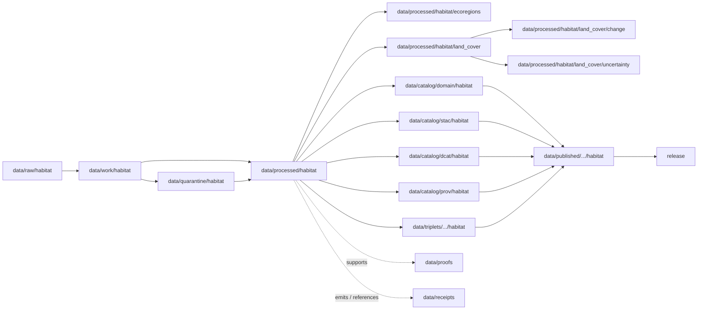

<!-- [KFM_META_BLOCK_V2]
doc_id: kfm://doc/data-processed-habitat-readme
title: data/processed/habitat/README.md — Habitat Processed Data README
version: v0.1
type: readme; data-lifecycle-domain-lane; processed-stage-guide; habitat-domain-root; landscape-context-lane-index
status: draft; PROPOSED; data-root; processed-stage; habitat; landscape; land-cover; ecological-systems; habitat-patches; suitability; connectivity; corridors; restoration-opportunity; stewardship-zones; uncertainty; sensitivity-aware; release-gated; evidence-first
authors: ChatGPT-5.5 Thinking; reviewed_by: OWNER_TBD
owners: OWNER_TBD — Habitat steward · Ecology data steward · Land-cover steward · Sensitivity reviewer · Data steward · Pipeline steward · Evidence steward · Policy steward · Release steward · Docs steward
created: NEEDS VERIFICATION — greenfield stub existed before v0.1 expansion
updated: 2026-06-25
policy_label: public-doc; data; processed; habitat; lifecycle; governed; source-role-aware; sensitivity-aware; release-gated
tags: [kfm, data, processed, habitat, habitat-patch, land-cover-observation, ecological-system, habitat-quality-score, suitability-model, connectivity-edge, corridor, restoration-opportunity, stewardship-zone, model-run-receipt, uncertainty-surface, ecoregions, land-cover, land-cover-change, uncertainty, source-role, observed, regulatory, modeled, aggregate, administrative, candidate, synthetic, EvidenceBundle, SourceDescriptor, ValidationReport, PolicyDecision, ReleaseManifest, RAW, WORK, QUARANTINE, PROCESSED, CATALOG, TRIPLET, PUBLISHED]
related:
  - ../README.md
  - ../../README.md
  - ../../../docs/domains/habitat/README.md
  - ../../../docs/domains/fauna/README.md
  - ../../../docs/domains/flora/README.md
  - ../../../docs/domains/soil/README.md
  - ../../../docs/domains/hydrology/README.md
  - ../../../docs/domains/agriculture/README.md
  - ../../../docs/domains/hazards/README.md
  - ../../../policy/domains/habitat/
  - ../../../policy/sensitivity/habitat/
  - ../../../contracts/domains/habitat/
  - ../../../schemas/contracts/v1/domains/habitat/
  - ../../raw/habitat/
  - ../../work/habitat/
  - ../../quarantine/habitat/
  - ../../catalog/domain/habitat/
  - ../../catalog/stac/habitat/
  - ../../catalog/dcat/habitat/
  - ../../catalog/prov/habitat/
  - ../../triplets/
  - ../../published/
  - ../../proofs/
  - ../../receipts/
  - ../../registry/sources/habitat/
  - ../../../release/candidates/habitat/
  - ../../../release/
  - ../../../pipelines/domains/habitat/
  - ../../../pipeline_specs/habitat/
  - ../../../tools/validators/
  - ecoregions/README.md
  - land_cover/README.md
  - land_cover/change/README.md
  - land_cover/uncertainty/README.md
notes:
  - "This file replaces a greenfield stub at `data/processed/habitat/README.md`."
  - "This is the parent PROCESSED-stage domain lane for Habitat artifacts. It is not RAW source storage, WORK scratch, QUARANTINE holding, CATALOG, TRIPLET, PUBLISHED, proof storage, receipt storage, source registry, policy authority, release authority, public API/UI output, public map/tile output, ecological/legal advice, restoration prescription, operational land-management guidance, or life-safety guidance."
  - "Habitat processed artifacts must preserve source role, rights, sensitivity posture, landscape/object-family distinction, temporal semantics, evidence linkage, validation state, transform/model-run receipt linkage, catalog readiness, release state, correction path, and rollback target before public use."
  - "Habitat owns landscape/habitat context, not species records. Fauna owns animal occurrence truth; Flora owns plant/specimen/rare-plant truth; Soil, Hydrology, Agriculture, and Hazards keep their own truth."
  - "Source-role anti-collapse is mandatory: observed, regulatory, modeled, aggregate, administrative, candidate, and synthetic roles are not interchangeable."
  - "Sensitive habitat joins must fail closed unless policy, review, evidence, transform receipts, release state, correction path, and rollback support public use."
  - "This README is a parent lane guide and index. Child lane READMEs define local sublane boundaries; contracts define semantic object meaning; schemas define machine shape; policy decides admissibility; release records decide publication."
  - "Rollback target for this expansion is previous greenfield stub blob SHA `6f4facc68346b109fa7e8cc4b3590b3269345fa3`."
[/KFM_META_BLOCK_V2] -->

<a id="top"></a>

# data/processed/habitat

> Parent Habitat PROCESSED-stage lane for normalized, source-traced, source-role-preserved, sensitivity-aware landscape and habitat artifacts that have passed beyond RAW/WORK/QUARANTINE but are not yet cataloged, triplet-projected, published, or released.

<p>
  
  
  
  
  
  
</p>

**Status:** draft / PROPOSED  
**Owners:** OWNER_TBD — Habitat steward · Ecology data steward · Land-cover steward · Sensitivity reviewer · Data steward · Pipeline steward · Evidence steward · Policy steward · Release steward · Docs steward  
**Path:** `data/processed/habitat/README.md`  
**Owning root:** `data/processed/`  
**Domain segment:** `habitat`  
**Lifecycle stage:** `PROCESSED`  
**Exposure posture:** not public by default; any public use requires governed catalog, EvidenceBundle, source-role and rights posture, sensitivity/policy review, ValidationReport, PolicyDecision, ReleaseManifest, correction path, and rollback target.  
**Truth posture:** CONFIRMED target was a greenfield stub · CONFIRMED parent `data/processed/` is upstream of catalog/triplet/publication and is not a normal public surface · CONFIRMED Habitat owns landscape/habitat context and not species records · CONFIRMED Habitat source roles are first-class identity attributes and cannot collapse · CONFIRMED promotion to PUBLISHED requires SourceDescriptor, EvidenceBundle, ValidationReport, PolicyDecision, PromotionDecision, ReleaseManifest, RollbackCard, and correction path · PROPOSED parent-lane details and child-lane index · NEEDS VERIFICATION for actual child inventory, validators, fixtures, access-control enforcement, receipt families, policy enforcement, release linkage, and governed route behavior.

**Quick jumps:** [Purpose](#purpose) · [Lifecycle boundary](#lifecycle-boundary) · [Repo fit](#repo-fit) · [Lane index](#lane-index) · [Accepted contents](#accepted-contents) · [Exclusions](#exclusions) · [Habitat processed requirements](#habitat-processed-requirements) · [Source-role and sensitivity guardrails](#source-role-and-sensitivity-guardrails) · [Evidence ledger](#evidence-ledger) · [Validation checklist](#validation-checklist) · [Rollback](#rollback)

---

## Purpose

`data/processed/habitat/` is the parent PROCESSED-stage lane for normalized Habitat artifacts. It organizes processed outputs after source capture, extraction, geometry normalization, source-role preservation, land-cover processing, ecological-system classification, model preparation, uncertainty handling, geoprivacy handling, validation-oriented processing, or public-safe derivative preparation, while keeping those artifacts upstream of catalog, triplet, publication, release, proof closure, and public access.

This lane may contain or point to processed artifacts for:

- habitat patches and landscape context;
- land-cover observations and remote-sensing-derived land-cover context;
- ecoregions, ecological systems, and ecological-classification context;
- habitat quality scores and model inputs where claim role and uncertainty remain explicit;
- suitability-model inputs and model outputs when version, bounds, receipts, and uncertainty are preserved;
- connectivity edges and corridor candidates;
- restoration-opportunity candidates and stewardship-zone context;
- uncertainty surfaces and model/run context;
- public-candidate or restricted Habitat derivatives that remain release-gated.

This parent README does not create a semantic contract, schema, validator, source registry, proof, receipt, policy decision, release decision, public map layer, public tile, public API route, public UI payload, species occurrence claim, regulatory critical-habitat determination, restoration prescription, ecological/legal advice, operational land-management guidance, hazard alert, or life-safety product.

## Lifecycle boundary

```text
RAW -> WORK / QUARANTINE -> PROCESSED -> CATALOG / TRIPLET -> PUBLISHED
```



`data/processed/habitat/` is upstream of catalog, triplet, publication, and release. It must not be used as a normal public map/API/UI/AI source.

## Repo fit

| Responsibility | Correct home | Rule |
|---|---|---|
| Raw source downloads, source-native rasters/vectors, source geodatabases, agency/steward exports, source logs, original pixels/classes/geometry, or source identifiers | `data/raw/habitat/` | Not this lane. |
| In-process transforms, raster/vector warps, reclassification experiments, geometry repair, model tuning, joins, QA, notebooks, or scratch products | `data/work/habitat/` | Not this lane. |
| Unresolved rights, unresolved source role, malformed data, disputed classifications, sensitive joins, unsafe geometry, or not-yet-reviewed habitat material | `data/quarantine/habitat/` | Not this lane until review/admission allows. |
| Normalized Habitat processed artifacts | `data/processed/habitat/` | This parent lane and child lanes. |
| Habitat ecoregion/ecological-classification artifacts | `data/processed/habitat/ecoregions/` | Child context lane. |
| Habitat land-cover observations and context | `data/processed/habitat/land_cover/` | Child land-cover lane. |
| Habitat land-cover change products | `data/processed/habitat/land_cover/change/` | Child temporal-comparison lane. |
| Habitat land-cover uncertainty products | `data/processed/habitat/land_cover/uncertainty/` | Child uncertainty lane. |
| Habitat catalog records | `data/catalog/domain/habitat/` | Downstream catalog stage. |
| Habitat STAC/DCAT/PROV records | `data/catalog/{stac,dcat,prov}/habitat/` | Downstream catalog projections if accepted. |
| Habitat triplet/graph records | `data/triplets/.../habitat/` | Downstream graph stage; must not expose restricted geometry or unsafe joins. |
| Published public-safe Habitat products | `data/published/.../habitat/` | Downstream only after release. |
| EvidenceBundle/proof records | `data/proofs/` | Separate proof family. |
| Source, run, model-run, transform, validation, policy, correction, access, and release receipts | `data/receipts/` | Separate receipt family. |
| Habitat source registry records | `data/registry/sources/habitat/` | Separate source authority. |
| Release candidates and release manifests | `release/candidates/habitat/`, `release/` | Separate publication authority. |
| Habitat contracts | `contracts/domains/habitat/` | Object meaning; not data. |
| Habitat schemas | `schemas/contracts/v1/domains/habitat/` | Machine shape; not data. |
| Habitat policy and sensitivity rules | `policy/domains/habitat/`, `policy/sensitivity/habitat/` if accepted | Admissibility authority; not data. |
| Validators, tests, fixtures, pipelines, pipeline specs, apps, packages | `tools/validators/`, `tests/`, `fixtures/`, `pipelines/`, `pipeline_specs/`, `apps/`, `packages/` | Separate roots. |

## Lane index

Known or intended child lanes under `data/processed/habitat/` are listed below. Treat entries as **PROPOSED** unless current child READMEs, validators, fixtures, policies, receipts, access controls, and CI enforcement have been verified in the same implementation pass.

| Lane | Family | Purpose | Hard boundary |
|---|---|---|---|
| `ecoregions/` | Ecoregion / ecological-classification context | Normalized ecoregion, ecological-region, ecological-system, and landscape-classification context. | Ecoregions are not species occurrences, regulatory critical habitat, suitability scores, or restoration prescriptions. |
| `land_cover/` | LandCoverObservation / remote-sensing context | Normalized land-cover observations, class rasters/vectors, summaries, class dictionaries, and crosswalks. | Land-cover is not suitability, regulatory critical habitat, crop truth, soil truth, hydrology truth, or hazard truth by itself. |
| `land_cover/change/` | Land-cover temporal comparison | Class transitions, change summaries, disturbance/conversion candidates, and comparison-window context. | Change products are not hazard-impact claims, crop-change truth, restoration prescriptions, or land-use/legal determinations by themselves. |
| `land_cover/uncertainty/` | UncertaintySurface / confidence context | Classification confidence, accuracy summaries, masks, error matrices, and uncertainty surfaces. | Uncertainty qualifies interpretation; it is not proof, release, or validation authority by itself. |
| `patches/` | HabitatPatch | Discrete polygonal habitat units. | A patch is not a species occurrence or critical-habitat designation by itself. |
| `ecological_systems/` | EcologicalSystem | Classified ecological-system units and crosswalks. | A modeled classification is not a regulatory determination. |
| `quality/` | Habitat Quality Score | Quality score products with source, method, uncertainty, and validation. | A score is not a management decision or legal status. |
| `suitability/` | SuitabilityModel | Modeled suitability surfaces and versioned outputs. | Modeled suitability is not regulatory critical habitat or occurrence truth. |
| `connectivity/` | ConnectivityEdge / Corridor | Connectivity edges, corridor candidates, resistance summaries. | Corridors are model products unless separately reviewed and released. |
| `restoration/` | Restoration Opportunity | Restoration-opportunity candidates and botanical/landscape context. | Candidate opportunity is not a restoration prescription. |
| `stewardship/` | StewardshipZone | Stewardship/management context where rights and role are explicit. | Stewardship context is not land ownership or legal authority by itself. |
| `public/` | Public-candidate Habitat products | Candidate public-safe habitat products. | `public/` means public-candidate if present, not published or released. |
| `restricted/` | Restricted Habitat products | Exact sensitive joins, steward-controlled context, or role-gated artifacts. | Non-public, access-controlled, fail-closed. |

## Accepted contents

Processed Habitat data may include:

- normalized tabular, spatial, temporal, raster, vector, graph-ready, uncertainty-aware, model-ready, or review-ready habitat artifacts;
- source-role-tagged habitat patch, land-cover, ecoregion, ecological-system, suitability, connectivity, corridor, restoration-opportunity, stewardship-zone, model-run, or uncertainty products;
- public-safe generalized, aggregated, redacted, delayed, or suppressed derivatives that still require catalog/release review before public use;
- restricted reviewer-only, rights-controlled, steward-controlled, sensitive-join, or denied/internal-review processed artifacts admitted by policy;
- sidecar metadata needed to interpret processed artifacts when it is not a receipt, proof, policy decision, release manifest, source registry record, schema, validator, or catalog record;
- lane-local README or manifest notes that explain processed-data boundaries without becoming public outputs or authority records.

## Exclusions

Do not store these under `data/processed/habitat/`:

- RAW source files, source-native downloads, steward originals, source media, logs, original source geometries/pixels/classes, source identifiers, or unprocessed agency/partner exports.
- WORK/scratch files, notebooks, transform experiments, unresolved QA joins, geometry repairs, reclassification trials, classifier/model tuning, or redaction-debug outputs.
- Quarantined or unresolved sensitive/rights/source-role material.
- Catalog records, STAC/DCAT/PROV records, triplet/graph records, published products, proof records, receipt records, source registry records, release decisions, schemas, policy rules, validators, tests, fixtures, pipelines, pipeline specs, app/UI/API code, or packages.
- Species occurrence records, animal taxonomic identity, plant specimen records, rare-species/rare-plant exact locations, soil map unit truth, hydrology measurement truth, crop/field truth, hazard event truth, archaeology site truth, or land/ownership truth.
- Regulatory critical-habitat determinations, restoration prescriptions, management decisions, corridor/connectivity claims, ecological condition claims, crop-change claims, flood/fire/drought hazard claims, or land-use/legal determinations unless separate object contracts, evidence, validation, policy, and release state support them.
- Public API/UI/tile payloads, direct downloads, Focus Mode answers, public map layers, species-location services, landowner/parcel targeting aids, ecological/legal advice, operational land-management guidance, emergency alerts, or life-safety guidance.
- Redaction parameters, aggregation thresholds, small-cell thresholds, fuzzing radii, seeds, exact transform offsets, access credentials, secrets, private agreement terms, field access routes, or implementation details that could aid exposure or unauthorized access.
- AI-generated habitat narratives presented as authoritative without EvidenceBundle support, source-role preservation, policy decision, and validated citations.

## Habitat processed requirements

PROPOSED until concrete validators, policies, fixtures, receipts, and access-control enforcement are verified:

| Requirement | Meaning |
|---|---|
| Source trace | Each source-derived artifact should trace to SourceDescriptor or habitat source registry context. |
| Evidence linkage | Claims about habitat patch, land cover, ecoregion, ecological system, suitability, connectivity, corridor, restoration opportunity, stewardship zone, uncertainty, transform, review, or release readiness should resolve downstream to EvidenceBundle/proof context where appropriate. |
| Source role | Observed, regulatory, modeled, aggregate, administrative, candidate, and synthetic roles must remain explicit and not interchangeable. |
| Object distinction | HabitatPatch, LandCoverObservation, EcologicalSystem, Habitat Quality Score, SuitabilityModel, ConnectivityEdge, Corridor, Restoration Opportunity, StewardshipZone, Model Run Receipt, and UncertaintySurface must remain distinct. |
| Time semantics | Source time, observed time, valid time, retrieval time, model-run time, correction time, and release time should remain distinguishable where material. |
| Rights posture | Agency, steward, license, redistribution, attribution, derivative-use, private-land, partner, and source terms should be resolved or held closed. |
| Sensitivity posture | Sensitive fauna/flora occurrence joins, rare-plant context, private parcels, steward-controlled biodiversity, wetlands, small-cell outputs, and exact sensitive geometry should carry restriction/generalization/denial posture. |
| Transform linkage | Generalization, aggregation, redaction, suppression, withholding, delayed publication, or public-safe geometry transform should link to appropriate receipt families. |
| Model-run linkage | Modeled habitat, suitability, connectivity, corridor, restoration-opportunity, and uncertainty products should link to model-run receipts and input digests where applicable. |
| Review state | Habitat steward, source steward, sensitivity reviewer, data-quality reviewer, model reviewer, and release authority review should be recorded where required. |
| Policy decision | Restricted, public-candidate, and public transitions require PolicyDecision/admissibility posture where policy requires it. |
| Catalog readiness | Processed Habitat artifacts intended for discovery should promote through catalog/triplet lanes, not directly to public use. |
| Release readiness | Public use requires ReleaseManifest or release-linked state, published output path, correction path, and rollback target. |
| No public surface by default | Processed Habitat artifacts must not be exposed directly as public maps, tiles, APIs, downloads, Focus Mode answers, or AI-answer sources. |

## Source-role and sensitivity guardrails

- Habitat owns landscape/habitat context, not species records.
- Occurrence truth belongs to Fauna; plant/specimen/rare-plant truth belongs to Flora.
- Soil map units, hydrology measurements, crop/field records, hazards, archaeology, and land/ownership claims stay in their owning lanes.
- Habitat may join to other lanes only through governed relationships that preserve ownership, source role, sensitivity, and EvidenceBundle support.
- Observed, regulatory, modeled, aggregate, administrative, candidate, and synthetic source roles must not be relabeled during promotion.
- A modeled habitat product is not regulatory critical habitat.
- A suitability surface is not an occurrence.
- A habitat patch is not a critical-habitat designation by itself.
- A restoration opportunity is not a restoration prescription.
- A stewardship zone is not ownership or legal authority by itself.
- An uncertainty surface qualifies interpretation; it is not proof, validation, or release by itself.
- Sensitive habitat × fauna, habitat × flora, habitat × parcel, habitat × hydrology, habitat × soil, habitat × agriculture, and habitat × hazards joins must fail closed until evidence, policy, review, transform receipts, release state, correction path, and rollback are resolved.
- Sensitive geometry must be generalized, redacted, delayed, restricted, or denied before tile generation; style filters are not a sensitivity control.
- Unclear rights, unresolved source role, missing evidence, unresolved sensitivity, unresolved model fitness, or absent release state blocks public promotion.
- Public clients and Focus Mode must use governed APIs, released artifacts, catalog/triplet records, EvidenceBundle-backed payloads, and policy-safe envelopes, not this directory directly.

> [!CAUTION]
> Do not expose `data/processed/habitat/` directly as a public map, tile service, API, UI, download, Focus Mode answer, AI answer source, species-location service, critical-habitat determination, restoration prescription, landowner/parcel targeting aid, ecological/legal advice, operational land-management guidance, emergency alert, or life-safety product. Processed habitat data remains inside the trust membrane until governed promotion and release.

## Evidence ledger

| Source | Status | Supports | Limits |
|---|---|---|---|
| Previous file | CONFIRMED | Target existed as a greenfield stub. | Did not define Habitat processed boundaries or child lanes. |
| `data/processed/README.md` | CONFIRMED | PROCESSED data is upstream of catalog, triplets, publication, and release and is not the normal public surface. | Does not prove Habitat child inventory or enforcement. |
| `docs/domains/habitat/README.md` | CONFIRMED doctrine / PROPOSED implementation | Habitat owns landscape/habitat context, not species records; source roles are first-class; object families and lifecycle gates are defined; sensitive joins fail closed; public clients use governed APIs. | Implementation maturity remains NEEDS VERIFICATION. |
| `data/processed/habitat/ecoregions/README.md` | CONFIRMED child README | Ecoregions are processed landscape classification context, not species occurrence/regulatory/suitability/restoration truth. | Does not prove validators. |
| `data/processed/habitat/land_cover/README.md` | CONFIRMED child README | Land-cover observations are processed context and not direct public surfaces. | Does not prove validators. |
| `data/processed/habitat/land_cover/change/README.md` | CONFIRMED child README | Land-cover change is temporal comparison context, not hazard/crop/restoration/critical-habitat truth by itself. | Does not prove validators. |
| `data/processed/habitat/land_cover/uncertainty/README.md` | CONFIRMED child README | Uncertainty qualifies interpretation and is not proof/release/validation authority by itself. | Does not prove validators. |
| `policy/domains/habitat/` and `policy/sensitivity/habitat/` | NEEDS VERIFICATION | Expected admissibility homes. | Current policy files and enforcement were not verified in this task. |
| `contracts/domains/habitat/` and `schemas/contracts/v1/domains/habitat/` | NEEDS VERIFICATION | Expected object contract/schema homes for Habitat families. | Specific object files and validators were not verified in this task. |

## Validation checklist

- [ ] Confirm actual child directories under `data/processed/habitat/` and reconcile missing, duplicate, alias, legacy, or compatibility lanes.
- [ ] Confirm accepted processed Habitat path convention for parent, ecoregions, land cover, land-cover change, uncertainty, habitat patches, ecological systems, quality, suitability, connectivity, corridors, restoration, stewardship, public-candidate, and restricted lanes.
- [ ] Confirm each child lane has README, owner, purpose, accepted contents, exclusions, guardrails, validation checklist, and rollback target.
- [ ] Confirm Habitat object contracts and schema paths for HabitatPatch, LandCoverObservation, EcologicalSystem, Habitat Quality Score, SuitabilityModel, ConnectivityEdge, Corridor, Restoration Opportunity, StewardshipZone, Model Run Receipt, and UncertaintySurface.
- [ ] Confirm source-role vocabulary and anti-collapse validators for observed/regulatory/modeled/aggregate/administrative/candidate/synthetic roles.
- [ ] Confirm validators, fixtures, CI checks, policy checks, model-run receipt checks, and access-control enforcement for processed Habitat artifacts.
- [ ] Confirm SourceDescriptor/source registry linkage for source-derived artifacts.
- [ ] Confirm RunReceipt, TransformReceipt, ModelRunReceipt, ValidationReport, PolicyDecision, CorrectionNotice, ReleaseManifest, correction path, and rollback target where applicable.
- [ ] Confirm sensitive fauna/flora joins, rare-plant joins, private-parcel joins, wetlands/stewardship joins, hazard/agriculture joins, small-cell outputs, rights-unclear sources, unresolved source roles, redaction parameters, transform secrets, and release-unclear artifacts cannot enter public routes.
- [ ] Confirm public-candidate transitions are governed, evidence-backed, source-role-safe, rights-safe, sensitivity-safe, review-backed, release-linked, and reversible.
- [ ] Confirm no RAW, WORK, QUARANTINE, CATALOG, TRIPLET, PUBLISHED, proof, receipt, registry, release, schema, policy, validator, package, pipeline, app, API, public map, public tile, direct download, Focus Mode answer, critical-habitat determination, restoration prescription, land-management guidance, or life-safety artifact is misplaced here.
- [ ] Confirm public clients and Focus Mode cannot read this lane directly as public truth, public location service, public map, public tile, public API, public UI, or AI-answer source.

## Rollback

Rollback is required if this parent lane becomes a RAW source-data root, WORK scratch root, QUARANTINE bypass, public output root, `data/published/` substitute, public-candidate shortcut, sensitive-join exposure path, transform-secret exposure path, agreement/credential exposure path, proof store, receipt store, catalog root, triplet root, source-registry root, release-decision root, schema root, policy root, validator root, implementation root, public API shortcut, public UI shortcut, public tile shortcut, public exposure shortcut, species-location source, critical-habitat determination source, restoration prescription source, crop-change claim source, hazard-impact claim source, land-management guidance source, or life-safety guidance source.

Rollback target for this expansion: previous greenfield stub blob SHA `6f4facc68346b109fa7e8cc4b3590b3269345fa3`.

<p align="right"><a href="#top">Back to top</a></p>
