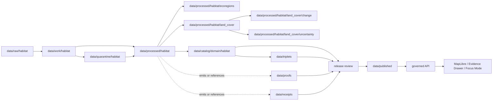

<!-- [KFM_META_BLOCK_V2]
doc_id: kfm://doc/data-processed-habitat-readme
title: data/processed/habitat/ — Habitat Processed Data
version: v0.2.0
type: directory-readme
subtype: processed-habitat-parent-lane
status: repository-grounded draft; child documentation is partially confirmed while payloads, validators, receipts, proof, release, and runtime behavior remain bounded
owners:
  - "NEEDS VERIFICATION — Habitat domain steward"
  - "NEEDS VERIFICATION — ecology, land-cover, modeling, and sensitivity stewards"
  - "NEEDS VERIFICATION — data, evidence, policy, release, correction, rollback, and docs stewards"
created: NEEDS VERIFICATION — greenfield stub existed before v0.1 expansion
updated: 2026-07-25
policy_label: public-doc; processed-stage; habitat; landscape-context; source-role-aware; sensitivity-aware; model-aware; release-gated; no-direct-public-path
path: data/processed/habitat/README.md
truth_posture: >
  CONFIRMED exact target path, prior blob, Directory Rules placement, Habitat domain doctrine,
  current ecoregions and land-cover child READMEs, current land-cover change and uncertainty child
  READMEs, and PROCESSED lifecycle boundary / PROPOSED parent-lane admission profile, normalized
  Habitat packet, and downstream promotion expectations / UNKNOWN recursive payload inventory,
  accepted contracts and schemas, production validators, fixtures, receipts, proof closure, release
  instances, hosting, and public behavior / NEEDS VERIFICATION accountable owners, accepted future
  child lanes, model-fitness rules, sensitive-join enforcement, correction propagation, cache
  invalidation, and rollback drills
evidence_snapshot:
  repository: bartytime4life/Kansas-Frontier-Matrix
  base_ref: main
  base_commit: e6b6730594ce29f6adf3def573d0aae4ce11584f
  prior_blob: bbae8468b9acf483b1a77a2cd6ecfc08a691a318
  directory_rules_blob: 2affb080e6f0043867c64c7f06c1ca52030fbd55
  habitat_domain_blob: 876d1fa41a00d94d7120c6ef065750748e6bf524
related:
  - ../README.md
  - ../../README.md
  - ../../../docs/domains/habitat/README.md
  - ../../../docs/doctrine/directory-rules.md
  - ../../../contracts/domains/habitat/README.md
  - ../../../schemas/contracts/v1/domains/habitat/README.md
  - ../../../policy/domains/habitat/README.md
  - ../../../policy/sensitivity/habitat/README.md
  - ../../raw/habitat/README.md
  - ../../work/habitat/README.md
  - ../../quarantine/habitat/README.md
  - ../../catalog/domain/habitat/README.md
  - ../../triplets/README.md
  - ../../proofs/README.md
  - ../../receipts/README.md
  - ../../registry/sources/habitat/README.md
  - ../../published/layers/habitat/README.md
  - ../../../release/candidates/habitat/README.md
  - ../../../release/README.md
  - ecoregions/README.md
  - land_cover/README.md
  - land_cover/change/README.md
  - land_cover/uncertainty/README.md
notes:
  - "Same-path Markdown modernization only; no Habitat bytes, source state, contract, schema, policy, validator, workflow, proof, release, route, hosting, or KFM publication state changed."
  - "Habitat owns landscape and habitat context, not species records, regulatory critical-habitat determinations, land ownership, hazard truth, or management authority."
  - "Confirmed child documentation is separated from proposed future lanes; directory presence does not establish payload, validator, proof, or release maturity."
  - "Rollback target for v0.2.0 is prior blob SHA `bbae8468b9acf483b1a77a2cd6ecfc08a691a318`."
[/KFM_META_BLOCK_V2] -->

<a id="top"></a>

# `data/processed/habitat/` — Habitat processed data

> **One-line purpose.** Hold normalized, source-role-preserved, sensitivity-aware Habitat landscape artifacts upstream of catalog, release, and publication while keeping evidence, model, uncertainty, correction, and cross-domain ownership visible.

[](#status)
[](#authority-level)
[](#what-belongs-here)
[](#outputs)
[](#source-role-and-sensitivity-guardrails)
[](#validation)

> [!IMPORTANT]
> **Habitat is a landscape-context domain, not a sovereign truth bucket.** A processed patch, class, score, model, corridor, restoration candidate, stewardship zone, or uncertainty surface may be useful without proving species presence, regulatory status, ecological condition, ownership, hazard, or management action.

**Path:** `data/processed/habitat/README.md`  
**Owning root:** `data/`  
**Lifecycle phase:** `processed/`  
**Domain segment:** `habitat/`  
**Lane role:** parent Habitat processed-data lane  
**Direct public access:** denied  
**Last reviewed:** 2026-07-25

**Quick navigation:** [Purpose](#purpose) · [Authority level](#authority-level) · [Status](#status) · [What belongs here](#what-belongs-here) · [What does NOT belong here](#what-does-not-belong-here) · [Inputs](#inputs) · [Outputs](#outputs) · [Validation](#validation) · [Review burden](#review-burden) · [Related folders](#related-folders) · [ADRs](#adrs) · [Last reviewed](#last-reviewed) · [Confirmed child lanes](#confirmed-child-lanes) · [Proposed future lanes](#proposed-future-lanes) · [Habitat admission profile](#habitat-admission-profile) · [Source-role and sensitivity guardrails](#source-role-and-sensitivity-guardrails) · [Lifecycle and promotion](#lifecycle-and-promotion) · [Correction and rollback](#correction-and-rollback)

---

## Purpose

This directory is the Habitat domain's **PROCESSED-stage parent lane**. It may hold normalized, geometry-aware, source-traced, source-role-preserved, sensitivity-aware, uncertainty-aware, and review-ready landscape artifacts that have moved beyond RAW capture, WORK transformation, and QUARANTINE holds.

The lane exists to preserve the identity and limits of Habitat products before downstream catalog, evidence, policy, review, release, and publication. It covers landscape context such as land cover, ecological regionalization, habitat patches, modeled suitability, connectivity, restoration candidates, stewardship context, and uncertainty without collapsing those products into species, regulatory, ownership, hazard, or management truth.

It is not a public map layer, tile store, API payload store, proof store, receipt authority, source registry, schema authority, policy authority, release authority, or AI truth source.

## Authority level

**Implementation-bearing lifecycle lane.** The path is CONFIRMED in the repository and is correctly placed under `data/processed/` according to Directory Rules' lifecycle and domain-placement rules.

Its authority is deliberately narrow:

- it may carry processed Habitat artifacts and lane-local explanatory metadata;
- it does not define object meaning—that remains in `contracts/domains/habitat/`;
- it does not define machine shape—that remains in `schemas/contracts/v1/domains/habitat/`;
- it does not decide admissibility—that remains in Habitat and sensitivity policy;
- it does not establish evidence closure, release state, or safe public use;
- it does not absorb truth owned by Fauna, Flora, Soil, Hydrology, Agriculture, Hazards, Archaeology, or People/Land.

## Status

| Surface | Status | Evidence-bounded interpretation |
|---|---|---|
| This README and path | **CONFIRMED** | The file exists at the pinned base and is updated in place. |
| Habitat domain doctrine | **CONFIRMED repository document / draft** | Habitat owns landscape context, preserves source roles, and requires sensitivity-aware governed joins. |
| `ecoregions/` child README | **CONFIRMED** | Modernized regionalization-context lane; ecoregions classify places and do not prove species or regulatory truth. |
| `land_cover/` child README | **CONFIRMED** | Processed land-cover context lane; direct public use is denied. |
| `land_cover/change/` child README | **CONFIRMED** | Temporal comparison context; not crop, hazard, restoration, legal, or ecological-condition truth by itself. |
| `land_cover/uncertainty/` child README | **CONFIRMED** | Uncertainty qualifies interpretation and is not validation, proof, or release authority. |
| Other proposed Habitat child lanes | **PROPOSED / NEEDS VERIFICATION** | Doctrine names additional object families, but current path presence and implementation maturity were not established here. |
| Real processed payload inventory | **UNKNOWN** | This documentation task did not inspect or expose Habitat data payloads. |
| Contracts, schemas, validators, fixtures, CI enforcement | **NEEDS VERIFICATION** | No complete accepted parent-lane enforcement suite was verified. |
| Receipts, proof, policy decisions, release instances, hosting, public behavior | **UNKNOWN / held** | Presence in this lane creates none of these states. |

## What belongs here

Good fits are processed Habitat artifacts whose lineage, role, method, and limits remain inspectable, including:

- normalized habitat-patch and landscape-context candidates;
- land-cover observations, class products, crosswalks, and remote-sensing-derived context in their accepted child lanes;
- ecoregion and ecological-regionalization context in `ecoregions/`;
- land-cover temporal-comparison and uncertainty products in their accepted child lanes;
- ecological-system, habitat-quality, suitability, connectivity, corridor, restoration-opportunity, stewardship, model-run, or uncertainty candidates when their object identity remains distinct;
- generalized, aggregated, redacted, suppressed, delayed, or restricted derivatives that remain upstream of catalog and release;
- quality, uncertainty, coverage, missingness, model-fitness, geometry, and correction sidecars that are not proofs, receipts, or release decisions;
- object-ready candidates prepared for contract/schema validation, catalog closure, EvidenceBundle support, or release review;
- lane-local README or non-release manifest notes that explain artifact identity without becoming authority records.

## What does NOT belong here

Do not place these in `data/processed/habitat/`:

- RAW source downloads, source-native rasters or vectors, steward originals, source logs, original pixels, original exact geometry, or unprocessed exports;
- WORK notebooks, scratch transforms, model tuning, geometry repair experiments, classifier trials, temporary joins, or redaction debugging;
- QUARANTINE material with unresolved rights, source role, sensitivity, model fitness, geometry, dispute, or quality state;
- Fauna occurrences, Flora occurrences or specimens, rare-species or rare-plant locations, Soil map-unit truth, Hydrology measurements, Agriculture field truth, Hazard events, Archaeology sites, or ownership/parcel truth;
- regulatory critical-habitat determinations, legal land-use determinations, restoration prescriptions, management decisions, crop-change claims, hazard-impact claims, or ecological-condition conclusions merely because Habitat data contributes context;
- semantic contracts, JSON Schemas, policy rules, validators, tests, fixtures, pipelines, source descriptors, catalog records, STAC/DCAT/PROV projections, triplets, proofs, receipts, releases, correction notices, rollback cards, or published artifacts;
- public map, tile, API, download, export, Focus Mode, Evidence Drawer, graph, search, or AI-answer payloads;
- transform secrets, generalization parameters, small-cell thresholds, exact offsets, access credentials, private agreements, field routes, or details that could aid re-identification or unauthorized access;
- AI-generated Habitat claims presented as authoritative without evidence, policy, review, and release support.

## Inputs

Inputs may enter this lane only through governed lifecycle transitions from:

- `data/work/habitat/` after source, role, rights, geometry, method, time, uncertainty, validation, sensitivity, and correction posture are recorded;
- `data/quarantine/habitat/` after the hold condition is resolved and the remediation decision is auditable;
- accepted Habitat pipelines or tools that preserve source bytes by reference, source version, transform or model method, input digests, uncertainty, geometry lineage, and correction state;
- approved cross-domain context where ownership remains with the source domain and the relation is explicit.

A connector-to-PROCESSED, watcher-to-PROCESSED, or public-upload-to-PROCESSED shortcut is not an accepted normal path. Connectors and watchers create source or candidate state; they do not publish or silently promote.

## Outputs

This lane may support downstream candidates for:

- `data/catalog/domain/habitat/` and accepted STAC/DCAT/PROV projections;
- `data/triplets/` or other relationship projections that preserve ownership, source role, sensitivity, and evidence references;
- separate `data/proofs/` and `data/receipts/` objects;
- `release/candidates/habitat/` after identity, rights, sensitivity, validation, model fitness, evidence, review, correction, and rollback obligations are met;
- `data/published/` only through a governed release transition and a separate released artifact path;
- governed API, MapLibre, Evidence Drawer, export, or Focus Mode carriers only after public-safe release.

> [!CAUTION]
> Ordinary public clients must not read this directory directly. A processed Habitat artifact is not a released claim merely because it is generalized, visually useful, or easy to model.

## Validation

No complete Habitat parent-lane production validator suite was verified in this task. Until accepted contracts, schemas, fixtures, validators, policy checks, and CI evidence exist, field-level enforcement claims must remain bounded.

A credible Habitat validation profile should check, at minimum:

1. object-family identity and deterministic identity where practical;
2. source and source-role identity;
3. rights, license, attribution, and derivative-use posture;
4. source, observed, valid, retrieval, model-run, correction, and release times where material;
5. geometry, CRS, scale, resolution, extent, topology, and transform lineage;
6. model method, version, input digest, calibration, validation, uncertainty, and fitness where applicable;
7. object distinction among patch, land cover, ecological system, quality, suitability, connectivity, corridor, restoration, stewardship, and uncertainty products;
8. sensitive joins, small cells, exact locations, and re-identification risk;
9. evidence references, review state, policy posture, release hold, correction path, and rollback target;
10. absence of cross-domain truth collapse or direct public-store access.

Fail closed or quarantine when a material field, evidence link, source role, rights posture, sensitivity decision, model-fitness result, review state, or correction path is absent, contradictory, unsupported, or unsafe for the requested downstream use.

## Review burden

Changes require review proportional to consequence:

| Change | Minimum review burden |
|---|---|
| README wording or navigation only | Docs steward plus Habitat/domain reviewer. |
| New child lane, renamed lane, or changed object-family boundary | Habitat steward, data/pipeline steward, docs steward, and Directory Rules review. |
| Contract, schema, source-role, geometry, time, uncertainty, or model semantics | Habitat subject-matter reviewer plus contract/schema and validation reviewers. |
| Sensitive biodiversity, parcel, stewardship, wetlands, or small-cell joins | Habitat steward, source-domain steward, sensitivity/policy reviewer, evidence reviewer, and release reviewer. |
| Public map, API, Focus Mode, export, graph, search, or release linkage | Evidence, policy, release, correction, rollback, and domain review; independent approval where required. |
| Regulatory, legal, ecological-condition, restoration, hazard, crop, or life-safety implication | Hold by default; require the owning authority/domain and evidence appropriate to the claim. |

## Related folders

| Responsibility | Path |
|---|---|
| Habitat doctrine | [`docs/domains/habitat/`](../../../docs/domains/habitat/) |
| Semantic contracts | [`contracts/domains/habitat/`](../../../contracts/domains/habitat/) |
| Machine schemas | [`schemas/contracts/v1/domains/habitat/`](../../../schemas/contracts/v1/domains/habitat/) |
| Domain policy | [`policy/domains/habitat/`](../../../policy/domains/habitat/) |
| Sensitivity policy | [`policy/sensitivity/habitat/`](../../../policy/sensitivity/habitat/) |
| RAW | [`data/raw/habitat/`](../../raw/habitat/) |
| WORK | [`data/work/habitat/`](../../work/habitat/) |
| QUARANTINE | [`data/quarantine/habitat/`](../../quarantine/habitat/) |
| Domain catalog | [`data/catalog/domain/habitat/`](../../catalog/domain/habitat/) |
| Proofs | [`data/proofs/`](../../proofs/) |
| Receipts | [`data/receipts/`](../../receipts/) |
| Source registry | [`data/registry/sources/habitat/`](../../registry/sources/habitat/) |
| Release candidates | [`release/candidates/habitat/`](../../../release/candidates/habitat/) |
| Release authority | [`release/`](../../../release/) |

## ADRs

- `docs/adr/ADR-0001-schema-home.md` governs the canonical schema-home convention.
- Directory Rules governs lifecycle and domain placement.
- Any new parallel Habitat schema, contract, policy, source-registry, proof, receipt, release, or publication home requires an ADR or governed migration note.
- Renaming a child lane or changing an object family's meaning is not a presentation-only change; it requires compatibility and migration review.

## Last reviewed

**2026-07-25.** Review again when a child lane is added or renamed, a Habitat contract/schema becomes accepted, a validator or workflow is graduated, a source is activated, a sensitive-join policy changes, or a release candidate is created.

## Confirmed child lanes

The following child documentation is CONFIRMED at the pinned repository base. Confirmation means the path and README exist; it does **not** prove payload, validator, proof, or release maturity.

| Lane | Documented role | Hard boundary |
|---|---|---|
| [`ecoregions/`](ecoregions/) | Ecoregion and ecological-regionalization context | Classifies places; does not prove species, patch, suitability, regulatory, restoration, or management truth. |
| [`land_cover/`](land_cover/) | Land-cover observations and remote-sensing context | Land cover is not suitability, critical habitat, crop, soil, hydrology, or hazard truth by itself. |
| [`land_cover/change/`](land_cover/change/) | Land-cover temporal comparison context | Change is not crop change, hazard impact, restoration need, legal change, or ecological-condition proof by itself. |
| [`land_cover/uncertainty/`](land_cover/uncertainty/) | Confidence, accuracy, quality, and uncertainty context | Uncertainty qualifies interpretation; it is not validation, proof, or release authority. |

## Proposed future lanes

Habitat doctrine names additional object families that may justify future processed lanes, but their accepted path names and implementation maturity remain **PROPOSED / NEEDS VERIFICATION**:

- habitat patches;
- ecological systems;
- habitat quality;
- suitability models;
- connectivity edges and corridors;
- restoration opportunities;
- stewardship zones;
- model-run and uncertainty support;
- public-candidate and restricted derivatives.

Do not create these paths from this README alone. Verify Directory Rules, current contracts and schemas, existing aliases, parent/child responsibilities, migration needs, and ADR posture first.

## Habitat admission profile

A processed Habitat artifact should preserve a minimum auditable packet appropriate to its family:

| Field group | Minimum posture |
|---|---|
| Identity | Stable artifact/object identity, object family, version, digest, and correction lineage. |
| Source | `SourceDescriptor` or registry reference, source role, source version, citation, and rights posture. |
| Time | Distinct source, observed, valid, retrieval, model-run, correction, and release times where material. |
| Spatial support | Geometry or raster support, CRS, scale/resolution, extent, topology, generalization, and transform lineage. |
| Method | Transform, classification, model, aggregation, or derivation method and version. |
| Model fitness | Inputs, parameter/version identity, calibration, validation, uncertainty, limitations, and claim fitness where modeled. |
| Sensitivity | Join sensitivity, exact-location risk, small-cell risk, private/steward-controlled context, and allow/restrict/deny posture. |
| Evidence | Safe EvidenceRefs sufficient to resolve supporting EvidenceBundles where claims depend on evidence. |
| Review and release | Validation state, review state, policy state, release hold, correction path, and rollback target. |

This table is PROPOSED guidance until accepted contracts, schemas, validators, and CI checks make it enforceable.

## Source-role and sensitivity guardrails

- Habitat owns landscape and habitat context, not species records.
- Occurrence truth remains with Fauna; plant/specimen and rare-plant truth remains with Flora.
- Soil, Hydrology, Agriculture, Hazards, Archaeology, and People/Land retain their own canonical claims.
- Observed, regulatory, modeled, aggregate, administrative, candidate, and synthetic roles must remain explicit and must not be upgraded during promotion.
- A modeled habitat product is not regulatory critical habitat.
- A suitability surface is not an occurrence.
- A habitat patch is not a critical-habitat designation by itself.
- A restoration opportunity is not a restoration prescription.
- A stewardship zone is not ownership or legal authority.
- An uncertainty surface is not a `ValidationReport`, proof, policy decision, or release decision.
- Cross-domain joins must preserve ownership, source role, evidence, sensitivity, and correction state.
- Sensitive or re-identifying joins fail closed until policy, evidence, review, transform receipts, release state, correction, and rollback are resolved.
- Sensitive geometry must be generalized, redacted, delayed, restricted, or denied before public artifact generation; style filters are not a sensitivity control.
- Public clients and governed AI use released artifacts and governed interfaces, never this directory directly.

## Lifecycle and promotion

```text
RAW -> WORK / QUARANTINE -> PROCESSED -> CATALOG / TRIPLET -> PUBLISHED
```


```mermaid
flowchart LR
  RAW[data/raw/habitat] --> WORK[data/work/habitat]
  WORK --> QUAR[data/quarantine/habitat]
  WORK --> PROC[data/processed/habitat]
  QUAR --> PROC
  PROC --> ECO[data/processed/habitat/ecoregions]
  PROC --> LC[data/processed/habitat/land_cover]
  LC --> LCC[data/processed/habitat/land_cover/change]
  LC --> LCU[data/processed/habitat/land_cover/uncertainty]
  PROC --> CAT[data/catalog/domain/habitat]
  CAT --> TRIP[data/triplets]
  PROC -. emits or references .-> PROOF[data/proofs]
  PROC -. emits or references .-> RECEIPT[data/receipts]
  CAT --> REL[release review]
  TRIP --> REL
  PROOF --> REL
  RECEIPT --> REL
  REL --> PUB[data/published]
  PUB --> API[governed API]
  API --> UI[MapLibre / Evidence Drawer / Focus Mode]
```

Promotion is a governed state transition, not a file move, commit, pull request, or merge. A processed artifact remains non-public until catalog, evidence, policy, review, release, correction, and rollback gates pass.

## Correction and rollback

Corrections must preserve the relationship among:

1. affected processed artifact and version;
2. source or model input version;
3. transform or model method;
4. catalog and EvidenceBundle references;
5. affected joins, derived products, caches, tiles, exports, and AI carriers;
6. correction, withdrawal, invalidation, and rollback decisions.

Rollback is required if this lane becomes a RAW source root, WORK scratch root, QUARANTINE bypass, catalog substitute, proof or receipt store, release authority, published-output store, direct public API/UI/tile path, sensitive-location service, transform-secret store, regulatory or legal truth source, restoration prescription source, management authority, hazard/crop claim source, or life-safety guidance source.

Before merge, close the review branch to abandon the change. After merge, revert the modernization commit; do not rewrite shared history.

<p align="right"><a href="#top">Back to top</a></p>
