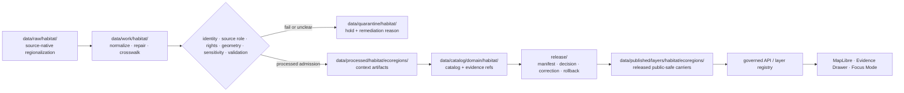

<!-- [KFM_META_BLOCK_V2]
doc_id: kfm://doc/data-processed-habitat-ecoregions-readme
title: data/processed/habitat/ecoregions/ — Habitat Ecoregion Processed Data
version: v0.2.0
type: directory-readme
subtype: processed-habitat-ecoregions-context-lane
status: repository-grounded draft; payload inventory, concrete schemas, validators, receipts, joins, proof, release, and runtime behavior remain bounded
owners:
  - "NEEDS VERIFICATION — Habitat domain steward"
  - "NEEDS VERIFICATION — ecoregion and ecological-classification steward"
  - "NEEDS VERIFICATION — spatial-foundation and source-role reviewer"
  - "NEEDS VERIFICATION — data, evidence, policy, release, correction, and rollback stewards"
created: NEEDS VERIFICATION — blank placeholder existed before v0.1 expansion
updated: 2026-07-25
policy_label: public-doc; processed-stage; habitat; ecoregions; regionalization-context; source-role-aware; sensitivity-aware; release-gated; no-direct-public-path
path: data/processed/habitat/ecoregions/README.md
truth_posture: >
  CONFIRMED exact target path, prior blob, Directory Rules placement, current Habitat parent lane,
  Habitat domain doctrine, ecoregion sublane doctrine, draft ecoregion schema index, and published
  ecoregion carrier README / PROPOSED lane-local admission profile, normalized ecoregion packet,
  crosswalk packet, and downstream promotion expectations / UNKNOWN recursive payload inventory,
  real source activation, concrete schema inventory, validators, fixtures, receipts, proof closure,
  released artifact instances, hosting, and public behavior / NEEDS VERIFICATION accountable owners,
  accepted classification frameworks, source-role vocabulary reconciliation, public-safe join policy,
  correction propagation, cache invalidation, and rollback drills
evidence_snapshot:
  repository: bartytime4life/Kansas-Frontier-Matrix
  base_ref: main
  base_commit: 924391fe4f8321653eaeaa124317c0dde0ae0ab3
  prior_blob: d1c4f85abe428fbf4421c637784de3cc0f32d268
  directory_rules_blob: 2affb080e6f0043867c64c7f06c1ca52030fbd55
  habitat_parent_blob: bbae8468b9acf483b1a77a2cd6ecfc08a691a318
  habitat_domain_blob: 876d1fa41a00d94d7120c6ef065750748e6bf524
  ecoregion_sublane_blob: fe9a5a90cc540fb68dfee6f2c420947c728ea7e8
  ecoregion_schema_index_blob: 36a47240f9a9d3e4d2e389b974c7a85061b657fd
  published_ecoregion_readme_blob: 3acedbe03e9df1cf50634813d9fa9a21cbc91ce5
related:
  - ../README.md
  - ../../README.md
  - ../../../README.md
  - ../../../../docs/domains/habitat/README.md
  - ../../../../docs/domains/habitat/sublanes/ecoregions.md
  - ../../../../docs/doctrine/directory-rules.md
  - ../../../../schemas/contracts/v1/domains/habitat/ecoregions/README.md
  - ../../../../policy/domains/habitat/README.md
  - ../../../../policy/sensitivity/habitat/README.md
  - ../../../raw/habitat/README.md
  - ../../../work/habitat/README.md
  - ../../../quarantine/habitat/README.md
  - ../../../catalog/domain/habitat/README.md
  - ../../../triplets/README.md
  - ../../../proofs/README.md
  - ../../../receipts/README.md
  - ../../../registry/sources/habitat/README.md
  - ../../../published/layers/habitat/ecoregions/README.md
  - ../../../../release/candidates/habitat/README.md
  - ../../../../release/README.md
notes:
  - "Same-path Markdown modernization only; no ecoregion bytes, source state, schema, contract, policy, validator, workflow, proof, release, route, hosting, or KFM publication state changed."
  - "Ecoregions classify places under named frameworks and versions; they do not prove species occurrence, habitat-patch condition, regulatory critical habitat, suitability, restoration priority, or management action."
  - "Sensitive or re-identifying cross-lane joins fail closed before public use; style filters are not a sensitivity control."
  - "Rollback target for v0.2.0 is prior blob SHA `d1c4f85abe428fbf4421c637784de3cc0f32d268`."
[/KFM_META_BLOCK_V2] -->

<a id="top"></a>

# `data/processed/habitat/ecoregions/` — Habitat ecoregion processed data

> **One-line purpose.** Hold normalized, source-versioned ecoregion and ecological-regionalization context artifacts while preserving framework, hierarchy, geometry lineage, source role, time, uncertainty, and sensitivity posture upstream of catalog, release, and publication.

[](#status)
[](#authority-level)
[](#what-belongs-here)
[](#outputs)
[](#source-role-and-sensitivity-guardrails)
[](#validation)

> [!IMPORTANT]
> **Ecoregions classify places; they do not establish what lives there.** A polygon may accurately identify a named regionalization framework and still be insufficient to support a species, habitat-condition, suitability, restoration, regulatory, or management claim.

**Path:** `data/processed/habitat/ecoregions/README.md`  
**Owning root:** `data/`  
**Lifecycle phase:** `processed/`  
**Domain segment:** `habitat/`  
**Lane role:** ecoregion and ecological-regionalization context  
**Direct public access:** denied  
**Last reviewed:** 2026-07-25

**Quick navigation:** [Purpose](#purpose) · [Authority level](#authority-level) · [Status](#status) · [What belongs here](#what-belongs-here) · [What does NOT belong here](#what-does-not-belong-here) · [Inputs](#inputs) · [Outputs](#outputs) · [Validation](#validation) · [Review burden](#review-burden) · [Related folders](#related-folders) · [ADRs](#adrs) · [Last reviewed](#last-reviewed) · [Ecoregion admission profile](#ecoregion-admission-profile) · [Source-role and sensitivity guardrails](#source-role-and-sensitivity-guardrails) · [Crosswalk and join discipline](#crosswalk-and-join-discipline) · [Lifecycle and promotion](#lifecycle-and-promotion) · [Correction and rollback](#correction-and-rollback)

---

## Purpose

This directory is the Habitat domain's **PROCESSED-stage lane for ecoregion and ecological-regionalization context artifacts**. It may hold normalized framework snapshots, hierarchy records, boundary derivatives, source-preserved crosswalks, region summaries, and public-candidate generalized context products that have moved beyond RAW capture, WORK transformation, and QUARANTINE holds.

The lane exists to preserve the answer to five questions before downstream use:

1. Which named regionalization framework produced the classification?
2. Which hierarchy level and source version does the artifact represent?
3. What geometry, CRS, simplification, and correction lineage produced it?
4. What source role and rights posture apply?
5. Which downstream claims and joins are allowed, restricted, or denied?

It is not a public layer store, species-occurrence store, proof store, receipt authority, catalog authority, release authority, or regulatory critical-habitat lane.

## Authority level

**Implementation-bearing lifecycle lane.** The target path is CONFIRMED in the repository and is correctly placed under `data/processed/habitat/` according to Directory Rules' lifecycle and domain-placement rules.

Its authority is deliberately narrow:

- it may carry processed ecoregion context artifacts and lane-local explanatory metadata;
- it does not define Habitat or ecoregion meaning—that remains in domain doctrine and semantic contracts;
- it does not define machine shape—that remains under `schemas/contracts/v1/domains/habitat/`;
- it does not decide admissibility, sensitivity, rights, review, release, or public exposure;
- it does not establish species, habitat-quality, suitability, restoration, regulatory, or management truth.

## Status

| Surface | Status | Evidence-bounded interpretation |
|---|---|---|
| This README and path | **CONFIRMED** | The file exists at the pinned base and is updated in place. |
| Parent Habitat processed lane | **CONFIRMED** | `data/processed/habitat/README.md` identifies `ecoregions/` as a child context lane. |
| Habitat ecoregion doctrine | **CONFIRMED repository document / draft** | The sublane document defines ecoregions as framework-versioned regionalization context, not species or patch truth. |
| Ecoregion schema sublane | **CONFIRMED index / NEEDS VERIFICATION inventory** | The schema README exists but reports no confirmed concrete schema files. |
| Published ecoregion carrier lane | **CONFIRMED README / release instances UNKNOWN** | A `data/published/layers/habitat/ecoregions/README.md` exists; its own text requires release evidence before exposure. |
| Real processed payload inventory | **UNKNOWN** | This documentation task did not inspect or expose ecoregion data payloads. |
| Validators, fixtures, CI enforcement | **NEEDS VERIFICATION** | No accepted ecoregion production validator suite was verified in this task. |
| Receipts, proof, policy decisions, release instances, hosting, public behavior | **UNKNOWN / held** | Presence in this directory creates none of these states. |

## What belongs here

Good fits are processed regionalization artifacts whose source and transformation history remain inspectable, including:

- normalized ecoregion polygons keyed to a named framework, hierarchy level, extent, and source version;
- frozen ecoregion snapshots with distinct valid, source, retrieval, release, and correction times where material;
- hierarchy and parent-child relations between regionalization levels;
- source-preserved crosswalks between ecoregion or ecological-classification frameworks;
- geometry-normalized derivatives with source CRS, target CRS, repair, simplification, clipping, and digest metadata;
- region-level landscape-context summaries that do not imply species, patch, suitability, regulatory, or management truth;
- public-candidate generalized derivatives that remain upstream of catalog and release review;
- quality, uncertainty, disputed-boundary, coverage, and correction sidecars that are not trust-bearing receipts or proofs;
- object-ready candidates prepared for future contract/schema validation, catalog closure, EvidenceBundle support, or release review;
- lane-local README or non-release manifest notes that explain artifact identity without becoming release authority.

## What does NOT belong here

Do not place these in `data/processed/habitat/ecoregions/`:

- RAW source downloads, source-native geodatabases, shapefiles, rasters, agency exports, source logs, or unprocessed source geometry;
- WORK notebooks, geometry-repair experiments, classification trials, temporary joins, scratch crosswalks, or redaction-debug products;
- QUARANTINE material with unresolved rights, source role, framework identity, hierarchy, geometry, sensitivity, dispute, or quality state;
- Fauna occurrences, Flora occurrences or specimens, rare-species or rare-plant locations, private-parcel detail, land ownership, or steward-controlled biodiversity records;
- habitat patches, suitability surfaces, quality scores, connectivity edges, corridor candidates, restoration prescriptions, stewardship decisions, or regulatory critical-habitat records merely because they overlap an ecoregion;
- semantic contracts, JSON Schemas, policy rules, validators, tests, fixtures, pipelines, source descriptors, catalog records, STAC/DCAT/PROV projections, triplets, proofs, receipts, releases, correction notices, rollback cards, or published artifacts;
- public map, tile, API, download, export, Focus Mode, Evidence Drawer, search, graph, or AI-answer payloads;
- hidden sensitive joins, transform secrets, generalization parameters, access credentials, private agreements, field routes, or details that could aid re-identification or unauthorized access.

## Inputs

Inputs may enter this lane only through governed lifecycle transitions from:

- `data/work/habitat/` after framework, hierarchy, source role, rights, geometry, time, and validation posture are recorded;
- `data/quarantine/habitat/` after the hold condition is resolved and the remediation decision is auditable;
- accepted Habitat pipelines or tools that preserve source bytes by reference, source version, transform method, geometry lineage, and correction state;
- approved cross-domain context inputs where ownership remains with the source domain and the relation is explicit.

A connector-to-PROCESSED, watcher-to-PROCESSED, or public-upload-to-PROCESSED shortcut is not an accepted normal path. Connectors and watchers produce source or candidate state; they do not publish or silently promote.

## Outputs

This lane may support downstream candidates for:

- `data/catalog/domain/habitat/` and accepted STAC/DCAT/PROV catalog projections;
- `data/triplets/` or other relationship projections that preserve source, framework, hierarchy, and evidence references;
- separate `data/proofs/` and `data/receipts/` objects;
- `release/candidates/habitat/` after identity, rights, sensitivity, validation, evidence, review, correction, and rollback obligations are met;
- `data/published/layers/habitat/ecoregions/` only through a governed release transition and a separate released artifact path;
- governed API, MapLibre, Evidence Drawer, export, or Focus Mode carriers only after public-safe release.

> [!CAUTION]
> Ordinary public clients must not read this directory directly. A processed ecoregion artifact is not a released public layer merely because the geometry is coarse, familiar, or easy to render.

## Validation

No ecoregion production validator suite was verified in this task. The current schema sublane README reports candidate schema names and an unverified concrete inventory; therefore this document does not claim field-level schema enforcement.

A credible validation profile should check, at minimum:

1. framework, authority, hierarchy level, and source-version identity;
2. source role, rights, citation, and redistribution posture;
3. stable feature identity and parent-child hierarchy integrity;
4. geometry validity, topology, coverage, clipping, slivers, gaps, overlaps, and disputed-boundary posture;
5. source CRS, transformation, simplification, and output CRS lineage;
6. valid, source, retrieval, release, and correction time semantics where material;
7. attribute provenance and approved field vocabulary;
8. uncertainty, completeness, quality, correction, and supersession state;
9. crosswalk cardinality, confidence, and non-equivalence warnings;
10. sensitive-join, re-identification, evidence, policy, review, release-hold, correction, and rollback state.

Fail closed or quarantine when framework, level, version, rights, geometry, source role, evidence, sensitivity, or downstream fitness is absent, contradictory, disputed, stale beyond policy, or unsafe for the requested use.

## Review burden

Changes require review proportional to consequence:

| Change | Minimum review burden |
|---|---|
| README wording or navigation only | Docs steward plus Habitat/ecoregion reviewer. |
| New framework, hierarchy level, or source family | Habitat steward, source steward, spatial-foundation reviewer, rights reviewer, and docs steward. |
| Geometry repair, simplification, crosswalk, uncertainty, or identity semantics | Habitat reviewer plus spatial, contract/schema, and validator reviewers. |
| Sensitive biodiversity, parcel, infrastructure, or steward-controlled join | Owning domain steward, sensitivity/policy reviewer, evidence reviewer, and rights-holder representative where applicable. |
| Public-facing map, API, Focus Mode, export, or release linkage | Habitat, evidence, policy, release, correction, rollback, and independent approval where required. |
| Regulatory, restoration, management, or legal implication | Hold by default; require the owning authority and claim-specific evidence. |

## Related folders

| Concern | Repository home | Relationship |
|---|---|---|
| Parent processed Habitat lane | [`../README.md`](../README.md) | Parent lifecycle and source-role boundary. |
| Habitat domain doctrine | [`../../../../docs/domains/habitat/README.md`](../../../../docs/domains/habitat/README.md) | Landscape ownership, source roles, cross-domain boundaries. |
| Ecoregion sublane doctrine | [`../../../../docs/domains/habitat/sublanes/ecoregions.md`](../../../../docs/domains/habitat/sublanes/ecoregions.md) | Framework, hierarchy, regionalization, map, and join semantics. |
| Ecoregion schema index | [`../../../../schemas/contracts/v1/domains/habitat/ecoregions/README.md`](../../../../schemas/contracts/v1/domains/habitat/ecoregions/README.md) | Machine-shape placement and verification backlog. |
| Habitat policy | [`../../../../policy/domains/habitat/README.md`](../../../../policy/domains/habitat/README.md) | Domain admissibility. |
| Habitat sensitivity policy | [`../../../../policy/sensitivity/habitat/README.md`](../../../../policy/sensitivity/habitat/README.md) | Sensitive joins and public-safe transforms. |
| Source registry | [`../../../registry/sources/habitat/README.md`](../../../registry/sources/habitat/README.md) | SourceDescriptor authority. |
| Habitat catalog | [`../../../catalog/domain/habitat/README.md`](../../../catalog/domain/habitat/README.md) | Downstream discoverability and evidence linkage. |
| Published ecoregion layers | [`../../../published/layers/habitat/ecoregions/README.md`](../../../published/layers/habitat/ecoregions/README.md) | Released carrier lane, not processed truth. |
| Release candidates | [`../../../../release/candidates/habitat/README.md`](../../../../release/candidates/habitat/README.md) | Candidate release posture. |
| Release authority | [`../../../../release/README.md`](../../../../release/README.md) | Manifests, decisions, correction, withdrawal, rollback. |

## ADRs

- **ADR-0001 — schema home:** machine-checkable Habitat shapes belong under `schemas/contracts/v1/domains/habitat/`; this README creates no parallel schema authority.
- **Habitat schema-home ADR:** repository search surfaced `docs/adr/ADR-habitat-schema-home.md`; its exact status and interaction with ADR-0001 remain **NEEDS VERIFICATION** before relying on it for new machine files.
- Any change that creates a parallel Habitat contract, schema, policy, source, registry, proof, receipt, release, or publication home requires an accepted ADR or migration record.

## Last reviewed

**2026-07-25.** Review again when any of the following changes:

- a concrete ecoregion schema is added or accepted;
- a validator, fixture, or CI profile is introduced;
- a source framework or hierarchy is activated;
- a processed ecoregion payload or crosswalk is added;
- sensitive join or public-safe transformation policy changes;
- a release candidate or public ecoregion layer instance is created;
- correction, withdrawal, cache invalidation, or rollback behavior changes.

## Ecoregion admission profile

A processed ecoregion artifact should not be admitted here unless its review packet can answer the following without guessing:

| Dimension | Minimum expected support | Failure posture |
|---|---|---|
| Identity | Stable feature or snapshot identity; framework and hierarchy level | QUARANTINE on ambiguity or collision |
| Source | SourceDescriptor, source version, source role, citation, rights | DENY or QUARANTINE when unresolved |
| Geometry | Source geometry ref, source CRS, transform/repair history, output CRS, digest | ERROR or QUARANTINE on invalid or unexplained geometry |
| Time | Valid/source/retrieval/correction time where material | ABSTAIN or STALE when unsupported |
| Classification | Framework vocabulary, level, parent-child relation, attribute provenance | QUARANTINE on mixed or unexplained frameworks |
| Crosswalk | Target framework, method, cardinality, confidence, non-equivalence notes | ABSTAIN when comparison is unsupported |
| Quality | Coverage, completeness, disputed boundaries, uncertainty, validation state | HOLD when material limitations are hidden |
| Sensitivity | Join posture, re-identification review, public-safe transformation state | DENY when unsafe or unresolved |
| Evidence and release | EvidenceRef support, policy/review state, release hold, correction and rollback refs | Not eligible for public promotion when incomplete |

Presence in this directory is not evidence that every row above has passed. It identifies the expected closure burden for future contracts, schemas, validators, and review.

## Source-role and sensitivity guardrails

- Habitat owns landscape and habitat context, not species records.
- Ecoregions are regionalization context, not occurrence evidence, habitat-patch condition, or a suitability score.
- A modeled ecological classification is not a regulatory critical-habitat determination.
- A regionalization framework must retain its actual source role; source role must not be upgraded by normalization or promotion.
- The Habitat doctrine's seven-role vocabulary (`observed`, `regulatory`, `modeled`, `aggregate`, `administrative`, `candidate`, `synthetic`) and the ecoregion sublane's framework-oriented labels require reconciliation before field-level persistence; do not silently substitute one vocabulary for another.
- Habitat × Fauna, Habitat × Flora, Habitat × parcel, Habitat × infrastructure, and steward-controlled biodiversity joins can raise sensitivity even when the ecoregion polygons themselves are broadly public.
- Sensitive or re-identifying geometry must be transformed, restricted, delayed, or denied before public artifact generation; hiding features or attributes in a map style is not a policy control.
- Public tiles and exports require explicit field allowlists; omission from a style does not remove a field from public bytes.
- Unclear rights, unresolved framework identity, missing evidence, disputed geometry, unresolved sensitivity, or absent release state blocks public promotion.
- Governed clients use released artifacts, catalog records, EvidenceBundle-backed payloads, and policy-safe envelopes—not this processed directory directly.

> [!CAUTION]
> Do not expose this lane as a species-location service, critical-habitat determination, restoration recommendation, land-management instruction, private-parcel targeting aid, ecological/legal advice, emergency alert, or life-safety product.

## Crosswalk and join discipline

An ecoregion crosswalk or spatial join is a derived interpretation, not a claim that two frameworks or domains are identical.

Each crosswalk should preserve:

- source framework and version;
- target framework and version;
- relationship type (`exact`, `contains`, `within`, `overlaps`, `nearest`, `derived`, or another controlled value);
- method and tool version;
- geometry and temporal basis;
- one-to-one, one-to-many, many-to-one, or many-to-many cardinality;
- overlap or confidence metrics where meaningful;
- unresolved, disputed, or non-comparable cases;
- evidence, review, correction, and supersession lineage.

Never infer species presence, habitat quality, suitability, restoration priority, regulatory status, or land-management action solely from ecoregion membership or overlap.

## Lifecycle and promotion



The normal public path is:

```text
processed regionalization context
→ catalog and EvidenceBundle closure
→ policy and review
→ release manifest and promotion decision
→ released public-safe artifact
→ layer registry and governed API
→ MapLibre / Evidence Drawer / Focus Mode
```

The forbidden shortcut is:

```text
source or processed ecoregion file
→ direct public map, API, download, join, or AI answer
```

## Correction and rollback

Corrections must propagate to every affected derivative, including:

- repaired or superseded framework snapshots;
- hierarchy and crosswalk records;
- catalog, STAC, DCAT, PROV, and triplet projections;
- evidence references and public citations;
- public PMTiles, GeoParquet, GeoJSON, manifests, field allowlists, styles, and exports;
- caches, layer-registry pointers, governed API payloads, Evidence Drawer content, and Focus Mode context;
- correction notices, withdrawal records, and rollback targets.

Rollback is required when this lane becomes a RAW source root, WORK scratch root, QUARANTINE bypass, public output root, species or habitat truth shortcut, sensitive-join exposure path, proof or receipt store, catalog authority, release authority, schema or policy authority, validator implementation root, direct public API/UI/tile path, regulatory determination source, restoration prescription source, land-management guidance source, or life-safety product.

**Rollback target for this documentation update:** prior blob `d1c4f85abe428fbf4421c637784de3cc0f32d268`. After merge, revert the modernization commit rather than rewriting shared history.

## Open verification register

| Item | Status | Required evidence |
|---|---|---|
| Recursive contents of this processed lane | UNKNOWN | Pinned tree or mounted checkout review |
| Accepted ecoregion frameworks and hierarchy levels | NEEDS VERIFICATION | SourceDescriptors, rights review, domain decision |
| Concrete schema inventory | NEEDS VERIFICATION | Machine files, schema registry, fixtures, validation results |
| Validator and CI coverage | NEEDS VERIFICATION | Deterministic validators, positive/negative fixtures, workflow evidence |
| Source-role vocabulary reconciliation | NEEDS VERIFICATION | Accepted contract/schema/policy decision or ADR |
| Crosswalk confidence and comparability rules | PROPOSED | Contract, schema, validator, fixtures, domain review |
| Sensitive join enforcement | NEEDS VERIFICATION | Policy tests, redaction/generalization receipts, review records |
| Proof and release closure | UNKNOWN / held | EvidenceBundle, proof pack, PromotionDecision, ReleaseManifest |
| Published ecoregion artifact instances | UNKNOWN | Released bytes, digest, manifest, proof, rollback target |
| Governed API and UI behavior | UNKNOWN | Route contract, implementation, integration tests, runtime evidence |
| Accountable owners and review separation | NEEDS VERIFICATION | CODEOWNERS or governance register |

## No-loss ledger

| Prior material | Disposition in v0.2.0 |
|---|---|
| Blank-placeholder and v0.1 lineage | Preserved in metadata and rollback history. |
| PROCESSED lifecycle boundary | Preserved and strengthened. |
| Ecoregions as context, not species or management truth | Preserved and expanded. |
| Source-role anti-collapse | Preserved; vocabulary tension made visible. |
| Sensitive-join fail-closed posture | Preserved and operationalized. |
| Separation of data, contracts, schemas, policy, receipts, proof, catalog, release, and publication | Preserved. |
| Speculative child-directory tree | Removed; recursive inventory is UNKNOWN. |
| Stale statement that parent Habitat lane is only a stub | Corrected using current repository evidence. |
| Validation, correction, and rollback expectations | Preserved and expanded. |

---

<p align="right"><a href="#top">Back to top</a></p>
