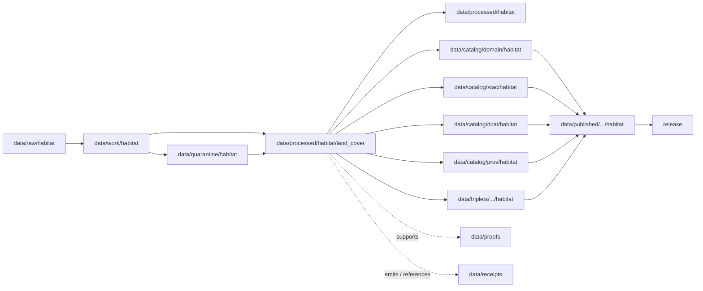

<!-- [KFM_META_BLOCK_V2]
doc_id: kfm://doc/data-processed-habitat-land-cover-readme
title: data/processed/habitat/land_cover/README.md — Habitat Land Cover Processed Data README
version: v0.1
type: readme; data-lifecycle-sublane; processed-stage-guide; habitat-domain-lane; land-cover-observation-lane; remote-sensing-context-lane
status: draft; PROPOSED; data-root; processed-stage; habitat; land-cover; land-cover-observation; observed; remote-sensing; source-role-aware; sensitivity-aware; release-gated; evidence-first
authors: ChatGPT-5.5 Thinking; reviewed_by: OWNER_TBD
owners: OWNER_TBD — Habitat steward · Land-cover steward · Remote-sensing data steward · Sensitivity reviewer · Data steward · Pipeline steward · Evidence steward · Policy steward · Release steward · Docs steward
created: NEEDS VERIFICATION — blank placeholder existed before v0.1 expansion
updated: 2026-06-25
policy_label: public-doc; data; processed; habitat; land-cover; remote-sensing; lifecycle; governed; release-gated
tags: [kfm, data, processed, habitat, land-cover, land-cover-observation, remote-sensing, NLCD, vegetation-index, habitat-patch, ecological-system, source-role, observed, regulatory, modeled, aggregate, administrative, candidate, synthetic, EvidenceBundle, SourceDescriptor, ValidationReport, PolicyDecision, ReleaseManifest, RAW, WORK, QUARANTINE, PROCESSED, CATALOG, TRIPLET, PUBLISHED]
related:
  - ../README.md
  - ../ecoregions/README.md
  - ../../README.md
  - ../../../README.md
  - ../../../../docs/domains/habitat/README.md
  - ../../../../docs/domains/fauna/README.md
  - ../../../../docs/domains/flora/README.md
  - ../../../../docs/domains/soil/README.md
  - ../../../../docs/domains/hydrology/README.md
  - ../../../../docs/domains/agriculture/README.md
  - ../../../../policy/domains/habitat/
  - ../../../../policy/sensitivity/habitat/
  - ../../../../contracts/domains/habitat/
  - ../../../../schemas/contracts/v1/domains/habitat/
  - ../../../raw/habitat/
  - ../../../work/habitat/
  - ../../../quarantine/habitat/
  - ../../../catalog/domain/habitat/
  - ../../../catalog/stac/habitat/
  - ../../../catalog/dcat/habitat/
  - ../../../catalog/prov/habitat/
  - ../../../triplets/
  - ../../../published/
  - ../../../proofs/
  - ../../../receipts/
  - ../../../registry/sources/habitat/
  - ../../../../release/candidates/habitat/
  - ../../../../release/
  - ../../../../pipelines/domains/habitat/
  - ../../../../pipeline_specs/habitat/
  - ../../../../tools/validators/
notes:
  - "This file replaces a blank placeholder at `data/processed/habitat/land_cover/README.md`."
  - "This is a child PROCESSED-stage lane under `data/processed/habitat/` for normalized land-cover observations and remote-sensing-derived landscape context. It is not a RAW source root, WORK scratch area, QUARANTINE bypass, CATALOG, TRIPLET, PUBLISHED, proof store, receipt store, source registry, policy authority, release authority, public API/UI output, or public map/tile output."
  - "Land-cover artifacts are observed or source-role-preserved context. They may feed modeled habitat products, but they are not suitability models, regulatory critical habitat, species occurrences, restoration prescriptions, or land-management decisions by themselves."
  - "Habitat source roles must remain explicit: observed, regulatory, modeled, aggregate, administrative, candidate, and synthetic are not interchangeable."
  - "Sensitive joins to Fauna, Flora, private parcels, rare species, rare plants, wetlands, stewardship zones, or steward-controlled biodiversity context must fail closed unless policy, review, evidence, transform receipts, release state, correction path, and rollback support public use."
  - "This README is a lane guide only. Contracts define semantic object meaning; schemas define machine shape; policy decides admissibility; release records decide publication."
  - "Rollback target for this expansion is previous blank placeholder blob SHA `8b137891791fe96927ad78e64b0aad7bded08bdc`."
[/KFM_META_BLOCK_V2] -->

<a id="top"></a>

# data/processed/habitat/land_cover

> Habitat PROCESSED-stage child lane for normalized land-cover observations, land-cover class rasters/vectors, remote-sensing-derived land-cover summaries, and source-role-preserved landscape context artifacts that support habitat analysis but are not cataloged, triplet-projected, published, or released by this directory alone.

<p>
  
  
  
  
  
  
</p>

**Status:** draft / PROPOSED  
**Owners:** OWNER_TBD — Habitat steward · Land-cover steward · Remote-sensing data steward · Sensitivity reviewer · Data steward · Pipeline steward · Evidence steward · Policy steward · Release steward · Docs steward  
**Path:** `data/processed/habitat/land_cover/README.md`  
**Owning root:** `data/processed/`  
**Domain segment:** `habitat`  
**Parent lane:** `data/processed/habitat/`  
**Sublane:** `land_cover` / land-cover observation and remote-sensing context  
**Lifecycle stage:** `PROCESSED`  
**Exposure posture:** not public by default; any public use requires governed catalog, EvidenceBundle, source-role and rights posture, sensitivity/policy review, ValidationReport, PolicyDecision, ReleaseManifest, correction path, and rollback target.  
**Truth posture:** CONFIRMED target was a blank placeholder · CONFIRMED Habitat source roles are first-class identity attributes and cannot be collapsed during promotion · CONFIRMED `LandCoverObservation` is a Habitat object family · CONFIRMED Habitat lifecycle promotion is governed and release-gated · PROPOSED land-cover child-lane details · NEEDS VERIFICATION for actual child inventory, schemas, validators, fixtures, source descriptors, receipt families, policy enforcement, release linkage, and governed route behavior.

**Quick jumps:** [Purpose](#purpose) · [Lifecycle boundary](#lifecycle-boundary) · [Repo fit](#repo-fit) · [Accepted contents](#accepted-contents) · [Exclusions](#exclusions) · [Land-cover processed requirements](#land-cover-processed-requirements) · [Source-role and sensitivity guardrails](#source-role-and-sensitivity-guardrails) · [Directory map](#directory-map) · [Evidence ledger](#evidence-ledger) · [Validation checklist](#validation-checklist) · [Rollback](#rollback)

---

## Purpose

`data/processed/habitat/land_cover/` holds processed land-cover artifacts for the Habitat lane. These artifacts can support habitat patches, ecological-system classification, modeled habitat suitability, restoration-opportunity analysis, connectivity context, and public-safe landscape overlays when downstream evidence, policy, validation, catalog, and release gates pass.

This lane may contain or point to normalized artifacts such as:

- land-cover observation records at a place and time;
- remote-sensing-derived land-cover class rasters, vectors, or summaries;
- NLCD-derived or comparable source-role-preserved land-cover products;
- vegetation-index-derived land-cover context when source and method are explicit;
- land-cover crosswalks used for habitat classification;
- versioned land-cover class dictionaries and source-vintage sidecars;
- public-candidate generalized land-cover overlays that still require catalog and release review.

This lane does not make a habitat suitability claim by itself. It also does not prove species occurrence, critical habitat, ecological condition, restoration priority, agricultural crop truth, hydrologic condition, soil truth, hazard risk, land ownership, or land-management status without downstream evidence, policy, catalog, release, and claim-specific contracts.

## Lifecycle boundary

```text
RAW -> WORK / QUARANTINE -> PROCESSED -> CATALOG / TRIPLET -> PUBLISHED
```



`data/processed/habitat/land_cover/` is upstream of catalog, triplet, publication, and release. It must not be used as a normal public map/API/UI/AI source.

## Repo fit

| Responsibility | Correct home | Rule |
|---|---|---|
| Raw land-cover downloads, source-native rasters, source geodatabases, agency/steward exports, source logs, original pixels/classes/geometry, or source identifiers | `data/raw/habitat/` | Not this lane. |
| In-process transforms, raster warps, reclassification experiments, geometry repair, class crosswalk trials, joins, QA, notebooks, or scratch products | `data/work/habitat/` | Not this lane. |
| Unresolved rights, unresolved source role, malformed rasters/vectors, disputed classes, sensitive joins, unsafe geometry, or not-yet-reviewed habitat material | `data/quarantine/habitat/` | Not this lane until review/admission allows. |
| Processed land-cover observations and context artifacts | `data/processed/habitat/land_cover/` | This lane. |
| Parent processed Habitat lane | `data/processed/habitat/` | Parent lane; still not public by default. |
| Ecoregion / ecological-region context | `data/processed/habitat/ecoregions/` | Related context lane; not a substitute for land-cover observations. |
| Habitat catalog records | `data/catalog/domain/habitat/` | Downstream catalog stage. |
| Habitat STAC/DCAT/PROV records | `data/catalog/{stac,dcat,prov}/habitat/` | Downstream catalog projections if accepted. |
| Habitat triplet/graph records | `data/triplets/.../habitat/` | Downstream graph stage; must not expose restricted geometry or unsafe joins. |
| Published public-safe Habitat products | `data/published/.../habitat/` | Downstream only after release. |
| EvidenceBundle/proof records | `data/proofs/` | Separate proof family. |
| Source, run, model-run, transform, validation, policy, correction, access, and release receipts | `data/receipts/` | Separate receipt family. |
| Habitat source registry records | `data/registry/sources/habitat/` | Separate source authority. |
| Release candidates and release manifests | `release/candidates/habitat/`, `release/` | Separate publication authority. |
| Habitat contracts | `contracts/domains/habitat/` | Object meaning; not data. |
| Habitat schemas | `schemas/contracts/v1/domains/habitat/` | Machine shape; not data. |
| Habitat policy and sensitivity rules | `policy/domains/habitat/`, `policy/sensitivity/habitat/` if accepted | Admissibility authority; not data. |
| Validators, tests, fixtures, pipelines, pipeline specs, apps, packages | `tools/validators/`, `tests/`, `fixtures/`, `pipelines/`, `pipeline_specs/`, `apps/`, `packages/` | Separate roots. |

## Accepted contents

Processed land-cover artifacts may include:

- normalized land-cover observation records with source, vintage, role, rights, class system, spatial reference, validation state, and digest posture;
- land-cover class rasters, vectors, summaries, or tile-candidate derivatives that remain upstream of release;
- class dictionaries, crosswalk tables, and reclassification products used to support habitat classification;
- remote-sensing vegetation-index context where observation/model boundaries are explicit;
- links from land cover to `HabitatPatch`, `EcologicalSystem`, or `SuitabilityModel` inputs when ownership and source-role boundaries remain visible;
- classification-quality, geometry-validity, uncertainty, source-vintage, or boundary-version sidecars needed to interpret processed products;
- review-ready artifacts for public-safe land-cover map candidates when source rights, sensitivity joins, and policy posture are explicit;
- lane-local README or manifest notes that explain processed-data boundaries without becoming public outputs or authority records.

## Exclusions

Do not store these under `data/processed/habitat/land_cover/`:

- RAW source rasters, source-native downloads, steward originals, source media, logs, original source geometries, source identifiers, or unprocessed agency/partner exports.
- WORK/scratch files, notebooks, transform experiments, unresolved QA joins, raster warps, class-crosswalk trials, classifier trials, or redaction-debug outputs.
- Quarantined or unresolved sensitive/rights/source-role material.
- Catalog records, STAC/DCAT/PROV records, triplet/graph records, published products, proof records, receipt records, source registry records, release decisions, schemas, policy rules, validators, tests, fixtures, pipelines, pipeline specs, app/UI/API code, or packages.
- Species occurrence records, plant specimen records, rare-species/rare-plant location records, soil map unit truth, hydrology measurement truth, crop/field truth, hazard event truth, archaeology site truth, or land/ownership truth.
- Habitat suitability scores, regulatory critical-habitat determinations, restoration prescriptions, management decisions, corridor/connectivity claims, ecoregion truth, or ecological condition claims unless separate object contracts, evidence, validation, policy, and release state support them.
- Public API/UI/tile payloads, direct downloads, Focus Mode answers, public map layers, landowner/parcel targeting aids, ecological/legal advice, operational land-management guidance, emergency alerts, or life-safety guidance.
- Redaction parameters, aggregation thresholds, small-cell thresholds, fuzzing radii, seeds, exact transform offsets, access credentials, secrets, private agreement terms, field access routes, or implementation details that could aid exposure or unauthorized access.

## Land-cover processed requirements

PROPOSED until concrete validators, policies, fixtures, receipts, and access-control enforcement are verified:

| Requirement | Meaning |
|---|---|
| Source trace | Each source-derived artifact should trace to SourceDescriptor or habitat source registry context. |
| Evidence linkage | Claims about land-cover class, source vintage, place, time, class crosswalk, habitat context, transform, review, or release readiness should resolve downstream to EvidenceBundle/proof context where appropriate. |
| Source role | Observed, regulatory, modeled, aggregate, administrative, candidate, and synthetic roles must remain explicit and not interchangeable. |
| Observation identity | Land-cover class, class system, location/grid/cell footprint, source vintage, method/source basis, spatial reference, and normalized digest should remain auditable. |
| Time semantics | Source time, observed time, valid time, retrieval time, raster/classification version time, correction time, and release time should remain distinguishable where material. |
| Rights posture | Agency, steward, license, redistribution, attribution, derivative-use, and remote-sensing source terms should be resolved or held closed. |
| Sensitivity posture | Joins to sensitive fauna/flora occurrences, rare-plant locations, private parcels, wetlands, stewardship zones, or small-cell outputs should carry restriction/generalization/denial posture. |
| Transform linkage | Reprojection, reclassification, aggregation, redaction, suppression, withholding, delayed publication, or public-safe geometry transform should link to the appropriate receipt family. |
| Review state | Habitat steward, source steward, sensitivity reviewer, data-quality reviewer, and release authority review should be recorded where required. |
| Policy decision | Restricted, public-candidate, and public transitions require PolicyDecision/admissibility posture where policy requires it. |
| Catalog readiness | Processed land-cover artifacts intended for discovery should promote through catalog/triplet lanes, not directly to public use. |
| Release readiness | Public use requires ReleaseManifest or release-linked state, published output path, correction path, and rollback target. |
| No public surface by default | Processed land-cover artifacts must not be exposed directly as public maps, tiles, APIs, downloads, Focus Mode answers, or AI-answer sources. |

## Source-role and sensitivity guardrails

- Habitat owns landscape/habitat context, not species records.
- `LandCoverObservation` is an observed habitat object family; it is not automatically a modeled habitat product, suitability score, regulatory critical-habitat unit, or ecological condition claim.
- NLCD and other remote-sensed land-cover sources may feed modeled classifications, but the downstream model must carry its own source role, version, inputs, receipts, and uncertainty.
- A modeled habitat product is not regulatory critical habitat.
- A suitability surface is not an occurrence.
- A land-cover class is not a habitat-quality score, restoration priority, corridor, stewardship decision, crop truth, soil truth, hydrology truth, or land-management instruction by itself.
- Observed, regulatory, modeled, aggregate, administrative, candidate, and synthetic source roles must not be relabeled during promotion.
- Sensitive habitat × fauna, habitat × flora, habitat × parcel, habitat × hydrology, habitat × soil, habitat × agriculture, and habitat × hazards joins must preserve ownership, source role, sensitivity, and EvidenceBundle support.
- Sensitive geometry must be generalized, redacted, delayed, restricted, or denied before tile generation; style filters are not a sensitivity control.
- Unclear rights, unresolved source role, missing evidence, unresolved sensitivity, or absent release state blocks public promotion.
- Public clients and Focus Mode must use governed APIs, released artifacts, catalog/triplet records, EvidenceBundle-backed payloads, and policy-safe envelopes, not this directory directly.

> [!CAUTION]
> Do not expose `data/processed/habitat/land_cover/` directly as a public map, tile service, API, UI, download, Focus Mode answer, AI answer source, species-location service, critical-habitat determination, restoration prescription, landowner/parcel targeting aid, ecological/legal advice, operational land-management guidance, emergency alert, or life-safety product. Processed land-cover data remains inside the trust membrane until governed promotion and release.

## Directory map

Actual child inventory remains **NEEDS VERIFICATION**. Use this as a proposed local organization pattern only after confirming current repo convention and validators.

```text
data/processed/habitat/land_cover/
├── README.md
├── observations/             # PROPOSED — normalized land-cover observation records
├── rasters/                  # PROPOSED — processed raster derivatives, not published tiles
├── vectors/                  # PROPOSED — processed vector derivatives
├── class_crosswalks/         # PROPOSED — source/classification crosswalks
├── summaries/                # PROPOSED — region/patch-level land-cover summaries
├── generalized/              # PROPOSED — public-candidate generalized derivatives
├── versions/                 # PROPOSED — source-vintage/version sidecars
├── validation/               # PROPOSED — lane-local validation notes, not ValidationReport authority
├── joins/                    # PROPOSED — reviewed context joins only, not species/crop/soil/hydrology truth
├── _manifests/               # PROPOSED — lane-local non-release manifests only
└── _README_TODO.md           # PROPOSED — remove after actual child inventory is documented
```

## Evidence ledger

| Source | Status | Supports | Limits |
|---|---|---|---|
| Previous file | CONFIRMED | Target existed as a blank placeholder. | Did not define land-cover processed boundaries. |
| `data/processed/habitat/README.md` | CONFIRMED | Parent Habitat processed lane currently exists only as a greenfield stub. | Does not define habitat processed boundaries yet. |
| `data/processed/README.md` | CONFIRMED | PROCESSED data is upstream of catalog, triplets, publication, and release and is not the normal public surface. | Does not prove Habitat child inventory or enforcement. |
| `docs/domains/habitat/README.md` | CONFIRMED doctrine / PROPOSED implementation | Habitat admits sources through SourceDescriptor, preserves source roles, includes NLCD land cover and remote-sensing vegetation indices as source families, names LandCoverObservation as an object family, and defines lifecycle promotion gates. | Implementation maturity remains NEEDS VERIFICATION. |
| `policy/domains/habitat/` and `policy/sensitivity/habitat/` | NEEDS VERIFICATION | Expected admissibility homes. | Current policy files and enforcement were not verified in this task. |
| `contracts/domains/habitat/` and `schemas/contracts/v1/domains/habitat/` | NEEDS VERIFICATION | Expected object contract/schema homes for Habitat families. | Specific land-cover object files and validators were not verified in this task. |

## Validation checklist

- [ ] Confirm actual child directories under `data/processed/habitat/land_cover/`.
- [ ] Confirm whether `land_cover/` is the accepted processed Habitat lane name or should be reconciled with `landcover/`, `land_cover_observations/`, `nlcd/`, or another object-family naming convention.
- [ ] Confirm parent `data/processed/habitat/README.md` is expanded beyond stub.
- [ ] Confirm LandCoverObservation object contracts and schema paths.
- [ ] Confirm source-role vocabulary and anti-collapse validators for observed/regulatory/modeled/aggregate/administrative/candidate/synthetic roles.
- [ ] Confirm validators, fixtures, CI checks, policy checks, and access-control enforcement for processed land-cover artifacts.
- [ ] Confirm SourceDescriptor/source registry linkage for source-derived artifacts.
- [ ] Confirm RunReceipt, TransformReceipt, ModelRunReceipt where applicable, ValidationReport, PolicyDecision, CorrectionNotice, ReleaseManifest, correction path, and rollback target.
- [ ] Confirm sensitive fauna/flora joins, rare-plant joins, private-parcel joins, wetlands/stewardship joins, small-cell outputs, rights-unclear sources, unresolved source roles, redaction parameters, transform secrets, and release-unclear artifacts cannot enter public routes.
- [ ] Confirm public-candidate transitions are governed, evidence-backed, source-role-safe, rights-safe, sensitivity-safe, review-backed, release-linked, and reversible.
- [ ] Confirm no RAW, WORK, QUARANTINE, CATALOG, TRIPLET, PUBLISHED, proof, receipt, registry, release, schema, policy, validator, package, pipeline, app, API, public map, public tile, direct download, Focus Mode answer, critical-habitat determination, restoration prescription, crop/field truth, land-management guidance, or life-safety artifact is misplaced here.
- [ ] Confirm public clients and Focus Mode cannot read this lane directly as public truth, public location service, public map, public tile, public API, public UI, or AI-answer source.

## Rollback

Rollback is required if this lane becomes a RAW source-data root, WORK scratch root, QUARANTINE bypass, public output root, `data/published/` substitute, public-candidate shortcut, sensitive-join exposure path, transform-secret exposure path, agreement/credential exposure path, proof store, receipt store, catalog root, triplet root, source-registry root, release-decision root, schema root, policy root, validator root, implementation root, public API shortcut, public UI shortcut, public tile shortcut, public exposure shortcut, species-location source, critical-habitat determination source, restoration prescription source, crop/field truth source, land-management guidance source, or life-safety guidance source.

Rollback target for this expansion: previous blank placeholder blob SHA `8b137891791fe96927ad78e64b0aad7bded08bdc`.

<p align="right"><a href="#top">Back to top</a></p>
