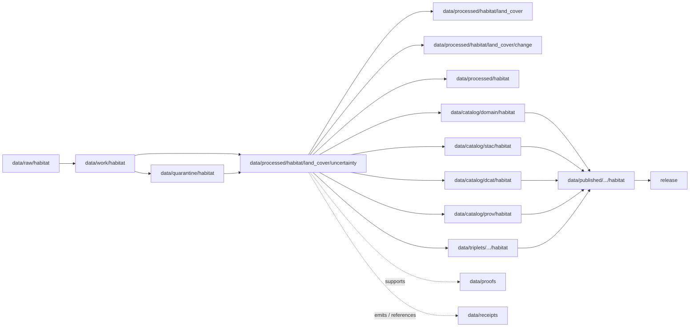

<!-- [KFM_META_BLOCK_V2]
doc_id: kfm://doc/data-processed-habitat-land-cover-uncertainty-readme
title: data/processed/habitat/land_cover/uncertainty/README.md — Habitat Land Cover Uncertainty Processed Data README
version: v0.1
type: readme; data-lifecycle-sublane; processed-stage-guide; habitat-domain-lane; land-cover-lane; uncertainty-surface-lane; remote-sensing-context-lane
status: draft; PROPOSED; data-root; processed-stage; habitat; land-cover; uncertainty; uncertainty-surface; confidence; accuracy; remote-sensing; source-role-aware; sensitivity-aware; release-gated; evidence-first
authors: ChatGPT-5.5 Thinking; reviewed_by: OWNER_TBD
owners: OWNER_TBD — Habitat steward · Land-cover steward · Uncertainty steward · Remote-sensing data steward · Sensitivity reviewer · Data-quality reviewer · Data steward · Pipeline steward · Evidence steward · Policy steward · Release steward · Docs steward
created: NEEDS VERIFICATION — blank placeholder existed before v0.1 expansion
updated: 2026-06-25
policy_label: public-doc; data; processed; habitat; land-cover; uncertainty; remote-sensing; lifecycle; governed; release-gated
tags: [kfm, data, processed, habitat, land-cover, uncertainty, uncertainty-surface, confidence, accuracy, classification-confidence, remote-sensing, NLCD, validation, error-matrix, quality, habitat-patch, ecological-system, source-role, observed, regulatory, modeled, aggregate, administrative, candidate, synthetic, EvidenceBundle, SourceDescriptor, ValidationReport, PolicyDecision, ReleaseManifest, RAW, WORK, QUARANTINE, PROCESSED, CATALOG, TRIPLET, PUBLISHED]
related:
  - ../README.md
  - ../change/README.md
  - ../../ecoregions/README.md
  - ../../README.md
  - ../../../README.md
  - ../../../../README.md
  - ../../../../../docs/domains/habitat/README.md
  - ../../../../../docs/domains/fauna/README.md
  - ../../../../../docs/domains/flora/README.md
  - ../../../../../docs/domains/soil/README.md
  - ../../../../../docs/domains/hydrology/README.md
  - ../../../../../docs/domains/agriculture/README.md
  - ../../../../../docs/domains/hazards/README.md
  - ../../../../../policy/domains/habitat/
  - ../../../../../policy/sensitivity/habitat/
  - ../../../../../contracts/domains/habitat/
  - ../../../../../schemas/contracts/v1/domains/habitat/
  - ../../../../raw/habitat/
  - ../../../../work/habitat/
  - ../../../../quarantine/habitat/
  - ../../../../catalog/domain/habitat/
  - ../../../../catalog/stac/habitat/
  - ../../../../catalog/dcat/habitat/
  - ../../../../catalog/prov/habitat/
  - ../../../../triplets/
  - ../../../../published/
  - ../../../../proofs/
  - ../../../../receipts/
  - ../../../../registry/sources/habitat/
  - ../../../../../release/candidates/habitat/
  - ../../../../../release/
  - ../../../../../pipelines/domains/habitat/
  - ../../../../../pipeline_specs/habitat/
  - ../../../../../tools/validators/
notes:
  - "This file replaces a blank placeholder at `data/processed/habitat/land_cover/uncertainty/README.md`."
  - "This is a child PROCESSED-stage lane under `data/processed/habitat/land_cover/` for normalized land-cover uncertainty artifacts, classification-confidence summaries, accuracy/context products, and uncertainty surfaces. It is not a RAW source root, WORK scratch area, QUARANTINE bypass, CATALOG, TRIPLET, PUBLISHED, proof store, receipt store, source registry, policy authority, release authority, public API/UI output, or public map/tile output."
  - "Uncertainty artifacts qualify interpretation; they do not prove land-cover truth, habitat suitability, regulatory critical habitat, species occurrence, restoration priority, crop truth, hazard status, or ecological condition by themselves."
  - "Habitat source roles must remain explicit: observed, regulatory, modeled, aggregate, administrative, candidate, and synthetic are not interchangeable. Uncertainty may be observed-derived, modeled, aggregate, or candidate depending on method; each artifact must declare its role and method."
  - "Sensitive joins to Fauna, Flora, private parcels, rare species, rare plants, wetlands, stewardship zones, hazards, agriculture, or steward-controlled biodiversity context must fail closed unless policy, review, evidence, transform receipts, release state, correction path, and rollback support public use."
  - "This README is a lane guide only. Contracts define semantic object meaning; schemas define machine shape; policy decides admissibility; release records decide publication."
  - "Rollback target for this expansion is previous blank placeholder blob SHA `8b137891791fe96927ad78e64b0aad7bded08bdc`."
[/KFM_META_BLOCK_V2] -->

<a id="top"></a>

# data/processed/habitat/land_cover/uncertainty

> Habitat PROCESSED-stage child lane for normalized land-cover uncertainty artifacts: classification confidence, accuracy summaries, error-context products, uncertainty surfaces, quality masks, and remote-sensing-derived uncertainty context that qualify land-cover interpretation but are not cataloged, triplet-projected, published, or released by this directory alone.

<p>
  
  
  
  
  
  
</p>

**Status:** draft / PROPOSED  
**Owners:** OWNER_TBD — Habitat steward · Land-cover steward · Uncertainty steward · Remote-sensing data steward · Sensitivity reviewer · Data-quality reviewer · Data steward · Pipeline steward · Evidence steward · Policy steward · Release steward · Docs steward  
**Path:** `data/processed/habitat/land_cover/uncertainty/README.md`  
**Owning root:** `data/processed/`  
**Domain segment:** `habitat`  
**Parent lane:** `data/processed/habitat/land_cover/`  
**Sublane:** `uncertainty` / land-cover confidence, accuracy, and uncertainty context  
**Lifecycle stage:** `PROCESSED`  
**Exposure posture:** not public by default; any public use requires governed catalog, EvidenceBundle, source-role and rights posture, sensitivity/policy review, ValidationReport, PolicyDecision, ReleaseManifest, correction path, and rollback target.  
**Truth posture:** CONFIRMED target was a blank placeholder · CONFIRMED Habitat names `UncertaintySurface` as a canonical object family · CONFIRMED Habitat promotion gates require EvidenceRef/EvidenceBundle, ValidationReport, PolicyDecision, ReleaseManifest, correction path, and rollback target · CONFIRMED parent land-cover lane is upstream of catalog/triplet/publication and blocks direct public use · PROPOSED uncertainty child-lane details · NEEDS VERIFICATION for actual child inventory, schemas, validators, fixtures, source descriptors, receipt families, policy enforcement, release linkage, and governed route behavior.

**Quick jumps:** [Purpose](#purpose) · [Lifecycle boundary](#lifecycle-boundary) · [Repo fit](#repo-fit) · [Accepted contents](#accepted-contents) · [Exclusions](#exclusions) · [Uncertainty processed requirements](#uncertainty-processed-requirements) · [Source-role and sensitivity guardrails](#source-role-and-sensitivity-guardrails) · [Directory map](#directory-map) · [Evidence ledger](#evidence-ledger) · [Validation checklist](#validation-checklist) · [Rollback](#rollback)

---

## Purpose

`data/processed/habitat/land_cover/uncertainty/` holds processed uncertainty artifacts for the Habitat land-cover lane. These artifacts qualify land-cover classification, class transitions, remote-sensing-derived products, or model inputs by making confidence, error, method limits, spatial uncertainty, temporal comparability, and data-quality caveats visible.

This lane may contain or point to normalized artifacts such as:

- classification-confidence surfaces or summaries;
- uncertainty masks, quality masks, or no-data/low-confidence masks;
- accuracy-assessment summaries and error matrices when they are processed artifacts rather than proof authority;
- uncertainty summaries by ecoregion, habitat patch, watershed, county, grid, source vintage, class, or comparison window;
- land-cover change uncertainty products and temporal comparability sidecars;
- model-input uncertainty products used by habitat suitability, connectivity, or restoration-opportunity workflows;
- public-candidate generalized uncertainty overlays that still require catalog and release review.

This lane does not make a land-cover claim by itself. It also does not prove species occurrence, critical habitat, habitat suitability, ecological condition, restoration priority, crop/field truth, hydrologic condition, soil truth, hazard event, land ownership, land-use legality, or land-management status without downstream evidence, policy, catalog, release, and claim-specific contracts.

## Lifecycle boundary

```text
RAW -> WORK / QUARANTINE -> PROCESSED -> CATALOG / TRIPLET -> PUBLISHED
```



`data/processed/habitat/land_cover/uncertainty/` is upstream of catalog, triplet, publication, and release. It must not be used as a normal public map/API/UI/AI source.

## Repo fit

| Responsibility | Correct home | Rule |
|---|---|---|
| Raw accuracy files, source-native confidence rasters, source QA reports, source metadata exports, source logs, original pixels/classes/geometry, or source identifiers | `data/raw/habitat/` | Not this lane. |
| In-process uncertainty modeling, threshold tuning, QA experiments, confusion-matrix experiments, cross-validation scratch, notebooks, or classifier-debug outputs | `data/work/habitat/` | Not this lane. |
| Unresolved rights, unresolved source role, malformed quality products, disputed accuracy, sensitive joins, unsafe geometry, or not-yet-reviewed uncertainty material | `data/quarantine/habitat/` | Not this lane until review/admission allows. |
| Processed land-cover observations and context artifacts | `data/processed/habitat/land_cover/` | Parent lane. |
| Processed land-cover change artifacts | `data/processed/habitat/land_cover/change/` | Related lane for temporal comparison; uncertainty can qualify it but does not replace it. |
| Processed land-cover uncertainty artifacts | `data/processed/habitat/land_cover/uncertainty/` | This lane. |
| Parent processed Habitat lane | `data/processed/habitat/` | Parent lane; still not public by default. |
| Habitat catalog records | `data/catalog/domain/habitat/` | Downstream catalog stage. |
| Habitat STAC/DCAT/PROV records | `data/catalog/{stac,dcat,prov}/habitat/` | Downstream catalog projections if accepted. |
| Habitat triplet/graph records | `data/triplets/.../habitat/` | Downstream graph stage; must not expose restricted geometry or unsafe joins. |
| Published public-safe Habitat products | `data/published/.../habitat/` | Downstream only after release. |
| EvidenceBundle/proof records | `data/proofs/` | Separate proof family. |
| Source, run, model-run, transform, validation, policy, correction, access, and release receipts | `data/receipts/` | Separate receipt family. |
| Habitat source registry records | `data/registry/sources/habitat/` | Separate source authority. |
| Release candidates and release manifests | `release/candidates/habitat/`, `release/` | Separate publication authority. |
| Habitat contracts | `contracts/domains/habitat/` | Object meaning; not data. |
| Habitat schemas | `schemas/contracts/v1/domains/habitat/` | Machine shape; not data. |
| Habitat policy and sensitivity rules | `policy/domains/habitat/`, `policy/sensitivity/habitat/` if accepted | Admissibility authority; not data. |
| Validators, tests, fixtures, pipelines, pipeline specs, apps, packages | `tools/validators/`, `tests/`, `fixtures/`, `pipelines/`, `pipeline_specs/`, `apps/`, `packages/` | Separate roots. |

## Accepted contents

Processed land-cover uncertainty artifacts may include:

- normalized uncertainty or confidence records with source vintage, class system, source role, rights posture, method, validation state, uncertainty type, and digest posture;
- confidence rasters, uncertainty surfaces, masks, summaries, or tile-candidate derivatives that remain upstream of release;
- accuracy summaries, error matrices, confusion matrices, validation summaries, or class-level confidence summaries when they are processed data rather than proof authority;
- uncertainty summaries by habitat patch, ecological system, ecoregion, watershed, county, grid, class, or source vintage;
- comparability notes for multi-vintage land-cover products and land-cover change products;
- links from uncertainty products to `LandCoverObservation`, `HabitatPatch`, `EcologicalSystem`, `SuitabilityModel`, `Restoration Opportunity`, `ConnectivityEdge`, or `UncertaintySurface` inputs when ownership and source-role boundaries remain visible;
- review-ready artifacts for public-safe uncertainty-map candidates when source rights, sensitivity joins, and policy posture are explicit;
- lane-local README or manifest notes that explain processed-data boundaries without becoming public outputs or authority records.

## Exclusions

Do not store these under `data/processed/habitat/land_cover/uncertainty/`:

- RAW source rasters, source-native QA files, source-native accuracy reports, steward originals, source media, logs, original source geometries, source identifiers, or unprocessed agency/partner exports.
- WORK/scratch files, notebooks, classifier-debug outputs, cross-validation experiments, threshold tuning, unresolved QA joins, accuracy experiments, uncertainty-model trials, or redaction-debug outputs.
- Quarantined or unresolved sensitive/rights/source-role material.
- Catalog records, STAC/DCAT/PROV records, triplet/graph records, published products, proof records, receipt records, source registry records, release decisions, schemas, policy rules, validators, tests, fixtures, pipelines, pipeline specs, app/UI/API code, or packages.
- Species occurrence records, plant specimen records, rare-species/rare-plant location records, soil map unit truth, hydrology measurement truth, crop/field truth, hazard event truth, archaeology site truth, or land/ownership truth.
- Habitat suitability scores, regulatory critical-habitat determinations, restoration prescriptions, management decisions, corridor/connectivity claims, ecoregion truth, ecological condition claims, crop-change claims, flood/fire/drought hazard claims, or land-use/legal determinations unless separate object contracts, evidence, validation, policy, and release state support them.
- Public API/UI/tile payloads, direct downloads, Focus Mode answers, public map layers, landowner/parcel targeting aids, ecological/legal advice, operational land-management guidance, emergency alerts, or life-safety guidance.
- Redaction parameters, aggregation thresholds, small-cell thresholds, fuzzing radii, seeds, exact transform offsets, access credentials, secrets, private agreement terms, field access routes, or implementation details that could aid exposure or unauthorized access.

## Uncertainty processed requirements

PROPOSED until concrete validators, policies, fixtures, receipts, and access-control enforcement are verified:

| Requirement | Meaning |
|---|---|
| Source trace | Each source-derived artifact should trace to SourceDescriptor or habitat source registry context. |
| Evidence linkage | Claims about confidence, uncertainty, accuracy, class error, source vintage, comparison window, method, residual risk, habitat context, transform, review, or release readiness should resolve downstream to EvidenceBundle/proof context where appropriate. |
| Source role | Observed, regulatory, modeled, aggregate, administrative, candidate, and synthetic roles must remain explicit and not interchangeable. |
| Uncertainty identity | Input source vintages, class systems, uncertainty type, method, spatial reference, cell/geometry footprint, class-crosswalk version where applicable, and normalized digest should remain auditable. |
| Time semantics | Source time, observed time, valid time, retrieval time, classification version time, uncertainty-generation time, correction time, and release time should remain distinguishable where material. |
| Rights posture | Agency, steward, license, redistribution, attribution, derivative-use, and remote-sensing source terms should be resolved or held closed for all inputs. |
| Sensitivity posture | Joins to sensitive fauna/flora occurrences, rare-plant locations, private parcels, wetlands, stewardship zones, hazards, agriculture, or small-cell outputs should carry restriction/generalization/denial posture. |
| Transform linkage | Reprojection, reclassification, confidence derivation, aggregation, redaction, suppression, withholding, delayed publication, or public-safe geometry transform should link to the appropriate receipt family. |
| Review state | Habitat steward, land-cover steward, uncertainty steward, source steward, sensitivity reviewer, data-quality reviewer, and release authority review should be recorded where required. |
| Policy decision | Restricted, public-candidate, and public transitions require PolicyDecision/admissibility posture where policy requires it. |
| Catalog readiness | Processed uncertainty artifacts intended for discovery should promote through catalog/triplet lanes, not directly to public use. |
| Release readiness | Public use requires ReleaseManifest or release-linked state, published output path, correction path, and rollback target. |
| No public surface by default | Processed uncertainty artifacts must not be exposed directly as public maps, tiles, APIs, downloads, Focus Mode answers, or AI-answer sources. |

## Source-role and sensitivity guardrails

- Habitat owns landscape/habitat context, not species records.
- Uncertainty is qualification context, not automatic proof of land-cover truth, habitat quality, restoration need, crop change, hazard damage, regulatory critical habitat, or ecological condition.
- `UncertaintySurface` may qualify modeled products, but it is not a suitability model, occurrence record, regulatory determination, or release decision.
- `LandCoverObservation` inputs may be observed; uncertainty products may be observed-derived, modeled, aggregate, administrative, or candidate depending on method. The role must be explicit and must not be upgraded during promotion.
- A confidence score is not a ValidationReport unless the validator/review process explicitly emits a ValidationReport in the correct root.
- A modeled uncertainty product is not regulatory critical habitat.
- A suitability surface is not an occurrence.
- A land-cover uncertainty surface is not a habitat-quality score, restoration priority, corridor, stewardship decision, crop truth, soil truth, hydrology truth, hazard event, or land-management instruction by itself.
- Observed, regulatory, modeled, aggregate, administrative, candidate, and synthetic source roles must not be relabeled during promotion.
- Sensitive habitat × fauna, habitat × flora, habitat × parcel, habitat × hydrology, habitat × soil, habitat × agriculture, and habitat × hazards joins must preserve ownership, source role, sensitivity, and EvidenceBundle support.
- Sensitive geometry must be generalized, redacted, delayed, restricted, or denied before tile generation; style filters are not a sensitivity control.
- Unclear rights, unresolved source role, missing evidence, unresolved sensitivity, unresolved uncertainty method, or absent release state blocks public promotion.
- Public clients and Focus Mode must use governed APIs, released artifacts, catalog/triplet records, EvidenceBundle-backed payloads, and policy-safe envelopes, not this directory directly.

> [!CAUTION]
> Do not expose `data/processed/habitat/land_cover/uncertainty/` directly as a public map, tile service, API, UI, download, Focus Mode answer, AI answer source, species-location service, critical-habitat determination, restoration prescription, crop-change claim, hazard-impact claim, landowner/parcel targeting aid, ecological/legal advice, operational land-management guidance, emergency alert, or life-safety product. Processed land-cover uncertainty data remains inside the trust membrane until governed promotion and release.

## Directory map

Actual child inventory remains **NEEDS VERIFICATION**. Use this as a proposed local organization pattern only after confirming current repo convention and validators.

```text
data/processed/habitat/land_cover/uncertainty/
├── README.md
├── confidence_surfaces/      # PROPOSED — processed confidence/uncertainty surfaces, not published tiles
├── masks/                    # PROPOSED — quality, no-data, low-confidence, or exclusion masks
├── accuracy_summaries/       # PROPOSED — processed accuracy summaries, not proof authority
├── error_matrices/           # PROPOSED — class-level error/confusion matrices
├── class_uncertainty/        # PROPOSED — class-specific uncertainty products
├── change_uncertainty/       # PROPOSED — uncertainty for land-cover change products
├── summaries/                # PROPOSED — region/patch-level uncertainty summaries
├── comparison_windows/       # PROPOSED — source-vintage/version/window sidecars
├── generalized/              # PROPOSED — public-candidate generalized derivatives
├── validation/               # PROPOSED — lane-local validation notes, not ValidationReport authority
├── joins/                    # PROPOSED — reviewed context joins only, not species/crop/soil/hydrology/hazard truth
├── _manifests/               # PROPOSED — lane-local non-release manifests only
└── _README_TODO.md           # PROPOSED — remove after actual child inventory is documented
```

## Evidence ledger

| Source | Status | Supports | Limits |
|---|---|---|---|
| Previous file | CONFIRMED | Target existed as a blank placeholder. | Did not define land-cover uncertainty processed boundaries. |
| `docs/domains/habitat/README.md` | CONFIRMED doctrine / PROPOSED implementation | Habitat names `UncertaintySurface` as a canonical object family; promotion requires EvidenceBundle, ValidationReport, PolicyDecision, ReleaseManifest, correction path, and rollback; unresolved sensitivity/source role/release state blocks promotion. | Implementation maturity remains NEEDS VERIFICATION. |
| `data/processed/habitat/land_cover/README.md` | CONFIRMED parent README | Parent lane defines processed land-cover observations/context, upstream lifecycle posture, hard exclusions, source-role preservation, and public-surface denial. | Does not prove child inventory or validators. |
| `data/processed/habitat/land_cover/change/README.md` | CONFIRMED sibling README | Change lane separates temporal-comparison products from raw inputs, public outputs, and other domain truth. | Does not define uncertainty inventory. |
| `data/processed/README.md` | CONFIRMED | PROCESSED data is upstream of catalog, triplets, publication, and release and is not the normal public surface. | Does not prove Habitat child inventory or enforcement. |
| `policy/domains/habitat/` and `policy/sensitivity/habitat/` | NEEDS VERIFICATION | Expected admissibility homes. | Current policy files and enforcement were not verified in this task. |
| `contracts/domains/habitat/` and `schemas/contracts/v1/domains/habitat/` | NEEDS VERIFICATION | Expected object contract/schema homes for Habitat families. | Specific uncertainty object files and validators were not verified in this task. |

## Validation checklist

- [ ] Confirm actual child directories under `data/processed/habitat/land_cover/uncertainty/`.
- [ ] Confirm whether `uncertainty/` is the accepted processed Habitat lane name or should be reconciled with `uncertainty_surfaces/`, `confidence/`, `quality/`, or another object-family naming convention.
- [ ] Confirm parent `data/processed/habitat/README.md` is expanded beyond stub.
- [ ] Confirm LandCoverObservation and UncertaintySurface object contracts and schema paths.
- [ ] Confirm source-role vocabulary and anti-collapse validators for observed/regulatory/modeled/aggregate/administrative/candidate/synthetic roles.
- [ ] Confirm validators, fixtures, CI checks, policy checks, and access-control enforcement for processed land-cover uncertainty artifacts.
- [ ] Confirm SourceDescriptor/source registry linkage for every input source vintage and derived uncertainty artifact.
- [ ] Confirm RunReceipt, TransformReceipt, ModelRunReceipt where applicable, ValidationReport, PolicyDecision, CorrectionNotice, ReleaseManifest, correction path, and rollback target.
- [ ] Confirm sensitive fauna/flora joins, rare-plant joins, private-parcel joins, wetlands/stewardship joins, hazard/agriculture joins, small-cell outputs, rights-unclear sources, unresolved source roles, redaction parameters, transform secrets, and release-unclear artifacts cannot enter public routes.
- [ ] Confirm public-candidate transitions are governed, evidence-backed, source-role-safe, rights-safe, sensitivity-safe, uncertainty-method-safe, review-backed, release-linked, and reversible.
- [ ] Confirm no RAW, WORK, QUARANTINE, CATALOG, TRIPLET, PUBLISHED, proof, receipt, registry, release, schema, policy, validator, package, pipeline, app, API, public map, public tile, direct download, Focus Mode answer, critical-habitat determination, restoration prescription, crop-change claim, hazard-impact claim, land-management guidance, or life-safety artifact is misplaced here.
- [ ] Confirm public clients and Focus Mode cannot read this lane directly as public truth, public location service, public map, public tile, public API, public UI, or AI-answer source.

## Rollback

Rollback is required if this lane becomes a RAW source-data root, WORK scratch root, QUARANTINE bypass, public output root, `data/published/` substitute, public-candidate shortcut, sensitive-join exposure path, transform-secret exposure path, agreement/credential exposure path, proof store, receipt store, catalog root, triplet root, source-registry root, release-decision root, schema root, policy root, validator root, implementation root, public API shortcut, public UI shortcut, public tile shortcut, public exposure shortcut, species-location source, critical-habitat determination source, restoration prescription source, crop-change claim source, hazard-impact claim source, land-management guidance source, or life-safety guidance source.

Rollback target for this expansion: previous blank placeholder blob SHA `8b137891791fe96927ad78e64b0aad7bded08bdc`.

<p align="right"><a href="#top">Back to top</a></p>
