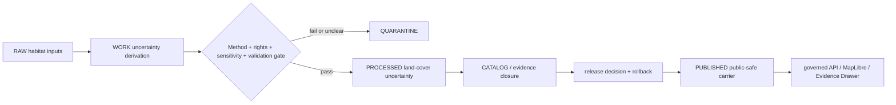

<!-- [KFM_META_BLOCK_V2]
doc_id: kfm://doc/data-processed-habitat-land-cover-uncertainty-readme
title: data/processed/habitat/land_cover/uncertainty/ — Habitat Land-Cover Uncertainty Processed Data
version: v0.2.0
type: directory-readme
subtype: processed-habitat-land-cover-uncertainty-lane
status: repository-grounded draft; payload inventory, concrete schemas, validators, fixtures, receipts, proof, release, and runtime behavior remain bounded
owners:
  - "NEEDS VERIFICATION — Habitat domain steward"
  - "NEEDS VERIFICATION — land-cover and uncertainty steward"
  - "NEEDS VERIFICATION — remote-sensing and data-quality reviewer"
  - "NEEDS VERIFICATION — data, evidence, policy, release, correction, and rollback stewards"
created: NEEDS VERIFICATION — blank placeholder existed before v0.1 expansion
updated: 2026-07-25
policy_label: public-doc; processed-stage; habitat; land-cover; uncertainty; source-role-aware; method-aware; sensitivity-aware; release-gated; no-direct-public-path
path: data/processed/habitat/land_cover/uncertainty/README.md
truth_posture: >
  CONFIRMED exact target path, prior blob, Directory Rules placement, current Habitat parent lane,
  current land-cover parent lane, Habitat doctrine, and neighboring change/ecoregion lanes / PROPOSED
  uncertainty admission profile, uncertainty packet, comparability rules, and downstream promotion
  expectations / UNKNOWN recursive payload inventory, accepted UncertaintySurface contract or schema,
  production validators, fixtures, receipts, proof closure, release instances, hosting, and public behavior /
  NEEDS VERIFICATION accountable owners, accepted uncertainty vocabulary, method fitness, calibration
  rules, correction propagation, cache invalidation, and rollback drills
evidence_snapshot:
  repository: bartytime4life/Kansas-Frontier-Matrix
  base_ref: main
  base_commit: 69e388be9cd2fc5af47c151b17c47219933827af
  prior_blob: 763829bab769873dfef82e0d11105dbb9c0e84e8
  directory_rules_blob: 2affb080e6f0043867c64c7f06c1ca52030fbd55
  habitat_parent_blob: bbae8468b9acf483b1a77a2cd6ecfc08a691a318
  land_cover_parent_blob: a40191104cd9f5c1d983e725bca27b7f22afb3c7
  habitat_domain_blob: 876d1fa41a00d94d7120c6ef065750748e6bf524
related:
  - ../README.md
  - ../change/README.md
  - ../../ecoregions/README.md
  - ../../README.md
  - ../../../README.md
  - ../../../../README.md
  - ../../../../../docs/domains/habitat/README.md
  - ../../../../../docs/doctrine/directory-rules.md
  - ../../../../../contracts/domains/habitat/README.md
  - ../../../../../schemas/contracts/v1/domains/habitat/README.md
  - ../../../../../policy/domains/habitat/README.md
  - ../../../../../policy/sensitivity/habitat/README.md
  - ../../../../raw/habitat/README.md
  - ../../../../work/habitat/README.md
  - ../../../../quarantine/habitat/README.md
  - ../../../../catalog/domain/habitat/README.md
  - ../../../../triplets/README.md
  - ../../../../proofs/README.md
  - ../../../../receipts/README.md
  - ../../../../registry/sources/habitat/README.md
  - ../../../../../release/candidates/habitat/README.md
  - ../../../../../release/README.md
notes:
  - "Same-path Markdown modernization only; no uncertainty bytes, source state, schema, contract, policy, validator, workflow, proof, release, route, hosting, or KFM publication state changed."
  - "Uncertainty qualifies interpretation; it does not establish land-cover truth, habitat condition, species presence, suitability, restoration priority, regulatory status, or management action."
  - "A confidence score, error matrix, or uncertainty surface is processed context unless an accepted validator emits a ValidationReport in the correct authority root."
  - "Rollback target for v0.2.0 is prior blob SHA `763829bab769873dfef82e0d11105dbb9c0e84e8`."
[/KFM_META_BLOCK_V2] -->

<a id="top"></a>

# `data/processed/habitat/land_cover/uncertainty/` — Habitat land-cover uncertainty processed data

> **One-line purpose.** Hold processed land-cover confidence, accuracy, error, quality-mask, and uncertainty artifacts while preserving method, source role, class system, spatial and temporal support, comparability, sensitivity, and correction lineage upstream of catalog, release, and publication.

[](#status)
[](#authority-level)
[](#what-belongs-here)
[](#outputs)
[](#uncertainty-admission-profile)
[](#validation)

> [!IMPORTANT]
> **Uncertainty is qualification context, not proof authority.** A confidence value, error matrix, or uncertainty surface may be useful and well-formed while still being non-comparable, method-limited, rights-unclear, weakly supported, policy-held, unreleased, or unsafe for the requested public use.

**Path:** `data/processed/habitat/land_cover/uncertainty/README.md`  
**Owning root:** `data/`  
**Lifecycle phase:** `processed/`  
**Domain segment:** `habitat/`  
**Parent lane:** `data/processed/habitat/land_cover/`  
**Lane role:** land-cover confidence, accuracy, quality, and uncertainty context  
**Direct public access:** denied  
**Last reviewed:** 2026-07-25

**Quick navigation:** [Purpose](#purpose) · [Authority level](#authority-level) · [Status](#status) · [What belongs here](#what-belongs-here) · [What does NOT belong here](#what-does-not-belong-here) · [Inputs](#inputs) · [Outputs](#outputs) · [Validation](#validation) · [Review burden](#review-burden) · [Related folders](#related-folders) · [ADRs](#adrs) · [Last reviewed](#last-reviewed) · [Uncertainty admission profile](#uncertainty-admission-profile) · [Source-role and sensitivity guardrails](#source-role-and-sensitivity-guardrails) · [Comparability and calibration](#comparability-and-calibration) · [Lifecycle and promotion](#lifecycle-and-promotion) · [Correction and rollback](#correction-and-rollback)

---

## Purpose

This directory is the Habitat domain's **PROCESSED-stage lane for land-cover uncertainty and quality context**. It may hold normalized confidence surfaces, uncertainty masks, accuracy summaries, error matrices, class-level uncertainty products, change-uncertainty products, quality masks, and public-candidate generalized derivatives that have moved beyond RAW capture, WORK experimentation, and QUARANTINE holds.

The lane exists to preserve the answer to six questions before downstream use:

1. Which land-cover source, class system, and source vintage does the uncertainty qualify?
2. Which uncertainty, confidence, accuracy, or quality method produced the artifact?
3. What spatial support, temporal support, comparison window, and class scope apply?
4. What calibration, validation sample, missingness, and known limitation support interpretation?
5. Which source role, rights, sensitivity, and correction posture apply?
6. Which downstream claims and joins are allowed, restricted, or denied?

It is not a public layer store, `ValidationReport` store, proof store, receipt authority, catalog authority, release authority, habitat-quality lane, suitability lane, or species-occurrence lane.

## Authority level

**Implementation-bearing lifecycle lane.** The target path is CONFIRMED in the repository and is correctly placed under `data/processed/habitat/land_cover/` according to Directory Rules' lifecycle and domain-placement rules.

Its authority is deliberately narrow:

- it may carry processed uncertainty artifacts and lane-local explanatory metadata;
- it does not define Habitat or `UncertaintySurface` meaning—that remains in domain doctrine and semantic contracts;
- it does not define machine shape—that remains under `schemas/contracts/v1/domains/habitat/`;
- it does not decide whether an uncertainty method is scientifically fit for a consequential claim;
- it does not decide admissibility, sensitivity, rights, review, release, or public exposure;
- it does not establish land-cover truth, habitat condition, species presence, suitability, restoration, regulatory, hazard, crop, or management truth.

## Status

| Surface | Status | Evidence-bounded interpretation |
|---|---|---|
| This README and path | **CONFIRMED** | The file exists at the pinned base and is updated in place. |
| Parent land-cover lane | **CONFIRMED** | `data/processed/habitat/land_cover/README.md` defines the parent processed land-cover context lane and denies direct public use. |
| Parent Habitat lane | **CONFIRMED** | `data/processed/habitat/README.md` identifies `land_cover/uncertainty/` as the uncertainty/confidence context child lane. |
| Habitat doctrine | **CONFIRMED repository document / draft** | Habitat owns landscape context, preserves source roles, and treats uncertainty as an interpretive qualifier rather than sovereign truth. |
| Real uncertainty payload inventory | **UNKNOWN** | This documentation task did not inspect or expose uncertainty data payloads. |
| Accepted `UncertaintySurface` contract and schema | **NEEDS VERIFICATION** | No field-complete, accepted contract/schema pair was verified in this task. |
| Validators, fixtures, CI enforcement | **NEEDS VERIFICATION** | No accepted land-cover uncertainty production validator suite was verified. |
| Receipts, proof, policy decisions, release instances, hosting, public behavior | **UNKNOWN / held** | Presence in this directory creates none of these states. |

## What belongs here

Good fits are processed uncertainty artifacts whose method and support remain inspectable, including:

- classification-confidence rasters, vectors, tables, or summaries tied to a named land-cover product and class system;
- uncertainty surfaces, posterior or ensemble spread products, quality masks, no-data masks, cloud/shadow masks, and low-confidence masks;
- class-level producer's accuracy, user's accuracy, omission, commission, confusion, and residual-error context when the method and validation sample are explicit;
- error matrices and confusion matrices stored as processed data rather than as proof or review authority;
- uncertainty summaries by class, source vintage, comparison window, ecoregion, habitat patch, watershed, county, grid, or other declared support unit;
- land-cover change uncertainty products that preserve both contributing vintages, class crosswalks, and temporal comparability limits;
- model-input uncertainty products used by suitability, connectivity, or restoration workflows when the downstream model remains separately identified;
- geometry-normalized derivatives carrying source CRS, target CRS, resampling, aggregation, clipping, and digest metadata;
- public-candidate generalized uncertainty overlays that remain upstream of catalog and release review;
- quality, disputed-method, calibration, coverage, missingness, and correction sidecars that are not trust-bearing receipts or proofs;
- object-ready candidates prepared for future contract/schema validation, catalog closure, EvidenceBundle support, or release review;
- lane-local README or non-release manifest notes that explain artifact identity without becoming release authority.

## What does NOT belong here

Do not place these in `data/processed/habitat/land_cover/uncertainty/`:

- RAW source rasters, source-native QA files, accuracy reports, reference samples, source logs, or unprocessed source geometry;
- WORK notebooks, classifier debugging, threshold tuning, cross-validation experiments, temporary masks, scratch joins, or uncertainty-model trials;
- QUARANTINE material with unresolved rights, source role, method, calibration, validation sample, class system, geometry, sensitivity, dispute, or quality state;
- land-cover observations, class rasters, or change products merely because they have uncertainty attributes—the primary artifact stays in its owning lane and references this context where appropriate;
- Fauna or Flora occurrences, rare-species or rare-plant locations, private-parcel detail, stewardship records, wetlands restrictions, field routes, or controlled biodiversity records;
- habitat patches, suitability surfaces, quality scores, connectivity edges, corridor candidates, restoration prescriptions, stewardship decisions, or regulatory critical-habitat records merely because uncertainty qualifies them;
- semantic contracts, JSON Schemas, policy rules, validators, tests, fixtures, executable pipelines, source descriptors, catalog records, STAC/DCAT/PROV projections, triplets, proofs, receipts, `ValidationReport`s, releases, correction notices, rollback cards, or published artifacts;
- public map, tile, API, download, export, Focus Mode, Evidence Drawer, search, graph, or AI-answer payloads;
- hidden sensitive joins, transform secrets, threshold values that enable re-identification, access credentials, private agreements, field routes, or details that could aid unauthorized access;
- crop-change, hazard-impact, species-presence, critical-habitat, habitat-condition, legal, regulatory, restoration, or management conclusions unsupported by separate evidence and authority.

## Inputs

Inputs may enter this lane only through governed lifecycle transitions from:

- `data/work/habitat/` after source, method, class system, validation sample, spatial support, temporal support, rights, sensitivity, and correction posture are recorded;
- `data/quarantine/habitat/` after the hold condition is resolved and the remediation decision is auditable;
- accepted Habitat pipelines or tools that preserve source bytes by reference, source vintage, class crosswalk, method version, calibration state, geometry lineage, and correction state;
- `data/processed/habitat/land_cover/` and `data/processed/habitat/land_cover/change/` when uncertainty qualifies those artifacts without replacing their primary identity;
- approved cross-domain context inputs where ownership remains with the source domain and the relation is explicit.

A connector-to-PROCESSED, watcher-to-PROCESSED, or public-upload-to-PROCESSED shortcut is not an accepted normal path. Connectors and watchers produce source or candidate state; they do not publish or silently promote.

## Outputs

This lane may support downstream candidates for:

- `data/catalog/domain/habitat/` and accepted STAC/DCAT/PROV catalog projections;
- `data/triplets/` or other relationship projections that preserve source, method, class, support, and evidence references;
- separate `data/proofs/` and `data/receipts/` objects;
- `release/candidates/habitat/` after identity, rights, sensitivity, method fitness, validation, evidence, review, correction, and rollback obligations are met;
- a separately governed public-safe Habitat uncertainty layer or sidecar under `data/published/` only through a release transition;
- governed API, MapLibre, Evidence Drawer, export, or Focus Mode carriers only after public-safe release.

> [!CAUTION]
> Ordinary public clients must not read this directory directly. A processed confidence or uncertainty artifact is not a released public claim merely because it is easy to color, threshold, or overlay.

## Validation

No land-cover uncertainty production validator suite was verified in this task. No field-complete, accepted `UncertaintySurface` contract/schema pair was established strongly enough to claim machine enforcement.

A credible validation profile should check, at minimum:

1. source product, source role, source vintage, and class-system identity;
2. uncertainty type, method, method version, and semantic direction—whether larger values mean more or less certainty;
3. value domain, units, scale, nodata semantics, and prohibited sentinel-value ambiguity;
4. spatial support, resolution, CRS, extent, alignment, resampling, aggregation, and geometry validity;
5. temporal support, comparison window, contributing vintages, and class-crosswalk version;
6. validation sample design, reference-data independence, sample size, class balance, and spatial/temporal representativeness where relevant;
7. calibration, reliability, accuracy metrics, confidence intervals, and known limitations where claimed;
8. coverage, missingness, exclusions, cloud/shadow masking, low-confidence handling, and residual risk;
9. deterministic identity or content/method digest where practical;
10. source and artifact rights, citation, redistribution, and derivative-use posture;
11. sensitive and re-identifying join posture;
12. evidence references, policy state, review state, release hold, correction path, and rollback target.

Fail closed or quarantine when a material field is absent, contradictory, unsupported, non-comparable, miscalibrated, rights-unclear, sensitivity-unclear, stale beyond policy, or unsafe for the requested downstream use.

## Review burden

Changes require review proportional to consequence:

| Change | Minimum review burden |
|---|---|
| README wording or navigation only | Docs steward plus Habitat/land-cover reviewer. |
| New uncertainty family, metric, mask, or child-lane admission | Habitat steward, land-cover/uncertainty steward, data/pipeline steward, docs steward, and Directory Rules review. |
| Method, calibration, validation sample, class system, units, support, or comparability semantics | Remote-sensing/data-quality reviewer plus contract/schema and validation reviewers. |
| Sensitive or cross-domain join | Owning domain steward, Habitat steward, sensitivity reviewer, rights reviewer, evidence reviewer, and policy review. |
| Public-facing map, API, Focus Mode, export, or release linkage | Evidence, policy, release, correction, rollback, and domain review; independent approval where required. |
| Regulatory, habitat-condition, crop, hazard, restoration, or management implication | Hold by default; require the owning authority/domain and evidence appropriate to the claim. |

## Related folders

| Responsibility | Repository home |
|---|---|
| Parent land-cover processed lane | [`../`](../) |
| Land-cover change processed lane | [`../change/`](../change/) |
| Ecoregion processed context | [`../../ecoregions/`](../../ecoregions/) |
| Parent Habitat processed lane | [`../../`](../../) |
| Habitat doctrine | [`../../../../../docs/domains/habitat/`](../../../../../docs/domains/habitat/) |
| Contracts | [`../../../../../contracts/domains/habitat/`](../../../../../contracts/domains/habitat/) |
| Schemas | [`../../../../../schemas/contracts/v1/domains/habitat/`](../../../../../schemas/contracts/v1/domains/habitat/) |
| Policy and sensitivity | [`../../../../../policy/domains/habitat/`](../../../../../policy/domains/habitat/) · [`../../../../../policy/sensitivity/habitat/`](../../../../../policy/sensitivity/habitat/) |
| RAW / WORK / QUARANTINE | [`../../../../raw/habitat/`](../../../../raw/habitat/) · [`../../../../work/habitat/`](../../../../work/habitat/) · [`../../../../quarantine/habitat/`](../../../../quarantine/habitat/) |
| Catalog and triplets | [`../../../../catalog/domain/habitat/`](../../../../catalog/domain/habitat/) · [`../../../../triplets/`](../../../../triplets/) |
| Proofs and receipts | [`../../../../proofs/`](../../../../proofs/) · [`../../../../receipts/`](../../../../receipts/) |
| Habitat source registry | [`../../../../registry/sources/habitat/`](../../../../registry/sources/habitat/) |
| Release candidates and decisions | [`../../../../../release/candidates/habitat/`](../../../../../release/candidates/habitat/) · [`../../../../../release/`](../../../../../release/) |

## ADRs

- `ADR-0001` governs the canonical machine-schema home under `schemas/contracts/v1/...`.
- Directory Rules govern the existing `data/<phase>/<domain>/` placement and prohibit parallel proof, receipt, policy, schema, registry, release, or publication authority here.
- Any future change that makes this lane a canonical metric registry, creates a new lifecycle phase, changes the meaning of `UncertaintySurface`, or establishes a parallel authority home requires the appropriate accepted ADR before implementation.

No README edit, commit, pull request, or merge constitutes a promotion or release decision.

## Last reviewed

**2026-07-25.** Review again when a concrete uncertainty contract/schema is accepted, a validator or fixture suite is admitted, a new uncertainty metric or calibration method is introduced, a public-safe uncertainty artifact is proposed, or correction/rollback behavior changes.

<a id="uncertainty-processed-requirements"></a>

## Uncertainty admission profile

A candidate should not be treated as admitted merely because it can be parsed or visualized. A credible processed packet should carry or resolve to:

| Dimension | Minimum auditable posture |
|---|---|
| Identity | Stable artifact ID plus source product, source vintage, class system, uncertainty family, and method version. |
| Source role | One declared role preserved from admission; observed-derived, modeled, aggregate, administrative, candidate, and synthetic are not interchangeable. |
| Method | Uncertainty definition, direction, scale, units, derivation method, calibration state, validation basis, and limitations. |
| Spatial support | CRS, extent, resolution, alignment, geometry/cell support, resampling, aggregation, and generalization history. |
| Temporal support | Source, observed, valid, retrieval, method-generation, correction, and release times where material. |
| Class support | Class dictionary, class crosswalk, omitted classes, mixed pixels, transition logic, and comparison compatibility where applicable. |
| Quality | Coverage, missingness, nodata, masks, sample design, class balance, metrics, uncertainty intervals, and residual risk. |
| Rights and sensitivity | Rights, citation, redistribution, sensitive joins, small-cell/re-identification posture, and public-field restrictions. |
| Evidence | Safe `EvidenceRef` values or resolver keys sufficient for downstream `EvidenceBundle` resolution. |
| Governance | Validation state, policy state, review state, release hold, correction lineage, withdrawal path, and rollback target. |

These fields are **PROPOSED admission expectations**, not a claim that an accepted schema or validator currently enforces them.

## Source-role and sensitivity guardrails

- Habitat owns landscape and land-cover context, not species records.
- Uncertainty qualifies interpretation; it does not automatically validate the underlying land-cover product.
- A confidence score is not a `ValidationReport` unless an accepted validator emits a report in the correct authority root.
- An error matrix is not a proof pack, review decision, policy decision, or release decision.
- An `UncertaintySurface` is not a suitability model, habitat-quality score, occurrence record, regulatory determination, restoration priority, corridor, stewardship decision, crop truth, hazard truth, or land-management instruction.
- Source roles remain explicit. An observed-derived uncertainty product does not become observed land-cover truth, and a modeled uncertainty product does not become regulatory truth.
- Sensitive Habitat × Fauna, Habitat × Flora, Habitat × parcel, Habitat × wetlands, Habitat × stewardship, Habitat × hydrology, Habitat × soil, Habitat × agriculture, and Habitat × hazards joins must preserve ownership, source role, sensitivity, rights, and EvidenceBundle support.
- Sensitive or re-identifying outputs must be generalized, redacted, delayed, restricted, or denied before tile generation. Hiding a field or feature with map styling is not a sensitivity control.
- Unclear rights, unresolved source role, missing evidence, unresolved method, unsupported calibration, unsafe joins, or absent release state blocks public promotion.
- Public clients and Focus Mode use governed APIs, released artifacts, catalog/triplet records, EvidenceBundle-backed payloads, and policy-safe envelopes—not this directory directly.

> [!CAUTION]
> Do not expose this lane directly as a public map, tile service, API, UI, download, Focus Mode answer, AI-answer source, species-location service, regulatory determination, restoration prescription, crop-change claim, hazard-impact claim, landowner/parcel targeting aid, operational land-management guidance, emergency alert, or life-safety product.

## Comparability and calibration

Uncertainty values are comparable only when the relevant semantics match or an accepted crosswalk explains the difference.

| Comparison dimension | Required discipline |
|---|---|
| Product and source vintage | Do not compare values across materially different products or vintages without documenting the change. |
| Class system | Record class dictionaries and crosswalks; a code match does not prove semantic equivalence. |
| Uncertainty definition | Probability, entropy, margin, standard deviation, ensemble spread, confidence class, and accuracy rate are not interchangeable. |
| Direction and scale | Record whether larger values mean higher certainty or higher uncertainty and whether values are proportions, percentages, classes, or unit-bearing measures. |
| Spatial support | Do not compare cell, polygon, patch, county, ecoregion, or resampled summaries as though support were identical. |
| Temporal support | Preserve source and comparison windows; uncertainty from different seasons or acquisition conditions may not be comparable. |
| Validation basis | Record reference data, sampling design, sample size, independence, class balance, and confidence intervals where applicable. |
| Calibration | A numerically bounded confidence score is not necessarily calibrated. Calibration claims require evidence and a declared method. |
| Masking and exclusions | Cloud, shadow, nodata, water, mixed pixels, and excluded classes can change the interpretation and denominator. |
| Correction lineage | Recomputed uncertainty after a corrected source, class crosswalk, mask, or method must not silently overwrite prior values. |

When comparability cannot be established, the correct posture is **ABSTAIN**, **HOLD**, or a visibly qualified comparison—not forced normalization.

## Lifecycle and promotion


```mermaid
flowchart LR
    RAW["RAW habitat inputs"] --> WORK["WORK uncertainty derivation"]
    WORK --> GATE{"Method + rights + sensitivity + validation gate"}
    GATE -->|fail or unclear| QUAR["QUARANTINE"]
    GATE -->|pass| PROC["PROCESSED land-cover uncertainty"]
    PROC --> CAT["CATALOG / evidence closure"]
    CAT --> REL["release decision + rollback"]
    REL --> PUB["PUBLISHED public-safe carrier"]
    PUB --> API["governed API / MapLibre / Evidence Drawer"]
```

The normal outward path is:

```text
processed uncertainty artifact
→ catalog record and evidence references
→ policy and review decision
→ release manifest, correction path, and rollback target
→ released public-safe carrier
→ governed API and map/UI surfaces
```

The forbidden shortcut is:

```text
processed confidence raster or error matrix
→ direct public map, API, download, Focus Mode, or AI claim
```

## Correction and rollback

A corrected source product, reference sample, class dictionary, crosswalk, mask, comparison window, calibration method, threshold, aggregation, or uncertainty algorithm may change the artifact materially.

A governed correction should:

1. retain the prior artifact, digest, method version, and evidence lineage;
2. identify the corrected source, method, mask, class, geometry, or comparison input;
3. recompute affected uncertainty products deterministically where practical;
4. rerun validation, comparability, rights, sensitivity, and review gates;
5. emit correction and replacement receipts in their proper authority roots;
6. invalidate or withdraw affected catalog, graph, map, API, export, and cached derivatives;
7. update release and rollback references without erasing history.

Rollback is required if this lane becomes a source-data root, WORK shortcut, QUARANTINE bypass, `ValidationReport` authority, proof store, receipt store, catalog root, triplet root, source registry, release-decision root, schema root, policy root, validator root, direct public API/UI/tile path, sensitive-join exposure path, transform-secret exposure path, habitat-condition authority, crop-change authority, hazard-impact authority, regulatory authority, restoration prescription, management guidance, or life-safety source.

**Rollback target for this documentation update:** restore blob `763829bab769873dfef82e0d11105dbb9c0e84e8` or revert the resulting commit. Do not rewrite shared history.

---

<a id="purpose"></a>
<a id="lifecycle-boundary"></a>
<a id="repo-fit"></a>
<a id="accepted-contents"></a>
<a id="exclusions"></a>
<a id="source-role-and-sensitivity-guardrails"></a>
<a id="directory-map"></a>
<a id="evidence-ledger"></a>
<a id="validation-checklist"></a>
<a id="rollback"></a>

<p align="right"><a href="#top">Back to top</a></p>
