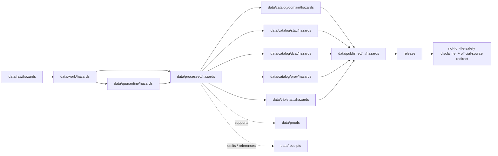

<!-- [KFM_META_BLOCK_V2]
doc_id: kfm://doc/data-processed-hazards-readme
title: data/processed/hazards/README.md — Hazards Processed Data README
version: v0.1
type: readme; data-lifecycle-domain-lane; processed-stage-guide; hazards-domain-root; not-for-life-safety-lane-index
status: draft; PROPOSED; data-root; processed-stage; hazards; not-for-life-safety; source-role-aware; freshness-aware; regulatory-context; operational-context; evidence-first; release-gated
authors: ChatGPT-5.5 Thinking; reviewed_by: OWNER_TBD
owners: OWNER_TBD — Hazards steward · Source-role steward · Freshness steward · Sensitivity reviewer · Rights steward · Data steward · Pipeline steward · Evidence steward · Policy steward · Release steward · Docs steward
created: NEEDS VERIFICATION — greenfield stub existed before v0.1 expansion
updated: 2026-06-25
policy_label: public-doc; data; processed; hazards; lifecycle; governed; not-for-life-safety; source-role-aware; freshness-aware; release-gated
tags: [kfm, data, processed, hazards, hazard-event, hazard-observation, warning-context, advisory-context, disaster-declaration, flood-context, wildfire-detection, smoke-context, drought-indicator, earthquake-event, heat-cold-event, exposure-summary, resilience-summary, hazard-timeline, impact-area, source-role, observed, regulatory, modeled, aggregate, administrative, candidate, synthetic, not-for-life-safety, stale-state, freshness, EvidenceBundle, SourceDescriptor, ValidationReport, PolicyDecision, ReleaseManifest, RollbackCard, RAW, WORK, QUARANTINE, PROCESSED, CATALOG, TRIPLET, PUBLISHED]
related:
  - ../README.md
  - ../../README.md
  - ../../../docs/domains/hazards/README.md
  - ../../../docs/domains/hazards/PUBLICATION_AND_BOUNDARY.md
  - ../../../docs/domains/hazards/PRESERVATION_MATRIX.md
  - ../../../docs/domains/hazards/MISSING_OR_PLANNED_FILES.md
  - ../../../docs/domains/hydrology/README.md
  - ../../../docs/domains/atmosphere/README.md
  - ../../../docs/domains/settlements-infrastructure/README.md
  - ../../../docs/domains/roads-rail-trade/README.md
  - ../../../docs/domains/agriculture/README.md
  - ../../../policy/domains/hazards/
  - ../../../policy/release/hazards/
  - ../../../policy/sensitivity/hazards/
  - ../../../contracts/domains/hazards/
  - ../../../schemas/contracts/v1/domains/hazards/
  - ../../raw/hazards/
  - ../../work/hazards/
  - ../../quarantine/hazards/
  - ../../catalog/domain/hazards/
  - ../../catalog/stac/hazards/
  - ../../catalog/dcat/hazards/
  - ../../catalog/prov/hazards/
  - ../../triplets/
  - ../../published/
  - ../../proofs/
  - ../../receipts/
  - ../../registry/sources/hazards/
  - ../../../release/candidates/hazards/
  - ../../../release/
  - ../../../pipelines/domains/hazards/
  - ../../../pipeline_specs/hazards/
  - ../../../tools/validators/
notes:
  - "This file replaces a greenfield stub at `data/processed/hazards/README.md`."
  - "This is the parent PROCESSED-stage domain lane for Hazards artifacts. It is not RAW source storage, WORK scratch, QUARANTINE holding, CATALOG, TRIPLET, PUBLISHED, proof storage, receipt storage, source registry, policy authority, release authority, public API/UI output, public map/tile output, emergency alerting system, operational warning system, evacuation guidance, driving-safety guidance, engineering certification, or life-safety guidance."
  - "The not-for-life-safety boundary is non-negotiable. KFM may surface warning/advisory/watch records only as contextual evidence with issue/expiry/freshness and official-source redirection; it must never act as alert authority."
  - "Hazards processed artifacts must preserve source role, rights, sensitivity posture, freshness, issue/expiry/validity state, temporal semantics, object-family distinction, evidence linkage, validation state, catalog readiness, release state, correction path, and rollback target before public use."
  - "Source-role anti-collapse is mandatory: observed, regulatory, modeled, aggregate, administrative, candidate, and synthetic roles are not interchangeable."
  - "Operational context past expiry must become historical/stale context or be denied as current state; expired warnings must not appear as live warning state."
  - "This README is a parent lane guide and index. Child lane READMEs define local sublane boundaries; contracts define semantic object meaning; schemas define machine shape; policy decides admissibility; release records decide publication."
  - "Rollback target for this expansion is previous greenfield stub blob SHA `ee1740699092ab732271925c47c6162629502143`."
[/KFM_META_BLOCK_V2] -->

<a id="top"></a>

# data/processed/hazards

> Parent Hazards PROCESSED-stage lane for normalized, source-traced, source-role-preserved, freshness-aware, not-for-life-safety hazard artifacts that have passed beyond RAW/WORK/QUARANTINE but are not yet cataloged, triplet-projected, published, or released.

<p>
  
  
  
  
  
  
</p>

**Status:** draft / PROPOSED  
**Owners:** OWNER_TBD — Hazards steward · Source-role steward · Freshness steward · Sensitivity reviewer · Rights steward · Data steward · Pipeline steward · Evidence steward · Policy steward · Release steward · Docs steward  
**Path:** `data/processed/hazards/README.md`  
**Owning root:** `data/processed/`  
**Domain segment:** `hazards`  
**Lifecycle stage:** `PROCESSED`  
**Exposure posture:** not public by default; any public use requires governed catalog, EvidenceBundle, source-role and rights posture, freshness disclosure, sensitivity/policy review, not-for-life-safety disclaimer, official-source redirect, ValidationReport, PolicyDecision, ReleaseManifest, correction path, and rollback target.  
**Truth posture:** CONFIRMED target was a greenfield stub · CONFIRMED parent `data/processed/` is upstream of catalog/triplet/publication and is not a normal public surface · CONFIRMED Hazards doctrine says KFM is not an emergency alert system and must never act as alert authority · CONFIRMED Hazards owns historical, regulatory, modeled, and operational-context hazard information while preserving source-role and time distinctions · PROPOSED parent-lane details and child-lane index · NEEDS VERIFICATION for actual child inventory, validators, fixtures, source descriptors, access-control enforcement, receipt families, policy enforcement, release linkage, and governed route behavior.

**Quick jumps:** [Purpose](#purpose) · [Lifecycle boundary](#lifecycle-boundary) · [Repo fit](#repo-fit) · [Lane index](#lane-index) · [Accepted contents](#accepted-contents) · [Exclusions](#exclusions) · [Hazards processed requirements](#hazards-processed-requirements) · [Not-for-life-safety and source-role guardrails](#not-for-life-safety-and-source-role-guardrails) · [Evidence ledger](#evidence-ledger) · [Validation checklist](#validation-checklist) · [Rollback](#rollback)

---

## Purpose

`data/processed/hazards/` is the parent PROCESSED-stage lane for normalized Hazards artifacts. It organizes processed outputs after source capture, extraction, geometry normalization, source-role preservation, freshness handling, issue/expiry normalization, stale-state handling, rights review, validation-oriented processing, or public-safe derivative preparation, while keeping those artifacts upstream of catalog, triplet, publication, release, proof closure, and public access.

This lane may contain or point to processed artifacts for:

- historical hazard events and hazard observations;
- operational warning, watch, and advisory records preserved as context only;
- disaster declarations and administrative hazard context;
- flood, drought, wildfire, smoke, earthquake, heat, cold, severe-weather, and other hazard context products;
- exposure summaries and impact areas when input sensitivity and precision are controlled;
- resilience summaries and planning-context derivatives;
- hazard timelines with source-role and time-state discipline;
- freshness, stale-state, issue/expiry, and uncertainty context;
- public-candidate or restricted Hazards derivatives that remain release-gated.

This parent README does not create a semantic contract, schema, validator, source registry, proof, receipt, policy decision, release decision, public map layer, public tile, public API route, public UI payload, emergency alert, evacuation instruction, driving-safety instruction, hazard warning, engineering certification, legal advice, operational response instruction, or life-safety product.

## Lifecycle boundary

```text
RAW -> WORK / QUARANTINE -> PROCESSED -> CATALOG / TRIPLET -> PUBLISHED
```


```mermaid
flowchart LR
  RAW[data/raw/hazards] --> WORK[data/work/hazards]
  WORK --> QUAR[data/quarantine/hazards]
  WORK --> PROC[data/processed/hazards]
  QUAR --> PROC
  PROC --> CAT[data/catalog/domain/hazards]
  PROC --> STAC[data/catalog/stac/hazards]
  PROC --> DCAT[data/catalog/dcat/hazards]
  PROC --> PROV[data/catalog/prov/hazards]
  PROC --> TRIP[data/triplets/.../hazards]
  PROC -. supports .-> PROOF[data/proofs]
  PROC -. emits / references .-> RECEIPT[data/receipts]
  CAT --> PUBLISHED[data/published/.../hazards]
  STAC --> PUBLISHED
  DCAT --> PUBLISHED
  PROV --> PUBLISHED
  TRIP --> PUBLISHED
  PUBLISHED --> REL[release]
  REL --> NLS[not-for-life-safety disclaimer + official-source redirect]
```

`data/processed/hazards/` is upstream of catalog, triplet, publication, and release. It must not be used as a normal public map/API/UI/AI source, and it must never be used as a life-safety alerting surface.

## Repo fit

| Responsibility | Correct home | Rule |
|---|---|---|
| Raw hazard feeds, source-native payloads, source API responses, source rasters/vectors, agency/steward exports, source logs, original warning/advisory/watch messages, source identifiers, or source-native timestamps | `data/raw/hazards/` | Not this lane. |
| In-process transforms, geometry repair, temporal matching, source-role resolution, freshness tests, expiry tests, model experiments, joins, QA, notebooks, or scratch products | `data/work/hazards/` | Not this lane. |
| Unknown source role, expired-as-current context, unresolved rights, unresolved sensitivity, ambiguous identity, stale time-sensitive records, malformed files, unsafe infrastructure detail, or not-yet-reviewed hazard material | `data/quarantine/hazards/` | Not this lane until review/admission allows. |
| Normalized Hazards processed artifacts | `data/processed/hazards/` | This parent lane and child lanes. |
| Hazards catalog records | `data/catalog/domain/hazards/` | Downstream catalog stage. |
| Hazards STAC/DCAT/PROV records | `data/catalog/{stac,dcat,prov}/hazards/` | Downstream catalog projections if accepted. |
| Hazards triplet/graph records | `data/triplets/.../hazards/` | Downstream graph stage; must not expose restricted precision, stale-current claims, or role-collapsed hazards. |
| Published public-safe Hazards products | `data/published/.../hazards/` | Downstream only after release, disclaimer, official-source redirect, and correction/rollback controls. |
| EvidenceBundle/proof records | `data/proofs/` | Separate proof family. |
| Source, run, model-run, transform, validation, policy, freshness, correction, access, and release receipts | `data/receipts/` | Separate receipt family. |
| Hazards source registry records | `data/registry/sources/hazards/` | Separate source authority. |
| Release candidates and release manifests | `release/candidates/hazards/`, `release/` | Separate publication authority. |
| Hazards contracts | `contracts/domains/hazards/` | Object meaning; not data. |
| Hazards schemas | `schemas/contracts/v1/domains/hazards/` | Machine shape; not data. |
| Hazards policy and release gates | `policy/domains/hazards/`, `policy/release/hazards/`, `policy/sensitivity/hazards/` if accepted | Admissibility/release authority; not data. |
| Validators, tests, fixtures, pipelines, pipeline specs, apps, packages | `tools/validators/`, `tests/`, `fixtures/`, `pipelines/`, `pipeline_specs/`, `apps/`, `packages/` | Separate roots. |

## Lane index

Known or intended child lanes under `data/processed/hazards/` are listed below. Treat entries as **PROPOSED** unless current child READMEs, validators, fixtures, policies, receipts, access controls, and CI enforcement have been verified in the same implementation pass.

| Lane | Family | Purpose | Hard boundary |
|---|---|---|---|
| `events/` | HazardEvent | Historical or observed hazard event records. | Event records are not emergency instructions or live warnings. |
| `observations/` | HazardObservation | Measured observations tied to hazard context. | Observation role must not be confused with regulatory/model/administrative role. |
| `warnings/` | WarningContext | Warning/watch records surfaced as context only. | KFM never becomes alert authority; issue/expiry/freshness are mandatory. |
| `advisories/` | AdvisoryContext | Advisory products surfaced as context only. | Not life-safety guidance; official-source redirect required for public surfaces. |
| `declarations/` | DisasterDeclaration | FEMA/state/local administrative declarations. | Declaration is administrative context, not observed-event proof by itself. |
| `flood/` | FloodContext | Flood regulatory/observed/modeled context. | Hydrology owns gauges, HUC/NHD/NFHL root truth; roles stay separate. |
| `wildfire/` | WildfireDetection | Wildfire detections and detection context. | Detection is not confirmed ignition or operational fire status by itself. |
| `smoke/` | SmokeContext | Smoke detections, model trajectories, and air-context links. | Atmosphere/Air owns canonical air observations and advisories. |
| `drought/` | DroughtIndicator | Aggregate drought indicators and context. | Aggregate indicator is not per-place drought truth unless allowed by contract/review. |
| `earthquake/` | EarthquakeEvent | Earthquake catalog event derivatives. | Event catalog is context, not emergency response guidance. |
| `heat_cold/` | HeatColdEvent | Heat/cold event and episode context. | Not personal health or emergency guidance. |
| `exposure/` | ExposureSummary / ImpactArea | Hazard × population/lifeline/land-use summaries. | Critical infrastructure precision is deny-by-default. |
| `resilience/` | ResilienceSummary | Resilience planning summaries and projections. | Planning context, not operational instruction. |
| `timelines/` | HazardTimeline | Role-aware multi-event timelines. | Timelines must keep source, observed, issue, expiry, retrieval, release, and correction times distinct. |
| `public/` | Public-candidate Hazards products | Candidate public-safe hazard products. | `public/` means public-candidate if present, not published or released. |
| `restricted/` | Restricted Hazards products | Sensitive infrastructure, rights-limited, role-gated, or non-public artifacts. | Non-public, access-controlled, fail-closed. |

## Accepted contents

Processed Hazards data may include:

- normalized tabular, spatial, temporal, raster, vector, graph-ready, stale-state-aware, freshness-aware, or review-ready hazard artifacts;
- source-role-tagged hazard event, observation, warning/advisory context, disaster declaration, flood context, wildfire detection, smoke context, drought indicator, earthquake event, heat/cold event, exposure, resilience, timeline, or impact-area products;
- public-safe generalized, aggregated, redacted, delayed, stale-badged, or contextual derivatives that still require catalog/release review before public use;
- restricted reviewer-only, rights-controlled, infrastructure-sensitive, exact-location-sensitive, stale-time-sensitive, or denied/internal-review processed artifacts admitted by policy;
- sidecar metadata needed to interpret processed artifacts when it is not a receipt, proof, policy decision, release manifest, source registry record, schema, validator, or catalog record;
- lane-local README or manifest notes that explain processed-data boundaries without becoming public outputs, warning surfaces, or authority records.

## Exclusions

Do not store these under `data/processed/hazards/`:

- RAW source files, source-native feeds, source API responses, original warning/advisory/watch payloads, steward originals, source media, logs, original source geometries, source identifiers, or unprocessed agency/partner exports.
- WORK/scratch files, notebooks, transform experiments, unresolved QA joins, temporal matching trials, role-resolution scratch, freshness/expiry debug outputs, or model tuning.
- Quarantined or unresolved source-role, rights, sensitivity, freshness, expiry, stale-state, identity, or public-risk material.
- Catalog records, STAC/DCAT/PROV records, triplet/graph records, published products, proof records, receipt records, source registry records, release decisions, schemas, policy rules, validators, tests, fixtures, pipelines, pipeline specs, app/UI/API code, or packages.
- Canonical hydrology truth, atmosphere/air truth, settlement/infrastructure truth, roads/rail/trade route truth, agriculture truth, land/ownership truth, or emergency-management authority records owned by their proper lanes or official agencies.
- Emergency alerts, evacuation instructions, driving-safety instructions, operational warnings, official emergency orders, engineering certifications, legal advice, medical advice, or life-safety guidance.
- Public API/UI/tile payloads, direct downloads, Focus Mode answers, public map layers, official alert replacement products, landowner/parcel targeting aids, critical-infrastructure precise exposure outputs, emergency-response guidance, or life-safety products.
- Redaction parameters, aggregation thresholds, small-cell thresholds, fuzzing radii, seeds, exact transform offsets, access credentials, secrets, private agreement terms, field access routes, sensitive infrastructure details, or implementation details that could aid exposure or unauthorized access.
- AI-generated hazard narratives presented as authoritative without EvidenceBundle support, source-role preservation, freshness disclosure, not-for-life-safety boundary, policy decision, and validated citations.

## Hazards processed requirements

PROPOSED until concrete validators, policies, fixtures, receipts, and access-control enforcement are verified:

| Requirement | Meaning |
|---|---|
| Source trace | Each source-derived artifact should trace to SourceDescriptor or hazards source registry context. |
| Evidence linkage | Claims about event, observation, warning/advisory context, declaration, flood/smoke/drought/wildfire/earthquake/heat/cold context, exposure, resilience, timeline, freshness, transform, review, or release readiness should resolve downstream to EvidenceBundle/proof context where appropriate. |
| Source role | Observed, regulatory, modeled, aggregate, administrative, candidate, and synthetic roles must remain explicit and not interchangeable. |
| Object distinction | HazardEvent, HazardObservation, WarningContext, AdvisoryContext, DisasterDeclaration, FloodContext, WildfireDetection, SmokeContext, DroughtIndicator, EarthquakeEvent, HeatColdEvent, ExposureSummary, ResilienceSummary, HazardTimeline, and ImpactArea must remain distinct. |
| Time semantics | Event time, issue time, expiry time, observed time, valid time, source time, retrieval time, release time, and correction time should remain distinguishable where material. |
| Freshness posture | Operational-context records should carry issue/expiry/freshness/stale-state posture; expired context must not appear as current warning state. |
| Rights posture | Agency, steward, license, redistribution, attribution, derivative-use, official-source, and source terms should be resolved or held closed. |
| Sensitivity posture | Critical infrastructure detail, exact sensitive locations, rights-limited records, private joins, small-cell outputs, and operational feeds should carry restriction/generalization/denial posture. |
| Transform linkage | Generalization, aggregation, redaction, suppression, withholding, delayed publication, stale-badging, or public-safe geometry transform should link to appropriate receipt families. |
| Review state | Hazards steward, source-role reviewer, freshness reviewer, sensitivity reviewer, data-quality reviewer, and release authority review should be recorded where required. |
| Policy decision | Restricted, public-candidate, and public transitions require PolicyDecision/admissibility posture where policy requires it. |
| Disclaimer and official redirect | Hazards public surfaces require not-for-life-safety disclaimer and official-source redirect; missing disclaimer or redirect fails closed. |
| Catalog readiness | Processed Hazards artifacts intended for discovery should promote through catalog/triplet lanes, not directly to public use. |
| Release readiness | Public use requires ReleaseManifest or release-linked state, published output path, correction path, stale-state rule, and rollback target. |
| No public surface by default | Processed Hazards artifacts must not be exposed directly as public maps, tiles, APIs, downloads, Focus Mode answers, or AI-answer sources. |

## Not-for-life-safety and source-role guardrails

- KFM is not an emergency alert system.
- KFM is not alert authority, warning authority, evacuation authority, or operational response authority.
- Warning, watch, advisory, and operational-context records may be preserved only as contextual evidence with issue/expiry/freshness and official-source redirection.
- Expired operational context must not appear as current warning state.
- Source role must be set at admission and preserved through promotion.
- Promotion does not upgrade a model into an observation, an aggregate into a per-place record, an administrative declaration into event evidence, a detection into confirmed event status, or synthetic language into observed reality.
- Regulatory zones are not observed events.
- Wildfire detections are not confirmed wildfires by themselves.
- Smoke models are not observed smoke by themselves.
- Aggregate drought indicators are not per-place drought truth unless the contract and evidence support that claim.
- Disaster declarations are administrative context, not observed hazard evidence by themselves.
- Critical infrastructure precision, exact sensitive locations, and private/rights-limited joins fail closed until evidence, policy, review, transform receipts, release state, correction path, and rollback are resolved.
- Hydrology, Atmosphere/Air, Settlements/Infrastructure, Roads/Rail/Trade, Agriculture, People/Land, and official emergency agencies keep their own truth and authority.
- Public clients and Focus Mode must use governed APIs, released artifacts, catalog/triplet records, EvidenceBundle-backed payloads, not-for-life-safety envelopes, and policy-safe output controls, not this directory directly.

> [!CAUTION]
> Do not expose `data/processed/hazards/` directly as a public map, tile service, API, UI, download, Focus Mode answer, AI answer source, live warning source, evacuation aid, driving-safety aid, official alert replacement, emergency instruction source, infrastructure targeting surface, engineering certification, legal/medical advice source, or life-safety product. Processed hazards data remains inside the trust membrane until governed promotion and release, and even released Hazards products remain not-for-life-safety context.

## Evidence ledger

| Source | Status | Supports | Limits |
|---|---|---|---|
| Previous file | CONFIRMED | Target existed as a greenfield stub. | Did not define Hazards processed boundaries or child lanes. |
| `data/processed/README.md` | CONFIRMED | PROCESSED data is upstream of catalog, triplets, publication, and release and is not the normal public surface. | Does not prove Hazards child inventory or enforcement. |
| `docs/domains/hazards/README.md` | CONFIRMED doctrine / PROPOSED implementation | Hazards owns historical, regulatory, modeled, and operational-context hazard information; it is not for life safety; object families, source roles, freshness, lifecycle, sensitivity, API boundaries, and publication gates are defined. | Implementation maturity remains NEEDS VERIFICATION. |
| `docs/domains/hazards/PUBLICATION_AND_BOUNDARY.md` | NEEDS VERIFICATION | Named companion doc for not-for-life-safety publication boundary. | This task did not inspect its contents. |
| `docs/domains/hazards/PRESERVATION_MATRIX.md` | NEEDS VERIFICATION | Named companion doc for preservation/tier/transform/release rules. | This task did not inspect its contents. |
| `policy/domains/hazards/`, `policy/release/hazards/`, and `policy/sensitivity/hazards/` | NEEDS VERIFICATION | Expected admissibility and release-gate homes. | Current policy files and enforcement were not verified in this task. |
| `contracts/domains/hazards/` and `schemas/contracts/v1/domains/hazards/` | NEEDS VERIFICATION | Expected object contract/schema homes for Hazards families. | Specific object files and validators were not verified in this task. |

## Validation checklist

- [ ] Confirm actual child directories under `data/processed/hazards/` and reconcile missing, duplicate, alias, legacy, or compatibility lanes.
- [ ] Confirm accepted processed Hazards path convention for events, observations, warnings, advisories, declarations, flood, wildfire, smoke, drought, earthquake, heat/cold, exposure, resilience, timelines, impact areas, public-candidate, and restricted lanes.
- [ ] Confirm each child lane has README, owner, purpose, accepted contents, exclusions, guardrails, validation checklist, and rollback target.
- [ ] Confirm Hazards object contracts and schema paths for all object families named here.
- [ ] Confirm source-role vocabulary and anti-collapse validators for observed/regulatory/modeled/aggregate/administrative/candidate/synthetic roles.
- [ ] Confirm issue/expiry/freshness/stale-state validators and fixtures for warning/advisory/watch context.
- [ ] Confirm validators, fixtures, CI checks, policy checks, disclaimer checks, official-source redirect checks, and access-control enforcement for processed Hazards artifacts.
- [ ] Confirm SourceDescriptor/source registry linkage for every input source and derived hazard artifact.
- [ ] Confirm RunReceipt, TransformReceipt, ModelRunReceipt where applicable, ValidationReport, PolicyDecision, CorrectionNotice, ReleaseManifest, RollbackCard, correction path, and rollback target.
- [ ] Confirm unresolved role, expired-as-current, rights-unclear, missing disclaimer, missing official redirect, critical-infrastructure detail, sensitive exact geometry, private joins, small-cell outputs, redaction parameters, transform secrets, release-unclear artifacts, and life-safety prompts cannot enter public routes.
- [ ] Confirm public-candidate transitions are governed, evidence-backed, source-role-safe, rights-safe, freshness-safe, sensitivity-safe, disclaimer-safe, review-backed, release-linked, and reversible.
- [ ] Confirm no RAW, WORK, QUARANTINE, CATALOG, TRIPLET, PUBLISHED, proof, receipt, registry, release, schema, policy, validator, package, pipeline, app, API, public map, public tile, direct download, Focus Mode answer, emergency alert, evacuation guidance, driving-safety guidance, official warning replacement, or life-safety artifact is misplaced here.
- [ ] Confirm public clients and Focus Mode cannot read this lane directly as public truth, public warning source, public location service, public map, public tile, public API, public UI, or AI-answer source.

## Rollback

Rollback is required if this parent lane becomes a RAW source-data root, WORK scratch root, QUARANTINE bypass, public output root, `data/published/` substitute, public-candidate shortcut, life-safety alerting surface, official-warning replacement, expired-as-current path, role-collapse path, sensitive infrastructure exposure path, transform-secret exposure path, agreement/credential exposure path, proof store, receipt store, catalog root, triplet root, source-registry root, release-decision root, schema root, policy root, validator root, implementation root, public API shortcut, public UI shortcut, public tile shortcut, public exposure shortcut, emergency instruction source, evacuation guidance source, driving-safety guidance source, engineering certification source, legal/medical advice source, or life-safety guidance source.

Rollback target for this expansion: previous greenfield stub blob SHA `ee1740699092ab732271925c47c6162629502143`.

<p align="right"><a href="#top">Back to top</a></p>
