<div align="center">

# ⚠️ Kansas Frontier Matrix — **Processed Hazards Data**
`data/processed/hazards/README.md`

**Purpose:**  
Authoritative repository of **FAIR+CARE-certified multi-hazard datasets** harmonized from FEMA, NOAA, USGS, KDHE, and allied state sources.  
This layer provides validated, reproducible, and ethically governed datasets for public use, risk modeling, and **Focus Mode** hazard intelligence.

[](../../../docs/architecture/README.md)
[](../../../docs/standards/faircare-validation.md)
[]()
[]()
[](../../../LICENSE)

</div>

---

## 📘 Overview

The **Processed Hazards Layer** stores final, schema-validated, and FAIR+CARE-certified datasets representing **hazard events, exposure models, and risk indices** across Kansas.  
Datasets are integrated from authoritative agencies and ethically certified for public dissemination, policy development, and research under **FAIR+CARE** and **MCP-DL v6.3**.

### Core Objectives
- Maintain **finalized, publication-ready** hazard datasets.  
- Enforce **FAIR+CARE**, **schema**, and **checksum** verification with governance logs.  
- Link **provenance and lineage** through immutable ledgers and SBOM/manifest artifacts.  
- Support **AI-assisted Focus Mode** hazard visualization, explainability, and forecasting.

---

## 🗂️ Directory Layout

```plaintext
data/processed/hazards/
├── README.md                                # This file — overview of processed hazard datasets
│
├── hazards_composite_v9.7.0.geojson         # Multi-hazard integrated dataset (flood, tornado, drought, severe storm)
├── hazard_intensity_index_v9.7.0.csv        # Statewide hazard severity index (normalized 0–10)
├── hazard_event_frequency_v9.7.0.csv        # Historical frequency of hazard occurrences by type/region
├── flood_risk_zones_v9.7.0.geojson          # FEMA NFHL-derived flood hazard layer (processed)
├── tornado_tracks_1950_2025_v9.7.0.geojson  # Historical tornado tracks (NOAA Storm Events + SPC)
├── metadata.json                            # STAC/DCAT/ISO 19115 metadata + FAIR+CARE certification
└── stac_collection.json                     # STAC 1.0 collection for processed hazard datasets
```

---

## 🧭 Data Summary

| Dataset                    | Records | Source                    | Schema                      | Status        | License |
|---------------------------|--------:|---------------------------|-----------------------------|---------------|---------|
| Hazards Composite         | 32,870  | FEMA, NOAA, USGS, KDHE    | `hazards_composite_v3.1.1`  | ✅ Certified   | CC-BY 4.0 |
| Hazard Intensity Index    | 1,082   | FEMA, NCEI                | `hazard_index_v3.0.3`       | ✅ Certified   | CC-BY 4.0 |
| Event Frequency           | 22,917  | NOAA, SPC                 | `hazard_events_v3.0.1`      | ✅ Certified   | CC-BY 4.0 |
| Flood Risk Zones          | 4,015   | FEMA NFHL                 | `flood_zones_v3.1.2`        | ✅ Certified   | CC-BY 4.0 |
| Tornado Tracks 1950–2025  | 11,284  | NOAA SPC                  | `tornado_tracks_v3.0.1`     | ✅ Certified   | CC-BY 4.0 |

> **Note:** All datasets are **checksum-verified (SHA-256)** and **registered** in the KFM Governance Ledger.

---

## ⚙️ Processed Hazards Workflow

```mermaid
flowchart TD
    A["Staging Layer (data/work/staging/hazards/*)"] --> B["FAIR+CARE Validation & Ethics Certification"]
    B --> C["Schema Alignment (JSON Schema · ISO 19115)"]
    C --> D["Checksum Verification (SHA-256) & Ledger Logging"]
    D --> E["Publication to Processed Layer (data/processed/hazards/*)"]
    E --> F["STAC/DCAT Catalog Sync + Focus Mode Enablement"]
```



### Validation & Governance Artifacts
- **Schema Validation:** `data/reports/validation/schema_validation_summary.json`  
- **Checksums:** `data/processed/metadata/checksums_hazards_v9.7.0.json`  
- **FAIR+CARE Certification:** `data/reports/fair/data_care_assessment.json`  
- **Provenance Ledger:** `data/reports/audit/data_provenance_ledger.json`  
- **SBOM & Manifest:** `releases/v9.7.0/sbom.spdx.json`, `releases/v9.7.0/manifest.zip`

---

## 🧩 Example Processed Metadata Record

```json
{
  "id": "processed_hazards_composite_v9.7.0",
  "domain": "hazards",
  "source_stage": "data/work/staging/hazards/",
  "records_total": 32870,
  "schema_version": "v3.1.1",
  "fairstatus": "certified",
  "checksum_sha256": "sha256:cd19f4e23b79d1c8a7f5b3e9e5f7c8b9e3d2b5c6a9f1e7b2d3a6b5c9e2f7d1a4",
  "governance_ref": "data/reports/audit/data_provenance_ledger.json",
  "validator": "@kfm-hazards-lab",
  "license": "CC-BY 4.0",
  "created": "2025-11-06T21:25:00Z"
}
```

---

## 🧠 FAIR+CARE Certification Matrix

| Principle | Implementation | Oversight |
|-----------|----------------|-----------|
| **Findable** | Indexed via STAC/DCAT metadata and provenance catalogs. | `@kfm-data` |
| **Accessible** | Distributed under CC-BY 4.0; bulk & API access where applicable. | `@kfm-accessibility` |
| **Interoperable** | Aligns with ISO 19115, DCAT 3.0, and STAC 1.0 schemas. | `@kfm-architecture` |
| **Reusable** | Rich metadata incl. provenance, schema, and checksums. | `@kfm-design` |
| **Collective Benefit** | Provides open hazard intelligence for resilience planning. | `@faircare-council` |
| **Authority to Control** | FAIR+CARE Council governs release approvals. | `@kfm-governance` |
| **Responsibility** | ETL teams verify checksum, QA, and schema compliance. | `@kfm-security` |
| **Ethics** | Uses public-domain sources; no personally identifying data. | `@kfm-ethics` |

---

## ⚙️ Validation & Catalog Publication

| Step | Description | Output |
|------|-------------|--------|
| **Schema Validation** | Structural conformance checks. | `schema_validation_summary.json` |
| **Checksum Verification** | Integrity & reproducibility proof. | `checksums_hazards_v9.7.0.json` |
| **FAIR+CARE Audit** | Ethics & accessibility certification. | `faircare_certification_report.json` |
| **Ledger Sync** | Immutable provenance entries. | `data_provenance_ledger.json` |
| **STAC/DCAT Registration** | Catalog inclusion for discovery. | `stac_collection.json` |

> Governance automation: `hazards_processed_sync.yml`

---

## 📊 Example Checksum Record

```json
{
  "file": "hazards_composite_v9.7.0.geojson",
  "checksum_sha256": "sha256:9c1a3f7e8b2d4c1a6e7f5b3e2c9d7b1e3f9a2d5c8b7a9f1e2b6a5d3f7c9e1a4f",
  "validated": true,
  "verified_on": "2025-11-06T21:30:00Z",
  "ledger_ref": "data/reports/audit/data_provenance_ledger.json"
}
```

---

## ♻️ Retention & Sustainability

| Data Type | Retention | Policy |
|-----------|-----------|--------|
| Processed Hazards Datasets | Permanent | Published as canonical datasets under CC-BY 4.0. |
| FAIR+CARE Reports | Permanent | Retained for reproducibility & audit traceability. |
| Checksum Records | Permanent | Stored in registry for certification & governance. |
| Metadata & Lineage | Permanent | Preserved under ISO 19115 lineage protocols. |
| Logs | 365 Days | Rotated annually per compliance policy. |

**Telemetry:** `releases/v9.7.0/focus-telemetry.json`

---

## 🧾 Internal Use Citation

```text
Kansas Frontier Matrix (2025). Processed Hazards Data (v9.7.0).
Final FAIR+CARE-certified multi-hazard datasets integrating FEMA, NOAA, USGS, and state sources.
Checksum-verified, schema-aligned, and governance-certified for public research, policy, and Focus Mode hazard intelligence.
```

---

## 🕰️ Version History

| Version | Date       | Author          | Summary                                                                 |
|---------|------------|-----------------|-------------------------------------------------------------------------|
| v9.7.0  | 2025-11-06 | `@kfm-hazards`  | Upgraded to v9.7.0; paths & badges hardened; added telemetry/schema refs. |
| v9.6.0  | 2025-11-03 | `@kfm-hazards`  | Added hazard intensity index and composite FAIR+CARE certification.     |
| v9.5.0  | 2025-11-02 | `@kfm-governance` | Integrated checksum manifest and blockchain provenance record.         |
| v9.3.2  | 2025-10-28 | `@kfm-core`     | Established processed hazards directory under FAIR+CARE protocol.       |

---

<div align="center">

**Kansas Frontier Matrix**  
*Hazard Intelligence × FAIR+CARE Governance × Provenance Certification*  
© 2025 Kansas Frontier Matrix — CC-BY 4.0 · Diamond⁹ Ω / Crown∞Ω Ultimate Certified  

[Back to Data Index](../README.md) · [Governance Charter](../../../docs/standards/governance/DATA-GOVERNANCE.md)

</div>
