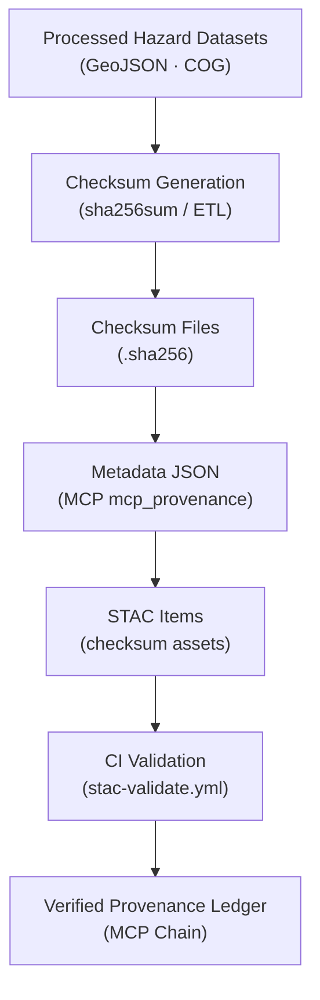

<div align="center">

# ⚠️ Kansas Frontier Matrix — Processed Hazards Checksums  
`data/processed/hazards/checksums/`

**Mission:** Maintain **checksum files (`.sha256`)** verifying the integrity of all processed hazard datasets —  
drought indices, tornado tracks, flood polygons, wildfire detections, and FEMA disaster summaries —  
ensuring **scientific reproducibility, authenticity, and transparent provenance** for Kansas hazard data.

[](../../../../.github/workflows/site.yml)
[](../../../../.github/workflows/stac-validate.yml)
[](../../../../.github/workflows/codeql.yml)
[](../../../../.github/workflows/trivy.yml)
[](../../../../docs/)
[](../../../../LICENSE)
[](../../../../LICENSE)

</div>

---

**Version:** v1.2.0  
**Status:** Stable  
**Last updated:** 2025-10-11  

> Each `.sha256` is a **cryptographic fingerprint** binding a dataset to its metadata (MCP) and STAC record,  
> enforced by CI to keep the historical hazard archive trustworthy and reproducible.

---

## 📚 Table of Contents
- [Overview](#-overview)
- [Purpose](#-purpose)
- [Directory Layout](#-directory-layout)
- [Checksum Standards](#-checksum-standards)
- [Verification Workflow](#-verification-workflow)
- [Integration with MCP & STAC](#-integration-with-mcp--stac)
- [Data Flow](#-data-flow)
- [Adding or Updating Checksums](#-adding-or-updating-checksums)
- [Maintenance & Best Practices](#-maintenance--best-practices)
- [Version History](#-version-history)
- [References](#-references)

---

## 🌪️ Overview
This directory stores **SHA-256 checksum files** for all processed hazard datasets under `data/processed/hazards/`.  
These digests ensure hazard products (**tornado**, **flood**, **drought**, **wildfire**, **FEMA**) remain **unaltered** from their validated versions,  
and provide a verifiable link in the **MCP provenance chain** and **STAC catalog**.

Each checksum corresponds directly to a dataset and its metadata entry in `data/processed/hazards/metadata/`.

---

## 🎯 Purpose

| Goal | Description |
|:-----|:------------|
| **Integrity Validation** | Detect post-build or post-transfer changes in GeoJSON/COG artifacts. |
| **Transparency** | Publish verifiable hashes cross-referenced in STAC & MCP records. |
| **Reproducibility** | Enable independent re-checks by downstream researchers and apps. |
| **Automation** | Power CI/CD gates that block merges/releases on checksum mismatch. |

---

## 🧱 Directory Layout

```bash
data/
└── processed/
    └── hazards/
        └── checksums/
            ├── tornado_tracks_1950_2024.geojson.sha256
            ├── fema_disasters_1953_2024.geojson.sha256
            ├── drought_spi12_1950_2024.tif.sha256
            ├── wildfire_points_2000_2023.geojson.sha256
            ├── flood_events_1900_2020.geojson.sha256
            └── README.md
````

Each `.sha256` is a single-line digest referencing its dataset (**GNU Coreutils** format):

```text
1b5a7f129bc0cde23c18da63b32b17e6b12a926a9b92b57975db5ef938c3f142  tornado_tracks_1950_2024.geojson
```

---

## 🧩 Checksum Standards

| Property      | Value                                          |
| :------------ | :--------------------------------------------- |
| **Algorithm** | SHA-256 (256-bit secure hash)                  |
| **Format**    | GNU `sha256sum`: `<hash>␠␠<filename>`          |
| **Mode**      | Binary (`--binary`) for OS-independent results |
| **Purpose**   | Reproducible fingerprint proving immutability  |

> Hashes are verifiable on Linux/macOS/Windows (WSL/PowerShell equivalents available).

---

## 🔍 Verification Workflow

**Manual Verification**

```bash
# Verify one dataset
sha256sum -c data/processed/hazards/checksums/tornado_tracks_1950_2024.geojson.sha256

# Verify all hazards checksums
find data/processed/hazards/checksums -name "*.sha256" -exec sha256sum -c {} \;
```

**Expected output**

```
tornado_tracks_1950_2024.geojson: OK
flood_events_1900_2020.geojson: OK
drought_spi12_1950_2024.tif: OK
```

**On mismatch**

```
fema_disasters_1953_2024.geojson: FAILED
sha256sum: WARNING: 1 computed checksum did NOT match
```

**Automated CI Verification**
GitHub Actions (`.github/workflows/stac-validate.yml`) automatically re-hash and validate checksums on every commit/PR.

---

## 🌐 Integration with MCP & STAC

Checksums are the cryptographic glue linking **file integrity** to **semantic metadata**:

1. **MCP Provenance** — each metadata JSON includes the hash:

```json
"mcp_provenance": "sha256:1b5a7f129bc0cde23c18da63b32b17e6b12a926a9b92b57975db5ef938c3f142"
```

2. **STAC Linkage** — STAC Items in `data/stac/hazards/` reference the same digest via a checksum asset:

```json
"checksum": {
  "href": "../../processed/hazards/checksums/tornado_tracks_1950_2024.geojson.sha256",
  "type": "text/plain",
  "roles": ["metadata"]
}
```

Together, these provide end-to-end verification across the KFM data architecture.

---

## 🧭 Data Flow



% END OF MERMAID %

---

## ⚙️ Adding or Updating Checksums

1. **Generate checksum**

   ```bash
   sha256sum <dataset> > data/processed/hazards/checksums/<dataset>.sha256
   ```
2. **Validate locally**

   ```bash
   sha256sum -c data/processed/hazards/checksums/<dataset>.sha256
   ```
3. **Sync metadata**

   * Update `mcp_provenance` in `data/processed/hazards/metadata/<dataset>.json`.
   * Ensure the STAC Item includes/updates the `checksum` asset.
4. **Validate repository**

   ```bash
   make validate-hazards
   ```
5. **Commit & PR**
   Commit dataset + checksum together; CI will re-verify all digests.

---

## 🛠️ Maintenance & Best Practices

* **🔄 After reprocessing:** Regenerate checksums and update MCP/STAC digests.
* **🧾 Filename parity:** Checksum filenames must exactly match dataset names.
* **📜 Release manifests:** Keep a `manifest_all.sha256` for release-wide audit (optional).
* **🪝 Pre-commit hook:** Optionally block commits with stale/missing `.sha256`.
* **🧠 Documentation:** Note digest changes in PR descriptions and STAC changelogs.

---

## 📅 Version History

| Version    | Date       | Summary                                                                              |
| :--------- | :--------- | :----------------------------------------------------------------------------------- |
| **v1.2.0** | 2025-10-11 | Added Mermaid data-flow, clarified STAC checksum asset, expanded maintenance section |
| **v1.0.1** | 2025-10-10 | MCP front matter, CI details, and maintenance guidance                               |
| **v1.0.0** | 2025-10-04 | Initial hazards checksum documentation and SHA-256 manifests                         |

---

## 📖 References

* NOAA Storm Events — [https://www.ncei.noaa.gov/stormevents/](https://www.ncei.noaa.gov/stormevents/)
* FEMA Declarations (OpenFEMA) — [https://www.fema.gov/openfema-data-page/disaster-declarations-summaries-v2](https://www.fema.gov/openfema-data-page/disaster-declarations-summaries-v2)
* NASA FIRMS — [https://firms.modaps.eosdis.nasa.gov/](https://firms.modaps.eosdis.nasa.gov/)
* U.S. Drought Monitor — [https://droughtmonitor.unl.edu/](https://droughtmonitor.unl.edu/)
* USGS Flood Science — [https://www.usgs.gov/mission-areas/water-resources/science/floods](https://www.usgs.gov/mission-areas/water-resources/science/floods)
* GNU Coreutils — SHA utilities: [https://www.gnu.org/software/coreutils/manual/html_node/sha2-utilities.html](https://www.gnu.org/software/coreutils/manual/html_node/sha2-utilities.html)
* STAC 1.0 — [https://stacspec.org](https://stacspec.org)
* MCP Standards — `../../../../docs/standards/`

---

<div align="center">

*“Every storm, every fire, every flood — these checksums ensure the history of Kansas hazards remains untampered and true.”*
📍 [`data/processed/hazards/checksums/`](.)

</div>
```
