<div align="center">

# ⚠️ Kansas Frontier Matrix — Processed Hazard Data  
`data/processed/hazards/`

**Mission:** Store and document all **processed hazard datasets** — cleaned, merged, and standardized records  
of droughts, floods, wildfires, tornadoes, and severe weather — used for temporal analysis and risk modeling  
in the Kansas Frontier Matrix (KFM) system.

[](../../../.github/workflows/site.yml)
[](../../../.github/workflows/stac-validate.yml)
[](../../../.github/workflows/codeql.yml)
[](../../../.github/workflows/trivy.yml)
[](https://pre-commit.com/)
[](../../../docs/)
[](../../../LICENSE)
[](../../../LICENSE)

</div>

---

**Version:** v1.3.0  
**Status:** Stable  
**Last updated:** 2025-10-11  

> MCP documentation-first; **STAC 1.0** Items; **COG/GeoJSON** outputs; **SHA-256** integrity; GitHub-safe Mermaid.

---

## 📚 Table of Contents
- [Overview](#-overview)
- [Directory Layout](#-directory-layout)
- [Core Hazard Datasets](#-core-hazard-datasets)
- [STAC Metadata](#-stac-metadata)
- [Processing Workflow](#-processing-workflow)
- [Data Flow](#-data-flow)
- [Reproducibility & Validation](#-reproducibility--validation)
- [AI / Graph Bindings](#-ai--graph-bindings)
- [Contributing New Hazard Data](#-contributing-new-hazard-data)
- [Version History](#-version-history)
- [References](#-references)

---

## 🌪️ Overview
This directory contains **processed hazard event datasets**, cleaned and standardized from **NOAA**, **FEMA**, **NASA**,  
and **USGS** archives to form the **historical hazard record** for Kansas.

Outputs include **event-level GeoJSONs** and **gridded hazard indices**, forming the base for derivative layers —  
density rasters, risk composites, and frequency models (see `data/derivatives/hazards/`).

**Primary sources**
- NOAA Storm Events & SPC (tornado/hail/wind, floods)  
- FEMA Disaster Declarations (county-level since 1953)  
- NASA FIRMS (wildfire detections)  
- U.S. Drought Monitor & NOAA CPC SPI (drought intensity)  
- USGS Water Resources (flood measurements & extents)

All outputs are reprojected to **EPSG:4326 (WGS 84)** and formatted as **GeoTIFF (COG)** or **GeoJSON**.

---

## 🧱 Directory Layout

```bash
data/
└── processed/
    └── hazards/
        ├── tornado_tracks_1950_2024.geojson    # Cleaned NOAA SPC tornado tracks (Kansas subset)
        ├── fema_disasters_1953_2024.geojson    # FEMA disaster declarations (KS counties)
        ├── drought_spi12_1950_2024.tif         # 12-month SPI drought index (COG)
        ├── wildfire_points_2000_2023.geojson   # NASA FIRMS active fire detections
        ├── flood_events_1900_2020.geojson      # Digitized flood polygons & attributes
        ├── metadata/
        │   ├── tornado_tracks_1950_2024.json
        │   ├── drought_spi12_1950_2024.json
        │   └── fema_disasters_1953_2024.json
        ├── checksums/
        │   ├── tornado_tracks_1950_2024.geojson.sha256
        │   ├── drought_spi12_1950_2024.tif.sha256
        │   └── fema_disasters_1953_2024.geojson.sha256
        └── README.md
````

---

## 🌩️ Core Hazard Datasets

| Product                         | File                                | Description                                  | Source        | Units       | Format        |
| :------------------------------ | :---------------------------------- | :------------------------------------------- | :------------ | :---------- | :------------ |
| **Tornado Tracks (1950–2024)**  | `tornado_tracks_1950_2024.geojson`  | Cleaned tornado path polylines (KS subset)   | NOAA SPC      | categorical | GeoJSON       |
| **FEMA Disasters (1953–2024)**  | `fema_disasters_1953_2024.geojson`  | County-level disaster declarations and types | FEMA OpenFEMA | categorical | GeoJSON       |
| **Drought SPI (12-Month)**      | `drought_spi12_1950_2024.tif`       | 12-month standardized precipitation index    | NOAA CPC      | index       | GeoTIFF (COG) |
| **Wildfire Points (2000–2023)** | `wildfire_points_2000_2023.geojson` | MODIS/NASA fire detections                   | NASA FIRMS    | count       | GeoJSON       |
| **Flood Events (1900–2020)**    | `flood_events_1900_2020.geojson`    | Digitized flood polygons with event metadata | USGS · KGS    | binary      | GeoJSON       |

---

## 🧩 STAC Metadata

Each processed hazard file is registered as a STAC Item under `data/stac/hazards/`, including provenance, lineage, and citation.

**Example STAC Item**

```json
{
  "type": "Feature",
  "stac_version": "1.0.0",
  "id": "tornado_tracks_1950_2024",
  "collection": "hazards",
  "properties": {
    "title": "NOAA SPC Tornado Tracks (1950–2024)",
    "description": "Cleaned tornado path dataset from NOAA Storm Prediction Center (Kansas subset).",
    "start_datetime": "1950-01-01T00:00:00Z",
    "end_datetime": "2024-12-31T23:59:59Z",
    "proj:epsg": 4326,
    "processing:software": "Python; GeoPandas; Shapely; GDAL",
    "kfm:provenance_sha256": "sha256:e17a9b…",
    "kfm:derived_from": ["../../raw/noaa_tornado_tracks.zip"],
    "license": "CC-BY-4.0",
    "providers": [
      {"name": "NOAA SPC", "roles": ["producer", "licensor"]},
      {"name": "Kansas Frontier Matrix", "roles": ["processor", "curator"]}
    ]
  },
  "assets": {
    "data": {
      "href": "../../processed/hazards/tornado_tracks_1950_2024.geojson",
      "type": "application/geo+json",
      "roles": ["data"]
    },
    "checksum": {
      "href": "../../processed/hazards/checksums/tornado_tracks_1950_2024.geojson.sha256",
      "type": "text/plain",
      "roles": ["metadata"]
    }
  },
  "bbox": [-102.05, 36.99, -94.59, 40.00],
  "links": [
    {"rel": "collection", "href": "./hazards-collection.json", "type": "application/json"}
  ]
}
```

---

## ⚙️ Processing Workflow

Processing and harmonization use Makefile targets and Python tools in `tools/hazards/`
with **Python · GeoPandas · Shapely · GDAL**. Rasters are converted to **COGs** with overviews.

**Example CLI**

```bash
# 1) Clean tornado track shapefile
python tools/hazards/clean_tornado_tracks.py \
  --input data/raw/noaa_tornado_tracks.zip \
  --output data/processed/hazards/tornado_tracks_1950_2024.geojson

# 2) Process FEMA disaster declarations (KS subset)
python tools/hazards/fema_disasters.py \
  --input data/raw/fema_disasters.csv \
  --state "Kansas" \
  --output data/processed/hazards/fema_disasters_1953_2024.geojson

# 3) Generate SPI drought raster (12-month)
python tools/hazards/drought_spi.py \
  --input data/raw/noaa_precip_1950_2024.csv \
  --window 12 \
  --output data/processed/hazards/drought_spi12_1950_2024.tif
```

---

## 🧭 Data Flow

```mermaid
flowchart TD
  A["Raw Hazard Sources\n(NOAA · FEMA · NASA · USGS)"] --> B["ETL\n(clean · merge · standardize)"]
  B --> C["Processed Outputs\n(GeoJSON · COG)"]
  C --> D["STAC Items\n(provenance · lineage)"]
  D --> E["Graph/API\n(Neo4j · FastAPI)"]
  E --> F["Web UI\n(MapLibre layers · Timeline)"]
```



% END OF MERMAID %

---

## 🔁 Reproducibility & Validation

| Check                 | Method                                                                   |
| :-------------------- | :----------------------------------------------------------------------- |
| **Checksums**         | `.sha256` digest per dataset under `checksums/` (verified in CI)         |
| **STAC Validation**   | STAC 1.0 schema checks in CI (`stac-validate.yml`)                       |
| **Makefile Targets**  | `make hazards` (process all) · `make validate-hazards` (validate all)    |
| **Container Runtime** | Pinned Docker image (Python + GDAL + GeoPandas)                          |
| **QA**                | Event counts, date ranges, spatial bounds cross-checked (NOAA/FEMA/USGS) |

---

## 🧠 AI / Graph Bindings

* **Graph IDs:** `event:Tornado_YYYYMMDD_<id>`, `event:FEMA_<disaster_id>`, `raster:SPI12_YYYYMM`, `point:FIRMS_<date>`
* **API (FastAPI):**
  `/events?type=tornado&start=1950-01-01&end=2024-12-31&bbox=<…>`
  `/hazards/indices?name=SPI12&date=YYYY-MM`
* **NLP hooks:** per-event summaries, county aggregation, time-bucket stats for legends.

---

## 🤝 Contributing New Hazard Data

1. Add cleaned raster/vector datasets to this folder.
2. Create a **STAC Item** in `metadata/` and a checksum in `checksums/`.
3. Add a **DERIVATION.md** (inputs, methods, software, assumptions).
4. Validate:

   ```bash
   make validate-hazards
   ```
5. Open a PR including: licenses/citations, scripts & parameters, and visualization guidance.

> All PRs are automatically checked by CI for schema and integrity compliance.

---

## 📅 Version History

| Version    | Date       | Summary                                                                  |
| :--------- | :--------- | :----------------------------------------------------------------------- |
| **v1.3.0** | 2025-10-11 | Refined dataset table; tightened STAC item example; added AI/Graph notes |
| **v1.2.0** | 2025-10-11 | Added Mermaid data-flow, checksum asset in STAC, QA table                |
| **v1.0.1** | 2025-10-10 | MCP front matter, CI targets, QA verification details                    |
| **v1.0.0** | 2025-10-04 | Initial processed hazards datasets and documentation                     |

---

## 📖 References

* NOAA Storm Events — [https://www.ncei.noaa.gov/stormevents/](https://www.ncei.noaa.gov/stormevents/)
* FEMA Declarations (OpenFEMA) — [https://www.fema.gov/openfema-data-page/disaster-declarations-summaries-v2](https://www.fema.gov/openfema-data-page/disaster-declarations-summaries-v2)
* NASA FIRMS — [https://firms.modaps.eosdis.nasa.gov/](https://firms.modaps.eosdis.nasa.gov/)
* U.S. Drought Monitor — [https://droughtmonitor.unl.edu/](https://droughtmonitor.unl.edu/)
* USGS Flood Science — [https://www.usgs.gov/mission-areas/water-resources/science/floods](https://www.usgs.gov/mission-areas/water-resources/science/floods)
* GDAL / GeoPandas — [https://gdal.org](https://gdal.org) · [https://geopandas.org](https://geopandas.org)
* STAC 1.0 — [https://stacspec.org](https://stacspec.org)
* MCP Standards — `../../../docs/standards/`

---

<div align="center">

*“From storm paths to drought scars — these processed datasets chronicle the forces that shaped Kansas resilience.”*
📍 [`data/processed/hazards/`](.)

</div>
```
