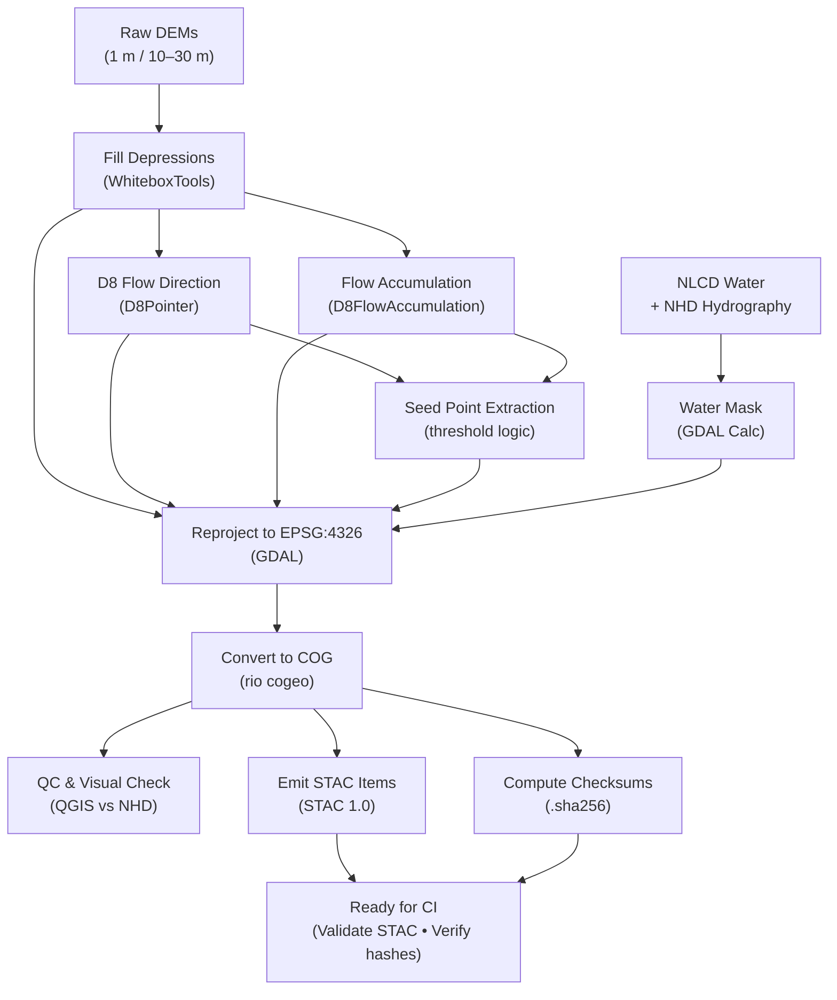

<div align="center">

# 💧 Kansas Frontier Matrix — Processed Hydrology Data  
`data/processed/hydrology/`

**Mission:** Maintain validated **hydrologic base surfaces** — sink-filled DEMs, D8 flow direction,  
base flow accumulation, water masks, and seed points — that power **stream networks**, **basins**,  
and **flood-risk modeling** across Kansas.

[](../../../.github/workflows/site.yml)
[](../../../.github/workflows/stac-validate.yml)
[](../../../.github/workflows/codeql.yml)
[](../../../.github/workflows/trivy.yml)
[](https://pre-commit.com/)
[](../../../docs/)
[](../../../LICENSE)
[](../../../LICENSE)

</div>

---

**Version:** v1.2.0  
**Status:** Stable  
**Last updated:** 2025-10-11

> This directory follows **MCP** documentation-first practices with **STAC 1.0** metadata, **COG/GeoJSON** outputs,  
> **SHA-256** integrity, and CI validation. All Mermaid diagrams are GitHub-render-safe.

---

## 📚 Table of Contents
- [Overview](#-overview)
- [Directory Layout](#-directory-layout)
- [Core Hydrology Datasets](#-core-hydrology-datasets)
- [STAC Metadata](#-stac-metadata)
- [Processing Workflow](#-processing-workflow)
- [Reproducibility & Validation](#-reproducibility--validation)
- [AI / Graph Bindings](#-ai--graph-bindings)
- [Contributing](#-contributing)
- [Version History](#-version-history)
- [References](#-references)

---

## 🌊 Overview
This directory contains **processed hydrologic surfaces and layers** produced from DEM conditioning and flow-routing.  
These intermediate artifacts drive **flow accumulation, stream extraction, basin segmentation,** and **flood simulations**.

**Sources** — LiDAR 1 m DEMs (DASC / USGS 3DEP), historical 10–30 m DEMs, NLCD water, NHD hydrography, GNIS features.  
**Standards** — COG GeoTIFF (rasters) and GeoJSON (vectors), **EPSG:4326**.  
**Catalog** — Registered under `data/stac/hydrology/`.

---

## 🧱 Directory Layout

```bash
data/
└── processed/
    └── hydrology/
        ├── dem_filled_1m_ks.tif           # Hydro-conditioned DEM (sink-filled)
        ├── flow_dir_d8_1m_ks.tif          # D8 flow direction grid (ESRI 1–128)
        ├── flow_accum_base_1m_ks.tif      # Base flow accumulation (pre-threshold)
        ├── watermask_ks.tif               # Binary water mask (1 = water)
        ├── stream_seed_points.geojson     # Candidate outlets / pour-points
        ├── metadata/
        │   ├── dem_filled_1m_ks.json
        │   ├── flow_dir_d8_1m_ks.json
        │   └── flow_accum_base_1m_ks.json
        ├── checksums/
        │   ├── dem_filled_1m_ks.tif.sha256
        │   ├── flow_dir_d8_1m_ks.tif.sha256
        │   └── flow_accum_base_1m_ks.tif.sha256
        └── README.md
````

---

## 💦 Core Hydrology Datasets

| Product                 | File                         | Description                                               | Source / Tool           | Units  | Format      |
| :---------------------- | :--------------------------- | :-------------------------------------------------------- | :---------------------- | :----- | :---------- |
| **Filled DEM**          | `dem_filled_1m_ks.tif`       | 1 m LiDAR DEM with sink filling for hydrologic continuity | KS LiDAR / USGS 3DEP    | m      | COG GeoTIFF |
| **Flow Direction (D8)** | `flow_dir_d8_1m_ks.tif`      | Downslope pointer grid (ESRI D8; 1–128)                   | Derived (WhiteboxTools) | int    | COG GeoTIFF |
| **Flow Accumulation**   | `flow_accum_base_1m_ks.tif`  | Raw accumulation prior to stream thresholding             | Derived (WhiteboxTools) | cells  | COG GeoTIFF |
| **Water Mask**          | `watermask_ks.tif`           | Binary mask fused from NLCD water + NHD hydrography       | USGS / DASC / Derived   | binary | COG GeoTIFF |
| **Stream Seed Points**  | `stream_seed_points.geojson` | Candidate outlets / pour-points for basins & QA           | Derived                 | n/a    | GeoJSON     |

---

## 🧩 STAC Metadata

**Example STAC Item**

```json
{
  "type": "Feature",
  "stac_version": "1.0.0",
  "id": "flow_dir_d8_1m_ks",
  "collection": "hydrology",
  "properties": {
    "title": "Flow Direction (D8) — Kansas LiDAR DEM",
    "description": "D8 pointer grid derived from hydro-conditioned 1 m DEM.",
    "start_datetime": "2020-01-01T00:00:00Z",
    "end_datetime": "2020-12-31T23:59:59Z",
    "proj:epsg": 4326,
    "processing:software": "WhiteboxTools 2.2.0",
    "processing:steps": ["FillDepressions", "D8Pointer"],
    "kfm:derived_from": ["../../processed/hydrology/dem_filled_1m_ks.tif"],
    "kfm:provenance_sha256": "sha256:<hash>",
    "license": "CC-BY-4.0",
    "providers": [
      {"name":"USGS 3DEP","roles":["producer"]},
      {"name":"Kansas Frontier Matrix","roles":["processor","curator"]}
    ]
  },
  "assets": {
    "data": {
      "href": "../../processed/hydrology/flow_dir_d8_1m_ks.tif",
      "type": "image/tiff; application=geotiff; profile=cloud-optimized",
      "roles": ["data"]
    },
    "checksum": {
      "href": "../../processed/hydrology/checksums/flow_dir_d8_1m_ks.tif.sha256",
      "type": "text/plain",
      "roles": ["metadata"]
    },
    "metadata": {
      "href": "../../processed/hydrology/metadata/flow_dir_d8_1m_ks.json",
      "type": "application/json",
      "roles": ["metadata"]
    }
  },
  "bbox": [-102.05, 36.99, -94.59, 40.00],
  "links": [
    {"rel":"collection","href":"./hydrology-collection.json","type":"application/json"}
  ]
}
```

---

## ⚙️ Processing Workflow



% END OF MERMAID %

**Example Commands**

```bash
whitebox_tools --run=FillDepressions -i dem_1m_ks.tif -o dem_filled_1m_ks.tif
whitebox_tools --run=D8Pointer -i dem_filled_1m_ks.tif -o flow_dir_d8_1m_ks.tif
whitebox_tools --run=D8FlowAccumulation -i dem_filled_1m_ks.tif -o flow_accum_base_1m_ks.tif
gdal_calc.py -A nlcd_water_ks.tif -B nhd_water_ks.tif \
  --outfile=watermask_ks.tif --calc="((A>0)|(B>0)).astype(uint8)"
python tools/hydro/seed_points.py --accum flow_accum_base_1m_ks.tif --threshold 500
```

---

## 🔁 Reproducibility & Validation

| Check           | Method                                                 |
| :-------------- | :----------------------------------------------------- |
| **Integrity**   | `.sha256` file per artifact (verified in CI)           |
| **Metadata**    | STAC 1.0 schema validation (`make stac-validate`)      |
| **Pipeline**    | Rebuild with `make hydrology` or `make validate-hydro` |
| **Environment** | Docker toolchain (GDAL + WhiteboxTools + Python)       |
| **QA/QC**       | Visual inspection in QGIS; compare streams vs. NHD     |

---

## 🧠 AI / Graph Bindings

* **Graph IDs:** `raster:DEM_Filled_1m_KS`, `raster:FlowDir_D8_1m_KS`, `raster:FlowAccum_Base_1m_KS`, `mask:Water_KS`, `points:Seeds_KS`
* **API (FastAPI):**
  `/hydro/layers?bbox=<...>&resolution=1m` → returns STAC Items for map config
  `/hydro/basins?seeds=<geojson>` → delineates basins and links STAC + lineage
* **NLP hooks:** auto-summaries for dataset cards; basic stats (mean accumulation, % water) for legends.

---

## 🧠 Contributing

1. Add new COG or GeoJSON outputs.
2. Create **STAC JSON** in `metadata/` and a `.sha256` in `checksums/`.
3. Write `DERIVATION.md` (inputs, tool versions, parameters).
4. Validate locally → `make validate-hydro`.
5. Open a PR with sources, licenses, and optional screenshots.

> **Policy:** All new data must pass STAC + checksum validation prior to merge.

---

## 📅 Version History

| Version    | Date       | Summary                                                                                       |
| :--------- | :--------- | :-------------------------------------------------------------------------------------------- |
| **v1.2.0** | 2025-10-11 | Added Mermaid workflow, STAC checksum asset, AI/Graph bindings, and expanded validation table |
| **v1.1.0** | 2025-10-06 | Added seed point extraction and water mask fusion workflow                                    |
| **v1.0.0** | 2025-10-04 | Initial hydrology processed layers (filled DEM, D8, base accumulation)                        |

---

## 📖 References

* WhiteboxTools — [https://www.whiteboxgeo.com/manual/wbt_book/hydro.html](https://www.whiteboxgeo.com/manual/wbt_book/hydro.html)
* TauDEM — [https://hydrology.usu.edu/taudem](https://hydrology.usu.edu/taudem)
* GDAL — [https://gdal.org](https://gdal.org)
* USGS NHD — [https://www.usgs.gov/national-hydrography](https://www.usgs.gov/national-hydrography)
* Kansas DASC Hub — [https://hub.kansasgis.org](https://hub.kansasgis.org)
* STAC 1.0 Spec — [https://stacspec.org](https://stacspec.org)
* MCP Docs — `../../../docs/`

---

<div align="center">

*“From high plains to river valleys — these grids trace the flow that carved Kansas’s landscape.”*
📍 [`data/processed/hydrology/`](.)

</div>
```
