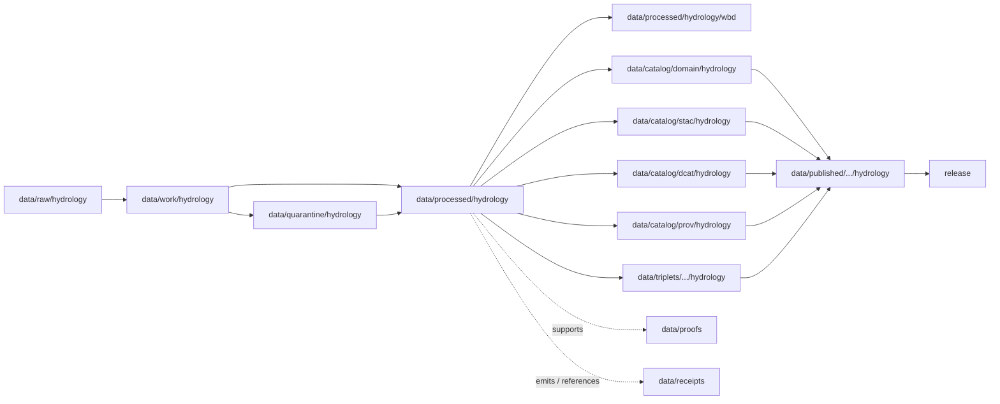

<!-- [KFM_META_BLOCK_V2]
doc_id: kfm://doc/data-processed-hydrology-readme
title: data/processed/hydrology/README.md — Hydrology Processed Data README
version: v0.1
type: readme; data-lifecycle-domain-lane; processed-stage-guide; hydrology-domain-root; watershed-gauge-regulatory-context-lane-index
status: draft; PROPOSED; data-root; processed-stage; hydrology; watershed; HUC; hydrography; gauges; water-observations; groundwater; NFHL; hydrograph; source-role-aware; evidence-first; release-gated
authors: ChatGPT-5.5 Thinking; reviewed_by: OWNER_TBD
owners: OWNER_TBD — Hydrology steward · Watershed/HUC steward · Gauge/observation steward · Source-role steward · Data steward · Pipeline steward · Evidence steward · Policy steward · Release steward · Docs steward
created: NEEDS VERIFICATION — greenfield stub existed before v0.1 expansion
updated: 2026-06-25
policy_label: public-doc; data; processed; hydrology; lifecycle; governed; source-role-aware; vintage-aware; release-gated
tags: [kfm, data, processed, hydrology, watershed, HUCUnit, WBD, hydrofeature, reach-identity, gauge-site, flow-observation, water-level-observation, water-quality-observation, groundwater-well, aquifer-observation, NFHLZone, hydrograph, upstream-trace, water-use-link, drought-link, irrigation-link, source-role, authority, observation, regulatory-context, model, aggregate, administrative, candidate, synthetic, SourceDescriptor, EvidenceBundle, ValidationReport, PolicyDecision, ReleaseManifest, RollbackCard, RAW, WORK, QUARANTINE, PROCESSED, CATALOG, TRIPLET, PUBLISHED]
related:
  - ../README.md
  - ../../README.md
  - ../../../docs/domains/hydrology/README.md
  - ../../../docs/domains/hydrology/PUBLICATION_POSTURE.md
  - ../../../docs/domains/hazards/README.md
  - ../../../docs/domains/soil/README.md
  - ../../../docs/domains/agriculture/README.md
  - ../../../docs/domains/habitat/README.md
  - ../../../docs/domains/fauna/README.md
  - ../../../docs/domains/flora/README.md
  - ../../../docs/domains/settlements-infrastructure/README.md
  - ../../../policy/domains/hydrology/
  - ../../../contracts/domains/hydrology/
  - ../../../schemas/contracts/v1/domains/hydrology/
  - ../../raw/hydrology/
  - ../../work/hydrology/
  - ../../quarantine/hydrology/
  - ../../catalog/domain/hydrology/
  - ../../catalog/stac/hydrology/
  - ../../catalog/dcat/hydrology/
  - ../../catalog/prov/hydrology/
  - ../../triplets/
  - ../../published/
  - ../../proofs/
  - ../../receipts/
  - ../../registry/sources/hydrology/
  - ../../../release/candidates/hydrology/
  - ../../../release/
  - ../../../pipelines/domains/hydrology/
  - ../../../pipeline_specs/hydrology/
  - ../../../tools/validators/
  - wbd/README.md
notes:
  - "This file replaces a greenfield stub at `data/processed/hydrology/README.md`."
  - "This is the parent PROCESSED-stage domain lane for Hydrology artifacts. It is not RAW source storage, WORK scratch, QUARANTINE holding, CATALOG, TRIPLET, PUBLISHED, proof storage, receipt storage, source registry, policy authority, release authority, public API/UI output, public map/tile output, flood-warning surface, operational water-management instruction, property-rights evidence, engineering certification, or life-safety guidance."
  - "Hydrology processed artifacts must preserve source role, rights, sensitivity posture, object-family distinction, temporal semantics, evidence linkage, validation state, digest closure, catalog readiness, release state, correction path, and rollback target before public use."
  - "Source-role anti-collapse is mandatory: authority geography, observations, regulatory context, modeled hydrographs, aggregate rollups, administrative records, candidates, and synthetic summaries are not interchangeable."
  - "NFHL is regulatory context only and must never be relabeled as observed flooding. WBD/HUC is authority watershed geography and must never be relabeled as observed gauge data, flood event, hydrograph model, or emergency status."
  - "Hydrology is on the emergency-alert boundary; KFM is not an emergency warning or life-safety instruction system."
  - "This README is a parent lane guide and index. Child lane READMEs define local sublane boundaries; contracts define semantic object meaning; schemas define machine shape; policy decides admissibility; release records decide publication."
  - "Rollback target for this expansion is previous greenfield stub blob SHA `2bc57f3c4ec9636afdc4b4ece85a79d81961de56`."
[/KFM_META_BLOCK_V2] -->

<a id="top"></a>

# data/processed/hydrology

> Parent Hydrology PROCESSED-stage lane for normalized, source-traced, source-role-preserved, time-aware water-system artifacts that have passed beyond RAW/WORK/QUARANTINE but are not yet cataloged, triplet-projected, published, or released.

<p>
  
  
  
  
  
  
</p>

**Status:** draft / PROPOSED  
**Owners:** OWNER_TBD — Hydrology steward · Watershed/HUC steward · Gauge/observation steward · Source-role steward · Data steward · Pipeline steward · Evidence steward · Policy steward · Release steward · Docs steward  
**Path:** `data/processed/hydrology/README.md`  
**Owning root:** `data/processed/`  
**Domain segment:** `hydrology`  
**Lifecycle stage:** `PROCESSED`  
**Exposure posture:** not public by default; any public use requires governed catalog, EvidenceBundle, source-role and rights posture, temporal disclosure, sensitivity/policy review, ValidationReport, PolicyDecision where applicable, ReleaseManifest, correction path, and rollback target.  
**Truth posture:** CONFIRMED target was a greenfield stub · CONFIRMED parent `data/processed/` is upstream of catalog/triplet/publication and is not a normal public surface · CONFIRMED Hydrology owns watersheds/HUCs, hydrofeatures/reaches, gauges/wells, observations, regulatory flood context, hydrographs, upstream traces, and water-use/drought/irrigation links · CONFIRMED NFHL is regulatory context and not observed flooding · CONFIRMED emergency/life-safety warning use is denied · PROPOSED parent-lane details and child-lane index · NEEDS VERIFICATION for actual child inventory, validators, fixtures, source descriptors, access-control enforcement, receipt families, policy enforcement, release linkage, and governed route behavior.

**Quick jumps:** [Purpose](#purpose) · [Lifecycle boundary](#lifecycle-boundary) · [Repo fit](#repo-fit) · [Lane index](#lane-index) · [Accepted contents](#accepted-contents) · [Exclusions](#exclusions) · [Hydrology processed requirements](#hydrology-processed-requirements) · [Source-role and publication guardrails](#source-role-and-publication-guardrails) · [Evidence ledger](#evidence-ledger) · [Validation checklist](#validation-checklist) · [Rollback](#rollback)

---

## Purpose

`data/processed/hydrology/` is the parent PROCESSED-stage lane for normalized Hydrology artifacts. It organizes processed outputs after source capture, geometry normalization, identity reconciliation, source-role preservation, observation normalization, vintage handling, regulatory-context separation, topology processing, QA, policy review, or public-safe derivative preparation, while keeping those artifacts upstream of catalog, triplet, publication, release, proof closure, and public access.

This lane may contain or point to processed artifacts for:

- watersheds and HUC units;
- WBD/HUC boundary products and hierarchy/context sidecars;
- hydrographic features and reach identities;
- gauge sites, groundwater wells, and monitoring-site metadata;
- flow, water-level, water-quality, aquifer, and related observations;
- hydrographs, modeled reconstructions, and time-series projections when source role is explicit;
- NFHL regulatory flood context as regulatory context only;
- upstream/downstream traces and network traversal outputs;
- water-use, drought, and irrigation links anchored on hydrologic features;
- public-candidate or restricted Hydrology derivatives that remain release-gated.

This parent README does not create a semantic contract, schema, validator, source registry, proof, receipt, policy decision, release decision, public map layer, public tile, public API route, public UI payload, flood warning, observed flooding claim, NFHL regulatory substitute, water-rights claim, property-rights claim, operational water-management instruction, engineering certification, or life-safety product.

## Lifecycle boundary

```text
RAW -> WORK / QUARANTINE -> PROCESSED -> CATALOG / TRIPLET -> PUBLISHED
```


```mermaid
flowchart LR
  RAW[data/raw/hydrology] --> WORK[data/work/hydrology]
  WORK --> QUAR[data/quarantine/hydrology]
  WORK --> PROC[data/processed/hydrology]
  QUAR --> PROC
  PROC --> WBD[data/processed/hydrology/wbd]
  PROC --> CAT[data/catalog/domain/hydrology]
  PROC --> STAC[data/catalog/stac/hydrology]
  PROC --> DCAT[data/catalog/dcat/hydrology]
  PROC --> PROV[data/catalog/prov/hydrology]
  PROC --> TRIP[data/triplets/.../hydrology]
  PROC -. supports .-> PROOF[data/proofs]
  PROC -. emits / references .-> RECEIPT[data/receipts]
  CAT --> PUBLISHED[data/published/.../hydrology]
  STAC --> PUBLISHED
  DCAT --> PUBLISHED
  PROV --> PUBLISHED
  TRIP --> PUBLISHED
  PUBLISHED --> REL[release]
```

`data/processed/hydrology/` is upstream of catalog, triplet, publication, and release. It must not be used as a normal public map/API/UI/AI source.

## Repo fit

| Responsibility | Correct home | Rule |
|---|---|---|
| Raw water data API responses, source-native WBD/NHD/NFHL files, well files, gauge feeds, source exports, source logs, original geometries, source identifiers, or source-native timestamps | `data/raw/hydrology/` | Not this lane. |
| In-process transforms, geometry repair, topology experiments, source-role resolution, observation QA, temporal matching, model experiments, joins, notebooks, or scratch products | `data/work/hydrology/` | Not this lane. |
| Unresolved source role, rights uncertainty, malformed geometry, topology failure, ambiguous reach/HUC identity, stale operational context, unsafe joins, or not-yet-reviewed hydrology material | `data/quarantine/hydrology/` | Not this lane until review/admission allows. |
| Normalized Hydrology processed artifacts | `data/processed/hydrology/` | This parent lane and child lanes. |
| WBD/HUC processed watershed artifacts | `data/processed/hydrology/wbd/` | Child watershed-boundary lane. |
| Hydrology catalog records | `data/catalog/domain/hydrology/` | Downstream catalog stage. |
| Hydrology STAC/DCAT/PROV records | `data/catalog/{stac,dcat,prov}/hydrology/` | Downstream catalog projections if accepted. |
| Hydrology triplet/graph records | `data/triplets/.../hydrology/` | Downstream graph stage; must not expose role-collapsed claims or unsafe joins. |
| Published public-safe Hydrology products | `data/published/.../hydrology` or `data/published/layers/hydrology/` | Downstream only after release. |
| EvidenceBundle/proof records | `data/proofs/` | Separate proof family. |
| Source, run, model-run, transform, validation, policy, correction, access, and release receipts | `data/receipts/` | Separate receipt family. |
| Hydrology source registry records | `data/registry/sources/hydrology/` | Separate source authority. |
| Release candidates and release manifests | `release/candidates/hydrology/`, `release/` | Separate publication authority. |
| Hydrology contracts | `contracts/domains/hydrology/` | Object meaning; not data. |
| Hydrology schemas | `schemas/contracts/v1/domains/hydrology/` | Machine shape; not data. |
| Hydrology policy and sensitivity rules | `policy/domains/hydrology/` | Admissibility authority; not data. |
| Validators, tests, fixtures, pipelines, pipeline specs, apps, packages | `tools/validators/`, `tests/`, `fixtures/`, `pipelines/`, `pipeline_specs/`, `apps/`, `packages/` | Separate roots. |

## Lane index

Known or intended child lanes under `data/processed/hydrology/` are listed below. Treat entries as **PROPOSED** unless current child READMEs, validators, fixtures, policies, receipts, access controls, and CI enforcement have been verified in the same implementation pass.

| Lane | Family | Purpose | Hard boundary |
|---|---|---|---|
| `wbd/` | Watershed / HUCUnit | WBD/HUC boundary polygons, HUC identity, hierarchy, topology, and vintage context. | WBD/HUC is authority watershed geography, not gauge observation, NFHL, flood event, or warning. |
| `nhdplus/` | HydroFeature / ReachIdentity | Hydrographic features, reach identity, network context, and NHD/3DHP derivatives. | Reach identity ambiguity must fail closed or ABSTAIN. |
| `gauges/` | GaugeSite | Monitoring-site metadata, datum/unit/site context, and source metadata. | Gauge site is not the observation value itself. |
| `observations/flow/` | FlowObservation | Observed discharge readings and QA/context sidecars. | Observation is not model, forecast, or water-rights proof. |
| `observations/level/` | WaterLevelObservation | Observed stage/gage-height readings and QA/context sidecars. | Observation must preserve observed/source/retrieval times. |
| `observations/quality/` | WaterQualityObservation | Parameterized water-quality observations with qualifiers and units. | Parameter/QA metadata required; not health/legal advice. |
| `groundwater/` | GroundwaterWell / AquiferObservation | Groundwater wells and aquifer-state observations where rights allow. | Well/owner detail may be restricted or generalized. |
| `nfhl/` | NFHLZone | FEMA regulatory flood-hazard zone context. | Regulatory role only; never observed flooding. |
| `hydrographs/` | Hydrograph | Observed or modeled time-series projections with role/version/receipts. | Modeled hydrographs are not observations. |
| `traces/` | UpstreamTrace | Upstream/downstream traversal outputs and network traces. | Trace outputs are derived analysis, not source truth. |
| `water_use/` | WaterUseLink | Hydrology-anchored links to water use/permits/withdrawals. | Administrative records and observations remain separate. |
| `drought_links/` | DroughtLink | HUC/reach-linked drought context. | Aggregate drought context is not per-place truth by itself. |
| `irrigation_links/` | IrrigationLink | Hydrology-anchored irrigation context. | Agriculture owns crop/field truth; hydrology anchors water context only. |
| `public/` | Public-candidate Hydrology products | Candidate public-safe hydrology products. | `public/` means public-candidate if present, not published or released. |
| `restricted/` | Restricted Hydrology products | Rights-sensitive wells, infrastructure-sensitive joins, or role-gated artifacts. | Non-public, access-controlled, fail-closed. |

## Accepted contents

Processed Hydrology data may include:

- normalized tabular, spatial, temporal, raster, vector, network, graph-ready, time-series, or review-ready hydrology artifacts;
- source-role-tagged watershed, HUC, hydrofeature, reach identity, gauge site, flow observation, water-level observation, water-quality observation, groundwater well, aquifer observation, NFHL context, hydrograph, upstream trace, water-use link, drought link, or irrigation link products;
- public-safe generalized, aggregated, redacted, delayed, or suppressed derivatives that still require catalog/release review before public use;
- restricted reviewer-only, rights-controlled, well-detail-sensitive, infrastructure-sensitive, identity-ambiguous, or denied/internal-review processed artifacts admitted by policy;
- sidecar metadata needed to interpret processed artifacts when it is not a receipt, proof, policy decision, release manifest, source registry record, schema, validator, or catalog record;
- lane-local README or manifest notes that explain processed-data boundaries without becoming public outputs or authority records.

## Exclusions

Do not store these under `data/processed/hydrology/`:

- RAW source files, source-native downloads, source API responses, steward originals, source media, logs, original source geometries, source identifiers, or unprocessed agency exports.
- WORK/scratch files, notebooks, transform experiments, unresolved QA joins, geometry repairs, source-role experiments, model tuning, topology trials, or redaction-debug outputs.
- Quarantined or unresolved source-role, rights, sensitivity, topology, identity, freshness, or public-risk material.
- Catalog records, STAC/DCAT/PROV records, triplet/graph records, published products, proof records, receipt records, source registry records, release decisions, schemas, policy rules, validators, tests, fixtures, pipelines, pipeline specs, app/UI/API code, or packages.
- Emergency alerts, evacuation instructions, driving-safety guidance, operational warnings, official flood orders, engineering certifications, legal advice, medical advice, property-rights claims, water-rights/title claims, or life-safety guidance.
- Hydrology products that collapse observed gauge readings, WBD/HUC authority geography, NFHL regulatory zones, modeled hydrographs, aggregate drought rollups, administrative records, or operational warning context into one truth class.
- Public API/UI/tile payloads, direct downloads, Focus Mode answers, public map layers, landowner/parcel targeting aids, emergency-warning products, operational water-management instruction, or life-safety products.
- Redaction parameters, aggregation thresholds, small-cell thresholds, fuzzing radii, seeds, exact transform offsets, access credentials, secrets, private agreement terms, sensitive well/owner details, sensitive infrastructure details, or implementation details that could aid exposure or unauthorized access.
- AI-generated hydrology narratives presented as authoritative without EvidenceBundle support, source-role preservation, policy decision, release state, and validated citations.

## Hydrology processed requirements

PROPOSED until concrete validators, policies, fixtures, receipts, and access-control enforcement are verified:

| Requirement | Meaning |
|---|---|
| Source trace | Each source-derived artifact should trace to SourceDescriptor or hydrology source registry context. |
| Evidence linkage | Claims about watershed/HUC, hydrofeature/reach, gauge/well, observation, NFHL, hydrograph, trace, water-use/drought/irrigation link, transform, review, or release readiness should resolve downstream to EvidenceBundle/proof context where appropriate. |
| Source role | Authority, observation, regulatory/context, model, aggregate, administrative, candidate, and synthetic roles must remain explicit and not interchangeable. |
| Object distinction | Watershed, HUCUnit, HydroFeature, ReachIdentity, GaugeSite, FlowObservation, WaterLevelObservation, WaterQualityObservation, GroundwaterWell, AquiferObservation, NFHLZone, Hydrograph, UpstreamTrace, WaterUseLink, DroughtLink, and IrrigationLink must remain distinct. |
| Time semantics | Source time, observed time, valid time, retrieval time, release time, correction time, snapshot/vintage time, and issue/expiry time where applicable should remain distinguishable. |
| Identity and topology | HUC identity, reach identity, topology, hierarchy, CRS, geometry validity, digest closure, and identity ambiguity should be recorded or receipt-linked. |
| Rights posture | Agency, steward, license, redistribution, attribution, derivative-use, well/owner, operator, and source terms should be resolved or held closed. |
| Sensitivity posture | Well/owner details, infrastructure joins, private parcels, rare ecology joins, small-cell outputs, and operational/emergency-context records should carry restriction/generalization/denial posture where needed. |
| Transform linkage | Reprojection, topology repair, simplification, generalization, aggregation, redaction, suppression, withholding, delayed publication, or public-safe geometry transform should link to appropriate receipt families. |
| Model-run linkage | Modeled hydrographs, reconstructed flows, and derived analyses should link to ModelRunReceipt or equivalent run/input digest context where applicable. |
| Review state | Hydrology steward, source-role reviewer, data-quality reviewer, sensitivity reviewer, model reviewer, and release authority review should be recorded where required. |
| Policy decision | Restricted, public-candidate, and public transitions require PolicyDecision/admissibility posture where policy requires it. |
| Catalog readiness | Processed Hydrology artifacts intended for discovery should promote through catalog/triplet lanes, not directly to public use. |
| Release readiness | Public use requires ReleaseManifest or release-linked state, published output path, correction path, rollback target, and policy/review state. |
| No public surface by default | Processed Hydrology artifacts must not be exposed directly as public maps, tiles, APIs, downloads, Focus Mode answers, or AI-answer sources. |

## Source-role and publication guardrails

- Hydrology is evidence-bound and time-aware; processed data is not proof by itself.
- WBD/HUC authority geography is not observed water state.
- Gauge readings are observations, not models, regulatory determinations, water rights, or emergency warnings.
- NFHL is regulatory flood context only and must never be relabeled as observed flooding.
- Modeled hydrographs and reconstructed flows are modeled products with model-run receipts and must not be relabeled as observations.
- HUC rollups and drought aggregates are aggregate context, not per-place truth unless contract, evidence, scale, and policy support the claim.
- Administrative water records are not observed event timelines.
- Operational flood warnings or watches are not KFM life-safety authority.
- Soil, agriculture, geology, infrastructure, habitat, fauna, flora, hazards, and people/land records keep their own canonical truth; Hydrology may cite or join them only through governed relationships that preserve ownership, source role, sensitivity, and EvidenceBundle support.
- Sensitive well/owner details, critical infrastructure joins, exact private locations, and unsafe small-cell outputs must be generalized, redacted, restricted, or denied before public exposure.
- Unclear rights, unresolved source role, missing evidence, unresolved topology, unresolved sensitivity, stale time-sensitive context, or absent release state blocks public promotion.
- Public clients and Focus Mode must use governed APIs, released artifacts, catalog/triplet records, EvidenceBundle-backed payloads, and policy-safe envelopes, not this directory directly.

> [!CAUTION]
> Do not expose `data/processed/hydrology/` directly as a public map, tile service, API, UI, download, Focus Mode answer, AI answer source, flood-warning surface, observed-flooding proof, NFHL regulatory substitute, water-rights claim, property-rights claim, landowner/parcel targeting aid, operational water-management instruction, emergency alert, or life-safety product. Processed hydrology data remains inside the trust membrane until governed promotion and release.

## Evidence ledger

| Source | Status | Supports | Limits |
|---|---|---|---|
| Previous file | CONFIRMED | Target existed as a greenfield stub. | Did not define Hydrology processed boundaries or child lanes. |
| `data/processed/README.md` | CONFIRMED | PROCESSED data is upstream of catalog, triplets, publication, and release and is not the normal public surface. | Does not prove Hydrology child inventory or enforcement. |
| `docs/domains/hydrology/README.md` | CONFIRMED doctrine / PROPOSED implementation | Hydrology owns watersheds/HUCs, hydrofeatures/reaches, gauges/wells, observations, NFHL, hydrographs, traces, and water-use/drought/irrigation links; source-role anti-collapse, lifecycle, cross-lane boundaries, and release gates are defined. | Implementation maturity remains NEEDS VERIFICATION. |
| `data/processed/hydrology/wbd/README.md` | CONFIRMED child README | WBD/HUC processed lane separates authority watershed geography from observations, NFHL, models, and emergency context. | Does not prove validators. |
| `docs/domains/hydrology/PUBLICATION_POSTURE.md` | NEEDS VERIFICATION | Named companion doc for publication posture. | This task did not inspect its contents. |
| `policy/domains/hydrology/` | NEEDS VERIFICATION | Expected admissibility home. | Current policy files and enforcement were not verified in this task. |
| `contracts/domains/hydrology/` and `schemas/contracts/v1/domains/hydrology/` | NEEDS VERIFICATION | Expected object contract/schema homes for Hydrology families. | Specific object files and validators were not verified in this task. |

## Validation checklist

- [ ] Confirm actual child directories under `data/processed/hydrology/` and reconcile missing, duplicate, alias, legacy, or compatibility lanes.
- [ ] Confirm accepted processed Hydrology path convention for WBD/HUC, NHD/reaches, gauges, flow observations, water-level observations, water-quality observations, groundwater, NFHL, hydrographs, traces, water-use links, drought links, irrigation links, public-candidate, and restricted lanes.
- [ ] Confirm each child lane has README, owner, purpose, accepted contents, exclusions, guardrails, validation checklist, and rollback target.
- [ ] Confirm Hydrology object contracts and schema paths for Watershed, HUCUnit, HydroFeature, ReachIdentity, GaugeSite, FlowObservation, WaterLevelObservation, WaterQualityObservation, GroundwaterWell, AquiferObservation, NFHLZone, Hydrograph, UpstreamTrace, WaterUseLink, DroughtLink, and IrrigationLink.
- [ ] Confirm source-role vocabulary and anti-collapse validators for authority / observation / regulatory-context / model / aggregate / administrative / candidate / synthetic role usage.
- [ ] Confirm validators, fixtures, CI checks, policy checks, topology checks, geometry checks, source-vintage checks, observation QA checks, model-run receipt checks, and access-control enforcement for processed Hydrology artifacts.
- [ ] Confirm SourceDescriptor/source registry linkage for every source-derived artifact.
- [ ] Confirm RunReceipt, TransformReceipt, ModelRunReceipt where applicable, ValidationReport, PolicyDecision, CorrectionNotice, ReleaseManifest, RollbackCard, correction path, and rollback target.
- [ ] Confirm unresolved source role, rights-unclear source, malformed geometry, topology failure, HUC/reach ambiguity, stale time-sensitive context, unsafe joins, sensitive well/owner detail, infrastructure detail, redaction parameters, transform secrets, release-unclear artifacts, and life-safety prompts cannot enter public routes.
- [ ] Confirm public-candidate transitions are governed, evidence-backed, source-role-safe, rights-safe, topology-safe, vintage-safe, sensitivity-safe, review-backed, release-linked, and reversible.
- [ ] Confirm no RAW, WORK, QUARANTINE, CATALOG, TRIPLET, PUBLISHED, proof, receipt, registry, release, schema, policy, validator, package, pipeline, app, API, public map, public tile, direct download, Focus Mode answer, flood warning, observed flooding claim, NFHL substitute, water-rights claim, property-rights claim, operational water-management guidance, or life-safety artifact is misplaced here.
- [ ] Confirm public clients and Focus Mode cannot read this lane directly as public truth, public watershed service, public flood source, public map, public tile, public API, public UI, or AI-answer source.

## Rollback

Rollback is required if this parent lane becomes a RAW source-data root, WORK scratch root, QUARANTINE bypass, public output root, `data/published/` substitute, public-candidate shortcut, source-role collapse path, WBD-vintage ambiguity path, reach/HUC identity ambiguity path, topology-error publication path, unsafe-join exposure path, sensitive well/owner exposure path, infrastructure exposure path, transform-secret exposure path, agreement/credential exposure path, proof store, receipt store, catalog root, triplet root, source-registry root, release-decision root, schema root, policy root, validator root, implementation root, public API shortcut, public UI shortcut, public tile shortcut, public exposure shortcut, observed-flooding proof, NFHL regulatory substitute, flood-warning source, water-rights/title source, property-targeting aid, operational water-management guidance source, or life-safety guidance source.

Rollback target for this expansion: previous greenfield stub blob SHA `2bc57f3c4ec9636afdc4b4ece85a79d81961de56`.

<p align="right"><a href="#top">Back to top</a></p>
