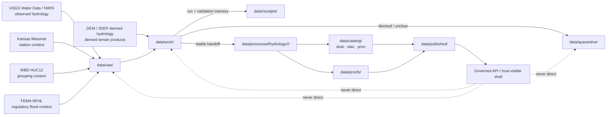

<!-- [KFM_META_BLOCK_V2]
doc_id: kfm://doc/NEEDS-VERIFICATION
title: data/processed/hydrology/
type: standard
version: v1
status: draft
owners: @bartytime4life
created: NEEDS-VERIFICATION
updated: NEEDS-VERIFICATION
policy_label: NEEDS-VERIFICATION
related: [../README.md, ../../README.md, ../../raw/README.md, ../../work/README.md, ../../quarantine/README.md, ../../catalog/README.md, ../../receipts/README.md, ../../proofs/README.md, ../../published/README.md, ./floodplain-kansas/README.md, ../../published/floodplain-kansas-v1/README.md, ../../../contracts/, ../../../schemas/, ../../../policy/, ../../../tests/, ../../../apps/, ../../../pipelines/]
tags: [kfm, data, processed, hydrology, readme]
notes: [Broad /data/ ownership is currently grounded at @bartytime4life; exact doc_id, dates, and policy label still need branch-history or project-metadata verification. Current public-main subtree is thin: this file is empty in visible public evidence, the only visible child is floodplain-kansas, and deeper emitted artifact inventories remain branch-side verification items.]
[/KFM_META_BLOCK_V2] -->

<a id="top"></a>

# `data/processed/hydrology/`

Theme-level guide for stable hydrology dataset versions inside KFM’s processed zone.

> **Status:** experimental  
> **Doc state:** draft  
> **Owners:** `@bartytime4life`  
> **Path target:** `data/processed/hydrology/README.md`  
> **Repo fit:** [processed parent](../README.md) → [catalog](../../catalog/README.md) · [receipts](../../receipts/README.md) · [proofs](../../proofs/README.md) → [published](../../published/README.md)  
> 
> 
> 
> 
> 
>   
> **Quick jumps:** [Scope](#scope) · [Repo fit](#repo-fit) · [Accepted inputs](#accepted-inputs) · [Exclusions](#exclusions) · [Current snapshot](#current-public-main-snapshot) · [Directory tree](#directory-tree) · [Quickstart](#quickstart) · [Usage](#usage) · [Diagram](#diagram) · [Tables](#tables) · [Task list](#task-list) · [FAQ](#faq) · [Appendix](#appendix)

> [!IMPORTANT]
> Hydrology is the strongest **first proof lane** in KFM doctrine, but this directory is still only a **processed-zone** surface. It is **not** the public edge, **not** the proof pack, and **not** the catalog by itself.

> [!NOTE]
> The current visible public subtree is intentionally small. Today this theme shows one checked-in child family, [`floodplain-kansas/`](./floodplain-kansas/README.md), with a visible `v1/` child below it. This README should therefore be strong on **theme boundary**, **current inventory**, and **review posture**, while staying weak on invented deeper artifact claims.

> [!CAUTION]
> Do not flatten all “water things” into one undifferentiated surface. KFM’s hydrology lane needs visible distinction between:
>
> - **observed measurements** and station context,
> - **watershed / grouping context**,
> - **regulatory flood context**,
> - **derived terrain / hydrology products**,
> - and **release-backed overlays**.

---

## Scope

`data/processed/hydrology/` is the **theme-level processed surface** for KFM hydrology.

It sits one level below the broader processed-zone guide and one level above individual hydrology dataset/version packs. Its job is to keep hydrology-specific grouping, source-role clarity, and version-pack expectations readable in GitHub without pretending that theme storage is itself publication or proof.

### What this README is for

This file should answer questions like these:

- What belongs in the hydrology theme under `data/processed/`?
- How should hydrology datasets differ from raw pulls, work-stage transforms, or published release scope?
- Which hydrology evidentiary classes should stay visibly distinct?
- What should a maintainer verify before documenting more depth than the branch actually proves?
- How should child hydrology packs relate to receipts, catalog closure, proof surfaces, and later publication?

### What this README is not for

This file is **not**:

- a source-specific ingest runbook,
- a watcher implementation guide,
- a schema registry,
- a policy bundle,
- a release proof pack,
- or a public API contract.

### Evidence posture used in this README

| Layer | Status | How to read it |
|---|---|---|
| Current public-main subtree shape | **CONFIRMED** | Safe to describe exactly what is visible today |
| Hydrology-first lane doctrine | **CONFIRMED doctrine** | Safe to treat as KFM design law from the attached corpus |
| Theme-level grouping role | **INFERRED** | Strong fit given the processed parent README and visible child pack |
| Broader hydrology family expansion | **PROPOSED** | Useful starter shape, but not current branch fact until rechecked |

[Back to top](#top)

---

## Repo fit

`data/processed/hydrology/` sits at the seam where KFM’s hydrology lane becomes **stable, inspectable dataset versions** instead of raw captures or in-progress work.

In practice, it should behave like a **theme parent** for child hydrology datasets, while remaining downstream of intake/QA lanes and upstream of catalog closure, proof attachment, and any materialized published scope.

### Path and adjacent surfaces

| Relation | Surface | Status | Why it matters |
|---|---|---:|---|
| Parent | [`../README.md`](../README.md) | **CONFIRMED** | Sets the processed-zone law for manifests, checksums, version packs, and release-adjacent discipline |
| Upstream lifecycle | [`../../raw/README.md`](../../raw/README.md) | **CONFIRMED** | Raw hydrology captures stay there, not here |
| Upstream lifecycle | [`../../work/README.md`](../../work/README.md) | **CONFIRMED** | Normalization, joins, QA, redaction, and repair stay there until stable |
| Upstream lifecycle | [`../../quarantine/README.md`](../../quarantine/README.md) | **CONFIRMED** | Rights-unclear, invalid, or blocked hydrology material must fail closed there |
| Adjacent closure | [`../../catalog/README.md`](../../catalog/README.md) | **CONFIRMED** | `STAC + DCAT + PROV` closure should resolve back to processed hydrology versions |
| Adjacent process memory | [`../../receipts/README.md`](../../receipts/README.md) | **CONFIRMED** | Run/validation memory should remain linkable from hydrology versions |
| Adjacent release evidence | [`../../proofs/README.md`](../../proofs/README.md) | **CONFIRMED** | Release manifests, attestations, and proof packs stay there conceptually |
| Adjacent outward scope | [`../../published/README.md`](../../published/README.md) | **CONFIRMED** | Publication is a governed state transition, not a synonym for “processed” |
| Child family | [`./floodplain-kansas/README.md`](./floodplain-kansas/README.md) | **CONFIRMED (path)** | Current visible child dataset family under this theme |
| Visible downstream sibling | [`../../published/floodplain-kansas-v1/README.md`](../../published/floodplain-kansas-v1/README.md) | **CONFIRMED (path)** | Shows that at least one hydrology-adjacent published companion already exists elsewhere in the tree |
| Shared authority | [`../../../contracts/`](../../../contracts/) · [`../../../schemas/`](../../../schemas/) · [`../../../policy/`](../../../policy/) | **CONFIRMED (paths) / INFERRED (roles)** | Contract shape, schema-home logic, and deny-by-default rules should stay upstream of this README |
| Consumers | [`../../../apps/`](../../../apps/) · [`../../../pipelines/`](../../../pipelines/) | **CONFIRMED (paths) / INFERRED (roles)** | Apps should consume governed outputs; pipelines should produce them |

### Repo-fit summary

| Question | Answer |
|---|---|
| What belongs here? | Stable hydrology dataset families and their version packs, plus theme-level guidance that helps maintainers keep those packs consistent and inspectable |
| What does **not** belong here? | Raw station/API pulls, half-finished transforms, blocked material, policy logic, schema ownership, or direct-public serving assumptions |
| What extra burden does hydrology add? | Clear separation between observed hydrology, watershed context, regulatory flood context, and derived terrain/hydrology outputs |
| What is the current visible public inventory? | A thin theme subtree centered on `floodplain-kansas/` |

[Back to top](#top)

---

## Accepted inputs

These are the kinds of artifacts that belong in or directly around this theme **when they are stable enough to count as processed**.

| Accepted input | Why it belongs here | Typical shape |
|---|---|---|
| Stable hydrology vector overlays | Many first-wave hydrology products are boundary or overlay shaped | GeoJSON, GeoParquet, GPKG, other release-safe vector formats |
| Stable hydrology rasters | Derived terrain and hydrology products often need raster delivery | GeoTIFF / COG or other governed raster formats |
| Stable time-series derivatives | Hydrology can include released summaries or processed station products | CSV, Parquet, compact tabular or time-series products |
| Dataset version folders | Hydrology products should version cleanly, not mutate silently | `data/processed/hydrology/<dataset>/<version>/` |
| `README.md` per version | Human-readable method, CRS, caveat, rights, and citation memory | One per dataset version |
| `manifest.json` | Machine-readable version inventory and identity surface | One per version pack |
| `SHA256SUMS.txt` | Integrity anchor for version contents | One per version pack |
| `LICENSE.txt` or rights note | Hydrology release scope still needs explicit rights posture | SPDX-compatible notice where possible |
| Receipt references | Process memory should stay reachable | Links or refs into `../../receipts/` |
| Catalog references | Processed versions should line up with outward closure | Links or refs into `../../catalog/` |
| Proof references | Release evidence should remain attachable and discoverable | Links or refs into `../../proofs/` |

### Hydrology-specific reading rule

A processed hydrology artifact should be understandable not only by **format**, but also by **evidentiary class**.

A good pack should make it obvious whether it is primarily:

- a **measurement-derived** product,
- a **watershed / grouping** product,
- a **regulatory overlay**,
- a **derived terrain / hydrology** product,
- or a **release-backed overlay or summary**.

[Back to top](#top)

---

## Exclusions

These do **not** belong in `data/processed/hydrology/` as the normal case.

| Exclusion | Put it under or behind | Why |
|---|---|---|
| Raw USGS, Mesonet, or other source-native payloads | [`../../raw/README.md`](../../raw/README.md) | Source-native captures should remain immutable and separately governed |
| In-progress joins, QA scratch outputs, reprojection work, sink filling, threshold tuning | [`../../work/README.md`](../../work/README.md) | `processed/` is not a hydrology scratchpad |
| Rights-unclear, policy-blocked, or invalid hydrology material | [`../../quarantine/README.md`](../../quarantine/README.md) | Fail closed before stabilizing blocked material |
| Central process memory | [`../../receipts/README.md`](../../receipts/README.md) | Receipts should stay queryable without being buried in version packs |
| Release manifests, proof packs, attestations, correction bundles | [`../../proofs/README.md`](../../proofs/README.md) | Release proof is stronger than processed storage |
| Materialized outward copies or release aliases | [`../../published/README.md`](../../published/README.md) | Publication is downstream of processed authority |
| Shared schema or vocabulary ownership | [`../../../contracts/`](../../../contracts/) · [`../../../schemas/`](../../../schemas/) | Keep contract authority singular |
| Executable policy logic | [`../../../policy/`](../../../policy/) | Policy should not fork into theme-local rules |
| Direct-public serving assumptions | governed APIs and trust-visible shell surfaces | Processed storage is not the trust membrane |
| “Real-time flood map” claims derived from regulatory context alone | downstream interpretation layers with explicit review | FEMA NFHL is a regulatory overlay, not a live inundation feed |

> [!CAUTION]
> A hydrology artifact can be beautifully packaged and still be wrong for this lane if it quietly collapses **measurement**, **context**, **regulation**, and **derivation** into one surface.

[Back to top](#top)

---

## Current public-main snapshot

This section is here to stop the README from drifting ahead of the branch.

| Topic | Current public-main fact | Status | Reading rule |
|---|---|---:|---|
| `data/processed/hydrology/` exists | Yes | **CONFIRMED** | Safe to treat as a live repo path |
| `data/processed/hydrology/README.md` exists | Yes | **CONFIRMED** | This target file is present |
| Current visible contents of `data/processed/hydrology/` | `README.md` and `floodplain-kansas/` | **CONFIRMED** | Do not imply additional checked-in child datasets without rechecking |
| `data/processed/hydrology/README.md` currently contains substantive content | No | **CONFIRMED** | Treat this task as filling an empty theme-level README |
| `data/processed/hydrology/floodplain-kansas/` exists | Yes | **CONFIRMED** | Current visible child family |
| `data/processed/hydrology/floodplain-kansas/README.md` exists | Yes | **CONFIRMED** | Child family README path exists |
| `data/processed/hydrology/floodplain-kansas/README.md` currently contains substantive content | No | **CONFIRMED** | Do not pretend the child family guide is already written |
| `data/processed/hydrology/floodplain-kansas/v1/` exists | Yes | **CONFIRMED** | Visible version anchor under the child family |
| `data/processed/hydrology/floodplain-kansas/v1/README.md` exists | Yes | **CONFIRMED** | Version-level README path exists |
| Checked-in manifests, checksums, rights notes, or artifact inventory under this hydrology theme | **UNKNOWN / NEEDS VERIFICATION** | — | Do not document them as emitted branch fact yet |
| Checked-in hydrology-specific `STAC + DCAT + PROV` payloads tied to this subtree | **UNKNOWN / NEEDS VERIFICATION** | — | Link the closure seam conceptually, but verify exact counterpart files before naming them as current fact |

[Back to top](#top)

---

## Directory tree

### Current public-main subtree

```text
data/processed/hydrology/
├── README.md
└── floodplain-kansas/
    ├── README.md
    └── v1/
        └── README.md
```

### Doctrine-aligned starter shape (`PROPOSED` / `NEEDS VERIFICATION`)

```text
data/processed/hydrology/
├── README.md
├── floodplain-kansas/
│   ├── README.md
│   └── v1/
│       ├── README.md
│       ├── manifest.json
│       ├── SHA256SUMS.txt
│       ├── LICENSE.txt
│       └── <artifacts...>
├── <watershed-or-huc12-dataset>/
│   └── <version>/
├── <gauge-or-timeseries-dataset>/
│   └── <version>/
└── <terrain-derivatives-dataset>/
    └── <version>/
```

> [!TIP]
> Prefer **one obvious hydrology version pack** over a theme folder full of mixed files. The human story and the machine story should converge on the same dataset/version identity.

[Back to top](#top)

---

## Quickstart

### 1) Inspect the live surface first

Before asserting more hydrology depth, inspect the current checkout.

```bash
find data/processed/hydrology -maxdepth 4 -print 2>/dev/null | sort
sed -n '1,220p' data/processed/README.md
sed -n '1,220p' data/published/README.md
sed -n '1,220p' data/published/floodplain-kansas-v1/README.md 2>/dev/null || true
```

### 2) Create or complete a child dataset family

Illustrative scaffold only:

```bash
mkdir -p data/processed/hydrology/<dataset>/<version>
touch data/processed/hydrology/<dataset>/README.md
touch data/processed/hydrology/<dataset>/<version>/README.md
touch data/processed/hydrology/<dataset>/<version>/manifest.json
touch data/processed/hydrology/<dataset>/<version>/SHA256SUMS.txt
touch data/processed/hydrology/<dataset>/<version>/LICENSE.txt
```

### 3) Write the version README before the pack drifts

A hydrology version README should answer, at minimum:

1. what the dataset version is,
2. which source families it derives from,
3. whether it is primarily observed, contextual, regulatory, or derived,
4. which CRS / vertical / temporal semantics matter,
5. which units matter,
6. which caveats or known limits apply,
7. what the rights posture is,
8. how to cite it,
9. where the linked `STAC + DCAT + PROV` objects live,
10. which receipt and proof surfaces should be checked next.

### 4) Close the outward loop before claiming release readiness

A hydrology version is much closer to done when all of these are true:

- the version pack has a manifest and checksums,
- source-role class is obvious,
- sibling `STAC + DCAT + PROV` closure resolves cleanly,
- receipt and proof references are discoverable,
- unresolved rights or quarantine issues are not being hidden downstream.

[Back to top](#top)

---

## Usage

### 1) Organize by hydrology dataset family, not by convenience

A floodplain overlay, a watershed boundary pack, a gauge-derived summary, and a terrain-derivative raster are all “hydrology,” but they are **not** the same evidentiary class and should not share one loose mixed directory.

### 2) Preserve source-role clarity

Make it easy for a reviewer to tell whether a product is built primarily from:

- **USGS Water Data / NWIS** style observation flows,
- **Kansas Mesonet** station context,
- **WBD HUC12** grouping context,
- **FEMA NFHL** regulatory context,
- or **derived terrain / hydrology** workflows.

### 3) Keep datum, units, and time semantics explicit

Hydrology breaks quietly when vertical references, CRS, support semantics, units, or time windows are hidden. Processed packs should surface those basics instead of assuming downstream readers already know them.

### 4) Version, do not overwrite

Treat this theme as a **versioned memory surface**. New hydrology outputs should normally create a new dataset version rather than silently rewriting a prior one in place.

### 5) Keep receipt, catalog, and proof seams visible

A good processed hydrology pack should point outward cleanly:

- back to **receipt / validation memory**,
- sideways to **catalog closure**,
- and forward to **release proof** or **published scope** when those exist.

### 6) Use hydrology to prove the trust path, not to widen scope carelessly

KFM treats hydrology as the smallest real lane that can prove receipts, catalogs, review, proof attachment, correction, and public-safe release. That makes this theme a proof field, not a generic dumping ground for anything water-adjacent.

[Back to top](#top)

---

## Diagram


```mermaid
flowchart LR
    U[USGS Water Data / NWIS<br/>observed hydrology] --> RAW[data/raw/]
    M[Kansas Mesonet<br/>station context] --> RAW
    W[WBD HUC12<br/>grouping context] --> RAW
    F[FEMA NFHL<br/>regulatory flood context] --> RAW
    D[DEM / 3DEP-derived hydrology<br/>derived terrain products] --> WORK[data/work/]

    RAW --> WORK
    WORK -->|blocked / unclear| Q[data/quarantine/]
    WORK -->|run + validation memory| R[data/receipts/]
    WORK -->|stable handoff| H[data/processed/hydrology/<dataset>/<version>/]

    H --> C[data/catalog/<br/>dcat · stac · prov]
    H --> P[data/proofs/]
    C --> PUB[data/published/]
    P --> PUB
    PUB --> API[Governed API / trust-visible shell]

    API -. never direct .-> WORK
    API -. never direct .-> RAW
    API -. never direct .-> Q
```

### Reading rule

The key distinction is not just left-to-right flow. It is **source-role and trust-role separation**:

- observation is not the same thing as context,
- context is not the same thing as regulation,
- regulation is not the same thing as derivation,
- and processed storage is not the same thing as outward publication.

[Back to top](#top)

---

## Tables

### Hydrology evidentiary class matrix

| Evidentiary class | Typical examples | What to keep explicit |
|---|---|---|
| Observed hydrology | USGS Water Data / NWIS measurements, station-derived summaries | observed variable, unit, time window, QC/support semantics |
| Kansas station context | Kansas Mesonet-derived environmental context | station role, cadence, local context, usage constraints |
| Watershed / grouping context | WBD HUC12 and similar basin-aware grouping layers | grouping role, not “measurement truth” |
| Regulatory flood context | FEMA NFHL overlays and related effective flood context | regulatory role, effective-date meaning, not real-time inundation |
| Derived terrain / hydrology products | DEM or 3DEP-derived flow, watershed, or terrain artifacts | derivation method, source vintage, vertical/CRS semantics |
| Release-backed overlays | public-safe hydrology overlays such as `floodplain-kansas` | release identity, linked receipts, catalog closure, proof refs |

### Current visible subtree summary

| Path | Current visible state | Why it matters |
|---|---|---|
| `data/processed/hydrology/README.md` | present, currently empty before this revision | theme-level guidance was missing |
| `data/processed/hydrology/floodplain-kansas/` | visible child family | current checked-in hydrology child |
| `data/processed/hydrology/floodplain-kansas/README.md` | present, currently empty | child family guide still needs follow-up |
| `data/processed/hydrology/floodplain-kansas/v1/` | visible version child | a version-shaped anchor already exists |
| `data/published/floodplain-kansas-v1/README.md` | visible published-side companion | useful downstream counterpart for release-backed wording |

### Theme-level review checklist

| Review question | Good answer |
|---|---|
| Is this artifact clearly processed rather than raw/work/quarantine? | Yes, its stability and scope are obvious |
| Is the hydrology source-role class obvious? | Yes, the product reads as observed, contextual, regulatory, derived, or release-backed |
| Does the version pack point to receipt / catalog / proof seams? | Yes, without duplicating their full logic |
| Does the pack hide unresolved policy or rights issues? | No |
| Would a reviewer confuse this folder with the public API or proof pack? | No |

[Back to top](#top)

---

## Task list

### Definition of done for this README

- [ ] Replace placeholder `doc_id`, `created`, `updated`, and `policy_label`.
- [ ] Recheck the live hydrology subtree before merging if the branch has changed.
- [ ] Confirm whether [`./floodplain-kansas/README.md`](./floodplain-kansas/README.md) and [`./floodplain-kansas/v1/README.md`](./floodplain-kansas/v1/README.md) should be populated next.
- [ ] Verify exact hydrology-specific `STAC + DCAT + PROV` counterpart paths before documenting them as current checked-in fact.
- [ ] Add the first real `manifest.json`, `SHA256SUMS.txt`, and rights note once the branch proves them.
- [ ] Keep hydrology source-role distinctions visible; do not flatten observation, context, regulation, and derivation.
- [ ] Keep release proof, attestation, and correction objects outside this theme unless they are only being linked.
- [ ] Do not imply live automation, emitted proof objects, or broader hydrology dataset families that the branch does not currently show.

### Review gates before documenting more hydrology depth

- [ ] one child hydrology dataset family is clearly named
- [ ] one version pack has a machine-readable inventory
- [ ] one version README explains CRS, units, temporal semantics, and caveats
- [ ] one receipt path and one proof or published counterpart can be resolved cleanly
- [ ] one catalog triplet is verified before being documented as current fact

[Back to top](#top)

---

## FAQ

### Why does hydrology need a theme README at all?

Because the current tree already has a hydrology theme directory with a child dataset family under it. A theme README should explain the **theme boundary** and point readers toward child packs and downstream trust surfaces.

### Does `floodplain-kansas/` prove that all hydrology families already exist?

No. It proves one checked-in child family is visible today. It does **not** prove broader checked-in gauge, HUC12, terrain-derivative, or groundwater inventories.

### Does “processed hydrology” mean “published hydrology”?

No. `processed/` is where stable dataset versions harden. `published/` is downstream and release-backed.

### Is FEMA NFHL the same thing as real-time flood extent?

No. In KFM terms it should stay visible as **regulatory flood context**, not a live inundation feed.

### Can apps or public surfaces read this folder directly?

They should not treat folder placement as the public contract. KFM’s doctrine keeps public and role-limited surfaces downstream of governed release, evidence, and API boundaries.

[Back to top](#top)

---

## Appendix

<details>
<summary><strong>PROPOSED starter naming patterns</strong></summary>

These patterns fit current doctrine, but they should still be rechecked against the active branch before becoming hard policy.

```text
data/processed/hydrology/
├── floodplain-kansas/
│   └── v1/
├── huc12/
│   └── <version>/
├── gauges/
│   └── <version>/
├── terrain-derivatives/
│   └── <version>/
└── soil-moisture/
    └── <version>/
```

A healthy first wave stays small and truthful:

- one release-backed overlay family,
- one watershed or grouping family,
- one gauge or time-series family,
- and only then broader terrain or soil-moisture expansion.

</details>

<details>
<summary><strong>Why this README stays conservative</strong></summary>

Hydrology is the first proof lane in KFM because it is rich enough to stress the whole governed path while still being comparatively public-safe. That does **not** justify pretending that every attractive hydrology sub-lane is already checked in.

This README is strongest when it helps maintainers say:

- **this is what the tree proves now,**
- **this is what doctrine clearly wants next,**
- **and this is what still needs verification before stronger claims should be merged.**

</details>
