<div align="center">

# 💧 Kansas Frontier Matrix — **Processed Hydrology Data**
`data/processed/hydrology/README.md`

**Purpose:**  
Official repository for **FAIR+CARE-certified hydrological datasets** derived from **USGS, EPA, KDHE, and Kansas DASC** sources.  
This layer contains harmonized, validated, and lineage-certified datasets supporting water-resource management, groundwater modeling, and sustainable hydrological research, with **Focus Mode v2** analytics and explainability.

[](../../../docs/architecture/README.md)
[](../../../docs/standards/faircare-validation.md)
[]()
[]()
[](../../../LICENSE)

</div>

---

## 📘 Overview

The **Processed Hydrology Layer** provides **finalized, schema-validated, checksum-verified** datasets ready for open access and analytical use.  
Each dataset here is **provenance-registered** (append-only governance ledger), **FAIR+CARE-audited**, and **STAC/DCAT 3.0** catalog-ready for interoperable discovery.

**v10 Upgrades**
- **Streaming STAC** registration supported where sources provide near-real-time feeds.  
- **Focus Mode v2** alignment: explainability overlays, citations, and CARE ethics flags.  
- **Telemetry v2**: energy/CO₂ and validation coverage exported per release.

### Core Objectives
- Publish **canonical** hydrology datasets for public and programmatic use.  
- Enforce **schema, checksum, and FAIR+CARE** validation with governance logs.  
- Maintain **provenance & lineage** across raw → staging → processed transitions.  
- Enable **AI/Focus Mode v2** water-systems analytics and explainability.

---

## 🗂️ Directory Layout

```plaintext
data/processed/hydrology/
├── README.md                              # This document
├── hydrology_summary_v10.0.0.parquet      # Aggregated statewide hydrological indicators
├── groundwater_trends_v10.0.0.csv         # Annual groundwater level & anomaly records (station-level)
├── watershed_boundaries_v10.0.0.geojson   # Final watershed boundary dataset (HUC levels)
├── aquifer_health_index_v10.0.0.csv       # FAIR+CARE-certified aquifer sustainability index
├── streamflow_annual_stats_v10.0.0.csv    # Derived streamflow statistics (percentiles/thresholds)
├── metadata.json                          # STAC/DCAT/ISO 19115 metadata + FAIR+CARE certification
└── stac_collection.json                   # STAC 1.0 collection for processed hydrology datasets
```

---

## 🧭 Data Summary

| Dataset                    | Records | Source                     | Schema                           | Status        | License  |
|---------------------------|--------:|----------------------------|-----------------------------------|---------------|----------|
| Hydrology Summary         | 44,106  | USGS, EPA, KDHE            | `hydrology_summary_v3.1.0`        | ✅ Certified   | CC-BY 4.0 |
| Groundwater Trends        | 13,284  | KDHE, USGS                 | `groundwater_trends_v3.2.0`       | ✅ Certified   | CC-BY 4.0 |
| Watershed Boundaries      | 1,221   | EPA WBD, DASC              | `watershed_boundaries_v3.1.0`     | ✅ Certified   | CC-BY 4.0 |
| Aquifer Health Index      | 8,742   | KDHE, EPA                  | `aquifer_health_index_v3.1.0`     | ✅ Certified   | CC-BY 4.0 |
| Streamflow Statistics     | 7,018   | USGS NWIS                  | `streamflow_stats_v3.1.0`         | ✅ Certified   | CC-BY 4.0 |

> **Note:** All files are **SHA-256 checksum-verified** and **registered** in the KFM Governance Ledger.

---

## ⚙️ Processed Hydrology Workflow

```mermaid
flowchart TD
    A["Staging Layer (data/work/staging/hydrology/*)"] --> B["FAIR+CARE Validation & Ethics Certification"]
    B --> C["Schema Alignment (JSON Schema · ISO 19115)"]
    C --> D["Checksum Verification (SHA-256) & Ledger Logging"]
    D --> E["Publication to Processed Layer (data/processed/hydrology/*)"]
    E --> F["STAC/DCAT Catalog Sync + Streaming STAC + Focus Mode v2 Enablement"]
```



### Validation & Governance Artifacts
- **Schema Validation:** `data/reports/validation/schema_validation_summary.json`  
- **Checksums:** `data/processed/metadata/checksums_hydrology_v10.0.0.json`  
- **FAIR+CARE Certification:** `data/reports/fair/data_care_assessment.json`  
- **Provenance Ledger:** `data/reports/audit/data_provenance_ledger.json`  
- **SBOM & Manifest:** `releases/v10.0.0/sbom.spdx.json`, `releases/v10.0.0/manifest.zip`

---

## 🧩 Example Processed Metadata Record

```json
{
  "id": "processed_hydrology_summary_v10.0.0",
  "domain": "hydrology",
  "source_stage": "data/work/staging/hydrology/",
  "records_total": 44106,
  "schema_version": "v3.1.0",
  "fairstatus": "certified",
  "checksum_sha256": "sha256:7e4d9f8b13e2a9c1d5f4b6e9c2d8f1e7a3b9d2a4c6f7b8e3d9a1b7f5e2c3d8a4",
  "governance_ref": "data/reports/audit/data_provenance_ledger.json",
  "validator": "@kfm-hydro-lab",
  "license": "CC-BY 4.0",
  "created": "2025-11-09T21:40:00Z"
}
```

---

## 🧠 FAIR+CARE Certification Matrix

| Principle | Implementation | Oversight |
|-----------|----------------|-----------|
| **Findable** | STAC/DCAT indexing; persistent IDs per dataset/version. | `@kfm-data` |
| **Accessible** | CC-BY 4.0; bulk & API download endpoints. | `@kfm-accessibility` |
| **Interoperable** | ISO 19115 & DCAT 3.0 compliant metadata; STAC 1.0. | `@kfm-architecture` |
| **Reusable** | Full provenance, schema, and checksum metadata. | `@kfm-design` |
| **Collective Benefit** | Supports sustainable water policy & research. | `@faircare-council` |
| **Authority to Control** | FAIR+CARE Council approves releases. | `@kfm-governance` |
| **Responsibility** | Data stewards maintain QA and checksum integrity. | `@kfm-security` |
| **Ethics** | Sensitive well/site privacy protected via aggregation/anonymization. | `@kfm-ethics` |

---

## ⚙️ Validation & Catalog Publication

| Step | Description | Output |
|------|-------------|--------|
| **Schema Validation** | Structural conformance checks. | `schema_validation_summary.json` |
| **Checksum Verification** | Integrity & reproducibility proof. | `checksums_hydrology_v10.0.0.json` |
| **FAIR+CARE Audit** | Ethics & accessibility certification. | `faircare_certification_report.json` |
| **Ledger Sync** | Append-only provenance entries. | `data_provenance_ledger.json` |
| **STAC/DCAT Registration** | Catalog inclusion for discovery. | `stac_collection.json` |

> Governance automation: `hydrology_processed_sync.yml`

---

## 📊 Example Checksum Record

```json
{
  "file": "groundwater_trends_v10.0.0.csv",
  "checksum_sha256": "sha256:2b1e8f3d7c4a9e2f6a7d1b3c9f2e8a4b5c3d7e1a6b9f4d2e3a5c1b7e8a9f6d4c",
  "validated": true,
  "verified_on": "2025-11-09T21:43:00Z",
  "ledger_ref": "data/reports/audit/data_provenance_ledger.json"
}
```

---

## ♻️ Retention & Sustainability

| Data Type | Retention | Policy |
|-----------|-----------|--------|
| Processed Hydrology Datasets | Permanent | Canonical datasets under CC-BY 4.0. |
| FAIR+CARE Reports | Permanent | Retained for governance & reproducibility. |
| Checksum Records | Permanent | Stored in registry & cross-verified each release. |
| Metadata & Lineage | Permanent | Preserved per ISO 19115 lineage protocols. |
| Logs | 365 Days | Rotated annually per compliance policy. |

**Telemetry:** `releases/v10.0.0/focus-telemetry.json`

---

## 🧾 Internal Use Citation

```text
Kansas Frontier Matrix (2025). Processed Hydrology Data (v10.0.0).
Final FAIR+CARE-certified hydrological datasets integrating USGS, EPA, KDHE, and DASC sources.
Checksum-verified, schema-aligned, and governance-certified for public use and Focus Mode v2 hydrological modeling.
```

---

## 🕰️ Version History

| Version | Date       | Author        | Summary                                                                 |
|---------|------------|---------------|-------------------------------------------------------------------------|
| v10.0.0 | 2025-11-09 | `@kfm-hydro`  | Upgraded to v10: Streaming STAC support, Focus v2 enablement, telemetry/schema v2, governance paths updated. |
| v9.7.0  | 2025-11-06 | `@kfm-hydro`  | Telemetry/schema refs added; paths & badges hardened.                   |
| v9.6.0  | 2025-11-03 | `@kfm-hydro`  | Added aquifer health index and summary certification integration.       |
| v9.5.0  | 2025-11-02 | `@kfm-governance` | Included checksum manifest and provenance ledger automation.         |

---

<div align="center">

**Kansas Frontier Matrix**  
*Water Intelligence × FAIR+CARE Governance × Provenance Assurance*  
© 2025 Kansas Frontier Matrix — CC-BY 4.0 · Diamond⁹ Ω / Crown∞Ω Ultimate Certified  

[Back to Data Index](../README.md) · [Governance Charter](../../../docs/standards/governance/DATA-GOVERNANCE.md)

</div>