<div align="center">

# 💧 Kansas Frontier Matrix — Processed Hydrology Checksums  
`data/processed/hydrology/checksums/`

**Mission:** Store and maintain **checksum manifests (`.sha256`)** verifying the integrity of all processed hydrology datasets —  
sink-filled DEMs, flow direction and accumulation grids, and water masks — ensuring **accuracy, reproducibility,**  
and **provenance integrity** throughout the Kansas Frontier Matrix (KFM) hydrologic modeling system.

[](../../../../.github/workflows/site.yml)
[](../../../../.github/workflows/stac-validate.yml)
[](../../../../.github/workflows/codeql.yml)
[](../../../../.github/workflows/trivy.yml)
[](../../../../docs/)
[](../../../../LICENSE)
[](../../../../LICENSE)

</div>

---

**Version:** v1.1.0  
**Status:** Stable  
**Last updated:** 2025-10-11  

> Each `.sha256` file serves as a **cryptographic fingerprint** that binds every processed hydrology raster or vector dataset  
> to its MCP provenance chain, STAC metadata, and automated CI validation.

---

## 📚 Table of Contents
- [Overview](#-overview)
- [Purpose](#-purpose)
- [Directory Layout](#-directory-layout)
- [Checksum Standards](#-checksum-standards)
- [Verification Workflow](#-verification-workflow)
- [Integration with MCP & STAC](#-integration-with-mcp--stac)
- [Data Flow](#-data-flow)
- [Adding or Updating Checksums](#-adding-or-updating-checksums)
- [Version History](#-version-history)
- [References](#-references)

---

## 🧠 Overview
This folder contains **SHA-256 checksum files** for all processed hydrology datasets stored in  
`data/processed/hydrology/`. These ensure data authenticity for sink-filled DEMs, D8 flow rasters,  
accumulation grids, and water masks — foundational surfaces for flood modeling and watershed analysis.

Checksums establish **immutable provenance** between:
- physical files (`.tif`, `.geojson`)  
- metadata (`data/processed/hydrology/metadata/*.json`)  
- STAC catalog items (`data/stac/hydrology/`)

---

## 🎯 Purpose

| Goal | Description |
|:------|:-------------|
| **Integrity** | Detect corruption or alteration in hydrology datasets |
| **Reproducibility** | Guarantee regenerated data matches stored fingerprints |
| **Automation** | Enable CI/CD validation via `make validate-hydro` |
| **Provenance** | Link physical datasets with MCP & STAC metadata |

---

## 🧱 Directory Layout

```bash
data/
└── processed/
    └── hydrology/
        └── checksums/
            ├── dem_filled_1m_ks.tif.sha256
            ├── flow_dir_d8_1m_ks.tif.sha256
            ├── flow_accum_base_1m_ks.tif.sha256
            ├── watermask_ks.tif.sha256
            ├── stream_seed_points.geojson.sha256
            └── README.md
````

Each `.sha256` file corresponds **1:1** with a processed artifact and contains a hash in GNU format:

```text
2ef54c72b13c6a4e9c1acdb3b3e2dfae4d6cfbe85c51b38e9d1e278c66a4ff4a  flow_dir_d8_1m_ks.tif
```

---

## 🧩 Checksum Standards

| Parameter     | Specification                                    |
| :------------ | :----------------------------------------------- |
| **Algorithm** | SHA-256 (256-bit secure hash)                    |
| **Format**    | `<hash>  <filename>` (GNU `sha256sum` style)     |
| **Encoding**  | Binary (`--binary`) for cross-platform stability |
| **Purpose**   | Immutable file identity for MCP/STAC provenance  |

Each hash provides a **unique digital signature** per dataset version.

---

## 🔍 Verification Workflow

**Manual Verification**

```bash
# Verify one dataset
sha256sum -c data/processed/hydrology/checksums/flow_dir_d8_1m_ks.tif.sha256

# Verify all checksums
find data/processed/hydrology/checksums -name "*.sha256" -exec sha256sum -c {} \;
```

Expected output:

```
flow_dir_d8_1m_ks.tif: OK
watermask_ks.tif: OK
```

Failure output:

```
dem_filled_1m_ks.tif: FAILED
sha256sum: WARNING: 1 computed checksum did NOT match
```

**CI/CD Validation**

Checksum integrity is automatically verified by
`.github/workflows/stac-validate.yml` on each PR or merge.

---

## 🌐 Integration with MCP & STAC

Checksums bridge the **file**, **metadata**, and **catalog** layers.

1. **MCP Provenance**

   ```json
   "mcp_provenance": "sha256:2ef54c72b13c6a4e9c1acdb3b3e2dfae4d6cfbe85c51b38e9d1e278c66a4ff4a"
   ```

   → recorded in the dataset’s metadata JSON.

2. **STAC Catalog**

   ```json
   "checksum": {
     "href": "../checksums/flow_dir_d8_1m_ks.tif.sha256",
     "type": "text/plain",
     "roles": ["metadata"]
   }
   ```

   → embedded in STAC Items under `data/stac/hydrology/`.

Together they form a **cross-verifiable data provenance system**.

---

## 🧭 Data Flow

```mermaid
flowchart TD
  A["Processed Hydrology Datasets\n(COG · GeoJSON)"] --> B["Checksum Generation\n(sha256sum / ETL)"]
  B --> C["Checksum Files\n(.sha256)"]
  C --> D["Metadata JSON\n(mcp_provenance field)"]
  D --> E["STAC Items\n(checksum assets)"]
  E --> F["CI Validation\n(stac-validate.yml)"]
  F --> G["Verified Provenance Ledger\n(MCP Chain)"]
```



% END OF MERMAID %

---

## ⚙️ Adding or Updating Checksums

1. **Generate checksum**

   ```bash
   sha256sum <dataset> > data/processed/hydrology/checksums/<dataset>.sha256
   ```
2. **Validate locally**

   ```bash
   sha256sum -c data/processed/hydrology/checksums/<dataset>.sha256
   ```
3. **Update metadata**
   Add the new hash under `mcp_provenance` in
   `data/processed/hydrology/metadata/<dataset>.json`.
4. **Validate repository**

   ```bash
   make validate-hydro
   ```
5. **Commit & push**
   Include both dataset + checksum file → PR triggers CI validation.

---

## 🧠 MCP Compliance Summary

| MCP Principle           | Implementation                                 |
| :---------------------- | :--------------------------------------------- |
| **Documentation-first** | Checksums tracked beside each dataset          |
| **Reproducibility**     | Deterministic SHA-256 algorithm                |
| **Open Standards**      | GNU Coreutils checksum format                  |
| **Provenance**          | Linked through metadata + STAC checksum assets |
| **Auditability**        | CI-verified during every commit                |

---

## 📅 Version History

| Version    | Date       | Summary                                                             |
| :--------- | :--------- | :------------------------------------------------------------------ |
| **v1.1.0** | 2025-10-11 | Added Mermaid data-flow, MCP table, CI integration details          |
| **v1.0.0** | 2025-10-04 | Initial checksum documentation (DEM, D8, accumulation, mask, seeds) |

---

## 📖 References

* **WhiteboxTools Hydrology:** [https://www.whiteboxgeo.com/manual/wbt_book/hydro.html](https://www.whiteboxgeo.com/manual/wbt_book/hydro.html)
* **GDAL DEM Tools:** [https://gdal.org/programs/gdaldem.html](https://gdal.org/programs/gdaldem.html)
* **USGS NHD:** [https://www.usgs.gov/national-hydrography](https://www.usgs.gov/national-hydrography)
* **Kansas DASC Hub:** [https://hub.kansasgis.org](https://hub.kansasgis.org)
* **STAC 1.0:** [https://stacspec.org](https://stacspec.org)
* **GNU Coreutils (`sha256sum`):** [https://www.gnu.org/software/coreutils/manual/html_node/sha2-utilities.html](https://www.gnu.org/software/coreutils/manual/html_node/sha2-utilities.html)
* **MCP Docs:** `../../../../docs/standards/`

---

<div align="center">

*“Every flowline and basin boundary is secured — these checksums protect the hydrologic truth of Kansas’s terrain.”*
📍 [`data/processed/hydrology/checksums/`](.)

</div>
```
