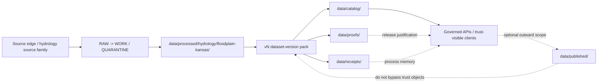

<a id="top"></a>

# `floodplain-kansas`

Repo-facing landing page for processed Kansas floodplain dataset versions and their governed handoff toward receipts, catalogs, proofs, and publication.

> [!IMPORTANT]
> **Status:** `experimental`  
> **Owners:** `@bartytime4life` *(current public `/data/` CODEOWNERS coverage; finer-grained family ownership still needs verification)*  
> **Path:** `data/processed/hydrology/floodplain-kansas/README.md`  
> **Repo fit:** family landing page under [`../README.md`](../README.md) and [`../../README.md`](../../README.md); downstream of source intake and work/quarantine; upstream of [`../../../catalog/README.md`](../../../catalog/README.md), [`../../../receipts/README.md`](../../../receipts/README.md), [`../../../proofs/README.md`](../../../proofs/README.md), and [`../../../published/README.md`](../../../published/README.md)  
> **Quick jumps:** [Scope](#scope) · [Repo fit](#repo-fit) · [Current evidence snapshot](#current-evidence-snapshot) · [Accepted inputs](#accepted-inputs) · [Exclusions](#exclusions) · [Directory tree](#directory-tree) · [Quickstart](#quickstart) · [Usage](#usage) · [Diagram](#diagram) · [Reference tables](#reference-tables) · [Task list](#task-list) · [FAQ](#faq) · [Appendix](#appendix)


> [!NOTE]
> This directory is a **processed family surface**, not a source-native floodplain authority and not a public release surface by itself.
>
> In KFM terms, processed material should stay visibly distinct from:
>
> - source-native capture,
> - run-memory receipts,
> - outward catalog closure,
> - release-significant proofs,
> - and optional publication materialization.

---

## Scope

This README explains what belongs in `data/processed/hydrology/floodplain-kansas/` and what does not.

Its job is to keep the family-level role clear even when the mounted branch is still thin. In the strongest version of this lane, this directory becomes the stable landing surface for one or more processed floodplain dataset versions under hydrology. In the currently visible public tree, the family exists, but the richer version-pack contents are not yet publicly proven here.

This file therefore does two things at once:

1. records what is **currently safe to say** about the mounted path, and
2. preserves the **corpus-grounded target shape** without pretending it is already present in the branch.

[Back to top](#top)

---

## Repo fit

KFM’s data doctrine keeps lifecycle zones explicit:

`Source edge → RAW → WORK / QUARANTINE → PROCESSED → CATALOG → PUBLISHED`

This folder sits in the **PROCESSED** zone. That means it should hold stable, reviewable, machine-usable dataset versions after raw acquisition and work/quarantine transforms, but before outward trust widens through catalog closure, release proof, or publication.

### Upstream of this folder

- source-specific acquisition and source-descriptor work
- deterministic transforms, repairs, joins, reprojection, redaction, and QA
- policy-bearing work/quarantine decisions

### This folder’s core job

- hold processed family structure for `floodplain-kansas`
- organize version subfolders such as `v1/`
- give maintainers one family-level entry point before they descend into version-specific detail

### Downstream of this folder

- catalog closure in `STAC + DCAT + PROV`
- run-memory receipts
- release-significant proof packs, attestations, and rollback traces
- optional published materialization or governed API exposure

> [!TIP]
> Treat this README as the **family map**, not the final evidence object.
>
> If `v1/` becomes real in the mounted branch, the version README should carry version-specific method, CRS, freshness, extent, caveats, and object links, while this file stays stable at the family level.

---

## Current evidence snapshot

| Claim | Status | Reading rule |
|---|---|---|
| `data/processed/hydrology/floodplain-kansas/` exists in the current public tree | **CONFIRMED** | Safe to describe as a real family path |
| `v1/` exists directly under this family path | **CONFIRMED** | Safe to describe as the only currently visible child version |
| Publicly visible contents under both this README and `v1/README.md` are still thin | **CONFIRMED** | Do not invent manifest, asset, receipt, or proof files as current branch fact |
| Hydrology is the preferred first proof lane in KFM | **CONFIRMED** | Safe to frame this family as hydrology-first doctrine, not as mounted implementation depth |
| A richer `floodplain-kansas__v1` thin-slice object family exists in the April 2026 corpus packets | **CONFIRMED in corpus / NEEDS VERIFICATION in branch** | Safe to use as supporting target shape, not as current public-main proof |
| This directory is not the publication edge | **CONFIRMED** | Keep processed, catalog, proof, and published surfaces distinct |

> [!IMPORTANT]
> The April 2026 floodplain packet family carries **two neighboring shapes**:
>
> - an earlier **overlay-oriented** work/proof layout, and
> - a newer **processed hydrology dataset-version** layout.
>
> This README follows the mounted repo path it was asked to serve and treats the packet family as supporting doctrine and target shape, not as a silent override of current branch reality.

---

## Accepted inputs

The following belong here once they are actually emitted and reviewable:

- version subdirectories such as `v1/`, `v2/`, or other clearly versioned processed slices
- stable processed artifacts whose method and support can be described honestly
- version manifests and checksums
- version-level README files
- relative links to receipts, catalog triplets, and proof packs
- family-level notes that explain how this dataset family fits the hydrology lane

Illustrative processed-version artifacts that would fit here include:

- GeoJSON or GeoParquet floodplain geometry
- summary JSON with extent, freshness, and integrity echoes
- digest-bearing manifests
- version-local human guidance that points outward to stronger trust objects

---

## Exclusions

| Exclusion | Put it under / behind | Why |
|---|---|---|
| Source-native floodplain capture or regulatory source descriptors | source-descriptor docs, RAW, or domain/source atlases | source truth and processed truth are not the same thing |
| Scratch transforms, repair notebooks, ad hoc joins, or unresolved geometry fixes | `WORK/` or `QUARANTINE/` | processed surfaces should already be stable and reviewable |
| Run-memory receipts as sovereign truth | `data/receipts/` | receipts preserve process memory, not release proof |
| Release-significant manifests, DSSE bundles, rollback artifacts, or proof packs | `data/proofs/` | proof should remain inspectable and separate |
| Outward catalog records | `data/catalog/` | discoverability and lineage closure deserve their own surfaces |
| Public-facing materialization or “what users see” | `data/published/` or governed APIs | processed is not the public edge |
| Real-time alerts, observed inundation, emergency warning, or hydraulic simulation claims | hazard or runtime surfaces with their own contracts | a floodplain layer must not be mistaken for an operational alert surface |

> [!WARNING]
> Do **not** let this README imply that a processed floodplain family is:
>
> - the authoritative floodplain source,
> - a live flood extent,
> - a forecast,
> - or an automatically publishable dataset.

[Back to top](#top)

---

## Directory tree

### Current public-tree snapshot (`CONFIRMED`)

```text
data/processed/hydrology/floodplain-kansas/
├── README.md
└── v1/
    └── README.md
```

### Corpus-grounded thin-slice target (`NEEDS VERIFICATION` in mounted branch)

```text
data/processed/hydrology/floodplain-kansas/
└── v1/
    ├── README.md
    ├── manifest.json
    └── assets/
        ├── floodplain-kansas.geojson
        └── floodplain-kansas-summary.json

data/receipts/runs/
└── run-2026-04-14-floodplain-kansas-v1.json

data/catalog/
├── stac/items/floodplain-kansas__v1.json
├── dcat/datasets/floodplain-kansas__v1.jsonld
└── prov/floodplain-kansas__v1.prov.json

data/proofs/releases/floodplain-kansas-v1/
├── decision.json
├── promotion-record.json
├── release-manifest.json
└── release-proof-pack.json
```

<details>
<summary><strong>Why show both trees?</strong></summary>

The mounted public tree is still minimal, so this README separates:

- what the branch visibly proves right now, and
- what the April 2026 packet family suggests as the intended first hydrology floodplain slice.

That split keeps the document helpful without laundering proposal into fact.

</details>

[Back to top](#top)

---

## Quickstart

Use this verification-first loop before treating this family as more mature than the branch proves.

### 1) Inspect the mounted family surface

```bash
find data/processed/hydrology/floodplain-kansas -maxdepth 3 -print 2>/dev/null | sort
```

### 2) Read the currently visible family and version docs

```bash
sed -n '1,200p' data/processed/hydrology/floodplain-kansas/README.md
sed -n '1,200p' data/processed/hydrology/floodplain-kansas/v1/README.md
```

### 3) Recheck whether the corpus-grounded thin-slice files exist in the active branch

```bash
for p in \
  data/processed/hydrology/floodplain-kansas/v1/manifest.json \
  data/processed/hydrology/floodplain-kansas/v1/assets/floodplain-kansas.geojson \
  data/processed/hydrology/floodplain-kansas/v1/assets/floodplain-kansas-summary.json \
  data/receipts/runs/run-2026-04-14-floodplain-kansas-v1.json \
  data/catalog/stac/items/floodplain-kansas__v1.json \
  data/catalog/dcat/datasets/floodplain-kansas__v1.jsonld \
  data/catalog/prov/floodplain-kansas__v1.prov.json \
  data/proofs/releases/floodplain-kansas-v1/release-proof-pack.json
do
  if [ -e "$p" ]; then
    echo "FOUND  $p"
  else
    echo "MISSING $p"
  fi
done
```

### 4) Downgrade any claim the branch cannot prove

If checkout evidence is thinner than this README suggests:

- keep the family-level doctrine,
- narrow the concrete path claims,
- and leave uncertainty visible.

If checkout evidence is richer:

- promote branch-proven facts into the version README,
- add exact relative links,
- and reduce `NEEDS VERIFICATION` language accordingly.

---

## Usage

### How maintainers should use this file

Use this README as the **family-level landing page** for:

- what `floodplain-kansas` is inside the hydrology lane
- which version folders exist
- which trust surfaces a version is expected to connect to
- which claims are current-branch fact versus corpus-grounded target shape

### How version folders should differ from this file

Use `./v1/README.md` for details that are too specific for the family layer, such as:

- exact manifest path
- exact artifact inventory
- CRS and geometry support
- bbox and freshness values
- source-role summary
- caveats, correction notices, and rollback pointers

### Reader contract

A reader should be able to answer these questions from this file without being misled:

1. **What is this directory for?**
2. **What does the branch visibly prove right now?**
3. **Where do stronger trust objects live if the version pack exists?**

> [!NOTE]
> This file is most useful when it stays calm and stable.
>
> Let version-specific churn happen under `v1/`, `v2/`, and adjacent receipt/catalog/proof surfaces rather than rewriting the family landing page for every small change.

[Back to top](#top)

---

## Diagram



> [!TIP]
> The critical split is the same one repeated throughout KFM:
>
> - **processed** holds stable version artifacts,
> - **catalog** explains them outwardly,
> - **receipts** remember how steps happened,
> - **proofs** justify release-significant trust,
> - and **published** is optional downstream materialization, not the act that created truth.

[Back to top](#top)

---

## Reference tables

### Family posture

| Question | Best current answer | Status |
|---|---|---:|
| What family is this? | A processed hydrology family named `floodplain-kansas` | **CONFIRMED** |
| What child version is currently visible? | `v1/` | **CONFIRMED** |
| Are version artifacts beyond README files currently public-main proven here? | Not from the visible branch evidence inspected for this pass | **UNKNOWN / NEEDS VERIFICATION** |
| What is the strongest corpus-grounded thin-slice target? | `manifest.json` + processed assets + `run_receipt` + `STAC/DCAT/PROV` + release proof pack | **CONFIRMED in corpus / NEEDS VERIFICATION in branch** |
| Is this a public release surface? | No. This is a processed family surface | **CONFIRMED** |
| Why does this family matter? | Hydrology is the first proof lane, and flood-context geometry is part of that lane’s public-safe, map-legible thin-slice space | **CONFIRMED doctrine** |

### Trust-surface split

| Surface | Primary job | Must not be confused with |
|---|---|---|
| `data/processed/.../vN/` | stable derived artifact set | source-native truth or public release |
| `data/receipts/` | process memory and replay context | proof, catalog closure, or publication |
| `data/catalog/` | discoverability and lineage closure | process memory or release proof |
| `data/proofs/` | release-significant evidence and rollback trace | run receipts or storage materialization |
| `data/published/` | optional outward materialization | the act that created trust |

### Interpretation guardrails

| Risk | Guardrail |
|---|---|
| A processed floodplain family gets read as emergency warning | keep alert, forecast, and observed inundation language out of this surface |
| A version pack gets treated as source-native legal authority | keep source-role notes explicit and point outward to stronger source descriptors where they exist |
| Receipts, catalogs, and proofs get flattened into one README | keep links outward; do not turn this file into a catch-all trust object |
| A packet example gets mistaken for mounted branch fact | mark corpus-grounded target shapes as `NEEDS VERIFICATION` until checkout proves them |

[Back to top](#top)

---

## Task list

- [ ] Verify whether `v1/` contains anything beyond `README.md`
- [ ] Add a version README that names exact artifacts and support fields
- [ ] Add or verify `manifest.json` if the version pack exists
- [ ] Add relative links to receipt, `STAC`, `DCAT`, `PROV`, and proof surfaces
- [ ] State backing source-role and rights posture once the version pack is mounted
- [ ] Add correction / rollback pointers if the release lane is present
- [ ] Keep this family README stable as more versions appear

---

## FAQ

### Does this README prove that `v1/manifest.json` already exists?

No. The currently visible public tree proves the family folder and `v1/` folder exist, but not the richer version-pack files.

### Is this the authoritative floodplain source?

No. This is a processed family landing page. Source-native authority, catalog closure, and release proof are adjacent trust surfaces.

### Is this a real-time flood extent, warning feed, or model output?

No. Nothing in this file should let a reader confuse a processed floodplain family with live emergency signaling or predictive simulation.

### Why keep `v1/README.md` separate from this family README?

Because the family layer should stay stable while version-level facts, assets, CRS details, freshness, and corrections can change more frequently.

### What should be added first if the branch turns out to contain the real thin slice?

The most useful first additions are:

1. exact version-manifest and asset links,
2. one receipt reference,
3. one `STAC/DCAT/PROV` triplet reference,
4. and one proof or correction pointer.

[Back to top](#top)

---

## Appendix

<details>
<summary><strong>Corpus-grounded thin-slice identifiers worth rechecking in the active branch</strong></summary>

```text
dataset_id: floodplain-kansas
dataset_version_id: floodplain-kansas__v1
release_id: floodplain-kansas-v1

processed target:
  data/processed/hydrology/floodplain-kansas/v1/manifest.json
  data/processed/hydrology/floodplain-kansas/v1/assets/floodplain-kansas.geojson
  data/processed/hydrology/floodplain-kansas/v1/assets/floodplain-kansas-summary.json

receipt target:
  data/receipts/runs/run-2026-04-14-floodplain-kansas-v1.json

catalog targets:
  data/catalog/stac/items/floodplain-kansas__v1.json
  data/catalog/dcat/datasets/floodplain-kansas__v1.jsonld
  data/catalog/prov/floodplain-kansas__v1.prov.json

proof targets:
  data/proofs/releases/floodplain-kansas-v1/decision.json
  data/proofs/releases/floodplain-kansas-v1/promotion-record.json
  data/proofs/releases/floodplain-kansas-v1/release-manifest.json
  data/proofs/releases/floodplain-kansas-v1/release-proof-pack.json
```

These identifiers are useful because they recur coherently across the April 2026 thin-slice packet family, but they are still branch-check items from the perspective of this README.

</details>

<details>
<summary><strong>Family-versus-version rule of thumb</strong></summary>

Use this README to answer:

- what the family is,
- where versions should live,
- and where stronger trust objects belong.

Use `v1/README.md` to answer:

- what exactly shipped in that version,
- what CRS, support, and freshness apply,
- and which receipt/catalog/proof objects resolve the claim.

</details>
