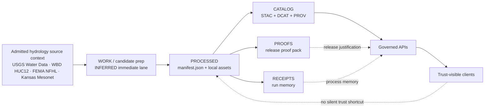

<!-- [KFM_META_BLOCK_V2]
doc_id: kfm://doc/NEEDS-VERIFICATION-floodplain-kansas__v1-processed-readme
title: Floodplain Kansas v1
type: standard
version: v1
status: draft
owners: NEEDS VERIFICATION
created: YYYY-MM-DD
updated: YYYY-MM-DD
policy_label: public
related: [./manifest.json, ./assets/floodplain-kansas.geojson, ./assets/floodplain-kansas-summary.json, ../../../../receipts/runs/run-2026-04-14-floodplain-kansas-v1.json, ../../../../catalog/stac/items/floodplain-kansas__v1.json, ../../../../catalog/dcat/datasets/floodplain-kansas__v1.jsonld, ../../../../catalog/prov/floodplain-kansas__v1.prov.json, ../../../../proofs/releases/floodplain-kansas-v1/release-proof-pack.json, <INFERRED: ../../../../work/overlays/floodplain-kansas/>, <INFERRED: ../../../../registry/datasets/floodplain-kansas.yaml>]
tags: [kfm, data, processed, hydrology, floodplain, kansas]
notes: ["Target README path was user-specified; mounted branch presence of this file remains NEEDS VERIFICATION.", "The 2026-04-14 floodplain thin-slice packet confirms manifest, asset, receipt, catalog, and proof references for floodplain-kansas__v1.", "Exact README ownership, creation date, and git history were not surfaced in current-session evidence."]
[/KFM_META_BLOCK_V2] -->

<a id="top"></a>

# Floodplain Kansas v1

Processed dataset-version companion for `floodplain-kansas__v1` in the hydrology lane.

> [!NOTE]
> **Status:** `experimental`  
> **Document status:** `draft`  
> **Owners:** `NEEDS VERIFICATION`  
> **Path:** `data/processed/hydrology/floodplain-kansas/v1/README.md`  
>         
> **Quick jumps:** [Scope](#scope) · [Repo fit](#repo-fit) · [Current evidence snapshot](#current-evidence-snapshot) · [Accepted inputs](#accepted-inputs) · [Exclusions](#exclusions) · [Directory tree](#directory-tree) · [Quickstart](#quickstart) · [Usage](#usage) · [Diagram](#diagram) · [Reference tables](#reference-tables) · [Task list](#task-list) · [FAQ](#faq) · [Appendix](#appendix)

> [!IMPORTANT]
> This README documents a **processed dataset-version surface**, not a published truth surface, not a proof pack, and not a source-native flood authority.
>
> In KFM, processed bytes do **not** become outward truth merely by existing in `data/processed/`. Trust still depends on linked receipts, STAC/DCAT/PROV closure, release proofs, and governed promotion state.

> [!CAUTION]
> Floodplain material is easy to over-read.
>
> This directory should not let a reader confuse:
>
> - regulatory flood context with observed inundation
> - a processed thin slice with a real-time alert
> - a public-safe dataset version with a hydraulic model
> - local folder presence with release authorization

## Scope

This directory is the stable, inspectable `PROCESSED` surface for one thin-slice floodplain dataset version.

Its job is to make the following easy to inspect without collapsing trust layers into one folder:

- version identity
- local artifact shape
- stable relative references
- downstream receipt/catalog/proof handoff

This README is for maintainers, reviewers, and contributors who need to understand what belongs in `data/processed/hydrology/floodplain-kansas/v1/` and what must remain outside it.

## Repo fit

| Dimension | Value |
| --- | --- |
| Path | `data/processed/hydrology/floodplain-kansas/v1/` |
| Role | processed dataset-version surface for `floodplain-kansas__v1` |
| Upstream | **INFERRED** immediate staging under `data/work/overlays/floodplain-kansas/`; likely registry identity under `data/registry/datasets/floodplain-kansas.yaml` |
| Downstream | [run receipt](../../../../receipts/runs/run-2026-04-14-floodplain-kansas-v1.json), [STAC item](../../../../catalog/stac/items/floodplain-kansas__v1.json), [DCAT dataset](../../../../catalog/dcat/datasets/floodplain-kansas__v1.jsonld), [PROV bundle](../../../../catalog/prov/floodplain-kansas__v1.prov.json), [release proof pack](../../../../proofs/releases/floodplain-kansas-v1/release-proof-pack.json) |
| Public path posture | not a normal public trust shortcut; governed APIs and trust-visible clients should resolve released/cataloged objects deliberately |
| Audience | data stewards, reviewers, hydrology-lane contributors, and maintainers validating thin-slice closure |

### Current evidence snapshot

| Claim | Status | Notes |
| --- | --- | --- |
| `manifest.json` belongs in this directory | **CONFIRMED** | Explicitly named in the floodplain thin-slice packet |
| `assets/floodplain-kansas.geojson` belongs here | **CONFIRMED** | Explicitly named and shaped as the main data asset |
| `assets/floodplain-kansas-summary.json` belongs here | **CONFIRMED** | Explicitly named and linked outward |
| This version links to one receipt + one STAC/DCAT/PROV triplet + one proof pack | **CONFIRMED** | All refs are present in the packet |
| Immediate upstream work path is `data/work/overlays/floodplain-kansas/` | **INFERRED** | Shown in the adjacent overlay packet, not in mounted repo evidence here |
| The target branch already contains this README | **UNKNOWN** | Requested path is clear; live branch presence was not surfaced in-session |
| README owner, creation date, and git history | **NEEDS VERIFICATION** | No mounted repo tree or commit history was available |

## Accepted inputs

Content that belongs here should remain **processed-surface-facing**, **version-specific**, and **reviewable without guesswork**.

| Input family | Typical contents | Keep it here when |
| --- | --- | --- |
| Version manifest | [`./manifest.json`](./manifest.json) | it is the local identity and outward reference anchor for this processed version |
| Stable data asset | [`./assets/floodplain-kansas.geojson`](./assets/floodplain-kansas.geojson) | it is the inspectable processed geometry for this version |
| Compact support summary | [`./assets/floodplain-kansas-summary.json`](./assets/floodplain-kansas-summary.json) | it provides quick structural context without replacing the manifest |
| Version-local README | `./README.md` | it explains folder purpose, boundaries, and handoff paths |
| Ref-only trust handoff fields | refs to receipt / STAC / DCAT / PROV / proof surfaces | they stay here only as pointers, not as replacement authority |

## Exclusions

| Does **not** belong here | Put it here instead | Why |
| --- | --- | --- |
| Raw FEMA / NFHL or other upstream source payloads | `data/raw/` and source-descriptor lanes | processed is not source-edge storage |
| Work-in-progress overlay staging | `data/work/` | keep candidate and processed states distinct |
| Quarantined or blocked material | `data/quarantine/` | fail-closed review material should not look release-ready |
| Central run receipts | `data/receipts/` | process memory should remain queryable and separate |
| Release-significant proof bundles, DSSE, rollback, signatures | `data/proofs/` | processed artifacts are not the proof home |
| Authoritative outward catalog records | `data/catalog/` | STAC/DCAT/PROV remain their own trust surfaces |
| Published release companions | `data/published/` | `processed` and `published` carry different meaning in KFM |
| Emergency, hydraulic, or live inundation claims | role-aware hazard / model / source lanes | this slice should not overclaim flood semantics |

[Back to top](#top)

## Directory tree

### Minimum processed surface

```text
data/processed/hydrology/floodplain-kansas/v1/
├── README.md
├── manifest.json
└── assets/
    ├── floodplain-kansas.geojson
    └── floodplain-kansas-summary.json
```

### Confirmed linked trust objects

```text
data/
├── receipts/
│   └── runs/
│       └── run-2026-04-14-floodplain-kansas-v1.json
├── catalog/
│   ├── stac/
│   │   └── items/
│   │       └── floodplain-kansas__v1.json
│   ├── dcat/
│   │   └── datasets/
│   │       └── floodplain-kansas__v1.jsonld
│   └── prov/
│       └── floodplain-kansas__v1.prov.json
└── proofs/
    └── releases/
        └── floodplain-kansas-v1/
            └── release-proof-pack.json
```

### Adjacent but not directly verified here

```text
data/
├── work/
│   └── overlays/
│       └── floodplain-kansas/
└── registry/
    └── datasets/
        └── floodplain-kansas.yaml
```

> [!TIP]
> The first two trees are **directly supported by the floodplain thin-slice packet**.
>
> The third tree is **adjacent and plausible**, but still needs active-branch verification before stronger claims should be made.

[Back to top](#top)

## Quickstart

Use an inspection-first loop before treating this folder as review-ready.

### 1. Confirm the local surface exists

```bash
find data/processed/hydrology/floodplain-kansas/v1 -maxdepth 3 -type f | sort
```

### 2. Inspect version identity and outward refs

```bash
python - <<'PY'
import json
from pathlib import Path

p = Path("data/processed/hydrology/floodplain-kansas/v1/manifest.json")
data = json.loads(p.read_text(encoding="utf-8"))

print(json.dumps({
    "dataset_id": data.get("dataset_id"),
    "dataset_version_id": data.get("dataset_version_id"),
    "release_id": data.get("release_id"),
    "policy_label": data.get("policy_label"),
    "artifacts": data.get("artifacts"),
    "refs": data.get("refs"),
}, indent=2))
PY
```

### 3. Inspect the quick summary

```bash
python - <<'PY'
import json
from pathlib import Path

p = Path("data/processed/hydrology/floodplain-kansas/v1/assets/floodplain-kansas-summary.json")
data = json.loads(p.read_text(encoding="utf-8"))

print(json.dumps({
    "feature_count": data.get("feature_count"),
    "geometry_type": data.get("geometry_type"),
    "crs": data.get("crs"),
    "bbox": data.get("bbox"),
    "freshness": data.get("freshness"),
    "refs": data.get("refs"),
}, indent=2))
PY
```

### 4. Follow the trust chain outward

```bash
for p in \
  data/receipts/runs/run-2026-04-14-floodplain-kansas-v1.json \
  data/catalog/stac/items/floodplain-kansas__v1.json \
  data/catalog/dcat/datasets/floodplain-kansas__v1.jsonld \
  data/catalog/prov/floodplain-kansas__v1.prov.json \
  data/proofs/releases/floodplain-kansas-v1/release-proof-pack.json
do
  test -f "$p" && echo "OK  $p" || echo "MISS  $p"
done
```

## Usage

Read this directory in the same order KFM wants trust to accumulate.

1. Start with [`manifest.json`](./manifest.json).  
   That is the local processed identity surface: dataset id, version id, release id, local artifacts, and outward refs.

2. Open [`assets/floodplain-kansas.geojson`](./assets/floodplain-kansas.geojson).  
   That is the inspectable processed data artifact for this version.

3. Open [`assets/floodplain-kansas-summary.json`](./assets/floodplain-kansas-summary.json).  
   That is the quick structural check: count, geometry type, CRS, bbox, freshness, and integrity carryovers.

4. Follow refs outward before making stronger claims.  
   Receipt, STAC/DCAT/PROV, and proof surfaces are where process memory, metadata closure, lineage, and release justification become visible.

> [!NOTE]
> The safest reading is: **processed floodplain slice first, stronger trust by linked object resolution next**.

## Diagram



> [!IMPORTANT]
> Preserve the split:
>
> - `PROCESSED` holds stable versioned artifacts,
> - `RECEIPTS` hold process memory,
> - `CATALOG` holds outward metadata closure,
> - `PROOFS` hold release-significant evidence.

[Back to top](#top)

## Reference tables

### Version identity

| Field | Value |
| --- | --- |
| Dataset ID | `floodplain-kansas` |
| Dataset version ID | `floodplain-kansas__v1` |
| Release ID | `floodplain-kansas-v1` |
| Title | `Floodplain Kansas v1` |
| Description | `Thin-slice processed dataset version for end-to-end KFM closure testing.` |
| Policy label | `public` |
| Created at | `2026-04-14T12:00:00Z` |
| Evidence state | `reviewed` |
| Source mode | `observed` |
| README owner / file dates | `NEEDS VERIFICATION` |

### Local artifact inventory

| File | Role | Media type | Known local semantics |
| --- | --- | --- | --- |
| `manifest.json` | identity + ref anchor | `application/json` | carries dataset ids, release id, local artifact registry, and outward refs |
| `assets/floodplain-kansas.geojson` | data | `application/geo+json` | one processed polygon feature in `EPSG:4326` |
| `assets/floodplain-kansas-summary.json` | summary | `application/json` | feature count, bbox, geometry type, freshness, integrity carryovers |

### Surface semantics

| This folder **is** | This folder **is not** |
| --- | --- |
| a processed dataset-version surface | a source-native authoritative flood service |
| a stable local handoff point | an emergency-alert surface |
| a versioned artifact container | a proof bundle |
| a ref hub into receipt/catalog/proof lanes | a replacement for STAC / DCAT / PROV |
| a public-safe hydrology thin slice | a real-time inundation map |
| a place to inspect artifact shape | a legal or insurance decision engine |

### Confirmed local summary values

| Summary field | Value |
| --- | --- |
| `feature_count` | `1` |
| `geometry_type` | `Polygon` |
| `crs` | `EPSG:4326` |
| `bbox` | `[-98.0, 38.0, -97.8, 38.2]` |
| `area_estimate_sq_km` | `493.0` |
| `freshness.status` | `current` |

[Back to top](#top)

## Task list

- [ ] Verify the subtree exists on the active branch exactly as documented
- [ ] Confirm README ownership and real file dates
- [ ] Recompute and confirm local digests rather than relying on packet-carried values alone
- [ ] Verify every relative ref resolves from this directory
- [ ] Decide whether the inferred upstream work and registry paths should become explicit links here
- [ ] Add correction / supersession notes when a later version appears
- [ ] Reconcile this README with any parent `data/processed/` family docs once mounted tree evidence is visible

### Definition of done

This README is ready to move from draft toward review when all of the following are true:

- the active branch clearly contains the subtree
- local artifact files match the documented names
- outward refs resolve cleanly
- owner and date metadata are no longer placeholders
- the directory can be explained without guessing where receipt, catalog, and proof authority live
- future-version correction or supersession handling is no longer implicit

## FAQ

### Is this the authoritative FEMA or NFHL record?

No.

This is a KFM processed dataset version. It may carry regulatory flood context downstream, but it should not be mistaken for the source-native FEMA regulatory surface itself.

### Is this a real-time flood map?

No.

This slice is a processed, public-safe dataset version. It should not imply live inundation, emergency warning, or predictive hydraulic output.

### Why are receipts and proof packs not stored here?

Because KFM treats process memory and release proof as different trust surfaces.

This folder should point to them, not absorb them.

### Can a public client use this folder as the normal trust path?

Not as the normal governed path.

The repo may contain this surface, but outward trust should still resolve through governed APIs, catalog closure, release state, and trust-visible client behavior.

### Why keep saying “NEEDS VERIFICATION”?

Because the target path is clear, but mounted-branch subtree reality, owner assignment, and file history were not directly surfaced in this session.

[Back to top](#top)

## Appendix

<details id="appendix">
<summary><strong>Current evidence posture and adjacency notes</strong></summary>

### Confirmed from the floodplain thin-slice packet

- `data/processed/hydrology/floodplain-kansas/v1/manifest.json`
- `data/processed/hydrology/floodplain-kansas/v1/assets/floodplain-kansas.geojson`
- `data/processed/hydrology/floodplain-kansas/v1/assets/floodplain-kansas-summary.json`
- `data/receipts/runs/run-2026-04-14-floodplain-kansas-v1.json`
- `data/catalog/stac/items/floodplain-kansas__v1.json`
- `data/catalog/dcat/datasets/floodplain-kansas__v1.jsonld`
- `data/catalog/prov/floodplain-kansas__v1.prov.json`
- `data/proofs/releases/floodplain-kansas-v1/release-proof-pack.json`

### Inferred from the adjacent overlay packet

- `data/work/overlays/floodplain-kansas/`
- `data/registry/datasets/floodplain-kansas.yaml`

### Still unknown here

- whether this README already exists on the active branch
- exact owner assignment for this file
- git creation/update history for this file
- whether the packet-carried checksums were already materialized in mounted repo artifacts or remain thin-slice fixture values

### Working rule

Treat this README as a **processed-surface explainer** first.

When stronger trust is required, follow the refs outward instead of asking this folder to impersonate receipt, catalog, proof, or publication authority.

</details>

[Back to top](#top)
