<div align="center">

# 💧 Kansas Frontier Matrix — Processed Hydrology Metadata  
`data/processed/hydrology/metadata/`

**Mission:** Maintain **metadata documentation** for all processed hydrology datasets —  
sink-filled DEMs, flow direction rasters, water masks, and accumulation grids —  
ensuring transparent provenance, validation, and reproducibility across the Kansas Frontier Matrix system.

[](../../../../.github/workflows/site.yml)
[](../../../../.github/workflows/stac-validate.yml)
[](../../../../.github/workflows/codeql.yml)
[](../../../../.github/workflows/trivy.yml)
[](../../../../docs/)
[](../../../../LICENSE)
[](../../../../LICENSE)

</div>

---

**Version:** v1.1.0  
**Status:** Stable  
**Last updated:** 2025-10-11

> This directory implements **MCP documentation-first** standards with **STAC 1.0.0** compatibility,  
> JSON-Schema validation, and checksum-backed provenance for every hydrology dataset.

---

## 📚 Table of Contents
- [Overview](#-overview)
- [Directory Layout](#-directory-layout)
- [Metadata Schema](#-metadata-schema)
- [STAC Integration](#-stac-integration)
- [Validation & Provenance](#-validation--provenance)
- [Adding or Updating Metadata](#-adding-or-updating-metadata)
- [Data Flow](#-data-flow)
- [AI / Graph Bindings](#-ai--graph-bindings)
- [Version History](#-version-history)
- [References](#-references)

---

## 🌊 Overview
This directory contains **structured metadata JSON** describing processed hydrology datasets in  
`data/processed/hydrology/`. Records provide **traceable lineage** from source DEMs to conditioned  
products used for **flow accumulation, stream extraction, basin segmentation,** and **flood modeling**.

Each file follows **STAC 1.0** + **KFM (MCP) extensions**, enabling machine-readable documentation of processing, sources, and validation.

---

## 🧱 Directory Layout

```bash
data/
└── processed/
    └── hydrology/
        └── metadata/
            ├── dem_filled_1m_ks.json
            ├── flow_dir_d8_1m_ks.json
            ├── flow_accum_base_1m_ks.json
            ├── watermask_ks.json
            ├── stream_seed_points.json
            ├── template.json
            └── README.md
````

Each metadata JSON corresponds to a dataset in the parent directory and links to:

* its dataset checksum in `../checksums/`,
* its STAC Item in `data/stac/hydrology/`.

---

## 🧩 Metadata Schema

Use the **hybrid MCP–STAC** pattern (STAC core + KFM extension keys). Start from `template.json`.

### Example Metadata Record

```json
{
  "type": "Feature",
  "stac_version": "1.0.0",
  "id": "flow_dir_d8_1m_ks",
  "collection": "hydrology",
  "properties": {
    "title": "Flow Direction (D8) — Kansas LiDAR DEM",
    "description": "Hydrologically conditioned D8 flow direction raster derived from 1 m LiDAR DEM for Kansas.",
    "datetime": "2020-01-01T00:00:00Z",
    "proj:epsg": 4326,
    "processing:software": "WhiteboxTools 2.2.0; GDAL 3.8.0",
    "processing:steps": ["FillDepressions", "D8Pointer"],
    "kfm:derived_from": ["../../processed/hydrology/dem_filled_1m_ks.tif"],
    "kfm:provenance_sha256": "sha256:9fbe0b…",
    "spatial_extent": [-102.05, 36.99, -94.59, 40.01],
    "temporal_extent": { "start": "2018-01-01", "end": "2020-12-31" },
    "license": "CC-BY-4.0",
    "keywords": ["hydrology", "flow direction", "LiDAR", "Kansas"]
  },
  "assets": {
    "data": {
      "href": "../flow_dir_d8_1m_ks.tif",
      "type": "image/tiff; application=geotiff; profile=cloud-optimized",
      "roles": ["data"]
    },
    "checksum": {
      "href": "../checksums/flow_dir_d8_1m_ks.tif.sha256",
      "type": "text/plain",
      "roles": ["metadata"]
    }
  }
}
```

### Required Fields

| Field                   | Description                    | Example                                     |
| :---------------------- | :----------------------------- | :------------------------------------------ |
| `id`                    | Unique dataset identifier      | `"dem_filled_1m_ks"`                        |
| `title`                 | Dataset title                  | `"Filled DEM (1 m) — Kansas LiDAR"`         |
| `description`           | Short summary                  | `"Sink-filled DEM for hydrologic modeling"` |
| `datetime`              | Reference/processing timestamp | `"2020-01-01T00:00:00Z"`                    |
| `kfm:derived_from`      | Source dataset paths           | `["data/raw/dem_1m_ks.tif"]`                |
| `processing:software`   | Tools & versions               | `"WhiteboxTools 2.2.0; GDAL 3.8.0"`         |
| `kfm:provenance_sha256` | SHA-256 hash (or sidecar link) | `"sha256:abcdef…"`                          |
| `spatial_extent`        | BBOX `[W,S,E,N]`               | `[-102.05,36.99,-94.59,40.01]`              |
| `temporal_extent`       | Time coverage                  | `{"start":"2018-01-01","end":"2020-12-31"}` |
| `license`               | Usage license                  | `"CC-BY-4.0"`                               |

**Optional:** `keywords`, `quality:metrics`, `resolution`, `processing:steps`.

---

## 🌐 STAC Integration

All records sync into **`data/stac/hydrology/`** as Items under the `hydrology` Collection.

**Benefits**

* Spatial/temporal search in clients & APIs
* Programmatic layer discovery for the KFM web viewer
* Provenance traversals via `kfm:derived_from` and checksum assets
* Consistent linkage to thumbnails (if present) and legends

---

## 🔍 Validation & Provenance

Automated checks (CI) and local commands ensure quality and integrity:

1. **JSON Schema** — required keys & types pass validation.
2. **Checksum** — `kfm:provenance_sha256` matches sidecar `.sha256`.
3. **STAC Compliance** — STAC 1.0 core + asset roles verified.
4. **Cross-links** — all `href` paths and `kfm:derived_from` sources must exist.

Local run:

```bash
make validate-hydro
```

Reports are written to `validation_report.json`.

---

## 🧠 Adding or Updating Metadata

1. Copy `template.json` → rename to the dataset ID (e.g., `watermask_ks.json`).
2. Populate required MCP/STAC fields (software, license, bbox, etc.).
3. Generate or update checksum, then set `kfm:provenance_sha256`.
4. Validate:

   ```bash
   make validate-hydro
   ```
5. Commit & open a PR (include source citations, processing notes, optional screenshots).

> If inputs change, update `kfm:derived_from`, `kfm:provenance_sha256`, and timing fields.

---

## 🧭 Data Flow

```mermaid
flowchart TD
  A["Processed Layers\n(DEM Filled · D8 · Accum · Watermask · Seeds)"] --> B["Metadata JSON\n(this directory)"]
  B --> C["STAC Items\n(data/stac/hydrology/)"]
  C --> D["Graph/API\n(Neo4j · FastAPI)"]
  D --> E["Web UI\n(MapLibre layers · Timeline)"]
  B --> F["Checksums\n(../checksums/*.sha256)"]
  F --> C
```



% END OF MERMAID %

---

## 🧠 AI / Graph Bindings

* **Graph IDs:** `raster:DEM_Filled_1m_KS`, `raster:FlowDir_D8_1m_KS`, `raster:FlowAccum_Base_1m_KS`, `mask:Water_KS`, `points:Seeds_KS`
* **API (FastAPI):**
  `/hydro/layers?bbox=<…>` → returns STAC Items for map config
  `/entity/{id}` → returns graph node + linked metadata/assets
* **NLP hooks:** auto-summaries for dataset cards; quick stats (mean accumulation, %water) for legends.

---

## 📅 Version History

| Version    | Date       | Summary                                                                                   |
| :--------- | :--------- | :---------------------------------------------------------------------------------------- |
| **v1.1.0** | 2025-10-11 | Added Mermaid data-flow, checksum asset guidance, and expanded required fields & CI steps |
| **v1.0.0** | 2025-10-04 | Initial metadata README, schema guidance, validation workflow                             |

---

## 📖 References

* **WhiteboxTools:** [https://www.whiteboxgeo.com/manual/](https://www.whiteboxgeo.com/manual/)
* **GDAL:** [https://gdal.org/](https://gdal.org/)
* **USGS 3DEP LiDAR:** [https://www.usgs.gov/3dep](https://www.usgs.gov/3dep)
* **Kansas DASC:** [https://hub.kansasgis.org/](https://hub.kansasgis.org/)
* **STAC 1.0:** [https://stacspec.org](https://stacspec.org)
* **MCP Docs:** `../../../../docs/standards/`

---

<div align="center">

*“From groundwater to flowlines — these metadata preserve the lineage of every drop in Kansas’s digital watershed.”*
📍 [`data/processed/hydrology/metadata/`](.)

</div>
```
